> **Fuente original:** [Natural Resources Canada - Remote Sensing Tutorials](https://natural-resources.canada.ca/science-data/science-research/geomatics/remote-sensing/tutorial-fundamentals-remote-sensing)

## ¿Qué es la percepción remota?

La percepción remota (o teledetección) es la disciplina científica encargada de adquirir información sobre la superficie terrestre sin necesidad de contacto físico directo. Este proceso se fundamenta en la detección, el registro y el análisis de la energía electromagnética reflejada o emitida por los objetos.

El flujo de trabajo estándar en la percepción remota, particularmente en sistemas de imágenes, consta de siete elementos secuenciales:

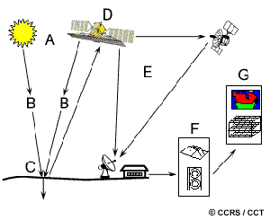{#fig-rsprocess fig-align="center" out-width="80%"}

1. **Fuente de energía o iluminación (A):** Elemento que proporciona la energía electromagnética al objetivo.
2. **Radiación y atmósfera (B):** Interacción de la energía con los gases y partículas atmosféricas durante su trayectoria desde la fuente al objetivo, y del objetivo al sensor.
3. **Interacción con el objetivo (C):** Respuesta de la superficie terrestre a la energía incidente, dependiente de las propiedades físicas, químicas y biológicas del material.
4. **Registro de energía por el sensor (D):** Dispositivo remoto que capta y cuantifica la radiación electromagnética dispersada o emitida.
5. **Transmisión, recepción y procesamiento (E):** Envío electrónico de los datos capturados a estaciones terrestres para su conversión a formato digital o análogo.
6. **Interpretación y análisis (F):** Extracción de atributos relevantes de la imagen procesada mediante métodos visuales o digitales.
7. **Aplicación (G):** Uso de la información derivada para la toma de decisiones, resolución de problemas o modelamiento geoespacial.

## Radiación electromagnética

El primer requisito operativo de la percepción remota pasiva es disponer de una fuente de iluminación que emita energía en forma de radiación electromagnética (típicamente, el Sol).

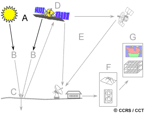{#fig-rsenergy fig-align="center" out-width="60%"}

Esta radiación se rige por los principios de la teoría ondulatoria, componiéndose de un campo eléctrico ($E$) y un campo magnético ($M$) ortogonales entre sí, que se desplazan a la velocidad de la luz ($c$).

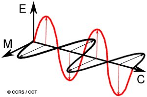{#fig-electromag fig-align="center" out-width="70%"}

El comportamiento y categorización de esta radiación dependen de dos propiedades físicas fundamentales: la **longitud de onda** ($\lambda$) y la **frecuencia** ($\nu$). La longitud de onda es la distancia entre dos crestas consecutivas de la onda (medida habitualmente en micrómetros, $\mu m$, o nanómetros, $nm$), mientras que la frecuencia representa el número de ciclos ondulatorios que atraviesan un punto fijo por unidad de tiempo (medida en Hertz, $Hz$).

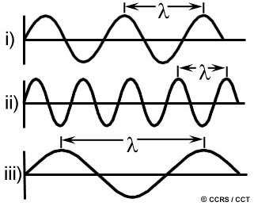{#fig-wvfreq fig-align="center" out-width="60%"}

Ambas variables mantienen una relación inversamente proporcional descrita por la ecuación de la velocidad de la luz:

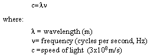{#fig-equate1e fig-align="center" out-width="30%"}

A menor longitud de onda, mayor será la frecuencia, y viceversa. Comprender esta relación es fundamental para discriminar espectralmente las cubiertas terrestres.

## Espectro electromagnético

El espectro electromagnético clasifica el continuo de energía desde las ondas más cortas (rayos gamma) hasta las más largas (ondas de radio). En percepción remota, solo regiones específicas poseen utilidad práctica.

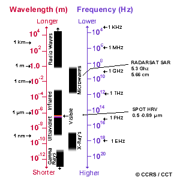{#fig-waveleng fig-align="center" out-width="80%"}

### Región ultravioleta (UV)

Es la porción de ondas más cortas aprovechables (inmediatamente inferiores al violeta). Ciertos materiales de la superficie, principalmente asociaciones litológicas y minerales, exhiben fluorescencia bajo iluminación UV, permitiendo su detección.

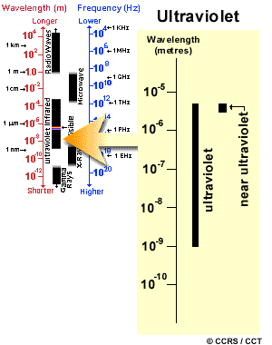{#fig-ultravio fig-align="center" out-width="50%"}

### Espectro visible

Comprende las longitudes de onda detectables por el sistema visual humano (aprox. 0.4 $\mu m$ a 0.7 $\mu m$). Aunque constituye una fracción minúscula del espectro electromagnético total, es la única región asociada a la percepción del color.

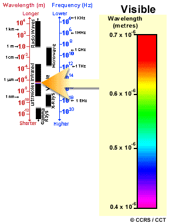{#fig-visible fig-align="center" out-width="50%"}

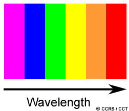{#fig-colours fig-align="center" out-width="40%"}

Los colores azul, verde y rojo actúan como colores primarios espectrales. La luz solar, al refractarse a través de un prisma, revela esta composición al curvar cada longitud de onda en un ángulo distinto.

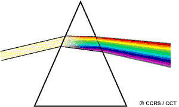{#fig-prism fig-align="center" out-width="50%"}

### Región infrarroja (IR)

Abarca desde aprox. 0.7 $\mu m$ hasta 100 $\mu m$. Se divide funcionalmente en dos categorías:

* **Infrarrojo reflejado (NIR y SWIR):** Rango de 0.7 $\mu m$ a 3.0 $\mu m$. Se comporta físicamente de manera similar a la luz visible y registra energía solar reflejada.
* **Infrarrojo térmico (TIR):** Rango de 3.0 $\mu m$ a 100 $\mu m$. Registra la energía emitida diferencialmente por la Tierra en forma de calor (radiancia térmica).

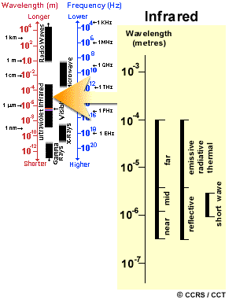{#fig-infrared fig-align="center" out-width="50%"}

### Región de microondas

Cubriendo longitudes de onda desde 1 $mm$ hasta 1 $m$, esta región es de creciente interés geomático debido a su capacidad de penetración atmosférica, siendo la base tecnológica de sistemas de radar.

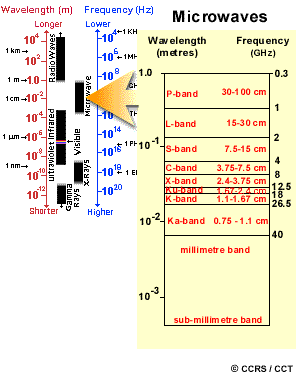{#fig-microwve fig-align="center" out-width="50%"}

## Interacciones con la atmósfera

La atmósfera terrestre modifica intrínsecamente la señal electromagnética a través de procesos de dispersión y absorción.

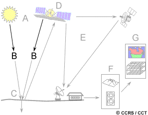{#fig-rsatmosph fig-align="center" out-width="60%"}

### Dispersión (Scattering)

Es la desviación de la trayectoria original de la radiación provocada por gases y partículas. Depende directamente de la longitud de onda y la abundancia del particulado.

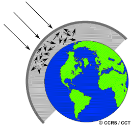{#fig-atmsct fig-align="center" out-width="60%"}

* **Dispersión de Rayleigh:** Ocurre cuando el diámetro de las partículas es menor que la longitud de onda. Es el mecanismo dominante en las capas altas de la atmósfera, afectando severamente a las ondas cortas (ej. luz azul). Explica por qué, al amanecer y atardecer, la radiación debe recorrer una mayor distancia atmosférica, filtrando casi toda la onda corta y permitiendo solo la llegada de luz rojiza a la superficie.

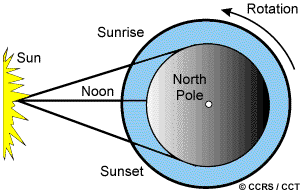{#fig-sunset fig-align="center" out-width="50%"}

* **Dispersión de Mie:** Producida por aerosoles (polvo, humo, vapor) con tamaños comparables a la longitud de onda incidente. Afecta típicamente longitudes de onda mayores en la baja atmósfera.
* **Dispersión no selectiva:** Originada por macropartículas (como gotas de agua) mucho más grandes que la radiación incidente. Dispersa todas las longitudes de onda visibles uniformemente, razón por la cual las nubes resultan visualmente blancas.

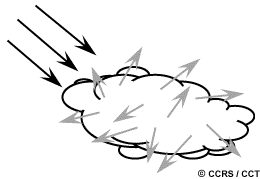{#fig-cloud fig-align="center" out-width="50%"}

### Absorción y ventanas atmosféricas

Determinados gases (ozono, dióxido de carbono y vapor de agua) retienen o absorben selectivamente la energía incidente. 

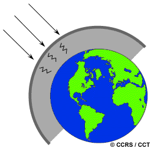{#fig-atmabsorb fig-align="center" out-width="60%"}

Los dominios espectrales donde la atmósfera presenta alta transmitancia (no absorbe significativamente la energía) se definen como **ventanas atmosféricas**. Los sistemas satelitales están calibrados de manera precisa para operar en coincidencia con estas ventanas operativas.

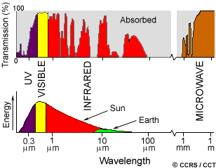{#fig-atmwind fig-align="center" out-width="80%"}

## Interacciones radiación-objetivo

La energía que logra franquear la atmósfera interactúa con los materiales terrestres a través de proporciones específicas de tres mecanismos: **Absorción (A)**, **Transmisión (T)** y **Reflexión (R)**.

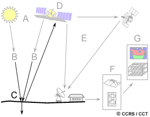{#fig-rsinterac fig-align="center" out-width="50%"}

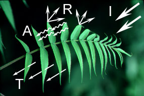{#fig-intract fig-align="center" out-width="60%"}

El registro teledetectado se enfoca empíricamente en la energía reflejada. Las propiedades de esta reflexión oscilan entre dos modelos teóricos dependiendo de la rugosidad de la superficie frente a la longitud de onda:

* **Reflectancia especular:** La energía se redirige direccionalmente en forma de espejo (superficies lisas).
* **Reflectancia difusa (lambertiana):** La energía se dispersa de forma isotrópica o uniforme (superficies rugosas). En el ámbito natural, este es el patrón predominante y deseable.

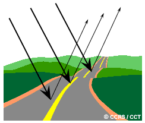{#fig-speclar fig-align="center" out-width="48%"}
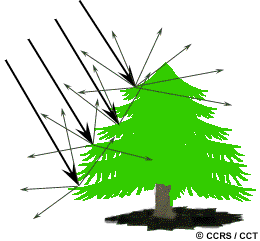{#fig-diffus fig-align="center" out-width="48%"}

### Ejemplos de respuesta material

* **Vegetación:** La clorofila induce una fuerte absorción en el rojo y azul, reflejando el verde en el espectro visible. Simultáneamente, la estructura mesófila interna actúa como un poderoso reflector difuso en el infrarrojo cercano (NIR). El contraste entre la alta reflectancia NIR y baja reflectancia roja es el pilar de los índices de vegetación modernos.

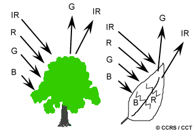{#fig-trees fig-align="center" out-width="60%"}

* **Agua:** Absorbe abruptamente las longitudes de onda del infrarrojo cercano, confiriéndole en estas bandas tonos oscuros, ideales para delinear litorales. En el visible, la presencia de sedimentos incrementa la reflectancia general, mientras que el plancton desplaza la respuesta pico hacia el verde.

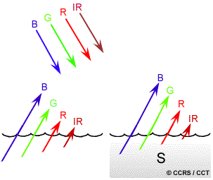{#fig-water fig-align="center" out-width="60%"}

La recopilación de la magnitud de reflectancia a través de diversas longitudes de onda conforma la **firma espectral**. El análisis multiespectral radica en comparar firmas para discriminar taxones de cobertura o tipologías geológicas.

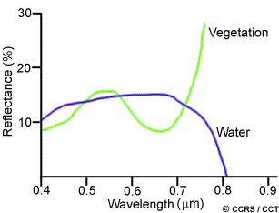{#fig-spectrl fig-align="center" out-width="80%"}

## Sensores pasivos y activos

Acorde al mecanismo de obtención de iluminación, la teledetección se divide en dos tipologías principales:

* **Sensores pasivos:** Se limitan a registrar la radiación electromagnética preexistente en la naturaleza, ya sea luz solar reflejada (operatividad diurna) o radiación térmica emitida espontáneamente por los cuerpos térmicos superficiales.

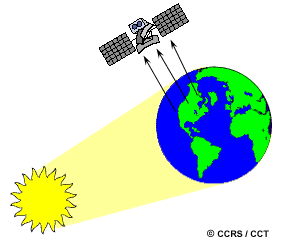{#fig-passiv fig-align="center" out-width="60%"}

* **Sensores activos:** Incorporan su propio emisor de energía dirigida al objetivo, registrando el grado de retrodispersión térmica o lumínica resultante (backscatter). Estos instrumentos (ej. Radar SAR o LiDAR) superan las limitaciones climáticas y de la iluminación natural diurna.

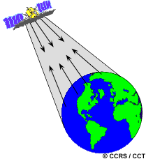{#fig-sensors fig-align="center" out-width="60%"}

## Características de las imágenes

Existe una distinción metodológica crítica entre los términos "fotografía" e "imagen":

* **Fotografía:** Es una plasmación pictórica, obtenida sobre emulsiones fotoquímicas analógicas directas, frecuentemente limitadas al rango visible e infrarrojo próximo.
* **Imagen:** Es el término integrador genérico referido a representaciones bidimensionales originadas electrónica o digitalmente desde cualquier porción del espectro electromagnético.

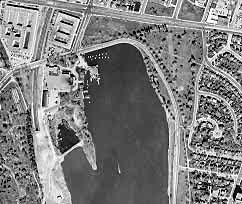{#fig-photo fig-align="center" out-width="50%"}

Las imágenes digitales se estructuran como mallas matriciales regulares (raster). Cada celda unitaria, conocida como **píxel** (picture element), almacena un Nivel Digital (ND) directamente correlacionado con la radiancia de la porción terrestre muestreada.

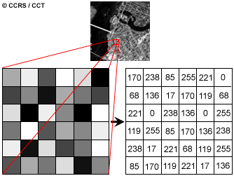{#fig-pixel fig-align="center" out-width="50%"}

Los datos multiespectrales se codifican en agrupaciones espectrales estrechas llamadas **bandas** o canales. Mientras la representación visual de una única banda produce imágenes monocromáticas (escala de grises), la asignación simultánea de tres bandas a los cañones de color RGB del monitor genera **imágenes de composición en color**, elevando exponencialmente la capacidad interpretativa humana.

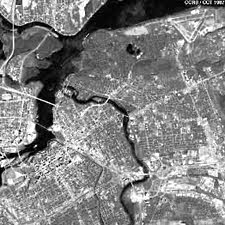{#fig-ottbw fig-align="center" out-width="48%"}
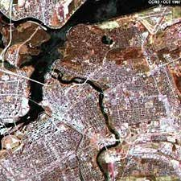{#fig-ottclr fig-align="center" out-width="48%"}