> **Fuente original:** [Natural Resources Canada - Remote Sensing Tutorials](https://natural-resources.canada.ca/science-data/science-research/geomatics/remote-sensing/tutorial-fundamentals-remote-sensing)

## Introducción a plataformas y sensores

Para que un sensor pueda captar y registrar la energía reflejada o emitida por un objetivo, debe estar alojado en una **plataforma** estable, aislada de la superficie observada. Estas plataformas pueden situarse en la superficie terrestre, en la atmósfera o en el espacio.

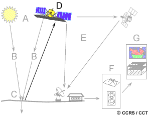{#fig-rsrecord fig-align="center" out-width="70%"}

* **Plataformas terrestres:** Se emplean frecuentemente para caracterizar detalladamente el comportamiento espectral de las coberturas. Esta información ("verdad terreno") es vital para calibrar y validar los datos capturados por sensores aéreos y espaciales.

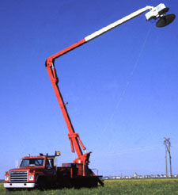{#fig-grdsens fig-align="center" out-width="50%"}

* **Plataformas aéreas:** Los aviones de ala fija son las plataformas atmosféricas más utilizadas. Facilitan la captura de imágenes de alta resolución espacial y permiten una planificación flexible y oportuna sobre cualquier área.

{#fig-convair fig-align="center" out-width="50%"}

* **Plataformas espaciales:** La percepción remota espacial se realiza desde el transbordador espacial o, mayoritariamente, desde satélites, los cuales permiten una cobertura sistemática, repetitiva y global de la superficie terrestre.

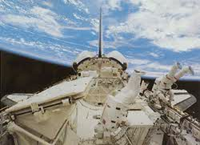{#fig-shuttle fig-align="center" out-width="50%"}
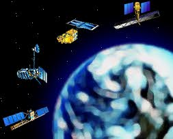{#fig-satels fig-align="center" out-width="50%"}

## Características orbitales y franjas de barrido

La trayectoria que sigue un satélite se denomina **órbita**. Su diseño está estrictamente ligado a las capacidades del sensor y los objetivos de la misión.

* **Órbitas geoestacionarias:** Situadas a gran altitud (aprox. 36,000 km), su velocidad angular coincide con la rotación de la Tierra. El satélite permanece estacionario sobre un punto fijo, lo que permite la observación continua de un mismo hemisferio. 

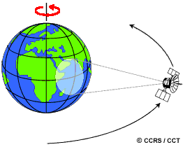{#fig-geostation fig-align="center" out-width="50%"}

* **Órbitas casi polares (Near-polar):** Siguen una trayectoria predominante de norte a sur. Al combinarse con la rotación terrestre, logran cobertura global. Comúnmente son **heliosincrónicas**, garantizando que el satélite sobrevuele cada latitud a la misma hora solar local para mantener condiciones de iluminación consistentes.

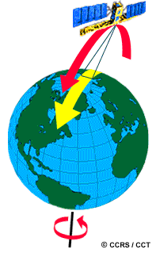{#fig-nearpolar fig-align="center" out-width="50%"}

El trayecto de sur a norte se denomina **paso ascendente**, mientras que el trayecto de norte a sur es el **paso descendente**. Los sensores ópticos pasivos operan casi exclusivamente durante los pases descendentes (lado diurno).

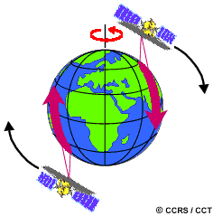{#fig-ascdesc fig-align="center" out-width="50%"}

El área terrestre interceptada por el sensor se conoce como **franja de barrido** (*swath*). La rotación terrestre bajo la órbita permite que cada pase barra un área diferente.

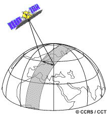{#fig-swath fig-align="center" out-width="50%"}
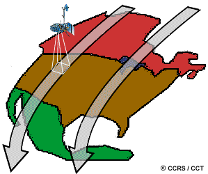{#fig-orbit fig-align="center" out-width="50%"}

En órbitas casi polares, el traslape (*overlap*) entre franjas adyacentes aumenta conforme la órbita se acerca a los polos.

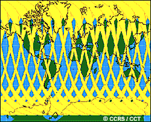{#fig-overlap fig-align="center" out-width="50%"}

## Resolución espacial, tamaño de píxel y escala

La resolución espacial para sensores pasivos se deriva del **Campo de Visión Instantáneo (IFOV)**, que corresponde al cono angular de visibilidad del instrumento en un instante dado.

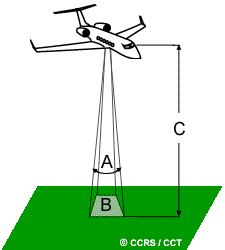{#fig-fieldview fig-align="center" out-width="60%"}

Es imperativo diferenciar entre *tamaño de píxel* (unidad bidimensional de la imagen digital) y *resolución espacial* (característica física del hardware). 

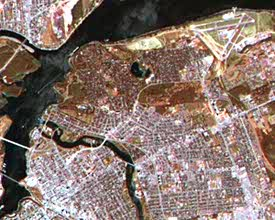{#fig-corsres fig-align="center" out-width="48%"}
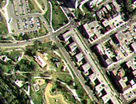{#fig-fineres fig-align="center" out-width="48%"}

La **escala** denota la relación matemática entre una dimensión en la imagen y su magnitud real en el terreno.

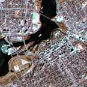{#fig-ottsat fig-align="center" out-width="48%"}
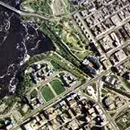{#fig-ottair fig-align="center" out-width="48%"}

## Resolución espectral y radiométrica

La **resolución espectral** define la capacidad del sensor para segmentar el espectro electromagnético en intervalos estrechos. Los sensores hiperespectrales logran registrar cientos de bandas continuas para caracterizaciones moleculares y mineralógicas precisas.

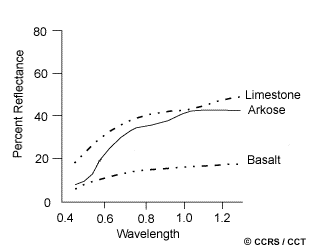{#fig-rockcrve fig-align="center" out-width="60%"}

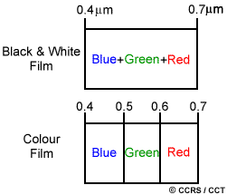{#fig-specrese fig-align="center" out-width="70%"}

La **resolución radiométrica** determina la sensibilidad a pequeñas variaciones de radiancia, la cual se cuantifica en bits. Una profundidad de 8 bits permite registrar 256 niveles de gris, ofreciendo mucho mayor contraste que imágenes de menores profundidades de bits.

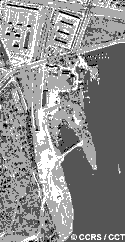{#fig-2bit fig-align="center" out-width="45%"}
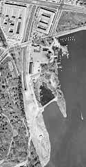{#fig-8bit fig-align="center" out-width="45%"}

## Resolución temporal

La **resolución temporal** indica la frecuencia con la que se registra un objetivo geográfico. Plataformas con sensores orientables o apuntables (*off-nadir*) reducen drásticamente los periodos de revisita.

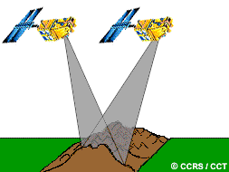{#fig-spotpoint fig-align="center" out-width="60%"}

## Cámaras, fotografía aérea y escaneo

Las cámaras aéreas de encuadre capturan simultáneamente una porción bidimensional del terreno, ya sea en película pancromática o en falso color infrarrojo.

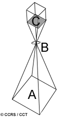{#fig-camera fig-align="center" out-width="50%"}

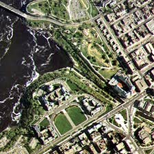{#fig-normal fig-align="center" out-width="48%"}
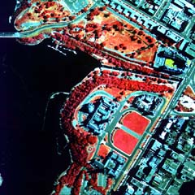{#fig-falsecolor fig-align="center" out-width="48%"}

Las adquisiciones pueden ser oblicuas o verticales, integrándose en líneas de vuelo con alto traslape para habilitar estudios estereoscópicos.

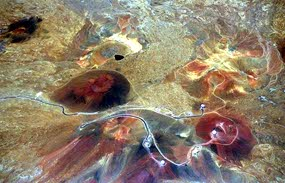{#fig-obliquept fig-align="center" out-width="60%"}
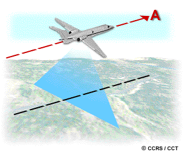{#fig-flightline fig-align="center" out-width="60%"}
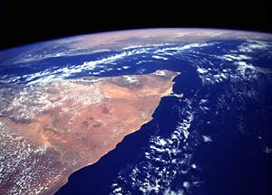{#fig-shtlpho fig-align="center" out-width="50%"}

En teledetección satelital, predominan los **sistemas de escaneo multiespectral**:
* **Barrido transversal (Across-track/Whiskbroom):** Un espejo oscilante desvía la energía pixel a pixel.
* **Empuje lineal (Along-track/Pushbroom):** Un arreglo lineal de detectores captura una fila completa simultáneamente, eliminando partes móviles e incrementando el tiempo de integración.

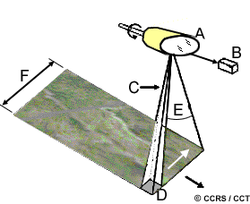{#fig-acrsstrack fig-align="center" out-width="48%"}
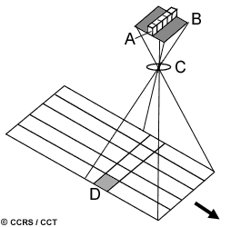{#fig-alngtrk fig-align="center" out-width="48%"}

## Imágenes térmicas y distorsión geométrica

Los sensores térmicos detectan la emisión infrarroja natural de las superficies. Las representaciones gráficas de temperatura aparente se denominan **termogramas**.

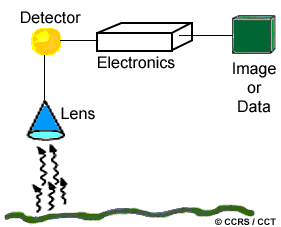{#fig-thermal fig-align="center" out-width="50%"}
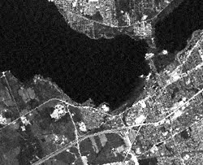{#fig-thermogram fig-align="center" out-width="60%"}

Durante la adquisición, las imágenes sufren distorsiones como el **desplazamiento por relieve** (efecto de paralelaje respecto al nadir) y distorsiones tangenciales propias de la cinemática del sensor.

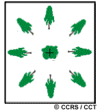{#fig-reliefdis fig-align="center" out-width="48%"}
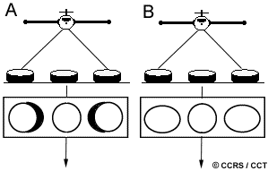{#fig-geomdis fig-align="center" out-width="48%"}

## Satélites meteorológicos

Las aplicaciones meteorológicas constituyeron uno de los primeros usos civiles de la percepción remota. Estos satélites se caracterizan por coberturas espaciales sumamente amplias (resolución espacial baja a moderada) pero con muy altas frecuencias temporales.

* **Sistemas Geoestacionarios (ej. GOES):** Proveen vistas hemisféricas constantes. Son críticos para la identificación de dinámica atmosférica rápida y ciclones tropicales.

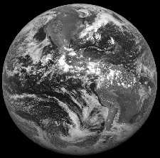{#fig-fulldsk fig-align="center" out-width="50%"}
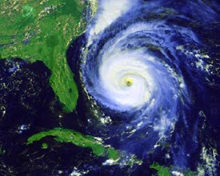{#fig-goesvw fig-align="center" out-width="50%"}

* **Sistemas Casi-polares (ej. NOAA AVHRR):** El sensor AVHRR opera sobre un *swath* de casi 3000 km. Aunque concebido para el monitoreo del clima y la temperatura superficial del mar, ha resultado indispensable para derivar índices regionales de vegetación y generar mosaicos de usos del suelo a escala continental.

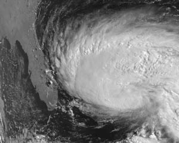{#fig-noaacld fig-align="center" out-width="60%"}
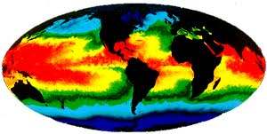{#fig-noaasst fig-align="center" out-width="48%"}
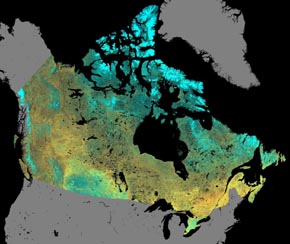{#fig-mosaic fig-align="center" out-width="48%"}

## Satélites de observación terrestre

Orientados al mapeo de precisión y la gestión de recursos naturales, estos sistemas ofrecen resoluciones espaciales finas en detrimento de la resolución temporal (debido a barridos más estrechos).

* **Landsat:** Operado históricamente por NASA y NOAA, instituyó el monitoreo terrestre con los sensores MSS (Multispectral Scanner) y posteriormente el Thematic Mapper (TM). TM introdujo resolución de 30 m, mayores anchos de banda, canales en el SWIR y cuantificación a 8 bits.

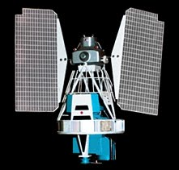{#fig-landsat2 fig-align="center" out-width="40%"}
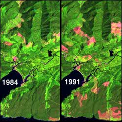{#fig-forestchg fig-align="center" out-width="50%"}

* **SPOT:** Desarrollado por el CNES francés. Fue pionero en emplear tecnología "pushbroom" y en permitir la orientación lateral de sus sensores HRV (High Resolution Visible). Esto habilitó la recolección estéreo para derivar Modelos Digitales de Elevación (DEM) y mejoró los tiempos de revisita bajo demanda.

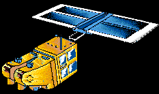{#fig-spot fig-align="center" out-width="40%"}
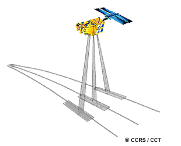{#fig-spotoff fig-align="center" out-width="50%"}
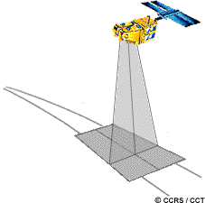{#fig-spotadj fig-align="center" out-width="50%"}
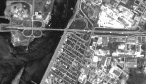{#fig-spotmap fig-align="center" out-width="60%"}

## Satélites de observación marina

Los océanos exigen sensores calibrados para rangos de reflectancia muy bajos y anchos de banda extremadamente finos, necesarios para penetrar la columna de agua y evaluar variables físico-químicas.

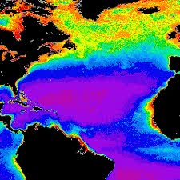{#fig-czcsclr fig-align="center" out-width="50%"}

Misiones como Nimbus-7 (sensor CZCS) y SeaStar (sensor SeaWiFS) fueron diseñadas específicamente para medir la absorción de clorofila y la dinámica del fitoplancton oceánico, parámetros fundamentales para modelar la producción primaria y el ciclo del carbono a nivel planetario.

## Otros sensores y plataformas

El espectro de sensores se complementa con tecnologías de mayor especialidad o basadas en plataformas sub-orbitales:

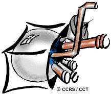{#fig-othsensors fig-align="center" out-width="50%"}

* **Sistemas Láser y LiDAR:** Instrumentos activos que emiten pulsos de energía fotónica para determinar distancias milimétricas y generar perfiles tridimensionales (ej. canopeo forestal, batimetría somera). Los fluorosensores láser inducen y leen emisiones reactivas útiles en el control de vertidos marinos de hidrocarburos.
* **RADAR:** Sensores activos de microondas que proveen datos independientemente de la cobertura nubosa o la luz diurna, vitales para interferometría geomorfológica o control de hielos.

## Recepción, transmisión y procesamiento de datos

Los satélites de observación terrestre operan bajo una logística rigurosa para enviar los ingentes volúmenes de datos a la superficie.

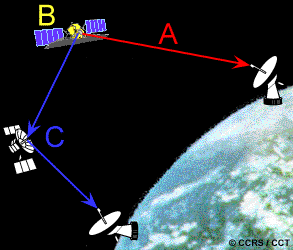{#fig-transmit fig-align="center" out-width="60%"}

La transmisión de telemetría (downlink) puede ejecutarse de tres modos: 
1. **Transmisión directa:** Ejecutada en tiempo real hacia una Estación Receptora Terrestre (GRS) dentro del radio visual del satélite.
2. **Registro a bordo:** Los datos se graban temporalmente en sistemas de estado sólido internos hasta alcanzar el alcance de una estación de control.
3. **Satélites de retransmisión:** Constelaciones como TDRSS interceptan la señal en órbitas altas y la retransmiten globalmente a tierra sin interrupciones geográficas.

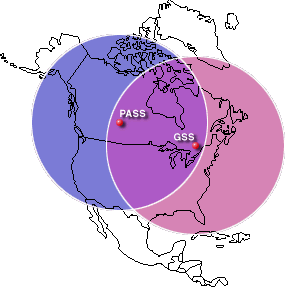{#fig-gat_pass fig-align="center" out-width="60%"}

Tras la recepción, los datos son convertidos desde su formato radiométrico original a productos estructurados de uso final, aplicando rectificaciones paramétricas. A nivel operativo, las estaciones suelen generar vistas previas de baja resolución (*quick-looks*) y procesamientos en tiempo casi real orientados a respuestas de emergencia, como navegación en mares congelados o combate de incendios.