> **Fuente original:** [Natural Resources Canada - Remote Sensing Tutorials](https://natural-resources.canada.ca/science-data/science-research/geomatics/remote-sensing/tutorial-fundamentals-remote-sensing)

## Introducción a la percepción remota por microondas

La región de microondas del espectro electromagnético abarca longitudes de onda desde aproximadamente 1 centímetro hasta 1 metro. Su mayor ventaja radica en la capacidad de penetrar casi cualquier condición atmosférica. Al ser ondas sustancialmente más largas que las partículas atmosféricas (polvo, lluvia o nieve), no sufren dispersión severa, operando eficazmente bajo cobertura nubosa total.

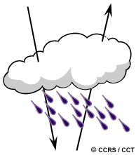{#fig-mwrad fig-align="center" out-width="60%"}

* **Sistemas pasivos:** Detectan la escasa radiación natural de microondas emitida por la Tierra. Dada la baja energía, requieren antenas grandes y operan con resoluciones espaciales bajas. Se aplican en meteorología (perfiles atmosféricos), hidrología (humedad del suelo) y oceanografía (hielo marino).

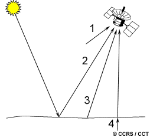{#fig-passmw fig-align="center" out-width="60%"}

* **Sistemas activos:** Emiten su propia energía (pulsos) hacia la superficie y miden la retrodispersión (*backscatter*). Al generar su iluminación, son completamente independientes de la luz solar o la energía térmica terrestre.

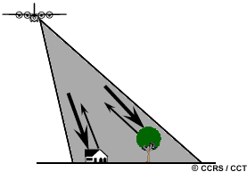{#fig-actvmw fig-align="center" out-width="60%"}

## Fundamentos del radar

**RADAR** (RAdio Detection And Ranging) emite breves pulsos de energía enfocados direccionalmente. Mide el tiempo de retardo entre la emisión y la recepción del eco para determinar la distancia (rango) al objetivo, y la intensidad del eco para caracterizarlo.

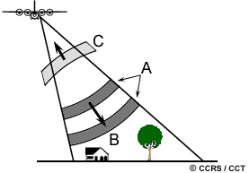{#fig-radar fig-align="center" out-width="60%"}

El espectro se subdivide en bandas (Ka, X, C, S, L, P). La elección de la banda define la interacción: bandas largas (L, P) penetran el dosel forestal; bandas cortas (X, C) interactúan con el ápice foliar o superficies expuestas.

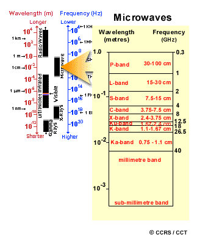{#fig-image2_en fig-align="center" out-width="70%"}

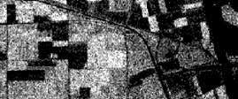{#fig-wavcomp1 fig-align="center" out-width="48%"}
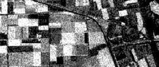{#fig-wavcomp2 fig-align="center" out-width="48%"}

La **polarización** (orientación del campo eléctrico) es crítica. Los pulsos pueden transmitirse y recibirse horizontal (H) o verticalmente (V), generando polarizaciones equivalentes (HH, VV) o cruzadas (HV, VH). Cada combinación ofrece respuestas únicas del terreno.

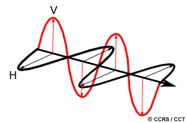{#fig-polari fig-align="center" out-width="50%"}

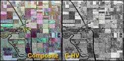{#fig-polar1 fig-align="center" out-width="48%"}
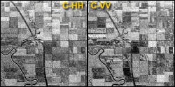{#fig-polar2 fig-align="center" out-width="48%"}

## Geometría de visión y resolución espacial

El radar posee una geometría de visión lateral (*side-looking*).
* **Azimut:** Dirección paralela al avance de la plataforma.
* **Rango:** Dirección transversal y ortogonal al avance.

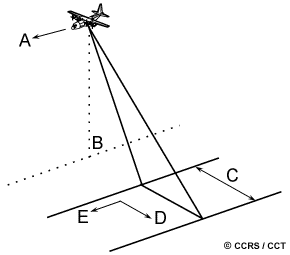{#fig-radgeom fig-align="center" out-width="60%"}

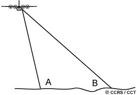{#fig-range fig-align="center" out-width="50%"}

El **ángulo de incidencia** se forma entre el haz y la normal del terreno. El radar mide directamente la distancia en **rango oblicuo** (*slant range*), que difiere geométricamente de la proyección horizontal real en el terreno (*ground range*).

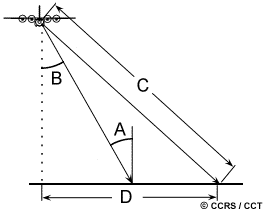{#fig-incangl fig-align="center" out-width="60%"}

La resolución espacial del radar es bidimensional:
1. **Resolución en rango:** Depende de la longitud del pulso. Objetos muy cercanos en la dirección transversal se confunden si su separación es menor a la mitad de dicha longitud.

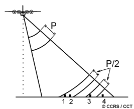{#fig-rangres fig-align="center" out-width="50%"}

2. **Resolución en azimut:** Dictada por la amplitud angular del haz. Físicamente, requeriría antenas kilométricas en el espacio para mantener resolución a grandes distancias. 

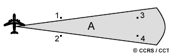{#fig-azimres fig-align="center" out-width="50%"}

Para resolver esto, se emplea el **Radar de Apertura Sintética (SAR)**, que registra el historial Doppler del eco mientras la plataforma avanza, simulando matemáticamente una antena de inmensa longitud y logrando resoluciones finas y uniformes.

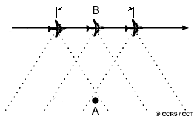{#fig-sar fig-align="center" out-width="60%"}

## Distorsiones geométricas

La reconstrucción desde el tiempo de vuelo hacia la imagen induce severas distorsiones debido a la topografía:

* **Distorsión de rango oblicuo:** Comprime artificialmente la escala en la zona cercana de la imagen.

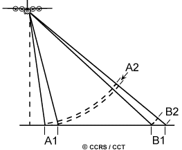{#fig-slntdis fig-align="center" out-width="50%"}

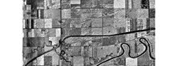{#fig-slant1 fig-align="center" out-width="48%"}
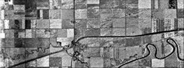{#fig-slant2 fig-align="center" out-width="48%"}

* **Escorzo (*Foreshortening*):** Las laderas enfrentadas al sensor devuelven el eco prematuramente, acortándose drásticamente en la imagen y viéndose muy brillantes.

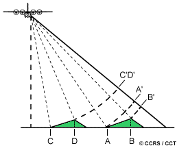{#fig-forshrt fig-align="center" out-width="48%"}
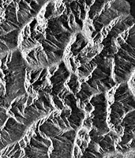{#fig-iforshrt fig-align="center" out-width="48%"}

* **Abatimiento (*Layover*):** Caso extremo donde la cima de la montaña refleja la señal antes que la base, provocando que el relieve parezca "caer" hacia el sensor.

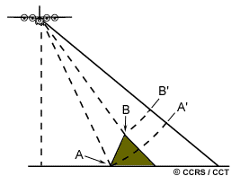{#fig-layover fig-align="center" out-width="48%"}
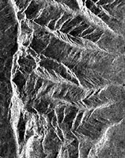{#fig-ilayovr fig-align="center" out-width="48%"}

* **Sombra (*Shadow*):** Zonas tras el relieve (pendientes de espaldas) donde el haz no logra iluminar, resultando en áreas completamente negras (sin datos).

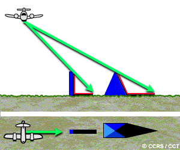{#fig-newshadow fig-align="center" out-width="48%"}
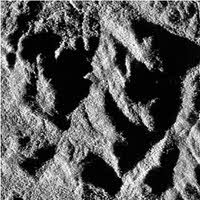{#fig-ishadow fig-align="center" out-width="48%"}

## Interacción con el objetivo y apariencia

La retrodispersión SAR depende de tres variables críticas:

1. **Rugosidad superficial:** En relación a la longitud de onda. Superficies lisas (agua, vías) generan reflexión especular (oscuras); superficies rugosas (bosques) generan dispersión difusa (brillantes).

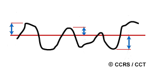{#fig-surfrgh fig-align="center" out-width="50%"}

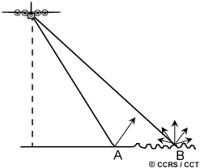{#fig-specdif fig-align="center" out-width="50%"}

2. **Relación geométrica:** Evaluada mediante el ángulo de incidencia local. Las geometrías a 90° (estructuras urbanas) actúan como **reflectores de esquina**, retornando toda la energía en un destello brillante. La orientación del terreno respecto al haz (dirección de mirada) altera radicalmente el contraste.

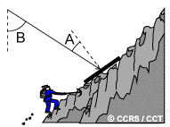{#fig-localin fig-align="center" out-width="48%"}
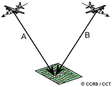{#fig-lookdir fig-align="center" out-width="48%"}

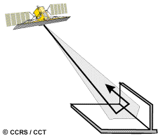{#fig-corner fig-align="center" out-width="48%"}
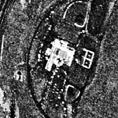{#fig-sarcity fig-align="center" out-width="48%"}

3. **Humedad (constante dieléctrica):** La humedad incrementa la reflectividad radar. En condiciones extremadamente secas, la microonda puede penetrar la superficie, revelando estructuras subsuperficiales u originando interacciones de **volumen** (como el rebote múltiple dentro del follaje de un bosque).

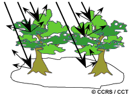{#fig-volume fig-align="center" out-width="60%"}

## Propiedades de las imágenes

Las imágenes SAR exhiben un granulado característico llamado **Speckle**, derivado de la interferencia de ondas dentro de un píxel.

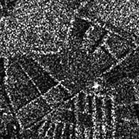{#fig-speckle fig-align="center" out-width="50%"}
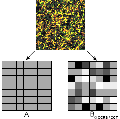{#fig-spkltar fig-align="center" out-width="50%"}

Para reducirlo, se utiliza el procesamiento **Multi-look** (promediando vistas durante la adquisición) o el **filtrado espacial** post-procesamiento (promedios locales que suavizan la imagen pero degradan levemente la resolución espacial).

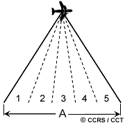{#fig-multilk fig-align="center" out-width="48%"}
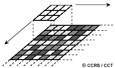{#fig-avgfltr fig-align="center" out-width="48%"}

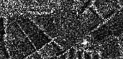{#fig-spklred1 fig-align="center" out-width="48%"}
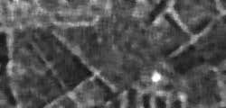{#fig-spklred2 fig-align="center" out-width="48%"}

Otros ajustes vitales incluyen la corrección del **patrón de antena** (para compensar la caída natural de energía en el rango lejano) y la **calibración absoluta**, esencial para convertir niveles digitales en valores de retrodispersión físicamente comparables.

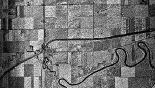{#fig-antpat fig-align="center" out-width="60%"}

## Aplicaciones avanzadas

* **Radargrametría (Estéreo SAR):** Uso de adquisiciones con ángulos solapados para visión tridimensional.

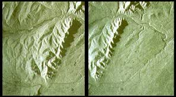{#fig-stereo2 fig-align="center" out-width="50%"}

* **Interferometría SAR (InSAR):** Explotación de la coherencia y diferencia de fase para mapeo topográfico y detección de subsidencia milimétrica.

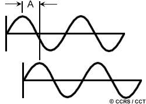{#fig-phsedif fig-align="center" out-width="48%"}
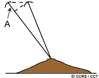{#fig-isar fig-align="center" out-width="48%"}

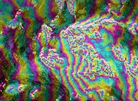{#fig-intrfer fig-align="center" out-width="48%"}
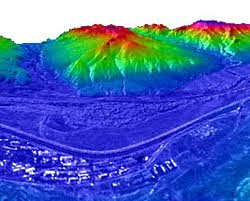{#fig-3dimg fig-align="center" out-width="48%"}

## Polarimetría de radar

Consiste en el análisis completo del estado de polarización de la onda dispersada. Radares totalmente polarimétricos adquieren y comparan fases y amplitudes de los 4 canales (HH, HV, VH, VV). 

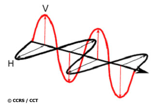{#fig-horizontal fig-align="center" out-width="50%"}

Esta síntesis permite derivar **firmas de polarización** e imágenes compuestas que potencian enormemente la capacidad algorítmica para discriminar cultivos, hielos marinos y texturas forestales.

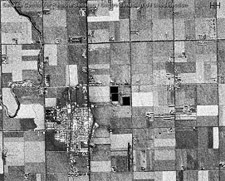{#fig-polhh fig-align="center" out-width="48%"}
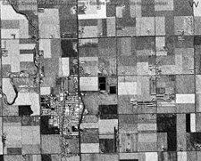{#fig-polvv fig-align="center" out-width="48%"}

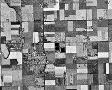{#fig-polhv fig-align="center" out-width="48%"}
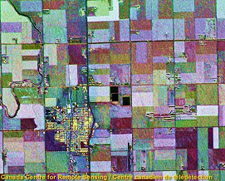{#fig-polcomp fig-align="center" out-width="48%"}

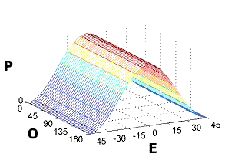{#fig-copolariz fig-align="center" out-width="48%"}
{#fig-crosspol fig-align="center" out-width="48%"}

## Sistemas de radar aero y espaciales

Los radares aerotransportados ofrecen agilidad, pero sus rangos de incidencia muy variables a través de la franja acentúan los artefactos. Los sistemas satelitales observan con ángulos consistentes desde grandes altitudes, garantizando geometría uniforme.

**Sistemas históricos y operativos destacados:**
* **Aéreos:** Convair-580 C/X (Canadá), sistemas STAR (hielo) y AirSAR de la NASA (L, P, C multi-polarizado).

{#fig-convair-rad fig-align="center" out-width="48%"}
{#fig-star2 fig-align="center" out-width="48%"}
{#fig-airsar fig-align="center" out-width="50%"}

* **Espaciales:** SEASAT (primer SAR civil), misiones europeas ERS-1/2, la japonesa JERS-1, y el avanzado sistema canadiense RADARSAT, con capacidad de direccionamiento de haz y modos escalables.

{#fig-seasat fig-align="center" out-width="48%"}
{#fig-ers fig-align="center" out-width="48%"}

{#fig-jers fig-align="center" out-width="48%"}
{#fig-rsat fig-align="center" out-width="48%"}

{#fig-rsatopt fig-align="center" out-width="60%"}