> **Fuente original:** [Natural Resources Canada - Remote Sensing Tutorials](https://natural-resources.canada.ca/science-data/science-research/geomatics/remote-sensing/tutorial-fundamentals-remote-sensing)

## Introducción al análisis de imágenes

La extracción de información a partir de datos teledetectados requiere analizar las interacciones de la energía electromagnética con las coberturas terrestres. El análisis implica la identificación y medición de objetivos mediante dos enfoques complementarios: la **interpretación visual** y el **procesamiento digital**.

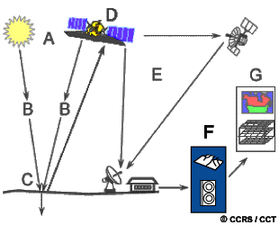{#fig-rs-intp fig-align="center" out-width="60%"}

* **Formato analógico (Interpretación Visual):** Aprovecha la capacidad del cerebro humano para reconocer patrones espaciales sobre imágenes pictóricas (impresas). Su limitación principal es la dificultad de evaluar simultáneamente múltiples bandas espectrales.

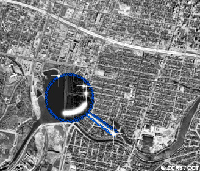{#fig-manual fig-align="center" out-width="50%"}

* **Formato digital (Procesamiento Informático):** Los sensores electrónicos registran la información como matrices de Niveles Digitales. El entorno digital permite procesar múltiples bandas de forma objetiva, realzar contrastes y clasificar grandes volúmenes de datos con rapidez.

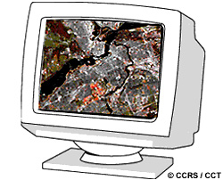{#fig-digital fig-align="center" out-width="50%"}

## Elementos de la interpretación visual

La interpretación humana se basa en el reconocimiento de siete elementos fundamentales que definen espacialmente las coberturas:

* **Tono:** Es el brillo relativo o color de los objetos. Sin variaciones de tono, sería imposible discernir formas o texturas.

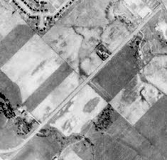{#fig-ton fig-align="center" out-width="50%"}

* **Forma:** Contornos regulares y rectilíneos denotan intervención antrópica (agricultura, vías), mientras que los irregulares caracterizan procesos naturales.

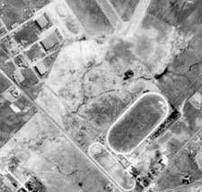{#fig-shape fig-align="center" out-width="50%"}

* **Tamaño:** Evaluado según la escala de la imagen, discrimina objetos funcionalmente similares pero jerárquicamente distintos (ej. fábricas vs. residencias).

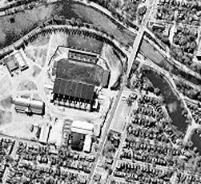{#fig-size fig-align="center" out-width="50%"}

* **Patrón:** La repetición espacial ordenada. Huertos o zonas urbanas muestran patrones estructurados, a diferencia de la distribución aleatoria silvestre.

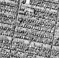{#fig-pattern fig-align="center" out-width="50%"}

* **Textura:** La frecuencia de variación tonal ("rugosidad"). Un bosque denso presenta textura rugosa, mientras que una pradera o el asfalto lucen lisos.

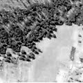{#fig-texture fig-align="center" out-width="50%"}

* **Sombra:** Ayuda a perfilar el relieve tridimensional y facilita la identificación de estructuras verticales, aunque oculta la radiometría de lo que cubre.

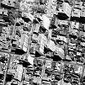{#fig-shadow fig-align="center" out-width="50%"}

* **Asociación:** Inferencia por contexto geográfico. Ej. zonas residenciales asociadas a escuelas, o embarcaciones asociadas a cuerpos de agua.

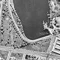{#fig-assoc fig-align="center" out-width="50%"}

## Procesamiento digital de imágenes

El procesamiento implica la manipulación de los valores radiométricos en estaciones de trabajo para facilitar la interpretación o la clasificación automática.

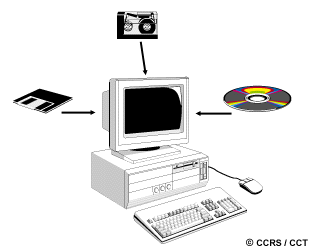{#fig-ias fig-align="center" out-width="60%"}

Se estructura en cuatro categorías:
1. **Pre-procesamiento:** Correcciones radiométricas y geométricas.
2. **Realce (*Enhancement*):** Optimización del contraste visual.
3. **Transformaciones:** Operaciones entre múltiples bandas.
4. **Clasificación y análisis:** Mapeo temático de la imagen.

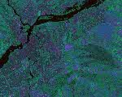{#fig-enhan1 fig-align="center" out-width="48%"}
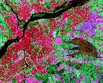{#fig-enhan2 fig-align="center" out-width="48%"}

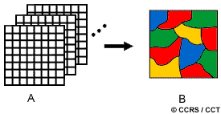{#fig-class fig-align="center" out-width="50%"}

## Pre-procesamiento

Busca corregir los errores introducidos por el sensor y la geometría de adquisición.

**Correcciones radiométricas:**
* **Mosaicos:** Corrige las variaciones de iluminación para poder unir sin costuras múltiples imágenes contiguas.

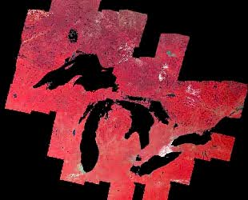{#fig-glakes fig-align="center" out-width="50%"}

* **Corrección atmosférica:** Resta los valores mínimos observados (ej. en sombras profundas o lagos claros) para eliminar el brillo añadido por la dispersión atmosférica.

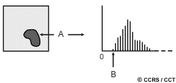{#fig-atmcorr fig-align="center" out-width="60%"}

* **Bandeado (*Striping*) y líneas perdidas:** El bandeado por descalibración de detectores se ecualiza; las líneas faltantes por fallos de registro se interpolan con los valores adyacentes.

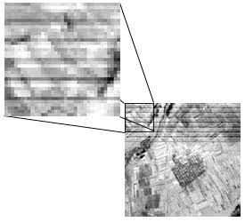{#fig-strip fig-align="center" out-width="48%"}
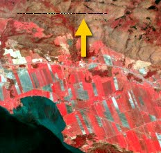{#fig-nois fig-align="center" out-width="48%"}

**Correcciones geométricas:**
Rectifican distorsiones para que la imagen concuerde con coordenadas reales. Requiere Puntos de Control Terrestre (GCP).

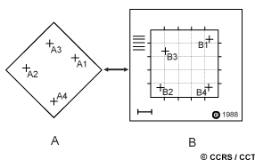{#fig-geomreg fig-align="center" out-width="60%"}

Para reubicar los valores en la nueva cuadrícula, se emplea el **remuestreo**:
1. **Vecino más cercano:** Conserva valores originales, pero produce bordes escalonados.
2. **Interpolación bilineal:** Promedia 4 píxeles cercanos.
3. **Convolución cúbica:** Promedia 16 píxeles, logrando la mejor estética visual.

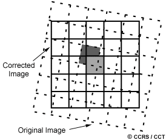{#fig-nnsamp fig-align="center" out-width="32%"}
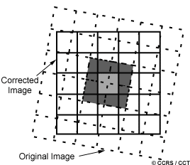{#fig-blsamp fig-align="center" out-width="32%"}
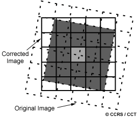{#fig-ccsamp fig-align="center" out-width="32%"}

## Realce de imágenes

Maximiza el contraste operando sobre el **histograma** de la imagen.

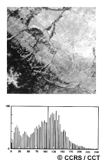{#fig-hstogrm fig-align="center" out-width="45%"}

* **Expansión de contraste lineal:** Estira los valores mínimo y máximo de la imagen cruda para que ocupen todo el rango dinámico de la pantalla.

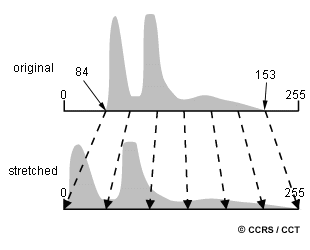{#fig-linstre fig-align="center" out-width="50%"}

* **Ecualización del histograma:** Redistribución no lineal que asigna más rango a los valores más frecuentes en la imagen, acentuando sutiles detalles locales.

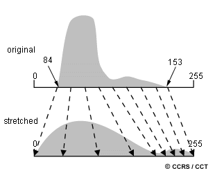{#fig-equalste fig-align="center" out-width="50%"}

**Filtrado espacial:**
Usa una ventana móvil para alterar la "frecuencia espacial". Los filtros **paso bajo** suavizan la imagen (útiles en radar). Los filtros **paso alto** acentúan bordes y estructuras finas.

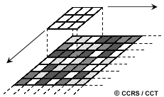{#fig-filter fig-align="center" out-width="50%"}

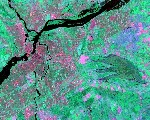{#fig-linear fig-align="center" out-width="48%"}
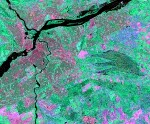{#fig-lowpass fig-align="center" out-width="48%"}

## Transformaciones de imágenes

Operaciones algebraicas sobre dos o más canales espectrales.
* **Sustracción de imágenes:** Resta los píxeles de imágenes de distintas fechas. Lo que no cambia tiende a gris medio; los cambios bruscos (ej. deforestación) quedan muy claros u oscuros.

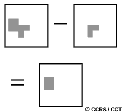{#fig-subtract fig-align="center" out-width="50%"}

* **Cálculo de cocientes (Ratioing):** Dividir una banda por otra reduce el efecto de las sombras por topografía abrupta. Permite derivar índices vitales como el **NDVI**, que evalúa el vigor fotosintético.

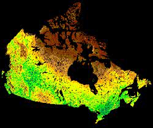{#fig-ndvi fig-align="center" out-width="50%"}

* **Análisis de Componentes Principales (PCA):** Condensa estadísticamente la información redundante de múltiples bandas en solo 2 o 3 nuevos "componentes" que capturan casi toda la varianza de la escena.

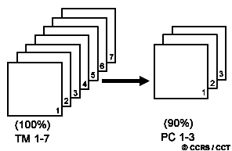{#fig-pca fig-align="center" out-width="50%"}

## Clasificación de imágenes y análisis

Convierte el continuo radiométrico en un mapa de unidades temáticas discretas.

* **Clasificación supervisada:** El analista entrena al algoritmo proporcionando "áreas de muestra" de coberturas conocidas. El sistema extrae las firmas estadísticas y clasifica el resto de la imagen según dichas firmas.

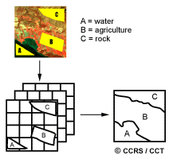{#fig-super-e fig-align="center" out-width="60%"}

* **Clasificación no supervisada:** Operación automática donde un algoritmo agrupa los píxeles en "clústeres" basándose exclusivamente en su distancia estadística. Posteriormente, el analista interpreta qué representa cada clúster.

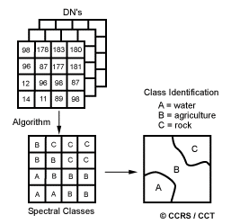{#fig-unsuper-e fig-align="center" out-width="60%"}

## Integración de datos y SIG

El análisis moderno requiere fusionar diversas fuentes georreferenciadas.

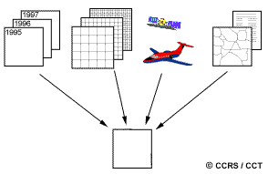{#fig-dataint fig-align="center" out-width="50%"}

Se puede integrar alta resolución espacial pancromática con multiespectral gruesa (ej. SPOT), o fusionar espectro óptico con textura de Radar SAR para potenciar la discriminación.

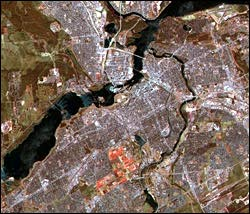{#fig-spotmrg fig-align="center" out-width="48%"}
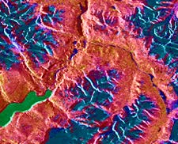{#fig-opt-sar fig-align="center" out-width="48%"}

Sumar Modelos Digitales de Elevación (DEM) permite compensar efectos topográficos y generar vistas en perspectiva 3D. 

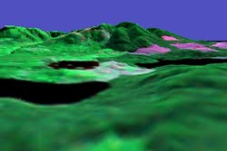{#fig-demview fig-align="center" out-width="50%"}

Todas estas tecnologías forman el corazón de los **Sistemas de Información Geográfica (SIG)**, estructurando el territorio en capas temáticas para permitir modelamientos y toma de decisiones integrales.

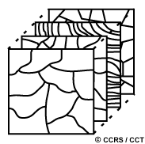{#fig-gis fig-align="center" out-width="50%"}