> **Fuente original:** [Natural Resources Canada - Remote Sensing Tutorials](https://natural-resources.canada.ca/science-data/science-research/geomatics/remote-sensing/tutorial-fundamentals-remote-sensing)

## Introducción a las aplicaciones

El diseño de un sensor satelital o aéreo está dictado fundamentalmente por su aplicación objetivo, lo que define sus parámetros de resolución espacial, espectral, radiométrica y temporal. 

Dado que la superficie terrestre es dinámica, a menudo un solo sensor no puede satisfacer todas las necesidades analíticas. El paradigma actual de la geomática se centra en la **integración** de datos, utilizando técnicas complementarias:
* **Multiespectral:** Explotación de diversas bandas para generar firmas espectrales precisas.
* **Multisensor:** Combinación de tecnologías, como fusionar el detalle topográfico/rugoso de un Radar de Apertura Sintética (SAR) con la riqueza química y reflectiva de un sensor óptico.
* **Multitemporal:** Análisis de series de tiempo para derivar variables de cambio, fenología o dinámica de desastres. Requiere el uso estricto de datos calibrados radiométricamente.

## Agricultura

La agricultura representa un pilar crítico en las economías globales. Su rentabilidad y viabilidad exigen un flujo de información constante sobre la salud de los cultivos, los rendimientos proyectados y las condiciones edafológicas. La percepción remota es la única tecnología capaz de proveer monitoreo sinóptico continuo desde la escala parcelaria hasta la continental.

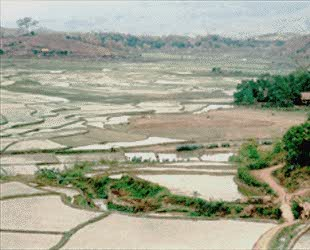{#fig-agric fig-align="center" out-width="50%"}
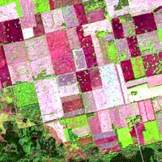{#fig-agrimag fig-align="center" out-width="50%"}

### Mapeo de tipos de cultivos

La identificación del tipo de cultivo en áreas extensas es fundamental para la gestión gubernamental y las proyecciones de mercado. Las diferencias en la arquitectura de la planta y sus pigmentos permiten su discriminación en el espectro visible e infrarrojo cercano. 

Sin embargo, debido a que muchos cultivos pueden lucir espectralmente idénticos en un momento dado, el mapeo se apoya fuertemente en aproximaciones **multitemporales**. Al registrar la parcela en múltiples fases de su ciclo fenológico (siembra, máximo verdor, senescencia y cosecha), el algoritmo de clasificación puede aislar especies basándose en su curva temporal de desarrollo. Asimismo, los sensores de microondas (radar) asisten en el mapeo en zonas con alta nubosidad al diferenciar la orientación de los surcos y la estructura geométrica del dosel del cultivo.

### Monitoreo de condiciones y rendimiento

Una vez identificados los cultivos, es imperativo evaluar su vigor. El estrés fisiológico (inducido por sequías, deficiencia de nutrientes, malezas o infestación de plagas) se manifiesta frecuentemente como una caída temprana en la reflectancia del infrarrojo cercano, antes de que el daño sea visible al ojo humano en el espectro visible (clorosis). 

La generación de Índices de Vegetación (como el NDVI) y el uso de sensores térmicos para modelar el estrés hídrico permiten a los gestores intervenir a tiempo mediante técnicas de **agricultura de precisión**, focalizando la irrigación y el uso de agroquímicos, maximizando así el rendimiento final de la cosecha.

## Silvicultura

Los ecosistemas forestales representan inmensos depósitos de biodiversidad, sumideros de carbono y recursos maderables. Monitorear áreas remotas o accidentadas requiere obligatoriamente observación satelital y aerotransportada.

### Identificación de especies y tipificación

La tipificación puede ir desde el reconocimiento regional de grandes biomas hasta inventarios detallados a escala de rodal (altura, densidad, biomasa). Las diferencias en la reflectancia foliar permiten separar coníferas de bosques caducifolios. 

Para estudios avanzados, el uso de datos **hiperespectrales** ofrece un nivel de resolución sin precedentes. Permite cuantificar no solo la especie, sino la densidad de los troncos y las anomalías bioquímicas causadas por plagas. Por su parte, en biomas de nubosidad perpetua (como las selvas tropicales), el Radar activo es la única herramienta operativa confiable para mapear la degradación del dosel.

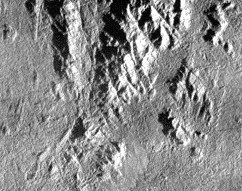{#fig-capsar fig-align="center" out-width="48%"}
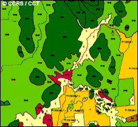{#fig-capmap fig-align="center" out-width="48%"}

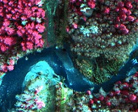{#fig-casiimag fig-align="center" out-width="50%"}
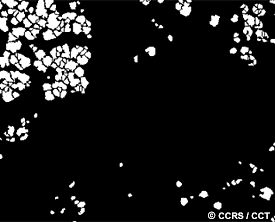{#fig-casiistem fig-align="center" out-width="48%"}
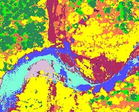{#fig-casiclas fig-align="center" out-width="48%"}

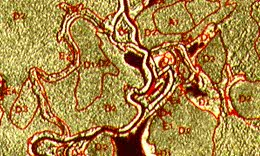{#fig-interp1 fig-align="center" out-width="50%"}

### Mapeo de áreas quemadas

El fuego es un agente de renovación, pero también de devastación. La teledetección interviene mediante sensores térmicos para el monitoreo logístico de incendios activos. Posteriormente, el mapeo de cicatrices de quema en el espectro óptico permite evaluar el perímetro afectado y la severidad del daño, información fundamental para estructurar planes de mitigación de erosión y reforestación.

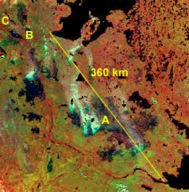{#fig-burn1a fig-align="center" out-width="50%"}

## Geología

La teledetección asiste a la exploración de hidrocarburos, la minería y el análisis de riesgos geotécnicos mediante el estudio de la litología superficial y la geomorfología.

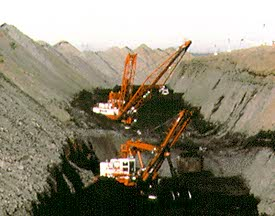{#fig-mine fig-align="center" out-width="50%"}

### Mapeo estructural y topográfico

Las estructuras como fallas y pliegues rigen la dinámica del subsuelo. El **Radar de Apertura Sintética (SAR)** domina este campo analítico: su iluminación lateral controlada proyecta sombras direccionales que maximizan relieves estructurales sutiles, revelando lineamientos ocultos bajo densa vegetación.

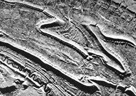{#fig-sarstruc fig-align="center" out-width="48%"}
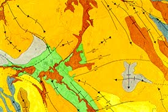{#fig-strucmap fig-align="center" out-width="48%"}
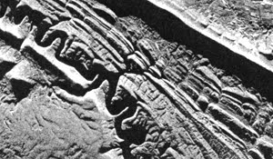{#fig-sarshad fig-align="center" out-width="50%"}

La integración de fisiografía SAR con geofísica aerotransportada (ej. espectrometría de rayos gamma) permite un análisis multivariable profundo de la geoquímica y la morfología del paisaje.

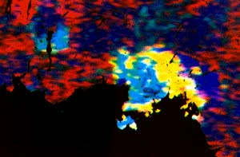{#fig-coldgamm fig-align="center" out-width="32%"}
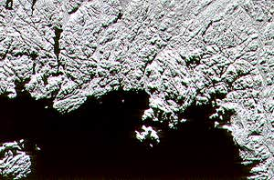{#fig-coldsar fig-align="center" out-width="32%"}
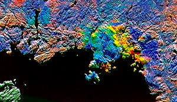{#fig-coldint fig-align="center" out-width="32%"}

### Mapeo de unidades geológicas

La delimitación de dominios litológicos se fundamenta en las variaciones de reflectancia espectral (especialmente en el SWIR para detectar arcillas y carbonatos) e integraciones con texturas radar, permitiendo generar mapas precisos de la roca matriz.

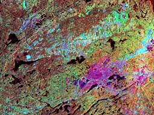{#fig-sudint fig-align="center" out-width="48%"}
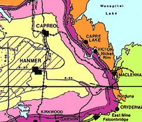{#fig-geomap fig-align="center" out-width="48%"}

## Hidrología

La geomática hidrológica monitorea los componentes del ciclo del agua, desde cuencas y humedad de la biosfera, hasta la dinámica de cuerpos de agua estacionarios.

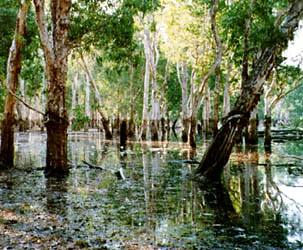{#fig-hyrdo fig-align="center" out-width="50%"}

### Humedad del suelo

La humedad del perfil superior del suelo controla el escurrimiento de la precipitación y condiciona el crecimiento agrícola. A nivel remoto, se aprovecha que la **constante dieléctrica** de los materiales naturales responde drásticamente a la adición de agua. Los sensores activos de microondas, al ser sensibles a las propiedades dieléctricas, pueden cartografiar anomalías de saturación del suelo sin importar la cobertura nubosa.

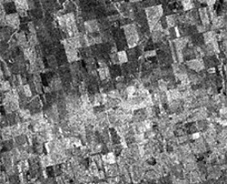{#fig-raindist fig-align="center" out-width="50%"}

### Delineación y mapeo de inundaciones

Debido a que las inundaciones severas ocurren bajo cobertura nubosa densa, los sensores ópticos suelen ser inoperantes. En emergencias, el **SAR de microondas** (ej. RADARSAT) es fundamental: el agua estancada actúa como un reflector especular (tono negro en la imagen), generando un contraste extremo con la tierra seca circundante, lo que permite delimitar la zona catastrófica en tiempo real.

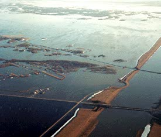{#fig-floodph1 fig-align="center" out-width="32%"}
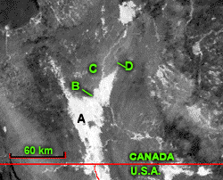{#fig-noaflood fig-align="center" out-width="32%"}
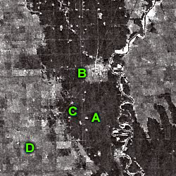{#fig-radflood fig-align="center" out-width="32%"}

## Hielo marino

El monitoreo criosférico es indispensable para modelar el clima global y garantizar la seguridad de la navegación comercial y exploración en latitudes polares. Dada la oscuridad prolongada del invierno polar y las persistentes nieblas, la teledetección operativa del hielo depende casi exclusivamente de sensores de microondas y radar activo.

### Tipo de hielo y concentración

Es vital discriminar entre hielo de primer año (frágil y delgado) y hielo multianual (denso, grueso y peligroso para la navegación). Durante el invierno, las salmueras atrapadas y la rugosidad superficial permiten que el radar caracterice la edad y el grosor del paquete de hielo, calculando automáticamente su nivel de concentración para trazar rutas navegables seguras.

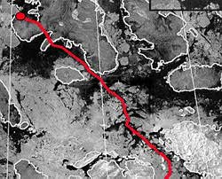{#fig-exped fig-align="center" out-width="60%"}

### Dinámica y movimiento del hielo

El hielo marino es una superficie altamente dinámica, movida por corrientes oceánicas y vientos. Mediante la adquisición sistemática de imágenes sobre una misma zona en ventanas de tiempo cortas (multitemporalidad), los algoritmos de flujo óptico pueden rastrear el desplazamiento de témpanos individuales, generando vectores de velocidad y dirección del hielo, críticos para proteger plataformas de perforación marina.

## Cobertura terrestre y uso del suelo

El mapeo de la cobertura terrestre sirve como inventario básico de los recursos para los gobiernos y agencias ambientales. Permite capturar la fenología de las plantas y realizar observaciones a escala regional y continental.

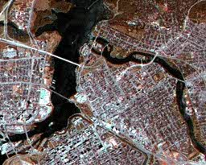{#fig-ottawa fig-align="center" out-width="50%"}

Para estudios regionales, la teledetección es la herramienta más práctica y rentable, ya que proporciona información multiespectral, multitemporal y **multisensor**. Integrar diferentes fuentes (como datos ópticos TM con Radar SAR aerotransportado) aumenta significativamente el contenido de información para una clasificación precisa.

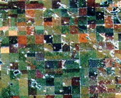{#fig-multisen fig-align="center" out-width="50%"}

Mientras que los datos ópticos son ideales para la cartografía de la cobertura, las imágenes de radar son un excelente sustituto en áreas con alta nubosidad persistente, como las regiones tropicales.

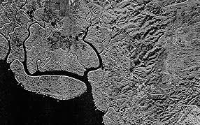{#fig-tawau4-lc fig-align="center" out-width="50%"}

### Mapeo de biomasa y cobertura regional (Caso de estudio: NBIOME)

Una iniciativa clave en el mapeo a gran escala es el desarrollo de clasificaciones objetivas de los principales biomas, como el proyecto NBIOME en Canadá. Este tipo de mapas base permite observar cambios en la cobertura a lo largo del tiempo debido a factores climáticos o antropogénicos.

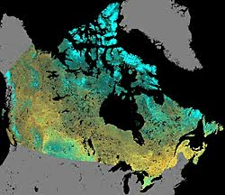{#fig-canmosi fig-align="center" out-width="60%"}

Esta clasificación emplea datos de resolución moderada (1 km) del sensor NOAA-AVHRR para garantizar un procesamiento eficiente. El método consiste en crear **compuestos libres de nubes** de periodos de 10 días, seleccionando para cada píxel el valor con el Índice de Vegetación de Diferencia Normalizada (NDVI) más alto (dado que un NDVI bajo indica presencia de nubes). 

Utilizando una metodología de "clasificación por generalización progresiva" (que mezcla enfoques supervisados y no supervisados), los algoritmos agrupan los datos en clústeres espectrales dominantes, resultando en una cartografía de coberturas altamente objetiva y reproducible a escala continental.

### Uso del suelo

Aunque los términos suelen usarse indistintamente, representan conceptos analíticos diferentes: la **cobertura terrestre** describe el material biofísico sobre la superficie (bosque, asfalto, agua), mientras que el **uso del suelo** refiere al propósito antropogénico (recreacional, residencial, comercial).

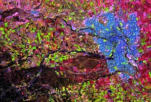{#fig-caltm fig-align="center" out-width="60%"}

### Cambio de uso del suelo (Expansión urbana)

A medida que las poblaciones aumentan, la periferia de las ciudades experimenta una fuerte presión, transformando el paisaje de rural a urbano. El monitoreo sistemático del sellado del suelo y el crecimiento de infraestructuras es crucial para la planificación de servicios públicos, estimación de recaudación fiscal y protección de fronteras agrícolas. El fuerte retorno radiométrico de las geometrías urbanas (rebote doble) facilita su identificación en imágenes SAR.

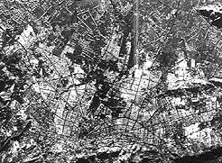{#fig-urbsar fig-align="center" out-width="48%"}
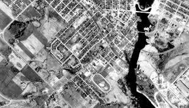{#fig-urbrural fig-align="center" out-width="48%"}

## Cartografía y planimetría

La producción cartográfica es el producto base tradicional del análisis espacial. Consiste en documentar topológicamente las infraestructuras, hidrografía y límites administrativos, constituyendo el armazón sobre el cual operan los Sistemas de Información Geográfica (SIG).

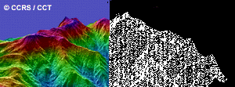{#fig-mapping fig-align="center" out-width="50%"}

### Planimetría

Se refiere a la extracción y geolocalización bidimensional (coordenadas X, Y) de características del paisaje, como redes viales, polígonos urbanos y redes de transmisión. Para que este proceso sea confiable y alcance los estándares cartográficos nacionales, se exige imagery de altísima resolución espacial y estrictos procesos de corrección ortogonal.

{#fig-tawau4-plan fig-align="center" out-width="48%"}
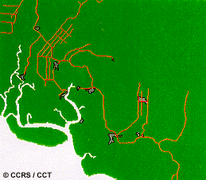{#fig-tawau2 fig-align="center" out-width="48%"}

### Modelos Digitales de Elevación (DEM)

La inclusión de la tercera dimensión (Z) revoluciona la aplicabilidad de los mapas bidimensionales, permitiendo correcciones de pendiente, modelamiento hidrológico y vistas en perspectiva 3D. 

Los DEM pueden extraerse mediante fotogrametría clásica (pares estéreo ópticos) o, más eficientemente, utilizando tecnologías coherentes como la **Interferometría Radar (InSAR)**. Esta técnica mide los desfases ondulatorios entre dos adquisiciones radar ligeramente separadas espacialmente, calculando el paralaje para derivar grillas altimétricas continuas y de alta precisión sin necesidad de laboriosos trabajos de campo.

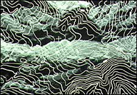{#fig-sarcontr fig-align="center" out-width="48%"}
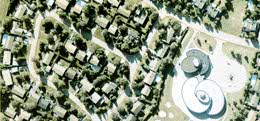{#fig-kanatdoi fig-align="center" out-width="48%"}

### Mapeo temático base (BTM)

El mapeo temático de línea base (Baseline Thematic Mapping) es la integración digital avanzada de imágenes satelitales, métricas de uso del suelo y datos topográficos para producir verdaderos "mapas de imágenes" vectoriales. 

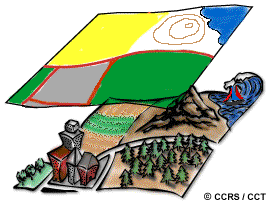{#fig-img2map fig-align="center" out-width="50%"}

En este proceso analítico multivariable, la información óptica multiespectral provee los límites planimétricos de la cobertura boscosa o agrícola, mientras que la integración simultánea con Radar SAR aporta la expresión geomorfológica tridimensional, consolidando una plataforma integral idónea para la toma de decisiones en la asignación del uso del territorio.

## Monitoreo oceánico y costero

Los océanos cubren más de dos tercios de la superficie terrestre y son el motor principal del sistema climático global. Asimismo, las zonas costeras, que albergan a más del 60% de la población mundial, son ecosistemas biológicamente frágiles y sometidos a intenso estrés antropogénico. La teledetección proporciona la escala sinóptica necesaria para evaluar este vasto e inaccesible entorno.

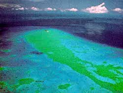{#fig-reef fig-align="center" out-width="50%"}

### Características oceánicas y circulación

La comprensión de la dinámica oceánica permite optimizar las rutas de navegación, modelar la dispersión de contaminantes y mejorar las predicciones meteorológicas. Mediante sensores remotos es posible medir la temperatura superficial del mar, la altura de las olas (altimetría) y la dirección de los vientos (escaterometría).

El **Radar de Apertura Sintética (SAR)** es altamente efectivo para este fin. Basado en el mecanismo de dispersión de *Bragg*, el radar detecta los patrones de rugosidad generados por las ondas capilares en la interfase océano-atmósfera. Anomalías topográficas superficiales sutiles revelan la presencia oculta de remolinos de mesoescala, frentes y oscilaciones de marea internas.

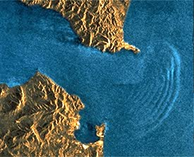{#fig-intwav fig-align="center" out-width="50%"}

### Color del océano y concentración de fitoplancton

El análisis del "color del océano" consiste en derivar parámetros biológicos evaluando ópticamente las variaciones en la reflectancia de la columna de agua. El fitoplancton marino, base de la red trófica, depende del pigmento fotosintético de la clorofila para su supervivencia. Esta molécula absorbe masivamente la luz en la región roja y azul, confiriendo a las aguas productivas un fuerte tono verde reflectivo.

Sensores especializados en bandas estrechas del espectro visible (como SeaWiFS y MODIS) cuantifican estas concentraciones de clorofila. Esto permite mapear la productividad primaria global, alertar sobre floraciones algales nocivas, y comprender cómo perturbaciones climáticas extremas —como el desplazamiento de corrientes asociadas al evento de El Niño— destruyen temporalmente los reservorios pesqueros pelágicos.

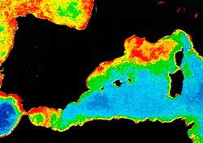{#fig-colormed fig-align="center" out-width="50%"}

### Detección de derrames de hidrocarburos

Los vertidos de petróleo crudo en el mar resultan catastróficos para la fauna marina y la economía litoral. Identificar el área inicial de un derrame, modelar su dirección de arrastre y guiar las operaciones de contención requieren una plataforma de vigilancia continua.

Si bien los fluorosensores láser aerotransportados ofrecen capacidades químicas directas ("huella digital" del hidrocarburo), los satélites radar destacan operativamente al no depender de la luz diurna ni de cielos despejados. Dado que la fina película de petróleo amortigua y suaviza la tensión superficial del océano, elimina localmente las ondas capilares generadas por el viento. Como resultado, el pulso del radar se desvía de forma especular (alejándose de la antena), originando que la región contaminada destaquen en la imagen radar como un polígono obscuro de bordes claramente definidos contra la brillante retrodispersión del mar circundante.

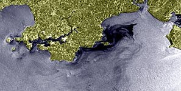{#fig-pollut fig-align="center" out-width="60%"}