## Agenda del documento

* Historia de la cartografía
* ¿Qué es un SIG (y por qué es necesario)?
    * Definiciones, aplicaciones de SIG
    * SIG de escritorio frente a WebGIS
    * Geodatos
    * Introducción a los sistemas de referencia

## Historia de la cartografía

### El inicio de la cartografía

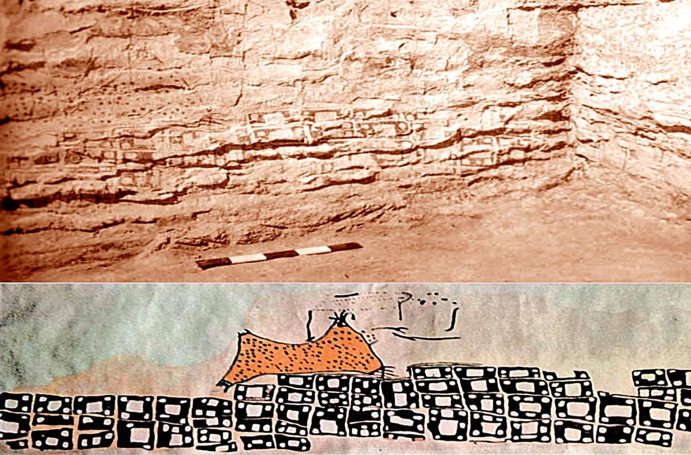

* Séptimo milenio a. C., en Çatalhöyük, Anatolia, Turquía moderna.
* Cartografía de una aldea neolítica
* No obstante, estudios recientes han cuestionado la identificación de esta pintura como un mapa

---

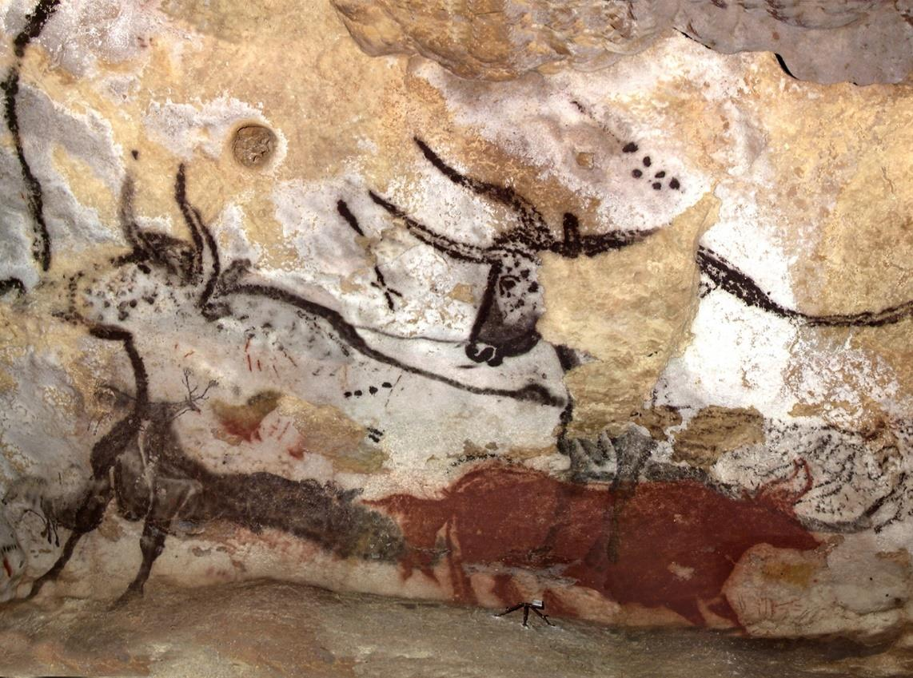

* 16500 a. C., paredes de las cuevas de Lascaux.

* Cartografía del cielo nocturno, incluyendo las estrellas brillantes Vega, Deneb y Altair, así como el cúmulo de las Pléyades

### Mapas antiguos

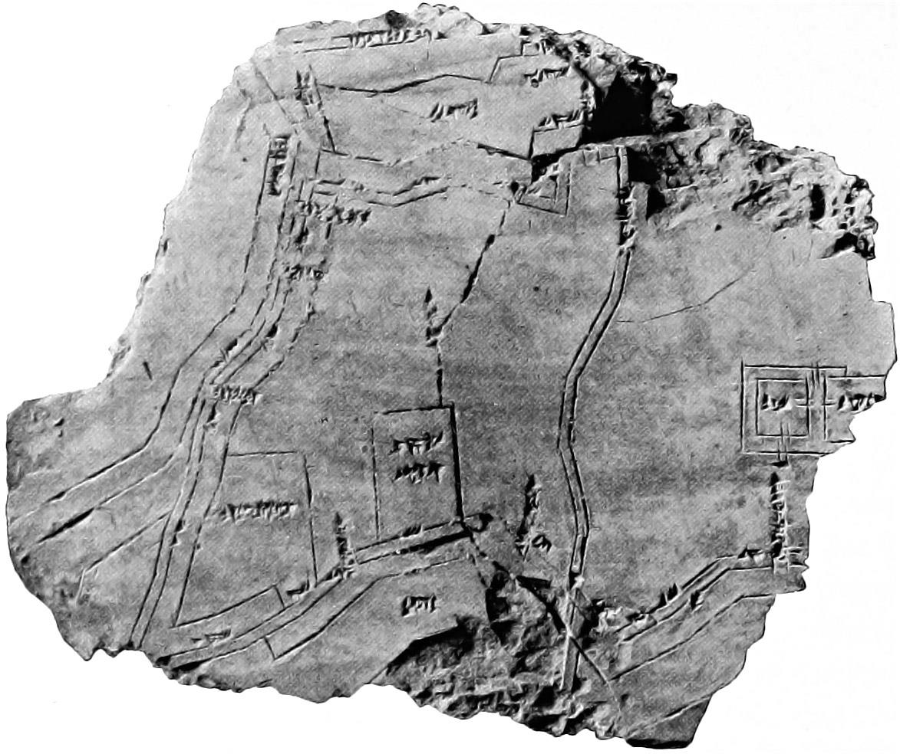

* 1400 a. C.

* Cartografía de muros y edificios en la ciudad sagrada babilónica de Nippur

---

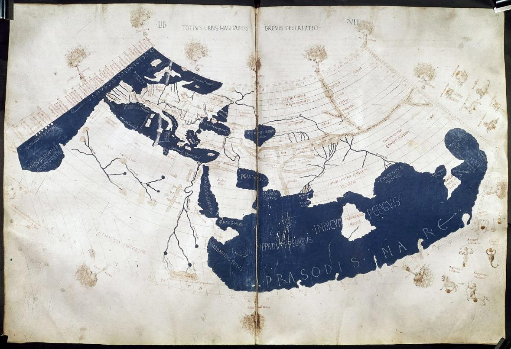

* 150 d. C.
* "Mapamundi" de Claudio Ptolomeo
* Viejo Mundo desde aproximadamente 60°N hasta 30°S de latitud

---

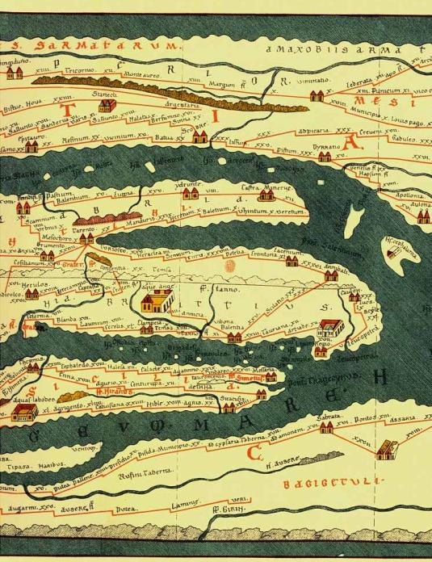

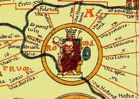

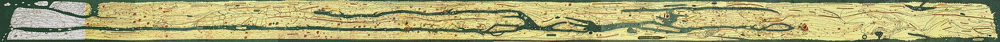

* Copia en pergamino del siglo XIII de un posible original romano del siglo IV o V.
* Tabula Peutingeriana: red de carreteras gestionada por el estado
* Puntos de referencia: asentamientos, ríos, montañas, bosques, mares
* Distancia entre asentamientos (tiempo de viaje a caballo)
* 555 ciudades y otros 3500 nombres de lugares

---

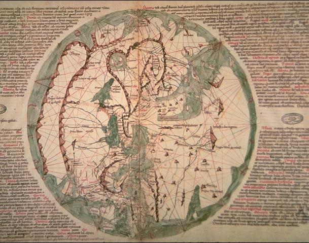

* 1321 d. C.
* "Mapamundi" de Pietro Vesconte
* Mapa T-O
    * Jerusalén representada en el centro
    * El este estaba orientado hacia la parte superior del mapa

---

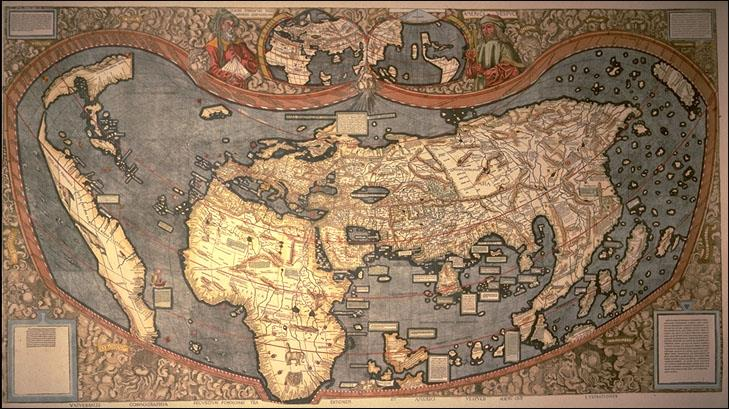

1507 d. C.

* "Mapamundi" de Martin Waldseemüller
* Primer mapamundi verdadero
* Primer mapa en utilizar el nombre "América" para el Nuevo Mundo

### Transformación de mapas antiguos a mapas modernos

Los mapas se volvieron cada vez más precisos y basados en evidencia durante los siglos XVII, XVIII y XIX con la aplicación de métodos científicos. 

Muchos países emprendieron programas cartográficos nacionales. No obstante, gran parte del mundo era poco conocida hasta el uso generalizado de la fotografía aérea después de la Primera Guerra Mundial. La cartografía moderna se basa en una combinación de observaciones terrestres y teledetección.

### Mapas modernos

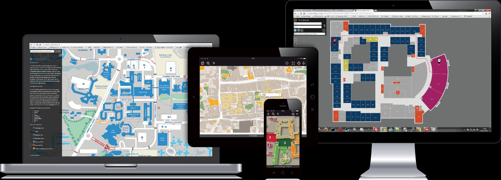

## Cartografía y SIG

Sistemas de Información Geográfica.

* Recopilación
* Procesamiento
* Análisis
* Visualización de datos espaciales

Existen múltiples herramientas para responder a problemas con referencia espacial.

* Análisis vectorial y ráster
* Análisis de redes
* ...

---

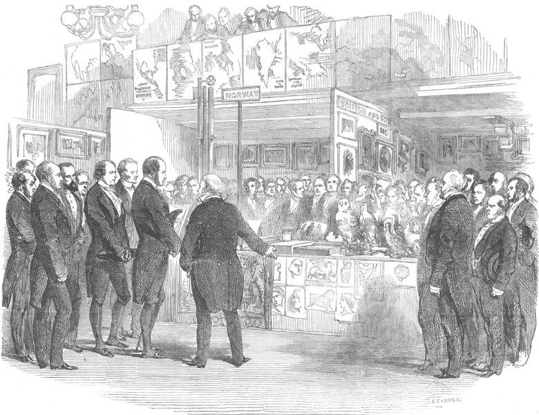

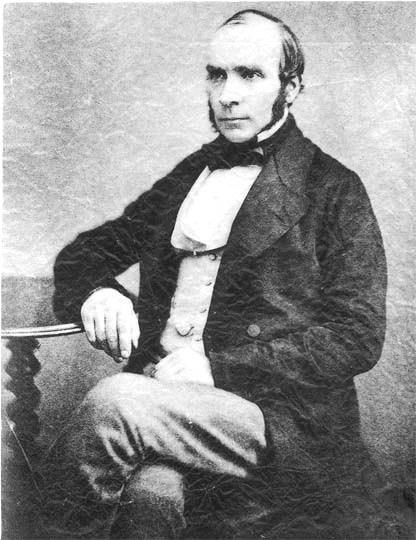

[John Snow, MD](https://es.wikipedia.org/wiki/John_Snow) (* 15 de marzo de 1813 en York, Inglaterra; † 16 de junio de 1858).
Fuente: https://es.wikipedia.org/wiki/John_Snow

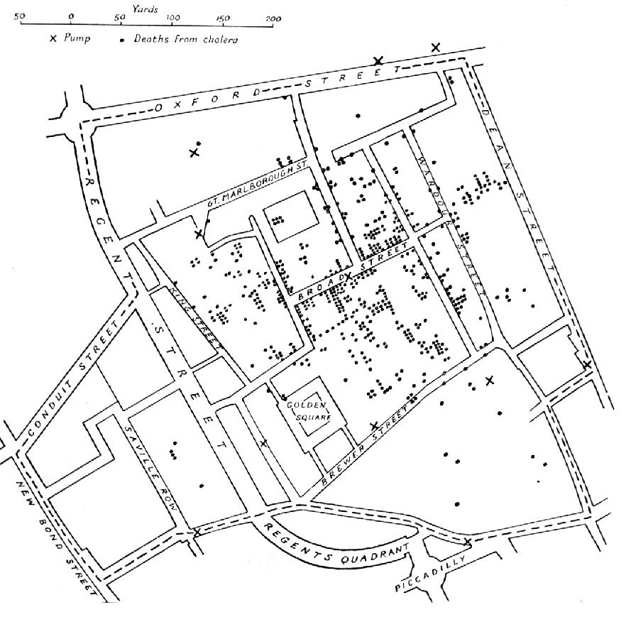

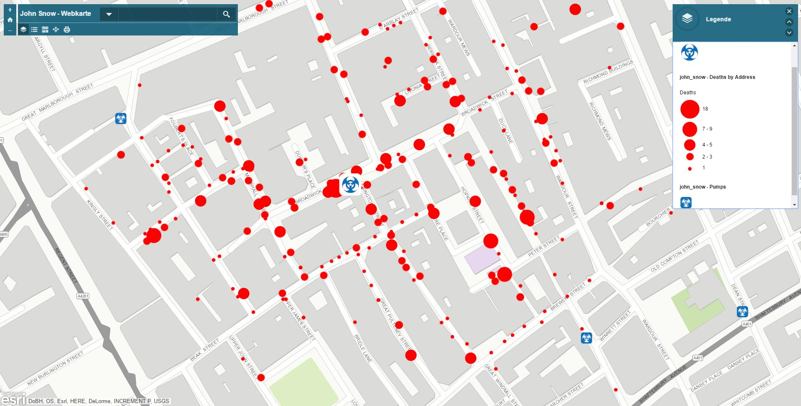

Guía en ArcGIS Online: [Representar cartográficamente un brote histórico de cólera](https://learn.arcgis.com/es/projects/map-a-historic-cholera-outbreak/)

## Aplicaciones de los mapas

**El 80% de los datos corporativos contienen un componente geográfico**

**Planificación urbana:** Análisis de potencial para el desarrollo de viviendas en zonas céntricas.

Verteilung der Haushaltsgrößen: Distribución del tamaño de los hogares.

    * Anteil 1-Personenhaushalt: Proporción de hogares de una persona (unipersonales).
    * Anteil 2-Personenhaushalt: Proporción de hogares de dos personas.
    * Anteil 3+ - Personenhaushalt: Proporción de hogares de tres o más personas.

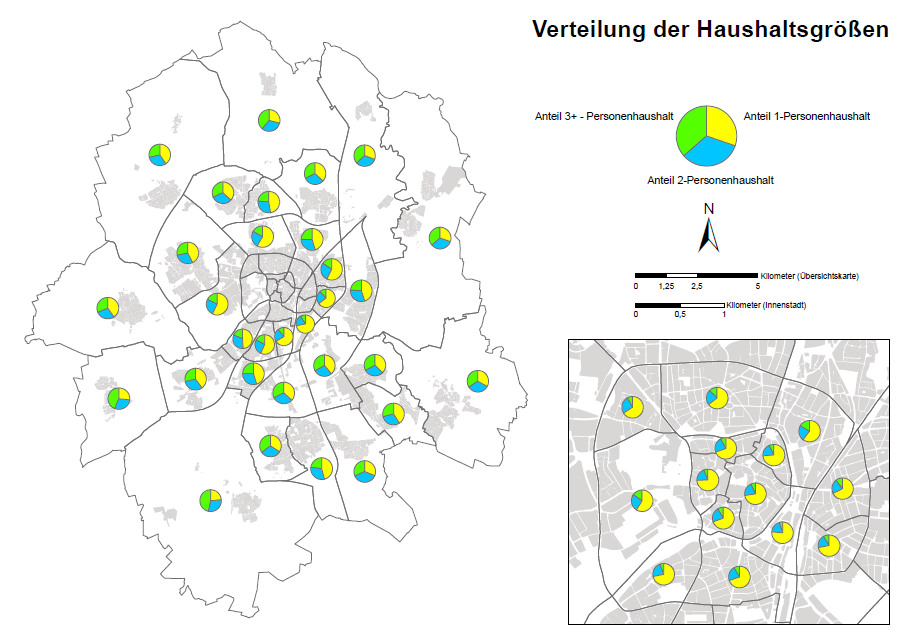

La categorización del uso del suelo y las estructuras edilicias permite clasificar el espacio urbano en diversas tipologías para el análisis de disponibilidad:

* Nebengebäude: Edificio anexo o dependencia.
* Wohnen: Uso residencial o vivienda.
* Einzelhandel: Comercio minorista o venta al por menor.
* Hotel / Gastronomie: Hotelería y gastronomía (restauración).
* Büronutzung: Uso de oficinas o administrativo.
* Medizin: Servicios de salud o uso médico.
* Soziales / Freizeit: Uso social y recreativo (ocio).
* Handwerk: Talleres artesanales u oficios.
* Parken: Estacionamiento o aparcamiento.
* Leerstand: Desocupado o vacante.
* Mindergenutztes Dachgeschoss: Ático o planta bajo cubierta subutilizada.

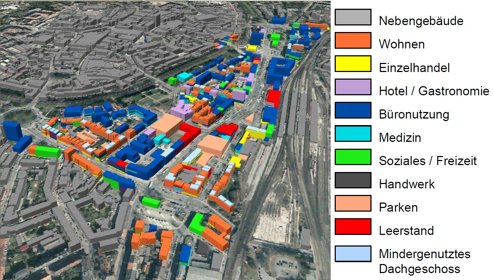

**Planificación urbana y de construcción (en 3D):**

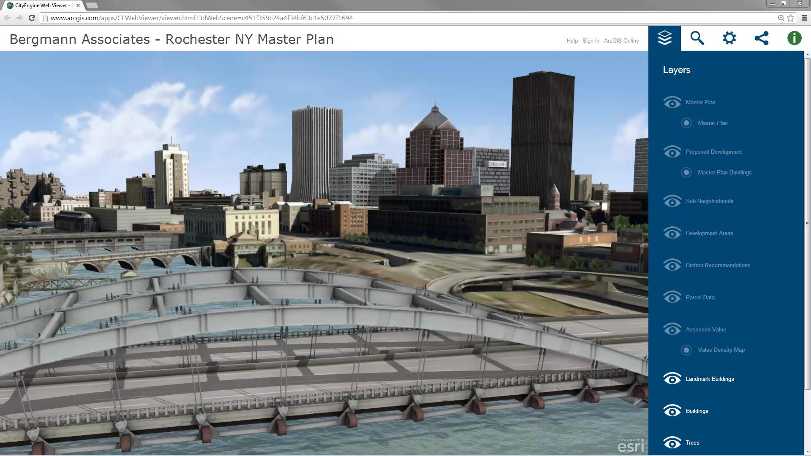

* **Planificación de tráfico y transporte:**

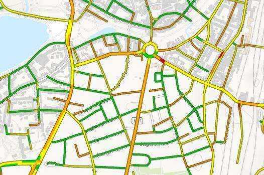

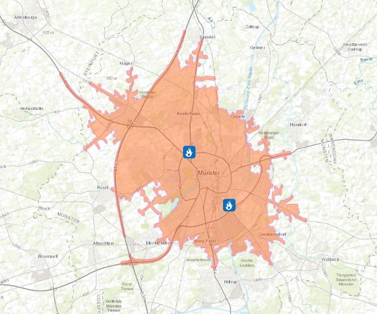

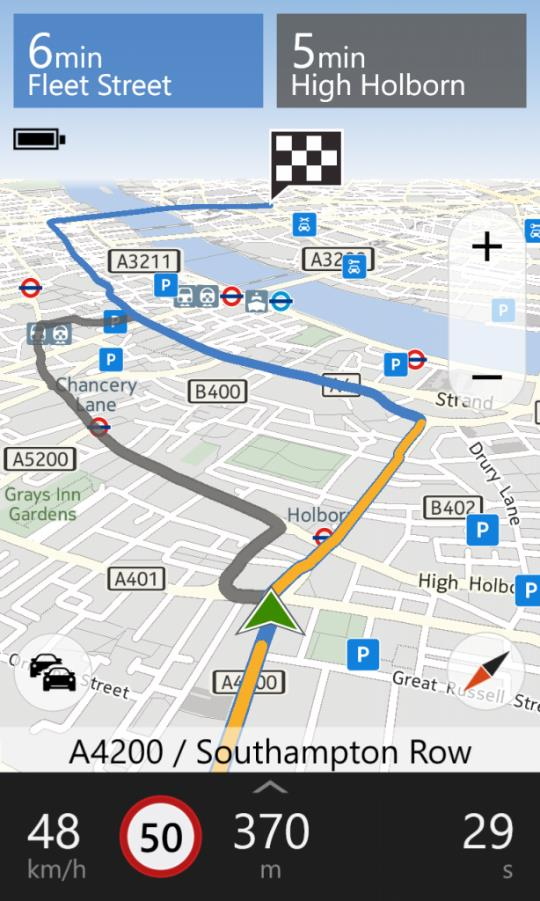

**Cartografía ecológica:**

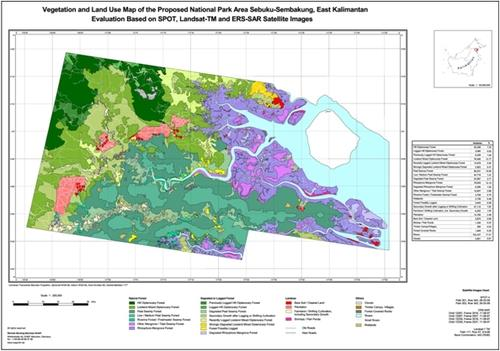

**Gestión de emergencias y respuesta rápida:**

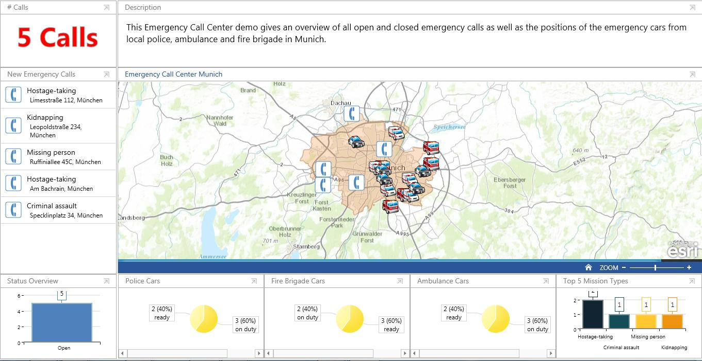

## Formas de publicar la cartografía

* Mapa impreso
* Mapa digital (PDF o imagen)
* Mapa Web
    *   ArcGIS Online 

## Gestión y obtención de geodatos

Los geodatos 

* describen objetos, edificaciones, formas del terreno e infraestructuras en la superficie terrestre
* poseen una referencia espacial intrínseca
* se componen de una forma geométrica y una ubicación (topología), así como de información fáctica descriptiva (atributos).

### Fuentes oficiales de datos espaciales

Los datos oficiales son recopilados mediante métodos topográficos y geodésicos formales, garantizando un nivel alto de precisión y exactitud. El ciclo de actualización suele ser prolongado; por ejemplo, las campañas de vuelos fotogramétricos para imágenes aéreas oficiales generalmente se ejecutan en intervalos de 3 a 4 años.

Ejemplos en el contexto Colombiano: 

* Mapas topográficos a escala 1:25.000 
* Mapas base a escala 1:5.000.

### Datos abiertos (Open Data) y voluntarios

La información geográfica voluntaria es capturada por usuarios civiles. Aunque la precisión posicional puede ser menor o presentar heterogeneidad estadística, la frecuencia de actualización es considerablemente superior a los datos oficiales. Entornos colaborativos como OpenStreetMap (OSM) publican modificaciones en la base de datos de manera casi inmediata.

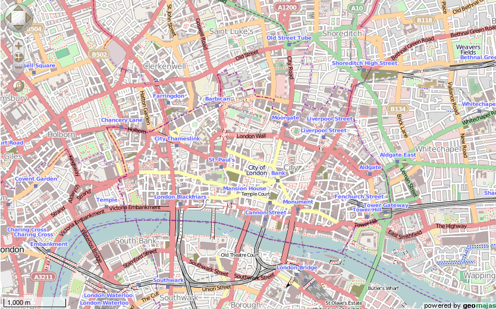

De forma paralela, las administraciones públicas y fuentes oficiales tienen sus propios repositorios de datos bajo esquemas de datos abiertos. En [esta página](https://rodolfofrancoweb.com/sig/geoportales_datos_abiertos_e_ides/datos-abiertos/) del Profesor Rodolfo Franco encontrará una lista detallada de geoportales (mundial, Colombia, regiones/departamentos, Bogotá)

### Levantamiento primario de datos

La captura directa de datos asegura el control absoluto sobre la temporalidad, la escala y los parámetros de calidad del levantamiento en campo para un proyecto específico.

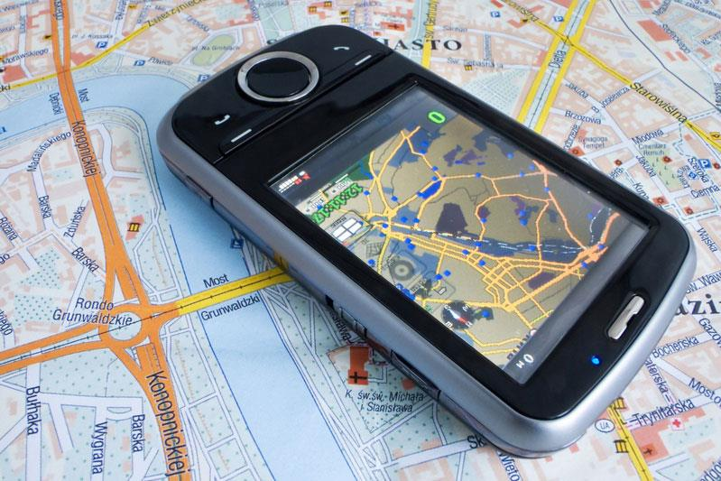

### Formatos comunes de geodatos

El almacenamiento y transferencia de datos espaciales se realiza a través de formatos y estándares consolidados en la industria:

* Clases de entidad (Feature Class) y capas ráster estructuradas en una geodatabase (FileGDB)
* Archivos Shapefile
* Archivos tabulares con coordenadas implícitas (Excel, CSV)
* Fotografías y videos con etiquetas de geolocalización (Exif GPS)
* Flujos de datos de sensores espaciales
* Servicios web estandarizados (WMS, WFS)
* Modelos CAD, archivos GeoTIFF e imágenes aéreas puras
* ...

## De geodatos a geoinformación

Los datos espaciales en crudo exigen un proceso de interpretación humana o algorítmica. El procesamiento y el análisis espacial generan el valor agregado necesario para transformar los geodatos en geoinformación estructurada y útil para la toma de decisiones.

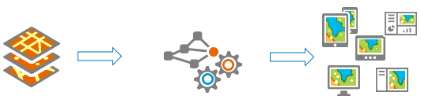

La convergencia entre las herramientas operativas de un SIG y los repositorios de geodatos permite la extracción de conocimiento del entorno físico, que frecuentemente se representa a través de mapas.

## Selección Estratégica de Sistemas de Coordenadas y Proyecciones

La transición desde el conocimiento teórico de los sistemas de coordenadas hacia la producción cartográfica para usuarios finales exige una evaluación crítica de las **distorsiones geométricas**. La selección del *Sistema de Referencia Espacial (SRS)* no constituye un mero paso procedimental, sino una *decisión estratégica* que condiciona la veracidad de la información transmitida.

### Impacto de la distorsión en la comunicación cartográfica

Toda proyección cartográfica implica la transformación de coordenadas esféricas $(\phi, \lambda)$ en un plano cartesiano $(x, y)$. Este proceso matemático introduce alteraciones inevitables en cuatro propiedades fundamentales: **área, ángulo, distancia y dirección**.

La elección de una **proyección cilíndrica**, como la Web Mercator (EPSG:3857), es común en entornos de visualización masiva debido a su capacidad para preservar ángulos y formas locales (conformidad). Sin embargo, este sistema genera una distorsión de área que crece exponencialmente con la latitud, definida por el factor de escala secante:

$$k = \sec(\phi)$$

Donde $\phi$ representa la latitud. Este efecto visual compromete la percepción de la escala relativa de los territorios, sobreestimando significativamente las superficies en regiones polares frente a las ecuatoriales.

### Criterios para la correcta selección del sistema de referencia

La definición del sistema debe responder estrictamente al propósito analítico o comunicativo del producto final:

* **Mapas temáticos de distribución:** Requieren proyecciones equivalentes (o de áreas iguales) para asegurar que las densidades y magnitudes espaciales sean comparables.
* **Navegación y topografía:** Exigen proyecciones **conformes** para mantener la integridad de los ángulos y rumbos.
* **Planificación regional y catastro:** Demandan el uso de datums locales para minimizar el error de desplazamiento entre el elipsoide de referencia y el geoide en una zona geográfica específica.

### Evaluación mediante la indicatriz de Tissot

Para validar la idoneidad de una proyección antes de su publicación, se recomienda el uso de la indicatriz de Tissot. Este instrumento matemático permite visualizar la magnitud y el tipo de distorsión mediante círculos infinitesimales distribuidos sobre la superficie terrestre:

* **Círculos conservados:** Indican una proyección conforme.
* **Elipses de área constante:** Indican una proyección equivalente.
* **Variación en tamaño y forma:** Señalan una proyección afiláctica (o de compromiso).

### Protocolo de pre-procesamiento para el usuario final

Antes de la generación del reporte o mapa final, es importante ejecutar los siguientes controles de calidad:

1. Verificación de la coincidencia del datum entre capas vectoriales y ráster para evitar desplazamientos sub-métricos.
2. Selección de la zona UTM (Universal Transverse Mercator) adecuada para mantener el error de escala por debajo de $0.9996$ en el meridiano central.
3. Documentación del código EPSG utilizado en los metadatos para garantizar la replicabilidad del análisis geoespacial.
