## Planificación

```{mermaid}
graph TD
    %% Definición de estilos
    classDef mainNode font-size:14pt,font-weight:bold,fill:#f9f9f9,stroke:#333,stroke-width:2px;
    classDef questions font-size:12pt,font-style:italic,fill:#ffffff,stroke:#999,stroke-dasharray: 5 5;
    classDef feedback stroke:#e67e22,stroke-width:2px,stroke-dasharray: 5 5;
    classDef highlight fill:#fff3cd,stroke:#d4a017,stroke-width:4px;

    %% Nodos principales
    P(Planificación) --> D(Datos)
    D --> S(Simbología)
    S --> L(Compositions)
    L --> O(Salida)

    %% Lazo de retroalimentación (Ciclo)
    L -.->|Refinamiento e iteración| P

    %% Bloques de preguntas vinculados
    P --- PQ["¿Cómo se utilizará el mapa?<br/>¿Qué tipos de mapas se crearán?"]
    D --- DQ["¿Qué datos se utilizarán?"]
    S --- SQ["¿Cómo se simbolizarán los datos?"]
    L --- LQ["¿Cómo se diseñará la composición?"]
    O --- OQ["¿Cómo se publicará el mapa?"]

    %% Aplicación de estilos
    class D,S,L,O mainNode;
    class DQ,SQ,LQ,OQ questions;
    class P,PQ highlight;
    linkStyle 4 stroke:#e67e22,stroke-width:2px,stroke-dasharray: 5 5;
```

* Cómo será usado el mapa?
    * Porqué necesitas el mapa?
    * Qué mensaje comunicarás?
    * Qué diseño será el más efectivo?

### Principios de diseño cartográfico

El diseño cartográfico no es un proceso meramente estético, sino una disciplina de optimización de la información. Se rige por los siguientes preceptos técnicos:

* **Concepto previo a la compilación:** Definir el propósito antes de la carga de datos.
* **Máxima información al mínimo costo:** Optimizar la carga cognitiva del usuario.
* **Reducción de la complejidad:** Aplicar el principio de simplicidad para evitar la saturación.
* **Exclusión de componentes irrelevantes:** Eliminar cualquier elemento que no aporte al objetivo del mapa.
* **Organización y disposición:** Estructurar los elementos en un layout coherente.

Un mapa debe ser capaz de "contar una historia": 

* Evitar que el lector se vea forzado a procesar toda la información de forma simultánea en el primer contacto visual.
* Para ello, es necesario dirigir el ojo del espectador de manera estratégica, 

<!-- 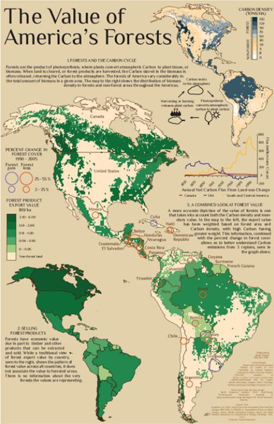{fig-align="center" width="80%"}

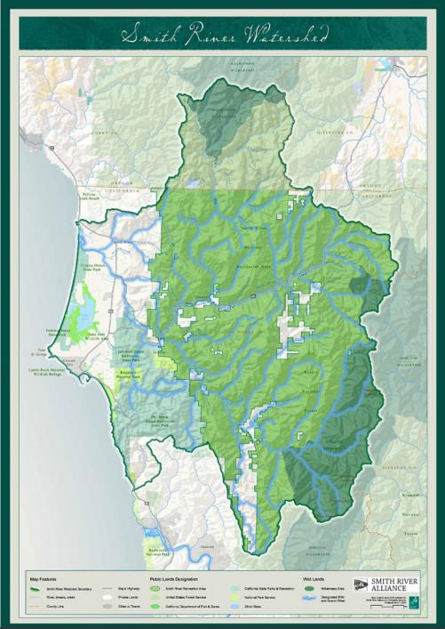{fig-align="center" width="80%"} -->

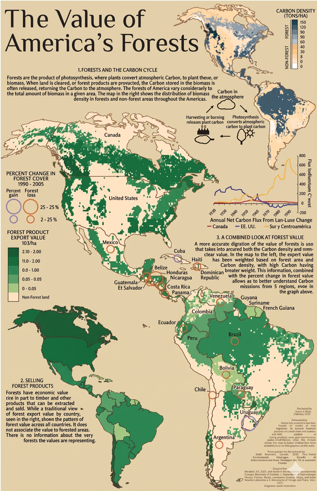{fig-align="center" width="80%"}

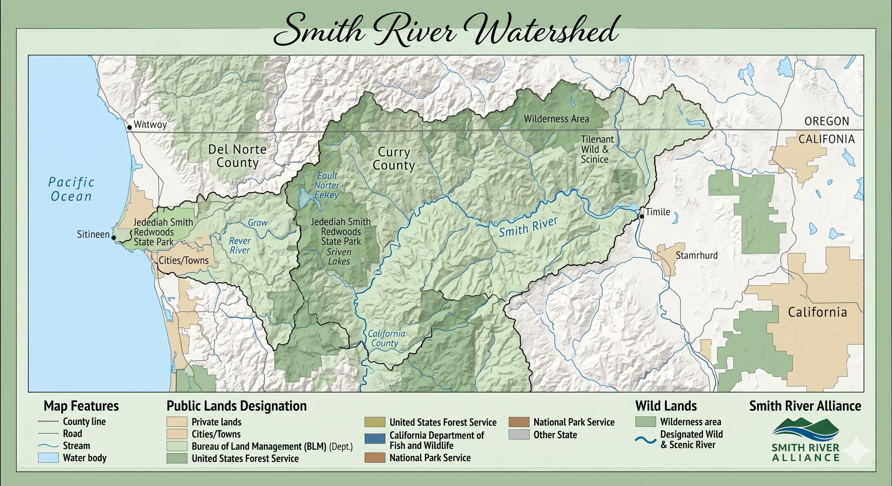{fig-align="center" width="80%"}


El **canal de comunicación** entre el cartógrafo y el usuario final debe ser claro para asegurar que la transferencia de información geoespacial sea exitosa.

<!-- 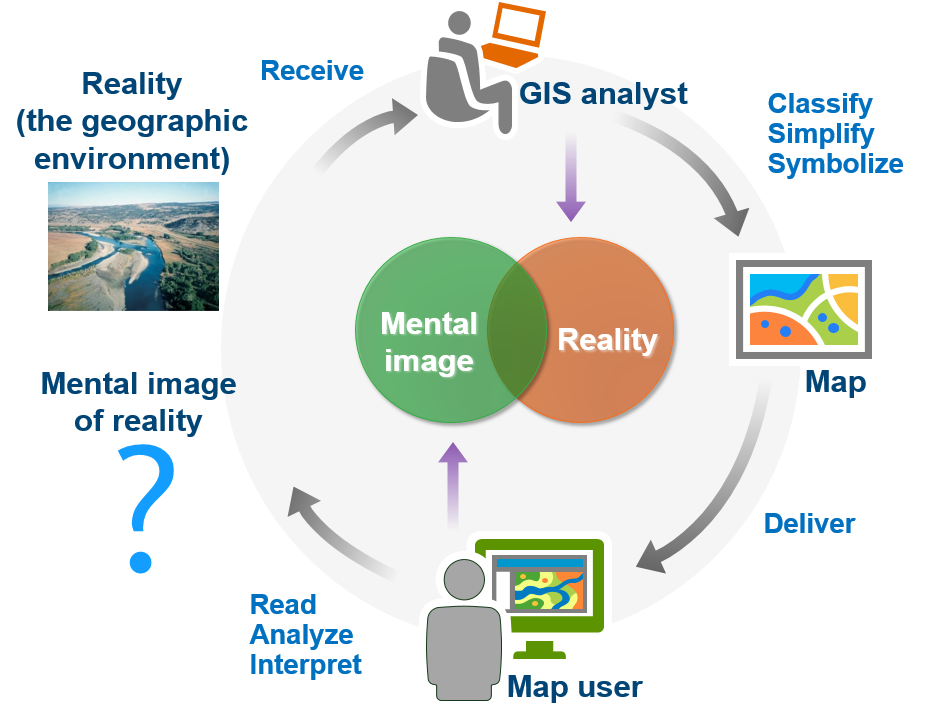{fig-align="center" width="80%"} -->

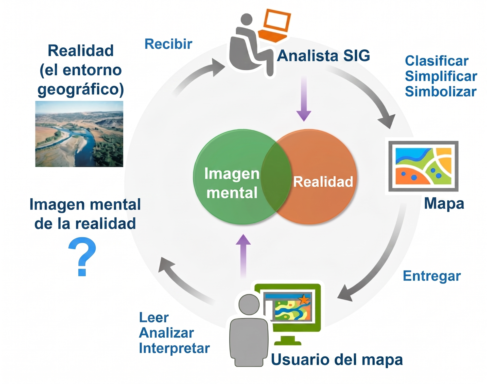{fig-align="center" width="80%"}


## Datos

```{mermaid}
graph TD
    %% Definición de estilos
    classDef mainNode font-size:14pt,font-weight:bold,fill:#f9f9f9,stroke:#333,stroke-width:2px;
    classDef questions font-size:12pt,font-style:italic,fill:#ffffff,stroke:#999,stroke-dasharray: 5 5;
    classDef feedback stroke:#e67e22,stroke-width:2px,stroke-dasharray: 5 5;
    classDef highlight fill:#fff3cd,stroke:#d4a017,stroke-width:4px;

    %% Nodos principales
    P(Planificación) --> D(Datos)
    D --> S(Simbología)
    S --> L(Composición)
    L --> O(Salida)

    %% Lazo de retroalimentación (Ciclo)
    L -.->|Refinamiento e iteración| P

    %% Bloques de preguntas vinculados
    P --- PQ["¿Cómo se utilizará el mapa?<br/>¿Qué tipos de mapas se crearán?"]
    D --- DQ["¿Qué datos se utilizarán?"]
    S --- SQ["¿Cómo se simbolizarán los datos?"]
    L --- LQ["¿Cómo se diseñará la composición?"]
    O --- OQ["¿Cómo se publicará el mapa?"]

    %% Aplicación de estilos
    class P,S,L,O mainNode;
    class PQ,SQ,LQ,OQ questions;
    class D,DQ highlight;
    linkStyle 4 stroke:#e67e22,stroke-width:2px,stroke-dasharray: 5 5;
```

* Qué datos usarás?
    * Cuáles datos soportan tus objetivos?
    * Está disponible el dato?
    * Cuál sistema de coordenadas usarás?


### Fuentes oficiales


### Datos abiertos (Open Data)


### Organización y modificación de datos

La evaluación de la geometría y los atributos depende directamente de la escala de trabajo (escala grande vs. escala pequeña).

::: {layout="[[50, 50]]" layout-valign="center"}
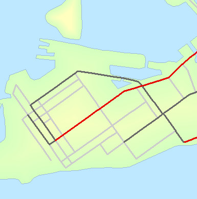

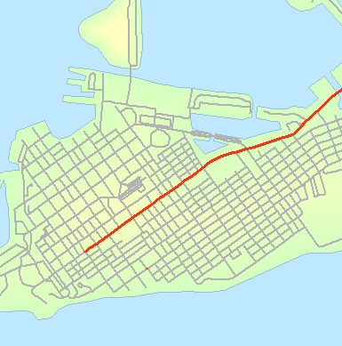
:::

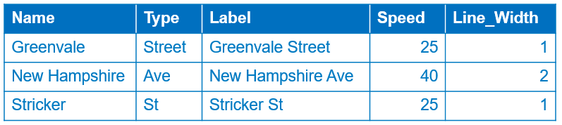{fig-align="center" width="60%"}

Organización de datos


::: {layout="[[50, 50]]" layout-valign="center"}

**Capas de mapa base (Basemap layers):** Proporcionan el contexto geográfico

**Capas operacionales (Operational layers):** Contienen la información temática específica del análisis

:::

::: {layout="[[20, 20, 20, 20]]" layout-valign="center"}

::: {style="text-align: right; color: #007bff; font-size: 1rem;"}
* Elevación
* Ciudades
* Vías
:::

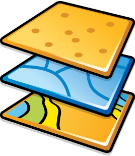

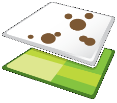

::: {style="text-align: left; color: #007bff; font-size: 1rem;"}
* Calidad del aire
* Uso del suelo
:::

:::

Sistema de coordenadas

* **Seleccione un sistema de coordenadas proyectado**

###  Modificación de datos: Generalización cartográfica

La generalización es el proceso de simplificación de la realidad para su representación a escalas menores, manteniendo la esencia de los datos geográficos. Los métodos principales incluyen:

::: {layout="[[50, 50]]" layout-valign="center"}
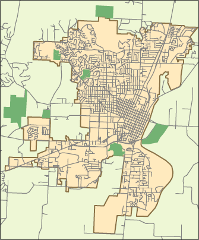

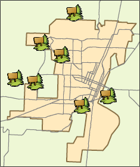
:::


### Modificación de datos: Selección

Proceso de decidir qué entidades se incluyen y cuáles se omiten según la escala y el propósito.

::: {layout="[[45, 10, 45]]" layout-valign="center"}

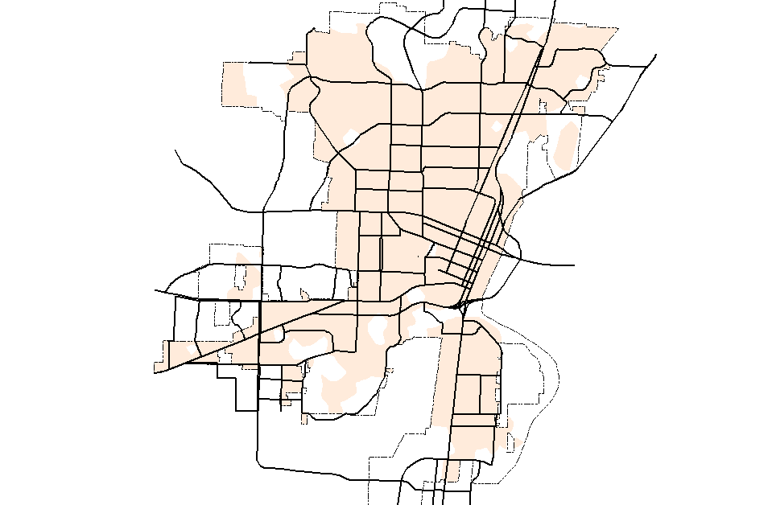

::: {style="text-align: center; font-size: 3rem; line-height: 1;"}
<span style="font-size: 3rem; color: #007bff">→</span>
:::

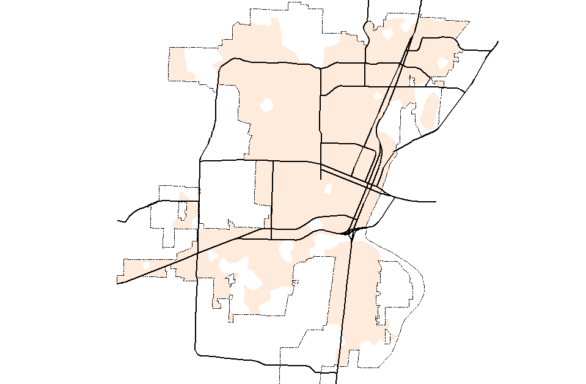
:::


### Simplificación

* **Simplificación:** Reducción del número de vértices en una línea o polígono manteniendo su forma básica.

::: {layout="[[45, 10, 45]]" layout-valign="center"}

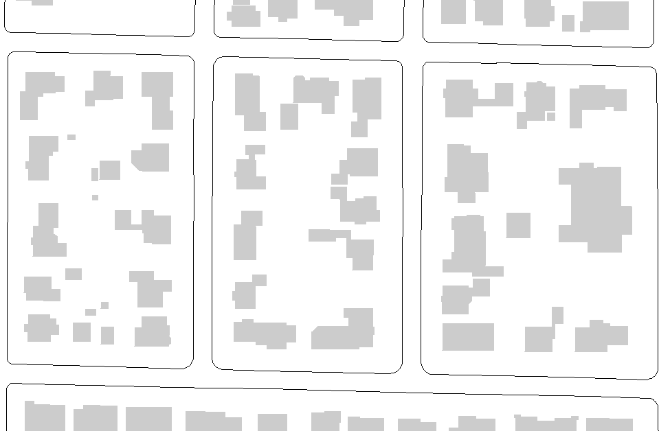

::: {style="text-align: center; font-size: 3rem; line-height: 1;"}
<span style="font-size: 3rem; color: #007bff">→</span>
:::

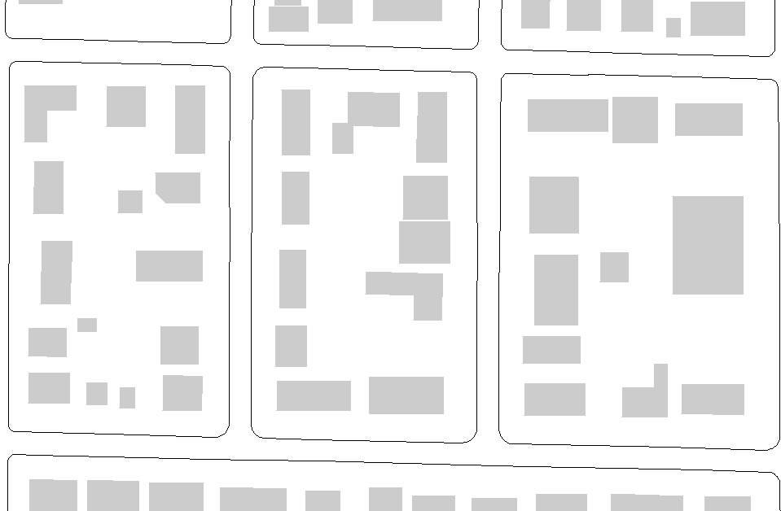
:::

### Suavisado


* **Suavizado:** Eliminación de angulosidades para una representación estética y fluida de las líneas.

::: {layout="[[45, 10, 45]]" layout-valign="center"}

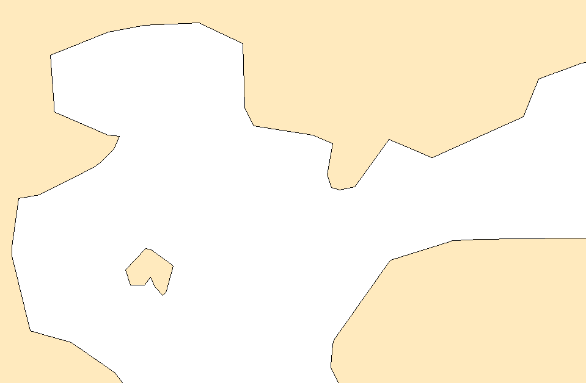

::: {style="text-align: center; font-size: 3rem; line-height: 1;"}
<span style="font-size: 3rem; color: #007bff">→</span>
:::


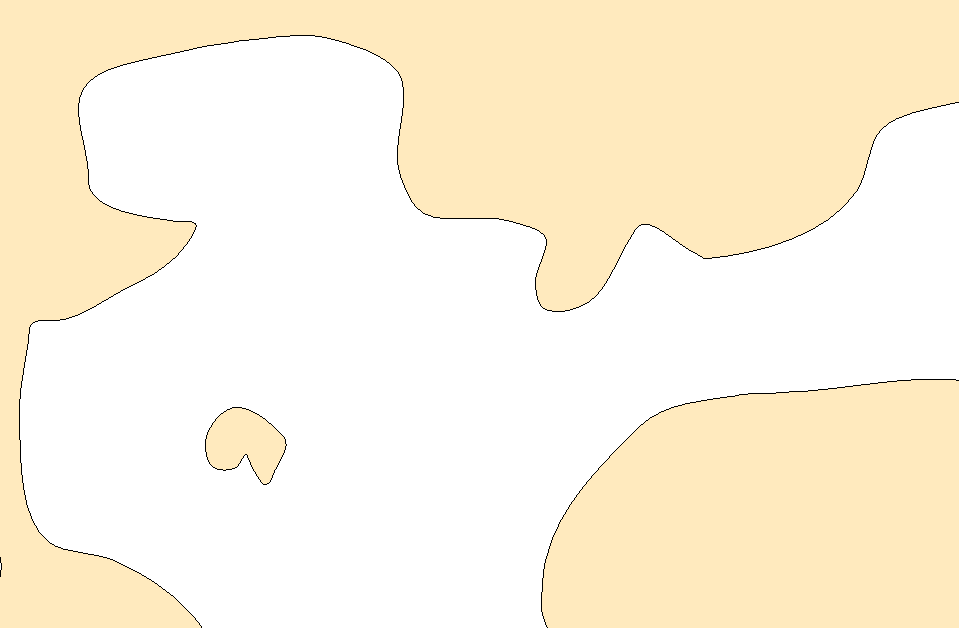
:::


### Colapso

* **Colapso (Collapsing):** Reducción de la dimensionalidad de una entidad (ej: pasar de un polígono de ciudad a un punto).

::: {layout="[[45, 10, 45]]" layout-valign="center"}

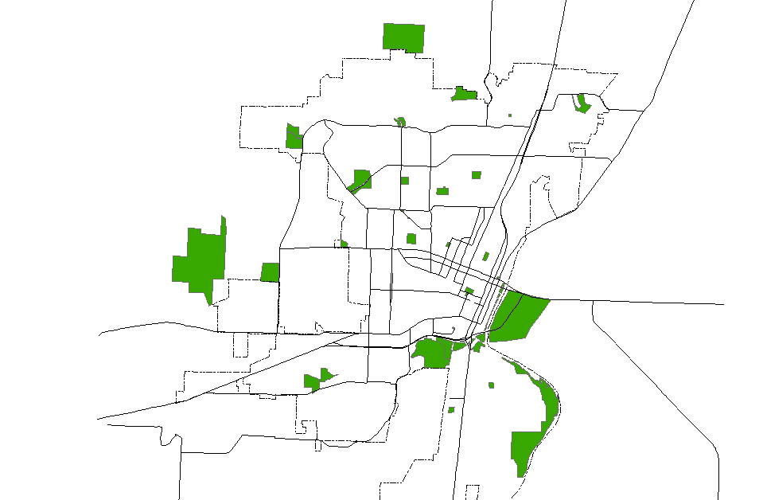

::: {style="text-align: center; font-size: 3rem; line-height: 1;"}
<span style="font-size: 3rem; color: #007bff">→</span>
:::

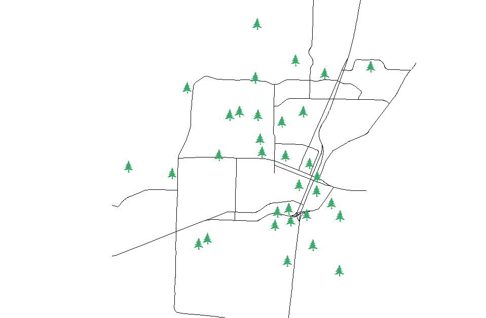
:::

### Agregación

* **Agregación (Aggregation):** Agrupamiento de múltiples entidades individuales en una sola unidad mayor.

::: {layout="[[45, 10, 45]]" layout-valign="center"}

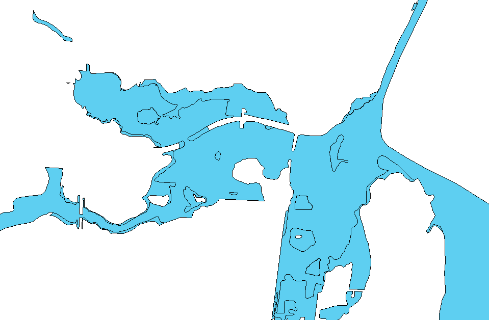

::: {style="text-align: center; font-size: 3rem; line-height: 1;"}
<span style="font-size: 3rem; color: #007bff">→</span>
:::

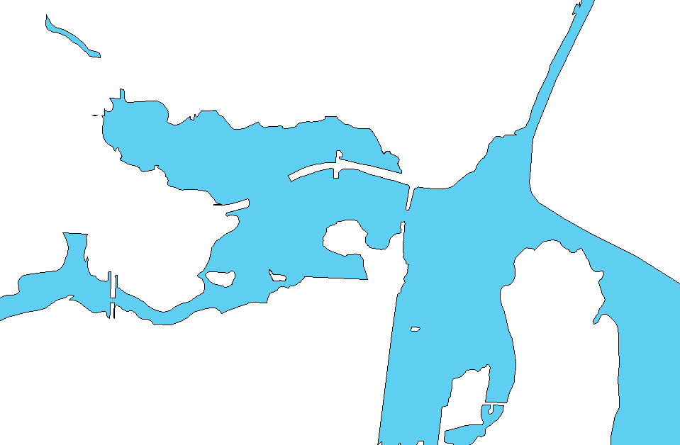
:::


## Simbología

```{mermaid}
graph TD
    %% Definición de estilos
    classDef mainNode font-size:14pt,font-weight:bold,fill:#f9f9f9,stroke:#333,stroke-width:2px;
    classDef questions font-size:12pt,font-style:italic,fill:#ffffff,stroke:#999,stroke-dasharray: 5 5;
    classDef feedback stroke:#e67e22,stroke-width:2px,stroke-dasharray: 5 5;
    classDef highlight fill:#fff3cd,stroke:#d4a017,stroke-width:4px;

    %% Nodos principales
    P(Planificación) --> D(Datos)
    D --> S(Simbología)
    S --> L(Composición)
    L --> O(Salida)

    %% Lazo de retroalimentación (Ciclo)
    L -.->|Refinamiento e iteración| P

    %% Bloques de preguntas vinculados
    P --- PQ["¿Cómo se utilizará el mapa?<br/>¿Qué tipos de mapas se crearán?"]
    D --- DQ["¿Qué datos se utilizarán?"]
    S --- SQ["¿Cómo se simbolizarán los datos?"]
    L --- LQ["¿Cómo se diseñará la composición?"]
    O --- OQ["¿Cómo se publicará el mapa?"]

    %% Aplicación de estilos
    class P,D,L,O mainNode;
    class PQ,DQ,LQ,OQ questions;
    class S,SQ highlight;
    linkStyle 4 stroke:#e67e22,stroke-width:2px,stroke-dasharray: 5 5;
```

* Cómo simbolizarás tus datos?
* ¿La naturaleza de los datos es cualitativa o cuantitativa?
* ¿Es necesaria la inclusión de etiquetas de texto para complementar la simbología?
* ¿Qué tipo de símbolos (puntos, líneas, polígonos) sirven mejor al objetivo del proyecto?


### Fase de simbología en el proceso de planificación

Dentro del flujo de trabajo cartográfico, la simbología representa la etapa donde la información técnica de los atributos se traduce en una representación gráfica interpretable. La selección del esquema simbólico depende directamente de la naturaleza de los datos y del objetivo comunicativo del mapa.

### Definición y función de la simbología

La simbología se define como la visualización gráfica de la información de las entidades (*features*). 

Utiliza variables como:

* el color, 
* la forma, 
* el tamaño, 
* el patrón, 
* la orientación,
* otros, 

para codificar atributos que luego serán interpretados por el usuario mediante 

* la leyenda del mapa.


:::: {.columns}

::: {.column width="20%"}
Parques

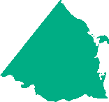{width="100%"}
:::

::: {.column width="10%"}
&nbsp;
:::


::: {.column width="30%"}
Aeropuertos

::: {style="display: flex; align-items: center; margin-bottom: 15px;"}
{width="30%"}
<div style="padding-left: 15px;">Internacional</div>
:::

::: {style="display: flex; align-items: center;"}
{width="30%"}
<div style="padding-left: 15px;">Regional</div>
:::
:::

::: {.column width="40%"}
Tráfico Local

{width="100%"}
:::

::::


### Tipo de simbología y sus dimensiones visuales

<!-- 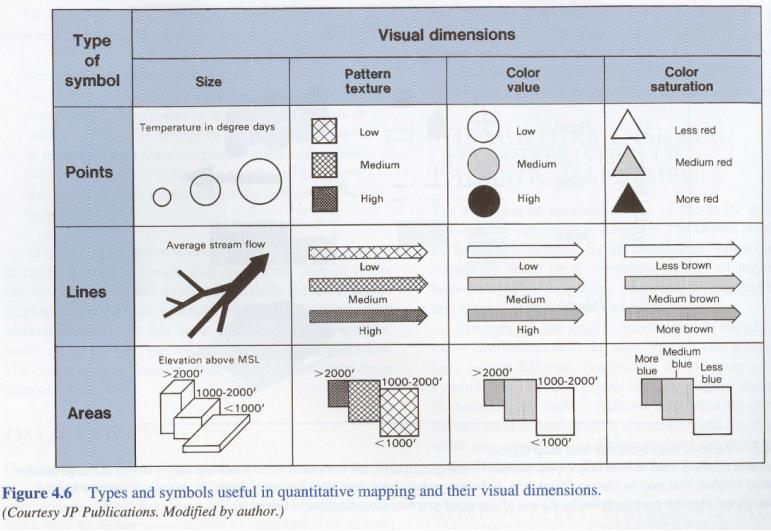 -->

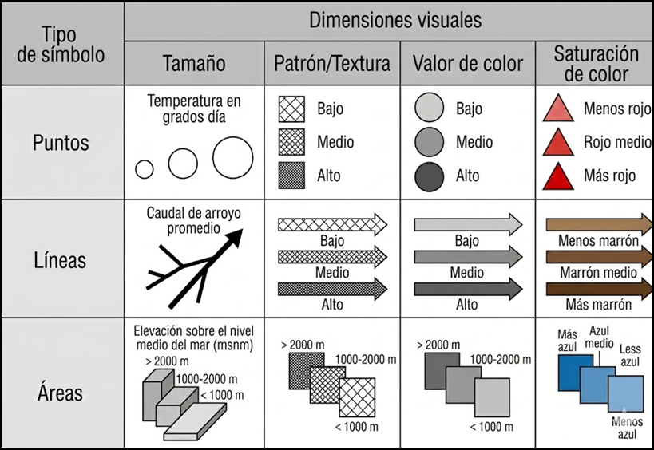{fig-align="center" width="80%"}


La correcta selección y aplicación de variables visuales es fundamental para la transmisión efectiva de la información cartográfica. A continuación se presentan las dimensiones visuales clave utilizadas en la simbología de mapas.

#### Tamaño

La variación del tamaño de un símbolo se utiliza principalmente para **representar diferencias cuantitativas** (magnitudes o cantidades). Un símbolo más grande representa una mayor cantidad, mientras que uno más pequeño representa una menor. Es esencial mantener un contraste de tamaño proporcional y legible para que el usuario pueda interpretar la escala sin confusión.

#### Patrón y textura

El patrón y la textura de los símbolos se emplean para **distinguir categorías o clases** (diferencias cualitativas).

* **Patrón:** Se refiere a la forma y disposición de los elementos internos de un símbolo (ej., líneas paralelas, puntos, cuadrículas).
* **Textura:** Se refiere a la aspereza o suavidad visual de la superficie del símbolo (ej., granulado, punteado fino).
Ambos ayudan a organizar visualmente los elementos en grupos distintos, lo que es útil para diferenciar tipos de uso del suelo, zonas de riesgo o categorías de infraestructura.

#### Valor del color (Luminosidad)

Esta dimensión se refiere a la **claridad u oscuridad relativa de un color**, independientemente de su tono (es decir que color sea). Se extiende en una escala secuencial desde el **negro hasta el blanco**.

En el diseño cartográfico, el valor es fundamental para:

1. **Establecer una jerarquía visual clara.**
2. **Representar escalas secuenciales**, como densidades (ej., mayor cantidad de un fenómeno representada con un valor más oscuro).

Un contraste de valor adecuado facilita la legibilidad de la información cartográfica.

#### Saturación del color (Pureza o Intensidad)

Esta dimensión define la **pureza o viveza de un color**. Se refiere a la **cantidad de gris o marrón que se ha mezclado con el tono puro**. Un color completamente saturado no contiene gris ni marrón, es vibrante. Un color con saturación nula (desaturado) es un gris neutro.

La modulación de la saturación se utiliza para **enfatizar o jerarquizar información sin alterar la claridad relativa** (el valor) de los elementos en una composición cartográfica.


> En resumen:
>
> * El valor te dice qué tan claro u oscuro es un color.
> * La saturación te dice qué tan puro o intenso es ese color.
>
> Por ejemplo, si tienes un tono de rojo, puedes ajustar su valor para que sea un rojo más claro (más cercano al blanco) o un rojo más oscuro (más cercano al negro). También puedes ajustar su saturación para que sea un rojo más vibrante (puro) o un rojo más desaturado (mezclado con gris)


### Distinción entre datos cualitativos y cuantitativos

La elección de las variables visuales está supeditada al tipo de datos disponibles en la tabla de atributos: **cualitativos** o **cuantitativos**

A continuación se presenta la síntesis técnica de las diferencias entre los datos cualitativos y cuantitativos aplicada a entornos de investigación:

| Base de comparación | Datos cualitativos | Datos cuantitativos |
|:---|:---|:---|
| Significado | Datos en los que la clasificación de objetos se basa en atributos y propiedades. | Tipo de datos que pueden medirse y expresarse numéricamente. |
| Metodología de investigación | Exploratoria | Concluyente |
| Enfoque | Subjetivo | Objetivo |
| Análisis | No estadístico | Estadístico |
| Recolección de datos | No estructurada | Estructurada |
| Determina | Profundidad de comprensión | Nivel de ocurrencia |
| Pregunta | ¿Por qué? | ¿Cuántos? o ¿Cuánto? |
| Muestra | Pequeño número de muestras no representativas. | Gran número de muestras representativas. |
| Resultado | Desarrolla una comprensión inicial. | Recomienda un curso de acción final. |


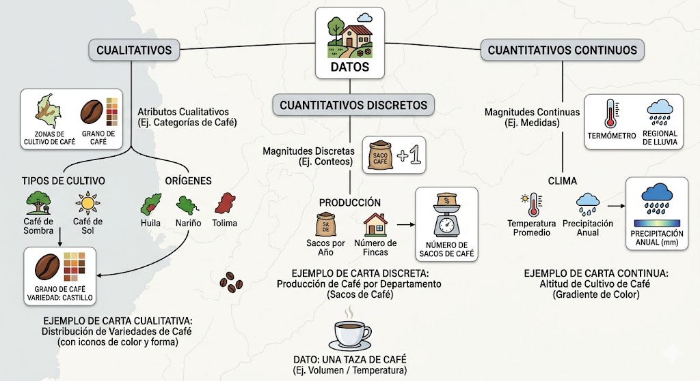

```{mermaid}
%%{init: {'theme': 'base', 'themeVariables': { 'fontSize': '18px', 'fontFamily': 'arial'}}}%%
graph LR
    %% Nodo raíz
    A["<b>Datos</b>"]
    
    %% Niveles primarios
    B1["<b>Cualitativos</b><br/>Información descriptiva"]
    B2["<b>Cuantitativos</b><br/>Información numérica"]
    
    %% Ejemplo Cualitativo
    C1["'Bebo café todos los días'"]
    
    %% Niveles secundarios Cuantitativos
    D1["<b>Discretos</b><br/>(Contados)"]
    D2["<b>Continuos</b><br/>(Medidos)"]
    
    %% Ejemplos Cuantitativos
    E1["'Bebo 4 cafés todos los días'"]
    E2["'Bebo 80g de café todos los días'"]

    %% Conexiones
    A --> B1
    A --> B2
    
    B1 --> C1
    
    B2 --> D1
    B2 --> D2
    
    D1 --> E1
    D2 --> E2

    %% Estilos para legibilidad
    style A fill:#f5f5f5,stroke:#333,stroke-width:3px
    style B1 fill:#fff,stroke:#333,stroke-width:2px
    style B2 fill:#fff,stroke:#333,stroke-width:2px
    style C1 stroke-dasharray: 5 5
    style E1 stroke-dasharray: 5 5
    style E2 stroke-dasharray: 5 5
```

En cartografía digital, esta distinción rige la jerarquía visual:

Los datos **cualitativos** suelen representarse mediante:

* variaciones de **forma** y **tinte de color** (hue) para diferenciar categorías **sin establecer un orden** de magnitud.

Los datos cuantitativos requieren el uso de variables visuales **ordenadas** como el:

* **tamaño** (símbolos proporcionales) o 
* el **valor del color** (luminosidad) para comunicar **gradaciones y cantidades**.


#### Caracterización cualitativa

Se basa en valores de atributos fijos, generalmente texto o códigos numéricos categóricos. La representación se realiza mediante categorías de valores individuales.

* **Variables visuales principales:** Forma y color (tinte).
* **Aplicación:** Clasificación por tipos de uso de suelo, tipos de vegetación o divisiones administrativas.


<!-- ::: {layout="[[15, 50, 20, 15]]" layout-valign="center"}

&nbsp;

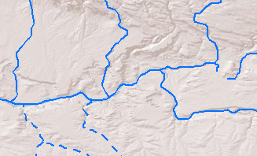


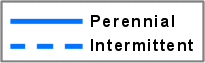

&nbsp;

::: -->

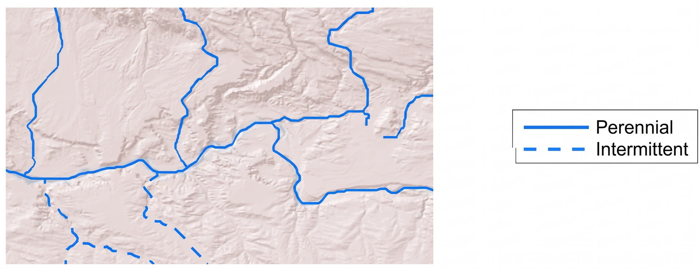


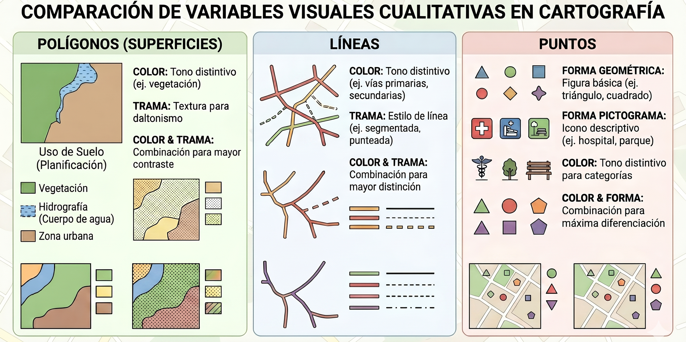


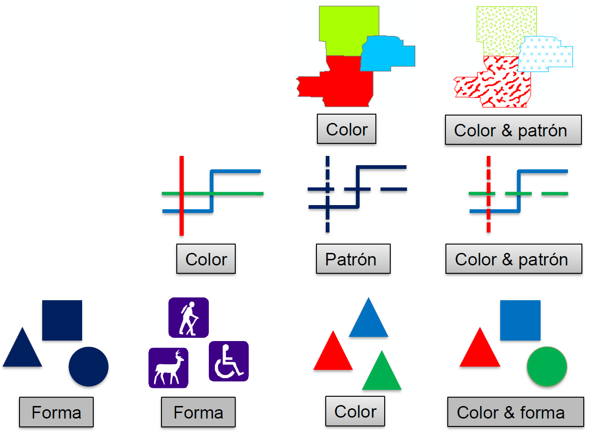

#### Caracterización cuantitativa

Implica el ordenamiento de datos y, opcionalmente, la creación de clases de valores. Los datos suelen provenir de censos, mediciones directas o estadísticas derivadas.

* **Variables visuales principales:** Tamaño (para símbolos proporcionales) y valor del color (luminosidad o intensidad).
* **Aplicación:** Mapas de densidad de población, niveles de contaminación o volumen de tráfico.

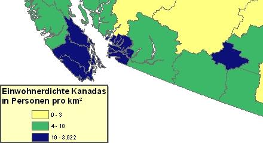

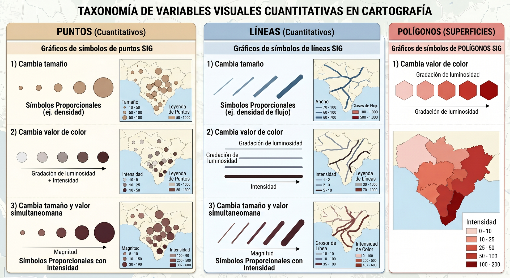


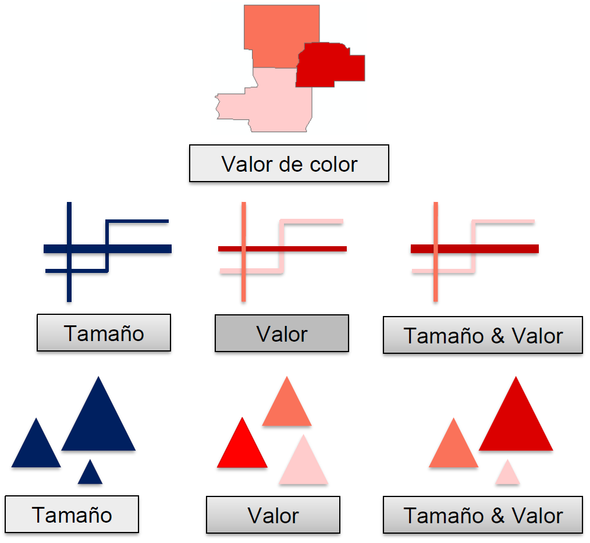

### Clasificación de datos frente a datos no clasificados

El tratamiento de los datos cuantitativos permite dos aproximaciones principales en el diseño de leyendas:

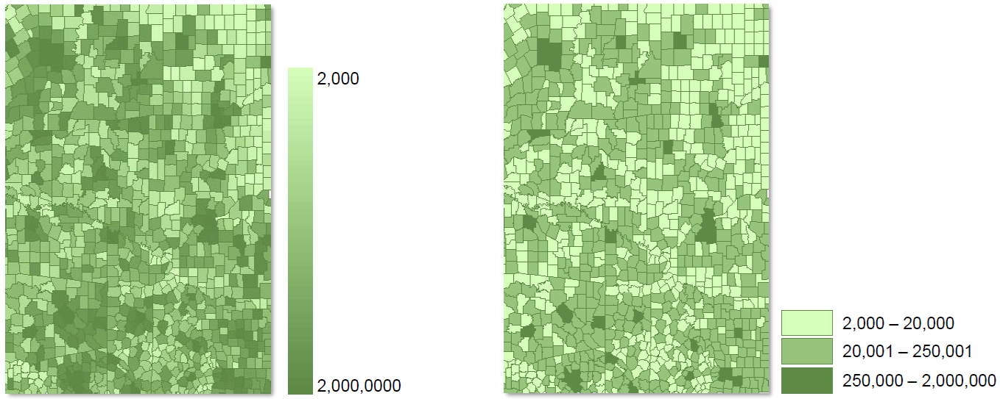

#### Datos no clasificados

Asignan un color o símbolo único a cada valor individual presente en el dataset.

* **Ventajas:** Minimiza la generalización y permite observar fracturas claras en la distribución de los datos.
* **Desventajas:** Dificulta la lectura visual y genera leyendas excesivamente extensas y poco informativas.

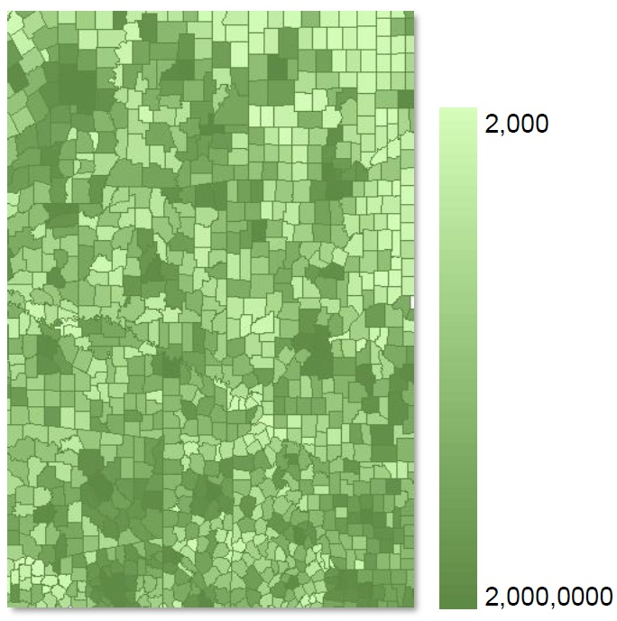{fig-align="center" width="50%"}

#### Datos clasificados

Agrupan los valores en rangos sucesivos y no superpuestos (clases). Cada rango recibe un símbolo específico.

* **Ventajas:** Facilita la identificación de patrones y tendencias; genera leyendas con alto valor comunicativo.
* **Desventajas:** Introduce procesos de generalización y puede ocultar variaciones o saltos significativos dentro de una misma clase.

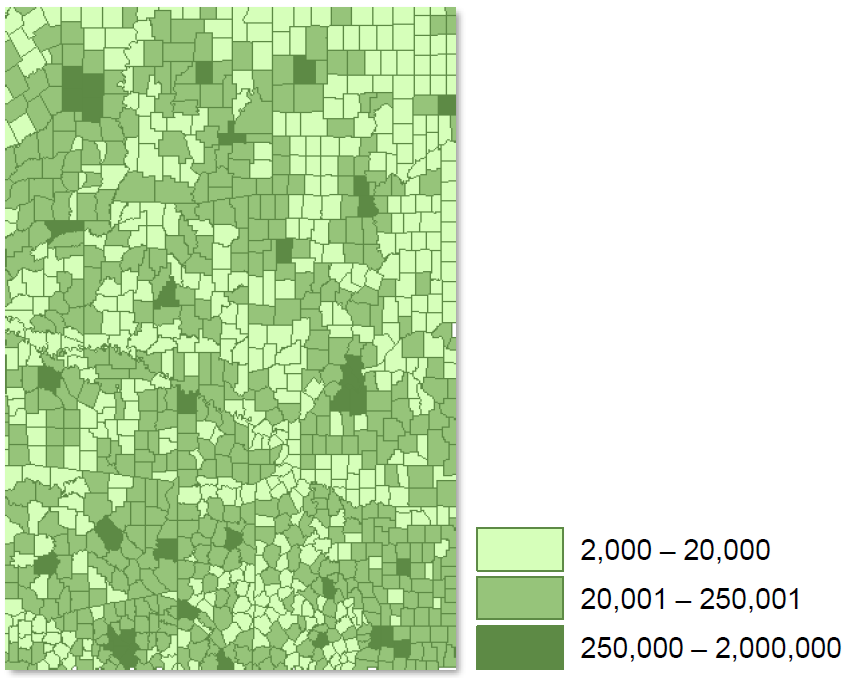{fig-align="center" width="50%"}

Para una clasificación técnica estandarizada, se recomienda el uso de 5 clases, aunque el marco metodológico permite un rango de entre 1 y 32 clases dependiendo de la complejidad del fenómeno analizado.


### Clasificación de datos geoespaciales

La clasificación de datos es un proceso crítico en la cartografía temática que permite agrupar observaciones numéricas en categorías discretas. Este procedimiento es fundamental para simplificar la complejidad de los datos y revelar patrones espaciales que de otro modo permanecerían ocultos. Es importante considerar que la elección del método de clasificación puede alterar significativamente la interpretación del mapa, permitiendo incluso sesgar la comunicación visual si no se aplica con rigor estadístico.

* Los valores son ordenados por clases
* Estándar 5 clases; se permiten 1 a 32 
* Clases son sucesivas y no se superponen
* Cada valor de rango tiene un símbolo específico

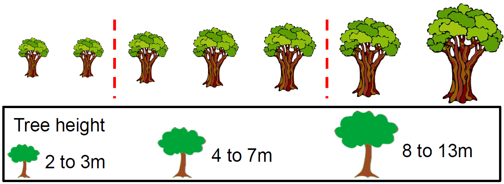

Se puede mentir con un mapa debido a las diferentes formas de clasificación de los datos:

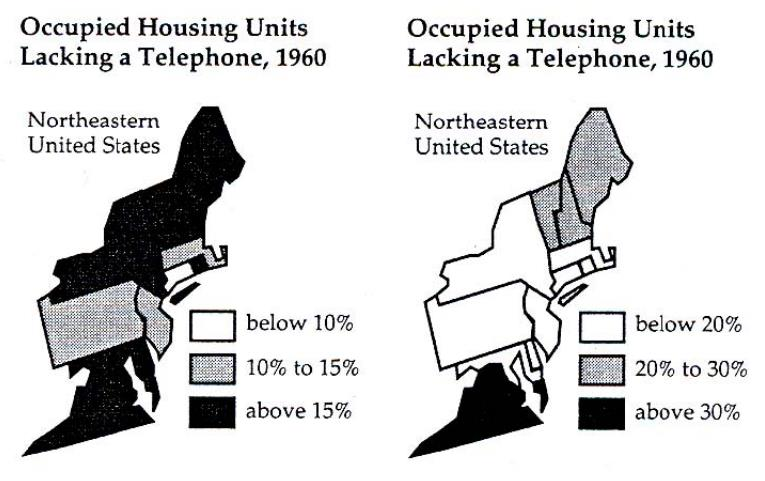{fig-align="center" width="50%"}


#### Métodos de clasificación estadística

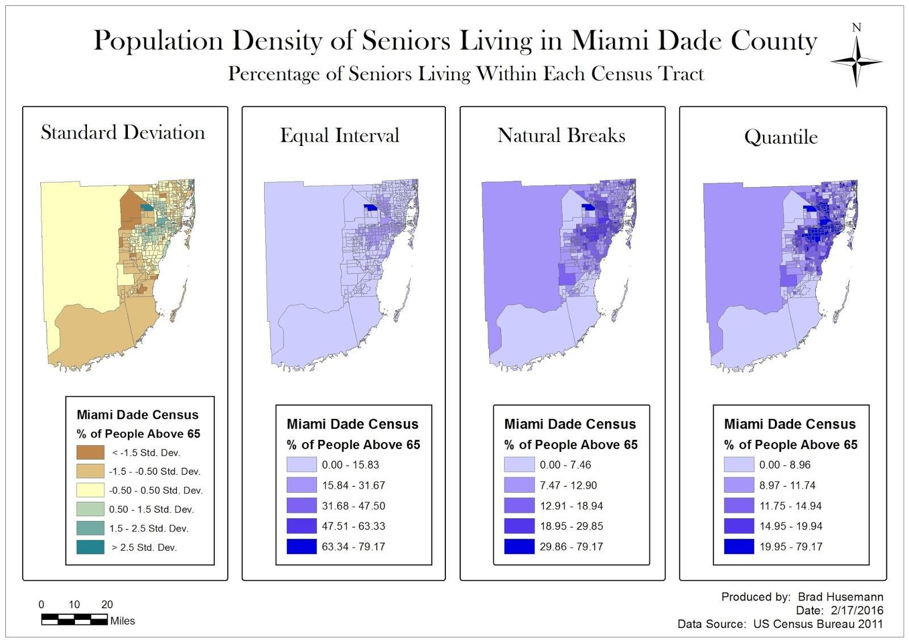

Existen diversos algoritmos para definir los intervalos de clase, cada uno con implicaciones analíticas distintas:

* **Natural breaks (Cortes naturales o Jenks):** Identifica agrupamientos naturales en los datos para **minimizar** la **varianza** **dentro** de las clases y **maximizarla entre** ellas. Es el método más versátil.

Las clases se fundamentan en agrupaciones naturales de los valores de los datos. En el caso de ArcGIS Pro, este detecta los puntos de quiebre mediante la identificación de agrupaciones y patrones inherentes a la estructura de los datos. Las entidades espaciales se dividen en clases cuyos límites se definen en aquellos puntos donde se presentan saltos significativos en los valores.

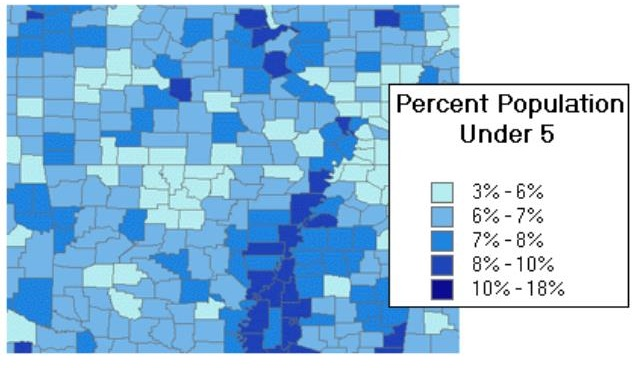{fig-align="center" width="50%"}

* **Equal interval (Intervalos iguales):** Divide el rango de valores en intervalos de igual magnitud. Es ideal para datos cuya distribución es uniforme.

Este esquema de clasificación divide el rango de valores de los atributos en subrangos de igual magnitud. Por ejemplo, si las entidades poseen valores de atributo en un rango de 0 a 300 y se definen tres clases, cada una representará un intervalo de 100, con rangos de clase de 0-100, 101-200 y 201-300. Este método enfatiza la magnitud de un valor de atributo en relación con otros valores. Como ilustración, permite demostrar que un establecimiento comercial pertenece al grupo que constituye el tercio superior del total de ventas. Su aplicación resulta óptima para rangos de datos conocidos, tales como porcentajes y temperatura.


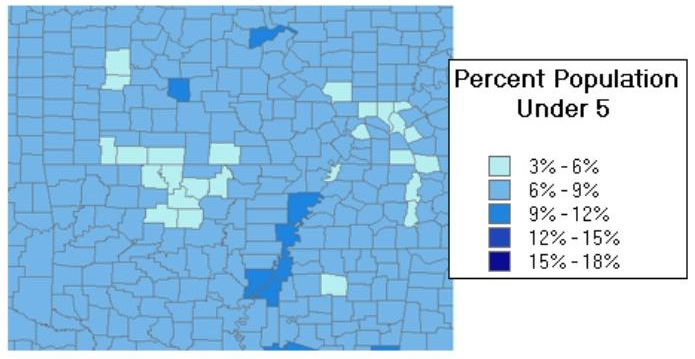{fig-align="center" width="50%"}

* **Quantile (Cuantiles):** Asigna el mismo número de unidades cartográficas a cada clase. Es útil para resaltar diferencias en la parte media de la distribución.

Cada clase contiene un número equivalente de entidades. La clasificación por cuantiles resulta apropiada para datos con una distribución lineal. Debido a que las entidades se agrupan según la cantidad de elementos en cada clase, el mapa resultante puede inducir a interpretaciones erróneas. Existe el riesgo de que entidades con valores similares se asignen a clases adyacentes, o que entidades con valores significativamente distintos se agrupen en la misma categoría. Esta distorsión puede minimizarse mediante el incremento del número de clases.

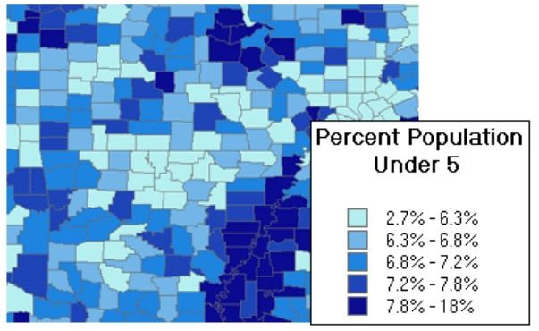{fig-align="center" width="50%"}


* **Standard deviation (Desviación estándar):** Muestra cuánto varían los valores respecto a la media aritmética del conjunto de datos.

Este esquema de clasificación permite visualizar la medida en que el valor del atributo de una entidad varía respecto a la media aritmética. El software calcula el valor medio y genera los cortes de clase mediante la adición o sustracción sucesiva de la desviación estándar a partir de dicho valor. Una rampa de color bícroma o divergente facilita el énfasis en los valores situados por encima de la media (representados en azul) y por debajo de la misma (representados en rojo).

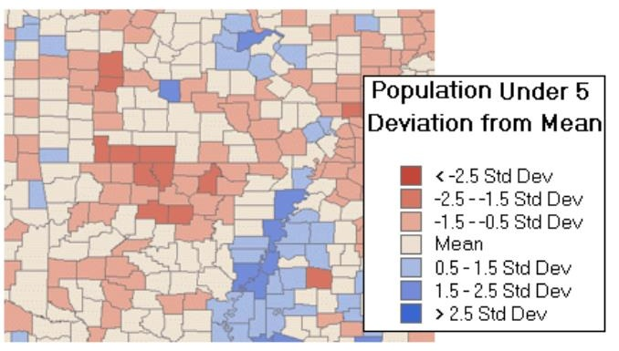{fig-align="center" width="50%"}


#### Selección del método de clasificación óptimo

La determinación del método más adecuado depende de la distribución estadística de los datos (**evaluable mediante el histograma**), el mensaje que se desea comunicar y la estética del producto final. 

* **Equal interval:** Enfatiza las diferencias en los extremos de los rangos de valores.
* **Quantile:** Resalta las diferencias en el centro de la distribución.
* **Standard deviation:** Identifica valores atípicos y la dispersión respecto al promedio.
* **Natural breaks:** Adecuado para la mayoría de las aplicaciones geográficas generales.

```{r}
#| echo: false
#| warning: false
#| message: false
#| results: asis

library(knitr)
library(kableExtra)
library(dplyr)

# Matriz de datos técnicos basada en Slocum (1999)
datos <- data.frame(
  Criterio = c(
    "Considera la distribución de datos en una recta numérica",
    "Facilidad de comprensión del concepto",
    "Facilidad de cálculo",
    "Facilidad de comprensión de la leyenda",
    "Valores de la leyenda coinciden con el rango de datos en una clase",
    "Aceptable para datos ordinales",
    "Ayuda en la selección del número de clases"
  ),
  Intervalos = c("D", "MB", "MB", "MB", "D", "I", "D"),
  Cuantiles = c("D", "MB", "MB", "D", "MB", "A", "D"),
  Desviacion = c("B", "MB", "MB", "B", "D", "I", "D"),
  Cortes = c("MB", "MB", "MB", "D", "MB", "I", "B")
)

# Aplicación de semántica cromática (Verde -> Rojo)
datos_formato <- datos %>%
  mutate(across(Intervalos:Cortes, ~ cell_spec(.x, 
    color = case_when(
      .x == "MB" ~ "#155724", # Verde oscuro
      .x == "B"  ~ "#1e7e34", # Verde medio
      .x == "A"  ~ "#856404", # Ocre/Amarillo oscuro
      .x == "D"  ~ "#721c24", # Rojo oscuro
      .x == "I"  ~ "#721c24", # Rojo oscuro
      TRUE       ~ "black"
    ),
    background = case_when(
      .x == "MB" ~ "#d4edda", # Verde éxito
      .x == "B"  ~ "#e9f7ef", # Verde claro
      .x == "A"  ~ "#fff3cd", # Amarillo advertencia
      .x == "D"  ~ "#f8d7da", # Rojo peligro
      .x == "I"  ~ "#f5c6cb", # Rojo intenso
      TRUE       ~ "white"
    ),
    bold = TRUE)))

# Construcción de la tabla con kableExtra
tabla <- kbl(datos_formato, 
    escape = FALSE, 
    align = "lcccc",
    col.names = c("Criterio", "Intervalos iguales", "Cuantiles", "Desviación estándar", "Cortes naturales"),
    caption = "Criterios para la selección de un método de clasificación") %>%
  kable_styling(bootstrap_options = c("hover", "condensed"), 
                full_width = TRUE, 
                font_size = 14) %>%
  row_spec(0, bold = TRUE, background = "#F2F2F2") %>%
  column_spec(1, width = "35%", bold = TRUE, background = "#F8F9FA")

# Renderizado asis para asegurar el ancho total del pie de página
cat(tabla)
cat("<div style='font-size: 13px; text-align: justify; margin-top: 10px; border-top: 1px solid #dee2e6; padding-top: 5px;'><em>Fuente:</em> Slocum, T. A. (1999). Thematic Cartography and Visualization. MB: Muy bueno; B: Bueno; A: Aceptable; D: Deficiente; I: Inaceptable.</div>")
```


#### Definición del número de clases

El número de categorías debe equilibrar la precisión y la legibilidad. Un exceso de clases dificulta la discriminación de símbolos en la leyenda y en el cuerpo del mapa. Por el contrario, un número insuficiente de clases genera una generalización excesiva que oculta la variabilidad del fenómeno estudiado.

::: {#impacto-clases layout="[[50, 50]]" layout-valign="center"}
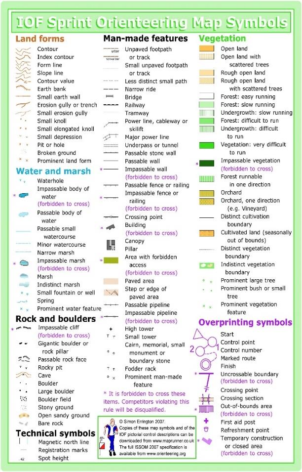

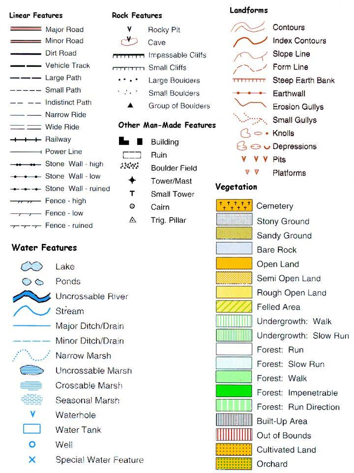

Impacto del número de clases
:::

### Estrategias de simbolización cuantitativa

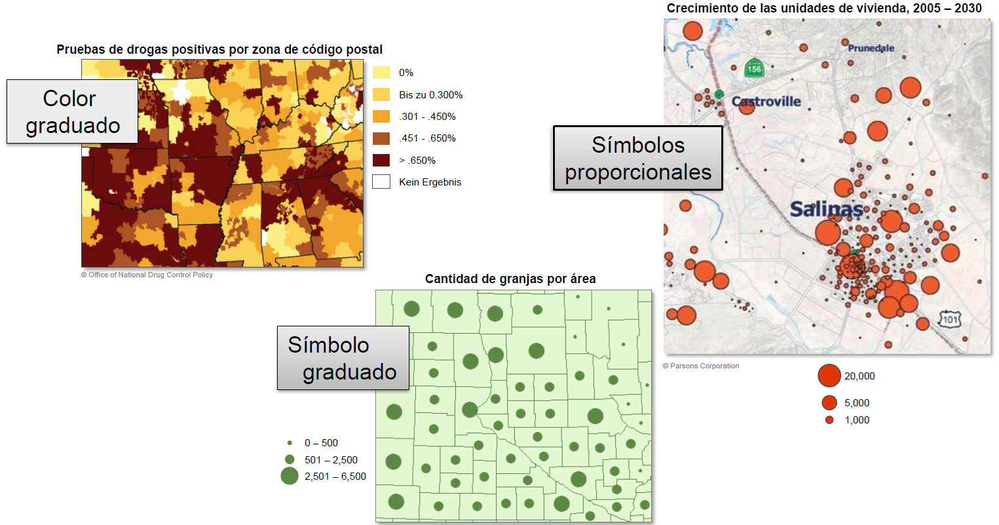{fig-align="center" width="100%"}

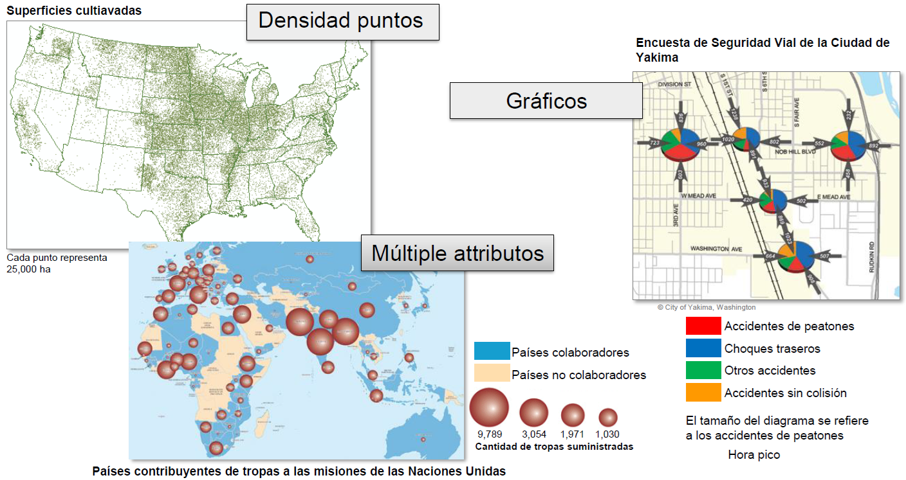{fig-align="center" width="100%"}

La representación de magnitudes requiere métodos que traduzcan valores numéricos en variables visuales escalables:

* **Proportional symbols (Símbolos proporcionales):** El tamaño del símbolo varía de forma continua y exacta según el valor del atributo.
* **Graduated symbols (Símbolos graduados):** El tamaño varía según rangos de clase predefinidos.
* **Graduated colors (Colores graduados):** Utiliza variaciones de luminosidad o intensidad para representar magnitudes (mapas de coropletas).
* **Charts (Gráficos):** Integra gráficos de sectores o barras para representar múltiples atributos simultáneamente.
* **Dot density (Densidad de puntos):** Representa la frecuencia de un fenómeno mediante la dispersión de puntos en un área.
* **Multiple attributes (Múltiple atributos):** Usa información de múltiples campos o atributos para crear la simbología.


### El rol del color en el diseño cartográfico

El color es uno de los componentes más influyentes del diseño, ya que influencia reacciones psicológicas, evoca emociones, y facilita la categorización rápida de elementos espaciales.

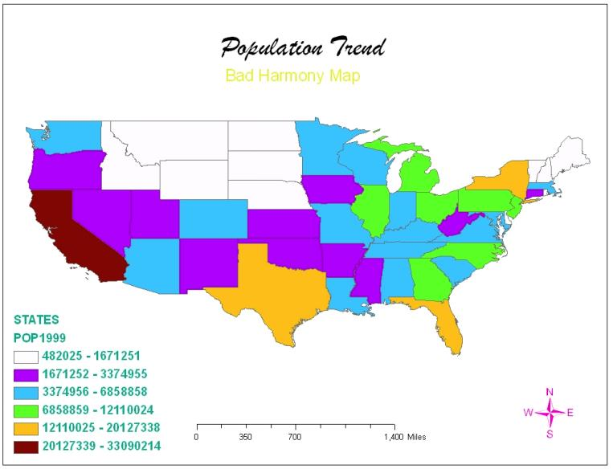{fig-align="center" width="70%"}

#### Percepción y psicología del color

* **Colores cálidos (rojo, naranja, amarillo):** Tienden a percibirse como elementos en primer plano y suelen asociarse a valores positivos o de alerta (ej: semáforos).

    * Mejores para figuras

* **Colores fríos (violeta, azul, verde):** Tienden a retroceder visualmente.

    * Positivo (verde) vs. negativo (rojo)

* **Convenciones técnicas:** 

    * El azul se reserva para la hidrografía 
    * El verde para la cobertura vegetal o áreas protegidas.
    * Elementos similares usan colores similares o seriales


#### Accesibilidad y daltonismo

Es un imperativo ético y técnico considerar las deficiencias en la percepción del color, las cuales afectan aproximadamente al 7% de la población masculina y al 1% de la población femenina. El diseño debe asegurar que la información sea interpretable incluso en condiciones de daltonismo.

::: {layout="[[60, 40]]" layout-valign="center"}

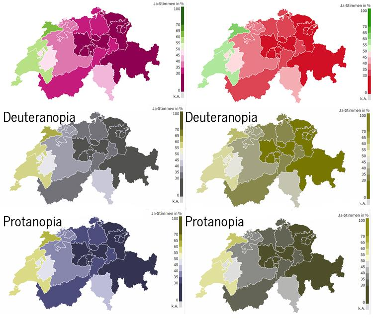

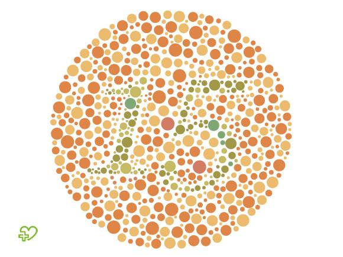

:::


#### Definición del color

La eficacia de una visualización cartográfica depende de la correcta selección del modelo de color, la cual debe estar alineada con el medio de salida y el propósito del análisis. En la ciencia de datos geoespaciales, la definición técnica del color permite asegurar la reproducibilidad y la claridad en la comunicación de resultados.

Existen diversos estándares para la especificación numérica de los colores, cada uno optimizado para diferentes contextos de hardware y percepción:

* **RGB** (Red, Green, Blue): Modelo **aditivo** para visualización en pantalla.

* **CMYK** (Cyan, Magenta, Yellow, Black): Modelo **sustractivo** para procesos de impresión.

* **HSV** (Hue, Saturation, Value): Modelo **perceptual** para la manipulación intuitiva durante el diseño.

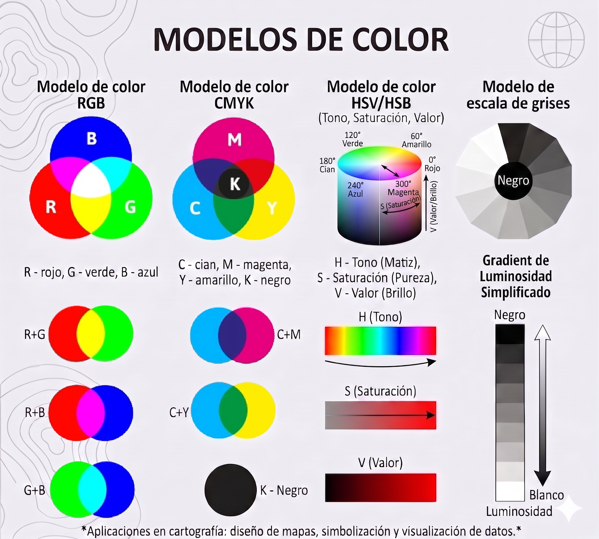{fig-align="center" width="70%"}

#### RGB

Modelo **aditivo** fundamentado en la síntesis de luz. Es el estándar para la representación de datos en monitores, dispositivos móviles y cualquier entorno de visualización digital.

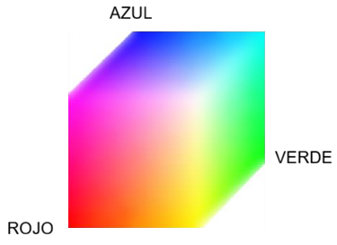{fig-align="center" width="30%"}

#### CMYK

Modelo **sustractivo** basado en pigmentos. Su uso es mandatorio para la producción de cartografía física e impresa, donde la fidelidad del color depende de la absorción de luz sobre el sustrato.

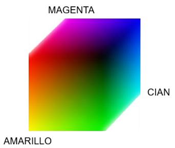{fig-align="center" width="30%"}

#### HSV

Modelo **perceptual** que organiza el color de acuerdo con la interpretación humana. Es el marco de trabajo más eficiente para el diseño de leyendas y la manipulación de variables visuales en herramientas SIG, ya que permite ajustar de forma independiente el **tinte**, la **intensidad** y la **luminosidad**.

La caracterización técnica del color se fundamenta en la descomposición de la señal lumínica en tres parámetros independientes que facilitan la jerarquización visual en cartografía temática:

* **Tinte** (Hue): Indica la longitud de onda dominante del espectro. Es la variable cualitativa primaria para diferenciar coberturas del suelo o entidades discretas.

* **Saturación** (Saturation): Representa el grado de pureza o intensidad cromática. Se utiliza técnicamente para denotar la concentración de un fenómeno espacial sin alterar su matiz.

* **Valor** (Value): Determina la luminosidad relativa, desde la ausencia total de luz hasta la reflexión máxima. Es el eje esencial para la creación de escalas secuenciales en mapas de coropletas.

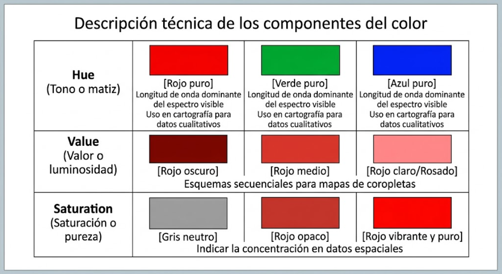{fig-align="center" width="100%"}

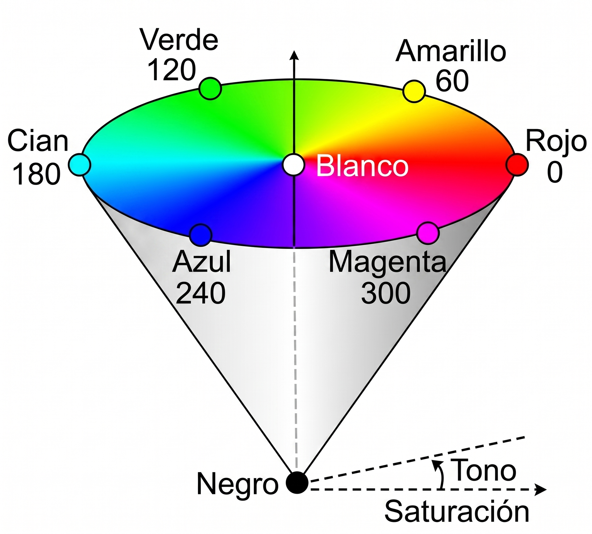{fig-align="center" width="40%"}


### Ubicación de etiquetas en entidades puntuales

El etiquetado (*labeling*) constituye el paso final para dotar de semántica al mapa. El etiquetado es un componente crítico que dota de semántica a los elementos geométricos del mapa. La ubicación de estos textos debe seguir reglas de prioridad para evitar solapamientos y asegurar que el lector asocie inequívocamente el nombre con la entidad correspondiente.

#### Ubicación en entidades puntuales

Para los puntos, existe una jerarquía de posiciones preferenciales. La posición superior derecha (indicada habitualmente como la posición 1) es la ubicación óptima. Se debe evitar colocar etiquetas directamente sobre el símbolo o en posiciones que dificulten la lectura de otros elementos adyacentes.

::: {layout="[[20, 25, 45]]" layout-valign="center"}

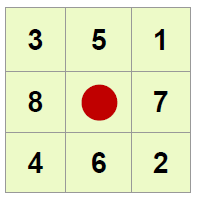

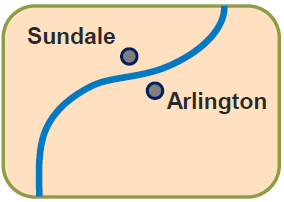

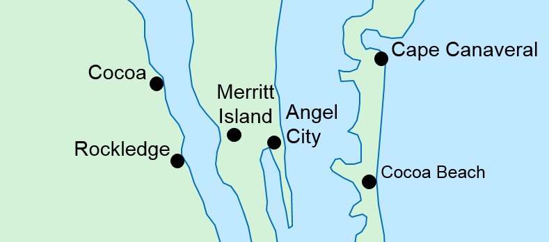

:::


#### Ubicación en entidades lineales

Las etiquetas para líneas (ríos, carreteras, curvas de nivel) deben adherirse a los siguientes principios técnicos:

* Seguir la alineación y curvatura de la entidad lineal.
* Repetir la etiqueta en entidades de gran longitud (como autopistas o fronteras extensas) para facilitar la identificación en diferentes sectores del mapa.
* Seleccionar porciones rectas y horizontales de la línea siempre que sea posible.
* Evitar inclinaciones que resulten en textos "cabeza abajo" o invertidos.
* Posicionar el texto preferiblemente sobre la línea (above line).
* Implementar curvas simples para mantener la legibilidad tipográfica.

::: {layout="[[33, 33, 33]]" layout-valign="center"}

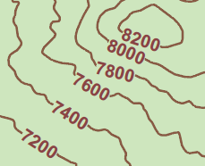

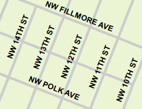

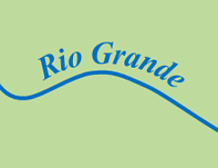

:::


::: {layout="[[50, 50]]" layout-valign="center"}

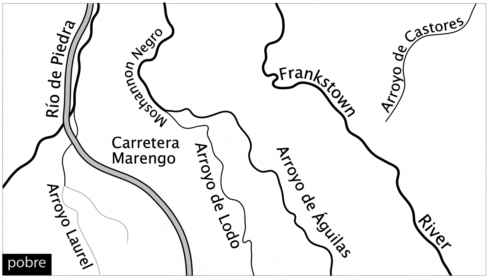

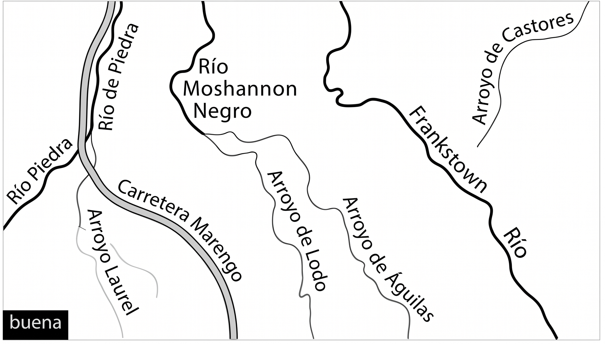

:::

<!-- ::: {layout="[[50, 50]]" layout-valign="center"}

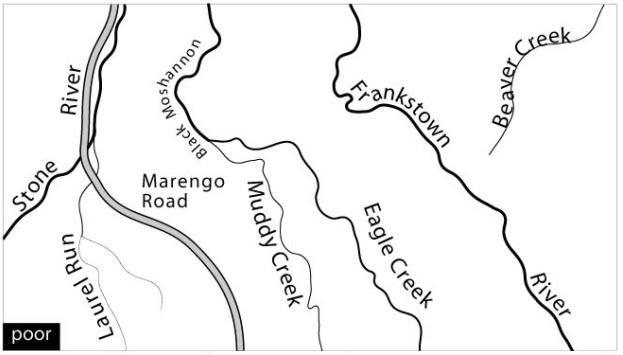

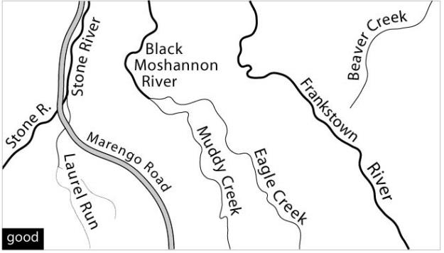

::: -->


#### Ubicación en entidades poligonales

El etiquetado de superficies debe comunicar la extensión de la entidad. Las directrices incluyen:

* Utilizar el espaciado entre caracteres (*character spacing*), el interlineado (*leading*) y curvas simples para cubrir la extensión del polígono.
* Emplear letras mayúsculas para textos con espaciado expandido.
* Ajustar los espacios entre letras de modo que crucen la entidad de forma equilibrada.
* Asegurar que las letras en palabras muy espaciadas no se confundan con símbolos independientes.

::: {layout="[[40, 60]]" layout-valign="center"}

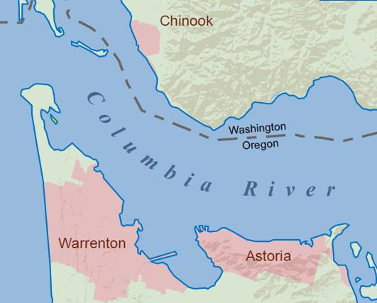

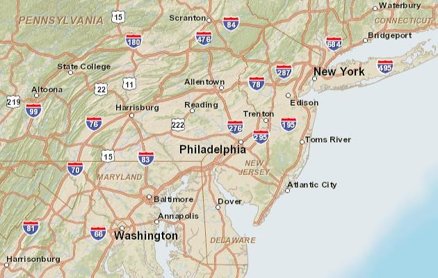

:::

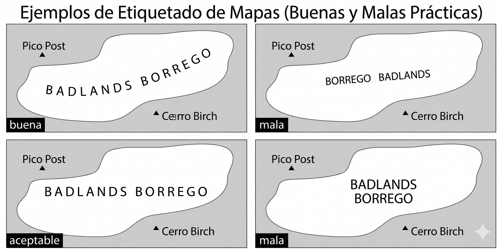{fig-align="center" width="80%"}

<!-- 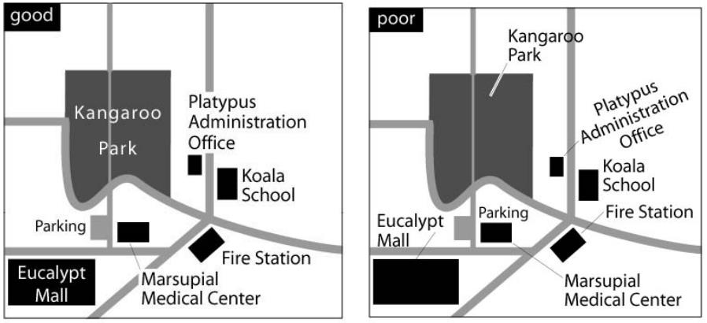{fig-align="center" width="80%"} -->

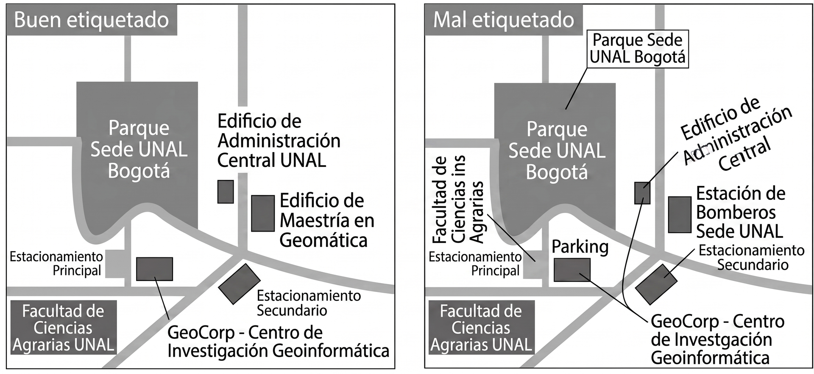{fig-align="center" width="80%"}


### Variables visuales en el etiquetado

La tipografía en cartografía actúa como una variable visual adicional. Se deben gestionar parámetros como el espaciado, el uso de mayúsculas/minúsculas (*case*), el valor del color (brillo), el tamaño, el peso de la fuente y el tono del color (*hue*).

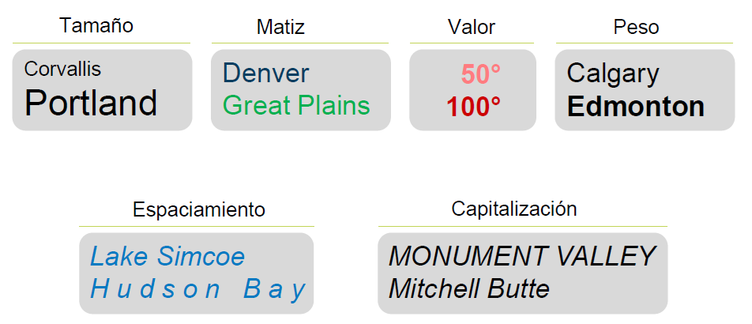{fig-align="center" width="80%"}


Adicionalmente, se deben considerar aspectos como la organización del texto, la redacción (concisión), la ortografía y el uso de fuentes diferenciadas para distintos tipos de entidades (ej: cursiva para hidrografía).

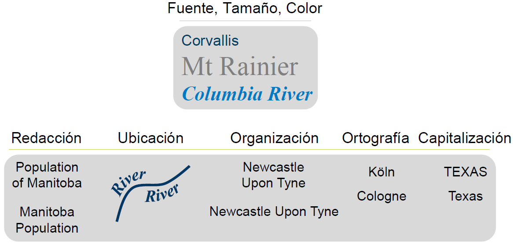{fig-align="center" width="80%"}


## Diseño de la composición del mapa (layout)


```{mermaid}
graph TD
    %% Definición de estilos
    classDef mainNode font-size:14pt,font-weight:bold,fill:#f9f9f9,stroke:#333,stroke-width:2px;
    classDef questions font-size:12pt,font-style:italic,fill:#ffffff,stroke:#999,stroke-dasharray: 5 5;
    classDef feedback stroke:#e67e22,stroke-width:2px,stroke-dasharray: 5 5;
    classDef highlight fill:#fff3cd,stroke:#d4a017,stroke-width:4px;

    %% Nodos principales
    P(Planificación) --> D(Datos)
    D --> S(Simbología)
    S --> L(Composición)
    L --> O(Salida)

    %% Lazo de retroalimentación (Ciclo)
    L -.->|Refinamiento e iteración| P

    %% Bloques de preguntas vinculados
    P --- PQ["¿Cómo se utilizará el mapa?<br/>¿Qué tipos de mapas se crearán?"]
    D --- DQ["¿Qué datos se utilizarán?"]
    S --- SQ["¿Cómo se simbolizarán los datos?"]
    L --- LQ["¿Cómo se diseñará la composición?"]
    O --- OQ["¿Cómo se publicará el mapa?"]

    %% Aplicación de estilos
    class P,D,S,O mainNode;
    class PQ,DQ,SQ,OQ questions;
    class L,LQ highlight;
    linkStyle 4 stroke:#e67e22,stroke-width:2px,stroke-dasharray: 5 5;
```


La fase de composición organiza todos los elementos cartográficos (marco de datos, leyenda, escala, norte, títulos) en un lienzo final. Las decisiones de diseño deben responder a preguntas sobre el **tamaño de página**, la **orientación** (vertical u horizontal) y la **naturaleza del producto** (estático o interactivo).

```{mermaid}
flowchart LR
    %% Definición de nodos con etiquetas en Sentence case
    A("Definir tamaño y<br/>orientación de página")
    B("Definir marco de datos<br/>(Dataframe)")
    C("Elegir escala del mapa<br/>(Map scale)")
    D("Crear cuadrícula<br/>(Grid)")
    E("Insertar y ubicar<br/>elementos del mapa")

    %% Estructura del flujo
    A --> B
    B --> C
    C --> B
    C --> D
    D --> E

    %% Definición de estilos para los pasos del proceso
    classDef step fill:#ffffff,stroke:#bfbfbf,stroke-width:2px,color:#000000;
    class A,B,C,D,E step;

    %% Estilo para resaltar el ciclo de iteración técnica en azul oscuro
    linkStyle 1,2 stroke:#000080,stroke-width:4px;
```

### Control del peso visual y contraste

El cartógrafo debe gestionar el peso visual para dirigir la atención del usuario hacia la información más importante. El uso del contraste es fundamental para mejorar la legibilidad y separar los diferentes niveles de información visual.


::: {layout="[[50, 50]]" layout-valign="center"}

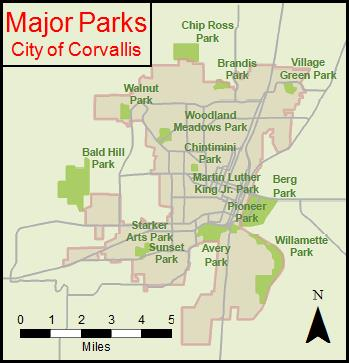

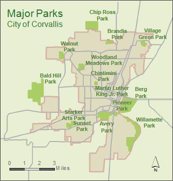

:::


::: {layout="[[50, 50]]" layout-valign="center"}

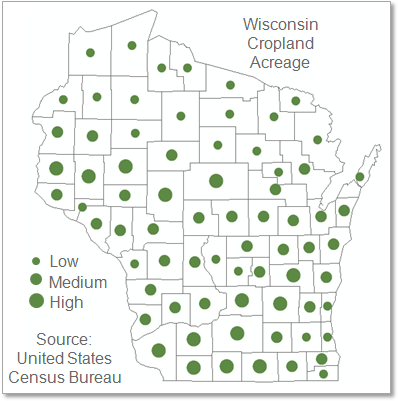

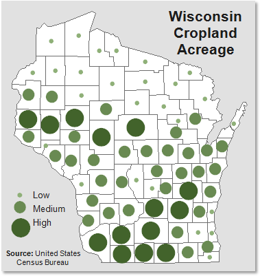

:::


### Construir niveles de información visual

::: {layout="[[50, 50]]" layout-valign="center"}

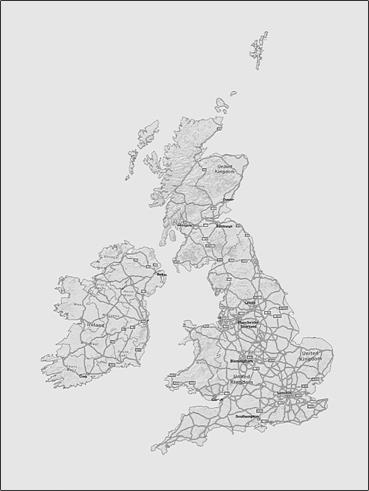

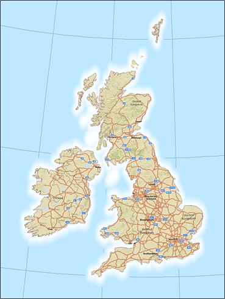

:::


### Enfoque y equilibrio (balance)

Un buen diseño cartográfico logra un equilibrio entre los elementos técnicos y los espacios vacíos, asegurando que el mapa no se perciba saturado ni desorganizado. La jerarquía visual permite que el usuario procese la información de manera estructurada.

::: {layout="[[50, 50]]" layout-valign="center"}

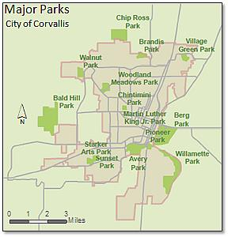

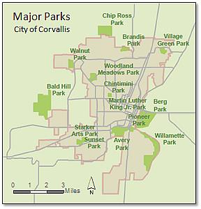

:::


