# Conversión de Formatos (ArcGIS Pro - QGIS)

[👉 Descargar Datos del Taller de Conversión (incluye datos para ejercicios finales)](https://drive.google.com/file/d/1ZhzEN-3Cg7yP-lbsST7zk-mEq4IKvUO4/view?usp=sharing)

## Introducción

Establecer estándares universales para datos geográficos ha demostrado ser un objetivo complejo. En la actualidad, no existe una normalización única que tenga aceptación global absoluta, en parte por la continua evolución tecnológica y por los ecosistemas cerrados que han desarrollado diversos fabricantes de software a lo largo del tiempo. 

Sin embargo, frente a la necesidad de compartir datos, la tendencia se ha enfocado en el uso y creación de formatos de intercambio (o el soporte multipropósito mediante librerías como GDAL/OGR) que permiten trasladar información de un sistema a otro, evitando la pérdida de datos o la duplicación de esfuerzos técnicos. Un usuario moderno de Sistemas de Información Geográfica (SIG) debe conocer los métodos y las herramientas para convertir datos espaciales a formatos compatibles según la necesidad de análisis o la plataforma de trabajo (ArcGIS Pro, QGIS, bases de datos espaciales, etc.).

## Objetivos

* Reconocer los diversos formatos de estructuras de datos vectoriales y ráster soportados por los SIG modernos.
* Comprender los fundamentos teóricos detrás de la compresión de imágenes y las reglas de asignación espacial durante las transformaciones.
* Practicar los métodos de importación, exportación e intercambio de diferentes formatos de datos espaciales en ArcGIS Pro y QGIS.
* Ejecutar conversiones geográficas de datos ráster a vector y de vector a ráster.

## Marco de referencia

Cuando se habla de conversión de formatos, se hace referencia a dos dimensiones distintas: por un lado, la migración de archivos entre diferentes extensiones o arquitecturas (ej. de Shapefile a GeoPackage) y, por otro, la conversión del modelo de datos espaciales, es decir, de vector a ráster (rasterización) o de ráster a vector (vectorización).

### Consideraciones sobre formatos vectoriales y CAD

Muchos de los datos que se incorporan a los SIG provienen de programas de Dibujo Asistido por Computador (CAD). Existe una gran variedad de formatos CAD, siendo los más comunes como estándar de intercambio los `.dxf` y `.dwg` (AutoCAD) y los `.dgn` (MicroStation). 

Estos archivos suelen almacenar la información de las entidades separándolas gráficamente en puntos, líneas, polígonos y anotaciones (textos). Al incorporarlos a un SIG, es importante recordar que a menudo carecen de un sistema de coordenadas espaciales definido (proyección geométrica pura), por lo que suele ser necesario georreferenciarlos y exportarlos a formatos nativos SIG (como Geodatabases o GeoPackages) para habilitar su análisis topológico y de atributos.

### Consideraciones sobre formatos ráster y compresión

El conocimiento de la procedencia y las características de cada formato de imagen permite su óptima utilización. Algunos de los más relevantes incluyen:

* **Multibandas nativos (.BIL, .BIP, .BSQ):** Formatos binarios clásicos utilizados para almacenar información satelital original. Suelen requerir archivos de texto adjuntos (metadatos o archivos *world*) que le indican al software el orden de los bytes y las coordenadas de georreferenciación.
* **ERDAS IMAGINE (.IMG):** Diseñado para almacenar tanto rásters de capas temáticas (usos del suelo discretos) como variables continuas (imágenes satelitales, Modelos Digitales de Terreno).
* **TIFF / GeoTIFF (.TIF):** Uno de los formatos más extendidos por su flexibilidad. El estándar GeoTIFF permite incrustar etiquetas (tags) en la cabecera del archivo con la información de proyección, datum, elipsoide y coordenadas, evitando la necesidad de archivos de referenciación externos.

**Los formatos de compresión:**
Existen básicamente dos formas de comprimir documentos ráster:
1. **Con pérdida de información (Lossy):** Como **JPEG** o **MrSID** (Multiresolution Seamless Image Database). Alcanzan proporciones de compresión altísimas (20:1 o más) transformando o desechando valores redundantes. Son excelentes para visualización de fondos (ortofotos), pero **no se recomiendan para procesos de análisis digital** ya que alteran los valores originales de los píxeles.
2. **Sin pérdida de información (Lossless):** Como **LZW** o **Run-Length Encoding (RLE)**. Reducen el tamaño del archivo agrupando valores idénticos sin alterar los datos crudos, siendo ideales para preservar la integridad analítica de la imagen.

### Operaciones de conversión de capas vectoriales a ráster y viceversa

Las conversiones de modelos de datos responden a reglas geométricas estrictas para decidir cómo se asignan los valores en el espacio.

**De Vectorial a Ráster (Rasterización):**
El proceso superpone una retícula ortogonal sobre la capa vectorial. Cada píxel toma un valor numérico heredado de un campo de la tabla de atributos del vector original. Las reglas de asignación suelen ser:

* **Polígonos:** El píxel toma el valor del polígono que coincide con su centroide, o aquel que cubre la mayor área de la celda.
* **Líneas:** El píxel toma el valor de la línea que lo intersecta. Si varias líneas lo cruzan, toma el valor de la primera detectada o se pueden aplicar reglas de prioridad.
* **Puntos:** El píxel adquiere el valor del punto contenido en él.
*(Nota: Si un píxel no coincide con ningún objeto, se le asigna valor "No Data" o nulo).*

**De Ráster a Vectorial (Vectorización):**
El usuario define el tipo de geometría de salida.

* **Ráster a Polígonos:** Se forman polígonos fusionando píxeles adyacentes que comparten exactamente el mismo valor (Gridcode).
* **Ráster a Líneas:** Se generan líneas trazadas a través del centroide de los píxeles alineados, usualmente permitiendo aplicar algoritmos de suavizado o simplificación (generalización) para reducir los vértices escalonados.
* **Ráster a Puntos:** Se crea una entidad puntual en el centro geométrico de cada píxel válido.


### Tipos de formatos ráster soportados

::: {.panel-tabset}

#### ArcGIS

Menú `Project` (Proyecto) -> `Options` (Opciones) -> `Raster and Imagery` (Ráster e imágenes) -> `Raster Formats` (Formatos ráster)

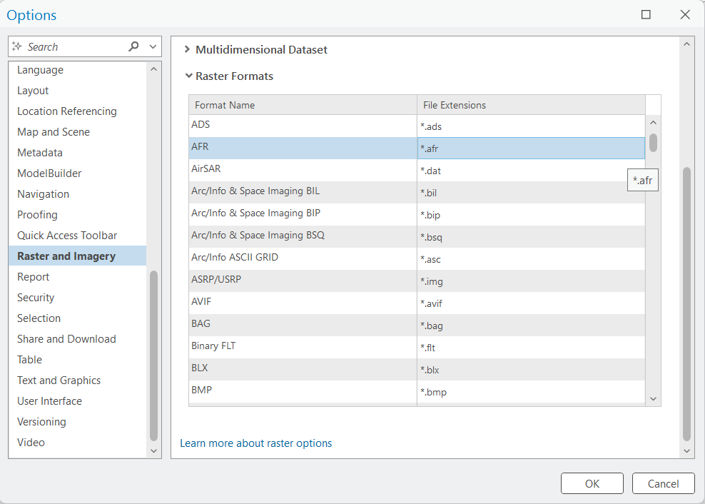{#fig-raster-arcgis fig-align="center" width="75%"}

Ver la [ayuda](https://pro.arcgis.com/en/pro-app/latest/help/data/imagery/supported-raster-dataset-file-formats.htm) para mayor información.

#### QGIS

Menú `Settings` (Configuración) -> `Options` (Opciones) -> `GDAL` -> pestaña `Raster Drivers` (Controladores ráster)

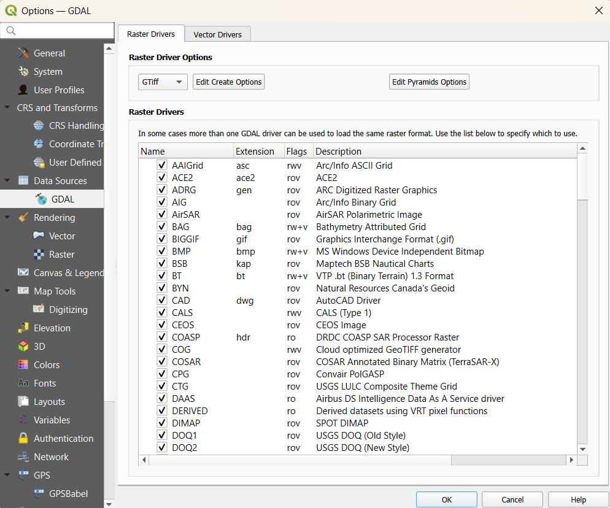{#fig-raster-qgis fig-align="center" width="75%"}

**Explicación de los *Flags* (Capacidades) en QGIS:**

La columna **Flags** en la tabla de GDAL indica los permisos exactos que tiene QGIS para interactuar con cada formato de archivo. Cada letra representa una capacidad específica:

* **`r` (Read - Lectura):** QGIS puede abrir y visualizar el archivo.
* **`w` (Write - Escritura):** QGIS puede crear, guardar o exportar un archivo nuevo en este formato desde cero.
* **`+` (Update - Actualización):** QGIS puede modificar un archivo existente (por ejemplo, editar sus metadatos o cambiar valores de píxeles) sin tener que crear un archivo completamente nuevo.
* **`v` (Virtual IO - Entrada/Salida Virtual):** QGIS puede leer o escribir este archivo dentro de "sistemas de archivos virtuales". Esto permite abrir un ráster que está comprimido dentro de un `.zip` o alojado en la web mediante una URL, sin necesidad de extraerlo o descargarlo previamente.

**Ejemplos de combinaciones comunes:**

* **`ro`:** Solo lectura. Se puede visualizar, pero no modificar ni crear, y no soporta archivos virtuales.
* **`rov`:** Solo lectura + soporte virtual. Se puede visualizar directamente desde un `.zip` o desde internet.
* **`rwv`:** Lectura, escritura + soporte virtual. Se puede abrir, crear nuevos archivos y usar archivos virtuales.
* **`rw+v`:** Control total. Permite abrir, crear, actualizar un archivo existente y soporta lectura desde archivos comprimidos o la web.

:::


### Tipos de formatos vector soportados

::: {.panel-tabset}

#### ArcGIS

A diferencia de los formatos ráster, **ArcGIS Pro no centraliza el listado de formatos vectoriales en su menú de opciones**. El soporte nativo para vectores está integrado en el núcleo del software (Geodatabases de archivos y móviles, Shapefiles, KML, archivos CAD, etc.).

Para visualizar los tipos de archivos vectoriales y bases de datos espaciales que el software reconoce directamente, la forma más sencilla es a través del cuadro de diálogo al agregar datos:

Pestaña `Map` (Mapa) -> `Add Data` (Agregar datos) -> `Browse...` (Examinar...). En la ventana "Add data", al desplegar la lista de tipos (Tipo de elemento) al lado de **Name** , verás los formatos soportados.

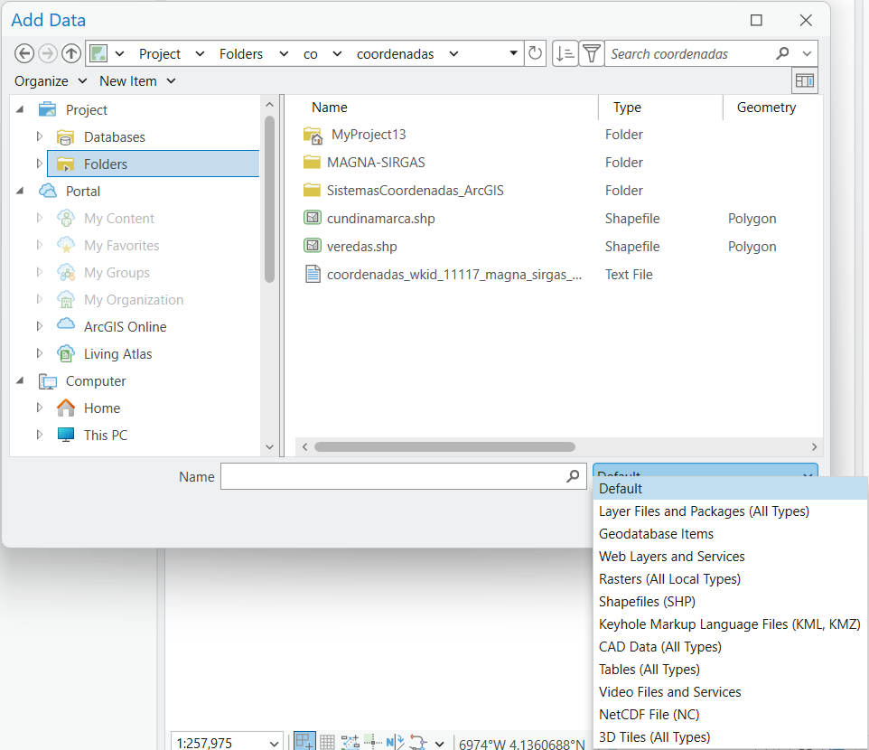{#fig-vector-arcgis fig-align="center" width="75%"}

> **Nota:** Para leer y escribir en formatos vectoriales no nativos o más especializados, ArcGIS Pro utiliza una extensión llamada **Data Interoperability**, la cual habilita el soporte para más de 300 formatos adicionales. Puedes consultar la lista completa en la [ayuda oficial de Esri](https://pro.arcgis.com/en/pro-app/latest/help/projects/supported-data-types-and-items.htm).

#### QGIS

QGIS utiliza la biblioteca **OGR** (parte del proyecto GDAL) para la lectura y escritura de datos vectoriales. Puedes ver la lista completa de formatos, sus controladores (drivers) y capacidades en:

Menú `Settings` (Configuración) -> `Options` (Opciones) -> `GDAL` -> pestaña `Vector Drivers` (Controladores vectoriales).

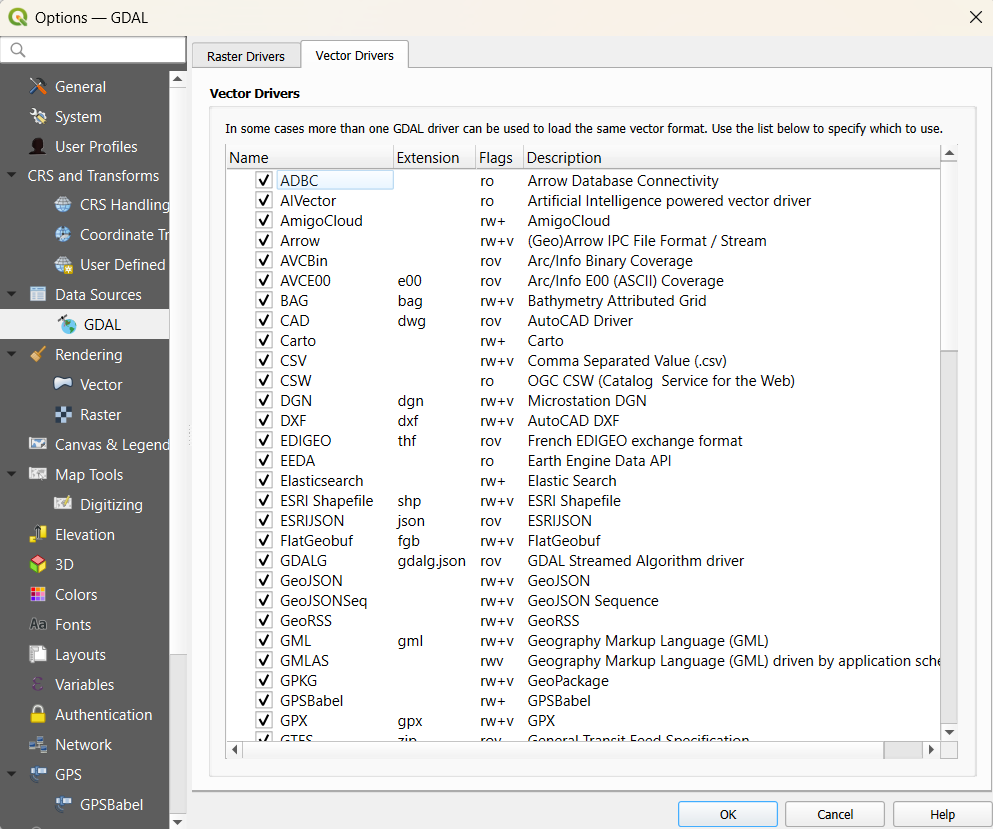{#fig-vector-qgis fig-align="center" width="75%"}

**Capacidades de los Drivers OGR (Banderas / Flags):**

Al igual que en los ráster, los controladores vectoriales muestran banderas (**Flags**) en QGIS que indican exactamente qué permisos tiene el software para interactuar con cada formato. Estas letras se traducen en las siguientes capacidades:

* **`r` (Read - Lectura / ReadOnly):** El formato puede ser visualizado. Si el controlador solo muestra la bandera `ro`, significa que es de **Solo Lectura** y no puede ser editado (ej. algunos formatos web o de OpenStreetMap).
* **`w` (Write - Escritura / Read/Write):** Indica que QGIS puede crear y exportar archivos nuevos en este formato. Al combinarse con lectura (`rw`), permite la creación y edición completa de entidades y atributos (ej. **GeoPackage**, **Shapefile**).
* **`+` (Update - Actualización):** Significa que el controlador puede modificar o actualizar un archivo existente sin tener que sobrescribirlo por completo.
* **`v` (Virtual IO - Entrada/Salida Virtual):** Permite que QGIS lea archivos directamente desde "sistemas virtuales", como servicios web, la nube o dentro de archivos comprimidos (**.zip**, **.tar**) sin necesidad de extraerlos previamente en el disco duro.

:::


## Opciones de conversión de formatos (ArcGIS Pro - QGIS)

::: {.panel-tabset}

### ArcGIS Pro

En ArcGIS Pro existen principalmente tres métodos para la conversión e intercambio de formatos de datos espaciales. A continuación, se detalla cada uno de ellos:

#### 1. Desde las herramientas de geoprocesamiento (toolbox)

Esta es la forma más estructurada y completa, ideal para ejecutar procesos masivos (Batch) o aplicar herramientas de conversión muy específicas. 

* **Ruta:** Menú `View` (Vista) -> botón `Geoprocessing` (Geoprocesamiento) -> pestaña `Toolboxes` (Cajas de herramientas) -> expandir `Conversion Tools` (Herramientas de conversión).

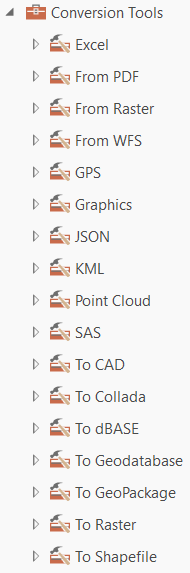{#fig-conv-tools-arcgis fig-align="center" width="25%"}

Dentro de la caja de **Conversion Tools** (Herramientas de conversión), las opciones se agrupan según el formato de origen o destino:

* **Conversiones Ráster:**

    - **From Raster** (Desde ráster): Convierte datos ráster a otros formatos (principalmente vectoriales, como polígonos, líneas o puntos).

        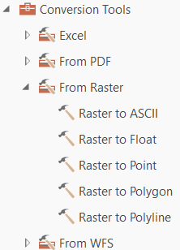{#fig-from-raster-arcgis fig-align="center" width="30%"}

    - **To Raster** (A ráster): Convierte otros formatos (como entidades vectoriales) a formato ráster.

        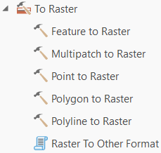{#fig-to-raster-arcgis fig-align="center" width="30%"}


    - **To GeoPackage** (A GeoPackage): Permite agregar un ráster existente a un archivo GeoPackage mediante `Add Raster to GeoPackage` (Agregar ráster a GeoPackage).


* **Conversiones Vectoriales y Web:**

    - **To Geodatabase** (A geodatabase): Múltiples opciones para migrar formatos vectoriales (e incluso datos ráster usando `Raster to Geodatabase` [Ráster a geodatabase]) hacia una File o Enterprise Geodatabase.
    * **To Shapefile** (A shapefile): Convierte entidades vectoriales almacenadas en Geodatabases (Feature Classes) al formato tradicional Shapefile.
    - **To CAD** (A CAD): Exporta datos vectoriales a formatos de diseño asistido por computadora (ej. DWG, DXF).
    - **From WFS** (Desde WFS): Convierte un servicio Web Feature Service a diferentes formatos vectoriales locales. Consulta la [ayuda en línea aquí](https://pro.arcgis.com/en/pro-app/latest/tool-reference/conversion/wfs-to-feature-class.htm).

* **Conversiones Bidireccionales (Desde y Hacia):**

    - **GPS:** Convierte archivos GPX a vectores usando `GPX to features` (GPX a entidades) o viceversa con `Features to GPX` (Entidades a GPX).
    - **JSON:** Transforma archivos GeoJSON a entidades vectoriales y de vuelta.
    - **KML:** Permite convertir archivos, capas o mapas enteros a formato KML/KMZ o viceversa.

---

#### 2. Desde la capa en el mapa (contents pane)

Este método es el más rápido y práctico cuando ya tienes los datos cargados en tu vista de mapa y necesitas exportar la capa activa. Es especialmente útil porque respeta las selecciones (si tienes polígonos seleccionados, solo exportará esos). Con esta opción se habilitan las opciones de transformación de datos con las coordenadas del mapa (usando la reproyección al vuelo aplicada a la capa) o de la capa.

* **Ruta:** `Clic Derecho` sobre la capa (en el panel `Contents` [Contenido]) -> `Data` (Datos) -> `Export Features` (Exportar entidades) (para vectores) o `Export Raster` (Exportar ráster) (para imágenes).

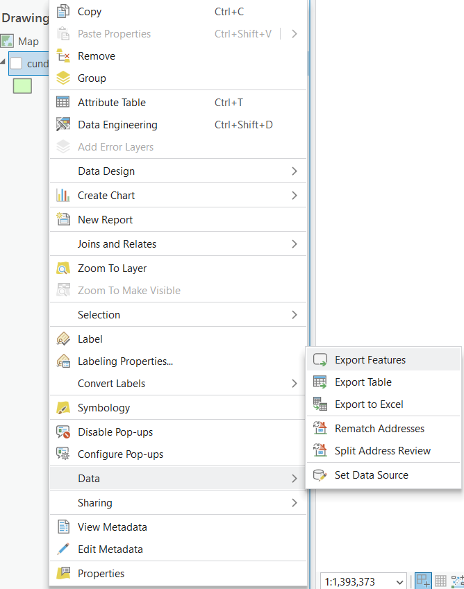{#fig-export-map-arcgis fig-align="center" width="75%"}

---

#### 3. Desde el panel de catálogo (catalog pane)

Ideal para gestionar y convertir archivos directamente desde el disco duro o bases de datos sin necesidad de cargarlos previamente al mapa para visualizarlos.

* **Ruta:** Para abrir el catálogo ve al menú `View` (Vista) -> `Catalog Pane` (Panel de catálogo).
* **Proceso:** `Clic Derecho` sobre el dato de interés -> `Export` (Exportar) -> *Seleccionar la opción deseada*. 

> **Nota:** Las opciones de exportación que aparecen en el menú desplegable son dinámicas y dependen estrictamente del tipo de archivo seleccionado por el usuario. La imagen a continuación muestra el ejemplo de las opciones habilitadas al seleccionar un archivo **Shapefile**:

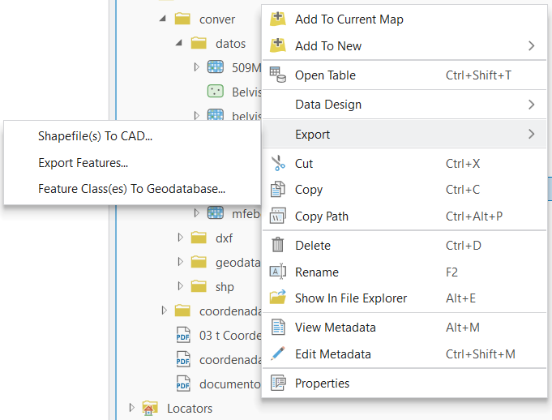{#fig-export-catalog-arcgis fig-align="center" width="75%"}


### QGIS

De manera análoga a ArcGIS Pro, QGIS ofrece diferentes vías para la conversión e intercambio de formatos, apoyándose fuertemente en las librerías GDAL (para ráster) y OGR (para vectores). A continuación, se detallan los tres métodos principales:

#### 1. Desde la caja de herramientas de procesos (processing toolbox)

Este método es ideal para procesos por lotes (Batch) y para acceder a los algoritmos nativos de GDAL/OGR con control total sobre los parámetros de conversión.

* **Ruta:** Menú `Processing` (Procesos) -> `Toolbox` (Caja de herramientas).

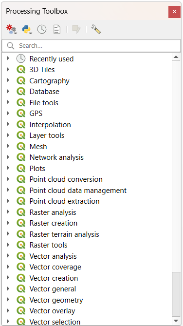{#fig-toolbox-qgis fig-align="center" width="40%"}

Dentro de la caja de herramientas, las opciones de conversión se encuentran distribuidas en diferentes grupos, principalmente bajo **GDAL**, **Database** (Base de datos) y **Vector general** (Vectorial general):

* **Conversiones Ráster y Vectoriales (GDAL):**
    
    - **En `GDAL` -> `Raster conversion` (Conversión ráster):**
        - `Translate (convert format)` (Traducir [convertir formato]): Es la herramienta principal para convertir entre formatos ráster (ej. TIFF a JPEG, o a un GeoPackage).
        - `Polygonize (raster to vector)` (Poligonizar [ráster a vector]): Convierte píxeles de un ráster a polígonos vectoriales.

        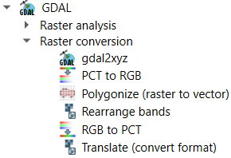{#fig-gdal-raster-qgis fig-align="center" width="40%"}

    - **En `GDAL` -> `Vector conversion` (Conversión vectorial):**
        - `Convert format` (Convertir formato): Permite convertir masivamente formatos vectoriales (ej. de Shapefile a GeoPackage, GeoJSON, KML, etc.).
        - `Rasterize (vector to raster)` (Rasterizar [vector a ráster]): Convierte entidades vectoriales a formato ráster.

        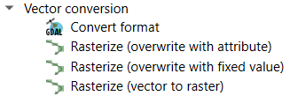{#fig-gdal-vector-qgis fig-align="center" width="40%"}

* **Conversiones a Bases de Datos y Otros Formatos (Export):**
    - **En el grupo `Database` (Base de datos):** Encuentras algoritmos específicos para bases de datos espaciales, como `Export to PostgreSQL` (Exportar a PostgreSQL) y `Export to SpatiaLite` (Exportar a SpatiaLite).
    - **En el grupo `Vector general` (Vectorial general):** Herramientas nativas de QGIS como `Save vector features to file` (Guardar entidades vectoriales a archivo) (que funciona como un guardado masivo) y `Export layers to DXF` (Exportar capas a DXF) para transformar datos espaciales en formatos CAD.
    - **En `GDAL` -> `Vector miscellaneous` (Miscelánea vectorial):** Opciones alternativas manejadas por GDAL para conectarse y exportar datos a bases de datos como PostgreSQL.

---

#### 2. Desde la capa en el panel de capas (layers panel)

Al igual que en ArcGIS Pro, este es el método más utilizado en el trabajo diario cuando la capa ya está cargada en el lienzo del mapa. Permite guardar selecciones específicas y ofrece un control granular sobre qué atributos exportar. También permite aplicar una transformación de coordenadas al vuelo (reproyectar) durante la exportación.

* **Ruta:** `Clic Derecho` sobre la capa (en el panel `Layers` (Capas)) -> `Export` (Exportar) -> `Save Features As...` (Guardar entidades como...) (para vectores) o `Save As...` (Guardar como...) (para imágenes).

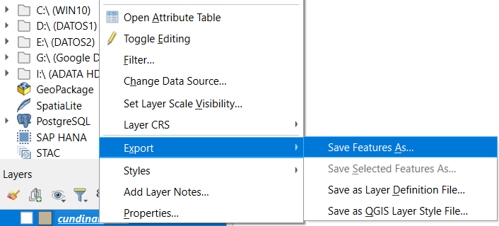{#fig-export-layer-qgis fig-align="center" width="65%"}

> **Nota:** El cuadro de diálogo de `Save Vector Layer as...` (Guardar capa vectorial como...) es extremadamente potente. No solo permite cambiar el formato, sino que también te permite cambiar el Sistema de Referencia de Coordenadas (CRS), seleccionar qué campos de la tabla de atributos conservar y definir parámetros específicos de la capa (Layer Options) como la geometría.

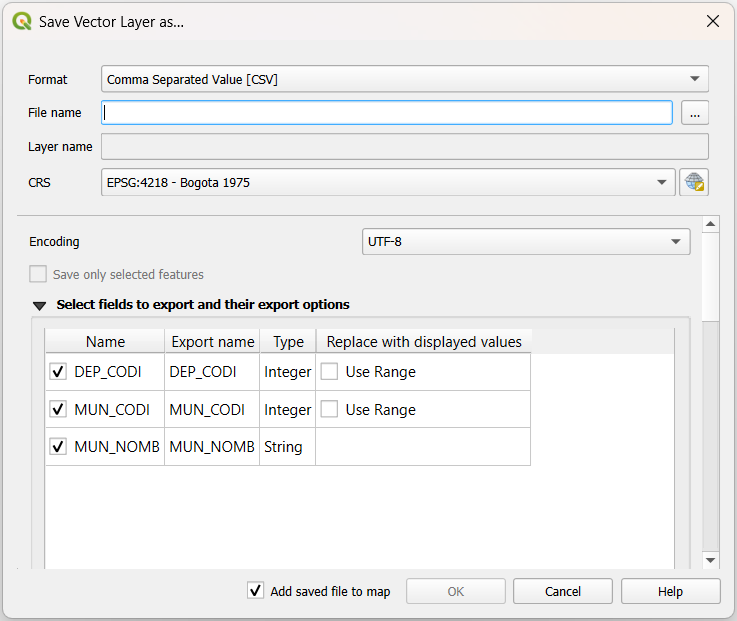{#fig-save-vector-qgis fig-align="center" width="75%"}

---

#### 3. Desde el panel del navegador (browser panel)

El panel del navegador en QGIS actúa como un catálogo. Aunque tradicionalmente se usa más para cargar datos arrastrándolos al mapa, también permite exportar datos físicos de manera directa, así como gestionar bases de datos espaciales.

* **Ruta:** Para abrir el navegador ve al menú `View` (Ver) -> `Panels` (Paneles) -> `Browser` (Navegador).

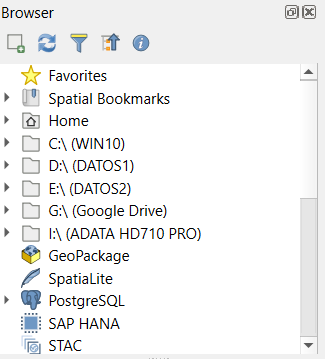{#fig-browser-qgis fig-align="center" width="35%"}

* **Proceso:** `Clic Derecho` sobre el archivo o tabla de base de datos de interés -> `Export Layer` (Exportar capa) -> `To File...` (A archivo...). Aparecerá nuevamente el cuadro de diálogo `Save Vector Layer as...` (Guardar capa vectorial como...).

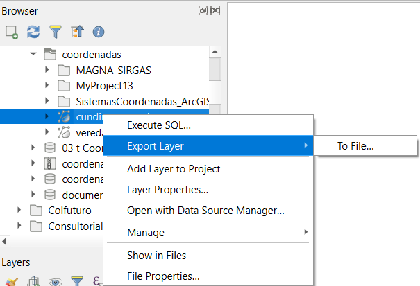{#fig-export-browser-qgis fig-align="center" width="65%"}

> **Tip para bases de datos:** Desde el navegador, una de las formas más rápidas de convertir formatos es simplemente arrastrar un archivo (como un Shapefile) y soltarlo dentro de una conexión de base de datos (como un GeoPackage o PostGIS) para importarlo instantáneamente.


### GRASS

GRASS GIS es un software espacial de grado científico que viene integrado como un proveedor nativo dentro de la caja de herramientas de procesos de QGIS. Sus herramientas de conversión son vitales en análisis avanzados porque exigen y aplican una limpieza topológica estricta a los datos geométricos.

GRASS GIS funciona bajo una estructura particular organizada en **Database**, **Location** y **Mapset**, la cual garantiza la *integridad topológica* al no operar directamente sobre archivos sueltos. Todos los algoritmos de GRASS siguen una nomenclatura lógica: `módulo.acción.formato`. El módulo vectorial usa la letra `v` y el módulo ráster usa la letra `r`. Las acciones son `in` para importar datos a la estructura particular de GRASS y `out` para exportar datos desde esta hacia otras plataformas.

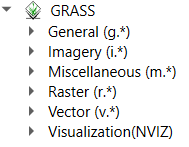{#fig-grass-tools fig-align="center" width="25%"}

#### 1. Módulos de importación (in)

Sirven para "convertir" e ingresar datos externos hacia el estricto formato interno de GRASS. Las herramientas de importación terminan en `.in` (del inglés *input* [entrada]).

* **Vectoriales (`v.in.*`):**
    * Encontrarás comandos muy útiles para importar y corregir topología de varios formatos. Ejemplos destacados incluyen `v.in.wfs` para traer datos de servicios web, o `v.in.e00` para leer archivos antiguos de intercambio.

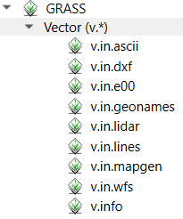{#fig-grass-import-vector fig-align="center" width="30%"}

* **Ráster (`r.in.*`):**
    * Existen importadores dedicados como `r.in.lidar` para datos de elevación de nubes de puntos.

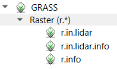{#fig-grass-import-raster fig-align="center" width="30%"}

#### 2. Módulos de exportación (out)

Se utilizan para "convertir" y sacar los datos ya procesados en el entorno topológico de GRASS hacia formatos estándar reconocibles por otros SIG. Estas herramientas terminan en `.out` (del inglés *output* [salida]).

* **Vectoriales (`v.out.*`):**
    * Herramientas como `v.out.dxf` para enviar geometrías a CAD, o `v.out.postgis` que facilita la carga directa y estructurada a una base de datos espacial PostgreSQL.

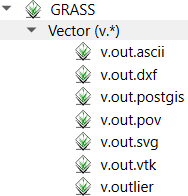{#fig-grass-export-vector fig-align="center" width="30%"}

* **Ráster (`r.out.*`):**
    * GRASS ofrece un nivel de detalle avanzado para exportar matrices numéricas. Puedes convertir tus modelos ráster a formatos de texto plano legibles por máquina con `r.out.ascii`, exportarlos como imágenes ligeras para la web con `r.out.png`, o utilizar formatos matemáticos como `r.out.mat`.

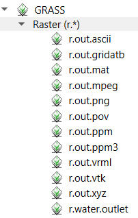{#fig-grass-export-raster fig-align="center" width="30%"}

:::

## Ejercicios

### Ejercicio 1: Migración de bases de datos obsoletas (.mdb) a formatos modernos

**Nota importante:** Las bases de datos personales de Esri (`.mdb`) están construidas sobre tecnología antigua de 32 bits de Microsoft Access. Dado que ArcGIS Pro es una arquitectura moderna de 64 bits, ha dejado de soportar este formato. Para recuperar, leer y modernizar estos datos, utilizaremos QGIS como "puente" gracias a su potente compatibilidad mediante la librería GDAL/OGR.

A continuación, se presentan tres métodos en QGIS para migrar todos los datos de una `.mdb` hacia formatos modernos como GeoPackage (`.gpkg`) o File Geodatabase (`.gdb`).

#### Método A: Empaquetar capas a GeoPackage

* **Objetivo:** Agrupar todas las capas cargadas desde la base de datos antigua en un solo archivo estándar y abierto (GeoPackage).
* **Herramientas:** Menú `Processing` (Procesos) -> `Toolbox` (Caja de herramientas) -> `Database` (Base de datos) -> `Package layers` (Empaquetar capas).
* **Proceso:** Cargue primero las capas del `.mdb` al panel de capas de QGIS. Abra la herramienta, seleccione las 7 capas cargadas como entrada (también puede arrastrar todas las capas desde el panel de capas hacia la herramienta) y ejecute.
* **Datos de entrada:** Capas cargadas desde `GreenvalleyDB.mdb`.
* **Datos de salida:** `GreenValleyDB.gpkg` (almacenado en la carpeta `geodatabase`).

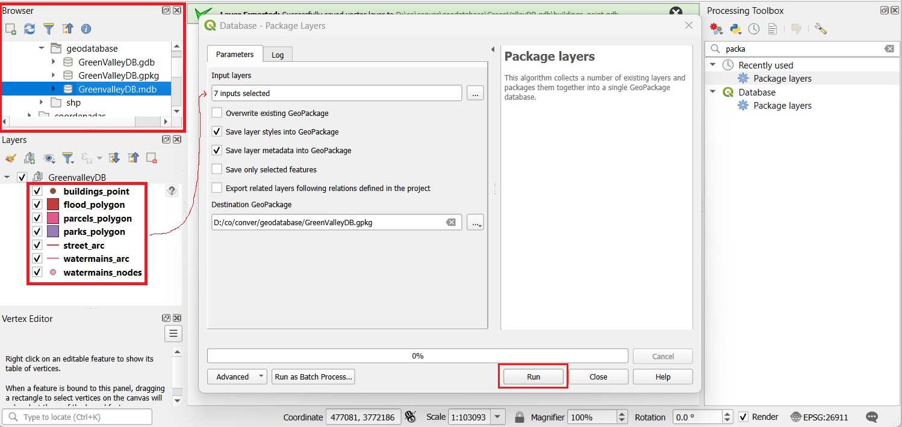{#fig-package-layers fig-align="center" width="100%"}

#### Método B: Conversión directa a File Geodatabase (GDAL)

* **Objetivo:** Convertir la base de datos antigua completa directamente a una File Geodatabase de Esri (`.gdb`) en un solo paso mediante procesos por lotes de GDAL.
* **Herramientas:** Menú `Processing` (Procesos) -> `Toolbox` (Caja de herramientas) -> `GDAL` -> `Vector conversion` (Conversión vectorial) -> `Convert format` (Convertir formato).
* **Proceso:** Ingrese la ruta del archivo `.mdb` original. Es vital marcar la casilla **"Convert all layers from dataset"** (Convertir todas las capas del conjunto de datos) para que migre toda la base de datos y no solo una tabla.
* **Datos de entrada:** `GreenvalleyDB.mdb`.
* **Datos de salida:** `GreenValleyDB.gdb` (almacenado en la carpeta `geodatabase`).

> Nota: Esta interfáz gráfica simplemente corre el comando `ogr2ogr -f OpenFileGDB`

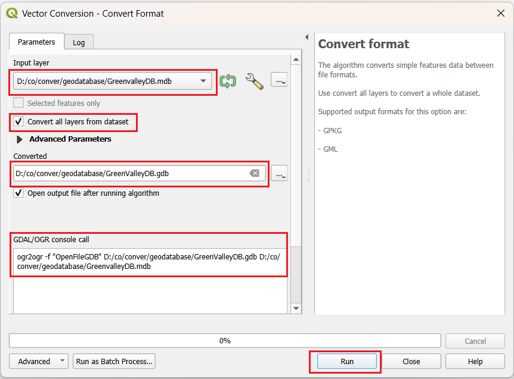{#fig-convert-format fig-align="center" width="75%"}

#### Método C: Creación y arrastre desde el panel del navegador

* **Objetivo:** Crear una File Geodatabase vacía desde cero y migrar las capas visualmente arrastrándolas entre directorios.
* **Herramientas:** Panel del navegador (`Browser`) en QGIS.
* **Proceso:** 
    1. Haga clic derecho sobre la carpeta de destino (`geodatabase`), seleccione `New` (Nuevo) y luego `ESRI FileGeodatabase...` para crear la base vacía.
    2. Despliegue el contenido del archivo `GreenvalleyDB.mdb` en el navegador, seleccione todas sus capas (con la tecla *Shift*), arrástrelas y suéltelas sobre la nueva base de datos.
    3. Utilice el botón de refrescar para confirmar la copia de los datos.

        * **Datos de entrada:** Capas internas de `GreenvalleyDB.mdb` (ej. `buildings_point`, `flood_polygon`, etc.).

        * **Datos de salida:** `GrenValleyDB2.gdb` (almacenado en la carpeta `geodatabase`).

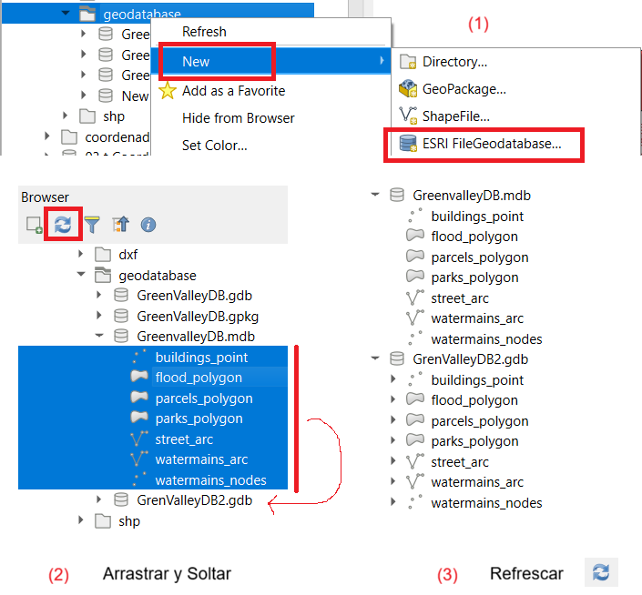{#fig-drag-drop-gdb fig-align="center" width="50%"}


### Ejercicio 2: Exportación de capas vectoriales a formatos CAD (DXF)

* **Objetivo:** Exportar capas vectoriales a formatos estandarizados de diseño asistido por computadora para facilitar el intercambio con software de ingeniería.
* **Herramientas:**

    * **ArcGIS Pro:** `Conversion Tools` (Herramientas de conversión) -> `To CAD` (A CAD) -> `Export to CAD` (Exportar a CAD).
    * **QGIS:** Menú `Project` (Proyecto) -> `Import/Export` (Importar/Exportar) -> `Export project to DXF` (Exportar proyecto a DXF) o desde la caja de herramientas GDAL `Export layers to DXF` (Exportar capas a DXF).

* **Datos de entrada:** Capas vectoriales almacenadas en `GreenValleyDB.gdb` (por ejemplo, las capas urbanas o de infraestructura).
* **Datos de salida:** Archivos espaciales CAD en formato `.dxf` (con 6 decimales de precisión en sus coordenadas) dentro de la carpeta `dxf`.

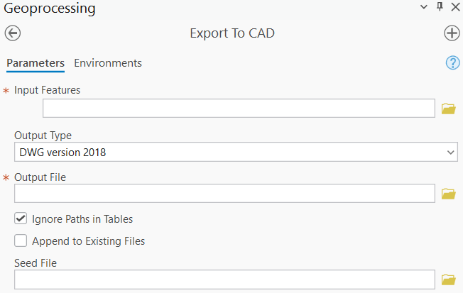{#fig-export_to_cad_pro fig-align="center" width="50%"}

> **Tip avanzado para ArcGIS Pro:** Si exportas entidades de puntos y deseas que se representen con una simbología específica de AutoCAD, puedes crear un campo de texto llamado **`RefName`** en tu tabla de atributos y escribir allí el nombre del bloque. Al exportar usando un archivo DWG de plantilla (Seed file) que contenga dichos bloques, ArcGIS los insertará automáticamente en la posición de cada punto.

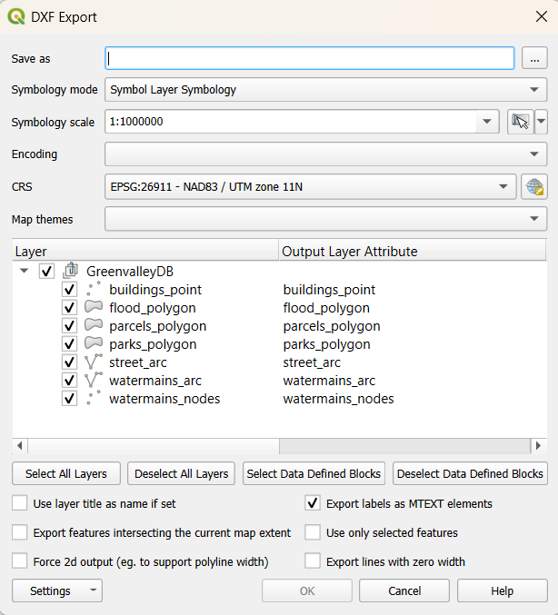{#fig-dxf_export_qgis fig-align="center" width="50%"}

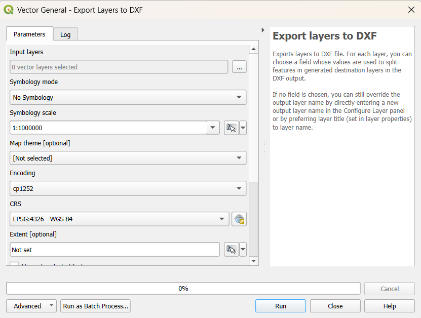{#fig-dxf_export_qgis fig-align="center" width="50%"}

#### Caso de estudio avanzado en ArcGIS Pro: Simbología geológica con atributos automáticos

A continuación, se detalla un flujo de trabajo para exportar puntos de datos estructurales (buzamientos geológicos) logrando que la simbología geométrica (el bloque) y el texto asociado (el ángulo de buzamiento) se generen automáticamente dentro del archivo CAD resultante, respetando los estándares de diseño de una plantilla predefinida.

* **Datos de entrada GIS:** Shapefile de puntos `buz_final.shp` (en carpeta /datos/shapefile_dxf/) que representa ubicaciones de medidas de buzamiento.
* **Configuración de la tabla GIS:** La tabla de atributos incluye tanto campos reservados de CAD (especificados en la [ayuda oficial](https://pro.arcgis.com/en/pro-app/latest/help/data/cad/reserved-cad-fields-for-dwg-and-dxf-files.htm) de Esri) como campos personalizados de atributo.
    * **`RefName`**: Campo reservado de texto que especifica el nombre exacto del bloque CAD a insertar (por ejemplo el bloque "**100000**").
    * **`DIP`**: Campo personalizado que contiene el valor numérico del ángulo de buzamiento (aplica para el bloque **100000**).
* **Archivo de plantilla CAD (Seed file):** `DatosEstructuralesBloques_ATTDEF.dwg`. Este archivo debe contener la definición del bloque "**100000**" (y todos los demás bloques definidos en el campo `RefName`), y vitalmente, dentro de ese bloque debe existir una definición de atributo (**ATTDEF**) con la etiqueta (**Tag**) exacta "**DIP**".

{#fig-cad-avanzado fig-align="center" width="100%"}

**Explicación del mecanismo técnico:**

Cuando se ejecuta la herramienta `Export to CAD` (Exportar a CAD) en ArcGIS Pro:

1.  **Lectura de geometría:** ArcGIS lee la coordenada espacial XY del punto GIS.
2.  **Identificación del bloque:** Lee el campo reservado `RefName` (ej: valor "**100000**") y localiza la definición de ese bloque dentro del archivo `seed` (plantilla).
3.  **Inserción del bloque:** Inserta el bloque geométrico "**100000**" en la coordenada correspondiente en el DWG resultante.
4.  **Mapeo dinámico de atributos:** El motor de exportación GIS busca coincidencias exactas entre los nombres de los campos personalizados de la tabla GIS y las etiquetas (**Tags**) de los atributos (**ATTDEF**) definidos *dentro* del bloque CAD. Al encontrar una coincidencia exacta para "**DIP**", transfiere automáticamente el valor del campo GIS al texto del atributo del bloque insertado.

**Resultado:**

En el archivo DWG creado, los puntos GIS ya no serán puntos simples, sino referencias de bloques complejos. La simbología geométrica será correcta y aparecerá un texto mostrando el ángulo de buzamiento en la posición, rotación y estilo definidos en la plantilla CAD, sin necesidad de generar textos adicionales manualmente en el DWG.

::: {.callout-important}
##### Evolución de la interoperabilidad CAD - GIS hacia entornos BIM

Es fundamental aclarar que la interoperabilidad entre los mundos del diseño de infraestructura (CAD) y el análisis espacial (GIS) ha evolucionado drásticamente más allá de la simple exportación de líneas y polígonos en formatos tradicionales. 

En la actualidad, esta integración de alto nivel se rige por la metodología **BIM (Building Information Modeling)**. Para proyectos de ingeniería avanzada (como los generados en AutoCAD Civil 3D, Infraworks o Revit), el estándar universal de intercambio abierto es el formato **IFC (Industry Foundation Classes)**. 

Adicionalmente, motores SIG modernos como ArcGIS Pro cuentan con conectores nativos que integran directamente archivos **`.rvt`** y modelos de **Civil 3D**. Este salto tecnológico es crucial porque **facilita la lectura directa** de los elementos constructivos sin requerir conversiones intermedias destructivas, conservando intacta la riqueza de los metadatos de ingeniería y permitiendo una **visualización 3D nativa** para el análisis volumétrico y espacial dentro del entorno geográfico.
:::

### Ejercicio 3: Despliegue optimizado de una imagen escaneada con 3 bandas (RGB)

**Nota técnica:** Las imágenes ráster escaneadas (como mapas o fotografías aéreas antiguas) ya poseen una representación visual final destinada al ojo humano. A diferencia de las bandas de satélite crudas, un escaneo RGB no requiere estiramientos de contraste agresivos que alteren sus colores originales. Sin embargo, los SIG modernos a menudo aplican mejoras dinámicas automáticas al cargar cualquier ráster, lo que puede "lavar" o saturar los colores del escaneo.

El objetivo de este ejercicio es configurar el motor de visualización para respetar los valores de color originales del escaneo y optimizar la legibilidad del texto mediante técnicas de remuestreo dinámico en **ArcGIS Pro** y **QGIS**.

* **Objetivo:** Visualizar correctamente un mapa escaneado multibanda, verificando el mapeo RGB y ajustando las opciones de estiramiento y remuestreo para maximizar la legibilidad visual sin alterar la radiometría original del escaneo.
* **Herramientas:** Funciones de visualización y simbología ráster en **ArcGIS Pro** y **QGIS**.
* **Datos de entrada:** Imagen ráster escaneada `caleriza.tif` (GeoTIFF compuesto de 3 bandas, almacenado en la carpeta `datos`).
* **Datos de salida:** No aplica (los cambios se visualizan en vivo en el lienzo del mapa).

::: {.panel-tabset}

#### Flujo de trabajo en ArcGIS Pro

ArcGIS Pro ofrece un control visual inmediato desde la cinta de opciones (Ribbon). Al cargar la imagen `caleriza.tif`, el software mapea automáticamente las bandas 1, 2 y 3 a los canales Rojo, Verde y Azul. El desafío es que a menudo aplica un estiramiento de contraste predeterminado (ej. *Percent Clip*) que distorsiona el color real del mapa escaneado.

El proceso correcto para un escaneo es eliminar el estiramiento y mejorar la nitidez al hacer zoom:

**1. Verificación de bandas y eliminación del estiramiento de contraste:**

Haga clic sobre la capa ráster. En el panel `Raster Layer` (Capa Raster), sección  `Symbology` (Simbología), verifique que la simbología de despliegue sea `RGB`. Alternativamente: Cambié el `Stretch type` (Tipo de estiramiento) a `None` (Ninguno). Esto asegura que el SIG visualice los valores de color exactos que fueron escaneados.

{#fig-pro-symbology-none fig-align="center" width="100%"}

**2. Optimización dinámica de la visualización (Cinta de opciones):**

Active la pestaña `Raster Layer` (Capa ráster) -> grupo `Rendering` (Renderizado) en la cinta de opciones. Aquí puede controlar la visualización de forma global. 

* Verifique que la opción `DRA` (Dynamic Range Adjustment [Ajuste de rango dinámico]) esté desactivada, ya que esta herramienta recalcula el contraste constantemente al navegar, lo que no se desea en un mapa escaneado.

* Verifique que el `Resampling Type` (Tipo de Remuestreo) está establecido por defecto a `Nearest Neighbor` (Vecino mas Cercano) y observe que el despliegue del mapa escaneado no es nítido. Por defecto, al hacer zoom sobre un ráster (especialmente texto escaneado), ArcGIS Pro utiliza el método `Nearest Neighbor`, lo que provoca una visualización "pixelada" o escalonada.

{#fig-pro-rendering-ribbon fig-align="center" width="100%"}

**3. Mejora de legibilidad mediante remuestreo:**

Para mejorar drásticamente la lectura de textos y líneas finas en un escaneo, cambie el `Resampling Type` (Tipo de remuestreo) dinámico a `Bilinear` (Bilineal) o `Cubic` (Cúbico) en la pestaña `Raster Layer` (Capa ráster) -> grupo `Rendering` (Renderizado). Esto suaviza la imagen al vuelo sin alterar el archivo original, permitiendo leer el mapa con mayor nitidez.

{#fig-pro-resampling-compare fig-align="center" width="100%"}

#### Flujo de trabajo en QGIS

En QGIS, el proceso es más directo y se centraliza en la ventana de propiedades de la capa.

**1. Configuración de simbología y remuestreo:**

Haga doble clic (o clic derecho) sobre la capa `caleriza.tif` -> pestaña `Symbology` (Simbología).

* En la sección `Band Rendering` (Renderizado de Banda), verifique que el `Render type` (Tipo de renderizado) sea `Multiband Color` (Color Multibanda).
* En la sección `Band Rendering` (Renderizado de Banda), luego en `Contrast enhancement` (Mejora de contraste), seleccione `No Enhancement` (Sin mejora) para respetar los colores originales del escaneo.

{#fig-qgis-symbology fig-align="center" width="100%"}


**2. Optimización de visualización:**

Al igual que en ArcGIS Pro, `Nearest Neighbor` (Vecino más cercano) pixelará el texto al hacer zoom. En la misma pestaña de `Symbology` (Simbología), localice las opciones de `Resampling` (Remuestreo). A diferencia de otros programas, QGIS divide el remuestreo en dos configuraciones independientes para optimizar los cálculos matemáticos según el nivel de acercamiento:

* **`Zoomed in` (Acercar):** Se activa cuando hace un acercamiento más allá de la resolución nativa del ráster (un solo píxel de la imagen debe representarse usando varios píxeles de su monitor). Para evitar que los textos y líneas se vean como bloques cuadrados, cambie este método a `Bilinear` (Bilineal) o `Cubic` (Cúbico), algoritmos que interpolan transiciones suaves entre los colores.
* **`Zoomed out` (Alejar):** Se activa cuando se aleja la vista (múltiples píxeles de la imagen original se comprimen para caber en un solo píxel de su monitor). En este caso, cambie el método también a `Bilinear` (Bilineal) o `Cubic` (Cúbico), los cuales aplican cálculos de interpolación entre los píxeles circundantes para evitar la pérdida de líneas finas o el efecto de distorsión óptica (*aliasing*) en el mapa escaneado.

{#fig-qgis-symbology-resampling fig-align="center" width="100%"}

:::

### Ejercicio 4: Calcular el tamaño de una imagen y georreferenciarla con archivo world

Las imágenes que poseen una distorsión poco significativa en su cuadrícula para el trabajo a realizar, por ejemplo, las que se adquieren mediante el escaneo de mapas, o de imágenes en general que han perdido su referenciación terrestre tras haber sido rectificadas, pueden ser fácilmente georreferenciadas mediante la incorporación de un archivo de texto adjunto con estructura interna "world" y extensión con final en "w" (ej. `.tfw` para imágenes `.tif`). Para realizar esta operación es necesario, previamente, conocer el número de píxeles de la imagen, además de las coordenadas de un punto y el tamaño que en la realidad le corresponde a cada píxel (resolución espacial).

**Descripción de los datos (`5O9MTN.tif`):**
Antes de proceder con la georreferenciación, es importante entender la naturaleza del archivo con el que vamos a trabajar. El nombre **`5O9MTN`** hace referencia a la **Hoja 509** (zona de Alcalá de Henares, Madrid) del **Mapa Topográfico Nacional (MTN)** de España. Técnicamente, es una composición de tres bandas capturadas por el sensor TM del satélite Landsat, recortada para coincidir con los límites de esa hoja cartográfica oficial. 
Debido a su origen y ubicación, el Sistema de Referencia de Coordenadas (CRS) probable de esta imagen es **ED50 / UTM zone 30N (EPSG:23030)**, un estándar histórico español cuyas unidades de medida métrica son los **metros**.

**Paso 1: Cómo calcular el tamaño de una imagen**

Cargue la imagen `5O9MTN.tif` (que se encuentra en la carpeta de datos) en **ArcGIS Pro** o **QGIS**.

Para saber las características de la imagen `5O9MTN.tif`, haga clic sobre el nombre de la capa con el botón derecho del ratón y abra `Properties` (Propiedades):

::: {.panel-tabset}

#### **ArcGIS Pro**

* En **ArcGIS Pro**, en la ventana de propiedades de la capa, active la sección `Source` (Fuente) y expanda `Raster Information` (Información del ráster).

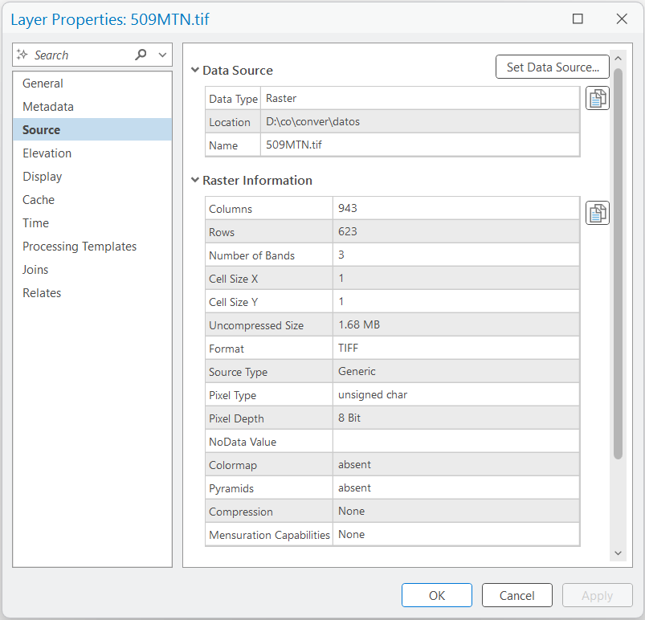{#fig-arcgis-raster-properties fig-align="center" width="80%"}

#### **QGIS**

* En **QGIS**, en la ventana de propiedades de la capa, active la sección `Information` (Información).

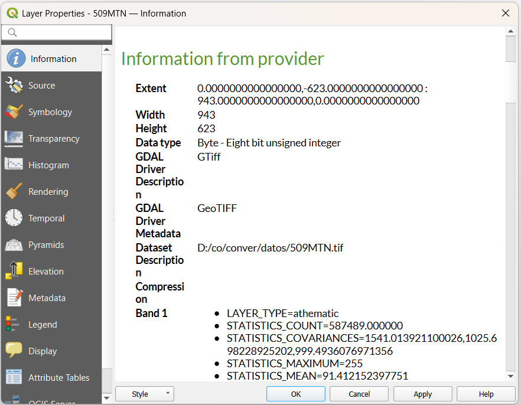{#fig-qgis-raster-properties fig-align="center" width="80%"}

:::

La información que nos ofrece nos permite conocer el número de filas y columnas que la componen, el tipo de datos admitidos en cada celda (`Pixel Depth` [Profundidad del Pixel] y `Data Type` [Tipo de Dato]); y si existen compresiones, pirámides, etc. 

En el ejemplo señalado, la imagen posee 943 columnas por 623 filas, esto es, 587.489 celdas. El tamaño del píxel estaría en función de las coordenadas en las que se inscribe y está medido por las unidades de medida del mapa, por lo que no es un dato relevante hasta que no se produzca la georreferenciación.

**Paso 2: Referenciar una imagen con documento "world" adjunto**

Para referenciar la imagen tendremos que conocer las coordenadas X e Y de la celda situada en la parte superior izquierda de la imagen, así como el tamaño del píxel en horizontal y en vertical. Con estos datos tendremos que crear un archivo de texto (con cualquier procesador de texto, guardando el documento como un texto plano o con el mismo Bloc de notas del sistema) que contenga seis filas de datos (más una en blanco) en el siguiente orden:

1. **La primera fila** hace referencia al tamaño real (`World coordinate` [Coordenada del mundo]) de los píxeles en dirección X (siempre positivo, por aumentar hacia la derecha), es decir, 30 metros (cada píxel equivale a treinta metros en el terreno).
2. **La segunda** (rotación respecto al eje Y) y **la tercera** (rotación respecto al eje X) fila hacen referencia al giro de la imagen, que puede ser posible; mientras no se soporte dicha acción, serán siempre 0 y 0.
3. **La cuarta fila** es el tamaño real del píxel en dirección Y (siempre negativo por disminuir en dirección hacia abajo). En este caso es -30 metros.
4. **La quinta y sexta fila** son las coordenadas exactas X e Y del primer píxel (al que se refieren los anteriores datos). En este caso X=427900, Y=4520833.

Al importar el ráster, el programa identifica automáticamente sus dimensiones (conteo de píxeles horizontales y verticales). Al integrar esta información con los seis parámetros de escala, rotación y coordenadas de origen descritos en el archivo `5O9MTN.tfw`, el software calcula la posición espacial necesaria para georreferenciar la imagen correctamente.

**Nota sobre la integridad de los datos:** Evite manipular manualmente los valores numéricos del archivo world para intentar "ajustar" o corregir visualmente una imagen que se ve desplazada o torcida; esto solo provocará deformaciones geométricas asimétricas (achatamiento o estiramiento). Si la imagen requiere ajustes de posición o corrección de distorsiones, utilice las herramientas de georreferenciación de su software SIG para garantizar la precisión espacial.

Abra el Bloc de notas de su sistema operativo e introduzca los datos correspondientes (recuerde dejar una fila en blanco al final):

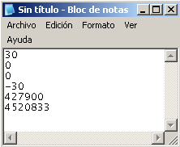{#fig-world-file fig-align="center" width="30%"}

Ahora guarde este documento en la misma carpeta donde se ubica la imagen `5O9MTN.tif`, asignándole el nombre `5O9MTN.tfw`. Es fundamental elegir en el cuadro de diálogo la opción Tipo `All Files` (Todos los archivos) en lugar de `Text Documents (*.txt)` (Documentos de texto), por lo que llevará su mismo nombre base, pero con distinta extensión. Si el archivo apareciera con la extensión `.txt`, habría que cambiarla manualmente por `.tfw`, con la "w" alusiva a las coordenadas reales (World coordinate).

**Ajuste de las unidades del mapa (Data Frame / Lienzo):**
El archivo *world* (`.tfw`) es agnóstico; solo le dice al software que el píxel mide "30 unidades", pero no especifica si son metros, pies o grados. Si el mapa donde carga la imagen está configurado por defecto en grados decimales o pies, la imagen se dibujará con un tamaño incorrecto y no coincidirá espacialmente con ninguna capa base. 

Para que el archivo `.tfw` funcione correctamente al cargar la imagen, primero debemos asegurar que el mapa base utilice **metros**. 

* **En ArcGIS Pro:** Haga clic derecho sobre el nombre del mapa en el panel `Contents` (Contenido), elija `Properties` (Propiedades) y en la pestaña `Coordinate Systems` (Sistemas de coordenadas) asigne el sistema **European Datum 1950 UTM Zone 30N** (23030). Alternativamente puede cargar el mapa base `Imagery` (menú `Map` -> `Basemap` -> `Imagery`)
* **En QGIS:** Vaya al menú `Project` (Proyecto) -> `Properties` (Propiedades) -> pestaña `CRS` (SRC) y busque el código **EPSG:23030**.

Por último, comprobaremos los resultados abriendo un nuevo mapa en su SIG, ajustando su sistema de coordenadas como se indicó en el paso anterior, y adjuntando nuevamente `5O9MTN.tif`, que ahora nos aparecerá proyectada en las coordenadas correctas gracias a la lectura automática de su archivo *world* adjunto.

::: {.callout-tip}
## Asignación formal del Sistema de Coordenadas a la capa
Aunque configurar el mapa en metros permite que el archivo `.tfw` posicione la imagen visualmente en el lugar correcto, **la capa ráster en sí misma sigue sin tener un sistema de coordenadas definido internamente** (aparecerá como *Unknown CRS* [CRS Desconocido]). 

Para garantizar que la imagen funcione en futuros proyectos sin importar en qué unidades esté el mapa principal, es fundamental asignarle su sistema de coordenadas definitivo:

1. Utilice la herramienta `Define Projection` (Definir proyección) en ArcGIS Pro o `Assign Projection` (Asignar proyección) en QGIS.
2. Defina el CRS de la capa como **ED50 / UTM zone 30N (EPSG:23030)**. 

A partir de este momento, el SIG podrá realizar reproyecciones al vuelo (*On-the-fly projection*) de manera automática si se cruza con información en otros sistemas o unidades.
:::

### Ejercicio 5: Convertir a ráster una capa vectorial de puntos asignando a cada píxel el valor de un atributo

En la conversión de formato vectorial a ráster, el proceso consiste en superponer una retícula (cuadrícula) sobre la capa vectorial, de modo que cada píxel hereda un valor numérico específico del objeto vectorial con el que coincide espacialmente. Para que esta conversión tenga utilidad analítica, es el usuario quien debe indicar explícitamente qué columna (campo numérico) de la tabla de atributos se usará para poblar los píxeles del nuevo ráster.

* **Objetivo:** Convertir una capa vectorial de puntos a formato ráster, asignando a cada celda el valor de altitud del punto correspondiente y definiendo correctamente la resolución espacial.
* **Datos de entrada:** Capa vectorial `Belvisma.shp` (ubicada en la carpeta `datos`), la cual contiene una muestra de puntos con altitudes de la zona de Belvís (Madrid).
* **Datos de salida:** Nuevo archivo ráster `Belvisma2.tif`.

**Paso 1: Carga de datos e identificación del campo de atributo**

Cargue en su SIG la capa `Belvisma.shp`. Abra la tabla de atributos de la capa (`Open Attribute Table` [Abrir tabla de atributos]). Observe las columnas disponibles y localice el campo que contiene los valores topográficos de altura (`Data_Value`). Este será el campo vital que utilizaremos para que nuestro ráster represente verdaderamente el relieve y no un simple identificador numérico interno.

**Paso 2: Calcular el tamaño de celda (Resolución)**

Antes de convertir, necesitamos definir de qué tamaño (en metros) será cada píxel. Para establecer una resolución conveniente, se debe averiguar la distancia entre cualquier par de puntos del tema vectorial. Si un tamaño es muy menor, podría generar píxeles con valor nulo.

Utilice la herramienta de medición (regla) de su SIG y mida la distancia horizontal o vertical entre dos puntos cercanos de la cuadrícula. En la capa `Belvisma`, la distancia entre puntos es constante (aprox. 151.3 m). Elegiremos dicho valor (redondeado a **151**) como resolución.

**Paso 3: Ejecutar la conversión vectorial a ráster**

::: {.panel-tabset}

#### Flujo en ArcGIS Pro

1. Abra el panel de `Geoprocessing` (Geoprocesamiento) y busque la herramienta `Feature to Raster` (De entidad a ráster) en `Conversion Tools` -> `To Raster`.
2. Configure los siguientes parámetros principales:
   * `Input features` (Entidades de entrada): `Belvisma`
   * `Field` (Campo): Seleccione aquí el campo de altitud identificado en el Paso 1.
   * `Output raster` (Ráster de salida): Asígnele el nombre `Belvisma2.tif` y guárdelo en su carpeta de `raster`.
   * `Output cell size` (Tamaño de celda de salida): Escriba **151**.
3. Haga clic en la pestaña superior de la herramienta llamada `Environments` (Entornos). En la sección `Processing Extent` (Extensión de procesamiento), elija `Extent of Layer Belvisma` (Igual a Belvisma) para garantizar que el ráster cubra exactamente la misma zona que los puntos originales. 
4. Ejecute la herramienta.

#### Flujo en QGIS

1. Vaya al menú superior `Raster` (Ráster) -> `Conversion` (Conversión) -> `Rasterize (Vector to Raster)` (Rasterizar [vectorial a ráster]).
2. Configure los siguientes parámetros:
   * `Input layer` (Capa de entrada): `Belvisma`.
   * `Field to use for a burn-in value` (Campo a usar para un valor de marcado): Seleccione el campo de altitud.
   * `Output raster size units` (Unidades del tamaño del ráster de salida): Elija `Georeferenced units` (Unidades georreferenciadas).
   * `Width/Horizontal resolution` (Ancho/Resolución horizontal): Escriba **151**.
   * `Height/Vertical resolution` (Alto/Resolución vertical): Escriba **151**.
   * `Output extent` (Extensión de salida): Haga clic en la flecha al lado derecho de la caja, elija `Calculate from Layer` (Calcular a partir de capa) y seleccione `Belvisma`.
3. Guarde el archivo de salida como `Belvisma2.tif` (en la carpeta `raster`) y ejecute la herramienta.

:::

**Paso 4: Verificación de resultados**

Examine el resultado, haga ampliaciones e identifique los valores de la capa ráster (con la herramienta explorar o identificar) para apreciar cómo ha operado la conversión. Podrá comprobar que los valores de altitud que antes estaban en la tabla de atributos de los puntos, ahora se han convertido en el valor intrínseco de cada celda del nuevo mapa ráster.


### Ejercicio 6: Conversión a ráster de un tema vectorial de líneas

En la conversión de un formato vectorial de líneas a ráster, el píxel toma el valor correspondiente a la línea que lo corta. Si varias líneas coinciden o se cruzan dentro de un mismo píxel, el programa tomará por defecto el valor de la primera de ellas que encuentre en el proceso de conversión. Se desea transformar las líneas de las carreteras de la zona de Belvís (Madrid) a una capa ráster.

* **Objetivo:** Convertir entidades lineales continuas a formato ráster, asegurando que la extensión y el tamaño de celda de salida coincidan exactamente con un Modelo Digital de Elevación utilizado como referencia espacial.
* **Herramientas:**
    * **ArcGIS Pro:** `Conversion Tools` (Herramientas de conversión) -> `To Raster` (A ráster) -> `Polyline to Raster` (Polilínea a ráster).
    * **QGIS:** Caja de herramientas GDAL -> `Vector conversion` (Conversión vectorial) -> `Rasterize (vector to raster)` (Rasterizar [vector a ráster]).
* **Datos de entrada:** Capa lineal `Carbelvi.shp` (carreteras) y capa ráster `Belvismde` (DEM para referencia espacial).
* **Datos de salida:** Capa ráster de infraestructura `Carbelvi4.tif`.

**Paso 1: Carga de datos e identificación del campo de atributo**

Cargue en su SIG la capa vectorial `Carbelvi.shp` y la capa ráster `Belvismde`. Esta última se utilizará únicamente como molde geométrico o referencia. 
Abra la tabla de atributos de la capa de carreteras (`Open Attribute Table` [Abrir tabla de atributos]). Identifique el campo `Codicar`, el cual contiene el identificador numérico o código de cada tipo de vía. Este será el valor que se quemará ("burn-in") en los píxeles del nuevo ráster.

**Paso 2: Ejecutar la conversión vectorial a ráster**

::: {.panel-tabset}

#### Flujo en ArcGIS Pro

1. Abra el panel de `Geoprocessing` (Geoprocesamiento) y busque la herramienta `Polyline to Raster` (Polilínea a ráster).
2. Configure los siguientes parámetros principales:
   * `Input Features` (Entidades de entrada): `Carbelvi`.
   * `Value field` (Campo de valor): Seleccione el campo `Codicar`.
   * `Output Raster Dataset` (Ráster de salida): Asígnele el nombre `Carbelvi4.tif` y guárdelo en su carpeta `raster`.
   * `Cell assignment type` (Tipo de asignación de celda): Deje el valor por defecto `Maximum length` (Longitud máxima) o `Maximum combined length` (Longitud combinada máxima) para dar prioridad a la vía que atraviesa mayor área del píxel.
   * `Cellsize` (Tamaño de celda): Escriba **25**.
3. Haga clic en la pestaña superior de la herramienta llamada `Environments` (Entornos). En la sección `Processing Extent` (Extensión de procesamiento), elija `Extent of Layer Belvismde` (Igual a Belvismde) para garantizar que la nueva retícula se alinee a la misma área.
4. Ejecute la herramienta.

#### Flujo en QGIS

1. Vaya al menú superior `Raster` (Ráster) -> `Conversion` (Conversión) -> `Rasterize (Vector to Raster)` (Rasterizar [vectorial a ráster]).
2. Configure los siguientes parámetros:
   * `Input layer` (Capa de entrada): `Carbelvi`.
   * `Field to use for a burn-in value` (Campo a usar para un valor de marcado): Seleccione el campo `Codicar`.
   * `Output raster size units` (Unidades del tamaño del ráster de salida): Elija `Georeferenced units` (Unidades georreferenciadas).
   * `Width/Horizontal resolution` (Ancho/Resolución horizontal): Escriba **25**.
   * `Height/Vertical resolution` (Alto/Resolución vertical): Escriba **25**.
   * `Output extent` (Extensión de salida): Haga clic en la flecha al lado derecho de la caja, elija `Calculate from Layer` (Calcular a partir de capa) y seleccione el ráster `Belvismde`.
3. Guarde el archivo de salida como `Carbelvi4.tif` y ejecute la herramienta.

:::

**Paso 3: Verificación de resultados**

Examine la capa ráster obtenida realizando las ampliaciones necesarias (Zoom In). Apague temporalmente la capa vectorial original (`Carbelvi.shp`) y observe cómo las líneas suaves y continuas han sido reemplazadas por una secuencia de celdas cuadradas ("escalonadas") que contienen el valor de la vía, coincidiendo espacialmente con la extensión geométrica del modelo digital de elevaciones.

### Ejercicio 7: Convertir a ráster una capa vectorial de polígonos

En la asignación de valores a los píxeles a partir de polígonos, la regla general es que el píxel toma el valor del polígono coincidente con el centro del píxel. 

* **Objetivo:** Rasterizar un mapa temático de polígonos transfiriendo un código numérico de clasificación a las celdas generadas, asegurando que la extensión y resolución coincidan con un ráster base.
* **Herramientas:**
    * **ArcGIS Pro:** `Conversion Tools` (Herramientas de conversión) -> `To Raster` (A ráster) -> `Polygon to Raster` (Polígono a ráster).
    * **QGIS:** Caja de herramientas GDAL -> `Vector conversion` (Conversión vectorial) -> `Rasterize (vector to raster)` (Rasterizar [vector a ráster]).
* **Datos de entrada:** Capa vectorial con los polígonos de usos del suelo definidos por el Mapa Forestal de España para la zona de Belvís (`mfebelvis.shp`) y la capa ráster del DEM de Belvís (`Belvismde`).
* **Datos de salida:** Rasterización temática `mfebelvis2.tif`.

**Paso 1: Carga de datos y configuración del mapa de salida**

Abra un nuevo Mapa en ArcGIS Pro o inicie un Proyecto vacío en QGIS y cargue la capa vectorial `mfebelvis.shp` y la capa ráster `Belvismde`. Esta última se usará para referencia geométrica solamente. 

Antes de ejecutar la herramienta, es importante tener claro que especificaremos las propiedades del mapa de salida indicando una extensión y resolución (25 metros) exactamente iguales a las de la capa `Belvismde`. Asimismo, abra la tabla de atributos de la capa de polígonos e identifique el campo `USO_IFN`, el cual contiene los códigos numéricos que representan las categorías de uso del suelo a transferir a los píxeles.


**Paso 2: Ejecutar la conversión vectorial a ráster**

::: {.panel-tabset}

#### Flujo en ArcGIS Pro

1. Abra el panel de `Geoprocessing` (Geoprocesamiento) y busque la herramienta `Polygon to Raster` (Polígono a ráster).
2. Configure los siguientes parámetros principales:
   * `Input Features` (Entidades de entrada): `mfebelvis`.
   * `Value field` (Campo de valor): Seleccione el campo `USO_IFN`.
   * `Output Raster Dataset` (Ráster de salida): Asígnele el nombre `mfebelvis2.tif` y guárdelo en su carpeta `raster`.
   * `Cell assignment type` (Tipo de asignación de celda): Deje el valor por defecto `Cell center` (Centro de celda) para respetar la regla de conversión de polígonos.
   * `Cellsize` (Tamaño de celda): Escriba **25**.
3. Haga clic en la pestaña superior de la herramienta llamada `Environments` (Entornos). En la sección `Processing Extent` (Extensión de procesamiento), elija `Extent of Layer Belvismde` (Igual a Belvismde) para garantizar que la nueva retícula se alinee correctamente a la referencia.
4. Ejecute la herramienta.

#### Flujo en QGIS

1. Vaya al menú superior `Raster` (Ráster) -> `Conversion` (Conversión) -> `Rasterize (Vector to Raster)` (Rasterizar [vectorial a ráster]).
2. Configure los siguientes parámetros:
   * `Input layer` (Capa de entrada): `mfebelvis`.
   * `Field to use for a burn-in value` (Campo a usar para un valor de marcado): Seleccione el campo `USO_IFN`.
   * `Output raster size units` (Unidades del tamaño del ráster de salida): Elija `Georeferenced units` (Unidades georreferenciadas).
   * `Width/Horizontal resolution` (Ancho/Resolución horizontal): Escriba **25**.
   * `Height/Vertical resolution` (Alto/Resolución vertical): Escriba **25**.
   * `Output extent` (Extensión de salida): Haga clic en la flecha al lado derecho de la caja, elija `Calculate from Layer` (Calcular a partir de capa) y seleccione el ráster `Belvismde`.
3. Guarde el archivo de salida como `mfebelvis2.tif` y ejecute la herramienta.

El proceso a ejecutar en esta caja de diálogo [Vector Conversion - Rasterize (Vector to Raster)] es equivalente a ejecutar el siguiente comando GDAL/OGR en consola:

```bash
gdal_rasterize -l mfebelvis -a USO_IFN -tr 25.0 25.0 -a_nodata 0.0 -te 452987.5 4486988.0 456112.5 4489988.0 -ot Float32 -of GTiff D:/co/conver/datos/mfebelvis.shp D:/co/conver/raster/mfebelvis2.tif
```
:::

**Paso 3: Verificación de resultados y simbología**

Examine la capa ráster obtenida realizando un mapa temático de categorías. Diríjase a las propiedades de la nueva capa ráster (`mfebelvis2.tif`) y cambie su simbología a `Unique Values` (Valores únicos) en ArcGIS Pro o `Paletted/Unique values` (Paletizado/Valores únicos) en QGIS. 

El significado de los usos codificados en los píxeles es el siguiente:

::: {style="width: 50%; margin: auto;"}
| Cód. | Uso del suelo |
|:-:|:--|
| **1** | Forestal arbolado |
| **3** | Forestal desarbolado |
| **5** | Cultivos agrícolas/ganaderos |
| **7** | Improductivo |
:::

Compruebe los valores en la capa ráster con la herramienta Explorar o Identificar (haciendo clic sobre distintos píxeles de colores) y elimine las capas innecesarias para limpiar su espacio de trabajo.


### Ejercicio 8: Obtener capas vectoriales a partir de capas ráster

A partir de una capa ráster, es posible obtener otra vectorial de cualquiera de los objetos geométricos básicos tales como: puntos, líneas y polígonos. Recuerde que si la capa ráster contiene datos de tipo "real" (flotante), es necesario convertirla a datos enteros previamente. 

En primer lugar, se obtendrán líneas a partir de la capa de carreteras ráster y luego polígonos a partir del mapa forestal. Ambos datos de entrada (`Carbelvi4.tif` y `mfebelvis2.tif`) son los resultados obtenidos en los ejercicios previos.

* **Objetivo:** Ejecutar el proceso de vectorización, donde zonas agrupadas y secuencias lineales de píxeles son fusionadas y generalizadas para crear nuevas geometrías de polígonos y líneas.
* **Herramientas:**
    * **ArcGIS Pro:** `Conversion Tools` (Herramientas de conversión) -> `From Raster` (Desde ráster) -> algoritmos `Raster to Polyline` (Ráster a polilínea) y `Raster to Polygon` (Ráster a polígono).
    * **QGIS:** Caja de herramientas GDAL -> `Polygonize (raster to vector)` (Poligonizar [ráster a vector]) o utilizando los módulos analíticos `r.to.vect` de **GRASS**.
* **Datos de entrada:** Ráster de clasificación lineal `Carbelvi4.tif` (campo `Value`) y ráster temático `mfebelvis2.tif` (campo `Value`).
* **Datos de salida:** Clases de entidad o shapefiles derivados (ej. `carbelvi43.shp` y `mfebelvis23.shp`).

---

#### Identificación y Manejo de Tipos de Ráster

Para el formato ráster, solo los datos que son de tipo entero (*integer*) y que tienen una tabla de atributos asociada se pueden seleccionar o vectorizar basándose en sus atributos. Los ráster de tipo flotante (*floating point*) no se pueden seleccionar directamente.

Para identificar el tipo de ráster en su SIG, revise las propiedades de la capa (Pestaña `Source` -> `Raster Information` -> `Pixel Type`):

| Pixel Type (Tipo de píxel) | Significado Técnico | ¿Soporta Tabla de Atributos? |
|:---|:---|:---:|
| **`char`** | Entero de 8 bits con signo | Sí |
| **`unsigned char`** | Entero de 8 bits sin signo | Sí |
| **`Float` / `Double`** | Punto flotante (valores decimales continuos) | No |

* **Si su ráster es entero (`char` o `unsigned char`) pero no tiene tabla:** puede ejecute la herramienta `Build Raster Attribute Table` (Construir tabla de atributos de ráster) para generarla.
* **Si su ráster es flotante y requiere vectorizarlo:** Debe convertirlo primero a formato entero. 
    * **ArcGIS Pro:** Puede hacerlo utilizando la herramienta `Int` (en *Spatial Analyst* -> *Math*) (también disponible en la caja de herramientas de Image Analyst y 3D Analyst) o exportándolo y reimportándolo definiendo el formato de salida como `INTEGER`.
    * **QGIS:** Menú `Raster` -> `Conversion` (conversión) -> `Translate (Convert Format)` [Transformar (Convertir Formato)]. En la ventana que aparece en la sección **Advanced Parameters** (parámetros avanzados), en la opción `Output data type` (tipo de dato de salida) seleccionar uno de los siguientes: **Byte** (0 a 255), **Int8** (-128 a 127), **Int16** (-32.768 a 32.767), **UInt16** (0 a 65.535), **Int32** (-2.147'483.648 a 2.147'483.647),  **UInt32** (0 a 4.294'967.295)

---

#### Nota Importante: Selección de elementos antes de transformar

Las conversiones de formato (vector a ráster o ráster a vector) se ven afectadas por todas las posibilidades de selección de elementos sobre las capas a exportar (selecciones realizadas justo antes de ejecutar la herramienta). 

Esto significa que, cuando se hace la conversión, un botón de opción (habilitado/deshabilitado) aparecerá con el mensaje **Use the selected records: n**, donde **n** es el número de registros seleccionados en la tabla de atributos. Si se habilita esa opción, solo los elementos seleccionados se involucrarán en el proceso, quedando sin procesar o transformar los elementos no seleccionados.

A continuación se describen las principales herramientas en los SIG para realizar selecciones antes de una conversión. Los números en la primera columna corresponden a las gráficas de interfaz mostradas más abajo:

| # | Herramienta | Descripción | Ubicación | Modo de Uso |
|:---:|:---|:---|:---|:---|
| **(1)** | **Selección manual** | Seleccionar elementos interactuando con el mapa. | Pestaña `Map` (Mapa) o Barra de herramientas superior. | Con el puntero, haga clic o dibuje una caja sobre los elementos que desea seleccionar. Use `Shift` para agregar más a la selección previa. |
| **(2)** | **Select by Attributes** | Seleccionar elementos a partir de los atributos alfanuméricos. | Menú de Selección. | Conformar la parte WHERE de una cláusula SQL en la ventana de la herramienta. |
| **(3)** | **Select by Location** | Seleccionar a partir de propiedades espaciales (intersección, cruza, contenido, etc.) entre capas. | Menú de Selección. | Operando las reglas espaciales en la ventana de la herramienta. |
| **(4)** | **Tabla de atributos** | Seleccionar registros directamente de la base de datos. | Clic derecho sobre la capa -> `Open Attribute Table`. | Clic en el margen izquierdo de la fila deseada, o usando las opciones de selección integradas en la tabla. |

: Principales herramientas de selección en sistemas de información geográfica. {#tbl-herramientas-seleccion}

*Nota: Todas estas opciones se ven afectadas por el método de selección activo (Crear nueva selección, Agregar a la selección actual, Remover de la selección actual, Seleccionar de la selección actual).*

::: {.panel-tabset}

##### **ArcGIS Pro**

{fig-align="center" width="100%"}

##### **QGIS**

{fig-align="center" width="100%"}

{fig-align="center" width="100%"}

##### **Tabla de Atributos: ArcGIS Pro y QGIS**

{fig-align="center" width="100%"}

:::


**Paso 1: Obtención de líneas**

::: {.panel-tabset}

##### Flujo en ArcGIS Pro

1. Abra la herramienta `Raster to Polyline` (Ráster a polilínea).
2. En `Input raster` (Ráster de entrada), elija el tema de carreteras `Carbelvi4`.
3. En `Field` (Campo), asegúrese de seleccionar el campo **`Value`** (Valor).
4. En `Output polyline features` (Entidades de polilínea de salida), asigne el nombre `carbelvi43.shp`.
5. Mantenga activada la opción `Simplify polylines` (Simplificar polilíneas) para generalizar las líneas (equivalente a `Generalize lines` en versiones anteriores) y ejecute.

##### Flujo en QGIS (vía GRASS)

1. En la Caja de Herramientas de Procesos, busque `r.to.vect` (de GRASS).
2. En `Input raster layer` (Capa ráster de entrada), seleccione `Carbelvi4`.
3. En `Feature type` (Tipo de entidad), elija `line` (línea).
4. En el campo de valores, asegúrese de utilizar la columna que representa el **`Value`**.
5. Active `Smooth corners of data features` (Suavizar esquinas) si desea generalizar la geometría.
6. Guarde el archivo de salida como `carbelvi43.shp` y ejecute.

:::

Observe que un nuevo tema de vías vectoriales ha sido creado y desplegado sobre su mapa base.

**Paso 2: Obtención de polígonos**

Repita a continuación el proceso para la capa ráster del mapa forestal de la zona de Belvís (`mfebelvis2.tif`), solicitando en la herramienta (`Raster to Polygon` en ArcGIS Pro o `Polygonize` en QGIS) que el tipo de objeto de salida sea polígono. Nuevamente, asegúrese de seleccionar el campo **`Value`** para la conversión.

**Análisis de los resultados de salida:**
Abra la tabla de atributos de la nueva capa vectorial de polígonos generada (`mfebelvis23.shp`). Observe que:
1. El valor temático de cada píxel (el código de uso del suelo) se almacena en una columna específica, generalmente llamada `gridcode` o `grid_code`, de cada polígono resultante.
2. Además, cada polígono nuevo creado tiene un identificador distinto y único (el `ID` o `FID`) que puede servir para vincular cada uno de ellos con un registro externo de la tabla de atributos.

### Ejercicio 9: Importar una capa vectorial a una base de datos PostGIS

El almacenamiento de datos espaciales en bases de datos relacionales como PostgreSQL (con su extensión espacial PostGIS) es el estándar actual. En este ejercicio, nos conectaremos a un contenedor local de PostGIS. 

Aprovecharemos este ejercicio para ilustrar una limitación clásica de interoperabilidad: intentaremos exportar los datos usando ArcGIS Pro (lo cual nos arrojará un error por diseño del software) y luego resolveremos la tarea usando QGIS, que nos permite escribir sin restricciones en bases de datos nativas.

* **Objetivo:** Establecer una conexión a PostGIS, comprender las restricciones de escritura de los clientes comerciales sobre bases de datos crudas, e importar exitosamente el shapefile.
* **Herramientas:** Conector de bases de datos de ArcGIS Pro (para explorar la restricción) y el **DB Manager** (Administrador de BBDD) de QGIS (para la carga exitosa).
* **Datos de entrada:** Capa poligonal `mfebelvis.shp`.
* **Datos de salida:** Tabla espacial `mfebelvis` almacenada dentro de la base de datos PostgreSQL.

**Paso 1: Parámetros de conexión**

Asegúrese de que su contenedor Docker (`contenedor_postgis_unal`) esté en ejecución. Los parámetros que utilizaremos son los siguientes:

* **Host / Servidor:** `127.0.0.1`
* **Puerto:** `5434`
* **Base de datos:** `sig_db_unal`
* **Usuario:** `profe_unal`
* **Contraseña:** `geomatica2025`

**Paso 2: Conexión, el error 000210 y la importación exitosa**

::: {.panel-tabset}

#### Flujo en ArcGIS Pro (El Error Educativo)

1. En el panel **Catalog** (Catálogo), haga clic derecho en **Databases** (Bases de datos) y seleccione **New Database Connection** (Nueva conexión de base de datos).
2. Configure la ventana con los parámetros del Paso 1. Para agregar el puerto, en la sección **Additional Properties** (Propiedades adicionales), escriba `Port` y `5434`. Haga clic en **OK** (Aceptar).

{fig-align="center" width="55%"}

3. Haga clic derecho sobre su capa `mfebelvis` -> **Data** (Datos) -> **Export Features** (Exportar entidades).
4. En **Output Feature Class** (Clase de entidad de salida), navegue hasta su conexión. Verá que ArcGIS intenta nombrar la salida como `sig_db_unal.profe_unal.mfebelvis`. Si intenta forzar la salida hacia el esquema público (`sig_db_unal.public.mfebelvis`) y ejecuta, **la herramienta fallará**.

{fig-align="center" width="85%"}

{fig-align="center" width="70%"}

##### ERROR 000210 al cargar un Shapefile en PostgreSQL/PostGIS

**¿Qué significa el ERROR 000210?**

En ArcGIS Pro, el **`ERROR 000210: Cannot create output`** indica que el sistema no puede crear el dataset de salida. Cuando se trabaja con PostgreSQL + PostGIS (sin habilitar *Enterprise Geodatabase*), este error generalmente está relacionado con **permisos, esquemas y propiedad**, no con el shapefile en sí.

**¿Por qué ocurre en una base PostgreSQL/PostGIS nativa?**

En una conexión directa a PostgreSQL:

- ArcGIS Pro intenta crear la tabla en el **esquema asociado al usuario conectado**.
- PostgreSQL, por convención, utiliza un esquema con el mismo nombre del usuario.
- El usuario debe:
  - Tener un esquema propio.
  - Ser propietario (*owner*) de ese esquema.
  - Tener permisos `CREATE` y `USAGE`.

Si el esquema no existe o el usuario no es propietario, ArcGIS Pro no puede crear la tabla y genera el `ERROR 000210`.

> No se trata exactamente de una "regla de seguridad de Esri", sino de la interacción entre:
> 
> - La gestión de esquemas y permisos en PostgreSQL.
> - La forma en que ArcGIS Pro resuelve el esquema de escritura.

Además, en muchas instalaciones modernas, el esquema `public` no permite la creación de objetos por defecto.

---

**Posible solución en PostgreSQL**

Si el usuario es `profe_unal`, se debería ejecutar el siguiente bloque desde un cliente SQL:

```sql
CREATE SCHEMA profe_unal AUTHORIZATION profe_unal;
GRANT ALL ON SCHEMA profe_unal TO profe_unal;
ALTER USER profe_unal SET search_path TO profe_unal, public;
```

Esto garantiza que:
- El esquema exista.
- El usuario sea propietario.
- El `search_path` apunte primero a su propio esquema.

---

**Decisión en este entorno**

Dado que nuestro contenedor es una instalación limpia de PostgreSQL + PostGIS (sin habilitar *Enterprise Geodatabase*), y el objetivo del ejercicio no es administrar roles avanzados de bases de datos, utilizaremos QGIS para cargar los datos directamente en PostGIS y continuar el flujo de trabajo.

#### Flujo en QGIS (La Solución)

A diferencia de ArcGIS Pro, QGIS es de código abierto y nos permite interactuar de forma nativa con PostGIS sin exigir la creación de esquemas ligados al nombre de usuario.

1. En el panel **Browser** (Navegador), haga clic derecho sobre **PostgreSQL** y seleccione **New Connection...** (Conexión nueva...).
2. Llene el formulario con los parámetros del Paso 1. En **Name** (Nombre) asigne un alias (ej. `PostGIS_UNAL`).
3. Haga clic en **Test Connection** (Probar conexión). Si es exitosa, haga clic en **OK** (Aceptar).

{fig-align="center" width="60%"}

4. Para importar la capa:
   * Vaya al menú superior **Database** (Base de datos) -> **DB Manager** (Administrador de BBDD).
   * Despliegue el árbol de *PostGIS* -> *PostGIS_UNAL* -> esquema *public*.
   * Haga clic en el botón **Import Layer/File** (Importar Capa/Archivo) en la barra superior (icono de flecha hacia abajo).
   * Seleccione `mfebelvis` como entrada, asigne el nombre de tabla `mfebelvis`, active la opción **Create spatial index** (Crear índice espacial) y haga clic en **OK** (Aceptar). La importación se realizará sin ningún error de permisos.

{fig-align="center" width="75%"}

{fig-align="center" width="75%"}

En esa misma ventana es posible previsualizar el resultado (vectores y tabla) accediendo a las pestañas correspondientes:

{fig-align="center" width="75%"}

:::

**Paso 3: Verificación e Interoperabilidad**

Apague la capa shapefile original en sus paneles de capas. En QGIS, arrastre la nueva tabla espacial `mfebelvis` desde el esquema `public` hacia su lienzo de mapa. 

*Nota de interoperabilidad:* Aunque ArcGIS Pro no nos permitió **escribir** los datos por sus restricciones de esquema, sí nos permite **leerlos**. Si regresa a ArcGIS Pro y actualiza su conexión, verá la tabla recién cargada por QGIS y podrá arrastrarla a su mapa para su visualización y análisis.


## Evaluación Final del Capítulo

Para poner en práctica los conceptos aprendidos sobre conversión de formatos e interoperabilidad, deberá resolver los siguientes dos ejercicios de aplicación técnica.

### Descarga de Datos
Puede obtener el paquete de datos necesario para estos ejercicios en el siguiente enlace:
[👉 Descargar Datos del Taller de Conversión](https://drive.google.com/file/d/1ZhzEN-3Cg7yP-lbsST7zk-mEq4IKvUO4/view?usp=sharing)

---

### Ejercicio 1: Intercambio de formatos para visualización web (KML)

El formato KML (Keyhole Markup Language) es el estándar de facto para visualizar datos geográficos en tres dimensiones. Sin embargo, es un formato rígido: **Google Earth no realiza proyección al vuelo**; el archivo debe estar obligatoriamente en coordenadas geográficas **WGS84 (EPSG:4326)** para posicionarse correctamente.

* **Objetivo:** Exportar un dato vectorial a KML asegurando la integridad espacial mediante la reproyección previa.
* **Reto:** Seleccione **cualquier capa vectorial** de los ejercicios anteriores y expórtela a KML siguiendo estos flujos:
    1. **ArcGIS Pro (Desde el Mapa):** Use la herramienta **Map To KML** (Mapa a KML). Observe cómo se exportan todas las capas visibles del lienzo.
    2. **ArcGIS Pro (Desde la Capa):** Use la herramienta **Layer To KML** (Capa a KML). En la pestaña **Environments** (Entornos), verifique que el sistema de salida sea **GCS_WGS_1984**.
    3. **QGIS:** Use el menú contextual -> **Export** (Exportar) -> **Save Features As...** (Guardar entidades como...). En el cuadro de diálogo, cambie el **CRS** (SRC) a `EPSG:4326 - WGS 84`.
* **Validación:** Abra los archivos `.kmz` resultantes en **Google Earth** y verifique que caigan exactamente sobre la superficie terrestre.

---

### Ejercicio 2: ETL Espacial y carga filtrada en PostGIS

Este ejercicio simula un flujo de trabajo profesional donde se deben aplicar "reglas de negocio" (filtros) antes de cargar datos en un servidor de base de datos.

* **Datos de entrada:** * Capa vectorial: `MUNICIPIOS_ISLA_WGS84.shp` (campo `NMG` para el nombre).
    * Filtro espacial: Archivo `coordenadas.kml` (puntos de interés).
* **Reglas de transformación:**
    1. **Filtro de Atributo:** No se deben cargar municipios con nombres compuestos (ej: "La Guajira" se descarta, "Magdalena" se conserva). *Tip: Busque valores que NO contengan espacios en el campo `NMG`*.
    2. **Filtro Espacial:** Solo se deben cargar los municipios que se encuentren dentro de un radio de **40 km** respecto a los puntos del archivo `coordenadas.kml`.
* **Carga Final:** Los datos resultantes que cumplan **ambas** condiciones deben cargarse en el esquema **`public`** de su base de datos PostGIS local con el nombre de tabla **`mpios_kml`**.

---

### Entregables y criterios de evaluación

El objetivo de esta evaluación es documentar el flujo lógico y demostrar la capacidad de mover datos entre plataformas de forma segura.

**1. Archivos de Datos:**
* El archivo `.kmz` generado en el Ejercicio 1.
* Una captura de pantalla de la tabla de atributos en PostGIS (desde el **DB Manager** [Administrador de BBDD] de QGIS) mostrando los registros finales de la tabla `mpios_kml`.

**2. Documento Analítico (Quarto):**
Debe redactar un breve informe en **Quarto (`.qmd`)** y renderizarlo en **HTML o PDF**. En este documento debe responder:

* **Sobre el Ejercicio 1 (Sistemas de Coordenadas):** Explique por qué es un error intentar abrir un KML con coordenadas planas (metros) en Google Earth. ¿Por qué decimos que este visor no tiene "proyección al vuelo"?
* **Sobre el Ejercicio 2 (Eficiencia ETL):** Para este proceso de filtrado, ¿es más eficiente realizar primero el filtro por nombre (Atributos) o el filtro por radio de 40 km (Espacial)? Justifique su decisión pensando en el ahorro de memoria del computador.
* **Reflexión sobre Interoperabilidad:** Al cargar los datos en PostGIS, vimos que ArcGIS Pro presenta restricciones con el nombre de los esquemas. Explique, basado en su experiencia en el Ejercicio 9, por qué usar QGIS como "puente" facilita la carga de datos hacia PostgreSQL/PostGIS.

**3. Repositorio en GitHub:**
Suba su carpeta de proyecto (scripts, archivo `.qmd` y renders) a un repositorio público en su cuenta de **GitHub**.

* **Entrega:** Envíe únicamente la URL de su repositorio para la calificación.