---
format:
  html:
    embed-resources: true
    code-fold: false
    math: false          # <--- Esto desactiva la búsqueda de librerías matemáticas
    minimal: false
execute:
  freeze: auto
---

# Introducción a Sensores Remotos y Procesamiento de Imágenes Satelitales con Google Earth Engine {#sec-gee-intro}

## Requerimientos

A continuación la lista de software requerido para esta sección:

* ArcGIS Pro (opcional) [@price2020arcgis]. Ver @sec-arcgis-pro-gee.
* Caja de herramientas de GEE en ArcGIS Pro (opcional) [@tanh2025gee]. Ver @sec-arcgis-pro-gee
* QGIS instalado con PIXI [@wu2025qgisgeedata]. Ver @sec-qgis-gee-pixi. 
* Plugin de GEE en QGIS [@wu2025qgisgeedata]. Ver @sec-qgis-gee-pixi. Ver la [guía de instalación oficial](https://github.com/opengeos/qgis-gee-data-catalogs-plugin) en inglés.
* Contenedor (Docker) clase de geomática (Python y sus librerías). Ver @sec-guia_A.
* VSCode + Quarto + TinyTex + Extensiones. Ver apéndices de la [guía del curso](https://github.com/alexyshr/GeomaticaGeneral2026).
* Registro de usuario GMail para trabajar con GEE. Ver [video guía de creación y registro en GEE](https://youtu.be/LoQwc3ne0FU) y la sección a continuación.
* Consola Javascript GEE. Ver [video guía de creación y registro en GEE](https://youtu.be/LoQwc3ne0FU) y la sección a continuación.

> **Nota**: En cada sección hay hipervínculos a las guías originales con todos los detalles (en Inglés). Favor consultar en caso de dudas.

## Registro y Configuración de Google Earth Engine (GEE)

Antes de comenzar, es indispensable contar con una cuenta de **Google Cloud** habilitada para **Google Earth Engine (GEE)**:

- **Registro:** Ingresa a [https://earthengine.google.com/](https://earthengine.google.com/) y regístrate con tu cuenta de GMail o institucional.

- **Crear un Proyecto:** GEE requiere vincular un proyecto de Google Cloud. Crea un nuevo proyecto y configúralo para soportar GEE API (ej. `ee-giswqg`). Mira [esta página](https://console.cloud.google.com/earth-engine/welcome) para crear un Proyecto de Google cloud y registrarlo con Earth Engine.

- **Habilitar Contributor Tier:** Asegúrate de registrar el proyecto bajo la capa gratuita para uso no comercial/educativo (*Contributor Tier*).


::: {.callout-important}
### Requisito de Google Cloud
Asegúrese de haber creado un proyecto en la consola de Google Cloud y de tener activadas las **APIs for Earth Engine** para dicho proyecto; de lo contrario, el proceso de autenticación fallará.

[Video guía de creación y registro en GEE](https://youtu.be/LoQwc3ne0FU)

:::


---

## Entornos de Ejecución para GEE

El código de Google Earth Engine se puede ejecutar desde diferentes interfaces y lenguajes:

- **Code Editor:** La plataforma web nativa de Google que utiliza **JavaScript**.
- **Python:** A través de la API de Python (`earthengine`).
    - En Quarto use la librería `folium` para crear mapas interactivos. `folium` es menos restrictivo en documentos Quarto.
    - En QGIS use la librería `geemap` para mapas interactivos.
    - En Jupyter Notebooks puede usar `geemap` o `folium`.
- **Desde QGIS:** Utilizando Python mediante el *Google Earth Engine Plugin* del profesor Qiusheng Wu.
    - La herramienta soporta código Python con `geemap`.
    - La herramienta convierte código Javascript a código Python.
    - La herramienta permite descargar los datos.
- **Desde ArcGIS Pro:** A través de Python con el *Add-In* oficial de GEE para ArcGIS. 
    - Este Add-In se basa en el API de Python `earthengine`.
    - La herramienta permite descargar los datos.

---

### Instalación GEE en QGIS

Ver @sec-qgis-gee-pixi.

### Instalación GEE en ArcGIS Pro

Ver @sec-arcgis-pro-gee

## Inicialización del Entorno (Python)

Como trabajaremos desde este documento interactivo (QMD), al inicio debemos autenticar e inicializar nuestra sesión de GEE apuntando a nuestro proyecto.

::: {.panel-tabset}

### Python

::: {.content-visible when-format="html"}
::: {.callout-tip collapse="true" icon="false"}
#### ▷ CÓDIGO PURO (Copiar y Pegar)
```{python}
#| label: python_init_codigo
#| eval: false

# 1. IMPORTACIÓN DE LIBRERÍAS
# 'ee' es la librería principal de Google Earth Engine.
# 'folium' nos permite crear mapas interactivos en Python compatibles con Quarto.
# 'IPython.display' se usa para incrustar resultados en el documento final.
import ee

# 2. AUTENTICACIÓN
# Este comando abre una ventana en el navegador para dar permisos a Google.
# Solo es necesario correrlo la primera vez o si el token de acceso expira.
ee.Authenticate()

# 3. INICIALIZACIÓN DEL PROYECTO
# Debemos especificar el ID del proyecto que creamos en Google Cloud.
# Para este curso usamos el proyecto: "ee-giswqg"
ee.Initialize(project="ee-giswqg")

print("Google Earth Engine se ha inicializado con éxito!")
```
:::
:::

```{python}
#| label: python_init
# #| message: false
# #| warning: false
# #| echo: false
# #| eval: false
# #| results: asis

# 1. IMPORTACIÓN DE LIBRERÍAS
# 'ee' es la librería principal de Google Earth Engine.
# 'folium' nos permite crear mapas interactivos en Python compatibles con Quarto.
# 'IPython.display' se usa para incrustar resultados en el documento final.
import ee

# 2. AUTENTICACIÓN
# Este comando abre una ventana en el navegador para dar permisos a Google.
# Solo es necesario correrlo la primera vez o si el token de acceso expira.
ee.Authenticate()

# 3. INICIALIZACIÓN DEL PROYECTO
# Debemos especificar el ID del proyecto que creamos en Google Cloud.
# Para este curso usamos el proyecto: "ee-giswqg"
ee.Initialize(project="ee-giswqg")

print("Google Earth Engine se ha inicializado con éxito!")
```


### Javascript

```{.javascript #js_init}
// 1. INICIALIZACIÓN EN JAVASCRIPT
// A diferencia de Python, en el Code Editor de GEE no necesitas importar librerías.
// La autenticación es automática siempre que hayas iniciado sesión en tu cuenta.

// Solo asegúrate de que en la parte superior derecha de tu Code Editor
// esté seleccionado el proyecto: ee-giswqg
print("Google Earth Engine está listo para trabajar en JavaScript.");
```

:::

### Proceso de Autenticación en Python (Paso a Paso)

Antes de renderizar el archivo Quarto, ejecuta el chunk de inicialización de GEE en Python dentro de VSCode. Al ejecutar `ee.Authenticate()` por primera vez, deberás otorgar permisos a la aplicación para que se conecte a tu cuenta de Google Earth Engine. Sigue estos 6 pasos:

**Paso 1:** VS Code (o tu entorno) te pedirá abrir un enlace externo en tu navegador web. Haz clic en **Open**.

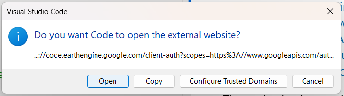{fig-align="center" width="70%"}

---

**Paso 2:** Se abrirá el *Notebook Authenticator* de Earth Engine. Verifica que estés usando la cuenta correcta y el proyecto correcto (`ee-giswqg`). Luego, haz clic en **GENERATE TOKEN**.

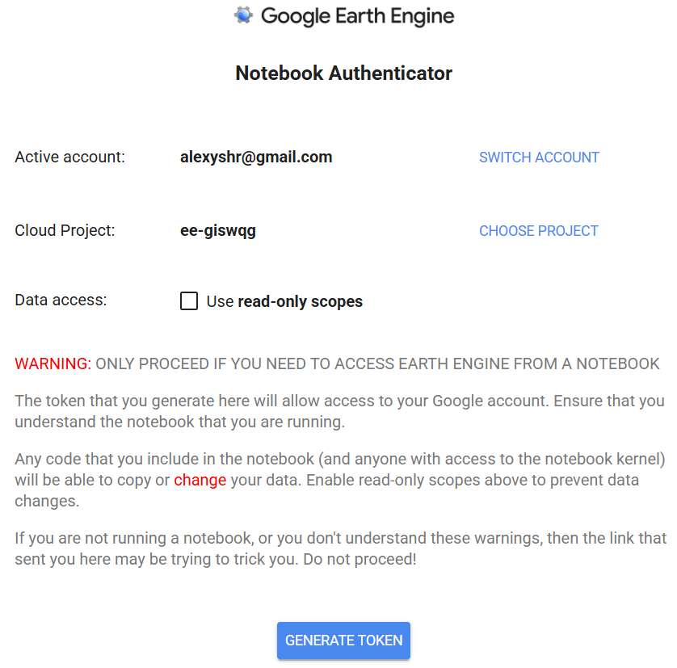{fig-align="center" width="70%"}

---

**Paso 3:** Es probable que Google te muestre una advertencia de seguridad indicando que la app no está verificada (porque es tu propio entorno local). Haz clic en **Continue**.

{fig-align="center" width="70%"}

---

**Paso 4:** Selecciona **todas** las casillas para otorgar los permisos necesarios (Drive, Cloud Data, Earth Engine) y haz clic en **Continue**.

{fig-align="center" width="60%"}

---

**Paso 5:** Google generará un código de autorización. Cópialo usando el botón de la derecha.

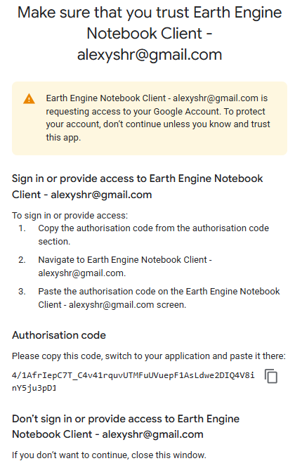{fig-align="center" width="60%"}

---

**Paso 6:** Regresa a VS Code. En la parte superior verás una barra que dice *Enter verification code*. **Pega el código allí y presiona Enter**. ¡Listo, ya estás conectado a las super computadoras de Google!

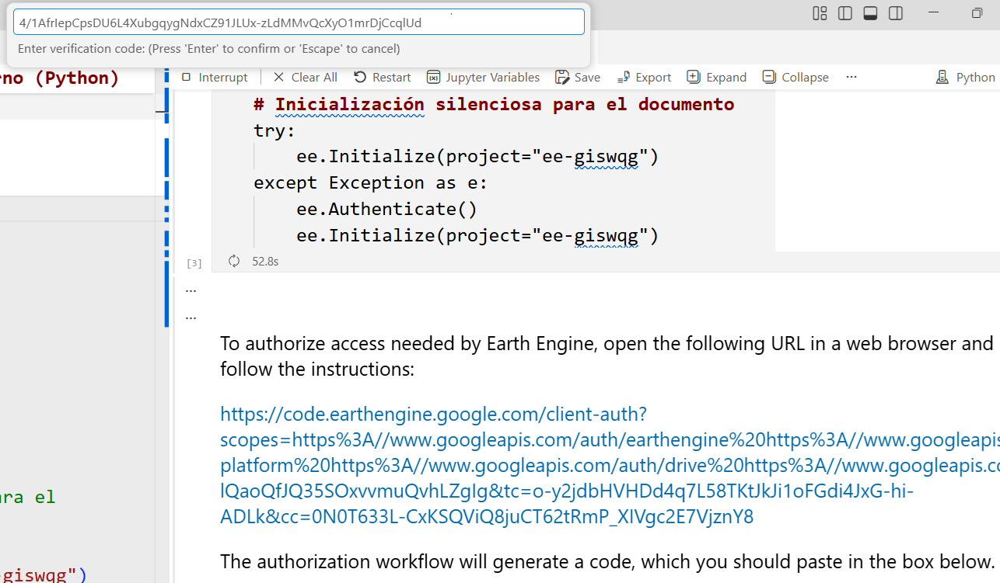{fig-align="center" width="85%"}


---

## Acceso a los catálogos de GEE

Antes de entrar en ejemplos específicos, es vital conocer dónde buscar la información. Google Earth Engine aloja aproximadamente 80 petabytes de información espacial lista para el análisis, abarcando más de 40 años de observaciones históricas y actualizándose diariamente.

Puedes explorar la lista completa, buscar por variables (clima, elevación, uso del suelo), satélites o etiquetas directamente en su portal web oficial:

👉 **[Explorar el Catálogo de Datos de GEE](https://developers.google.com/earth-engine/datasets/catalog/)**

💡 **Tip:** *Cada página dentro de este catálogo contiene la descripción de las bandas, la resolución y, lo más importante, el fragmento de código exacto (`ee.ImageCollection("ID_DEL_DATO")`) que necesitas copiar para llamarlo desde tu script en Python o JavaScript.*

👉 **[Explorar el Catálogo de la Comunidad de GEE](https://gee-community-catalog.org/)**. Este catálogo es alimentado y mantenido por la comunidad y es adicional al catálogo original de datos de GEE.

> Los principales tipos de datos dentro de los catálogos son:
>   * Image Collection (imágenes): Colección de imágenes.
>   * Feature Collection (datos vectoriales): Colección de vectores.


### El catálogo "tras bambalinas": Objetos Serializados y JSON

Para entender a un nivel más profundo cómo se comunican nuestras computadoras con los servidores de Google, es importante saber que el catálogo web que vemos es solo una "fachada" bonita. Detrás de escena, todo el catálogo de GEE está estructurado usando el estándar **STAC** (*SpatioTemporal Asset Catalog*). 

En programación, cuando tomamos datos complejos y los convertimos a texto plano para que viajen por internet sin corromperse, lo llamamos **"Objeto Serializado"** (*Serialized Object*). En GEE, estos objetos serializados viajan en formato **JSON** (*JavaScript Object Notation*). 

Podemos navegar este catálogo crudo directamente en sus archivos JSON. Veamos la anatomía de esta estructura de carpetas usando como ejemplo las imágenes Landsat 9:

1. **El Catálogo Principal:** Todo empieza en un gran archivo "índice" que lista todos los proveedores de datos:
   [`https://earthengine-stac.storage.googleapis.com/catalog/catalog.json`](https://earthengine-stac.storage.googleapis.com/catalog/catalog.json)

2. **La Familia de Satélites (Landsat):** Si dentro de ese índice buscamos "LANDSAT", el archivo nos redirige a la carpeta específica de este programa espacial:
   [`https://storage.googleapis.com/earthengine-stac/catalog/LANDSAT/catalog.json`](https://storage.googleapis.com/earthengine-stac/catalog/LANDSAT/catalog.json)

3. **El Insumo Específico (Asset ID):** Finalmente, podemos buscar nuestro grupo de imágenes Landsat a partir del *Asset ID*: `LANDSAT/LC09/C02/T1_TOA` (el cual exploraremos a fondo en la @sec-catalogo_landsat8_9). 
    * Para buscar dentro del archivo JSON use (`_`) en lugar de (`/`), es decir `LANDSAT_LC09_C02_T1_TOA`. Con esa búsqueda el sistema nos lleva al archivo maestro de metadatos de Landsat:
   [`https://storage.googleapis.com/earthengine-stac/catalog/LANDSAT/LANDSAT_LC09_C02_T1_TOA.json`](https://storage.googleapis.com/earthengine-stac/catalog/LANDSAT/LANDSAT_LC09_C02_T1_TOA.json)

> Para buscar dentro del catálogo GEE use el *Asset ID* original: `LANDSAT/LC09/C02/T1_TOA`.

**¿Para qué sirve entender esto?**

En el [catálogo de GEE](https://developers.google.com/earth-engine/datasets/catalog/) busca `LANDSAT/LC09/C02/T1_TOA`. ¡Porque la página web del catálogo de GEE que consultas a diario simplemente lee este último archivo JSON (*objetos serializados*) y lo "maquilla"!

* El texto que aparece en la pestaña **"Description"** de la página web se extrae del campo `description` del JSON.
* La tabla que ves en la pestaña **"Bands"** se construye leyendo el arreglo `eo:bands` del JSON.
* Los parámetros y filtros que usas en QGIS o ArcGIS Pro salen exactamente de la información contenida en este archivo serializado (visible en la pestaña **"Image Properties"**).

Entender que todo en GEE son *objetos serializados* te ayudará más adelante a comprender por qué tu computadora no colapsa procesando miles de imágenes: tu máquina solo envía y recibe pequeños archivos de texto JSON con instrucciones, mientras que la nube hace el trabajo pesado.

---

## Catálogo de datos: Landsat 8/9 {#sec-catalogo_landsat8_9}

En esta sección exploraremos el campus de la Universidad Nacional de Colombia (Sede Bogotá) utilizando imágenes del satélite Landsat 9. Landsat es fundamental para entender cambios históricos en la cobertura terrestre.

### Entendiendo la colección y el código

En el catálogo de GEE, la base de datos exacta que vamos a utilizar tiene el *Asset ID*: `LANDSAT/LC09/C02/T1_TOA`. ¿Qué significa este código tan largo? En Earth Engine, cada parte del nombre nos da metadatos vitales sobre el insumo:

- **`LANDSAT/LC09`**: Indica el programa espacial y el satélite específico (Landsat 9).
- **`C02` (Collection 2)**: Es la versión más reciente y pulida del procesamiento de la NASA/USGS, con mejoras en la precisión geográfica y radiométrica.
- **`T1` (Tier 1)**: Son los datos de la más alta calidad. Han pasado los controles más estrictos de nubosidad y geometría, siendo los únicos recomendados para análisis temporales rigurosos.
- **`TOA` (Top of Atmosphere)**: Reflectancia al Tope de la Atmósfera. Mide la energía de la luz tal cual choca contra el lente del satélite en el espacio, sin aplicar correcciones por los gases o aerosoles de la atmósfera terrestre.

Para procesar estos datos y verlos en pantalla, combinaremos los servidores de Google con librerías de mapeo en Python. Antes de ver el código, familiarízate con las herramientas (clases y funciones) principales que usaremos:

**El "Diccionario" de nuestro Script:**

| Función / Clase | Librería | ¿Para qué sirve en nuestro análisis? |
| :-- | :- | :---- |
| `ee.Geometry.Point()` | Earth Engine (`ee`) | Dibuja una coordenada matemática exacta `[Longitud, Latitud]` en los servidores de Google para indicarle dónde queremos buscar la información. |
| `ee.ImageCollection()` | Earth Engine (`ee`) | Llama a un "archivo" gigante que contiene millones de imágenes históricas. A esta colección le aplicaremos filtros para extraer una sola imagen. |
| `geemap.Map()` | Geemap | Crea un lienzo o mapa interactivo especializado en GEE. Es la herramienta estándar para visualizar los resultados si trabajas desde **QGIS, VS Code o Jupyter Notebooks**. |
| `folium.Map()` | Folium | Crea un mapa interactivo web nativo. Lo usamos "tras bambalinas" en este documento **Quarto** porque es ultra-liviano, no usa widgets pesados y evita que la presentación colapse. |
| `folium.TileLayer()` | Folium | Permite inyectar los "Tiles" (cuadritos de imagen renderizados por los servidores de Google) directamente sobre nuestro mapa web. |
| `folium.LayerControl()` | Folium | Añade el clásico menú en la esquina superior del mapa que le permite al usuario encender y apagar las capas satelitales a su gusto. |

<br>

Finalmente, al momento de visualizar la imagen, usaremos los canales de luz (bandas) específicos del sensor de Landsat 9:

| Banda | Resolución | Descripción |
|-|-|----|
| **B2, B3, B4** | 30m | Espectro Visible (Azul, Verde, Rojo). Forman el "Color Verdadero". |
| **B5** | 30m | Infrarrojo Cercano (NIR). Luz invisible al ojo humano, pero vital para analizar el vigor y salud de la vegetación. |


::: {.callout-note icon="false"}
#### 🧠 Concepto Clave: Cliente vs. Servidor (`.getInfo()`)
En los siguientes códigos de Python verás que usamos repetidamente la función `.getInfo()`. Como vimos hace un momento, GEE funciona enviando instrucciones desde tu computadora (el **Cliente**) a las super-computadoras de Google (el **Servidor**). Las imágenes pesadas se procesan y se quedan allá para no colapsar tu PC. 

Sin embargo, cuando necesitas leer un resultado concreto (como una fecha o el porcentaje de nubes) en tu pantalla de VS Code o QGIS, usas `.getInfo()`. Este comando le dice a Google: *"Por favor, empaqueta este dato específico, procésalo y envíame el resultado de regreso a mi computadora (como un diccionario de Python o un JSON)"*. ¡Es tu puente de retorno desde la nube!
:::

::: {.panel-tabset}

### Python

::: {.content-visible when-format="html"}
::: {.callout-tip collapse="true" icon="false"}
#### ▷ CÓDIGO GEEMAP QGIS (Copiar y Pegar)

```{python}
#| label: python_landsat_codigo
#| eval: false

# 1. IMPORTACIÓN DE LIBRERÍAS
# 'ee' para conectarnos a los servidores de Google Earth Engine.
# 'geemap' para visualizar mapas interactivos en QGIS, VS Code o Jupyter.
import ee
import geemap
import datetime # Para traducir la fecha del satélite a formato humano
import json # Librería nativa de Python para manejar JSON

# 2. DEFINICIÓN DEL PUNTO GEOGRÁFICO
# REGLA DE ORO EN GEE: El orden de las coordenadas es siempre [LONGITUD, LATITUD].
# -74.084 es la Longitud (Oeste) y 4.638 es la Latitud (Norte) para la UNAL Bogotá.
unal_punto = ee.Geometry.Point([-74.084, 4.638])

# 3. CONFIGURACIÓN DEL MAPA BASE
Map_l9 = geemap.Map()
# Para QUARTO: Forzamos a que el lienzo viaje directamente a nuestro punto con zoom 17
Map_l9.centerObject(unal_punto, 17)

# 4. EXPLORAR TODAS LAS OPCIONES Y FILTRAR (Proceso en Servidor)
# Traemos la colección entera y la ordenamos, pero NO extraemos la primera todavía.
coleccion_l9 = (ee.ImageCollection("LANDSAT/LC09/C02/T1_TOA") # A) Acceso a Landsat 9 TOA
    .filterBounds(unal_punto)                       # B) Filtro Espacial: Que toque la UNAL
    .filterDate('2023-01-01', '2023-12-31')         # C) Filtro Temporal: Año 2023
    .sort('CLOUD_COVER'))                           # D) Ordenamiento: De menor a mayor % de nubes

# 5. DIAGNÓSTICO: EXTRAER EL TOP 3 DE IMÁGENES
# Usamos aggregate_array para listar los datos en la consola de Python de QGIS
ids = coleccion_l9.aggregate_array('system:id').getInfo()
nubes = coleccion_l9.aggregate_array('CLOUD_COVER').getInfo()
fechas = coleccion_l9.aggregate_array('system:time_start').getInfo()

print("--- TOP 3 IMÁGENES CON MENOS NUBES EN EL AÑO 2023 (TODA LA ESCENA) ---")
for i in range(min(3, len(ids))):
    # ACTUALIZACIÓN: Uso de fromtimestamp con UTC para evitar DeprecationWarning
    fecha_legible = datetime.datetime.fromtimestamp(fechas[i] / 1000.0, datetime.UTC).strftime('%Y-%m-%d')
    print(f"Opción {i+1} | Nubes: {nubes[i]:.2f}% | Fecha: {fecha_legible}")
    print(f"ID: {ids[i]}\n")
print("----------------------------------------------------------------")

# 6. SELECCIÓN DEFINITIVA DE LA IMAGEN
# Por defecto tomamos la primera (la de menor nubosidad general).
l9 = coleccion_l9.first()

# 💡 TIP: Si al ver el mapa notas que la Opción 1 tiene una nube justo sobre la UNAL, 
# puedes comentar la línea anterior y forzar manualmente la carga de la Opción 2 así:
# l9 = ee.Image("COPIA_AQUI_EL_ID_DE_LA_OPCION_2")


# 7. EXPORTAR LOS ARCHIVOS JSON (METADATOS Y SERIALIZADO)
id_exacto = l9.get('system:id').getInfo()
print(f"\nID de la imagen Landsat 9 seleccionada: {id_exacto}")

# A) Exportar Metadatos (Referencia humana)
# Contiene el resultado final: propiedades, fecha, % de nubes, bandas, etc.
metadatos_json = l9.getInfo()
with open('data/metadatos_landsat9.json', 'w') as archivo:
    json.dump(metadatos_json, archivo, indent=4)
print("¡Archivo 'data/metadatos_landsat9.json' generado! (Explora sus propiedades)")

# B) Exportar Grafo Serializado (Para ArcGIS Pro)
# Contiene las instrucciones puras. Usamos el ID limpio para no confundir a ArcGIS.
l9_limpia = ee.Image(id_exacto)
texto_json_serializado = l9_limpia.serialize()

# TRUCO PARA ARCGIS PRO: Guardamos el resultado empacado directamente como un String.
with open('data/landsat9_serializado.json', 'w') as archivo:
    json.dump(texto_json_serializado, archivo)
print("¡Archivo 'data/landsat9_serializado.json' generado! (Úsalo en la herramienta de ArcGIS Pro)")


# 8. AGREGAR LA IMAGEN AL VISOR
# Obtenemos la fecha exacta de la imagen seleccionada para el nombre de la capa en QGIS
fecha_capa_ms = l9.get('system:time_start').getInfo()
# ACTUALIZACIÓN: Uso de fromtimestamp con UTC para evitar DeprecationWarning
fecha_capa = datetime.datetime.fromtimestamp(fecha_capa_ms / 1000.0, datetime.UTC).strftime('%Y-%m-%d')

# 'bands': Composición RGB (B4=Rojo, B3=Verde, B2=Azul).
# 'min'/'max': Rango de reflectancia para dar el brillo adecuado (0 a 0.3).
vis_params = {'bands': ['B4', 'B3', 'B2'], 'min': 0.0, 'max': 0.3}
Map_l9.addLayer(l9, vis_params, f'Landsat 9 RGB - {fecha_capa}')

# 9. MENSAJE FINAL CON LOS DETALLES DE LA IMAGEN DESPLEGADA
id_desplegada = l9.get('system:id').getInfo()
nubes_desplegada = l9.get('CLOUD_COVER').getInfo()

print("\n✅ MAPA GENERADO CON ÉXITO")
print(f"Capa desplegada : Landsat 9 RGB - {fecha_capa}")
print(f"ID del archivo  : {id_desplegada}")
print(f"Nubosidad total : {nubes_desplegada:.2f}%")
print("----------------------------------------------------------------")

# 10. MOSTRAR EL MAPA EN PANTALLA
Map_l9
```

---

```{python}
#| label: python_landsat_estatico_codigo
#| eval: false

# CÓDIGO MAPA ESTÁTICO CON MATPLOTLIB (Independiente)

import ee
import requests
import matplotlib.pyplot as plt
from PIL import Image
from io import BytesIO

# 1. DEFINICIÓN DEL PUNTO GEOGRÁFICO Y REGIÓN DE INTERÉS
lon_centro, lat_centro = -74.084, 4.638
unal_punto = ee.Geometry.Point([lon_centro, lat_centro])
# Creamos un buffer (radio en metros) alrededor del punto para el encuadre del mapa estático
region_interes = unal_punto.buffer(3000)

# 2. CONSULTA Y SELECCIÓN DE LA IMAGEN
# Ejecutamos la consulta completa de manera independiente
l9_estatica = (ee.ImageCollection("LANDSAT/LC09/C02/T1_TOA")
    .filterBounds(unal_punto)
    .filterDate('2023-01-01', '2023-12-31')
    .sort('CLOUD_COVER')
    .first())

# 3. OBTENER LA URL DEL THUMBNAIL (PNG) DESDE GOOGLE EARTH ENGINE
# Solicitamos directamente el PNG a los servidores de Google
url_img = l9_estatica.getThumbURL({
    'bands': ['B4', 'B3', 'B2'],
    'min': 0.0,
    'max': 0.3,
    'dimensions': 800,
    'region': region_interes
})

# 4. DESCARGAR Y DIBUJAR LA IMAGEN CON MATPLOTLIB (Grilla y Coordenadas)
respuesta = requests.get(url_img)
imagen_png = Image.open(BytesIO(respuesta.content))

# Obtenemos las coordenadas límite para georreferenciar la imagen PNG
coords = region_interes.bounds().coordinates().get(0).getInfo()
xmin, ymin = coords[0][0], coords[0][1]
xmax, ymax = coords[2][0], coords[2][1]

fig, ax = plt.subplots(figsize=(8, 8))

# Mapeamos los píxeles a grados
ax.imshow(imagen_png, extent=[xmin, xmax, ymin, ymax])

# Grilla de 1 km. (1 grado ≈ 111 km -> 1 km ≈ 0.009 grados)
paso_1km = 0.009 

x_ticks = [lon_centro + (i * paso_1km) for i in range(-4, 5)]
y_ticks = [lat_centro + (i * paso_1km) for i in range(-4, 5)]

x_ticks = [x for x in x_ticks if xmin <= x <= xmax]
y_ticks = [y for y in y_ticks if ymin <= y <= ymax]

ax.set_xticks(x_ticks)
ax.set_yticks(y_ticks)
ax.set_xticklabels([f"{x:.3f}°" for x in x_ticks])
ax.set_yticklabels([f"{y:.3f}°" for y in y_ticks])

ax.grid(color='white', linestyle='--', linewidth=0.8, alpha=0.7)
ax.set_title('Landsat 9 Color Verdadero (Píxel ~30 m, Grilla ~1 km)', fontsize=14)
ax.set_xlabel('Longitud')
ax.set_ylabel('Latitud')

plt.tight_layout()
plt.show()
```


:::
:::

```{python}
#| label: python_landsat
# #| eval: false

# Código usando Folium!

import ee
import folium
import datetime # Para manejar tiempos y fechas
import json # Librería nativa de Python para manejar JSON

# 1. DEFINICIÓN DEL PUNTO GEOGRÁFICO
# REGLA DE ORO EN GEE: El orden de las coordenadas es siempre [LONGITUD, LATITUD].
unal_punto = ee.Geometry.Point([-74.084, 4.638])

# 2. EXPLORAR TODAS LAS OPCIONES Y FILTRAR (Proceso en Servidor)
# Filtramos la colección Landsat 9 para el año 2023 sobre la UNAL Bogotá.
coleccion_l9 = (ee.ImageCollection("LANDSAT/LC09/C02/T1_TOA") 
    .filterBounds(unal_punto) 
    .filterDate('2023-01-01', '2023-12-31') 
    .sort('CLOUD_COVER'))

# 3. DIAGNÓSTICO: EXTRAER EL TOP 3 DE IMÁGENES
ids = coleccion_l9.aggregate_array('system:id').getInfo()
nubes = coleccion_l9.aggregate_array('CLOUD_COVER').getInfo()
fechas = coleccion_l9.aggregate_array('system:time_start').getInfo()

print("--- TOP 3 IMÁGENES CON MENOS NUBES EN EL AÑO 2023 (TODA LA ESCENA) ---")
for i in range(min(3, len(ids))):
    # ACTUALIZACIÓN: Usamos fromtimestamp con datetime.UTC para evitar el DeprecationWarning
    fecha_legible = datetime.datetime.fromtimestamp(fechas[i] / 1000.0, datetime.UTC).strftime('%Y-%m-%d')
    print(f"Opción {i+1} | Nubes: {nubes[i]:.2f}% | Fecha: {fecha_legible}")
    print(f"ID: {ids[i]}\n")
print("----------------------------------------------------------------")

# 4. SELECCIÓN DEFINITIVA DE LA IMAGEN
l9 = coleccion_l9.first()

# 5. EXPORTAR LOS ARCHIVOS JSON (METADATOS Y SERIALIZADO)
id_exacto = l9.get('system:id').getInfo()
print(f"\nID de la imagen Landsat 9 seleccionada: {id_exacto}")

# A) Exportar Metadatos (Referencia humana)
# Contiene el resultado final: propiedades, fecha, % de nubes, bandas, etc.
metadatos_json = l9.getInfo()
with open('data/metadatos_landsat9.json', 'w') as archivo:
    json.dump(metadatos_json, archivo, indent=4)
print("¡Archivo 'data/metadatos_landsat9.json' generado! (Explora sus propiedades)")

# B) Exportar Grafo Serializado (Para ArcGIS Pro)
# Contiene las instrucciones puras. Usamos el ID limpio para no confundir a ArcGIS.
l9_limpia = ee.Image(id_exacto)
texto_json_serializado = l9_limpia.serialize()

# TRUCO PARA ARCGIS PRO: Guardamos el resultado empacado directamente como un String.
with open('data/landsat9_serializado.json', 'w') as archivo:
    json.dump(texto_json_serializado, archivo)
print("¡Archivo 'data/landsat9_serializado.json' generado! (Úsalo en la herramienta de ArcGIS Pro)")


# 6. PARÁMETROS DE VISUALIZACIÓN (Composición RGB)
vis_params = {'bands': ['B4', 'B3', 'B2'], 'min': 0.0, 'max': 0.3}

# 7. OBTENER URL DE LOS TILES DE GOOGLE
map_id_dict = ee.Image(l9).getMapId(vis_params)

# 8. MENSAJE FINAL CON LOS DETALLES DE LA IMAGEN DESPLEGADA
fecha_capa_ms = l9.get('system:time_start').getInfo()
# ACTUALIZACIÓN: Aquí también aplicamos el estándar moderno de Python para UTC
fecha_capa = datetime.datetime.fromtimestamp(fecha_capa_ms / 1000.0, datetime.UTC).strftime('%Y-%m-%d')
id_desplegada = l9.get('system:id').getInfo()
nubes_desplegada = l9.get('CLOUD_COVER').getInfo()

print("\n✅ MAPA GENERADO CON ÉXITO")
print(f"Capa desplegada : Landsat 9 RGB - {fecha_capa}")
print(f"ID del archivo  : {id_desplegada}")
print(f"Nubosidad total : {nubes_desplegada:.2f}%")
print("----------------------------------------------------------------")

# 9. CONFIGURACIÓN DEL MAPA BASE (Folium)
# ¡ATENCIÓN!: Folium usa el orden [LATITUD, LONGITUD].
Map_l9 = folium.Map(location=[4.638, -74.084], zoom_start=17)

# 10. AGREGAR LA IMAGEN AL VISOR
folium.TileLayer(
    tiles=map_id_dict['tile_fetcher'].url_format,
    attr='Google Earth Engine',
    overlay=True,
    name=f'Landsat 9 RGB - {fecha_capa}'
).add_to(Map_l9)

# Control para encender/apagar capas
folium.LayerControl().add_to(Map_l9)

# 11. VISUALIZACIÓN DEL RESULTADO
# Map_l9
#from IPython.display import display, HTML
#display(HTML(Map_l9._repr_html_()))

from IPython.display import IFrame

# Guardamos el mapa aislado en tu carpeta de trabajo
Map_l9.save("mapas/map_l9.html")

# Lo incrustamos en el documento Quarto como una página web independiente
display(IFrame(src="mapas/map_l9.html", width="100%", height="500px"))
```


---

```{python}
#| label: fig-python_landsat_estatico
#| fig-cap: "Imagen estática del Catálogo Landsat 9 en color verdadero."
# #| eval: false

# CÓDIGO MAPA ESTÁTICO CON MATPLOTLIB (Independiente)

import ee
import requests
import matplotlib.pyplot as plt
from PIL import Image
from io import BytesIO

# 1. DEFINICIÓN DEL PUNTO GEOGRÁFICO Y REGIÓN DE INTERÉS
lon_centro, lat_centro = -74.084, 4.638
unal_punto = ee.Geometry.Point([lon_centro, lat_centro])
# Creamos un buffer (radio en metros) alrededor del punto para el encuadre del mapa estático
region_interes = unal_punto.buffer(3000)

# 2. CONSULTA Y SELECCIÓN DE LA IMAGEN
# Ejecutamos la consulta completa de manera independiente
l9_estatica = (ee.ImageCollection("LANDSAT/LC09/C02/T1_TOA")
    .filterBounds(unal_punto)
    .filterDate('2023-01-01', '2023-12-31')
    .sort('CLOUD_COVER')
    .first())

# 3. OBTENER LA URL DEL THUMBNAIL (PNG) DESDE GOOGLE EARTH ENGINE
# Solicitamos directamente el PNG a los servidores de Google
url_img = l9_estatica.getThumbURL({
    'bands': ['B4', 'B3', 'B2'],
    'min': 0.0,
    'max': 0.3,
    'dimensions': 800,
    'region': region_interes
})

# 4. DESCARGAR Y DIBUJAR LA IMAGEN CON MATPLOTLIB (Grilla y Coordenadas)
respuesta = requests.get(url_img)
imagen_png = Image.open(BytesIO(respuesta.content))

# Obtenemos las coordenadas límite para georreferenciar la imagen PNG
coords = region_interes.bounds().coordinates().get(0).getInfo()
xmin, ymin = coords[0][0], coords[0][1]
xmax, ymax = coords[2][0], coords[2][1]

fig, ax = plt.subplots(figsize=(8, 8))

# Mapeamos los píxeles a grados
ax.imshow(imagen_png, extent=[xmin, xmax, ymin, ymax])

# Grilla de 1 km. (1 grado ≈ 111 km -> 1 km ≈ 0.009 grados)
paso_1km = 0.009 

x_ticks = [lon_centro + (i * paso_1km) for i in range(-4, 5)]
y_ticks = [lat_centro + (i * paso_1km) for i in range(-4, 5)]

x_ticks = [x for x in x_ticks if xmin <= x <= xmax]
y_ticks = [y for y in y_ticks if ymin <= y <= ymax]

ax.set_xticks(x_ticks)
ax.set_yticks(y_ticks)
ax.set_xticklabels([f"{x:.3f}°" for x in x_ticks])
ax.set_yticklabels([f"{y:.3f}°" for y in y_ticks])

ax.grid(color='white', linestyle='--', linewidth=0.8, alpha=0.7)
ax.set_title('Landsat 9 Color Verdadero (Píxel ~30 m, Grilla ~1 km)', fontsize=14)
ax.set_xlabel('Longitud')
ax.set_ylabel('Latitud')

plt.tight_layout()
plt.show()
```

### Javascript

Para ejecutar este código, debes abrir el **[Code Editor de Google Earth Engine](https://code.earthengine.google.com/)** en tu navegador, pegar el siguiente fragmento en la consola central y hacer clic en **"Run"**.

```{.javascript #js_landsat}
// 1. DEFINICIÓN DEL PUNTO GEOGRÁFICO
// En la interfaz de JavaScript de GEE el orden es [LONGITUD, LATITUD].
var punto_unal = ee.Geometry.Point([-74.084, 4.638]);

// 2. CENTRAR EL VISOR
// Centramos el mapa interactivo en nuestro punto con un zoom de 17.
Map.centerObject(punto_unal, 17);

// 3. CONSULTA Y FILTRADO DE DATOS
// Encadenamos funciones para obtener la imagen más limpia del catálogo:
var l9 = ee.ImageCollection("LANDSAT/LC09/C02/T1_TOA") // Carga la colección Landsat 9
  .filterBounds(punto_unal)               // Filtro por ubicación (Bogotá)
  .filterDate('2023-01-01', '2023-12-31') // Filtro por periodo de tiempo (Año 2023)
  .sort('CLOUD_COVER')                    // Ordena por el metadato de nubosidad (Menor a Mayor)
  .first();                               // Selecciona la primera de la lista (la más despejada)

// 4. PARÁMETROS DE VISUALIZACIÓN
// Definimos el diccionario de visualización para ver bandas B4, B3 y B2.
var visParams = {bands: ['B4', 'B3', 'B2'], min: 0.0, max: 0.3};

// 5. MOSTRAR EN PANTALLA Y EN CONSOLA
// Añadimos la imagen procesada como una capa en el Code Editor.
Map.addLayer(l9, visParams, 'Landsat 9 - UNAL Bogotá');

// Imprimimos los metadatos de la imagen en la consola de la derecha
print('Metadatos de la imagen seleccionada:', l9);
// Imprimimos el ID exacto para poder usarlo en ArcGIS Pro / QGIS
print('ID exacto de la imagen:', l9.get('system:id'));
```

---

```{.javascript #js_landsat_estatico}
// ▷ CÓDIGO MAPA ESTÁTICO (THUMBNAIL) EN JAVASCRIPT (Independiente)

// 1. DEFINICIÓN DEL PUNTO Y REGIÓN DE INTERÉS
var punto_unal = ee.Geometry.Point([-74.084, 4.638]);
var region_interes = punto_unal.buffer(3000); // Buffer de 3km

// 2. CONSULTA Y SELECCIÓN DE LA IMAGEN
var l9_estatica = ee.ImageCollection("LANDSAT/LC09/C02/T1_TOA")
  .filterBounds(punto_unal)
  .filterDate('2023-01-01', '2023-12-31')
  .sort('CLOUD_COVER')
  .first();

// 3. PARÁMETROS DE VISUALIZACIÓN
var visParamsEstatica = {
  bands: ['B4', 'B3', 'B2'],
  min: 0.0,
  max: 0.3,
  dimensions: 800,
  region: region_interes
};

// 4. MOSTRAR EN CONSOLA LA URL Y EL THUMBNAIL
print('URL de la imagen PNG:', l9_estatica.getThumbURL(visParamsEstatica));

var miniatura = ui.Thumbnail({
  image: l9_estatica,
  params: visParamsEstatica,
  style: {width: '400px', height: '400px'}
});
print('Vista previa estática:', miniatura);
```

:::


---

## GEE desde QGIS (Plugin de Google Earth Engine)

Ya vimos cómo ejecutar código en Python y JavaScript. Ahora exploraremos cómo integrar toda esta potencia directamente dentro de una interfaz SIG tradicional como **QGIS**, utilizando el plugin de GEE. 

Abre QGIS, asegúrate de tener el plugin instalado y actualizado (Ver @sec-qgis-gee-pixi.) y sigue estos tres pasos:

### Búsqueda en el Catálogo desde QGIS
Ve al panel del plugin de GEE. En la pestaña **Search**, puedes buscar colecciones de imágenes directamente por su nombre o ID. Intenta buscar la colección que usamos arriba (`LANDSAT/LC09/C02/T1_TOA`).

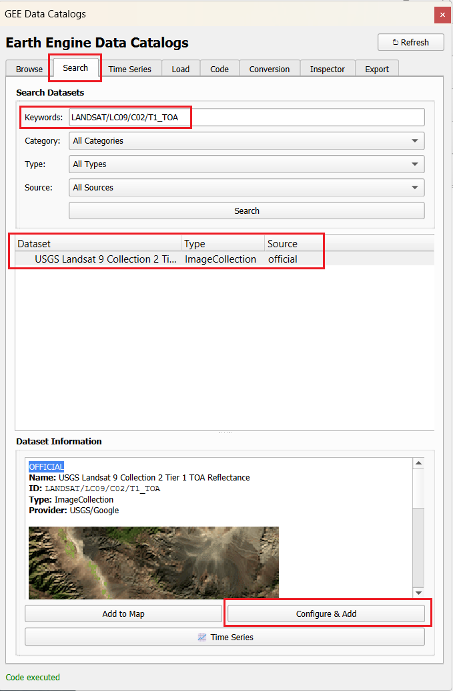{#fig-qgis-search fig-align="center" width="80%"}

### Ejecutar Código de Geemap
Ahora, abre la pestaña **Code**. Copia exactamente el código de Python que vimos en la sección anterior (el de la pestaña *CÓDIGO GEEMAP QGIS*) y pégalo allí. Haz clic en ejecutar.

::: {.callout-warning icon="false"}
#### ⚠️ ¡Atención con la navegación!
La imagen se cargará en tus capas de QGIS, pero **nota importante:** a diferencia del visor web, la imagen probablemente **no cargará centrada** de forma automática en tu lienzo. Tendrás que hacer clic derecho sobre la capa generada y seleccionar "Acercar a la capa" (Zoom to layer).
:::

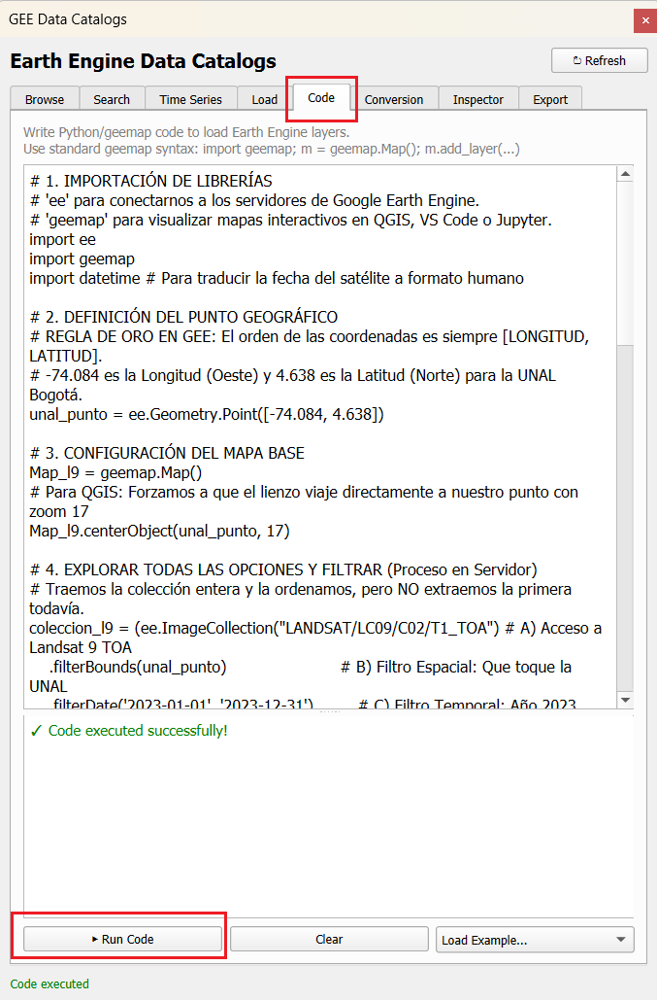{#fig-qgis-code fig-align="center" width="80%"}

### El Reto: Cargar Parámetros Manualmente
Finalmente, ve a la pestaña **Load**. Aquí puedes cargar imágenes sin necesidad de programar, simplemente rellenando los campos. 

**🎯 Tu reto:** Utilizando la información de metadatos (ID del archivo exacto) y los parámetros de visualización (bandas B4, B3, B2, min y max) que descubriste corriendo el código anterior, llena este formulario. ¡Intenta cargar **exactamente la misma imagen** que obtuvimos por código, pero esta vez configurándola manualmente desde esta interfaz!

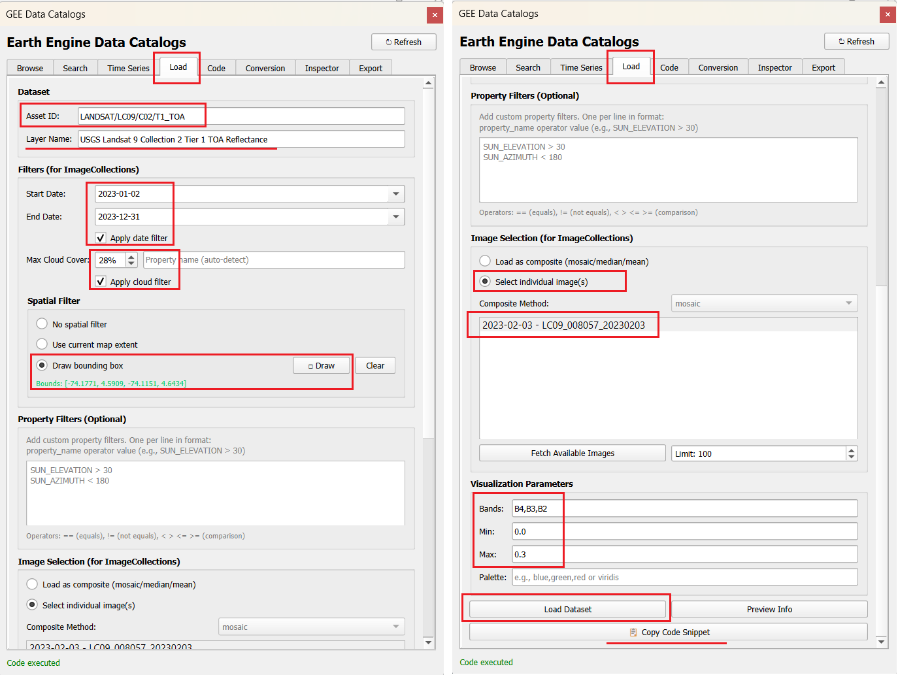{#fig-qgis-load fig-align="center" width="100%"}

> Puede usar múltiples propiedades de imagen para filtrar la búsqueda en la pestaña `Property Filters (Optional)`. Escriba en cada línea de la caja de texto disponible, filtros personalizados. Ej: `SUN_ELEVATION > 30` y `SUN_AZIMUTH < 180`. La lista de propiedades se puede obtener del [catálogo de GEE](https://developers.google.com/earth-engine/datasets/catalog/). 
>
> * Busque el `Asset ID`. Léalo del código Python provisto: `ee.ImageCollection("LANDSAT/LC09/C02/T1_TOA")`
> * En la pestaña `Image Properties` estudie el nombre, tipo y descripción de las propiedades de las imágenes que se pueden usar para filtrar el grupo de datos Landsat. Vea la figura @fig-gee-catalog-props a continuación.

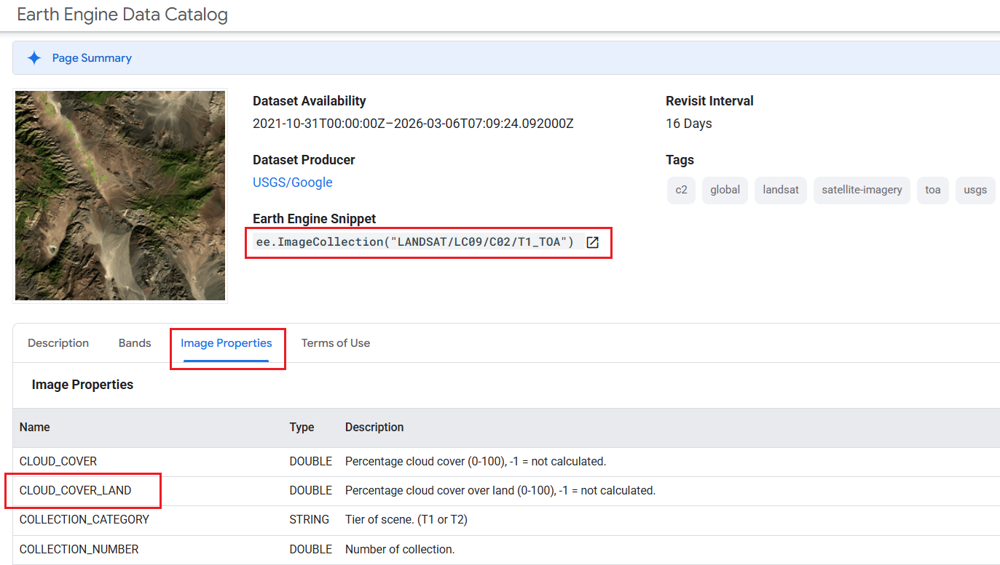{#fig-gee-catalog-props fig-align="center" width="100%"}


## GEE desde ArcGIS PRO (caja de herramientas) {#sec-arcgis-pro-gee-start}

La caja de herramientas de GEE (*GEE Toolbox*) actúa como un puente que no requiere programación entre GEE y ArcGIS Pro. Te permite llevar bases de datos, herramientas y resultados de Google directamente a tu software de escritorio para análisis adicionales o presentación de resultados. Sus capacidades incluyen:

* Explorar, filtrar y descargar datos directamente desde el Catálogo de Datos de GEE. 
* Añadir colecciones de imágenes o vectores a tu mapa de ArcGIS Pro usando un simple *Asset ID* (Identificador de archivo) extraído del catálogo de Google.
* Integrar operaciones de GEE en *ModelBuilder* y ejecutar scripts de Python que llamen a las funciones de GEE directamente dentro del entorno de ArcGIS Pro.

**Guías de inicio recomendadas:**

* [ArcGIS Earth Engine Toolbox (GEE Connector) User Guide: Quick Start](https://github.com/gee-community/arcgis-earthengine-toolbox/blob/main/docs/01_quick_start.md)
* [Bring Google Earth Engine’s Data Right into ArcGIS Pro](https://storymaps.arcgis.com/stories/bf22d27bfceb4507a40b4a52e5dec702)

**Recursos adicionales:**

* [Todas las guías oficiales](https://github.com/gee-community/arcgis-earthengine-toolbox/tree/main/docs)
* [Video guías](https://www.youtube.com/@zhifeidong4310/videos)
* Artículo en Medium: [Bridging Worlds: Bringing Google Earth Engine to Desktop GIS Users!](https://medium.com/google-earth/bridging-worlds-bringing-google-earth-engine-to-desktop-gis-users-3f2edb99131d)

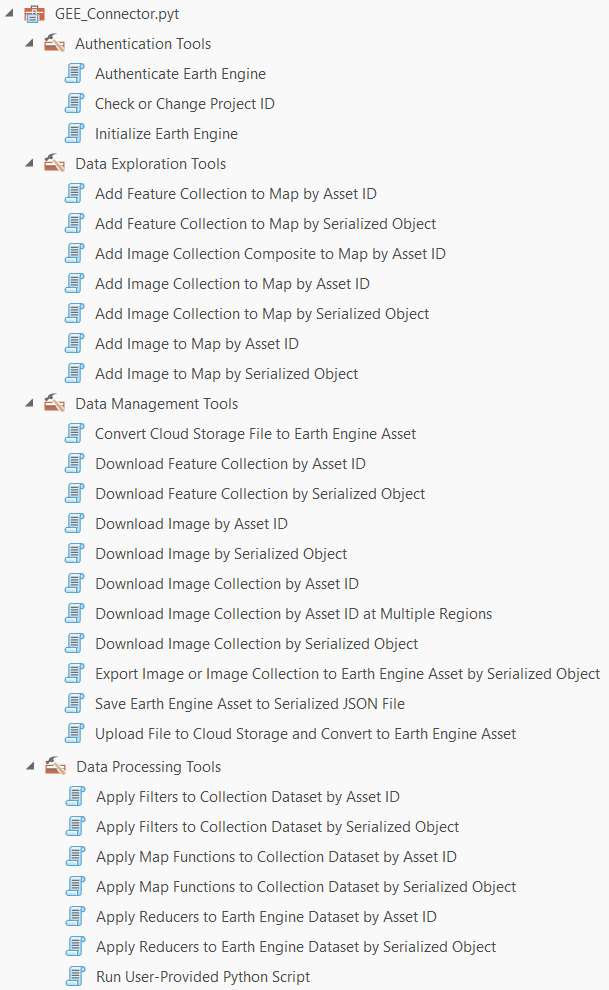{#fig-gee-tool fig-align="center" width="60%"}


### Inicializar GEE en ArcGIS Pro

Una vez configurado el entorno y descargada la caja de herramientas, procede a inicializar Earth Engine dentro de la interfaz de ArcGIS Pro. Ver @sec-arcgis-pro-initialize-gee.


### Exploración del Catálogo y Propiedades
Al igual que hicimos en QGIS, usaremos la herramienta `Add Image Collection to Map by Asset ID` para cargar nuestra imagen Landsat de la Universidad Nacional. Para hacerlo correctamente:

* En el [catálogo de GEE](https://developers.google.com/earth-engine/datasets/catalog/) busque el `Asset ID` de la imagen a cargar. Léalo del código Python provisto en las secciones anteriores: `ee.ImageCollection("LANDSAT/LC09/C02/T1_TOA")`.
* En la pestaña `Image Properties` del catálogo (ver figura @fig-gee-catalog-props), estudie el nombre, tipo y descripción de las propiedades que permiten filtrar el conjunto de datos. 
* Para filtrar específicamente por el porcentaje de nubes sobre tierra firme, debe usar la propiedad `CLOUD_COVER_LAND`.


### El Reto: Añadir la Colección al Mapa
Con toda la información recolectada, es hora de ponerla en práctica en la interfaz de ArcGIS Pro:

* Acérquese (haga zoom) al campus de la Universidad Nacional en su mapa base de ArcGIS.
* Abra la herramienta `Add Image Collection to Map by Asset ID`.
* Llene cada uno de los campos de acuerdo con el código utilizado anteriormente o verifique la @fig-arcgis-add-collection que se encuentra a continuación.
* Seleccione la imagen a cargar de la lista desplegable `Select an image`. 
    **Nota de verificación**: Una vez todos los parámetros están correctamente definidos, solo una imagen debería aparecer en la lista desplegable.
* Presione el botón `run`

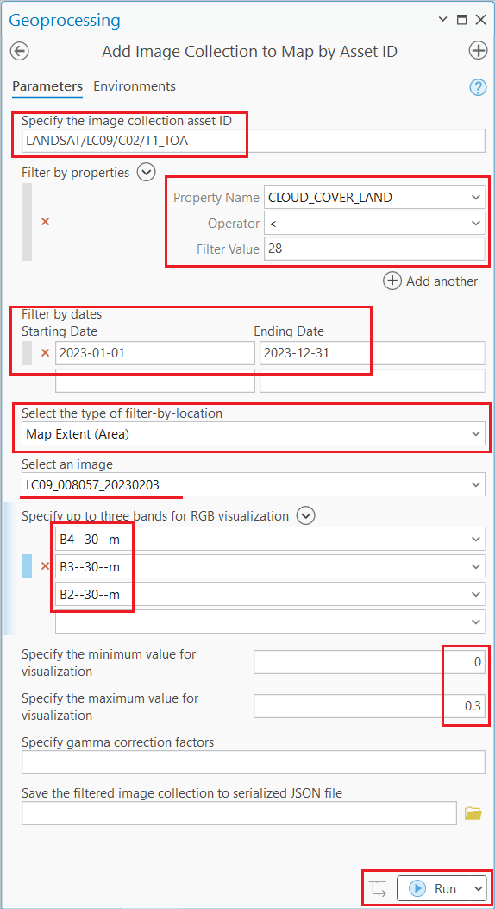{#fig-arcgis-add-collection fig-align="center" width="60%"}

> **💡 Tip:** Puede usar múltiples propiedades de imagen para refinar la búsqueda dentro de esta herramienta. En la sección `Filter by properties`, haga clic en `Add another` y rellene adecuadamente los parámetros `Property Name`, `Operator` y `Filter Value`.

### Añadir imagen mediante JSON (Serialized Object)

Utilice el archivo `landsat9_serializado.json` que generamos y descargamos en el paso anterior para cargar la imagen en ArcGIS Pro. Para ello, abra la herramienta **Add Image to Map by Serialized Object**, busque su archivo en el disco y ejecute la herramienta. 

Puede guiarse con la configuración mostrada en la figura @fig-arcgis-serialized.

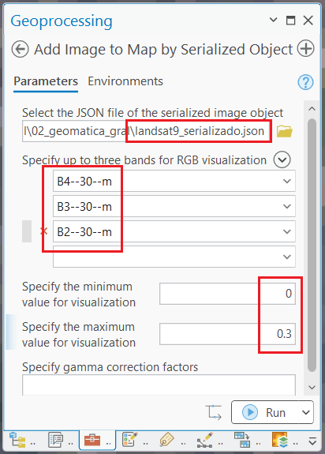{#fig-arcgis-serialized fig-align="center" width="50%"}


### Añadir imagen mediante Asset ID

Alternativamente, si no quiere usar el JSON, puede utilizar el identificador único y exacto de la escena. Copie el ID `LANDSAT/LC09/C02/T1_TOA/LC09_008057_20230203` (que imprimimos previamente en la consola usando nuestro código Python) y úselo para cargar la imagen mediante la herramienta **Add Image to Map by Asset ID**. 

Vea la figura @fig-arcgis-assetid como referencia para rellenar los parámetros.

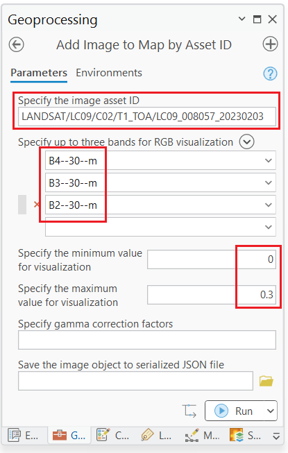{#fig-arcgis-assetid fig-align="center" width="50%"}

---

## Catálogo de datos: Sentinel 2

Para este segundo ejercicio exploraremos la constelación Sentinel-2 de la Agencia Espacial Europea (ESA) bajo el programa Copernicus. Este satélite ofrece una resolución espacial superior (10 metros en sus bandas visibles) y es ideal para el monitoreo agrícola y de coberturas.

| Banda | Resolución | Descripción |
|---|---|---|
| B2, B3, B4 | 10m | Azul, Verde, Rojo (Espectro Visible) |
| B8 | 10m | Infrarrojo Cercano (NIR) |

### Entendiendo la colección y el código

El flujo de trabajo es idéntico al que utilizamos con Landsat, pero con dos diferencias importantes:

1. El *Asset ID* de la colección es `COPERNICUS/S2_SR_HARMONIZED`.
2. El metadato para filtrar nubes en Sentinel 2 se llama `CLOUDY_PIXEL_PERCENTAGE` (a diferencia de Landsat que usa `CLOUD_COVER`).
3. El rango de valores de reflectancia (`min` y `max`) cambia. Mientras Landsat 9 TOA va de 0 a 1 (usamos 0 a 0.3), los productos de Sentinel 2 SR vienen escalados por defecto entre 0 y 10000. Por eso, en los parámetros visuales usaremos `max: 3000`.

::: {.panel-tabset}

### Python

::: {.content-visible when-format="html"}
::: {.callout-tip collapse="true" icon="false"}
#### ▷ CÓDIGO GEEMAP QGIS (Copiar y Pegar)

```{python}
#| label: python_s2_codigo
#| eval: false

# 1. IMPORTACIÓN DE LIBRERÍAS
import ee
import geemap
import datetime
import json

# 2. DEFINICIÓN DEL PUNTO GEOGRÁFICO
unal_punto = ee.Geometry.Point([-74.084, 4.638])

# 3. CONFIGURACIÓN DEL MAPA BASE
Map_s2 = geemap.Map()
Map_s2.centerObject(unal_punto, 17)

# 4. EXPLORAR TODAS LAS OPCIONES Y FILTRAR
# Usamos filter y filter.lt (less than) para pre-filtrar imágenes con menos del 10% de nubes
coleccion_s2 = (ee.ImageCollection("COPERNICUS/S2_SR_HARMONIZED") 
    .filterBounds(unal_punto)                       
    .filterDate('2023-01-01', '2023-12-31')         
    .filter(ee.Filter.lt('CLOUDY_PIXEL_PERCENTAGE', 10)) 
    .sort('CLOUDY_PIXEL_PERCENTAGE'))               

# 5. DIAGNÓSTICO: EXTRAER EL TOP 3 DE IMÁGENES
ids = coleccion_s2.aggregate_array('system:id').getInfo()
nubes = coleccion_s2.aggregate_array('CLOUDY_PIXEL_PERCENTAGE').getInfo()
fechas = coleccion_s2.aggregate_array('system:time_start').getInfo()

print("--- TOP 3 IMÁGENES SENTINEL-2 CON MENOS NUBES (2023) ---")
for i in range(min(3, len(ids))):
    fecha_legible = datetime.datetime.fromtimestamp(fechas[i] / 1000.0, datetime.UTC).strftime('%Y-%m-%d')
    print(f"Opción {i+1} | Nubes: {nubes[i]:.2f}% | Fecha: {fecha_legible}")
    print(f"ID: {ids[i]}\n")
print("----------------------------------------------------------")

# 6. SELECCIÓN DEFINITIVA DE LA IMAGEN
# Forzamos el tipo de dato a ee.Image para evitar bugs en herramientas externas
s2 = ee.Image(coleccion_s2.first())

# 7. EXPORTAR LOS ARCHIVOS JSON (METADATOS Y SERIALIZADO)
id_exacto = s2.get('system:id').getInfo()
print(f"\nID de la imagen Sentinel 2 seleccionada: {id_exacto}")

# A) Exportar Metadatos
metadatos_json = s2.getInfo()
with open('data/metadatos_sentinel2.json', 'w') as archivo:
    json.dump(metadatos_json, archivo, indent=4)

# B) Exportar Grafo Serializado (Para ArcGIS Pro)
s2_limpia = ee.Image(id_exacto)
texto_json_serializado = s2_limpia.serialize()
with open('data/sentinel2_serializado.json', 'w') as archivo:
    json.dump(texto_json_serializado, archivo)
print("¡Archivos JSON generados con éxito!")

# 8. AGREGAR LA IMAGEN AL VISOR
fecha_capa_ms = s2.get('system:time_start').getInfo()
fecha_capa = datetime.datetime.fromtimestamp(fecha_capa_ms / 1000.0, datetime.UTC).strftime('%Y-%m-%d')

# Composición RGB (B4=Rojo, B3=Verde, B2=Azul). Rango de 0 a 3000.
vis_params = {'bands': ['B4', 'B3', 'B2'], 'min': 0, 'max': 3000}
Map_s2.addLayer(s2, vis_params, f'Sentinel 2 RGB - {fecha_capa}')

# 9. MENSAJE FINAL
nubes_desplegada = s2.get('CLOUDY_PIXEL_PERCENTAGE').getInfo()
print("\n✅ MAPA SENTINEL 2 GENERADO CON ÉXITO")
print(f"Capa desplegada : Sentinel 2 RGB - {fecha_capa}")
print(f"Nubosidad total : {nubes_desplegada:.2f}%")
print("----------------------------------------------------------")

# 10. MOSTRAR EL MAPA EN PANTALLA
Map_s2
```

---

```{python}
#| label: fig-python_s2_estatico_codigo
#| fig-cap: "Imagen estática del catálogo Sentinel-2 en color verdadero."
#| eval: false

# CÓDIGO MAPA ESTÁTICO CON MATPLOTLIB (Independiente)

import ee
import requests
import matplotlib.pyplot as plt
from PIL import Image
from io import BytesIO

# 1. DEFINICIÓN DEL PUNTO GEOGRÁFICO Y REGIÓN DE INTERÉS
lon_centro, lat_centro = -74.084, 4.638
unal_punto = ee.Geometry.Point([lon_centro, lat_centro])
region_interes = unal_punto.buffer(3000)

# 2. CONSULTA Y SELECCIÓN DE LA IMAGEN
s2_estatica = ee.Image(ee.ImageCollection("COPERNICUS/S2_SR_HARMONIZED")
    .filterBounds(unal_punto)
    .filterDate('2023-01-01', '2023-12-31')
    .filter(ee.Filter.lt('CLOUDY_PIXEL_PERCENTAGE', 10))
    .sort('CLOUDY_PIXEL_PERCENTAGE')
    .first())

# 3. OBTENER LA URL DEL THUMBNAIL (PNG) DESDE GOOGLE EARTH ENGINE
url_img = s2_estatica.getThumbURL({
    'bands': ['B4', 'B3', 'B2'],
    'min': 0,
    'max': 3000,
    'dimensions': 800,
    'region': region_interes
})

# 4. DESCARGAR Y DIBUJAR LA IMAGEN CON MATPLOTLIB (Grilla y Coordenadas)
respuesta = requests.get(url_img)
imagen_png = Image.open(BytesIO(respuesta.content))

# Obtenemos las coordenadas límite para georreferenciar la imagen PNG
coords = region_interes.bounds().coordinates().get(0).getInfo()
xmin, ymin = coords[0][0], coords[0][1]
xmax, ymax = coords[2][0], coords[2][1]

fig, ax = plt.subplots(figsize=(8, 8))

# Mapeamos los píxeles a grados
ax.imshow(imagen_png, extent=[xmin, xmax, ymin, ymax])

# Grilla de 1 km. (1 grado ≈ 111 km -> 1 km ≈ 0.009 grados)
paso_1km = 0.009 

x_ticks = [lon_centro + (i * paso_1km) for i in range(-4, 5)]
y_ticks = [lat_centro + (i * paso_1km) for i in range(-4, 5)]

x_ticks = [x for x in x_ticks if xmin <= x <= xmax]
y_ticks = [y for y in y_ticks if ymin <= y <= ymax]

ax.set_xticks(x_ticks)
ax.set_yticks(y_ticks)
ax.set_xticklabels([f"{x:.3f}°" for x in x_ticks])
ax.set_yticklabels([f"{y:.3f}°" for y in y_ticks])

ax.grid(color='white', linestyle='--', linewidth=0.8, alpha=0.7)
ax.set_title('Sentinel 2 Color Verdadero (Píxel ~10 m, Grilla ~1 km)', fontsize=14)
ax.set_xlabel('Longitud')
ax.set_ylabel('Latitud')

plt.tight_layout()
plt.show()
```

:::
:::

```{python}
#| label: python_s2
# #| eval: false

# Código usando Folium!

import ee
import folium
import datetime
import json 

# 1. DEFINICIÓN DEL PUNTO GEOGRÁFICO
unal_punto = ee.Geometry.Point([-74.084, 4.638])

# 2. EXPLORAR TODAS LAS OPCIONES Y FILTRAR
coleccion_s2 = (ee.ImageCollection("COPERNICUS/S2_SR_HARMONIZED") 
    .filterBounds(unal_punto) 
    .filterDate('2023-01-01', '2023-12-31') 
    .filter(ee.Filter.lt('CLOUDY_PIXEL_PERCENTAGE', 10))
    .sort('CLOUDY_PIXEL_PERCENTAGE'))

# 3. DIAGNÓSTICO: EXTRAER EL TOP 3 DE IMÁGENES
ids = coleccion_s2.aggregate_array('system:id').getInfo()
nubes = coleccion_s2.aggregate_array('CLOUDY_PIXEL_PERCENTAGE').getInfo()
fechas = coleccion_s2.aggregate_array('system:time_start').getInfo()

print("--- TOP 3 IMÁGENES SENTINEL-2 CON MENOS NUBES (2023) ---")
for i in range(min(3, len(ids))):
    fecha_legible = datetime.datetime.fromtimestamp(fechas[i] / 1000.0, datetime.UTC).strftime('%Y-%m-%d')
    print(f"Opción {i+1} | Nubes: {nubes[i]:.2f}% | Fecha: {fecha_legible}")
    print(f"ID: {ids[i]}\n")
print("----------------------------------------------------------")

# 4. SELECCIÓN DEFINITIVA DE LA IMAGEN
s2 = ee.Image(coleccion_s2.first())

# 5. EXPORTAR LOS ARCHIVOS JSON (METADATOS Y SERIALIZADO)
id_exacto = s2.get('system:id').getInfo()
print(f"\nID de la imagen Sentinel 2 seleccionada: {id_exacto}")

# A) Metadatos
metadatos_json = s2.getInfo()
with open('data/metadatos_sentinel2.json', 'w') as archivo:
    json.dump(metadatos_json, archivo, indent=4)

# B) Grafo Serializado
s2_limpia = ee.Image(id_exacto)
texto_json_serializado = s2_limpia.serialize()
with open('data/sentinel2_serializado.json', 'w') as archivo:
    json.dump(texto_json_serializado, archivo)
print("¡Archivos JSON generados con éxito!")

# 6. PARÁMETROS DE VISUALIZACIÓN
vis_params = {'bands': ['B4', 'B3', 'B2'], 'min': 0, 'max': 3000}
map_id_dict = ee.Image(s2).getMapId(vis_params)

# 7. MENSAJE FINAL
fecha_capa_ms = s2.get('system:time_start').getInfo()
fecha_capa = datetime.datetime.fromtimestamp(fecha_capa_ms / 1000.0, datetime.UTC).strftime('%Y-%m-%d')
nubes_desplegada = s2.get('CLOUDY_PIXEL_PERCENTAGE').getInfo()

print("\n✅ MAPA SENTINEL 2 GENERADO CON ÉXITO")
print(f"Capa desplegada : Sentinel 2 RGB - {fecha_capa}")
print(f"Nubosidad total : {nubes_desplegada:.2f}%")
print("----------------------------------------------------------")

# 8. CONFIGURACIÓN DEL MAPA BASE (Folium)
Map_s2 = folium.Map(location=[4.638, -74.084], zoom_start=17)

# 9. AGREGAR LA IMAGEN AL VISOR
folium.TileLayer(
    tiles=map_id_dict['tile_fetcher'].url_format,
    attr='Google Earth Engine',
    overlay=True,
    name=f'Sentinel 2 RGB - {fecha_capa}'
).add_to(Map_s2)

folium.LayerControl().add_to(Map_s2)

# 10. VISUALIZACIÓN DEL RESULTADO
# Map_s2
#from IPython.display import display, HTML
#display(HTML(Map_s2._repr_html_()))

from IPython.display import IFrame

# Guardamos el mapa aislado en tu carpeta de trabajo
Map_s2.save("mapas/map_s2.html")

# Lo incrustamos en el documento Quarto como una página web independiente
display(IFrame(src="mapas/map_s2.html", width="100%", height="500px"))
```

---

```{python}
#| label: fig-python_s2_estatico
#| fig-cap: "Imagen estática del catálogo Sentinel-2 en color verdadero."
# #| eval: false

# CÓDIGO MAPA ESTÁTICO CON MATPLOTLIB (Independiente)

import ee
import requests
import matplotlib.pyplot as plt
from PIL import Image
from io import BytesIO

# 1. DEFINICIÓN DEL PUNTO GEOGRÁFICO Y REGIÓN DE INTERÉS
lon_centro, lat_centro = -74.084, 4.638
unal_punto = ee.Geometry.Point([lon_centro, lat_centro])
region_interes = unal_punto.buffer(3000)

# 2. CONSULTA Y SELECCIÓN DE LA IMAGEN
s2_estatica = ee.Image(ee.ImageCollection("COPERNICUS/S2_SR_HARMONIZED")
    .filterBounds(unal_punto)
    .filterDate('2023-01-01', '2023-12-31')
    .filter(ee.Filter.lt('CLOUDY_PIXEL_PERCENTAGE', 10))
    .sort('CLOUDY_PIXEL_PERCENTAGE')
    .first())

# 3. OBTENER LA URL DEL THUMBNAIL (PNG) DESDE GOOGLE EARTH ENGINE
url_img = s2_estatica.getThumbURL({
    'bands': ['B4', 'B3', 'B2'],
    'min': 0,
    'max': 3000,
    'dimensions': 800,
    'region': region_interes
})

# 4. DESCARGAR Y DIBUJAR LA IMAGEN CON MATPLOTLIB (Grilla y Coordenadas)
respuesta = requests.get(url_img)
imagen_png = Image.open(BytesIO(respuesta.content))

# Obtenemos las coordenadas límite para georreferenciar la imagen PNG
coords = region_interes.bounds().coordinates().get(0).getInfo()
xmin, ymin = coords[0][0], coords[0][1]
xmax, ymax = coords[2][0], coords[2][1]

fig, ax = plt.subplots(figsize=(8, 8))

# Mapeamos los píxeles a grados
ax.imshow(imagen_png, extent=[xmin, xmax, ymin, ymax])

# Grilla de 1 km. (1 grado ≈ 111 km -> 1 km ≈ 0.009 grados)
paso_1km = 0.009 

x_ticks = [lon_centro + (i * paso_1km) for i in range(-4, 5)]
y_ticks = [lat_centro + (i * paso_1km) for i in range(-4, 5)]

x_ticks = [x for x in x_ticks if xmin <= x <= xmax]
y_ticks = [y for y in y_ticks if ymin <= y <= ymax]

ax.set_xticks(x_ticks)
ax.set_yticks(y_ticks)
ax.set_xticklabels([f"{x:.3f}°" for x in x_ticks])
ax.set_yticklabels([f"{y:.3f}°" for y in y_ticks])

ax.grid(color='white', linestyle='--', linewidth=0.8, alpha=0.7)
ax.set_title('Sentinel 2 Color Verdadero (Píxel ~10 m, Grilla ~1 km)', fontsize=14)
ax.set_xlabel('Longitud')
ax.set_ylabel('Latitud')

plt.tight_layout()
plt.show()
```

### Javascript

Para ejecutar este código, debes abrir el **[Code Editor de Google Earth Engine](https://code.earthengine.google.com/)** en tu navegador, pegar el siguiente fragmento en la consola central y hacer clic en **"Run"**.

```{.javascript #js_s2}
// 1. DEFINICIÓN DEL PUNTO GEOGRÁFICO
var punto_unal = ee.Geometry.Point([-74.084, 4.638]);

// 2. CENTRAR EL VISOR
Map.centerObject(punto_unal, 17);

// 3. CONSULTA Y FILTRADO DE DATOS
var s2 = ee.ImageCollection("COPERNICUS/S2_SR_HARMONIZED")
  .filterBounds(punto_unal)
  .filterDate('2023-01-01', '2023-12-31')
  .filter(ee.Filter.lt('CLOUDY_PIXEL_PERCENTAGE', 10))
  .sort('CLOUDY_PIXEL_PERCENTAGE')
  .first();

// 4. PARÁMETROS DE VISUALIZACIÓN
var visParams = {bands: ['B4', 'B3', 'B2'], min: 0, max: 3000};

// 5. MOSTRAR EN PANTALLA Y EN CONSOLA
Map.addLayer(s2, visParams, 'Sentinel 2 - UNAL Bogotá');

print('Metadatos de la imagen Sentinel 2:', s2);
print('ID exacto de la imagen Sentinel 2:', s2.get('system:id'));
```

---

```{.javascript #js_s2_estatico}
// ▷ CÓDIGO MAPA ESTÁTICO (THUMBNAIL) EN JAVASCRIPT (Independiente)

// 1. DEFINICIÓN DEL PUNTO Y REGIÓN DE INTERÉS
var punto_unal = ee.Geometry.Point([-74.084, 4.638]);
var region_interes = punto_unal.buffer(3000); 

// 2. CONSULTA Y SELECCIÓN DE LA IMAGEN
var s2_estatica = ee.ImageCollection("COPERNICUS/S2_SR_HARMONIZED")
  .filterBounds(punto_unal)
  .filterDate('2023-01-01', '2023-12-31')
  .filter(ee.Filter.lt('CLOUDY_PIXEL_PERCENTAGE', 10))
  .sort('CLOUDY_PIXEL_PERCENTAGE')
  .first();

// 3. PARÁMETROS DE VISUALIZACIÓN
var visParamsEstatica = {
  bands: ['B4', 'B3', 'B2'],
  min: 0,
  max: 3000,
  dimensions: 800,
  region: region_interes
};

// 4. MOSTRAR EN CONSOLA LA URL Y EL THUMBNAIL
print('URL de la imagen PNG:', s2_estatica.getThumbURL(visParamsEstatica));

var miniatura = ui.Thumbnail({
  image: s2_estatica,
  params: visParamsEstatica,
  style: {width: '400px', height: '400px'}
});
print('Vista previa estática:', miniatura);
```

:::


---

### Reto: Cargar imagen en QGIS y ArcGIS Pro

Utilizando el mismo patrón que empleamos en la sección de Landsat, tu misión es llevar esta imagen específica de Sentinel 2 a tus sistemas de información geográfica de escritorio. 

**Instrucciones:**

1. Ejecuta el código de Python de Sentinel 2 para generar los archivos JSON e imprimir en consola el **Asset ID** exacto de la imagen con menor nubosidad.
2. Abre **QGIS**, navega a la pestaña *Load* del plugin de Google Earth Engine, y carga la imagen introduciendo el Asset ID y los parámetros de visualización (`B4,B3,B2` y rango `0` a `3000`).
3. Abre **ArcGIS Pro** y utiliza la herramienta *Add Image to Map by Serialized Object* cargando el archivo `sentinel2_serializado.json`, o usa la herramienta *Add Image to Map by Asset ID* usando el identificador crudo.
4. **Reporte:** Toma una captura de pantalla de las herramientas con todos los parámetros diligenciados justo antes de ejecutarlas (una captura del plugin en QGIS y otra de la herramienta en ArcGIS Pro). Reemplaza las rutas del siguiente bloque en tu documento QMD para mostrar tus evidencias:

> **Reporte visual de Sentinel 2**
> 
> *Captura de QGIS (Pestaña Load):*
> `{fig-align="center" width="80%"}`
> 
> *Captura de ArcGIS Pro (Herramienta utilizada):*
> `{fig-align="center" width="80%"}`

## Catálogo de datos: Sentinel 1 (SAR)

Imágenes de Radar de Apertura Sintética. A diferencia de los sensores ópticos, el radar permite obtener datos sin importar la cobertura de nubes o la iluminación solar.

| Banda | Resolución | Descripción |
|---|---|---|
| VV | 10m | Polarización Vertical-Vertical |
| VH | 10m | Polarización Vertical-Horizontal |

::: {.panel-tabset}

### Python

::: {.content-visible when-format="html"}
::: {.callout-tip collapse="true" icon="false"}
#### ▷ CÓDIGO GEEMAP QGIS (Copiar y Pegar)
```{python}
#| label: python_s1_codigo
#| eval: false

# 1. IMPORTACIÓN DE LIBRERÍAS
import ee
import geemap
import datetime
import json

# 2. DEFINICIÓN DEL PUNTO GEOGRÁFICO
unal_punto = ee.Geometry.Point([-74.084, 4.638])

# 3. CONFIGURACIÓN DEL MAPA BASE
Map_s1 = geemap.Map()
Map_s1.centerObject(unal_punto, 17)

# 4. EXPLORAR TODAS LAS OPCIONES Y FILTRAR
# El radar penetra nubes, por lo que no es necesario un filtro de nubosidad
coleccion_s1 = (ee.ImageCollection("COPERNICUS/S1_GRD")
    .filterBounds(unal_punto)
    .filterDate('2023-01-01', '2023-12-31')
    .filter(ee.Filter.listContains('transmitterReceiverPolarisation', 'VV')))

# 5. DIAGNÓSTICO: EXTRAER EL TOP 3 DE IMÁGENES
ids = coleccion_s1.aggregate_array('system:id').getInfo()
fechas = coleccion_s1.aggregate_array('system:time_start').getInfo()

print("--- TOP 3 IMÁGENES SENTINEL-1 (2023) ---")
for i in range(min(3, len(ids))):
    fecha_legible = datetime.datetime.fromtimestamp(fechas[i] / 1000.0, datetime.UTC).strftime('%Y-%m-%d')
    print(f"Opción {i+1} | Fecha: {fecha_legible}")
    print(f"ID: {ids[i]}\n")
print("----------------------------------------------------------------")

# 6. SELECCIÓN DEFINITIVA DE LA IMAGEN
s1 = ee.Image(coleccion_s1.first())

# 7. EXPORTAR LOS ARCHIVOS JSON (METADATOS Y SERIALIZADO)
id_exacto = s1.get('system:id').getInfo()
print(f"\nID de la imagen Sentinel 1 seleccionada: {id_exacto}")

# A) Exportar Metadatos
metadatos_json = s1.getInfo()
with open('data/metadatos_sentinel1.json', 'w') as archivo:
    json.dump(metadatos_json, archivo, indent=4)

# B) Exportar Grafo Serializado (Para ArcGIS Pro)
s1_limpia = ee.Image(id_exacto)
texto_json_serializado = s1_limpia.serialize()
with open('data/sentinel1_serializado.json', 'w') as archivo:
    json.dump(texto_json_serializado, archivo)

# 8. AGREGAR LA IMAGEN AL VISOR
fecha_capa_ms = s1.get('system:time_start').getInfo()
fecha_capa = datetime.datetime.fromtimestamp(fecha_capa_ms / 1000.0, datetime.UTC).strftime('%Y-%m-%d')

vis_params = {'bands': ['VV'], 'min': -20, 'max': 0}
Map_s1.addLayer(s1, vis_params, f'Sentinel 1 VV - {fecha_capa}')

# 9. MENSAJE FINAL
print("\n✅ MAPA GENERADO CON ÉXITO")
print(f"Capa desplegada : Sentinel 1 VV - {fecha_capa}")
print("----------------------------------------------------------------")

# 10. MOSTRAR EL MAPA EN PANTALLA
Map_s1
```

---

```{python}
#| label: fig-python_s1_estatico_codigo
#| fig-cap: "Imagen estática del catálogo Sentinel-1 (Radar SAR) en polarización VV con grilla de referencia."
#| eval: false

# ▷ CÓDIGO MAPA ESTÁTICO (PNG) PARA QGIS/VSCODE (Independiente)
import ee
import requests
import matplotlib.pyplot as plt
from PIL import Image
from io import BytesIO

# 1. DEFINICIÓN DEL PUNTO GEOGRÁFICO Y REGIÓN DE INTERÉS
lon_centro, lat_centro = -74.084, 4.638
unal_punto = ee.Geometry.Point([lon_centro, lat_centro])
region_interes = unal_punto.buffer(3000)

# 2. CONSULTA Y SELECCIÓN DE LA IMAGEN
s1_estatica = ee.Image(ee.ImageCollection("COPERNICUS/S1_GRD")
    .filterBounds(unal_punto)
    .filterDate('2023-01-01', '2023-12-31')
    .filter(ee.Filter.listContains('transmitterReceiverPolarisation', 'VV'))
    .first())

# 3. OBTENER LA URL DEL THUMBNAIL (PNG) DESDE GOOGLE EARTH ENGINE
url_img = s1_estatica.getThumbURL({
    'bands': ['VV'],
    'min': -20,
    'max': 0,
    'dimensions': 800,
    'region': region_interes
})

# 4. DESCARGAR Y DIBUJAR LA IMAGEN CON MATPLOTLIB (Grilla y Coordenadas)
respuesta = requests.get(url_img)
imagen_png = Image.open(BytesIO(respuesta.content))

# Obtenemos las coordenadas límite para georreferenciar la imagen PNG
coords = region_interes.bounds().coordinates().get(0).getInfo()
xmin, ymin = coords[0][0], coords[0][1]
xmax, ymax = coords[2][0], coords[2][1]

fig, ax = plt.subplots(figsize=(8, 8))

# Mapeamos los píxeles a grados
ax.imshow(imagen_png, cmap='gray', extent=[xmin, xmax, ymin, ymax])

# Grilla de 1 km. (1 grado ≈ 111 km -> 1 km ≈ 0.009 grados)
paso_1km = 0.009 

x_ticks = [lon_centro + (i * paso_1km) for i in range(-4, 5)]
y_ticks = [lat_centro + (i * paso_1km) for i in range(-4, 5)]

x_ticks = [x for x in x_ticks if xmin <= x <= xmax]
y_ticks = [y for y in y_ticks if ymin <= y <= ymax]

ax.set_xticks(x_ticks)
ax.set_yticks(y_ticks)
ax.set_xticklabels([f"{x:.3f}°" for x in x_ticks])
ax.set_yticklabels([f"{y:.3f}°" for y in y_ticks])

ax.grid(color='white', linestyle='--', linewidth=0.8, alpha=0.7)
ax.set_title('Sentinel 1 VV (Píxel ~10 m, Grilla ~1 km)', fontsize=14)
ax.set_xlabel('Longitud')
ax.set_ylabel('Latitud')

plt.tight_layout()
plt.show()
```

:::
:::

```{python}
#| label: python_s1
# #| eval: false

# Código usando Folium!

import ee
import folium
import datetime
import json

# 1. DEFINICIÓN DEL PUNTO GEOGRÁFICO
unal_punto = ee.Geometry.Point([-74.084, 4.638])

# 2. EXPLORAR TODAS LAS OPCIONES Y FILTRAR
coleccion_s1 = (ee.ImageCollection("COPERNICUS/S1_GRD")
    .filterBounds(unal_punto)
    .filterDate('2023-01-01', '2023-12-31')
    .filter(ee.Filter.listContains('transmitterReceiverPolarisation', 'VV')))

# 3. DIAGNÓSTICO: EXTRAER EL TOP 3 DE IMÁGENES
ids = coleccion_s1.aggregate_array('system:id').getInfo()
fechas = coleccion_s1.aggregate_array('system:time_start').getInfo()

print("--- TOP 3 IMÁGENES SENTINEL-1 (2023) ---")
for i in range(min(3, len(ids))):
    fecha_legible = datetime.datetime.fromtimestamp(fechas[i] / 1000.0, datetime.UTC).strftime('%Y-%m-%d')
    print(f"Opción {i+1} | Fecha: {fecha_legible}")
    print(f"ID: {ids[i]}\n")
print("----------------------------------------------------------------")

# 4. SELECCIÓN DEFINITIVA DE LA IMAGEN
s1 = ee.Image(coleccion_s1.first())

# 5. EXPORTAR LOS ARCHIVOS JSON (METADATOS Y SERIALIZADO)
id_exacto = s1.get('system:id').getInfo()
print(f"\nID de la imagen Sentinel 1 seleccionada: {id_exacto}")

metadatos_json = s1.getInfo()
with open('data/metadatos_sentinel1.json', 'w') as archivo:
    json.dump(metadatos_json, archivo, indent=4)

s1_limpia = ee.Image(id_exacto)
texto_json_serializado = s1_limpia.serialize()
with open('data/sentinel1_serializado.json', 'w') as archivo:
    json.dump(texto_json_serializado, archivo)

# 6. PARÁMETROS DE VISUALIZACIÓN
vis_params = {'bands': ['VV'], 'min': -20, 'max': 0}
map_id_dict = ee.Image(s1).getMapId(vis_params)

# 7. MENSAJE FINAL
fecha_capa_ms = s1.get('system:time_start').getInfo()
fecha_capa = datetime.datetime.fromtimestamp(fecha_capa_ms / 1000.0, datetime.UTC).strftime('%Y-%m-%d')

print("\n✅ MAPA GENERADO CON ÉXITO")
print(f"Capa desplegada : Sentinel 1 VV - {fecha_capa}")
print("----------------------------------------------------------------")

# 8. CONFIGURACIÓN DEL MAPA BASE (Folium)
Map_s1 = folium.Map(location=[4.638, -74.084], zoom_start=17)

# 9. AGREGAR LA IMAGEN AL VISOR
folium.TileLayer(
    tiles=map_id_dict['tile_fetcher'].url_format,
    attr='Google Earth Engine',
    overlay=True,
    name=f'Sentinel 1 VV - {fecha_capa}'
).add_to(Map_s1)

folium.LayerControl().add_to(Map_s1)

# 10. VISUALIZACIÓN DEL RESULTADO
# Map_s1
#from IPython.display import display, HTML
#display(HTML(Map_s1._repr_html_()))

from IPython.display import IFrame

# Guardamos el mapa aislado en tu carpeta de trabajo
Map_s1.save("mapas/map_s1.html")

# Lo incrustamos en el documento Quarto como una página web independiente
display(IFrame(src="mapas/map_s1.html", width="100%", height="500px"))
```

---

```{python}
#| label: fig-python_s1_estatico
#| fig-cap: "Imagen estática del catálogo Sentinel-1 (Radar SAR) en polarización VV con grilla de referencia."
# #| eval: false

# ▷ CÓDIGO MAPA ESTÁTICO (PNG) PARA FOLIUM/GENERAL (Independiente)
import ee
import requests
import matplotlib.pyplot as plt
from PIL import Image
from io import BytesIO

# 1. DEFINICIÓN DEL PUNTO GEOGRÁFICO Y REGIÓN DE INTERÉS
lon_centro, lat_centro = -74.084, 4.638
unal_punto = ee.Geometry.Point([lon_centro, lat_centro])
region_interes = unal_punto.buffer(3000)

# 2. CONSULTA Y SELECCIÓN DE LA IMAGEN
s1_estatica = ee.Image(ee.ImageCollection("COPERNICUS/S1_GRD")
    .filterBounds(unal_punto)
    .filterDate('2023-01-01', '2023-12-31')
    .filter(ee.Filter.listContains('transmitterReceiverPolarisation', 'VV'))
    .first())

# 3. OBTENER LA URL DEL THUMBNAIL (PNG) DESDE GOOGLE EARTH ENGINE
url_img = s1_estatica.getThumbURL({
    'bands': ['VV'],
    'min': -20,
    'max': 0,
    'dimensions': 800,
    'region': region_interes
})

# 4. DESCARGAR Y DIBUJAR LA IMAGEN CON MATPLOTLIB (Grilla y Coordenadas)
respuesta = requests.get(url_img)
imagen_png = Image.open(BytesIO(respuesta.content))

# Obtenemos las coordenadas límite para georreferenciar la imagen PNG
coords = region_interes.bounds().coordinates().get(0).getInfo()
xmin, ymin = coords[0][0], coords[0][1]
xmax, ymax = coords[2][0], coords[2][1]

fig, ax = plt.subplots(figsize=(8, 8))

# Mapeamos los píxeles a grados
ax.imshow(imagen_png, cmap='gray', extent=[xmin, xmax, ymin, ymax])

# Grilla de 1 km. (1 grado ≈ 111 km -> 1 km ≈ 0.009 grados)
paso_1km = 0.009 

x_ticks = [lon_centro + (i * paso_1km) for i in range(-4, 5)]
y_ticks = [lat_centro + (i * paso_1km) for i in range(-4, 5)]

x_ticks = [x for x in x_ticks if xmin <= x <= xmax]
y_ticks = [y for y in y_ticks if ymin <= y <= ymax]

ax.set_xticks(x_ticks)
ax.set_yticks(y_ticks)
ax.set_xticklabels([f"{x:.3f}°" for x in x_ticks])
ax.set_yticklabels([f"{y:.3f}°" for y in y_ticks])

ax.grid(color='white', linestyle='--', linewidth=0.8, alpha=0.7)
ax.set_title('Sentinel 1 VV (Píxel ~10 m, Grilla ~1 km)', fontsize=14)
ax.set_xlabel('Longitud')
ax.set_ylabel('Latitud')

plt.tight_layout()
plt.show()
```

### Javascript

Para ejecutar este código, debes abrir el **[Code Editor de Google Earth Engine](https://code.earthengine.google.com/)** en tu navegador, pegar el siguiente fragmento en la consola central y hacer clic en **"Run"**.

```{.javascript #js_s1}
// 1. DEFINICIÓN DEL PUNTO GEOGRÁFICO
var punto_unal = ee.Geometry.Point([-74.084, 4.638]);

// 2. CENTRAR EL VISOR
Map.centerObject(punto_unal, 17);

// 3. CONSULTA Y FILTRADO DE DATOS
var s1 = ee.ImageCollection("COPERNICUS/S1_GRD")
  .filterBounds(punto_unal)
  .filterDate('2023-01-01', '2023-12-31')
  .filter(ee.Filter.listContains('transmitterReceiverPolarisation', 'VV'))
  .first();

// 4. PARÁMETROS DE VISUALIZACIÓN
var visParams = {bands: ['VV'], min: -20, max: 0};

// 5. MOSTRAR EN PANTALLA Y EN CONSOLA
Map.addLayer(s1, visParams, 'Sentinel 1 VV - UNAL Bogotá');

print('Metadatos de la imagen Sentinel 1:', s1);
print('ID exacto de la imagen Sentinel 1:', s1.get('system:id'));
```

---

```{.javascript #js_s1_estatico}
// ▷ CÓDIGO MAPA ESTÁTICO (THUMBNAIL) EN JAVASCRIPT (Independiente)

// 1. DEFINICIÓN DEL PUNTO Y REGIÓN DE INTERÉS
var punto_unal = ee.Geometry.Point([-74.084, 4.638]);
var region_interes = punto_unal.buffer(3000); 

// 2. CONSULTA Y SELECCIÓN DE LA IMAGEN
var s1_estatica = ee.ImageCollection("COPERNICUS/S1_GRD")
  .filterBounds(punto_unal)
  .filterDate('2023-01-01', '2023-12-31')
  .filter(ee.Filter.listContains('transmitterReceiverPolarisation', 'VV'))
  .first();

// 3. PARÁMETROS DE VISUALIZACIÓN
var visParamsEstatica = {
  bands: ['VV'],
  min: -20,
  max: 0,
  dimensions: 800,
  region: region_interes
};

// 4. MOSTRAR EN CONSOLA LA URL Y EL THUMBNAIL
print('URL de la imagen PNG:', s1_estatica.getThumbURL(visParamsEstatica));

var miniatura = ui.Thumbnail({
  image: s1_estatica,
  params: visParamsEstatica,
  style: {width: '400px', height: '400px'}
});
print('Vista previa estática:', miniatura);
```

:::

---

### Reto: Cargar imagen en QGIS y ArcGIS Pro

Utilice el archivo `sentinel1_serializado.json` o el Asset ID generado para cargar la imagen de radar en las plataformas de escritorio.

**Instrucciones:**

1. Ejecute el código de Python de Sentinel 1 para generar los archivos JSON e imprimir en consola el Asset ID.
2. En **QGIS**, utilice la pestaña *Load* del plugin de Google Earth Engine. Introduzca el Asset ID y los parámetros de visualización (Banda `VV` y rango `-20` a `0`).
3. En **ArcGIS Pro**, utilice la herramienta *Add Image to Map by Serialized Object* o *Add Image to Map by Asset ID*.
4. **Reporte:** Tome una captura de pantalla de las herramientas con los parámetros diligenciados antes de ejecutarlas. Reemplace las rutas en el siguiente bloque para incluir sus evidencias.

> **Reporte visual de Sentinel 1**
> 
> *Captura de QGIS (Pestaña Load):*
> `{fig-align="center" width="80%"}`
> 
> *Captura de ArcGIS Pro (Herramienta utilizada):*
> `{fig-align="center" width="80%"}`

## Catálogo de datos: MODIS (Terra/Aqua)

Datos globales de dinámica terrestre. El sensor MODIS proporciona imágenes con alta frecuencia temporal (diaria o compuestos de 8 días) pero con una resolución espacial más gruesa, ideal para estudios a escala regional o nacional.

| Banda | Resolución | Descripción |
|---|---|---|
| sur_refl_b01 | 500m | Reflectancia de superficie (Rojo) |
| sur_refl_b02 | 500m | Reflectancia de superficie (Infrarrojo Cercano - NIR) |
| sur_refl_b03 | 500m | Reflectancia de superficie (Azul) |
| sur_refl_b04 | 500m | Reflectancia de superficie (Verde) |

::: {.panel-tabset}

### Python

::: {.content-visible when-format="html"}
::: {.callout-tip collapse="true" icon="false"}
#### ▷ CÓDIGO GEEMAP QGIS (Copiar y Pegar)
```{python}
#| label: python_modis_codigo
#| eval: false

# 1. IMPORTACIÓN DE LIBRERÍAS
import ee
import geemap
import datetime
import json

# 2. DEFINICIÓN DEL PUNTO GEOGRÁFICO
unal_punto = ee.Geometry.Point([-74.084, 4.638])

# 3. CONFIGURACIÓN DEL MAPA BASE
Map_modis = geemap.Map()
Map_modis.centerObject(unal_punto, 17)

# 4. EXPLORAR TODAS LAS OPCIONES Y FILTRAR
# Usamos el producto MOD09A1 (compuestos de 8 días)
coleccion_modis = (ee.ImageCollection("MODIS/061/MOD09A1")
    .filterBounds(unal_punto)
    .filterDate('2023-01-01', '2023-12-31'))

# 5. DIAGNÓSTICO: EXTRAER EL TOP 3 DE IMÁGENES
ids = coleccion_modis.aggregate_array('system:id').getInfo()
fechas = coleccion_modis.aggregate_array('system:time_start').getInfo()

print("--- TOP 3 IMÁGENES MODIS (2023) ---")
for i in range(min(3, len(ids))):
    fecha_legible = datetime.datetime.fromtimestamp(fechas[i] / 1000.0, datetime.UTC).strftime('%Y-%m-%d')
    print(f"Opción {i+1} | Fecha: {fecha_legible}")
    print(f"ID: {ids[i]}\n")
print("----------------------------------------------------------------")

# 6. SELECCIÓN DEFINITIVA DE LA IMAGEN
modis = ee.Image(coleccion_modis.first())

# 7. EXPORTAR LOS ARCHIVOS JSON (METADATOS Y SERIALIZADO)
id_exacto = modis.get('system:id').getInfo()
print(f"\nID de la imagen MODIS seleccionada: {id_exacto}")

# A) Exportar Metadatos
metadatos_json = modis.getInfo()
with open('data/metadatos_modis.json', 'w') as archivo:
    json.dump(metadatos_json, archivo, indent=4)

# B) Exportar Grafo Serializado (Para ArcGIS Pro)
modis_limpia = ee.Image(id_exacto)
texto_json_serializado = modis_limpia.serialize()
with open('data/modis_serializado.json', 'w') as archivo:
    json.dump(texto_json_serializado, archivo)

# 8. AGREGAR LA IMAGEN AL VISOR
fecha_capa_ms = modis.get('system:time_start').getInfo()
fecha_capa = datetime.datetime.fromtimestamp(fecha_capa_ms / 1000.0, datetime.UTC).strftime('%Y-%m-%d')

vis_params = {'bands': ['sur_refl_b01', 'sur_refl_b04', 'sur_refl_b03'], 'min': -100, 'max': 3000}
Map_modis.addLayer(modis, vis_params, f'MODIS RGB - {fecha_capa}')

# 9. MENSAJE FINAL
print("\n✅ MAPA GENERADO CON ÉXITO")
print(f"Capa desplegada : MODIS RGB - {fecha_capa}")
print("----------------------------------------------------------------")

# 10. MOSTRAR EL MAPA EN PANTALLA
Map_modis
```

---

```{python}
#| label: fig-python_modis_estatico_codigo
#| fig-cap: "Imagen estática del catálogo MODIS (Terra) en color verdadero para la ciudad de Bogotá, con grilla de referencia."
#| eval: false

# ▷ CÓDIGO MAPA ESTÁTICO (PNG) PARA QGIS/VSCODE (Independiente)
import ee
import requests
import matplotlib.pyplot as plt
from PIL import Image
from io import BytesIO

# 1. DEFINICIÓN DEL ÁREA (BOGOTÁ COMPLETA)
localidades = ee.FeatureCollection("FAO/GAUL/2015/level2")
bogota = localidades.filter(ee.Filter.eq('ADM2_NAME', 'Santafe De Bogota D.c.'))
region_interes = bogota.geometry().bounds()

# 2. CONSULTA Y PROCESAMIENTO DE LA IMAGEN
# Recortamos la imagen al polígono de Bogotá
modis_estatica = ee.Image(ee.ImageCollection("MODIS/061/MOD09A1")
    .filterBounds(bogota)
    .filterDate('2023-01-01', '2023-12-31')
    .first())\
    .clip(bogota)

# 3. OBTENER LA URL DEL THUMBNAIL (PNG) DESDE GOOGLE EARTH ENGINE
url_img = modis_estatica.getThumbURL({
    'bands': ['sur_refl_b01', 'sur_refl_b04', 'sur_refl_b03'],
    'min': -100,
    'max': 3000,
    'dimensions': 800,
    'region': region_interes
})

# 4. DESCARGAR Y DIBUJAR LA IMAGEN CON MATPLOTLIB (Grilla y Coordenadas)
respuesta = requests.get(url_img)
imagen_png = Image.open(BytesIO(respuesta.content))

# Obtenemos las coordenadas límite para georreferenciar la imagen PNG
coords = region_interes.coordinates().get(0).getInfo()
xmin = min([c[0] for c in coords])
xmax = max([c[0] for c in coords])
ymin = min([c[1] for c in coords])
ymax = max([c[1] for c in coords])

fig, ax = plt.subplots(figsize=(8, 8))

# Mapeamos los píxeles a grados
ax.imshow(imagen_png, extent=[xmin, xmax, ymin, ymax])

# Grilla de 10 km. (1 grado ≈ 111 km -> 10 km ≈ 0.09 grados)
paso_10km = 0.09 
lon_centro, lat_centro = (xmin + xmax) / 2, (ymin + ymax) / 2

x_ticks = [lon_centro + (i * paso_10km) for i in range(-5, 6) if xmin <= lon_centro + (i * paso_10km) <= xmax]
y_ticks = [lat_centro + (i * paso_10km) for i in range(-5, 6) if ymin <= lat_centro + (i * paso_10km) <= ymax]

ax.set_xticks(x_ticks)
ax.set_yticks(y_ticks)
ax.set_xticklabels([f"{x:.2f}°" for x in x_ticks])
ax.set_yticklabels([f"{y:.2f}°" for y in y_ticks])

ax.grid(color='white', linestyle='--', linewidth=0.8, alpha=0.7)
ax.set_title('MODIS Color Verdadero - Bogotá (Píxel ~500 m, Grilla ~10 km)', fontsize=14)
ax.set_xlabel('Longitud')
ax.set_ylabel('Latitud')
ax.set_facecolor('#e0e0e0') # Fondo para diferenciar el área exterior a Bogotá

plt.tight_layout()
plt.show()
```

:::
:::

```{python}
#| label: python_modis
# #| eval: false

# Código usando Folium!

import ee
import folium
import datetime
import json

# 1. DEFINICIÓN DEL PUNTO GEOGRÁFICO
unal_punto = ee.Geometry.Point([-74.084, 4.638])

# 2. EXPLORAR TODAS LAS OPCIONES Y FILTRAR
coleccion_modis = (ee.ImageCollection("MODIS/061/MOD09A1")
    .filterBounds(unal_punto)
    .filterDate('2023-01-01', '2023-12-31'))

# 3. DIAGNÓSTICO: EXTRAER EL TOP 3 DE IMÁGENES
ids = coleccion_modis.aggregate_array('system:id').getInfo()
fechas = coleccion_modis.aggregate_array('system:time_start').getInfo()

print("--- TOP 3 IMÁGENES MODIS (2023) ---")
for i in range(min(3, len(ids))):
    fecha_legible = datetime.datetime.fromtimestamp(fechas[i] / 1000.0, datetime.UTC).strftime('%Y-%m-%d')
    print(f"Opción {i+1} | Fecha: {fecha_legible}")
    print(f"ID: {ids[i]}\n")
print("----------------------------------------------------------------")

# 4. SELECCIÓN DEFINITIVA DE LA IMAGEN
modis = ee.Image(coleccion_modis.first())

# 5. EXPORTAR LOS ARCHIVOS JSON (METADATOS Y SERIALIZADO)
id_exacto = modis.get('system:id').getInfo()
print(f"\nID de la imagen MODIS seleccionada: {id_exacto}")

metadatos_json = modis.getInfo()
with open('data/metadatos_modis.json', 'w') as archivo:
    json.dump(metadatos_json, archivo, indent=4)

modis_limpia = ee.Image(id_exacto)
texto_json_serializado = modis_limpia.serialize()
with open('data/modis_serializado.json', 'w') as archivo:
    json.dump(texto_json_serializado, archivo)

# 6. PARÁMETROS DE VISUALIZACIÓN
vis_params = {'bands': ['sur_refl_b01', 'sur_refl_b04', 'sur_refl_b03'], 'min': -100, 'max': 3000}
map_id_dict = ee.Image(modis).getMapId(vis_params)

# 7. MENSAJE FINAL
fecha_capa_ms = modis.get('system:time_start').getInfo()
fecha_capa = datetime.datetime.fromtimestamp(fecha_capa_ms / 1000.0, datetime.UTC).strftime('%Y-%m-%d')

print("\n✅ MAPA GENERADO CON ÉXITO")
print(f"Capa desplegada : MODIS RGB - {fecha_capa}")
print("----------------------------------------------------------------")

# 8. CONFIGURACIÓN DEL MAPA BASE (Folium)
Map_modis = folium.Map(location=[4.638, -74.084], zoom_start=17)

# 9. AGREGAR LA IMAGEN AL VISOR
folium.TileLayer(
    tiles=map_id_dict['tile_fetcher'].url_format,
    attr='Google Earth Engine',
    overlay=True,
    name=f'MODIS RGB - {fecha_capa}'
).add_to(Map_modis)

folium.LayerControl().add_to(Map_modis)

# 10. VISUALIZACIÓN DEL RESULTADO
# Map_modis
# from IPython.display import display, HTML
# display(HTML(Map_modis._repr_html_()))

from IPython.display import IFrame

# Guardamos el mapa aislado en tu carpeta de trabajo
Map_modis.save("mapas/map_modis.html")

# Lo incrustamos en el documento Quarto como una página web independiente
display(IFrame(src="mapas/map_modis.html", width="100%", height="500px"))
```

---

```{python}
#| label: fig-python_modis_estatico
#| fig-cap: "Imagen estática del catálogo MODIS (Terra) en color verdadero para la ciudad de Bogotá, con grilla de referencia."
# #| eval: false

# ▷ CÓDIGO MAPA ESTÁTICO (PNG) PARA FOLIUM/GENERAL (Independiente)
import ee
import requests
import matplotlib.pyplot as plt
from PIL import Image
from io import BytesIO

# 1. DEFINICIÓN DEL ÁREA (BOGOTÁ COMPLETA)
localidades = ee.FeatureCollection("FAO/GAUL/2015/level2")
bogota = localidades.filter(ee.Filter.eq('ADM2_NAME', 'Santafe De Bogota D.c.'))
region_interes = bogota.geometry().bounds()

# 2. CONSULTA Y PROCESAMIENTO DE LA IMAGEN
modis_estatica = ee.Image(ee.ImageCollection("MODIS/061/MOD09A1")
    .filterBounds(bogota)
    .filterDate('2023-01-01', '2023-12-31')
    .first())\
    .clip(bogota)

# 3. OBTENER LA URL DEL THUMBNAIL (PNG) DESDE GOOGLE EARTH ENGINE
url_img = modis_estatica.getThumbURL({
    'bands': ['sur_refl_b01', 'sur_refl_b04', 'sur_refl_b03'],
    'min': -100,
    'max': 3000,
    'dimensions': 800,
    'region': region_interes
})

# 4. DESCARGAR Y DIBUJAR LA IMAGEN CON MATPLOTLIB (Grilla y Coordenadas)
respuesta = requests.get(url_img)
imagen_png = Image.open(BytesIO(respuesta.content))

# Obtenemos las coordenadas límite para georreferenciar la imagen PNG
coords = region_interes.coordinates().get(0).getInfo()
xmin = min([c[0] for c in coords])
xmax = max([c[0] for c in coords])
ymin = min([c[1] for c in coords])
ymax = max([c[1] for c in coords])

fig, ax = plt.subplots(figsize=(8, 8))

# Mapeamos los píxeles a grados
ax.imshow(imagen_png, extent=[xmin, xmax, ymin, ymax])

# Grilla de 10 km. (1 grado ≈ 111 km -> 10 km ≈ 0.09 grados)
paso_10km = 0.09 
lon_centro, lat_centro = (xmin + xmax) / 2, (ymin + ymax) / 2

x_ticks = [lon_centro + (i * paso_10km) for i in range(-5, 6) if xmin <= lon_centro + (i * paso_10km) <= xmax]
y_ticks = [lat_centro + (i * paso_10km) for i in range(-5, 6) if ymin <= lat_centro + (i * paso_10km) <= ymax]

ax.set_xticks(x_ticks)
ax.set_yticks(y_ticks)
ax.set_xticklabels([f"{x:.2f}°" for x in x_ticks])
ax.set_yticklabels([f"{y:.2f}°" for y in y_ticks])

ax.grid(color='white', linestyle='--', linewidth=0.8, alpha=0.7)
ax.set_title('MODIS Color Verdadero - Bogotá (Píxel ~500 m, Grilla ~10 km)', fontsize=14)
ax.set_xlabel('Longitud')
ax.set_ylabel('Latitud')
ax.set_facecolor('#e0e0e0') 

plt.tight_layout()
plt.show()
```

### Javascript

Para ejecutar este código, debes abrir el **[Code Editor de Google Earth Engine](https://code.earthengine.google.com/)** en tu navegador, pegar el siguiente fragmento en la consola central y hacer clic en **"Run"**.

```{.javascript #js_modis}
// 1. DEFINICIÓN DEL PUNTO GEOGRÁFICO
var punto_unal = ee.Geometry.Point([-74.084, 4.638]);

// 2. CENTRAR EL VISOR
Map.centerObject(punto_unal, 17);

// 3. CONSULTA Y FILTRADO DE DATOS
var modis = ee.ImageCollection("MODIS/061/MOD09A1")
  .filterBounds(punto_unal)
  .filterDate('2023-01-01', '2023-12-31')
  .first();

// 4. PARÁMETROS DE VISUALIZACIÓN
var visParams = {bands: ['sur_refl_b01', 'sur_refl_b04', 'sur_refl_b03'], min: -100, max: 3000};

// 5. MOSTRAR EN PANTALLA Y EN CONSOLA
Map.addLayer(modis, visParams, 'MODIS RGB - UNAL Bogotá');

print('Metadatos de la imagen MODIS:', modis);
print('ID exacto de la imagen MODIS:', modis.get('system:id'));
```

---

```{.javascript #js_modis_estatico}
// ▷ CÓDIGO MAPA ESTÁTICO (THUMBNAIL) EN JAVASCRIPT (Independiente)

// 1. DEFINICIÓN DEL ÁREA (BOGOTÁ COMPLETA)
var localidades = ee.FeatureCollection("FAO/GAUL/2015/level2");
var bogota = localidades.filter(ee.Filter.eq('ADM2_NAME', 'Santafe De Bogota D.c.'));
var region_interes = bogota.geometry().bounds();

// 2. CONSULTA Y SELECCIÓN DE LA IMAGEN
var modis_estatica = ee.ImageCollection("MODIS/061/MOD09A1")
  .filterBounds(bogota)
  .filterDate('2023-01-01', '2023-12-31')
  .first()
  .clip(bogota);

// 3. PARÁMETROS DE VISUALIZACIÓN
var visParamsEstatica = {
  bands: ['sur_refl_b01', 'sur_refl_b04', 'sur_refl_b03'],
  min: -100,
  max: 3000,
  dimensions: 800,
  region: region_interes
};

// 4. MOSTRAR EN CONSOLA LA URL Y EL THUMBNAIL
print('URL de la imagen PNG:', modis_estatica.getThumbURL(visParamsEstatica));

var miniatura = ui.Thumbnail({
  image: modis_estatica,
  params: visParamsEstatica,
  style: {width: '400px', height: '400px', backgroundColor: '#e0e0e0'}
});
print('Vista previa estática (MODIS - Bogotá):', miniatura);
```

:::

---

### Reto: Carga de imagen en QGIS y ArcGIS Pro

Para finalizar esta sección, replique el procedimiento de importación de la imagen MODIS en las plataformas de escritorio.

**Instrucciones:**

1. Ejecute el código de Python correspondiente a MODIS para generar el archivo `modis_serializado.json` y conocer el Asset ID exacto.
2. En **QGIS**, emplee la pestaña *Load* del plugin de GEE. Configure el Asset ID y defina las bandas en el orden `sur_refl_b01,sur_refl_b04,sur_refl_b03` con los valores mínimo y máximo establecidos en `-100` y `3000`.
3. En **ArcGIS Pro**, utilice la herramienta *Add Image to Map by Serialized Object* o, alternativamente, *Add Image to Map by Asset ID*.
4. **Reporte:** Tome las respectivas capturas de pantalla de la configuración de la herramienta antes de su ejecución e insértelas reemplazando las rutas indicadas a continuación.

> **Reporte visual de MODIS**
> 
> *Captura de QGIS (Pestaña Load):*
> `{fig-align="center" width="80%"}`
> 
> *Captura de ArcGIS Pro (Herramienta utilizada):*
> `{fig-align="center" width="80%"}`

## Catálogo de datos: SRTM (modelo digital de elevación)

Datos de topografía global. La misión Shuttle Radar Topography Mission (SRTM) provee un modelo de elevación a nivel casi global. En este ejercicio, además de acceder al dato base de altitud, aplicaremos una función de servidor para calcular un mapa de sombras (*hillshade*), lo cual facilita la interpretación visual del relieve terrestre.

| Banda | Resolución | Descripción |
|---|---|---|
| elevation | 30m | Elevación en metros sobre el nivel medio del mar |

::: {.panel-tabset}

### Python

::: {.content-visible when-format="html"}
::: {.callout-tip collapse="true" icon="false"}
#### ▷ CÓDIGO GEEMAP QGIS (Copiar y Pegar)
```{python}
#| label: python_srtm_codigo
#| eval: false

# 1. IMPORTACIÓN DE LIBRERÍAS
import ee
import geemap
import json

# 2. DEFINICIÓN DEL PUNTO GEOGRÁFICO
unal_punto = ee.Geometry.Point([-74.084, 4.638])

# 3. CONFIGURACIÓN DEL MAPA BASE
Map_srtm = geemap.Map()
Map_srtm.centerObject(unal_punto, 17)

# 4. CARGA DE DATOS Y PROCESAMIENTO
# SRTM es una imagen única, por lo que usamos ee.Image directamente
srtm = ee.Image("USGS/SRTMGL1_003")

# Aplicamos un algoritmo de servidor para generar el mapa de sombras
hillshade = ee.Terrain.hillshade(srtm)

# 5. EXPORTAR LOS ARCHIVOS JSON (METADATOS Y SERIALIZADO)
id_exacto = srtm.get('system:id').getInfo()
print(f"\nID de la imagen SRTM seleccionada: {id_exacto}")

# A) Exportar Metadatos
metadatos_json = srtm.getInfo()
with open('data/metadatos_srtm.json', 'w') as archivo:
    json.dump(metadatos_json, archivo, indent=4)

# B) Exportar Grafo Serializado (Para ArcGIS Pro)
# Serializamos el dato base crudo (no el hillshade) para garantizar
# la compatibilidad de carga mediante la herramienta Add Image to Map.
srtm_limpia = ee.Image(id_exacto)
texto_json_serializado = srtm_limpia.serialize()
with open('data/srtm_serializado.json', 'w') as archivo:
    json.dump(texto_json_serializado, archivo)

# 6. PARÁMETROS DE VISUALIZACIÓN
vis_params = {'min': 0, 'max': 255}

# 7. AGREGAR LA IMAGEN AL VISOR
Map_srtm.addLayer(hillshade, vis_params, 'Relieve SRTM')

# 8. MENSAJE FINAL
print("\n✅ MAPA GENERADO CON ÉXITO")
print("Capa desplegada : Relieve SRTM")
print("----------------------------------------------------------------")

# 9. MOSTRAR EL MAPA EN PANTALLA
Map_srtm
```

---

```{python}
#| label: fig-python_srtm_estatico_codigo
#| fig-cap: "Mapa estático de relieve sombreado (Hillshade) derivado del Modelo Digital de Elevación SRTM con grilla de referencia."
#| eval: false

# ▷ CÓDIGO MAPA ESTÁTICO (PNG) PARA QGIS/VSCODE (Independiente)
import ee
import requests
import matplotlib.pyplot as plt
from PIL import Image
from io import BytesIO

# 1. DEFINICIÓN DEL PUNTO GEOGRÁFICO Y REGIÓN DE INTERÉS
lon_centro, lat_centro = -74.084, 4.638
unal_punto = ee.Geometry.Point([lon_centro, lat_centro])
region_interes = unal_punto.buffer(3000)

# 2. CONSULTA Y PROCESAMIENTO DE LA IMAGEN
srtm_estatica = ee.Image("USGS/SRTMGL1_003")
hillshade_estatica = ee.Terrain.hillshade(srtm_estatica)

# 3. OBTENER LA URL DEL THUMBNAIL (PNG) DESDE GOOGLE EARTH ENGINE
url_img = hillshade_estatica.getThumbURL({
    'min': 0,
    'max': 255,
    'dimensions': 800,
    'region': region_interes
})

# 4. DESCARGAR Y DIBUJAR LA IMAGEN CON MATPLOTLIB
respuesta = requests.get(url_img)
imagen_png = Image.open(BytesIO(respuesta.content))

# Obtenemos las coordenadas límite para georreferenciar la imagen PNG
coords = region_interes.bounds().coordinates().get(0).getInfo()
xmin, ymin = coords[0][0], coords[0][1]
xmax, ymax = coords[2][0], coords[2][1]

fig, ax = plt.subplots(figsize=(8, 8))

# Mapeamos los píxeles a grados
ax.imshow(imagen_png, cmap='gray', extent=[xmin, xmax, ymin, ymax])

# Grilla de 1 km. (1 grado ≈ 111 km -> 1 km ≈ 0.009 grados)
paso_1km = 0.009 

x_ticks = [lon_centro + (i * paso_1km) for i in range(-4, 5)]
y_ticks = [lat_centro + (i * paso_1km) for i in range(-4, 5)]

x_ticks = [x for x in x_ticks if xmin <= x <= xmax]
y_ticks = [y for y in y_ticks if ymin <= y <= ymax]

ax.set_xticks(x_ticks)
ax.set_yticks(y_ticks)
ax.set_xticklabels([f"{x:.3f}°" for x in x_ticks])
ax.set_yticklabels([f"{y:.3f}°" for y in y_ticks])

ax.grid(color='white', linestyle='--', linewidth=0.8, alpha=0.5)
ax.set_title('Relieve SRTM (Píxel ~30 m, Grilla ~1 km)', fontsize=14)
ax.set_xlabel('Longitud')
ax.set_ylabel('Latitud')

plt.tight_layout()
plt.show()
```

:::
:::

```{python}
#| label: python_srtm
# #| eval: false

# Código usando Folium!

import ee
import folium
import json

# 1. DEFINICIÓN DEL PUNTO GEOGRÁFICO
unal_punto = ee.Geometry.Point([-74.084, 4.638])

# 2. CARGA DE DATOS Y PROCESAMIENTO
srtm = ee.Image("USGS/SRTMGL1_003")
hillshade = ee.Terrain.hillshade(srtm)

# 3. EXPORTAR LOS ARCHIVOS JSON (METADATOS Y SERIALIZADO)
id_exacto = srtm.get('system:id').getInfo()
print(f"\nID de la imagen SRTM seleccionada: {id_exacto}")

metadatos_json = srtm.getInfo()
with open('data/metadatos_srtm.json', 'w') as archivo:
    json.dump(metadatos_json, archivo, indent=4)

srtm_limpia = ee.Image(id_exacto)
texto_json_serializado = srtm_limpia.serialize()
with open('data/srtm_serializado.json', 'w') as archivo:
    json.dump(texto_json_serializado, archivo)

# 4. PARÁMETROS DE VISUALIZACIÓN
vis_params = {'min': 0, 'max': 255}
map_id_dict = ee.Image(hillshade).getMapId(vis_params)

# 5. MENSAJE FINAL
print("\n✅ MAPA GENERADO CON ÉXITO")
print("Capa desplegada : Relieve SRTM")
print("----------------------------------------------------------------")

# 6. CONFIGURACIÓN DEL MAPA BASE (Folium)
Map_srtm = folium.Map(location=[4.638, -74.084], zoom_start=17)

# 7. AGREGAR LA IMAGEN AL VISOR
folium.TileLayer(
    tiles=map_id_dict['tile_fetcher'].url_format,
    attr='Google Earth Engine',
    overlay=True,
    name='Relieve SRTM'
).add_to(Map_srtm)

folium.LayerControl().add_to(Map_srtm)

# 8. VISUALIZACIÓN DEL RESULTADO
# Map_srtm
# from IPython.display import display, HTML
# display(HTML(Map_srtm._repr_html_()))

from IPython.display import IFrame

# Guardamos el mapa aislado en tu carpeta de trabajo
Map_srtm.save("mapas/map_srtm.html")

# Lo incrustamos en el documento Quarto como una página web independiente
display(IFrame(src="mapas/map_srtm.html", width="100%", height="500px"))
```

---

```{python}
#| label: fig-python_srtm_estatico
#| fig-cap: "Mapa estático de relieve sombreado (Hillshade) derivado del Modelo Digital de Elevación SRTM con grilla de referencia."
# #| eval: false

# ▷ CÓDIGO MAPA ESTÁTICO (PNG) PARA FOLIUM/GENERAL (Independiente)
import ee
import requests
import matplotlib.pyplot as plt
from PIL import Image
from io import BytesIO

# 1. DEFINICIÓN DEL PUNTO GEOGRÁFICO Y REGIÓN DE INTERÉS
lon_centro, lat_centro = -74.084, 4.638
unal_punto = ee.Geometry.Point([lon_centro, lat_centro])
region_interes = unal_punto.buffer(3000)

# 2. CONSULTA Y PROCESAMIENTO DE LA IMAGEN
srtm_estatica = ee.Image("USGS/SRTMGL1_003")
hillshade_estatica = ee.Terrain.hillshade(srtm_estatica)

# 3. OBTENER LA URL DEL THUMBNAIL (PNG) DESDE GOOGLE EARTH ENGINE
url_img = hillshade_estatica.getThumbURL({
    'min': 0,
    'max': 255,
    'dimensions': 800,
    'region': region_interes
})

# 4. DESCARGAR Y DIBUJAR LA IMAGEN CON MATPLOTLIB
respuesta = requests.get(url_img)
imagen_png = Image.open(BytesIO(respuesta.content))

# Obtenemos las coordenadas límite para georreferenciar la imagen PNG
coords = region_interes.bounds().coordinates().get(0).getInfo()
xmin, ymin = coords[0][0], coords[0][1]
xmax, ymax = coords[2][0], coords[2][1]

fig, ax = plt.subplots(figsize=(8, 8))

# Mapeamos los píxeles a grados
ax.imshow(imagen_png, cmap='gray', extent=[xmin, xmax, ymin, ymax])

# Grilla de 1 km. (1 grado ≈ 111 km -> 1 km ≈ 0.009 grados)
paso_1km = 0.009 

x_ticks = [lon_centro + (i * paso_1km) for i in range(-4, 5)]
y_ticks = [lat_centro + (i * paso_1km) for i in range(-4, 5)]

x_ticks = [x for x in x_ticks if xmin <= x <= xmax]
y_ticks = [y for y in y_ticks if ymin <= y <= ymax]

ax.set_xticks(x_ticks)
ax.set_yticks(y_ticks)
ax.set_xticklabels([f"{x:.3f}°" for x in x_ticks])
ax.set_yticklabels([f"{y:.3f}°" for y in y_ticks])

ax.grid(color='white', linestyle='--', linewidth=0.8, alpha=0.5)
ax.set_title('Relieve SRTM (Píxel ~30 m, Grilla ~1 km)', fontsize=14)
ax.set_xlabel('Longitud')
ax.set_ylabel('Latitud')

plt.tight_layout()
plt.show()
```

### Javascript

Para ejecutar este código, debes abrir el **[Code Editor de Google Earth Engine](https://code.earthengine.google.com/)** en tu navegador, pegar el siguiente fragmento en la consola central y hacer clic en **"Run"**.

```{.javascript #js_srtm}
// 1. DEFINICIÓN DEL PUNTO GEOGRÁFICO
var punto_unal = ee.Geometry.Point([-74.084, 4.638]);

// 2. CENTRAR EL VISOR
Map.centerObject(punto_unal, 17);

// 3. CONSULTA Y FILTRADO DE DATOS
var srtm = ee.Image("USGS/SRTMGL1_003");
var hillshade = ee.Terrain.hillshade(srtm);

// 4. PARÁMETROS DE VISUALIZACIÓN
var visParams = {min: 0, max: 255};

// 5. MOSTRAR EN PANTALLA Y EN CONSOLA
Map.addLayer(hillshade, visParams, 'Relieve SRTM - UNAL Bogotá');

print('Metadatos de la imagen SRTM:', srtm);
print('ID exacto de la imagen SRTM:', srtm.get('system:id'));
```

---

```{.javascript #js_srtm_estatico}
// ▷ CÓDIGO MAPA ESTÁTICO (THUMBNAIL) EN JAVASCRIPT (Independiente)

// 1. DEFINICIÓN DEL PUNTO Y REGIÓN DE INTERÉS
var punto_unal = ee.Geometry.Point([-74.084, 4.638]);
var region_interes = punto_unal.buffer(3000); 

// 2. CONSULTA Y PROCESAMIENTO DE LA IMAGEN
var srtm_estatica = ee.Image("USGS/SRTMGL1_003");
var hillshade_estatica = ee.Terrain.hillshade(srtm_estatica);

// 3. PARÁMETROS DE VISUALIZACIÓN
var visParamsEstatica = {
  min: 0,
  max: 255,
  dimensions: 800,
  region: region_interes
};

// 4. MOSTRAR EN CONSOLA LA URL Y EL THUMBNAIL
print('URL de la imagen PNG:', hillshade_estatica.getThumbURL(visParamsEstatica));

var miniatura = ui.Thumbnail({
  image: hillshade_estatica,
  params: visParamsEstatica,
  style: {width: '400px', height: '400px'}
});
print('Vista previa estática (Relieve SRTM):', miniatura);
```

:::


---

### Reto: Carga de imagen en QGIS y ArcGIS Pro

Replique el procedimiento de importación del Modelo Digital de Elevación en las plataformas de escritorio utilizando el Asset ID.

**Instrucciones:**

1. Ejecute el código de Python correspondiente a SRTM para generar el archivo `srtm_serializado.json` y confirmar el Asset ID exacto.
2. En **QGIS**, emplee la pestaña *Load* del plugin de GEE. Configure el Asset ID `USGS/SRTMGL1_003` y defina el rango de visualización adecuado. 
3. En **ArcGIS Pro**, utilice la herramienta *Add Image to Map by Serialized Object* o la herramienta *Add Image to Map by Asset ID*.
4. **Reporte:** Tome las respectivas capturas de pantalla de la configuración de la herramienta antes de su ejecución e insértelas reemplazando las rutas indicadas a continuación.

> **Reporte visual de SRTM**
> 
> *Captura de QGIS (Pestaña Load):*
> `{fig-align="center" width="80%"}`
> 
> *Captura de ArcGIS Pro (Herramienta utilizada):*
> `{fig-align="center" width="80%"}`


## Catálogo de datos: CHIRPS (datos de clima / precipitación)

Datos climáticos de alta resolución temporal. El conjunto de datos CHIRPS (*Climate Hazards Group InfraRed Precipitation with Station data*) combina observaciones satelitales infrarrojas con datos de estaciones terrestres para estimar la cantidad de lluvia diaria.

| Banda | Resolución | Descripción |
|---|---|---|
| precipitation | 5.5km | Precipitación diaria (mm) |

::: {.panel-tabset}

### Python

::: {.content-visible when-format="html"}
::: {.callout-tip collapse="true" icon="false"}
#### ▷ CÓDIGO GEEMAP QGIS (Copiar y Pegar)
```{python}
#| label: python_clima_codigo
#| eval: false

# 1. IMPORTACIÓN DE LIBRERÍAS
import ee
import geemap
import datetime
import json

# 2. DEFINICIÓN DEL PUNTO GEOGRÁFICO
unal_punto = ee.Geometry.Point([-74.084, 4.638])

# 3. CONFIGURACIÓN DEL MAPA BASE
Map_clima = geemap.Map()
Map_clima.centerObject(unal_punto, 17)

# 4. EXPLORAR TODAS LAS OPCIONES Y FILTRAR
# Filtramos para obtener los datos de precipitación de mayo de 2023
coleccion_clima = (ee.ImageCollection("UCSB-CHG/CHIRPS/DAILY")
    .filterBounds(unal_punto)
    .filterDate('2023-05-01', '2023-05-31'))

# 5. DIAGNÓSTICO: EXTRAER EL TOP 3 DE IMÁGENES
ids = coleccion_clima.aggregate_array('system:id').getInfo()
fechas = coleccion_clima.aggregate_array('system:time_start').getInfo()

print("--- TOP 3 IMÁGENES CHIRPS (MAYO 2023) ---")
for i in range(min(3, len(ids))):
    fecha_legible = datetime.datetime.fromtimestamp(fechas[i] / 1000.0, datetime.UTC).strftime('%Y-%m-%d')
    print(f"Opción {i+1} | Fecha: {fecha_legible}")
    print(f"ID: {ids[i]}\n")
print("----------------------------------------------------------------")

# 6. SELECCIÓN DEFINITIVA DE LA IMAGEN
chirps = ee.Image(coleccion_clima.first())

# 7. EXPORTAR LOS ARCHIVOS JSON (METADATOS Y SERIALIZADO)
id_exacto = chirps.get('system:id').getInfo()
print(f"\nID de la imagen CHIRPS seleccionada: {id_exacto}")

# A) Exportar Metadatos
metadatos_json = chirps.getInfo()
with open('data/metadatos_chirps.json', 'w') as archivo:
    json.dump(metadatos_json, archivo, indent=4)

# B) Exportar Grafo Serializado (Para ArcGIS Pro)
chirps_limpia = ee.Image(id_exacto)
texto_json_serializado = chirps_limpia.serialize()
with open('data/chirps_serializado.json', 'w') as archivo:
    json.dump(texto_json_serializado, archivo)

# 8. AGREGAR LA IMAGEN AL VISOR
fecha_capa_ms = chirps.get('system:time_start').getInfo()
fecha_capa = datetime.datetime.fromtimestamp(fecha_capa_ms / 1000.0, datetime.UTC).strftime('%Y-%m-%d')

# Ajustamos el máximo a 50mm ya que visualizaremos un solo día de lluvia
vis_params = {'bands': ['precipitation'], 'min': 0, 'max': 50, 'palette': ['white', 'blue']}
Map_clima.addLayer(chirps, vis_params, f'Precipitación - {fecha_capa}')

# 9. MENSAJE FINAL
print("\n✅ MAPA GENERADO CON ÉXITO")
print(f"Capa desplegada : Precipitación - {fecha_capa}")
print("----------------------------------------------------------------")

# 10. MOSTRAR EL MAPA EN PANTALLA
Map_clima
```

---

```{python}
#| label: fig-python_clima_estatico_codigo
#| fig-cap: "Mapa estático de precipitación diaria (CHIRPS) para el departamento de Cundinamarca, con leyenda de valores dinámicos y grilla espacial de ~25 km."
#| eval: false

# ▷ CÓDIGO MAPA ESTÁTICO (PNG) PARA QGIS/VSCODE (Independiente)
import ee
import requests
import matplotlib.pyplot as plt
from matplotlib.colors import Normalize, LinearSegmentedColormap
from matplotlib.cm import ScalarMappable
from PIL import Image
from io import BytesIO

# 1. DEFINICIÓN DEL ÁREA (CUNDINAMARCA COMPLETA)
# Usamos level1 que corresponde a departamentos/estados
departamentos = ee.FeatureCollection("FAO/GAUL/2015/level1")
cundinamarca = departamentos.filter(ee.Filter.eq('ADM1_NAME', 'Cundinamarca'))
region_interes = cundinamarca.geometry().bounds()

# 2. CONSULTA Y PROCESAMIENTO DE LA IMAGEN
# Recortamos la imagen al polígono de Cundinamarca
chirps_estatica = ee.ImageCollection("UCSB-CHG/CHIRPS/DAILY")\
    .filterBounds(cundinamarca)\
    .filterDate('2023-05-01', '2023-05-31')\
    .first()\
    .clip(cundinamarca)

# 3. EXTRAER VALORES MÍNIMO Y MÁXIMO REALES DE LA IMAGEN
stats = chirps_estatica.reduceRegion(
    reducer=ee.Reducer.minMax(),
    geometry=cundinamarca.geometry(),
    scale=5566,
    maxPixels=1e9
).getInfo()

val_min = stats.get('precipitation_min', 0)
val_max = stats.get('precipitation_max', 50)

# Prevenir error si la precipitación es exactamente igual en toda el área (ej. 0 mm)
if val_min == val_max:
    val_max = val_min + 1.0

# 4. OBTENER LA URL DEL THUMBNAIL (PNG) DESDE GOOGLE EARTH ENGINE
url_img = chirps_estatica.getThumbURL({
    'bands': ['precipitation'],
    'min': val_min,
    'max': val_max,
    'palette': ['white', 'blue'],
    'dimensions': 800,
    'region': region_interes
})

# 5. DESCARGAR Y DIBUJAR LA IMAGEN CON MATPLOTLIB (Grilla y Leyenda)
respuesta = requests.get(url_img)
imagen_png = Image.open(BytesIO(respuesta.content))

# Obtenemos las coordenadas límite para georreferenciar la imagen PNG
coords = region_interes.coordinates().get(0).getInfo()
xmin = min([c[0] for c in coords])
xmax = max([c[0] for c in coords])
ymin = min([c[1] for c in coords])
ymax = max([c[1] for c in coords])

fig, ax = plt.subplots(figsize=(8, 8))
ax.imshow(imagen_png, extent=[xmin, xmax, ymin, ymax])

# Grilla de 25 km. (1 grado ≈ 111 km -> 25 km ≈ 0.25 grados)
paso_25km = 0.25 
lon_centro, lat_centro = (xmin + xmax) / 2, (ymin + ymax) / 2

x_ticks = [lon_centro + (i * paso_25km) for i in range(-5, 6) if xmin <= lon_centro + (i * paso_25km) <= xmax]
y_ticks = [lat_centro + (i * paso_25km) for i in range(-5, 6) if ymin <= lat_centro + (i * paso_25km) <= ymax]

ax.set_xticks(x_ticks)
ax.set_yticks(y_ticks)
ax.set_xticklabels([f"{x:.2f}°" for x in x_ticks])
ax.set_yticklabels([f"{y:.2f}°" for y in y_ticks])

ax.grid(color='gray', linestyle='--', linewidth=0.8, alpha=0.5)
ax.set_title('Precipitación CHIRPS - Cundinamarca (Píxel ~5.5 km, Grilla ~25 km)', fontsize=14)
ax.set_xlabel('Longitud')
ax.set_ylabel('Latitud')
ax.set_facecolor('#e0e0e0') # Fondo para diferenciar el área exterior

# 6. AGREGAR LEYENDA (COLORBAR) DINÁMICA
cmap_custom = LinearSegmentedColormap.from_list("chirps_cmap", ['white', 'blue'])
norm = Normalize(vmin=val_min, vmax=val_max)
cbar = fig.colorbar(ScalarMappable(norm=norm, cmap=cmap_custom), ax=ax, shrink=0.75, pad=0.04)
cbar.set_label('Precipitación (mm/día)', rotation=270, labelpad=15)

plt.tight_layout()
plt.show()
```

:::
:::

```{python}
#| label: python_clima
# #| eval: false

# Código usando Folium!

import ee
import folium
import datetime
import json

# 1. DEFINICIÓN DEL PUNTO GEOGRÁFICO
unal_punto = ee.Geometry.Point([-74.084, 4.638])

# 2. EXPLORAR TODAS LAS OPCIONES Y FILTRAR
coleccion_clima = (ee.ImageCollection("UCSB-CHG/CHIRPS/DAILY")
    .filterBounds(unal_punto)
    .filterDate('2023-05-01', '2023-05-31'))

# 3. DIAGNÓSTICO: EXTRAER EL TOP 3 DE IMÁGENES
ids = coleccion_clima.aggregate_array('system:id').getInfo()
fechas = coleccion_clima.aggregate_array('system:time_start').getInfo()

print("--- TOP 3 IMÁGENES CHIRPS (MAYO 2023) ---")
for i in range(min(3, len(ids))):
    fecha_legible = datetime.datetime.fromtimestamp(fechas[i] / 1000.0, datetime.UTC).strftime('%Y-%m-%d')
    print(f"Opción {i+1} | Fecha: {fecha_legible}")
    print(f"ID: {ids[i]}\n")
print("----------------------------------------------------------------")

# 4. SELECCIÓN DEFINITIVA DE LA IMAGEN
chirps = ee.Image(coleccion_clima.first())

# 5. EXPORTAR LOS ARCHIVOS JSON (METADATOS Y SERIALIZADO)
id_exacto = chirps.get('system:id').getInfo()
print(f"\nID de la imagen CHIRPS seleccionada: {id_exacto}")

metadatos_json = chirps.getInfo()
with open('data/metadatos_chirps.json', 'w') as archivo:
    json.dump(metadatos_json, archivo, indent=4)

chirps_limpia = ee.Image(id_exacto)
texto_json_serializado = chirps_limpia.serialize()
with open('data/chirps_serializado.json', 'w') as archivo:
    json.dump(texto_json_serializado, archivo)

# 6. PARÁMETROS DE VISUALIZACIÓN
vis_params = {'bands': ['precipitation'], 'min': 0, 'max': 50, 'palette': ['white', 'blue']}
map_id_dict = ee.Image(chirps).getMapId(vis_params)

# 7. MENSAJE FINAL
fecha_capa_ms = chirps.get('system:time_start').getInfo()
fecha_capa = datetime.datetime.fromtimestamp(fecha_capa_ms / 1000.0, datetime.UTC).strftime('%Y-%m-%d')

print("\n✅ MAPA GENERADO CON ÉXITO")
print(f"Capa desplegada : Precipitación - {fecha_capa}")
print("----------------------------------------------------------------")

# 8. CONFIGURACIÓN DEL MAPA BASE (Folium)
Map_clima = folium.Map(location=[4.638, -74.084], zoom_start=17)

# 9. AGREGAR LA IMAGEN AL VISOR
folium.TileLayer(
    tiles=map_id_dict['tile_fetcher'].url_format,
    attr='Google Earth Engine',
    overlay=True,
    name=f'Precipitación - {fecha_capa}'
).add_to(Map_clima)

folium.LayerControl().add_to(Map_clima)

# 10. VISUALIZACIÓN DEL RESULTADO
# Map_clima
# from IPython.display import display, HTML
# display(HTML(Map_clima._repr_html_()))

from IPython.display import IFrame

# Guardamos el mapa aislado en tu carpeta de trabajo
Map_clima.save("mapas/map_clima.html")

# Lo incrustamos en el documento Quarto como una página web independiente
display(IFrame(src="mapas/map_clima.html", width="100%", height="500px"))
```

---

```{python}
#| label: fig-python_clima_estatico
#| fig-cap: "Mapa estático de precipitación diaria (CHIRPS) para el departamento de Cundinamarca, con leyenda de valores dinámicos y grilla espacial de ~25 km."
# #| eval: false

# ▷ CÓDIGO MAPA ESTÁTICO (PNG) PARA FOLIUM/GENERAL (Independiente)
import ee
import requests
import matplotlib.pyplot as plt
from matplotlib.colors import Normalize, LinearSegmentedColormap
from matplotlib.cm import ScalarMappable
from PIL import Image
from io import BytesIO

# 1. DEFINICIÓN DEL ÁREA (CUNDINAMARCA COMPLETA)
departamentos = ee.FeatureCollection("FAO/GAUL/2015/level1")
cundinamarca = departamentos.filter(ee.Filter.eq('ADM1_NAME', 'Cundinamarca'))
region_interes = cundinamarca.geometry().bounds()

# 2. CONSULTA Y PROCESAMIENTO DE LA IMAGEN
chirps_estatica = ee.ImageCollection("UCSB-CHG/CHIRPS/DAILY")\
    .filterBounds(cundinamarca)\
    .filterDate('2023-05-01', '2023-05-31')\
    .first()\
    .clip(cundinamarca)

# 3. EXTRAER VALORES MÍNIMO Y MÁXIMO REALES DE LA IMAGEN
stats = chirps_estatica.reduceRegion(
    reducer=ee.Reducer.minMax(),
    geometry=cundinamarca.geometry(),
    scale=5566,
    maxPixels=1e9
).getInfo()

val_min = stats.get('precipitation_min', 0)
val_max = stats.get('precipitation_max', 50)

if val_min == val_max:
    val_max = val_min + 1.0

# 4. OBTENER LA URL DEL THUMBNAIL (PNG) DESDE GOOGLE EARTH ENGINE
url_img = chirps_estatica.getThumbURL({
    'bands': ['precipitation'],
    'min': val_min,
    'max': val_max,
    'palette': ['white', 'blue'],
    'dimensions': 800,
    'region': region_interes
})

# 5. DESCARGAR Y DIBUJAR LA IMAGEN CON MATPLOTLIB (Con Grilla)
respuesta = requests.get(url_img)
imagen_png = Image.open(BytesIO(respuesta.content))

# Obtenemos las coordenadas límite para georreferenciar la imagen PNG
coords = region_interes.coordinates().get(0).getInfo()
xmin = min([c[0] for c in coords])
xmax = max([c[0] for c in coords])
ymin = min([c[1] for c in coords])
ymax = max([c[1] for c in coords])

fig, ax = plt.subplots(figsize=(8, 8))
ax.imshow(imagen_png, extent=[xmin, xmax, ymin, ymax])

# Grilla de 25 km. (1 grado ≈ 111 km -> 25 km ≈ 0.25 grados)
paso_25km = 0.25 
lon_centro, lat_centro = (xmin + xmax) / 2, (ymin + ymax) / 2

x_ticks = [lon_centro + (i * paso_25km) for i in range(-5, 6) if xmin <= lon_centro + (i * paso_25km) <= xmax]
y_ticks = [lat_centro + (i * paso_25km) for i in range(-5, 6) if ymin <= lat_centro + (i * paso_25km) <= ymax]

ax.set_xticks(x_ticks)
ax.set_yticks(y_ticks)
ax.set_xticklabels([f"{x:.2f}°" for x in x_ticks])
ax.set_yticklabels([f"{y:.2f}°" for y in y_ticks])

ax.grid(color='gray', linestyle='--', linewidth=0.8, alpha=0.5)
ax.set_title('Precipitación CHIRPS - Cundinamarca (Píxel ~5.5 km, Grilla ~25 km)', fontsize=14)
ax.set_xlabel('Longitud')
ax.set_ylabel('Latitud')
ax.set_facecolor('#e0e0e0')

# 6. AGREGAR LEYENDA (COLORBAR) DINÁMICA
cmap_custom = LinearSegmentedColormap.from_list("chirps_cmap", ['white', 'blue'])
norm = Normalize(vmin=val_min, vmax=val_max)
cbar = fig.colorbar(ScalarMappable(norm=norm, cmap=cmap_custom), ax=ax, shrink=0.75, pad=0.04)
cbar.set_label('Precipitación (mm/día)', rotation=270, labelpad=15)

plt.tight_layout()
plt.show()
```

### Javascript

Para ejecutar este código, debes abrir el **[Code Editor de Google Earth Engine](https://code.earthengine.google.com/)** en tu navegador, pegar el siguiente fragmento en la consola central y hacer clic en **"Run"**.

```{.javascript #js_clima}
// 1. DEFINICIÓN DEL PUNTO GEOGRÁFICO
var punto_unal = ee.Geometry.Point([-74.084, 4.638]);

// 2. CENTRAR EL VISOR
Map.centerObject(punto_unal, 17);

// 3. CONSULTA Y FILTRADO DE DATOS
var chirps = ee.ImageCollection("UCSB-CHG/CHIRPS/DAILY")
  .filterBounds(punto_unal)
  .filterDate('2023-05-01', '2023-05-31')
  .first();

// 4. PARÁMETROS DE VISUALIZACIÓN
var visParams = {bands: ['precipitation'], min: 0, max: 50, palette: ['white', 'blue']};

// 5. MOSTRAR EN PANTALLA Y EN CONSOLA
Map.addLayer(chirps, visParams, 'Precipitación CHIRPS - UNAL Bogotá');

print('Metadatos de la imagen CHIRPS:', chirps);
print('ID exacto de la imagen CHIRPS:', chirps.get('system:id'));
```

---

```{.javascript #js_clima_estatico}
// ▷ CÓDIGO MAPA ESTÁTICO (THUMBNAIL) EN JAVASCRIPT (Independiente)

// 1. DEFINICIÓN DEL ÁREA (CUNDINAMARCA COMPLETA)
var departamentos = ee.FeatureCollection("FAO/GAUL/2015/level1");
var cundinamarca = departamentos.filter(ee.Filter.eq('ADM1_NAME', 'Cundinamarca'));
var region_interes = cundinamarca.geometry().bounds();

// 2. CONSULTA Y PROCESAMIENTO DE LA IMAGEN
var chirps_estatica = ee.ImageCollection("UCSB-CHG/CHIRPS/DAILY")
  .filterBounds(cundinamarca)
  .filterDate('2023-05-01', '2023-05-31')
  .first()
  .clip(cundinamarca);

// 3. CALCULAR ESTADÍSTICAS REALES DE LA IMAGEN
var stats = chirps_estatica.reduceRegion({
  reducer: ee.Reducer.minMax(),
  geometry: cundinamarca.geometry(),
  scale: 5566,
  maxPixels: 1e9
});

// Extraemos los valores con getInfo() para el entorno de scripting sincrónico
var p_min = ee.Number(stats.get('precipitation_min')).getInfo();
var p_max = ee.Number(stats.get('precipitation_max')).getInfo();

// 4. PARÁMETROS DE VISUALIZACIÓN
var visParamsEstatica = {
  bands: ['precipitation'],
  min: p_min,
  max: p_max,
  palette: ['white', 'blue'],
  dimensions: 800,
  region: region_interes
};

// 5. MOSTRAR EN CONSOLA LA URL Y EL THUMBNAIL
print('URL de la imagen PNG:', chirps_estatica.getThumbURL(visParamsEstatica));

var miniatura = ui.Thumbnail({
  image: chirps_estatica,
  params: visParamsEstatica,
  style: {width: '400px', height: '400px', backgroundColor: '#e0e0e0'}
});
print('Vista previa estática (Precipitación CHIRPS - Cundinamarca):', miniatura);
```

:::

---

### Reto: Carga de datos de precipitación en QGIS y ArcGIS Pro

Replique el procedimiento de importación de la capa climática en las plataformas de escritorio utilizando el Asset ID o el archivo JSON generado.

**Instrucciones:**

1. Ejecute el código de Python correspondiente a CHIRPS para generar el archivo `chirps_serializado.json` y conocer el Asset ID de la fecha específica.
2. En **QGIS**, emplee la pestaña *Load* del plugin de GEE. Configure el Asset ID y defina la paleta de colores (`white,blue`) junto con el rango de visualización (`0` a `50`).
3. En **ArcGIS Pro**, utilice la herramienta *Add Image to Map by Serialized Object* o la herramienta *Add Image to Map by Asset ID*.
4. **Reporte:** Tome las respectivas capturas de pantalla de la configuración de las herramientas antes de su ejecución e insértelas reemplazando las rutas indicadas a continuación.

> **Reporte visual de CHIRPS**
> 
> *Captura de QGIS (Pestaña Load):*
> `{fig-align="center" width="80%"}`
> 
> *Captura de ArcGIS Pro (Herramienta utilizada):*
> `{fig-align="center" width="80%"}`

## Catálogo de datos: 3D Buildings (Google Open Buildings)

Datos vectoriales de infraestructuras. Este conjunto de datos, generado por Google Research, extrae automáticamente las huellas de los edificios (polígonos) a partir de imágenes satelitales de alta resolución utilizando modelos de inteligencia artificial.

| Propiedad | Resolución | Descripción |
|---|---|---|
| footprint (Vector) | N/A | Polígonos de huellas de edificios |

::: {.panel-tabset}

### Python

::: {.content-visible when-format="html"}
::: {.callout-tip collapse="true" icon="false"}
#### ▷ CÓDIGO GEEMAP QGIS (Copiar y Pegar)
```{python}
#| label: python_bld_codigo
#| eval: false

# 1. IMPORTACIÓN DE LIBRERÍAS
import ee
import geemap
import json

# 2. DEFINICIÓN DEL PUNTO GEOGRÁFICO
unal_punto = ee.Geometry.Point([-74.084, 4.638])

# 3. CONFIGURACIÓN DEL MAPA BASE
# Utilizamos el mapa base satelital para contrastar los vectores
Map_bld = geemap.Map(basemap='SATELLITE')
Map_bld.centerObject(unal_punto, 17)

# 4. CARGA DE DATOS VECTORIALES
# Llamamos la colección completa (el zoom limita automáticamente lo que se renderiza)
buildings = ee.FeatureCollection("GOOGLE/Research/open-buildings/v3/polygons")

# 5. EXPORTAR LOS ARCHIVOS JSON (METADATOS Y SERIALIZADO)
id_exacto = "GOOGLE/Research/open-buildings/v3/polygons"
print(f"\nID de la colección vectorial seleccionada: {id_exacto}")

# A) Exportar Metadatos
# Para evitar colapsar la memoria, solo extraemos la información de 1 polígono de muestra
metadatos_json = buildings.limit(1).getInfo()
with open('data/metadatos_buildings.json', 'w') as archivo:
    json.dump(metadatos_json, archivo, indent=4)

# B) Exportar Grafo Serializado (Para ArcGIS Pro)
texto_json_serializado = buildings.serialize()
with open('data/buildings_serializado.json', 'w') as archivo:
    json.dump(texto_json_serializado, archivo)

# 6. PARÁMETROS DE VISUALIZACIÓN
vis_params = {'color': 'FF0000'}

# 7. AGREGAR LA CAPA AL VISOR
Map_bld.addLayer(buildings, vis_params, 'Edificios UNAL')

# 8. MENSAJE FINAL
print("\n✅ MAPA VECTORIAL GENERADO CON ÉXITO")
print("Capa desplegada : Edificios UNAL")
print("----------------------------------------------------------------")

# 9. MOSTRAR EL MAPA EN PANTALLA
Map_bld
```

---

```{python}
#| label: fig-python_bld_estatico_codigo
#| fig-cap: "Mapa estático de huellas de edificios (Open Buildings) con cuadrícula de referencia espacial de 1x1 km."
#| eval: false

# ▷ CÓDIGO MAPA ESTÁTICO (PNG) PARA QGIS/VSCODE (Independiente)
import ee
import requests
import matplotlib.pyplot as plt
from PIL import Image
from io import BytesIO

# 1. DEFINICIÓN DEL PUNTO GEOGRÁFICO Y REGIÓN DE INTERÉS
lon_centro, lat_centro = -74.084, 4.638
unal_punto = ee.Geometry.Point([lon_centro, lat_centro])
region_interes = unal_punto.buffer(3000) 

# 2. CONSULTA Y PROCESAMIENTO DE LA IMAGEN (VECTOR A RASTER)
# Para exportar un PNG estático, Earth Engine requiere convertir los vectores a formato raster
buildings = ee.FeatureCollection("GOOGLE/Research/open-buildings/v3/polygons")\
    .filterBounds(region_interes)

imagen_vacia = ee.Image().byte()
edificios_raster = imagen_vacia.paint(buildings, 1, 2)

# 3. OBTENER LA URL DEL THUMBNAIL (PNG) DESDE GOOGLE EARTH ENGINE
url_img = edificios_raster.getThumbURL({
    'palette': ['red'],
    'min': 1,
    'max': 1,
    'dimensions': 800,
    'region': region_interes,
    'format': 'png'
})

# 4. DESCARGAR Y DIBUJAR LA IMAGEN CON MATPLOTLIB (Con Grilla de 1km)
respuesta = requests.get(url_img)
imagen_png = Image.open(BytesIO(respuesta.content))

# Obtenemos las coordenadas límite para georreferenciar la imagen PNG
coords = region_interes.bounds().coordinates().get(0).getInfo()
xmin, ymin = coords[0][0], coords[0][1]
xmax, ymax = coords[2][0], coords[2][1]

fig, ax = plt.subplots(figsize=(8, 8))

# Mapeamos los píxeles a grados (Longitud y Latitud)
ax.imshow(imagen_png, extent=[xmin, xmax, ymin, ymax])

# 1 grado a esta latitud equivale a ~111 km. Como el buffer es de 3 km, usamos una grilla de 1 km (0.009 grados).
paso_1km = 0.009 

# Generamos las líneas cada 1 km partiendo desde el centro exacto
x_ticks = [lon_centro + (i * paso_1km) for i in range(-4, 5)]
y_ticks = [lat_centro + (i * paso_1km) for i in range(-4, 5)]

# Filtramos las coordenadas para dibujar solo las que están dentro de la imagen
x_ticks = [x for x in x_ticks if xmin <= x <= xmax]
y_ticks = [y for y in y_ticks if ymin <= y <= ymax]

ax.set_xticks(x_ticks)
ax.set_yticks(y_ticks)
ax.set_xticklabels([f"{x:.3f}°" for x in x_ticks])
ax.set_yticklabels([f"{y:.3f}°" for y in y_ticks])

ax.grid(color='gray', linestyle='--', linewidth=1, alpha=0.7)
ax.set_title('Edificios UNAL (Vector, Grilla ~1 km)', fontsize=14)
ax.set_xlabel('Longitud')
ax.set_ylabel('Latitud')

# Añadimos un fondo gris claro para que contrasten las líneas rojas PNG con transparencia
ax.set_facecolor('#f0f0f0')

plt.tight_layout()
plt.show()
```

:::
:::

```{python}
#| label: python_bld
# #| eval: false

# Código usando Folium!

import ee
import folium
import json

# 1. DEFINICIÓN DEL PUNTO GEOGRÁFICO
unal_punto = ee.Geometry.Point([-74.084, 4.638])

# 2. CARGA DE DATOS VECTORIALES
buildings = ee.FeatureCollection("GOOGLE/Research/open-buildings/v3/polygons")

# 3. EXPORTAR LOS ARCHIVOS JSON (METADATOS Y SERIALIZADO)
id_exacto = "GOOGLE/Research/open-buildings/v3/polygons"
print(f"\nID de la colección vectorial seleccionada: {id_exacto}")

metadatos_json = buildings.limit(1).getInfo()
with open('data/metadatos_buildings.json', 'w') as archivo:
    json.dump(metadatos_json, archivo, indent=4)

texto_json_serializado = buildings.serialize()
with open('data/buildings_serializado.json', 'w') as archivo:
    json.dump(texto_json_serializado, archivo)

# 4. PARÁMETROS DE VISUALIZACIÓN
vis_params = {'color': 'FF0000'}
map_id_dict = buildings.getMapId(vis_params)

# 5. MENSAJE FINAL
print("\n✅ MAPA VECTORIAL GENERADO CON ÉXITO")
print("Capa desplegada : Edificios UNAL")
print("----------------------------------------------------------------")

# 6. CONFIGURACIÓN DEL MAPA BASE (Folium)
# Utilizamos el mapa base por defecto (OpenStreetMap) para evitar conflictos de renderizado en Quarto
Map_bld = folium.Map(location=[4.638, -74.084], zoom_start=17)

# 7. AGREGAR LA CAPA VECTORIAL AL VISOR
folium.TileLayer(
    tiles=map_id_dict['tile_fetcher'].url_format,
    attr='Google Earth Engine',
    overlay=True,
    name='Edificios UNAL'
).add_to(Map_bld)

folium.LayerControl().add_to(Map_bld)

# 8. VISUALIZACIÓN DEL RESULTADO
# Map_bld
# from IPython.display import display, HTML
# display(HTML(Map_bld._repr_html_()))

from IPython.display import IFrame

# Guardamos el mapa aislado en tu carpeta de trabajo
Map_bld.save("mapas/map_bld.html")

# Lo incrustamos en el documento Quarto como una página web independiente
display(IFrame(src="mapas/map_bld.html", width="100%", height="500px"))
```

---

```{python}
#| label: fig-python_bld_estatico
#| fig-cap: "Mapa estático de huellas de edificios (Open Buildings) con cuadrícula de referencia espacial de 1x1 km."
# #| eval: false

# ▷ CÓDIGO MAPA ESTÁTICO (PNG) PARA FOLIUM/GENERAL (Independiente)
import ee
import requests
import matplotlib.pyplot as plt
from PIL import Image
from io import BytesIO

# 1. DEFINICIÓN DEL PUNTO GEOGRÁFICO Y REGIÓN DE INTERÉS
lon_centro, lat_centro = -74.084, 4.638
unal_punto = ee.Geometry.Point([lon_centro, lat_centro])
region_interes = unal_punto.buffer(3000) 

# 2. CONSULTA Y PROCESAMIENTO DE LA IMAGEN (VECTOR A RASTER)
buildings = ee.FeatureCollection("GOOGLE/Research/open-buildings/v3/polygons")\
    .filterBounds(region_interes)

imagen_vacia = ee.Image().byte()
edificios_raster = imagen_vacia.paint(buildings, 1, 2)

# 3. OBTENER LA URL DEL THUMBNAIL (PNG) DESDE GOOGLE EARTH ENGINE
url_img = edificios_raster.getThumbURL({
    'palette': ['red'],
    'min': 1,
    'max': 1,
    'dimensions': 800,
    'region': region_interes,
    'format': 'png'
})

# 4. DESCARGAR Y DIBUJAR LA IMAGEN CON MATPLOTLIB (Con Grilla de 1km)
respuesta = requests.get(url_img)
imagen_png = Image.open(BytesIO(respuesta.content))

# Obtenemos las coordenadas límite para georreferenciar la imagen PNG
coords = region_interes.bounds().coordinates().get(0).getInfo()
xmin, ymin = coords[0][0], coords[0][1]
xmax, ymax = coords[2][0], coords[2][1]

fig, ax = plt.subplots(figsize=(8, 8))

# Mapeamos los píxeles a grados (Longitud y Latitud)
ax.imshow(imagen_png, extent=[xmin, xmax, ymin, ymax])

# 1 grado a esta latitud equivale a ~111 km. Como el buffer es de 3 km, usamos una grilla de 1 km (0.009 grados).
paso_1km = 0.009 

# Generamos las líneas cada 1 km partiendo desde el centro exacto
x_ticks = [lon_centro + (i * paso_1km) for i in range(-4, 5)]
y_ticks = [lat_centro + (i * paso_1km) for i in range(-4, 5)]

# Filtramos las coordenadas para dibujar solo las que están dentro de la imagen
x_ticks = [x for x in x_ticks if xmin <= x <= xmax]
y_ticks = [y for y in y_ticks if ymin <= y <= ymax]

ax.set_xticks(x_ticks)
ax.set_yticks(y_ticks)
ax.set_xticklabels([f"{x:.3f}°" for x in x_ticks])
ax.set_yticklabels([f"{y:.3f}°" for y in y_ticks])

ax.grid(color='gray', linestyle='--', linewidth=1, alpha=0.7)
ax.set_title('Edificios UNAL (Vector, Grilla ~1 km)', fontsize=14)
ax.set_xlabel('Longitud')
ax.set_ylabel('Latitud')

# Añadimos un fondo gris claro para que contrasten las líneas rojas PNG con transparencia
ax.set_facecolor('#f0f0f0')

plt.tight_layout()
plt.show()
```

### Javascript

Para ejecutar este código, debes abrir el **[Code Editor de Google Earth Engine](https://code.earthengine.google.com/)** en tu navegador, pegar el siguiente fragmento en la consola central y hacer clic en **"Run"**.

```{.javascript #js_bld}
// 1. DEFINICIÓN DEL PUNTO GEOGRÁFICO
var punto_unal = ee.Geometry.Point([-74.084, 4.638]);

// 2. CENTRAR EL VISOR
Map.centerObject(punto_unal, 17);
Map.setOptions('SATELLITE');

// 3. CONSULTA DE DATOS VECTORIALES
var buildings = ee.FeatureCollection("GOOGLE/Research/open-buildings/v3/polygons");

// 4. PARÁMETROS DE VISUALIZACIÓN
var visParams = {color: 'FF0000'};

// 5. MOSTRAR EN PANTALLA Y EN CONSOLA
Map.addLayer(buildings, visParams, 'Edificios UNAL Bogotá');

print('Metadatos de la colección vectorial (Muestra de 1 elemento):', buildings.limit(1));
print('ID exacto de la colección:', 'GOOGLE/Research/open-buildings/v3/polygons');
```

---

```{.javascript #js_bld_estatico}
// ▷ CÓDIGO MAPA ESTÁTICO (THUMBNAIL) EN JAVASCRIPT (Independiente)

// 1. DEFINICIÓN DEL PUNTO Y REGIÓN DE INTERÉS
var punto_unal = ee.Geometry.Point([-74.084, 4.638]);
var region_interes = punto_unal.buffer(3000); 

// 2. CONSULTA Y PROCESAMIENTO DE LA IMAGEN (VECTOR A RASTER)
var buildings = ee.FeatureCollection("GOOGLE/Research/open-buildings/v3/polygons")
  .filterBounds(region_interes);
  
var imagen_vacia = ee.Image().byte();
var edificios_raster = imagen_vacia.paint(buildings, 1, 2);

// 3. PARÁMETROS DE VISUALIZACIÓN
var visParamsEstatica = {
  palette: ['red'],
  min: 1,
  max: 1,
  dimensions: 800,
  region: region_interes,
  format: 'png'
};

// 4. MOSTRAR EN CONSOLA LA URL Y EL THUMBNAIL
print('URL de la imagen PNG:', edificios_raster.getThumbURL(visParamsEstatica));

var miniatura = ui.Thumbnail({
  image: edificios_raster,
  params: visParamsEstatica,
  style: {width: '400px', height: '400px', backgroundColor: '#f0f0f0'}
});
print('Vista previa estática (Edificios UNAL):', miniatura);
```

:::


---

### Reto: Carga de datos vectoriales en QGIS y ArcGIS Pro

Importe la capa vectorial de huellas de edificios en su software SIG de escritorio.

**Instrucciones:**

1. Ejecute el código de Python correspondiente para generar el archivo `buildings_serializado.json`.
2. En **QGIS**, emplee la pestaña *Load* del plugin de GEE para cargar el Asset ID correspondiente a los polígonos. Asegúrese de activar un mapa base satelital en su lienzo para verificar la alineación espacial.
3. En **ArcGIS Pro**, utilice la herramienta *Add Feature Collection to Map* (o equivalente para colecciones serializadas).
4. **Reporte:** Tome las respectivas capturas de pantalla de la configuración de la herramienta antes de su ejecución e insértelas reemplazando las rutas indicadas a continuación.

> **Reporte visual de Open Buildings**
> 
> *Captura de QGIS (Pestaña Load):*
> `{fig-align="center" width="80%"}`
> 
> *Captura de ArcGIS Pro (Herramienta utilizada):*
> `{fig-align="center" width="80%"}`

## Catálogo de datos: BlackMarble (luces nocturnas)

Datos de iluminación nocturna global. El sensor VIIRS captura la emisión lumínica de las ciudades, lo cual es útil para estudios de urbanización, actividad económica y densidad poblacional.

| Banda | Resolución | Descripción |
|---|---|---|
| avg_rad | 500m | Radiancia promedio (luces nocturnas) |

::: {.panel-tabset}

### Python

::: {.content-visible when-format="html"}
::: {.callout-tip collapse="true" icon="false"}
#### ▷ CÓDIGO GEEMAP QGIS (Copiar y Pegar)
```{python}
#| label: python_ntl_codigo
#| eval: false

# 1. IMPORTACIÓN DE LIBRERÍAS
import ee
import geemap
import datetime
import json

# 2. DEFINICIÓN DEL PUNTO GEOGRÁFICO
unal_punto = ee.Geometry.Point([-74.084, 4.638])

# 3. CONFIGURACIÓN DEL MAPA BASE
Map_ntl = geemap.Map()
Map_ntl.centerObject(unal_punto, 17)

# 4. EXPLORAR TODAS LAS OPCIONES Y FILTRAR
coleccion_ntl = (ee.ImageCollection("NOAA/VIIRS/DNB/MONTHLY_V1/VCMSLCFG")
    .filterBounds(unal_punto)
    .filterDate('2023-01-01', '2023-12-31'))

# 5. DIAGNÓSTICO: EXTRAER EL TOP 3 DE IMÁGENES
ids = coleccion_ntl.aggregate_array('system:id').getInfo()
fechas = coleccion_ntl.aggregate_array('system:time_start').getInfo()

print("--- TOP 3 IMÁGENES BLACKMARBLE (2023) ---")
for i in range(min(3, len(ids))):
    fecha_legible = datetime.datetime.fromtimestamp(fechas[i] / 1000.0, datetime.UTC).strftime('%Y-%m-%d')
    print(f"Opción {i+1} | Fecha: {fecha_legible}")
    print(f"ID: {ids[i]}\n")
print("----------------------------------------------------------------")

# 6. SELECCIÓN DEFINITIVA DE LA IMAGEN
ntl = ee.Image(coleccion_ntl.first())

# 7. EXPORTAR LOS ARCHIVOS JSON (METADATOS Y SERIALIZADO)
id_exacto = ntl.get('system:id').getInfo()
print(f"\nID de la imagen BlackMarble seleccionada: {id_exacto}")

# A) Exportar Metadatos
metadatos_json = ntl.getInfo()
with open('data/metadatos_ntl.json', 'w') as archivo:
    json.dump(metadatos_json, archivo, indent=4)

# B) Exportar Grafo Serializado
ntl_limpia = ee.Image(id_exacto)
texto_json_serializado = ntl_limpia.serialize()
with open('data/ntl_serializado.json', 'w') as archivo:
    json.dump(texto_json_serializado, archivo)

# 8. AGREGAR LA IMAGEN AL VISOR
fecha_capa_ms = ntl.get('system:time_start').getInfo()
fecha_capa = datetime.datetime.fromtimestamp(fecha_capa_ms / 1000.0, datetime.UTC).strftime('%Y-%m-%d')

vis_params = {'bands': ['avg_rad'], 'min': 0, 'max': 60}
Map_ntl.addLayer(ntl, vis_params, f'Luces Nocturnas - {fecha_capa}')

# 9. MENSAJE FINAL
print("\n✅ MAPA GENERADO CON ÉXITO")
print(f"Capa desplegada : Luces Nocturnas - {fecha_capa}")
print("----------------------------------------------------------------")

# 10. MOSTRAR EL MAPA EN PANTALLA
Map_ntl
```

---

```{python}
#| label: fig-python_ntl_estatico_codigo
#| fig-cap: "Mapa estático de luces nocturnas (BlackMarble/VIIRS) para la ciudad de Bogotá D.C., con leyenda de radiancia y grilla de referencia."
#| eval: false

# ▷ CÓDIGO MAPA ESTÁTICO (PNG) PARA QGIS/VSCODE (Independiente)
import ee
import requests
import matplotlib.pyplot as plt
from matplotlib.cm import ScalarMappable
from matplotlib.colors import Normalize
from PIL import Image
from io import BytesIO

# 1. DEFINICIÓN DEL ÁREA (BOGOTÁ COMPLETA)
localidades = ee.FeatureCollection("FAO/GAUL/2015/level2")
bogota = localidades.filter(ee.Filter.eq('ADM2_NAME', 'Santafe De Bogota D.c.'))
region_interes = bogota.geometry().bounds()

# 2. CONSULTA Y PROCESAMIENTO DE LA IMAGEN
ntl_estatica = ee.ImageCollection("NOAA/VIIRS/DNB/MONTHLY_V1/VCMSLCFG")\
    .filterBounds(bogota)\
    .filterDate('2023-01-01', '2023-12-31')\
    .first()\
    .clip(bogota)

# 3. OBTENER LA URL DEL THUMBNAIL DESDE GOOGLE EARTH ENGINE
url_img = ntl_estatica.getThumbURL({
    'bands': ['avg_rad'],
    'min': 0,
    'max': 60,
    'palette': ['black', 'white'], # Escala de grises típica para NTL
    'dimensions': 800,
    'region': region_interes
})

# 4. DESCARGAR Y DIBUJAR LA IMAGEN CON MATPLOTLIB (Grilla y Leyenda)
respuesta = requests.get(url_img)
imagen_png = Image.open(BytesIO(respuesta.content))

# Coordenadas límite para georreferenciar
coords = region_interes.coordinates().get(0).getInfo()
xmin = min([c[0] for c in coords])
xmax = max([c[0] for c in coords])
ymin = min([c[1] for c in coords])
ymax = max([c[1] for c in coords])

fig, ax = plt.subplots(figsize=(8, 8))

# Mapeamos los píxeles a grados
ax.imshow(imagen_png, extent=[xmin, xmax, ymin, ymax])

# Grilla de 10 km. (1 grado ≈ 111 km -> 10 km ≈ 0.09 grados)
paso_10km = 0.09 
lon_centro, lat_centro = (xmin + xmax) / 2, (ymin + ymax) / 2

x_ticks = [lon_centro + (i * paso_10km) for i in range(-5, 6)]
y_ticks = [lat_centro + (i * paso_10km) for i in range(-5, 6)]

x_ticks = [x for x in x_ticks if xmin <= x <= xmax]
y_ticks = [y for y in y_ticks if ymin <= y <= ymax]

ax.set_xticks(x_ticks)
ax.set_yticks(y_ticks)
ax.set_xticklabels([f"{x:.2f}°" for x in x_ticks])
ax.set_yticklabels([f"{y:.2f}°" for y in y_ticks])

ax.grid(color='white', linestyle='--', linewidth=0.8, alpha=0.5)
ax.set_title('Luces Nocturnas VIIRS - Bogotá (Píxel ~500 m, Grilla ~10 km)', fontsize=14)
ax.set_xlabel('Longitud')
ax.set_ylabel('Latitud')
ax.set_facecolor('#202020') # Fondo oscuro para resaltar la forma de la ciudad iluminada

# 5. AGREGAR LEYENDA (COLORBAR) CON UNIDADES
# Creamos una barra de color artificial que coincida con los parámetros de GEE
norm = Normalize(vmin=0, vmax=60)
cbar = fig.colorbar(ScalarMappable(norm=norm, cmap='gray'), ax=ax, shrink=0.75, pad=0.04)
cbar.set_label('Radiancia (nW/cm²/sr)', rotation=270, labelpad=15)

plt.tight_layout()
plt.show()
```

:::
:::

```{python}
#| label: python_ntl
# #| eval: false

# Código usando Folium!

import ee
import folium
import datetime
import json

# 1. DEFINICIÓN DEL PUNTO GEOGRÁFICO
unal_punto = ee.Geometry.Point([-74.084, 4.638])

# 2. EXPLORAR TODAS LAS OPCIONES Y FILTRAR
coleccion_ntl = (ee.ImageCollection("NOAA/VIIRS/DNB/MONTHLY_V1/VCMSLCFG")
    .filterBounds(unal_punto)
    .filterDate('2023-01-01', '2023-12-31'))

# 3. SELECCIÓN DEFINITIVA DE LA IMAGEN
ntl = ee.Image(coleccion_ntl.first())

# 4. EXPORTAR LOS ARCHIVOS JSON (METADATOS Y SERIALIZADO)
id_exacto = ntl.get('system:id').getInfo()
print(f"\nID de la imagen BlackMarble seleccionada: {id_exacto}")

metadatos_json = ntl.getInfo()
with open('data/metadatos_ntl.json', 'w') as archivo:
    json.dump(metadatos_json, archivo, indent=4)

ntl_limpia = ee.Image(id_exacto)
texto_json_serializado = ntl_limpia.serialize()
with open('data/ntl_serializado.json', 'w') as archivo:
    json.dump(texto_json_serializado, archivo)

# 5. PARÁMETROS DE VISUALIZACIÓN
vis_params = {'bands': ['avg_rad'], 'min': 0, 'max': 60}
map_id_dict = ee.Image(ntl).getMapId(vis_params)

# 6. CONFIGURACIÓN DEL MAPA BASE (Folium)
# Utilizamos un mapa base oscuro para resaltar las luces nocturnas
Map_ntl = folium.Map(location=[4.638, -74.084], zoom_start=17, tiles='CartoDB dark_matter')

# 7. AGREGAR LA IMAGEN AL VISOR
fecha_capa_ms = ntl.get('system:time_start').getInfo()
fecha_capa = datetime.datetime.fromtimestamp(fecha_capa_ms / 1000.0, datetime.UTC).strftime('%Y-%m-%d')

folium.TileLayer(
    tiles=map_id_dict['tile_fetcher'].url_format,
    attr='Google Earth Engine',
    overlay=True,
    name=f'Luces Nocturnas - {fecha_capa}'
).add_to(Map_ntl)

folium.LayerControl().add_to(Map_ntl)

# 8. VISUALIZACIÓN DEL RESULTADO
# Map_ntl
# from IPython.display import display, HTML
# display(HTML(Map_ntl._repr_html_()))

from IPython.display import IFrame

# Guardamos el mapa aislado en tu carpeta de trabajo
Map_ntl.save("mapas/map_ntl.html")

# Lo incrustamos en el documento Quarto como una página web independiente
display(IFrame(src="mapas/map_ntl.html", width="100%", height="500px"))
```

---

```{python}
#| label: fig-python_ntl_estatico
#| fig-cap: "Mapa estático de luces nocturnas (BlackMarble/VIIRS) para la ciudad de Bogotá D.C., con leyenda de radiancia y grilla de referencia."
# #| eval: false

# ▷ CÓDIGO MAPA ESTÁTICO (PNG) PARA FOLIUM/GENERAL (Independiente)
import ee
import requests
import matplotlib.pyplot as plt
from matplotlib.cm import ScalarMappable
from matplotlib.colors import Normalize
from PIL import Image
from io import BytesIO

# 1. DEFINICIÓN DEL ÁREA (BOGOTÁ COMPLETA)
localidades = ee.FeatureCollection("FAO/GAUL/2015/level2")
bogota = localidades.filter(ee.Filter.eq('ADM2_NAME', 'Santafe De Bogota D.c.'))
region_interes = bogota.geometry().bounds()

# 2. CONSULTA Y PROCESAMIENTO DE LA IMAGEN
ntl_estatica = ee.ImageCollection("NOAA/VIIRS/DNB/MONTHLY_V1/VCMSLCFG")\
    .filterBounds(bogota)\
    .filterDate('2023-01-01', '2023-12-31')\
    .first()\
    .clip(bogota)

# 3. OBTENER LA URL DEL THUMBNAIL DESDE GOOGLE EARTH ENGINE
url_img = ntl_estatica.getThumbURL({
    'bands': ['avg_rad'],
    'min': 0,
    'max': 60,
    'palette': ['black', 'white'],
    'dimensions': 800,
    'region': region_interes
})

# 4. DESCARGAR Y DIBUJAR LA IMAGEN CON MATPLOTLIB (Grilla y Leyenda)
respuesta = requests.get(url_img)
imagen_png = Image.open(BytesIO(respuesta.content))

# Coordenadas límite para georreferenciar
coords = region_interes.coordinates().get(0).getInfo()
xmin = min([c[0] for c in coords])
xmax = max([c[0] for c in coords])
ymin = min([c[1] for c in coords])
ymax = max([c[1] for c in coords])

fig, ax = plt.subplots(figsize=(8, 8))

ax.imshow(imagen_png, extent=[xmin, xmax, ymin, ymax])

# Grilla de 10 km. (1 grado ≈ 111 km -> 10 km ≈ 0.09 grados)
paso_10km = 0.09 
lon_centro, lat_centro = (xmin + xmax) / 2, (ymin + ymax) / 2

x_ticks = [lon_centro + (i * paso_10km) for i in range(-5, 6)]
y_ticks = [lat_centro + (i * paso_10km) for i in range(-5, 6)]

x_ticks = [x for x in x_ticks if xmin <= x <= xmax]
y_ticks = [y for y in y_ticks if ymin <= y <= ymax]

ax.set_xticks(x_ticks)
ax.set_yticks(y_ticks)
ax.set_xticklabels([f"{x:.2f}°" for x in x_ticks])
ax.set_yticklabels([f"{y:.2f}°" for y in y_ticks])

ax.grid(color='white', linestyle='--', linewidth=0.8, alpha=0.5)
ax.set_title('Luces Nocturnas VIIRS - Bogotá (Píxel ~500 m, Grilla ~10 km)', fontsize=14)
ax.set_xlabel('Longitud')
ax.set_ylabel('Latitud')
ax.set_facecolor('#202020')

# 5. AGREGAR LEYENDA (COLORBAR) CON UNIDADES
norm = Normalize(vmin=0, vmax=60)
cbar = fig.colorbar(ScalarMappable(norm=norm, cmap='gray'), ax=ax, shrink=0.75, pad=0.04)
cbar.set_label('Radiancia (nW/cm²/sr)', rotation=270, labelpad=15)

plt.tight_layout()
plt.show()
```

### Javascript

Para ejecutar este código, debes abrir el **[Code Editor de Google Earth Engine](https://code.earthengine.google.com/)** en tu navegador, pegar el siguiente fragmento en la consola central y hacer clic en **"Run"**.

```{.javascript #js_ntl}
// 1. DEFINICIÓN DEL PUNTO GEOGRÁFICO
var punto_unal = ee.Geometry.Point([-74.084, 4.638]);

// 2. CENTRAR EL VISOR
Map.centerObject(punto_unal, 17);

// 3. CONSULTA Y FILTRADO DE DATOS
var ntl = ee.ImageCollection("NOAA/VIIRS/DNB/MONTHLY_V1/VCMSLCFG")
  .filterBounds(punto_unal)
  .filterDate('2023-01-01', '2023-12-31')
  .first();

// 4. PARÁMETROS DE VISUALIZACIÓN
var visParams = {bands: ['avg_rad'], min: 0, max: 60};

// 5. MOSTRAR EN PANTALLA Y EN CONSOLA
Map.addLayer(ntl, visParams, 'Luces Nocturnas - UNAL Bogotá');

print('Metadatos de la imagen BlackMarble:', ntl);
print('ID exacto de la imagen BlackMarble:', ntl.get('system:id'));
```

---

```{.javascript #js_ntl_estatico}
// ▷ CÓDIGO MAPA ESTÁTICO (THUMBNAIL) EN JAVASCRIPT (Independiente)

// 1. DEFINICIÓN DEL ÁREA (BOGOTÁ COMPLETA)
var localidades = ee.FeatureCollection("FAO/GAUL/2015/level2");
var bogota = localidades.filter(ee.Filter.eq('ADM2_NAME', 'Santafe De Bogota D.c.'));
var region_interes = bogota.geometry().bounds();

// 2. CONSULTA Y PROCESAMIENTO DE LA IMAGEN
var ntl_estatica = ee.ImageCollection("NOAA/VIIRS/DNB/MONTHLY_V1/VCMSLCFG")
  .filterBounds(bogota)
  .filterDate('2023-01-01', '2023-12-31')
  .first()
  .clip(bogota);

// 3. PARÁMETROS DE VISUALIZACIÓN
var visParamsEstatica = {
  bands: ['avg_rad'],
  min: 0,
  max: 60,
  palette: ['black', 'white'],
  dimensions: 800,
  region: region_interes
};

// 4. MOSTRAR EN CONSOLA LA URL Y EL THUMBNAIL
print('URL de la imagen PNG:', ntl_estatica.getThumbURL(visParamsEstatica));

var miniatura = ui.Thumbnail({
  image: ntl_estatica,
  params: visParamsEstatica,
  style: {width: '400px', height: '400px', backgroundColor: '#202020'}
});
print('Vista previa estática (Luces Nocturnas - Bogotá):', miniatura);
```

:::


---

### Reto: Carga de imagen nocturna en QGIS y ArcGIS Pro

Proceda a importar la imagen de luces nocturnas en su entorno SIG de escritorio. 

**Instrucciones:**

1. Ejecute el código de Python correspondiente para generar el archivo `ntl_serializado.json`.
2. En **QGIS**, emplee la pestaña *Load* del plugin de GEE para cargar el Asset ID. Especifique la banda `avg_rad` y los valores mínimo (`0`) y máximo (`60`).
3. En **ArcGIS Pro**, utilice la herramienta *Add Image to Map by Serialized Object* o su equivalente mediante Asset ID.
4. **Reporte:** Capture la pantalla de la herramienta configurada antes de su ejecución e insértela a continuación.

> **Reporte visual de BlackMarble**
> 
> *Captura de QGIS (Pestaña Load):*
> `{fig-align="center" width="80%"}`
> 
> *Captura de ArcGIS Pro (Herramienta utilizada):*
> `{fig-align="center" width="80%"}`

---

## Catálogo de datos: DSWx Sentinel-1 (cuerpos de agua)

Datos de detección de agua superficial. Este producto utiliza imágenes de radar de Sentinel-1 para clasificar cuerpos de agua, siendo resistente a la cobertura de nubes.

| Banda | Resolución | Descripción |
|---|---|---|
| WTR_Water_classification | 30m | Clasificación de agua (OPERA) |

::: {.panel-tabset}

### Python

::: {.content-visible when-format="html"}
::: {.callout-tip collapse="true" icon="false"}
#### ▷ CÓDIGO GEEMAP QGIS (Copiar y Pegar)
```{python}
#| label: python_dswx_codigo
#| eval: false

# 1. IMPORTACIÓN DE LIBRERÍAS
import ee
import geemap
import json

# 2. DEFINICIÓN DEL PUNTO GEOGRÁFICO
unal_punto = ee.Geometry.Point([-74.084, 4.638])

# 3. CONFIGURACIÓN DEL MAPA BASE
Map_dswx = geemap.Map()
Map_dswx.centerObject(unal_punto, 17)

# 4. EXPLORAR TODAS LAS OPCIONES Y FILTRAR
coleccion_dswx = ee.ImageCollection("OPERA/DSWX/L3_V1/S1").filterBounds(unal_punto)

# 5. SELECCIÓN DEFINITIVA DE LA IMAGEN
dswx = ee.Image(coleccion_dswx.first())

# 6. EXPORTAR LOS ARCHIVOS JSON (METADATOS Y SERIALIZADO)
id_exacto = dswx.get('system:id').getInfo()
print(f"\nID de la imagen DSWx seleccionada: {id_exacto}")

# A) Exportar Metadatos
metadatos_json = dswx.getInfo()
with open('data/metadatos_dswx.json', 'w') as archivo:
    json.dump(metadatos_json, archivo, indent=4)

# B) Exportar Grafo Serializado
dswx_limpia = ee.Image(id_exacto)
texto_json_serializado = dswx_limpia.serialize()
with open('data/dswx_serializado.json', 'w') as archivo:
    json.dump(texto_json_serializado, archivo)

# 7. PARÁMETROS DE VISUALIZACIÓN
vis_params = {
    'bands': ['WTR_Water_classification'], 
    'min': 0, 
    'max': 4, 
    'palette': ['white', 'blue', 'cyan', 'gray', 'black']
}

# 8. AGREGAR LA IMAGEN AL VISOR
Map_dswx.addLayer(dswx, vis_params, 'DSWx Agua')

# 9. MENSAJE FINAL
print("\n✅ MAPA GENERADO CON ÉXITO")
print("Capa desplegada : DSWx Agua")
print("----------------------------------------------------------------")

# 10. MOSTRAR EL MAPA EN PANTALLA
Map_dswx
```

---

```{python}
#| label: fig-python_dswx_estatico_codigo
#| fig-cap: "Mapa estático de clasificación de agua (DSWx) con leyenda categórica y grilla espacial."
#| eval: false

# ▷ CÓDIGO MAPA ESTÁTICO (PNG) PARA QGIS/VSCODE (Independiente)
import ee
import requests
import matplotlib.pyplot as plt
import matplotlib.patches as mpatches
from PIL import Image
from io import BytesIO

# 1. DEFINICIÓN DEL PUNTO GEOGRÁFICO Y REGIÓN DE INTERÉS
lon_centro, lat_centro = -74.084, 4.638
unal_punto = ee.Geometry.Point([lon_centro, lat_centro])
region_interes = unal_punto.buffer(3000) # Buffer de 3km (DSWx-S1 tiene píxel de 30m)

# 2. CONSULTA Y PROCESAMIENTO DE LA IMAGEN
dswx_estatica = ee.ImageCollection("OPERA/DSWX/L3_V1/S1")\
    .filterBounds(unal_punto)\
    .first()

# 3. OBTENER LA URL DEL THUMBNAIL DESDE GOOGLE EARTH ENGINE
url_img = dswx_estatica.getThumbURL({
    'bands': ['WTR_Water_classification'],
    'min': 0,
    'max': 4,
    'palette': ['white', 'blue', 'cyan', 'gray', 'black'],
    'dimensions': 800,
    'region': region_interes
})

# 4. DESCARGAR Y DIBUJAR LA IMAGEN CON MATPLOTLIB (Grilla y Leyenda)
respuesta = requests.get(url_img)
imagen_png = Image.open(BytesIO(respuesta.content))

# Coordenadas límite para georreferenciar la imagen PNG
coords = region_interes.bounds().coordinates().get(0).getInfo()
xmin, ymin = coords[0][0], coords[0][1]
xmax, ymax = coords[2][0], coords[2][1]

# Ajustamos el ancho para que quepa la leyenda a la derecha
fig, ax = plt.subplots(figsize=(10, 8)) 

# Mapeamos los píxeles a grados (Longitud y Latitud)
ax.imshow(imagen_png, extent=[xmin, xmax, ymin, ymax])

# Grilla de 1 km. (1 grado ≈ 111 km -> 1 km ≈ 0.009 grados)
paso_1km = 0.009 
x_ticks = [lon_centro + (i * paso_1km) for i in range(-4, 5)]
y_ticks = [lat_centro + (i * paso_1km) for i in range(-4, 5)]

x_ticks = [x for x in x_ticks if xmin <= x <= xmax]
y_ticks = [y for y in y_ticks if ymin <= y <= ymax]

ax.set_xticks(x_ticks)
ax.set_yticks(y_ticks)
ax.set_xticklabels([f"{x:.3f}°" for x in x_ticks])
ax.set_yticklabels([f"{y:.3f}°" for y in y_ticks])

ax.grid(color='gray', linestyle='--', linewidth=1, alpha=0.7)
ax.set_title('Clasificación de Agua DSWx (Píxel ~30 m, Grilla ~1 km)', fontsize=14)
ax.set_xlabel('Longitud')
ax.set_ylabel('Latitud')

# 5. AGREGAR LEYENDA CATEGÓRICA
colores = ['white', 'blue', 'cyan', 'gray', 'black']
etiquetas = [
    '0: No Agua', 
    '1: Agua Abierta', 
    '2: Agua Parcial', 
    '3: Nieve / Hielo', 
    '4: Sombra / Nubes'
]

# Creamos los cuadros de color (patches) para la leyenda, con borde negro
parches = [mpatches.Patch(color=colores[i], label=etiquetas[i], ec='black') for i in range(len(colores))]

# Posicionamos la leyenda fuera de la gráfica a la derecha
ax.legend(handles=parches, bbox_to_anchor=(1.05, 1), loc='upper left', title="Clases DSWx", frameon=True)

plt.tight_layout()
plt.show()
```

:::
:::

```{python}
#| label: python_dswx
# #| eval: false

# Código usando Folium!

import ee
import folium
import json

# 1. DEFINICIÓN DEL PUNTO GEOGRÁFICO
unal_punto = ee.Geometry.Point([-74.084, 4.638])

# 2. EXPLORAR TODAS LAS OPCIONES Y FILTRAR
coleccion_dswx = ee.ImageCollection("OPERA/DSWX/L3_V1/S1").filterBounds(unal_punto)

# 3. SELECCIÓN DEFINITIVA DE LA IMAGEN
dswx = ee.Image(coleccion_dswx.first())

# 4. EXPORTAR LOS ARCHIVOS JSON (METADATOS Y SERIALIZADO)
id_exacto = dswx.get('system:id').getInfo()
print(f"\nID de la imagen DSWx seleccionada: {id_exacto}")

metadatos_json = dswx.getInfo()
with open('data/metadatos_dswx.json', 'w') as archivo:
    json.dump(metadatos_json, archivo, indent=4)

dswx_limpia = ee.Image(id_exacto)
texto_json_serializado = dswx_limpia.serialize()
with open('data/dswx_serializado.json', 'w') as archivo:
    json.dump(texto_json_serializado, archivo)

# 5. PARÁMETROS DE VISUALIZACIÓN
vis_params = {
    'bands': ['WTR_Water_classification'], 
    'min': 0, 
    'max': 4, 
    'palette': ['white', 'blue', 'cyan', 'gray', 'black']
}
map_id_dict = ee.Image(dswx).getMapId(vis_params)

# 6. CONFIGURACIÓN DEL MAPA BASE (Folium)
Map_dswx = folium.Map(location=[4.638, -74.084], zoom_start=17)

# 7. AGREGAR LA IMAGEN AL VISOR
folium.TileLayer(
    tiles=map_id_dict['tile_fetcher'].url_format,
    attr='Google Earth Engine',
    overlay=True,
    name='DSWx Agua'
).add_to(Map_dswx)

folium.LayerControl().add_to(Map_dswx)

# 8. VISUALIZACIÓN DEL RESULTADO
# Map_dswx
# from IPython.display import display, HTML
# display(HTML(Map_dswx._repr_html_()))

from IPython.display import IFrame

# Guardamos el mapa aislado en tu carpeta de trabajo
Map_dswx.save("mapas/map_dswx.html")

# Lo incrustamos en el documento Quarto como una página web independiente
display(IFrame(src="mapas/map_dswx.html", width="100%", height="500px"))
```

---

```{python}
#| label: fig-python_dswx_estatico
#| fig-cap: "Mapa estático de clasificación de agua (DSWx) con leyenda categórica y grilla espacial."
# #| eval: false

# ▷ CÓDIGO MAPA ESTÁTICO (PNG) PARA FOLIUM/GENERAL (Independiente)
import ee
import requests
import matplotlib.pyplot as plt
import matplotlib.patches as mpatches
from PIL import Image
from io import BytesIO

# 1. DEFINICIÓN DEL PUNTO GEOGRÁFICO Y REGIÓN DE INTERÉS
lon_centro, lat_centro = -74.084, 4.638
unal_punto = ee.Geometry.Point([lon_centro, lat_centro])
region_interes = unal_punto.buffer(3000) 

# 2. CONSULTA Y PROCESAMIENTO DE LA IMAGEN
dswx_estatica = ee.ImageCollection("OPERA/DSWX/L3_V1/S1")\
    .filterBounds(unal_punto)\
    .first()

# 3. OBTENER LA URL DEL THUMBNAIL DESDE GOOGLE EARTH ENGINE
url_img = dswx_estatica.getThumbURL({
    'bands': ['WTR_Water_classification'],
    'min': 0,
    'max': 4,
    'palette': ['white', 'blue', 'cyan', 'gray', 'black'],
    'dimensions': 800,
    'region': region_interes
})

# 4. DESCARGAR Y DIBUJAR LA IMAGEN CON MATPLOTLIB (Grilla y Leyenda)
respuesta = requests.get(url_img)
imagen_png = Image.open(BytesIO(respuesta.content))

coords = region_interes.bounds().coordinates().get(0).getInfo()
xmin, ymin = coords[0][0], coords[0][1]
xmax, ymax = coords[2][0], coords[2][1]

fig, ax = plt.subplots(figsize=(10, 8)) 

ax.imshow(imagen_png, extent=[xmin, xmax, ymin, ymax])

# Grilla de 1 km. (1 grado ≈ 111 km -> 1 km ≈ 0.009 grados)
paso_1km = 0.009 
x_ticks = [lon_centro + (i * paso_1km) for i in range(-4, 5)]
y_ticks = [lat_centro + (i * paso_1km) for i in range(-4, 5)]

x_ticks = [x for x in x_ticks if xmin <= x <= xmax]
y_ticks = [y for y in y_ticks if ymin <= y <= ymax]

ax.set_xticks(x_ticks)
ax.set_yticks(y_ticks)
ax.set_xticklabels([f"{x:.3f}°" for x in x_ticks])
ax.set_yticklabels([f"{y:.3f}°" for y in y_ticks])

ax.grid(color='gray', linestyle='--', linewidth=1, alpha=0.7)
ax.set_title('Clasificación de Agua DSWx (Píxel ~30 m, Grilla ~1 km)', fontsize=14)
ax.set_xlabel('Longitud')
ax.set_ylabel('Latitud')

# 5. AGREGAR LEYENDA CATEGÓRICA
colores = ['white', 'blue', 'cyan', 'gray', 'black']
etiquetas = [
    '0: No Agua', 
    '1: Agua Abierta', 
    '2: Agua Parcial', 
    '3: Nieve / Hielo', 
    '4: Sombra / Nubes'
]

parches = [mpatches.Patch(color=colores[i], label=etiquetas[i], ec='black') for i in range(len(colores))]
ax.legend(handles=parches, bbox_to_anchor=(1.05, 1), loc='upper left', title="Clases DSWx", frameon=True)

plt.tight_layout()
plt.show()
```

### Javascript

Para ejecutar este código, debes abrir el **[Code Editor de Google Earth Engine](https://code.earthengine.google.com/)** en tu navegador, pegar el siguiente fragmento en la consola central y hacer clic en **"Run"**.

```{.javascript #js_dswx}
// 1. DEFINICIÓN DEL PUNTO GEOGRÁFICO
var punto_unal = ee.Geometry.Point([-74.084, 4.638]);

// 2. CENTRAR EL VISOR
Map.centerObject(punto_unal, 17);

// 3. CONSULTA Y FILTRADO DE DATOS
var dswx = ee.ImageCollection("OPERA/DSWX/L3_V1/S1").filterBounds(punto_unal).first();

// 4. PARÁMETROS DE VISUALIZACIÓN
var visParams = {
  bands: ['WTR_Water_classification'], 
  min: 0, 
  max: 4, 
  palette: ['white', 'blue', 'cyan', 'gray', 'black']
};

// 5. MOSTRAR EN PANTALLA Y EN CONSOLA
Map.addLayer(dswx, visParams, 'DSWx Agua - UNAL Bogotá');

print('Metadatos de la imagen DSWx:', dswx);
print('ID exacto de la imagen DSWx:', dswx.get('system:id'));
```

---

```{.javascript #js_dswx_estatico}
// ▷ CÓDIGO MAPA ESTÁTICO (THUMBNAIL) EN JAVASCRIPT (Independiente)

// 1. DEFINICIÓN DEL PUNTO Y REGIÓN DE INTERÉS
var punto_unal = ee.Geometry.Point([-74.084, 4.638]);
var region_interes = punto_unal.buffer(3000); 

// 2. CONSULTA Y PROCESAMIENTO DE LA IMAGEN
var dswx_estatica = ee.ImageCollection("OPERA/DSWX/L3_V1/S1")
  .filterBounds(punto_unal)
  .first();

// 3. PARÁMETROS DE VISUALIZACIÓN
var visParamsEstatica = {
  bands: ['WTR_Water_classification'],
  min: 0,
  max: 4,
  palette: ['white', 'blue', 'cyan', 'gray', 'black'],
  dimensions: 800,
  region: region_interes
};

// 4. MOSTRAR EN CONSOLA LA URL Y EL THUMBNAIL
print('URL de la imagen PNG:', dswx_estatica.getThumbURL(visParamsEstatica));

var miniatura = ui.Thumbnail({
  image: dswx_estatica,
  params: visParamsEstatica,
  style: {width: '400px', height: '400px', border: '1px solid black'}
});
print('Vista previa estática (Clases DSWx Agua):', miniatura);
// Nota: La interfaz de UI en GEE requiere código extra complejo para crear leyendas 
// directamente en la consola, por lo que la interpretación recae en la paleta generada.
```

:::


---

### Reto: Carga de mapa de agua en QGIS y ArcGIS Pro

Importe la capa de clasificación de cuerpos de agua en su software SIG de escritorio. 

**Instrucciones:**

1. Ejecute el código de Python correspondiente para generar el archivo `dswx_serializado.json`.
2. En **QGIS**, emplee la pestaña *Load* del plugin de GEE. Configure el Asset ID y defina la paleta de colores y el rango (`0` a `4`).
3. En **ArcGIS Pro**, utilice la herramienta *Add Image to Map by Serialized Object* o equivalente.
4. **Reporte:** Capture la pantalla de las herramientas configuradas antes de su ejecución e insértelas a continuación.

> **Reporte visual de DSWx Sentinel-1**
> 
> *Captura de QGIS (Pestaña Load):*
> `{fig-align="center" width="80%"}`
> 
> *Captura de ArcGIS Pro (Herramienta utilizada):*
> `{fig-align="center" width="80%"}`

---

## Catálogo de datos: WorldPop (población)

Estimaciones globales de densidad de población. El catálogo WorldPop distribuye las estimaciones censales en una cuadrícula de alta resolución utilizando covariables geoespaciales.

| Banda | Resolución | Descripción |
|---|---|---|
| population | 100m | Estimación de habitantes por píxel |

::: {.panel-tabset}

### Python

::: {.content-visible when-format="html"}
::: {.callout-tip collapse="true" icon="false"}
#### ▷ CÓDIGO GEEMAP QGIS (Copiar y Pegar)
```{python}
#| label: python_pop_codigo
#| eval: false

# 1. IMPORTACIÓN DE LIBRERÍAS
import ee
import geemap
import json

# 2. DEFINICIÓN DEL PUNTO GEOGRÁFICO
unal_punto = ee.Geometry.Point([-74.084, 4.638])

# 3. CONFIGURACIÓN DEL MAPA BASE
Map_pop = geemap.Map()
Map_pop.centerObject(unal_punto, 17)

# 4. EXPLORAR TODAS LAS OPCIONES Y FILTRAR
coleccion_pop = ee.ImageCollection("WorldPop/GP/100m/pop").filter(ee.Filter.eq('country', 'COL'))

# 5. SELECCIÓN DEFINITIVA DE LA IMAGEN
pop = ee.Image(coleccion_pop.first())

# 6. EXPORTAR LOS ARCHIVOS JSON (METADATOS Y SERIALIZADO)
id_exacto = pop.get('system:id').getInfo()
print(f"\nID de la imagen WorldPop seleccionada: {id_exacto}")

# A) Exportar Metadatos
metadatos_json = pop.getInfo()
with open('data/metadatos_pop.json', 'w') as archivo:
    json.dump(metadatos_json, archivo, indent=4)

# B) Exportar Grafo Serializado
pop_limpia = ee.Image(id_exacto)
texto_json_serializado = pop_limpia.serialize()
with open('data/pop_serializado.json', 'w') as archivo:
    json.dump(texto_json_serializado, archivo)

# 7. PARÁMETROS DE VISUALIZACIÓN
vis_params = {
    'min': 0, 
    'max': 50, 
    'palette': ['black', 'yellow', 'red']
}

# 8. AGREGAR LA IMAGEN AL VISOR
Map_pop.addLayer(pop, vis_params, 'Densidad Poblacional')

# 9. MENSAJE FINAL
print("\n✅ MAPA GENERADO CON ÉXITO")
print("Capa desplegada : Densidad Poblacional (WorldPop)")
print("----------------------------------------------------------------")

# 10. MOSTRAR EL MAPA EN PANTALLA
Map_pop
```

---

```{python}
#| label: fig-python_pop_estatico_codigo
#| fig-cap: "Mapa estático de densidad poblacional (WorldPop) para la ciudad de Bogotá D.C., mostrando el contraste entre la periferia y el centro urbano denso."
#| eval: false

# ▷ CÓDIGO MAPA ESTÁTICO (PNG) PARA QGIS/VSCODE (Independiente)
import ee
import requests
import matplotlib.pyplot as plt
from matplotlib.colors import Normalize, LinearSegmentedColormap
from matplotlib.cm import ScalarMappable
from PIL import Image
from io import BytesIO

# 1. DEFINICIÓN DEL ÁREA (BOGOTÁ COMPLETA)
localidades = ee.FeatureCollection("FAO/GAUL/2015/level2")
bogota = localidades.filter(ee.Filter.eq('ADM2_NAME', 'Santafe De Bogota D.c.'))
region_interes = bogota.geometry().bounds()

# 2. CONSULTA Y PROCESAMIENTO DE LA IMAGEN
# Recortamos la imagen al polígono de Bogotá para resaltar la ciudad
pop_estatica = ee.ImageCollection("WorldPop/GP/100m/pop")\
    .filter(ee.Filter.eq('country', 'COL'))\
    .first()\
    .clip(bogota)

# 3. OBTENER LA URL DEL THUMBNAIL (Rango normal 0-50)
url_img = pop_estatica.getThumbURL({
    'min': 0,
    'max': 50,
    'palette': ['black', 'yellow', 'red'],
    'dimensions': 800,
    'region': region_interes
})

# 4. DESCARGAR Y DIBUJAR LA IMAGEN CON MATPLOTLIB (Grilla y Leyenda)
respuesta = requests.get(url_img)
imagen_png = Image.open(BytesIO(respuesta.content))

# Coordenadas límite para georreferenciar
coords = region_interes.coordinates().get(0).getInfo()
xmin = min([c[0] for c in coords])
xmax = max([c[0] for c in coords])
ymin = min([c[1] for c in coords])
ymax = max([c[1] for c in coords])

fig, ax = plt.subplots(figsize=(8, 8))
ax.imshow(imagen_png, extent=[xmin, xmax, ymin, ymax])

# Grilla de 10 km (1 grado ≈ 111 km -> 10 km ≈ 0.09 grados)
paso_10km = 0.09 
lon_centro, lat_centro = (xmin + xmax) / 2, (ymin + ymax) / 2

x_ticks = [lon_centro + (i * paso_10km) for i in range(-5, 6)]
y_ticks = [lat_centro + (i * paso_10km) for i in range(-5, 6)]

x_ticks = [x for x in x_ticks if xmin <= x <= xmax]
y_ticks = [y for y in y_ticks if ymin <= y <= ymax]

ax.set_xticks(x_ticks); ax.set_yticks(y_ticks)
ax.set_xticklabels([f"{x:.2f}°" for x in x_ticks]); ax.set_yticklabels([f"{y:.2f}°" for y in y_ticks])

ax.grid(color='white', linestyle='--', linewidth=0.8, alpha=0.5)
ax.set_title('Densidad Poblacional WorldPop (Píxel ~100m, Grilla ~10km)', fontsize=14)
ax.set_xlabel('Longitud'); ax.set_ylabel('Latitud')
ax.set_facecolor('#e0e0e0') # Fondo gris para la zona fuera de Bogotá

# 5. AGREGAR LEYENDA (COLORBAR)
cmap_custom = LinearSegmentedColormap.from_list("pop_cmap", ['black', 'yellow', 'red'])
norm = Normalize(vmin=0, vmax=50)
cbar = fig.colorbar(ScalarMappable(norm=norm, cmap=cmap_custom), ax=ax, shrink=0.75, pad=0.04)
cbar.set_label('Habitantes por píxel (~100x100m)', rotation=270, labelpad=15)

plt.tight_layout(); plt.show()
```

:::
:::

```{python}
#| label: python_pop
# #| eval: false

# Código usando Folium!

import ee
import folium
import json

# 1. DEFINICIÓN DEL PUNTO GEOGRÁFICO
unal_punto = ee.Geometry.Point([-74.084, 4.638])

# 2. EXPLORAR TODAS LAS OPCIONES Y FILTRAR
coleccion_pop = ee.ImageCollection("WorldPop/GP/100m/pop").filter(ee.Filter.eq('country', 'COL'))

# 3. SELECCIÓN DEFINITIVA DE LA IMAGEN
pop = ee.Image(coleccion_pop.first())

# 4. EXPORTAR LOS ARCHIVOS JSON (METADATOS Y SERIALIZADO)
id_exacto = pop.get('system:id').getInfo()
print(f"\nID de la imagen WorldPop seleccionada: {id_exacto}")

metadatos_json = pop.getInfo()
with open('data/metadatos_pop.json', 'w') as archivo:
    json.dump(metadatos_json, archivo, indent=4)

pop_limpia = ee.Image(id_exacto)
texto_json_serializado = pop_limpia.serialize()
with open('data/pop_serializado.json', 'w') as archivo:
    json.dump(texto_json_serializado, archivo)

# 5. PARÁMETROS DE VISUALIZACIÓN
vis_params = {
    'min': 0, 
    'max': 50, 
    'palette': ['black', 'yellow', 'red']
}
map_id_dict = ee.Image(pop).getMapId(vis_params)

# 6. CONFIGURACIÓN DEL MAPA BASE (Folium)
Map_pop = folium.Map(location=[4.638, -74.084], zoom_start=17)

# 7. AGREGAR LA IMAGEN AL VISOR
folium.TileLayer(
    tiles=map_id_dict['tile_fetcher'].url_format,
    attr='Google Earth Engine',
    overlay=True,
    name='Densidad Poblacional'
).add_to(Map_pop)

folium.LayerControl().add_to(Map_pop)

# 8. VISUALIZACIÓN DEL RESULTADO
# Map_pop
# from IPython.display import display, HTML
# display(HTML(Map_pop._repr_html_()))

from IPython.display import IFrame

# Guardamos el mapa aislado en tu carpeta de trabajo
Map_pop.save("mapas/map_pop.html")

# Lo incrustamos en el documento Quarto como una página web independiente
display(IFrame(src="mapas/map_pop.html", width="100%", height="500px"))
```

---

```{python}
#| label: fig-python_pop_estatico
#| fig-cap: "Mapa estático de densidad poblacional (WorldPop) para la ciudad de Bogotá D.C., mostrando el contraste entre la periferia y el centro urbano denso."
# #| eval: false

# ▷ CÓDIGO MAPA ESTÁTICO (PNG) PARA FOLIUM/GENERAL (Independiente)
import ee
import requests
import matplotlib.pyplot as plt
from matplotlib.colors import Normalize, LinearSegmentedColormap
from matplotlib.cm import ScalarMappable
from PIL import Image
from io import BytesIO

# 1. DEFINICIÓN DEL ÁREA (BOGOTÁ COMPLETA)
localidades = ee.FeatureCollection("FAO/GAUL/2015/level2")
bogota = localidades.filter(ee.Filter.eq('ADM2_NAME', 'Santafe De Bogota D.c.'))
region_interes = bogota.geometry().bounds()

# 2. CONSULTA Y PROCESAMIENTO DE LA IMAGEN
pop_estatica = ee.ImageCollection("WorldPop/GP/100m/pop")\
    .filter(ee.Filter.eq('country', 'COL'))\
    .first()\
    .clip(bogota)

# 3. OBTENER LA URL DEL THUMBNAIL (Rango normal 0-50)
url_img = pop_estatica.getThumbURL({
    'min': 0,
    'max': 50,
    'palette': ['black', 'yellow', 'red'],
    'dimensions': 800,
    'region': region_interes
})

# 4. DESCARGAR Y DIBUJAR LA IMAGEN CON MATPLOTLIB
respuesta = requests.get(url_img)
imagen_png = Image.open(BytesIO(respuesta.content))

coords = region_interes.coordinates().get(0).getInfo()
xmin = min([c[0] for c in coords])
xmax = max([c[0] for c in coords])
ymin = min([c[1] for c in coords])
ymax = max([c[1] for c in coords])

fig, ax = plt.subplots(figsize=(8, 8))
ax.imshow(imagen_png, extent=[xmin, xmax, ymin, ymax])

# Grilla de 10 km
paso_10km = 0.09 
lon_centro, lat_centro = (xmin + xmax) / 2, (ymin + ymax) / 2

x_ticks = [lon_centro + (i * paso_10km) for i in range(-5, 6) if xmin <= lon_centro + (i * paso_10km) <= xmax]
y_ticks = [lat_centro + (i * paso_10km) for i in range(-5, 6) if ymin <= lat_centro + (i * paso_10km) <= ymax]

ax.set_xticks(x_ticks); ax.set_yticks(y_ticks)
ax.set_xticklabels([f"{x:.2f}°" for x in x_ticks]); ax.set_yticklabels([f"{y:.2f}°" for y in y_ticks])

ax.grid(color='white', linestyle='--', linewidth=0.8, alpha=0.5)
ax.set_title('Densidad Poblacional WorldPop (Píxel ~100m, Grilla ~10km)', fontsize=14)
ax.set_xlabel('Longitud'); ax.set_ylabel('Latitud')
ax.set_facecolor('#e0e0e0') 

# 5. LEYENDA
cmap_custom = LinearSegmentedColormap.from_list("pop_cmap", ['black', 'yellow', 'red'])
norm = Normalize(vmin=0, vmax=50)
fig.colorbar(ScalarMappable(norm=norm, cmap=cmap_custom), ax=ax, shrink=0.75, pad=0.04).set_label('Habitantes (~100m)', rotation=270, labelpad=15)

plt.tight_layout(); plt.show()
```

### Javascript

Para ejecutar este código, debes abrir el **[Code Editor de Google Earth Engine](https://code.earthengine.google.com/)** en tu navegador, pegar el siguiente fragmento en la consola central y hacer clic en **"Run"**.

```{.javascript #js_pop}
// 1. DEFINICIÓN DEL PUNTO GEOGRÁFICO
var punto_unal = ee.Geometry.Point([-74.084, 4.638]);

// 2. CENTRAR EL VISOR
Map.centerObject(punto_unal, 17);

// 3. CONSULTA Y FILTRADO DE DATOS
var pop = ee.ImageCollection("WorldPop/GP/100m/pop").filter(ee.Filter.eq('country', 'COL')).first();

// 4. PARÁMETROS DE VISUALIZACIÓN
var visParams = {min: 0, max: 50, palette: ['black', 'yellow', 'red']};

// 5. MOSTRAR EN PANTALLA Y EN CONSOLA
Map.addLayer(pop, visParams, 'Densidad Poblacional - Colombia');

print('Metadatos de la imagen WorldPop:', pop);
print('ID exacto de la imagen WorldPop:', pop.get('system:id'));
```

---

```{.javascript #js_pop_estatico}
// ▷ CÓDIGO MAPA ESTÁTICO (THUMBNAIL) EN JAVASCRIPT (Independiente)

// 1. DEFINICIÓN DEL ÁREA (BOGOTÁ COMPLETA)
var localidades = ee.FeatureCollection("FAO/GAUL/2015/level2");
var bogota = localidades.filter(ee.Filter.eq('ADM2_NAME', 'Santafe De Bogota D.c.'));
var region_interes = bogota.geometry().bounds();

// 2. CONSULTA Y PROCESAMIENTO DE LA IMAGEN
var pop_estatica = ee.ImageCollection("WorldPop/GP/100m/pop")
  .filter(ee.Filter.eq('country', 'COL'))
  .first()
  .clip(bogota);

// 3. PARÁMETROS DE VISUALIZACIÓN
var visParamsEstatica = {
  min: 0,
  max: 50,
  palette: ['black', 'yellow', 'red'],
  dimensions: 800,
  region: region_interes
};

// 4. MOSTRAR EN CONSOLA LA URL Y EL THUMBNAIL
print('URL PNG (Bogotá Completa 0-50):', pop_estatica.getThumbURL(visParamsEstatica));

var miniatura = ui.Thumbnail({
  image: pop_estatica,
  params: visParamsEstatica,
  style: {width: '400px', height: '400px', backgroundColor: '#e0e0e0'}
});
print('Vista previa estática (Densidad Bogotá):', miniatura);
```

:::

---

### Reto: Carga de densidad poblacional en QGIS y ArcGIS Pro

Proceda a importar la capa de densidad poblacional en su entorno SIG de escritorio.

**Instrucciones:**

1. Ejecute el código de Python correspondiente para generar el archivo `pop_serializado.json`.
2. En **QGIS**, emplee la pestaña *Load* del plugin de GEE para cargar el Asset ID. Defina la paleta de colores y el rango (`0` a `50`).
3. En **ArcGIS Pro**, utilice la herramienta *Add Image to Map by Serialized Object* o su equivalente mediante Asset ID.
4. **Reporte:** Capture la pantalla de las herramientas configuradas antes de su ejecución e insértelas a continuación.

> **Reporte visual de WorldPop**
> 
> *Captura de QGIS (Pestaña Load):*
> `{fig-align="center" width="80%"}`
> 
> *Captura de ArcGIS Pro (Herramienta utilizada):*
> `{fig-align="center" width="80%"}`

## Filtrado de datos espaciales y recortes (querying y clipping)

El procesamiento de imágenes satelitales a menudo requiere restringir los datos a un área de estudio específica para optimizar los tiempos de cómputo y la memoria.

| Filtro | Descripción | Ejemplo |
|---|---|---|
| `filterBounds` | Filtra espacialmente por geometría | `.filterBounds(geometria)` |
| `filterDate` | Filtra por rango de fechas | `.filterDate('2023-01-01', '2023-12-31')` |
| `filterMetadata` | Filtra por propiedades específicas | `.filterMetadata('CLOUDY_PIXEL_PERCENTAGE', 'less_than', 10)` |

::: {.panel-tabset}

### Python

::: {.content-visible when-format="html"}
::: {.callout-tip collapse="true" icon="false"}
#### ▷ CÓDIGO GEEMAP QGIS (Copiar y Pegar)
```{python}
#| label: python_filtros_codigo
#| eval: false

# 1. IMPORTACIÓN DE LIBRERÍAS
import ee
import geemap
import datetime
import json

# 2. DEFINICIÓN DEL PUNTO GEOGRÁFICO
unal_punto = ee.Geometry.Point([-74.084, 4.638])

# 3. CONFIGURACIÓN DEL MAPA BASE
Map_filtro = geemap.Map()
Map_filtro.centerObject(unal_punto, 17)

# 4. CARGA DE VECTORES Y FILTRADO
# Cargamos la colección global de límites administrativos (GAUL)
localidades = ee.FeatureCollection("FAO/GAUL/2015/level2")

# Filtramos la colección para extraer únicamente el polígono de Bogotá
bogota = localidades.filter(ee.Filter.eq('ADM2_NAME', 'Santafe De Bogota D.c.'))

# 5. CARGA DE IMÁGENES Y RECORTE (CLIP)
coleccion_s2 = (ee.ImageCollection("COPERNICUS/S2_SR_HARMONIZED")
    .filterBounds(bogota)
    .filterDate('2023-01-01', '2023-06-30')
    .filter(ee.Filter.lt('CLOUDY_PIXEL_PERCENTAGE', 10)))

# Seleccionamos la primera imagen disponible y la recortamos con el polígono
s2_base = ee.Image(coleccion_s2.first())
s2_clip = s2_base.clip(bogota)

# 6. EXPORTAR LOS ARCHIVOS JSON (METADATOS Y SERIALIZADO)
id_exacto = s2_base.get('system:id').getInfo()
print(f"\nID de la imagen Sentinel 2 base: {id_exacto}")

# A) Exportar Metadatos (Imagen base)
metadatos_json = s2_base.getInfo()
with open('data/metadatos_s2_clip.json', 'w') as archivo:
    json.dump(metadatos_json, archivo, indent=4)

# B) Exportar Grafo Serializado (Para ArcGIS Pro)
# Serializamos el objeto recortado (s2_clip) para conservar el geoproceso
texto_json_serializado = s2_clip.serialize()
with open('data/s2_clip_serializado.json', 'w') as archivo:
    json.dump(texto_json_serializado, archivo)

# 7. PARÁMETROS DE VISUALIZACIÓN
vis_params = {'bands': ['B4', 'B3', 'B2'], 'min': 0, 'max': 3000}

# 8. AGREGAR LAS CAPAS AL VISOR
Map_filtro.addLayer(s2_clip, vis_params, 'Bogotá Recortada (S2)')
Map_filtro.addLayer(ee.Image().paint(bogota, 0, 2), {'palette': ['red']}, 'Límite Bogotá')

# 9. MENSAJE FINAL
print("\n✅ MAPA RECORTADO GENERADO CON ÉXITO")
print("Capas desplegadas : Imagen recortada y Límite vectorial")
print("----------------------------------------------------------------")

# 10. MOSTRAR EL MAPA EN PANTALLA
Map_filtro
```

---

```{python}
#| label: fig-python_filtros_estatico_codigo
#| fig-cap: "Mapa estático de la ciudad de Bogotá D.C., recortado sobre una imagen Sentinel-2 con grilla geográfica."
#| eval: false

# ▷ CÓDIGO MAPA ESTÁTICO (PNG) PARA QGIS/VSCODE (Independiente)
import ee
import requests
import matplotlib.pyplot as plt
from PIL import Image
from io import BytesIO

# 1. CARGA DE VECTORES Y DEFINICIÓN DEL ÁREA (BOGOTÁ COMPLETA)
localidades = ee.FeatureCollection("FAO/GAUL/2015/level2")
bogota = localidades.filter(ee.Filter.eq('ADM2_NAME', 'Santafe De Bogota D.c.'))
# Extraemos el Bounding Box exacto que encierra todo el polígono de Bogotá
region_interes = bogota.geometry().bounds()

# 2. CONSULTA, FILTRADO Y RECORTE DE LA IMAGEN
coleccion_s2 = (ee.ImageCollection("COPERNICUS/S2_SR_HARMONIZED")
    .filterBounds(bogota)
    .filterDate('2023-01-01', '2023-06-30')
    .filter(ee.Filter.lt('CLOUDY_PIXEL_PERCENTAGE', 10)))

s2_clip = ee.Image(coleccion_s2.first()).clip(bogota)

# 3. COMPOSICIÓN VISUAL (Fusionamos la imagen RGB con el borde vectorial)
s2_rgb = s2_clip.visualize(**{'bands': ['B4', 'B3', 'B2'], 'min': 0, 'max': 3000})
borde_rojo = ee.Image().paint(bogota, 0, 2).visualize(**{'palette': ['red']})
img_final = s2_rgb.blend(borde_rojo)

# 4. OBTENER LA URL DEL THUMBNAIL (PNG) DESDE GOOGLE EARTH ENGINE
url_img = img_final.getThumbURL({
    'dimensions': 800,
    'region': region_interes
})

# 5. DESCARGAR Y DIBUJAR LA IMAGEN CON MATPLOTLIB
respuesta = requests.get(url_img)
imagen_png = Image.open(BytesIO(respuesta.content))

# Extraemos las coordenadas dinámicas del Bounding Box de Bogotá
coords = region_interes.coordinates().get(0).getInfo()
xmin = min([c[0] for c in coords])
xmax = max([c[0] for c in coords])
ymin = min([c[1] for c in coords])
ymax = max([c[1] for c in coords])

fig, ax = plt.subplots(figsize=(8, 8))

# Mapeamos los píxeles a grados (Longitud y Latitud)
ax.imshow(imagen_png, extent=[xmin, xmax, ymin, ymax])

# Grilla de 10 km (1 grado ≈ 111 km -> 10 km ≈ 0.09 grados)
paso_10km = 0.09 

# Calculamos los centros para dibujar la grilla
lon_centro, lat_centro = (xmin + xmax) / 2, (ymin + ymax) / 2
x_ticks = [lon_centro + (i * paso_10km) for i in range(-5, 6)]
y_ticks = [lat_centro + (i * paso_10km) for i in range(-5, 6)]

x_ticks = [x for x in x_ticks if xmin <= x <= xmax]
y_ticks = [y for y in y_ticks if ymin <= y <= ymax]

ax.set_xticks(x_ticks)
ax.set_yticks(y_ticks)
ax.set_xticklabels([f"{x:.2f}°" for x in x_ticks])
ax.set_yticklabels([f"{y:.2f}°" for y in y_ticks])

ax.grid(color='white', linestyle='--', linewidth=1, alpha=0.7)
ax.set_title('Sentinel-2 Recortada - Bogotá D.C. (Grilla ~10 km)', fontsize=14)
ax.set_xlabel('Longitud')
ax.set_ylabel('Latitud')

# Fondo para diferenciar los píxeles enmascarados (fuera del polígono de Bogotá)
ax.set_facecolor('#e0e0e0') 

plt.tight_layout()
plt.show()
```

:::
:::

```{python}
#| label: python_filtros
# #| eval: false

# Código usando Folium!

import ee
import folium
import datetime
import json

# 1. DEFINICIÓN DEL PUNTO GEOGRÁFICO
unal_punto = ee.Geometry.Point([-74.084, 4.638])

# 2. CARGA DE VECTORES Y FILTRADO
localidades = ee.FeatureCollection("FAO/GAUL/2015/level2")
bogota = localidades.filter(ee.Filter.eq('ADM2_NAME', 'Santafe De Bogota D.c.'))

# 3. CARGA DE IMÁGENES Y RECORTE (CLIP)
coleccion_s2 = (ee.ImageCollection("COPERNICUS/S2_SR_HARMONIZED")
    .filterBounds(bogota)
    .filterDate('2023-01-01', '2023-06-30')
    .filter(ee.Filter.lt('CLOUDY_PIXEL_PERCENTAGE', 10)))

s2_base = ee.Image(coleccion_s2.first())
s2_clip = s2_base.clip(bogota)

# 4. EXPORTAR LOS ARCHIVOS JSON (METADATOS Y SERIALIZADO)
id_exacto = s2_base.get('system:id').getInfo()
print(f"\nID de la imagen Sentinel 2 base: {id_exacto}")

metadatos_json = s2_base.getInfo()
with open('data/metadatos_s2_clip.json', 'w') as archivo:
    json.dump(metadatos_json, archivo, indent=4)

texto_json_serializado = s2_clip.serialize()
with open('data/s2_clip_serializado.json', 'w') as archivo:
    json.dump(texto_json_serializado, archivo)

# 5. PARÁMETROS DE VISUALIZACIÓN
vis_params = {'bands': ['B4', 'B3', 'B2'], 'min': 0, 'max': 3000}
map_id_img = ee.Image(s2_clip).getMapId(vis_params)

# Visualización del borde del polígono
borde_bogota = ee.Image().paint(bogota, 0, 2)
map_id_vector = borde_bogota.getMapId({'palette': ['red']})

# 6. CONFIGURACIÓN DEL MAPA BASE (Folium)
Map_filtro = folium.Map(location=[4.638, -74.084], zoom_start=17)

# 7. AGREGAR LAS CAPAS AL VISOR
folium.TileLayer(
    tiles=map_id_img['tile_fetcher'].url_format,
    attr='Google Earth Engine',
    overlay=True,
    name='Bogotá Recortada (S2)'
).add_to(Map_filtro)

folium.TileLayer(
    tiles=map_id_vector['tile_fetcher'].url_format,
    attr='Google Earth Engine',
    overlay=True,
    name='Límite Bogotá'
).add_to(Map_filtro)

folium.LayerControl().add_to(Map_filtro)

# 8. VISUALIZACIÓN DEL RESULTADO
# Map_filtro
# from IPython.display import display, HTML
# display(HTML(Map_filtro._repr_html_()))

from IPython.display import IFrame

# Guardamos el mapa aislado en tu carpeta de trabajo
Map_filtro.save("mapas/map_filtro.html")

# Lo incrustamos en el documento Quarto como una página web independiente
display(IFrame(src="mapas/map_filtro.html", width="100%", height="500px"))
```

---

```{python}
#| label: fig-python_filtros_estatico
#| fig-cap: "Mapa estático de la ciudad de Bogotá D.C., recortado sobre una imagen Sentinel-2 con grilla geográfica."
# #| eval: false

# ▷ CÓDIGO MAPA ESTÁTICO (PNG) PARA FOLIUM/GENERAL (Independiente)
import ee
import requests
import matplotlib.pyplot as plt
from PIL import Image
from io import BytesIO

# 1. CARGA DE VECTORES Y DEFINICIÓN DEL ÁREA (BOGOTÁ COMPLETA)
localidades = ee.FeatureCollection("FAO/GAUL/2015/level2")
bogota = localidades.filter(ee.Filter.eq('ADM2_NAME', 'Santafe De Bogota D.c.'))
region_interes = bogota.geometry().bounds()

# 2. CONSULTA, FILTRADO Y RECORTE DE LA IMAGEN
coleccion_s2 = (ee.ImageCollection("COPERNICUS/S2_SR_HARMONIZED")
    .filterBounds(bogota)
    .filterDate('2023-01-01', '2023-06-30')
    .filter(ee.Filter.lt('CLOUDY_PIXEL_PERCENTAGE', 10)))

s2_clip = ee.Image(coleccion_s2.first()).clip(bogota)

# 3. COMPOSICIÓN VISUAL (Fusionamos la imagen RGB con el borde vectorial)
s2_rgb = s2_clip.visualize(**{'bands': ['B4', 'B3', 'B2'], 'min': 0, 'max': 3000})
borde_rojo = ee.Image().paint(bogota, 0, 2).visualize(**{'palette': ['red']})
img_final = s2_rgb.blend(borde_rojo)

# 4. OBTENER LA URL DEL THUMBNAIL (PNG) DESDE GOOGLE EARTH ENGINE
url_img = img_final.getThumbURL({
    'dimensions': 800,
    'region': region_interes
})

# 5. DESCARGAR Y DIBUJAR LA IMAGEN CON MATPLOTLIB
respuesta = requests.get(url_img)
imagen_png = Image.open(BytesIO(respuesta.content))

coords = region_interes.coordinates().get(0).getInfo()
xmin = min([c[0] for c in coords])
xmax = max([c[0] for c in coords])
ymin = min([c[1] for c in coords])
ymax = max([c[1] for c in coords])

fig, ax = plt.subplots(figsize=(8, 8))

ax.imshow(imagen_png, extent=[xmin, xmax, ymin, ymax])

# Grilla de 10 km (1 grado ≈ 111 km -> 10 km ≈ 0.09 grados)
paso_10km = 0.09 
lon_centro, lat_centro = (xmin + xmax) / 2, (ymin + ymax) / 2
x_ticks = [lon_centro + (i * paso_10km) for i in range(-5, 6)]
y_ticks = [lat_centro + (i * paso_10km) for i in range(-5, 6)]

x_ticks = [x for x in x_ticks if xmin <= x <= xmax]
y_ticks = [y for y in y_ticks if ymin <= y <= ymax]

ax.set_xticks(x_ticks)
ax.set_yticks(y_ticks)
ax.set_xticklabels([f"{x:.2f}°" for x in x_ticks])
ax.set_yticklabels([f"{y:.2f}°" for y in y_ticks])

ax.grid(color='white', linestyle='--', linewidth=1, alpha=0.7)
ax.set_title('Sentinel-2 Recortada - Bogotá D.C. (Grilla ~10 km)', fontsize=14)
ax.set_xlabel('Longitud')
ax.set_ylabel('Latitud')

ax.set_facecolor('#e0e0e0') 

plt.tight_layout()
plt.show()
```

### Javascript

Para ejecutar este código, debes abrir el **[Code Editor de Google Earth Engine](https://code.earthengine.google.com/)** en tu navegador, pegar el siguiente fragmento en la consola central y hacer clic en **"Run"**.

```{.javascript #js_filtros}
// 1. DEFINICIÓN DEL PUNTO GEOGRÁFICO
var punto_unal = ee.Geometry.Point([-74.084, 4.638]);

// 2. CENTRAR EL VISOR
Map.centerObject(punto_unal, 17);

// 3. CARGA DE VECTORES Y FILTRADO
var localidades = ee.FeatureCollection("FAO/GAUL/2015/level2");
var bogota = localidades.filter(ee.Filter.eq('ADM2_NAME', 'Santafe De Bogota D.c.'));

// 4. CONSULTA, FILTRADO Y RECORTE DE LA IMAGEN
var coleccion_s2 = ee.ImageCollection("COPERNICUS/S2_SR_HARMONIZED")
  .filterBounds(bogota)
  .filterDate('2023-01-01', '2023-06-30')
  .filter(ee.Filter.lt('CLOUDY_PIXEL_PERCENTAGE', 10));

var s2_base = ee.Image(coleccion_s2.first());
var s2_clip = s2_base.clip(bogota);

// 5. PARÁMETROS DE VISUALIZACIÓN
var visParams = {bands: ['B4', 'B3', 'B2'], min: 0, max: 3000};

// 6. MOSTRAR EN PANTALLA Y EN CONSOLA
Map.addLayer(s2_clip, visParams, 'Bogotá Recortada (S2)');
Map.addLayer(ee.Image().paint(bogota, 0, 2), {palette: ['red']}, 'Límite Bogotá');

print('Metadatos de la imagen base:', s2_base);
print('ID exacto de la imagen base:', s2_base.get('system:id'));
```

---

```{.javascript #js_filtros_estatico}
// ▷ CÓDIGO MAPA ESTÁTICO (THUMBNAIL) EN JAVASCRIPT (Independiente)

// 1. CARGA DE VECTORES Y DEFINICIÓN DEL ÁREA (BOGOTÁ COMPLETA)
var localidades = ee.FeatureCollection("FAO/GAUL/2015/level2");
var bogota = localidades.filter(ee.Filter.eq('ADM2_NAME', 'Santafe De Bogota D.c.'));
var region_interes = bogota.geometry().bounds();

// 2. CONSULTA, FILTRADO Y RECORTE DE LA IMAGEN
var coleccion_s2 = ee.ImageCollection("COPERNICUS/S2_SR_HARMONIZED")
  .filterBounds(bogota)
  .filterDate('2023-01-01', '2023-06-30')
  .filter(ee.Filter.lt('CLOUDY_PIXEL_PERCENTAGE', 10));

var s2_clip = ee.Image(coleccion_s2.first()).clip(bogota);

// 3. COMPOSICIÓN VISUAL (Fusionamos la imagen RGB con el borde vectorial)
var s2_rgb = s2_clip.visualize({bands: ['B4', 'B3', 'B2'], min: 0, max: 3000});
var borde_rojo = ee.Image().paint(bogota, 0, 2).visualize({palette: ['red']});
var img_final = s2_rgb.blend(borde_rojo);

// 4. PARÁMETROS DE VISUALIZACIÓN
var visParamsEstatica = {
  dimensions: 800,
  region: region_interes
};

// 5. MOSTRAR EN CONSOLA LA URL Y EL THUMBNAIL
print('URL de la imagen PNG:', img_final.getThumbURL(visParamsEstatica));

var miniatura = ui.Thumbnail({
  image: img_final,
  params: visParamsEstatica,
  style: {width: '400px', height: '400px', backgroundColor: '#e0e0e0', border: '1px solid black'}
});
print('Vista previa estática (Bogotá Recortada):', miniatura);
```

:::

---

### Reto: Carga de imagen con geoproceso de recorte en QGIS y ArcGIS Pro

Proceda a importar la imagen recortada en su entorno SIG de escritorio. Tenga en cuenta que el archivo JSON generado (`s2_clip_serializado.json`) contiene en su interior tanto la instrucción de carga de la imagen como el geoproceso de recorte (`clip`) definido en código.

**Instrucciones:**

1. Ejecute el código de Python correspondiente para generar el archivo `s2_clip_serializado.json`.
2. En **ArcGIS Pro**, utilice la herramienta *Add Image to Map by Serialized Object*. Al utilizar el archivo JSON, la herramienta procesará el recorte en los servidores de Google y desplegará la imagen ya ajustada al límite de Bogotá.
3. En **QGIS**, la pestaña *Load* del plugin no procesa operaciones complejas como recortes. Utilice la opción de cargar la imagen base mediante el Asset ID, o utilice la pestaña *Code* para correr el script completo en Python.
4. **Reporte:** Capture la pantalla de las herramientas configuradas antes de su ejecución e insértelas a continuación.

> **Reporte visual de geoprocesos (clipping)**
> 
> *Captura de QGIS (Pestaña Code o Load):*
> `{fig-align="center" width="80%"}`
> 
> *Captura de ArcGIS Pro (Herramienta utilizada):*
> `{fig-align="center" width="80%"}`

## Índices espectrales (NDVI)

El álgebra de mapas permite combinar diferentes bandas para resaltar características específicas de la superficie. El Índice de Vegetación de Diferencia Normalizada (NDVI) es el índice más utilizado para analizar el vigor vegetal, aprovechando la alta reflectancia de las plantas sanas en el infrarrojo cercano (NIR) y la absorción en el rojo (Red).

La lógica del NDVI se basa en que la vegetación densa absorbe la mayor parte de la luz roja que le llega y refleja una gran parte de la luz infrarroja cercana. El resultado es un rango numérico que oscila estrictamente entre **-1.0 y 1.0**, con la siguiente interpretación física:

- **Valores negativos (Cercanos a -1):** Generalmente corresponden a cuerpos de agua, nieve o nubes, que reflejan más luz roja que infrarroja.
- **Valores cercanos a cero (-0.1 a 0.1):** Representan áreas estériles de roca, arena o suelo desnudo.
- **Valores positivos bajos (0.2 a 0.4):** Indican presencia de arbustos, pastizales o vegetación dispersa y posiblemente estresada.
- **Valores positivos altos (0.6 a 0.9):** Son indicadores de vegetación densa, sana y en pleno vigor fotosintético, como bosques templados, selvas tropicales o cultivos en su etapa máxima de crecimiento.

$$ NDVI = \frac{NIR - Red}{NIR + Red} $$

::: {.panel-tabset}

### Python

::: {.content-visible when-format="html"}
::: {.callout-tip collapse="true" icon="false"}
#### ▷ CÓDIGO GEEMAP QGIS (Copiar y Pegar)
```{python}
#| label: python_ndvi_codigo
#| eval: false

# 1. IMPORTACIÓN DE LIBRERÍAS
import ee
import geemap
import json

# 2. DEFINICIÓN DEL PUNTO GEOGRÁFICO
unal_punto = ee.Geometry.Point([-74.084, 4.638])

# 3. CONFIGURACIÓN DEL MAPA BASE
Map_ndvi = geemap.Map()
Map_ndvi.centerObject(unal_punto, 17)

# 4. CÁLCULO DEL ÍNDICE ESPECTRAL (NDVI)
# Asumimos que la variable s2_clip ya se encuentra en memoria.
# Sentinel 2: B8 = NIR, B4 = Red.
ndvi = s2_clip.normalizedDifference(['B8', 'B4']).rename('NDVI')

# 5. EXPORTAR EL GRAFO SERIALIZADO (Para ArcGIS Pro)
texto_json_serializado = ndvi.serialize()
with open('data/ndvi_serializado.json', 'w') as archivo:
    json.dump(texto_json_serializado, archivo)

# 6. PARÁMETROS DE VISUALIZACIÓN
vis_ndvi = {'min': -0.1, 'max': 0.8, 'palette': ['blue', 'white', 'green']}

# 7. AGREGAR LA IMAGEN AL VISOR
Map_ndvi.addLayer(ndvi, vis_ndvi, 'NDVI Sentinel 2')

# 8. MENSAJE FINAL
print("\n✅ MAPA NDVI GENERADO CON ÉXITO")
Map_ndvi
```

---

```{python}
#| label: fig-python_ndvi_estatico_codigo
#| fig-cap: "Mapa estático de NDVI (Índice de Vegetación de Diferencia Normalizada) con leyenda de valores y grilla de referencia."
#| eval: false

# ▷ CÓDIGO MAPA ESTÁTICO (PNG) PARA QGIS/VSCODE (Independiente)
import ee
import requests
import matplotlib.pyplot as plt
from matplotlib.colors import LinearSegmentedColormap, Normalize
from matplotlib.cm import ScalarMappable
from PIL import Image
from io import BytesIO

# 1. DEFINICIÓN DE ÁREA Y CONSULTA INDEPENDIENTE
lon_centro, lat_centro = -74.084, 4.638
unal_punto = ee.Geometry.Point([lon_centro, lat_centro])
region_interes = unal_punto.buffer(3000)

# 2. SELECCIÓN DE IMAGEN Y CÁLCULO DE NDVI
s2_img = ee.Image(ee.ImageCollection("COPERNICUS/S2_SR_HARMONIZED")
    .filterBounds(unal_punto)
    .filterDate('2023-01-01', '2023-12-31')
    .filter(ee.Filter.lt('CLOUDY_PIXEL_PERCENTAGE', 10))
    .sort('CLOUDY_PIXEL_PERCENTAGE').first())

ndvi_estatico = s2_img.normalizedDifference(['B8', 'B4'])

# 3. OBTENER URL DEL PNG
url_img = ndvi_estatico.getThumbURL({
    'min': -0.1, 'max': 0.8,
    'palette': ['blue', 'white', 'green'],
    'dimensions': 800, 'region': region_interes
})

# 4. DIBUJAR CON MATPLOTLIB (Grilla y Leyenda)
respuesta = requests.get(url_img)
imagen_png = Image.open(BytesIO(respuesta.content))
coords = region_interes.bounds().coordinates().get(0).getInfo()
xmin, ymin, xmax, ymax = coords[0][0], coords[0][1], coords[2][0], coords[2][1]

fig, ax = plt.subplots(figsize=(8, 8))
ax.imshow(imagen_png, extent=[xmin, xmax, ymin, ymax])

# Grilla de 1 km (~0.009 grados)
paso_1km = 0.009
x_ticks = [lon_centro + (i * paso_1km) for i in range(-4, 5) if xmin <= lon_centro + (i * paso_1km) <= xmax]
y_ticks = [lat_centro + (i * paso_1km) for i in range(-4, 5) if ymin <= lat_centro + (i * paso_1km) <= ymax]

ax.set_xticks(x_ticks); ax.set_yticks(y_ticks)
ax.set_xticklabels([f"{x:.3f}°" for x in x_ticks]); ax.set_yticklabels([f"{y:.3f}°" for y in y_ticks])
ax.grid(color='black', linestyle='--', linewidth=0.5, alpha=0.3)
ax.set_title('NDVI Sentinel-2 (Píxel ~10m, Grilla ~1km)', fontsize=14)

# LEYENDA (Colorbar)
cmap_custom = LinearSegmentedColormap.from_list("ndvi", ['blue', 'white', 'green'])
norm = Normalize(vmin=-0.1, vmax=0.8)
fig.colorbar(ScalarMappable(norm=norm, cmap=cmap_custom), ax=ax, shrink=0.7).set_label('Valor NDVI')

plt.tight_layout(); plt.show()
```

:::
:::

```{python}
#| label: python_ndvi
# #| eval: false

# Código usando Folium!
import ee
import folium
import json

unal_punto = ee.Geometry.Point([-74.084, 4.638])
ndvi = s2_clip.normalizedDifference(['B8', 'B4']).rename('NDVI')

vis_ndvi = {'min': -0.1, 'max': 0.8, 'palette': ['blue', 'white', 'green']}
map_id_dict = ee.Image(ndvi).getMapId(vis_ndvi)

Map_ndvi = folium.Map(location=[4.638, -74.084], zoom_start=17)
folium.TileLayer(
    tiles=map_id_dict['tile_fetcher'].url_format,
    attr='Google Earth Engine',
    overlay=True,
    name='NDVI Sentinel 2'
).add_to(Map_ndvi)

folium.LayerControl().add_to(Map_ndvi)
# Map_ndvi
# from IPython.display import display, HTML
# display(HTML(Map_ndvi._repr_html_()))

from IPython.display import IFrame

# Guardamos el mapa aislado en tu carpeta de trabajo
Map_ndvi.save("mapas/map_ndvi.html")

# Lo incrustamos en el documento Quarto como una página web independiente
display(IFrame(src="mapas/map_ndvi.html", width="100%", height="500px"))
```

---

```{python}
#| label: fig-python_ndvi_estatico
# #| eval: false

# ▷ CÓDIGO MAPA ESTÁTICO (PNG) PARA FOLIUM/GENERAL (Independiente)
import ee
import requests
import matplotlib.pyplot as plt
from matplotlib.colors import LinearSegmentedColormap, Normalize
from matplotlib.cm import ScalarMappable
from PIL import Image
from io import BytesIO

lon_centro, lat_centro = -74.084, 4.638
unal_punto = ee.Geometry.Point([lon_centro, lat_centro])
region_interes = unal_punto.buffer(3000)

s2_img = ee.Image(ee.ImageCollection("COPERNICUS/S2_SR_HARMONIZED").filterBounds(unal_punto).filterDate('2023-01-01', '2023-12-31').sort('CLOUDY_PIXEL_PERCENTAGE').first())
ndvi_estatico = s2_img.normalizedDifference(['B8', 'B4'])

url_img = ndvi_estatico.getThumbURL({'min': -0.1, 'max': 0.8, 'palette': ['blue', 'white', 'green'], 'dimensions': 800, 'region': region_interes})
respuesta = requests.get(url_img)
imagen_png = Image.open(BytesIO(respuesta.content))

coords = region_interes.bounds().coordinates().get(0).getInfo()
xmin, ymin, xmax, ymax = coords[0][0], coords[0][1], coords[2][0], coords[2][1]

fig, ax = plt.subplots(figsize=(8, 8))
ax.imshow(imagen_png, extent=[xmin, xmax, ymin, ymax])
ax.grid(color='black', linestyle='--', linewidth=0.5, alpha=0.3)
ax.set_title('NDVI Sentinel-2 (Píxel ~10m, Grilla ~1km)', fontsize=14)

cmap_custom = LinearSegmentedColormap.from_list("ndvi", ['blue', 'white', 'green'])
norm = Normalize(vmin=-0.1, vmax=0.8)
fig.colorbar(ScalarMappable(norm=norm, cmap=cmap_custom), ax=ax, shrink=0.7).set_label('Valor NDVI')

plt.tight_layout(); plt.show()
```

### Javascript

Para ejecutar este código, debes abrir el **[Code Editor de GEE](https://code.earthengine.google.com/)**.

```{.javascript #js_ndvi}
// 1. CÁLCULO DEL ÍNDICE ESPECTRAL (NDVI)
var ndvi = s2_clip.normalizedDifference(['B8', 'B4']).rename('NDVI');

// 2. PARÁMETROS DE VISUALIZACIÓN
var vis_ndvi = {min: -0.1, max: 0.8, palette: ['blue', 'white', 'green']};

// 3. MOSTRAR EN PANTALLA
Map.centerObject(ee.Geometry.Point([-74.084, 4.638]), 17);
Map.addLayer(ndvi, vis_ndvi, 'NDVI Sentinel 2 - UNAL Bogotá');
print('NDVI procesado:', ndvi);
```

---

```{.javascript #js_ndvi_estatico}
// ▷ CÓDIGO MAPA ESTÁTICO (THUMBNAIL) EN JAVASCRIPT (Independiente)
var punto = ee.Geometry.Point([-74.084, 4.638]);
var s2_img = ee.ImageCollection("COPERNICUS/S2_SR_HARMONIZED").filterBounds(punto).filterDate('2023-01-01', '2023-12-31').sort('CLOUDY_PIXEL_PERCENTAGE').first();
var ndvi_thumb = s2_img.normalizedDifference(['B8', 'B4']);

var thumb_params = {
  min: -0.1, max: 0.8,
  palette: ['blue', 'white', 'green'],
  dimensions: 800, region: punto.buffer(3000)
};

print('Miniatura NDVI (Valores -0.1 a 0.8):', ui.Thumbnail({image: ndvi_thumb, params: thumb_params, style: {width: '400px'}}));
```

:::

---

### Reto: Carga del índice espectral en QGIS y ArcGIS Pro

Proceda a importar el resultado del álgebra de mapas en su entorno SIG de escritorio. Dado que el NDVI es un cálculo matemático en vivo y no un archivo preexistente en el catálogo de Google, no tiene un *Asset ID* directo. 

**Instrucciones:**

1. Ejecute el código de Python correspondiente para calcular el NDVI y generar el archivo `ndvi_serializado.json`.
2. En **ArcGIS Pro**, utilice la herramienta *Add Image to Map by Serialized Object*. El plugin leerá la instrucción serializada y le pedirá a los servidores de Google que ejecuten el cálculo del NDVI antes de enviarlo a su pantalla.
3. En **QGIS**, debido a que la pestaña *Load* no procesa cálculos, debe utilizar la pestaña **Code** y ejecutar directamente el script de Python que generamos (asegúrese de incluir la carga previa de `s2_clip` en el mismo script).
4. **Reporte:** Capture la pantalla de las herramientas o de la ejecución del código antes de procesarlo e insértelas a continuación.

> **Reporte visual de NDVI**
> 
> *Captura de QGIS (Pestaña Code ejecutando el NDVI):*
> `{fig-align="center" width="80%"}`
> 
> *Captura de ArcGIS Pro (Herramienta utilizada con el archivo JSON):*
> `{fig-align="center" width="80%"}`

## Análisis temporal y galería visual

El análisis de series temporales permite observar la evolución de variables biofísicas. En esta sección generaremos la curva de NDVI para Bogotá D.C. y extraeremos una tira de imágenes (*filmstrip*) para verificar visualmente los cambios en la cobertura vegetal.

$$NDVI = \frac{NIR - Red}{NIR + Red}$$

::: {.panel-tabset}

### Python

::: {.content-visible when-format="html"}
::: {.callout-tip collapse="true" icon="false"}
#### ▷ CÓDIGO GEEMAP QGIS (Copiar y Pegar)
```{python}
#| label: python_temporal_geemap
#| eval: false

# 1. IMPORTACIÓN DE LIBRERÍAS
import ee
import geemap
import pandas as pd
import matplotlib.pyplot as plt
import datetime

# 2. DEFINICIÓN DEL ÁREA DE ESTUDIO (Bogotá)
localidades = ee.FeatureCollection("FAO/GAUL/2015/level2")
bogota = localidades.filter(ee.Filter.eq('ADM2_NAME', 'Santafe De Bogota D.c.'))

# 3. CONFIGURACIÓN DEL MAPA
Map = geemap.Map()
Map.centerObject(bogota, 17)

# 4. CARGA Y PROCESAMIENTO DE SERIE TEMPORAL
s2_ts = (ee.ImageCollection("COPERNICUS/S2_SR_HARMONIZED")
    .filterBounds(bogota)
    .filterDate('2023-01-01', '2023-12-31')
    .filter(ee.Filter.lt('CLOUDY_PIXEL_PERCENTAGE', 15)))

def add_ndvi(img):
    ndvi = img.normalizedDifference(['B8', 'B4']).rename('NDVI')
    return img.addBands(ndvi).copyProperties(img, ['system:time_start'])

s2_ndvi = s2_ts.map(add_ndvi)

# 5. EXTRACCIÓN DE DATOS PARA GRÁFICA
def extract_ndvi(img):
    mean_dict = img.reduceRegion(
        reducer=ee.Reducer.mean(),
        geometry=bogota.geometry(),
        scale=500,
        maxPixels=1e9
    )
    return ee.Feature(None, {'NDVI': mean_dict.get('NDVI'), 'system:time_start': img.get('system:time_start')})

ndvi_features = ee.FeatureCollection(s2_ndvi.map(extract_ndvi)).filter(ee.Filter.notNull(['NDVI']))
ndvi_list = ndvi_features.reduceColumns(ee.Reducer.toList(2), ['system:time_start', 'NDVI']).get('list').getInfo()

# 6. GENERACIÓN DE GRÁFICA Y FILMSTRIP
df = pd.DataFrame(ndvi_list, columns=['Time', 'NDVI'])
df['Time'] = pd.to_datetime(df['Time'], unit='ms')
df = df.sort_values('Time')

fig, ax = plt.subplots(figsize=(10, 5))
ax.plot(df['Time'], df['NDVI'], marker='o', color='green')
ax.set_title('Serie Temporal NDVI - Bogotá')
plt.show()

# Agregar capa al mapa
Map.addLayer(s2_ndvi.median().clip(bogota), {'bands':['B8','B4','B3'], 'min':0, 'max':3000}, 'NDVI Median')
Map
```
:::
:::

```{python}
#| label: fig-temporal
#| fig-cap: "Serie temporal del Índice de Vegetación (NDVI) para Bogotá D.C. durante 2023, acompañada de galería de imágenes (Filmstrip) en color verdadero."
# #| echo: false
# #| eval: false

import ee
import pandas as pd
import matplotlib.pyplot as plt
import datetime
import urllib.request
from PIL import Image
import numpy as np

# 1. DEFINICIÓN DEL ÁREA
localidades = ee.FeatureCollection("FAO/GAUL/2015/level2")
bogota = localidades.filter(ee.Filter.eq('ADM2_NAME', 'Santafe De Bogota D.c.'))

# 2. PROCESAMIENTO
s2_ts = (ee.ImageCollection("COPERNICUS/S2_SR_HARMONIZED")
    .filterBounds(bogota)
    .filterDate('2023-01-01', '2023-12-31')
    .filter(ee.Filter.lt('CLOUDY_PIXEL_PERCENTAGE', 15))
    .select(['B8', 'B4', 'B3', 'B2']))

def add_ndvi(img):
    ndvi = img.normalizedDifference(['B8', 'B4']).rename('NDVI')
    return img.addBands(ndvi).copyProperties(img, ['system:time_start'])

s2_ndvi = s2_ts.map(add_ndvi)

def extract_ndvi(img):
    mean_dict = img.reduceRegion(reducer=ee.Reducer.mean(), geometry=bogota.geometry(), scale=500, maxPixels=1e9)
    return ee.Feature(None, {'NDVI': mean_dict.get('NDVI'), 'system:time_start': img.get('system:time_start')})

ndvi_features = ee.FeatureCollection(s2_ndvi.map(extract_ndvi)).filter(ee.Filter.notNull(['NDVI']))
ndvi_list = ndvi_features.reduceColumns(ee.Reducer.toList(2), ['system:time_start', 'NDVI']).get('list').getInfo()

df = pd.DataFrame(ndvi_list, columns=['Time', 'NDVI'])
df['Time'] = pd.to_datetime(df['Time'], unit='ms')
df = df.sort_values('Time')

# 3. VISUALIZACIÓN (Matplotlib)
fig = plt.figure(figsize=(12, 10))
ax1 = plt.subplot2grid((3, 1), (0, 0), rowspan=2)
ax1.plot(df['Time'], df['NDVI'], marker='o', color='#228B22', linewidth=2)
ax1.set_title('Serie temporal NDVI - Bogotá D.C. (2023)')
ax1.grid(True, linestyle='--', alpha=0.6)

n_thumbs = 5
img_list = s2_ts.sort('system:time_start').toList(n_thumbs)
count = img_list.size().getInfo()

for i in range(min(n_thumbs, count)):
    img = ee.Image(img_list.get(i))
    fecha_ms = img.get('system:time_start').getInfo()
    fecha = datetime.datetime.fromtimestamp(fecha_ms / 1000.0, datetime.UTC).strftime('%Y-%m-%d')
    
    thumb_url = img.getThumbURL({
        'bands': ['B4', 'B3', 'B2'], 'min': 0, 'max': 3000,
        'dimensions': 300, 'region': bogota.geometry().bounds(), 'format': 'png'
    })
    
    with urllib.request.urlopen(thumb_url) as url_response:
        img_array = np.array(Image.open(url_response))
    
    ax_thumb = plt.subplot2grid((3, n_thumbs), (2, i))
    ax_thumb.imshow(img_array)
    ax_thumb.set_title(fecha, fontsize=9)
    ax_thumb.axis('off')

plt.tight_layout()
plt.show()
```

### Javascript

Para ejecutar este código, debes abrir el **[Code Editor de Google Earth Engine](https://code.earthengine.google.com/)**, pegar el fragmento y hacer clic en **"Run"**.

```{.javascript #js_temporal_gallery}
var bogota = ee.FeatureCollection("FAO/GAUL/2015/level2")
  .filter(ee.Filter.eq('ADM2_NAME', 'Santafe De Bogota D.c.'));

var s2_ts = ee.ImageCollection("COPERNICUS/S2_SR_HARMONIZED")
  .filterBounds(bogota)
  .filterDate('2023-01-01', '2023-12-31')
  .filter(ee.Filter.lt('CLOUDY_PIXEL_PERCENTAGE', 15));

var s2_ndvi = s2_ts.map(function(img) {
  var ndvi = img.normalizedDifference(['B8', 'B4']).rename('NDVI');
  return img.addBands(ndvi).copyProperties(img, ['system:time_start']);
});

print(ui.Chart.image.series(s2_ndvi.select('NDVI'), bogota, ee.Reducer.mean(), 500));

var gallery = s2_ts.sort('system:time_start').toList(5);
gallery.evaluate(function(list) {
  list.forEach(function(img_metadata) {
    var img = ee.Image(img_metadata.id);
    var fecha = new Date(img_metadata.properties['system:time_start']).toISOString().split('T')[0];
    print(fecha, ui.Thumbnail({
      image: img,
      params: {bands: ['B4', 'B3', 'B2'], min: 0, max: 3000, region: bogota.geometry().bounds()},
      style: {width: '200px'}
    }));
  });
});
```

:::

---

### Interpretación de resultados: ¿Por qué la variabilidad visual?

Al observar la serie temporal y su respectiva galería de imágenes, es común notar discrepancias visuales significativas. No se trata de un error en el código, sino de la naturaleza misma de la teledetección óptica.

#### La anatomía de una serie temporal satelital

Lo que estamos haciendo es transformar una **Colección de Imágenes** (datos crudos) en un **Gráfico Estadístico** (información). Sin embargo, esa transición no siempre es lineal debido a tres factores principales:

* **Efecto de las nubes:** Aunque aplicamos un filtro del 15%, las nubes son caprichosas. En Bogotá, una imagen puede tener un 10% de nubes concentradas justo sobre el área urbana, mientras que otra puede tener el mismo porcentaje distribuido en los cerros orientales. 
* **Geometría de captura (Tiles):** Sentinel-2 divide el mundo en cuadrículas estandarizadas. Dependiendo del día de la órbita, Bogotá puede quedar en el centro de una toma o en el borde de otra, lo que explica por qué algunas miniaturas parecen "recortadas".
* **Condiciones atmosféricas:** El "ruido" causado por la humedad, el esmog o el ángulo de iluminación solar según la estación cambia el brillo de la imagen, aunque el sensor sea el mismo.

#### ¿Cómo interfieren las nubes en el NDVI?

Las nubes son el mayor enemigo del analista óptico. Físicamente, una nube tiene una alta reflectancia tanto en el Infrarrojo Cercano ($NIR$) como en el Rojo ($Red$). 

$$NDVI_{nube} \approx \frac{Alto - Alto}{Alto + Alto} \approx 0$$

Cuando el algoritmo calcula el promedio para todo el polígono de Bogotá:

1. Si la imagen está limpia, el NDVI refleja el verdor real de los parques y cerros (valores altos).
2. Si hay nubes residuales, el valor de esos píxeles (cercanos a 0) "tira hacia abajo" el promedio general.
3. **Resultado:** Verás valles profundos en la gráfica que no representan una pérdida de vegetación, sino la presencia de cobertura nubosa que "engañó" al promedio.

> **Nota de experto:** Esta es la razón por la cual nunca debemos confiar en un dato estadístico satelital sin verificar su respaldo visual en la galería (*filmstrip*).

### Reto: Análisis de la serie temporal y la galería visual

Compare los resultados numéricos de la gráfica con la evidencia visual de las miniaturas.

**Instrucciones:**

1. Ejecute el bloque de Python y observe la tendencia anual en la gráfica generada por Quarto.
2. Identifique si las variaciones bruscas en el NDVI corresponden a cambios reales o a nubosidad residual visible en el *filmstrip*.
3. **Reporte:** Tome una captura de pantalla del resultado combinado (Gráfica + Galería) e insértela a continuación.

> **Reporte visual de serie de tiempo y galería**
> 
> *Captura de la gráfica con galería de mapas:*
> `{fig-align="center" width="90%"}`
---


## Ejercicios prácticos y evaluación

A lo largo de este capítulo, se incluyeron pequeños retos para exportar las imágenes procesadas en código hacia los entornos SIG de escritorio (QGIS y ArcGIS Pro). En esta sección final consolidaremos ese trabajo en una entrega formal estructurada.

### Condiciones de trabajo y apoyo

* **Trabajo en equipo:** Esta práctica se desarrollará en grupos de **hasta 4 personas**.
* **Canales de apoyo:** Entendemos que la programación y el manejo de la nube pueden presentar curvas de aprendizaje empinadas. Si encuentras dificultades:

    1. Apoyarte en los compañeros de tu grupo (el aprendizaje colaborativo es fundamental).
    2. Utilizar herramientas de IA para depurar errores de código o entender conceptos teóricos.
    3. Preguntar directamente por correo electrónico al profesor detallando dificultad específica.

---

### Parte 1: Ficha técnica de insumos

Elabora una tabla exhaustiva que consolide la información de todas las fuentes de datos utilizadas en este capítulo. Debes investigar e incluir:

1. **Identificador:** El *Asset ID* exacto de la colección (vectorial o raster).
2. **Nombre del satélite y sensor** (si aplica).
3. **Resoluciones:** Espacial (tamaño del píxel), temporal (frecuencia de visita), radiométrica (bits) y espectral (bandas principales).
4. **Para productos derivados (SRTM, CHIRPS, WorldPop, DSWx, Open Buildings):** Debes redactar un breve resumen (máximo 5 líneas) indicando cómo se construyó el dato y apartir de que fuentes. Adicionalmente:

    * Especificar claramente qué representa el valor numérico del píxel (unidades) y/o su rango y lista de posibles valores (Ej. mm/día, categorías 0-4 con significado).

### Parte 2: Diccionario de funciones GEE

En tu documento, crea un glosario técnico explicando con tus propias palabras qué hace cada una de las siguientes funciones de la API de Earth Engine utilizadas en el código y qué parámetros reciben:

* `ee.Geometry.Point()` y `ee.FeatureCollection()`
* `ee.ImageCollection()` y `ee.Image()`
* Funciones de filtro: `.filterBounds()`, `.filterDate()` y `.filter(ee.Filter...())`
* Funciones de colección: `.sort()` y `.first()`
* Funciones de geoproceso y matemáticas: `.clip()` y `.normalizedDifference()`
* Funciones de comunicación cliente-servidor: `.getInfo()` y `.serialize()`
* Funciones estadísticas: `.reduceRegion()` (con `ee.Reducer.mean()` y `minMax()`)

### Parte 3: Evidencias de integración GIS

Recopila las capturas de pantalla de los retos realizados durante las secciones anteriores. 

* Debes mostrar **al menos 5 de los datasets** utilizados en el estudio y cargados exitosamente tanto en QGIS como en ArcGIS Pro.
* Asegúrate de capturar pantalla detallada de las herramientas con los parámetros correctamente diligenciados (Asset ID, bandas, rango min/max).

---

### Entregables y criterios de evaluación


**1. Documento analítico (Quarto):**
**Debes redactar un documento en Quarto (`.qmd`) y renderizarlo tanto en HTML como en PDF**. En este documento debes incluir tus respuestas a las partes 1, 2 y 3, además de responder argumentativamente a las siguientes tres preguntas teóricas:

* **Sobre arquitectura cliente-servidor:** Explica con tus propias palabras el flujo de información cuando ejecutas un filtro en GEE. ¿Por qué tu computadora portátil no colapsa ni se queda sin memoria RAM al buscar, filtrar y calcular el NDVI de una colección de miles de imágenes Sentinel-2? Haz referencia al uso de la función `.serialize()`.
* **Sobre sensores crudos vs. productos derivados:** Contrasta la naturaleza de la colección `COPERNICUS/S2_SR_HARMONIZED` frente a la colección `WorldPop/GP/100m/pop`. ¿Qué diferencia fundamental existe entre lo que capta el lente de un satélite y cómo se obtiene un mapa de habitantes por píxel?
* **Sobre álgebra de mapas:** Explica físicamente por qué la fórmula del NDVI ($\frac{NIR - Red}{NIR + Red}$) arroja valores cercanos a `0.8` en el Parque El Salitre, pero arroja valores negativos o cercanos a cero sobre áreas completamente urbanas. 

**2. Repositorio en GitHub:**
Sube la carpeta completa de tu proyecto (que debe contener el archivo `.qmd`, y los renders finales en HTML y PDF) a un repositorio público en tu cuenta personal de **GitHub**.

* **Entrega:** Deberás enviar únicamente el enlace (URL) a tu repositorio de GitHub via correo electrónico a `ahrodrigueza@unal.edu.co`.


## Glosario de funciones de Google Earth Engine (GEE)

A continuación se detallan las funciones de la API de Google Earth Engine utilizadas a lo largo de este capítulo, agrupadas por categoría y especificando los parámetros principales que reciben:

### Autenticación e inicialización

* **`ee.Authenticate()`**
    * **Parámetros:** Ninguno (en el código mostrado). Abre el flujo de autenticación en el navegador web para enlazar la cuenta de Google.
* **`ee.Initialize(project="...")`**
    * **Parámetros:** `project` (String). El ID del proyecto de Google Cloud habilitado para GEE (ej. `"ee-giswqg"`).

### Creación de objetos básicos y geometrías

* **`ee.Geometry.Point([longitud, latitud])`**
    * **Parámetros:** Una lista con dos coordenadas numéricas en formato de grados decimales (ej. `[-74.084, 4.638]`).
* **`ee.Feature(geometry, properties)`**
    * **Parámetros:** `geometry` (Geometría del vector, en el código se usa `None` para crear un vector sin forma espacial definida), `properties` (Diccionario con atributos, ej. `{'NDVI': ..., 'system:time_start': ...}`).
* **`ee.Number(value)`**
    * **Parámetros:** `value` (Cualquier valor numérico o propiedad extraída del servidor para ser forzada/casteada como un número nativo de GEE).

### Carga de datos (catálogo)

* **`ee.ImageCollection("Asset_ID")`**
    * **Parámetros:** Un String con el identificador único de la colección de imágenes (ej. `"COPERNICUS/S2_SR_HARMONIZED"`).
* **`ee.Image("Asset_ID")`** o **`ee.Image(objeto)`**
    * **Parámetros:** Un String con el ID de una imagen única (ej. `"USGS/SRTMGL1_003"`) o un objeto de servidor para forzar su tipo a imagen (ej. `ee.Image(coleccion_s2.first())`). *Nota: Se usó `ee.Image().byte()` sin parámetros para crear un lienzo o imagen vacía.*
* **`ee.FeatureCollection("Asset_ID")`**
    * **Parámetros:** Un String con el identificador de la colección vectorial (ej. `"FAO/GAUL/2015/level2"`).

### Filtros (clase `ee.Filter`)

*Se utilizan normalmente dentro de la función `.filter()`:*

* **`ee.Filter.eq(property, value)`** (Igual a)
    * **Parámetros:** Nombre de la propiedad (String, ej. `'ADM2_NAME'`), y el valor exacto a buscar (String/Number, ej. `'Santafe De Bogota D.c.'`).
* **`ee.Filter.lt(property, value)`** (Menor que)
    * **Parámetros:** Nombre de la propiedad (String, ej. `'CLOUDY_PIXEL_PERCENTAGE'`), y el valor numérico umbral (ej. `10`).
* **`ee.Filter.listContains(property, value)`** (La lista contiene)
    * **Parámetros:** Nombre de la propiedad tipo lista (String, ej. `'transmitterReceiverPolarisation'`), y el valor específico a buscar dentro de ella (String, ej. `'VV'`).
* **`ee.Filter.notNull(list_of_properties)`** (No es nulo)
    * **Parámetros:** Una lista de Strings con los nombres de las propiedades que obligatoriamente deben tener datos (ej. `['NDVI']`).

### Métodos sobre colecciones (imágenes o vectores)

* **`.filterBounds(geometry)`**
    * **Parámetros:** Un objeto espacial (`ee.Geometry`, `ee.Feature` o `ee.FeatureCollection`) para filtrar únicamente los datos que intersecten esa área.
* **`.filterDate(start, end)`**
    * **Parámetros:** Fecha de inicio y fecha de fin en formato YYYY-MM-DD (Strings, ej. `'2023-01-01'`, `'2023-12-31'`).
* **`.filter(ee.Filter)`**
    * **Parámetros:** Un objeto instanciado de la clase `ee.Filter` con una condición específica.
* **`.sort(property)`**
    * **Parámetros:** Nombre de la propiedad por la cual ordenar la colección (String, ej. `'CLOUD_COVER'`).
* **`.first()`**
    * **Parámetros:** Ninguno. Extrae el primer elemento de la colección (útil después de un `.sort()`).
* **`.limit(max)`**
    * **Parámetros:** Número entero que define el máximo de elementos a conservar de la colección original.
* **`.aggregate_array(property)`**
    * **Parámetros:** Nombre de la propiedad (String) para extraer todos sus valores en forma de una lista.
* **`.map(algorithm)`**
    * **Parámetros:** Una función personalizada (ej. `add_ndvi`) que se aplicará de forma iterativa y distribuida a cada elemento de la colección.
* **`.reduceColumns(reducer, selectors)`**
    * **Parámetros:** Un reductor (ej. `ee.Reducer.toList(2)`) y una lista de propiedades que se van a reducir (ej. `['system:time_start', 'NDVI']`).
* **`.median()`**
    * **Parámetros:** Ninguno. Comprime una colección temporal calculando la mediana de todos los píxeles a lo largo del tiempo.
* **`.toList(count)`**
    * **Parámetros:** Cantidad de elementos a extraer de la colección para convertirlos explícitamente en una lista (ej. `5`).
* **`.size()`**
    * **Parámetros:** Ninguno. Devuelve la cantidad total de elementos almacenados en la colección.

### Métodos sobre imágenes individuales

* **`.clip(geometry)`**
    * **Parámetros:** Un objeto espacial que sirve de "molde de galletas" para recortar la imagen (ej. `bogota`).
* **`.normalizedDifference([band1, band2])`**
    * **Parámetros:** Una lista con dos Strings que representan los nombres de las bandas para aplicar automáticamente la fórmula $(b1 - b2) / (b1 + b2)$ (ej. `['B8', 'B4']`).
* **`.rename(name)`**
    * **Parámetros:** Un String con el nuevo nombre que se le asignará a la banda (ej. `'NDVI'`).
* **`.select([bands])`**
    * **Parámetros:** Lista de Strings con los nombres de las bandas específicas que se desean conservar.
* **`.addBands(image)`**
    * **Parámetros:** Un objeto `ee.Image` que se va a adherir/pegar como nuevas bandas a la imagen original.
* **`.copyProperties(source, [properties])`**
    * **Parámetros:** Objeto del cual copiar metadatos (ej. `img`) y lista de metadatos específicos a copiar (ej. `['system:time_start']`).
* **`.reduceRegion(reducer, geometry, scale, maxPixels)`**
    * **Parámetros** (generalmente pasados como diccionario): `reducer` (ej. `ee.Reducer.mean()`), `geometry` (el área de análisis), `scale` (resolución espacial de cálculo en metros), `maxPixels` (límite de seguridad de píxeles a procesar, ej. `1e9`).
* **`.visualize(**kwargs)`**
    * **Parámetros:** Diccionario con reglas visuales (ej. `bands: ['B4', 'B3', 'B2']`, `min: 0`, `max: 3000`, `palette: [...]`).
* **`.blend(image)`**
    * **Parámetros:** Otra imagen raster (generalmente con transparencia, bordes o ya visualizada) para superponerla a la actual.
* **`.paint(featureCollection, color, width)`**
    * **Parámetros:** Una colección de vectores (ej. `bogota`), un color (número o nombre de propiedad) y un grosor de línea en píxeles (ej. `2`). Convierte vectores a un raster quemado.
* **`.getThumbURL(params)`**
    * **Parámetros:** Diccionario con configuraciones de exportación visual estática (`bands`, `min`, `max`, `dimensions`, `region`, `palette`).
* **`ee.Terrain.hillshade(image)`**
    * **Parámetros:** Una imagen que representa un Modelo Digital de Elevación (DEM, ej. `srtm`) para calcular el relieve sombreado.

### Reductores (clase `ee.Reducer`)

* **`ee.Reducer.mean()`**
    * **Parámetros:** Ninguno. Calcula el promedio aritmético de los valores de los píxeles.
* **`ee.Reducer.minMax()`**
    * **Parámetros:** Ninguno. Extrae simultáneamente el valor mínimo y máximo exacto.
* **`ee.Reducer.toList(tupleSize)`**
    * **Parámetros:** Unidades de agrupamiento (ej. `2` para crear pares de lista a partir de dos columnas).

### Operaciones espaciales y geométricas

* **`.buffer(distance)`**
    * **Parámetros:** Un número indicando el radio del área de influencia en metros (ej. `3000`).
* **`.bounds()`**
    * **Parámetros:** Ninguno. Extrae la caja delimitadora (*bounding box*) rectangular que encierra una geometría.
* **`.coordinates()`**
    * **Parámetros:** Ninguno. Extrae la lista de coordenadas numéricas crudas que componen una geometría.

### Comunicación cliente-servidor (extracción de datos)

* **`.getInfo()`**
    * **Parámetros:** Ninguno. Obliga a Google Earth Engine a procesar el objeto en la nube y traer el resultado final a la memoria local de la computadora (Python) en formato JSON, diccionario o lista.
* **`.serialize()`**
    * **Parámetros:** Ninguno. Empaqueta y convierte el flujo de instrucciones algorítmicas (el grafo computacional) en una cadena de texto JSON plana.
* **`.getMapId(visParams)`**
    * **Parámetros:** Diccionario con los parámetros de visualización (`min`, `max`, `bands`, `palette`). Solicita a GEE generar los "Tiles" del mapa y devuelve la URL para consumirlos en librerías como Folium.
* **`.evaluate(callback)`** *(Uso exclusivo en JavaScript)*
    * **Parámetros:** Una función de JavaScript (callback) que se ejecuta asincrónicamente en segundo plano una vez que el servidor devuelve los datos solicitados.


