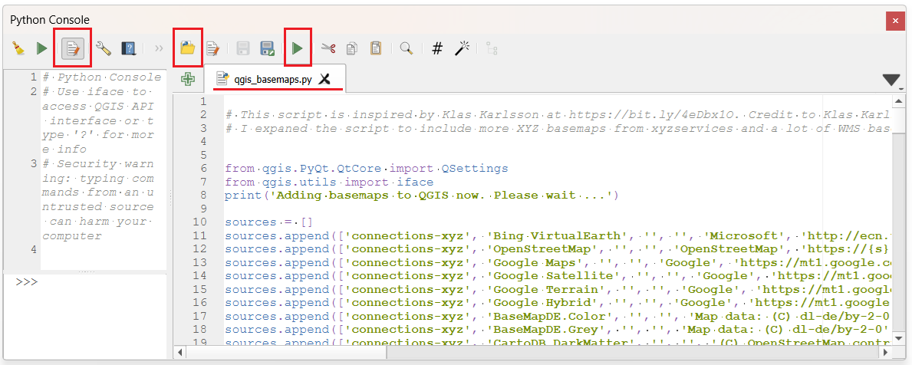
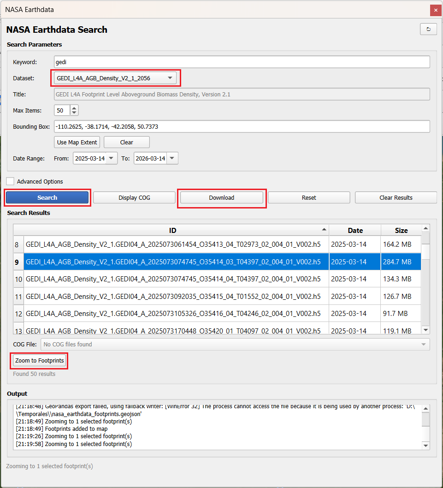

## Resumen del Plugin

El **NASA Earthdata QGIS Plugin** es una herramienta diseñada para buscar, visualizar y descargar productos de NASA Earthdata directamente dentro del entorno de QGIS. Facilita el acceso al catálogo de datos de ciencias de la Tierra de la NASA, soportando la visualización de Cloud Optimized GeoTIFFs (COG) y la visualización de huellas espaciales (footprints).

### Características Principales

* **Búsqueda en el Catálogo:** Explora miles de conjuntos de datos utilizando palabras clave, cajas delimitadoras (bounding boxes) y filtros temporales.
* **Visualización de Footprints:** Muestra las huellas de los resultados de búsqueda directamente en el lienzo del mapa de QGIS.
* **Soporte COG:** Transmite y visualiza archivos Cloud Optimized GeoTIFF directamente sin necesidad de descargarlos.
* **Descarga de Datos:** Descarga gránulos para procesamiento y visualización local.
* **Integración de Credenciales:** Autenticación fluida con las credenciales de NASA Earthdata Login.
* **Panel de Configuración:** Configura credenciales, preferencias de descarga y opciones del plugin.
* **Limitaciones:**
    * Los datos no están estandarizados como en GEE.
    * Algunos datasets se pueden ver en QGIS (principalmente el formato Cloud Optimized Geotiff - COG), otros es necesario descargarlos.
    * Quizás convenga buscar primero su dataset en GEE y en caso de que no se encuentra allí, entonces usar este plugin de los datos de la Nasa en QGIS.

---

## Prerrequisitos

Antes de iniciar la instalación, asegúrate de contar con lo siguiente:

1.  **QGIS:** Versión 3.28 o superior.
2.  **Cuenta de NASA Earthdata:** Es necesario registrarse (de forma gratuita) en [urs.earthdata.nasa.gov](https://urs.earthdata.nasa.gov/).

---

## Enlaces Importantes

* **Página del Plugin en QGIS:** [plugins.qgis.org/plugins/nasa_earthdata](https://plugins.qgis.org/plugins/nasa_earthdata/)
* **Guía de instalación y GitHub:** [github.com/opengeos/qgis-nasa-earthdata-plugin](https://github.com/opengeos/qgis-nasa-earthdata-plugin)
* **Video Tutorial paso a paso:** [youtu.be/H78l-3nbPfk](https://youtu.be/H78l-3nbPfk)
* **Cuenta NASA Earthdata:** [urs.earthdata.nasa.gov](https://urs.earthdata.nasa.gov/)
* **Catálogo NASA Earthdata:** [www.earthdata.nasa.gov/](https://www.earthdata.nasa.gov/)

## Instalación del Entorno

[Video gúia: The Easiest Way to Access 120 Petabytes of NASA Data Inside QGIS](https://youtu.be/H78l-3nbPfk)

Para evitar conflictos con las dependencias de Python de QGIS, se recomienda instalar QGIS y las librerías necesarias utilizando Pixi.

### 1. Instalar QGIS con PIXI

Ver @sec-qgis-gee-pixi.

### 2. Crear un proyecto PIXI

Ver @sec-qgis-gee-pixi.

### 3. Instalar las Dependencias

En @sec-qgis-gee-pixi se instaló un QGIS con las dependencias para el plugin de GEE en QGIS. 

* **Opción A:** Si usa el mismo proyecto PIXI, no debe instalar QGIS ni `geopandas` nuevamente. Desde la carpeta donde creó el proyecto PIXI (ej: `geo`), instala QGIS y los paquetes de Python requeridos (`earthaccess` y `geopandas`):

```bash
pixi add earthaccess
```

* **Opción B:** Si usa un proyecto nuevo de PIXI, debe instalar todos los requerimientos: Desde la carpeta donde creó el proyecto nuevo de PIXI (ej: `geo_nuevo`), instala QGIS y los paquetes de Python requeridos (`earthaccess` y `geopandas`):

```bash
pixi add qgis earthaccess geopandas
```


## Instalación del Plugin en QGIS

Se recomienda instalar el plugin a través del Administrador de Complementos de QGIS:

1.  Abre QGIS utilizando tu entorno PIXI. Desde el PowerShell y estando ubicado en la carpeta del proyecto de PIXI:

```bash
pixi run qgis
```
2.  Ve a **Complementos** > **Administrar e instalar complementos...**
3.  Ve a la pestaña **Configuración**.
4.  Haz clic en **Añadir...** en la sección "Repositorios de complementos".
5.  Asigna un nombre al repositorio, por ejemplo: `OpenGeos`.
6.  Ingresa la URL del repositorio: `https://qgis.gishub.org/plugins.xml`
7.  Haz clic en **Aceptar**.
8.  Ve a la pestaña **Todos**, busca **"NASA Earthdata"**.
9.  Selecciona el plugin en la lista y haz clic en **Instalar complemento**.

---

## Guía de Uso

### Autenticación

Antes de usar el plugin, debes configurar tus credenciales de NASA Earthdata:

1.  Haz clic en **NASA Earthdata** > **Settings** en el menú superior.
2.  Ingresa tu nombre de usuario y contraseña de Earthdata.
3.  Haz clic en **Test Credentials** para verificar.
4.  Haz clic en **Save Settings**.

> **Nota 1:** Alternativamente, puedes configurar las credenciales mediante variables de entorno (`EARTHDATA_USERNAME` y `EARTHDATA_PASSWORD`) o usando un archivo `.netrc` asociado a `urs.earthdata.nasa.gov`. 
> **Nota 2:** La primera vez que se salva la configuracion se crea el archivo `.netrc`
> **Nota 3:** Si el nombre del archivo `.netrc` se torna de color `verde` es una buena señal que la autenticación está lista/completa.

### Actualizar el Plugin

Menú `NASA Earthdata` -> `Check for Updates`. Luego clic en el botón `Check for Updates`. Si aplica, clic en `Download and Install Update`. Después de instalar debe salir un mensaje: `Status: You are running the last version!`

Después de instalar debe **cerrar y abrir** nuevamente QGIS: `pixi run qgis`

### Agregar un Basemap

Ejecute el archivo `./docs/qgis_basemaps.py` en la consola de Python de QGIS.

{width="100%" fig-align="center"}

Luego en el `Browser Panel` (Panel de Búsqueda) cargue un mapa base en la sección `XYZ Tiles`:

{width="30%" fig-align="center"}


### Búsqueda de Datos

1.  Haz clic en el botón **NASA Earthdata Search** en la barra de herramientas.
2.  Filtra los conjuntos de datos por palabra clave (opcional). Ejemplo `HLS` para los datos armonizados de Landsat y Sentinel.
3.  Selecciona un conjunto de datos del menú desplegable (pueden aparecer duplicados).
4.  Establece el *Bounding box* (caja delimitadora) o usa la extensión actual del mapa. Una vez haga acercamiento (*zoom*) a la zona de interés de clic en `Use Map Extent`
5.  Define el rango de fechas.
6.  Puede habilitar `Advanced Options` para filtrar por:
    * Cobertura de nubes.
    * Captura de día o de noche.
    * Proveedor
    * Versión
    * Granule ID
    * Número de Órbita
7.  Haz clic en **Search**.


### Visualización

* **Footprints:** Los resultados de la búsqueda se muestran automáticamente como huellas espaciales en el mapa.
* **Capas COG:** Selecciona los resultados deseados y haz clic en **Display COG** para transmitir la imagen sin descargarla.
* **Datos Descargados:** Tras la descarga, puedes añadir los archivos ráster directamente al mapa.


8. El plugin busca todos los `footprints` del área de interés. Puedes dar clic en la herramienta `Identify Features` (`Ctrl + Shift + I`).
9. En `Search Results` (caja de resultados) verás la lista de datos disponibles. Seleccione el deseado de la lista.
10. Clic `Zoom to Footprints` y remueva cualquier selección realizada en los `footprints` (`Deselect features from all layers` o `Ctrl + Alt + A`).
11. Clic en el botón `Display COG` (Mostrar COG). Note que hay una conexión COG por banda, así que debe seleccionar la banda deseada la lista `COG File`.

Esto no es tan rápido como GEE, porque usa COG para cargar bajo demanda, en cambio GEE usa `XYZ tile` (más rápido y maneja área más grande). Proceda al descargar si está satisfecho con el archivo y la banda seleccionada.


### Descarga de Datos

*  Selecciona los gránulos que deseas descargar desde la tabla de resultados.

12. Clic en `Download` (Descargar). 
13. Seleccione `Yes` (si). Seleccione la carpeta destino. 
14. Espera a que se complete la descarga e intégralos a tu proyecto en QGIS.

> **Nota 4**: Descargará **todas las bandas** del archivo seleccionado a la carpeta seleccionada.
> **Nota 5**: Si no selecciona nada de la lista (punto 8), el sistema descargará todos los archivos listados en la ventana `Search Results`.

15. Presione el botón `Reset` (Resetear) para volver a empezar

---

## Descargar GEDI

GEDI (Global Ecosystem Dynamics Investigation): Instalado en la Estación Espacial Internacional (ISS), registra datos entre las latitudes 51.6° N y 51.6° S, abarcando la totalidad del territorio colombiano. Ofrece productos desde el nivel L1B (formas de onda geolocalizadas) hasta los niveles L4A y L4B (estimaciones de biomasa aérea e índices de estructura forestal).

{width="100%" fig-align="center"}


## Conjuntos de Datos Soportados

El plugin proporciona acceso a miles de conjuntos de datos de la NASA, incluyendo:

* **GEDI:** Investigación de la dinámica de los ecosistemas globales (estructura forestal, biomasa).
* **MODIS:** Espectrorradiómetro de imágenes de resolución moderada.
* **Landsat:** Imágenes de Landsat 8 y 9.
* **VIIRS:** Conjunto de radiómetros de imágenes infrarrojas visibles.
* **SMAP:** Humedad del suelo activa pasiva.
* **ICESat-2:** Satélite de elevación de hielo, nubes y tierra.
* **OPERA:** Productos observacionales para usuarios finales a partir de análisis de teledetección.
* *Y muchos más...*

---

## Solución de Problemas (Troubleshooting)

Si el plugin no se carga debido a paquetes faltantes, asegúrate de instalar las dependencias en el entorno correcto:

**Usando pip en tu entorno activo:**
```bash
pip install earthaccess geopandas
```

**O usando el entorno de Python específico de QGIS (ej. en Linux):**
```bash
~/.local/share/QGIS/QGIS3/profiles/default/python/plugins/nasa_earthdata/
python3 -m pip install earthaccess geopandas
```

---

