---
format:
  html:
    embed-resources: true
    code-fold: false
    math: false
    minimal: false
execute:
  freeze: auto
---

# Fundamentos de modelos digitales de elevación y elaboración cartográfica

## Requerimientos

Lista de software y recursos requeridos para esta sección:

* ArcGIS Pro (opcional) [@price2020arcgis]. Ver @sec-arcgis-pro-gee.
* Caja de herramientas de GEE en ArcGIS Pro (opcional) [@tanh2025gee]. Ver @sec-arcgis-pro-gee.
* QGIS [@wu2025qgisgeedata]. Ver @sec-qgis-gee-pixi.
* Plugin de GEE en QGIS e Importador de segmentos GPX. Ver @sec-qgis-gee-pixi.
* Contenedor (Docker) clase de geomática (Python y sus librerías). Ver @sec-guia_A.
* VSCode + Quarto + TinyTex + Extensiones. Ver apéndices de la [guía del curso](https://github.com/alexyshr/GeomaticaGeneral2026).
* Registro de usuario en Google Earth Engine (GEE).
* Consola Javascript GEE.
* Google Earth Pro (Escritorio).

## Inicialización del entorno (Python)

Autenticación e inicialización de la sesión de GEE interactuando con el proyecto de Google Cloud.

::: {.panel-tabset}

### Python

::: {.content-visible when-format="html"}
::: {.callout-tip collapse="true" icon="false"}
#### ▷ CÓDIGO PURO (Copiar y Pegar)

```{python}
#| label: python_init_codigo
#| eval: false

# 1. IMPORTACIÓN DE LIBRERÍAS
# 'ee' es la librería principal de Google Earth Engine.
# 'folium' nos permite crear mapas interactivos en Python compatibles con Quarto.
# 'IPython.display' se usa para incrustar resultados en el documento final.
import ee
import folium
from IPython.display import display, IFrame

# 2. AUTENTICACIÓN
# Este comando abre una ventana en el navegador para dar permisos a Google.
# Solo es necesario correrlo la primera vez o si el token de acceso expira.
ee.Authenticate()

# 3. INICIALIZACIÓN DEL PROYECTO
# Debemos especificar el ID del proyecto que creamos en Google Cloud.
# Para este curso usamos el proyecto: "ee-giswqg"
ee.Initialize(project="ee-giswqg")

print("Google Earth Engine se ha inicializado con éxito!")
```

:::
:::

```{python}
#| label: python_init
#| message: false
#| warning: false
#| echo: false
#| eval: false
#| results: asis

# 1. IMPORTACIÓN DE LIBRERÍAS
import ee
import folium
from IPython.display import display, IFrame

# 2. AUTENTICACIÓN
ee.Authenticate()

# 3. INICIALIZACIÓN DEL PROYECTO
ee.Initialize(project="ee-giswqg")

print("Google Earth Engine se ha inicializado con éxito!")
```

### Javascript

```{.javascript #js_init}
// 1. INICIALIZACIÓN EN JAVASCRIPT
// A diferencia de Python, en el Code Editor de GEE no necesitas importar librerías.
// La autenticación es automática siempre que hayas iniciado sesión en tu cuenta.

// Solo asegúrate de que en la parte superior derecha de tu Code Editor
// esté seleccionado el proyecto: ee-giswqg
print("Google Earth Engine está listo para trabajar en JavaScript.");
```

:::

## Generación de modelos digitales de elevación (MDE) mediante interpolación

La creación y personalización cartográfica son componentes estructurales del análisis espacial. Este procedimiento detalla la extracción de puntos de elevación desde Google Earth sobre un área de estudio en Colombia (ej. Sabana de Bogotá) para la interpolación de un Modelo Digital de Elevación (MDE) en QGIS, proyectado al sistema MAGNA-SIRGAS Origen Nacional (EPSG:9377).

### Captura de datos altimétricos en Google Earth

Digitalice un shapefile de polígonos en un área de interés en colombia que tenga zona montañosa.

* Abra QQIS
* Cargue el mapa base  (ej: `Esri.WorldImagery`): `Browser Panel` -> `XYZ Tiles` -> `Esri.WorldImagery`. Asegúrece que las coordenadas del mapa son `EPSG:4326`
* Cree un nuevo Shapefile: `Layer`-> `Create Layer` -> `New Shapefile layer`. Utilice cualquier nombre (ej: `limite_sabana_bogota.shp`).
* Agregue un campo `nombre` tipo `text` de 80 caracteres y agregue el shapefile al mapa
* Utilice la barra de herramientas de digitalización (`Digitizing Toolbar`)
    * Inicie la edición (`Toogle Editing`) 
    * Agregue un polígono al shapefile (asegúrece de incluir zona de montaña) con la herramienta `Add Polygon Feature`
    * De click izquierdo (`Left Clck`) en los puntos deseados y para finalizar presione click derecho (`Right Click`)
    * En el menú contextual que aparece, rellene el campo `nombre` con **Zona de Interés"
    * Guarde los cambios (`Save Layer Edits`)

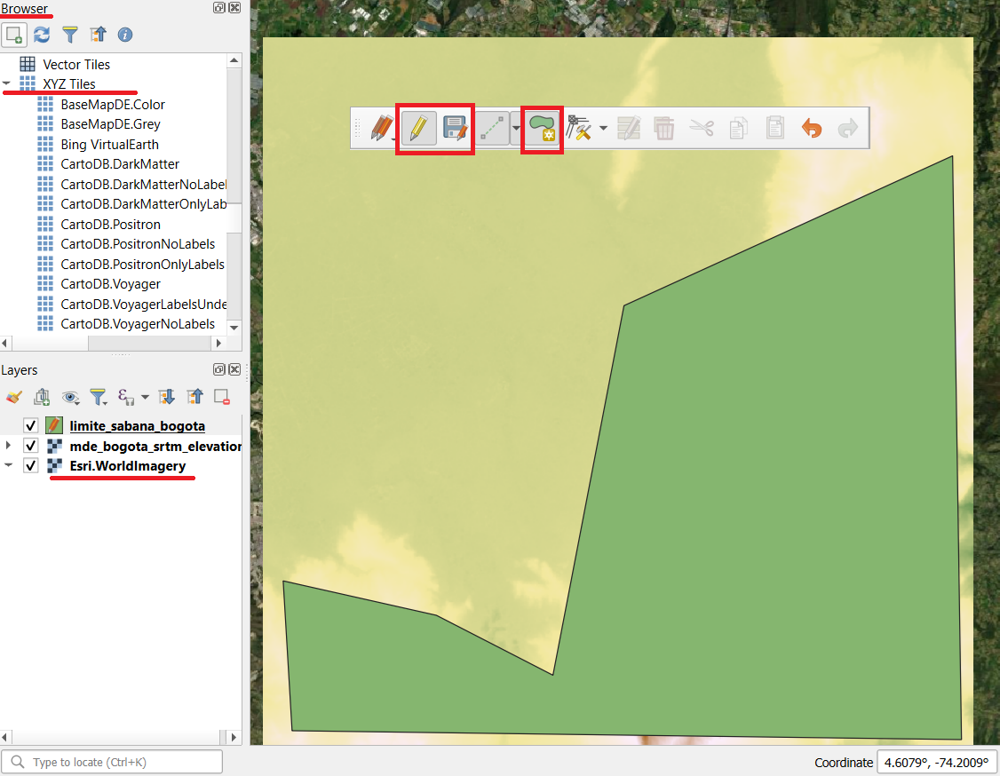{#fig-crear_shapefile fig-align="center" width="80%"}


En `File` -> `Import` (tipo de archivo `ESRI Shape *.shp`) de Google Earth , se carga el Shapefile de entrada correspondiente al límite geográfico del área de estudio (ej: `limite_sabana_bogota.shp`). A partir de este límite, se generan rutas transversales para la captura de coordenadas tridimensionales (X, Y, Z).

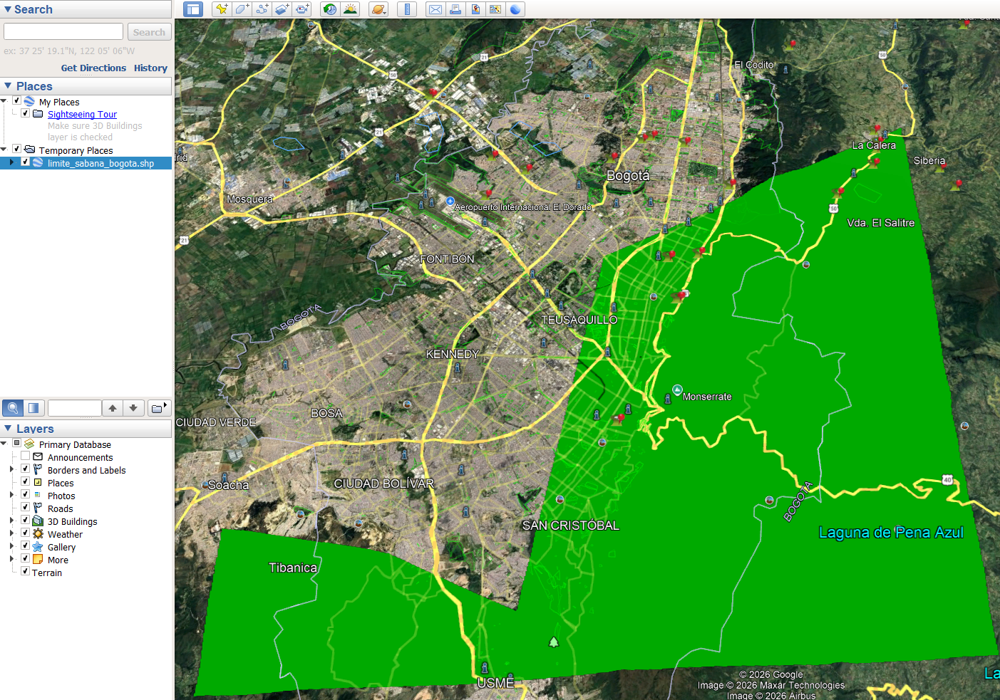{#fig-ge-set-points fig-align="center" width="80%"}

Se agrega una nueva ruta o trayecto sobre la capa límite, trazando recorridos sistemáticos para asegurar una cobertura homogénea del área de estudio:

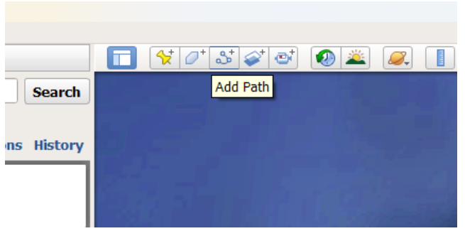{#fig-ge-add-path fig-align="center" width="50%"}

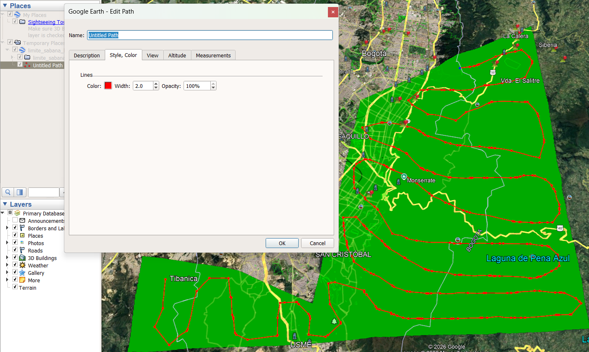{#fig-ge-new-path fig-align="center" width="95%"}

La ruta generada se almacena en el sistema local. Se define la nomenclatura del archivo (ej. `puntos_elevacion_bogota`) y se exporta estrictamente bajo la extensión *.kml*.

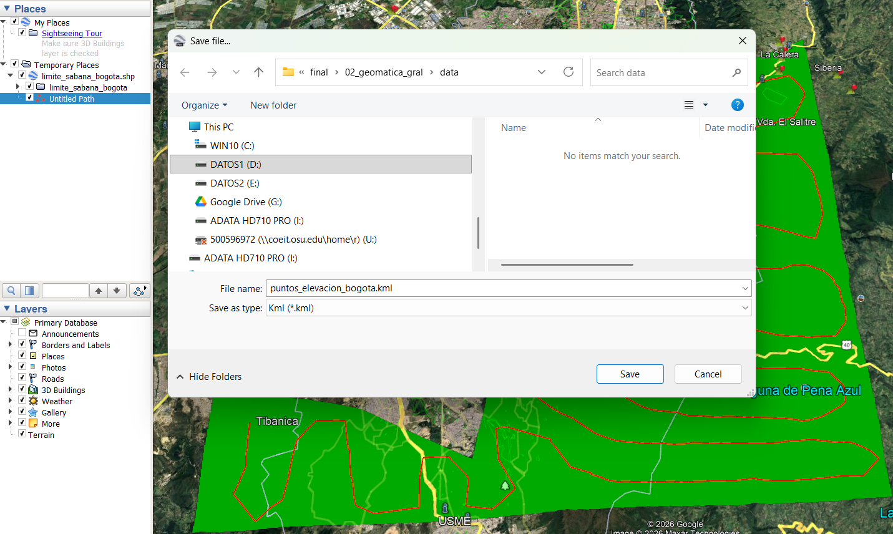{#fig-ge-save-place fig-align="center" width="95%"}

### Conversión de formatos y asignación de elevación

Los archivos KML nativos de rutas en Google Earth carecen de valores densificados de elevación. Se emplea un servicio de geoprocesamiento web para inyectar la variable Z basada en bases de datos topográficas globales (SRTM) y realizar la conversión a formato GPX (GPS Exchange Format). Se utiliza la herramienta web de perfil de elevación de [GPS Visualizer](https://www.gpsvisualizer.com/elevation).

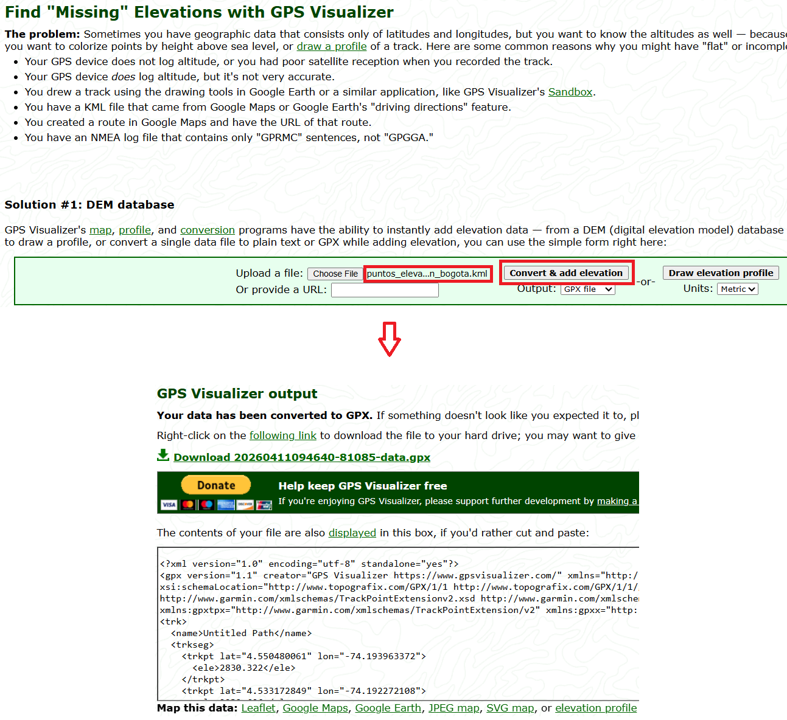{#fig-convert fig-align="center" width="90%"}

### Importación y geoprocesamiento en QGIS

El archivo GPX resultante se integra en el entorno QGIS. Se requiere la activación del complemento *GPX Segment Importer* disponible en el repositorio oficial.

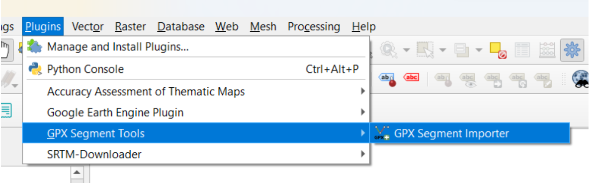{#fig-gpx-segmenter fig-align="center" width="80%"}

Se ejecuta la importación del archivo vectorial GPX hacia el lienzo de mapas.

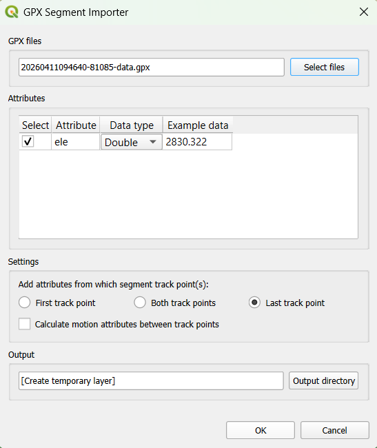{#fig-gpx-segmenter-importer fig-align="center" width="80%"}

El archivo vectorial tipo línea debe transformarse en puntos independientes discretos para habilitar la interpolación espacial. Se ejecuta el algoritmo *Extraer vértices* desde la caja de herramientas de procesos. El vector de salida se define como `puntos_elevacion_bogota.shp`.

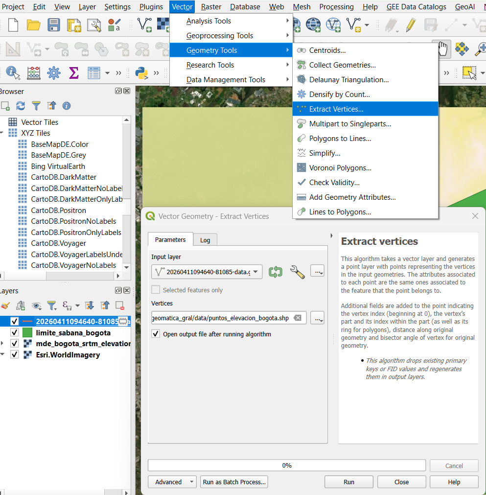{#fig-extract-vertices fig-align="center" width="100%"}


El producto resultante es un shapefile de puntos tridimensionales. La revisión de la tabla de atributos valida la existencia del campo `ele` (elevación en metros sobre el nivel del mar), variable predictora para la interpolación del MDE.

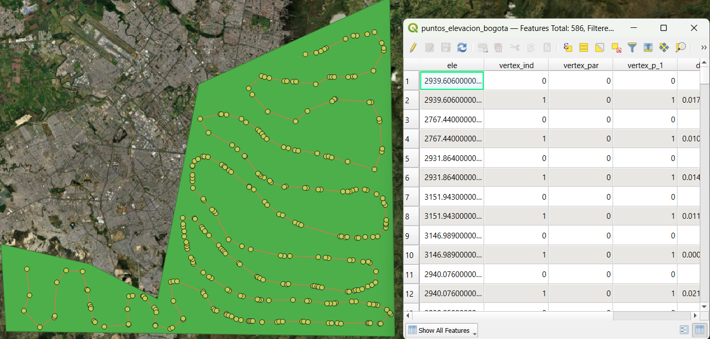{#fig-attribute-table fig-align="center" width="90%"}

### Preproyección de la capa de puntos a 9377

Antes de realizar cualquier interpolación hacemos la reproyección del archivo vectorial de puntos de `ESPG:4323` a `EPSG:9377`.

Desde la Caja de Herramientas (`Processing Toolbox`) de QGIS, en la sección `Vector General`, utilice la herramienta `Reproject layer` para crear el archivo `puntos_elevacion_bogota_9377.shp`.

{#fig-reproject_layer fig-align="center" width="80%"}

Repita el proceso para reproyectar y generar el archivo `limite_sabana_bogota_9377.shp`.

> Sugerencia: Cambie las coordenadas del mapa (en la esquina inferior derecha de QGIS) a `EPSG:9377`
> Alternativamente: Inicie un nuevo mapa y cargue `puntos_elevacion_bogota_9377.shp` y `limite_sabana_bogota_9377.shp`

### Interpolación espacial y generación del MDE

Se aplica el método determinístico Ponderación Inversa a la Distancia (IDW) para estimar los valores continuos de altitud. Se ubica el algoritmo IDW en la caja de herramientas de procesamiento de QGIS.

La formulación matemática que rige este interpolador espacial se define mediante la siguiente ecuación:

$$Z(x) = \frac{\sum_{i=1}^{n} \frac{Z_i}{d_i^p}}{\sum_{i=1}^{n} \frac{1}{d_i^p}}$$

Donde $Z(x)$ representa el valor estimado en el punto no muestreado, $Z_i$ es el valor de elevación en el punto de control $i$, $d_i$ es la distancia euclidiana entre el punto de control y la ubicación a estimar, y $p$ es el parámetro de potencia o coeficiente de distancia (generalmente configurado en 2).

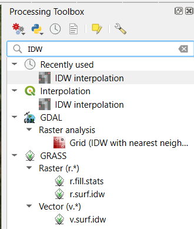{#fig-idw fig-align="center" width="40%"}

Se configura el shapefile de vértices como capa de entrada y se selecciona el atributo de elevación (`ele`) como campo de valor de interpolación. Debe dar clic en el la cruz verde para agregar los datos para interpolación, seleccionar la extensión de la interpolación a partir de la capa `limite_sabana_bogota_9377.shp` y definir **30** metros como tamaño de celda de salida (unidades de la capa de entrada).

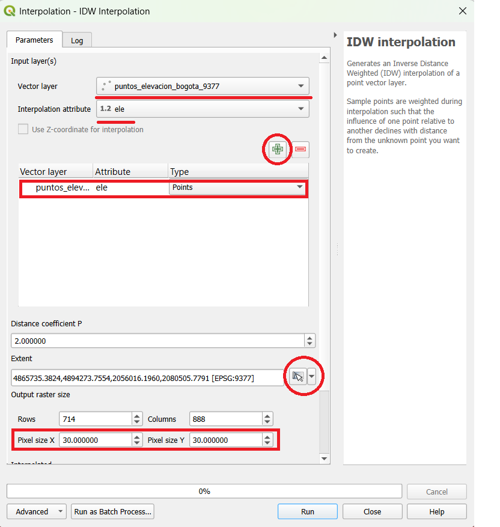{#fig-idw-tool fig-align="center" width="90%"}

Se añade la capa pulsando el icono correspondiente. La extensión espacial de salida se sincroniza con los límites geográficos del archivo `limite_sabana_bogota_9377.shp`. El formato de salida se estipula como un archivo raster GeoTIFF (`mde_idw_sabana_bogota_9377.tif`).

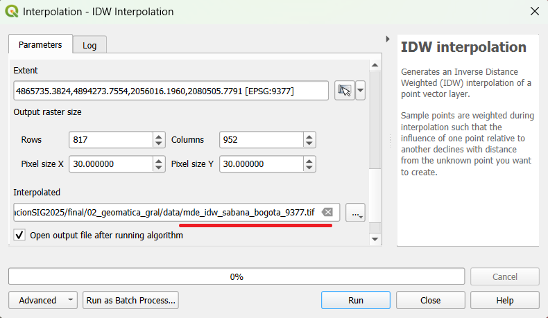{#fig-idw-tool-inputs fig-align="center" width="90%"}

El raster resultante se presenta por defecto en una escala de grises. Se requiere la alteración de las propiedades radiométricas visuales para interpretación topográfica.


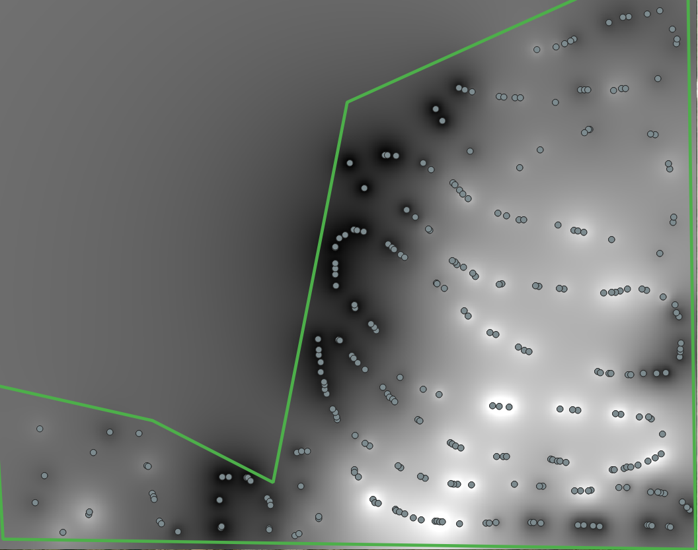{#fig-dem fig-align="center" width="80%"}

En las propiedades de la capa (Simbología), se selecciona el tipo de renderizador *Pseudocolor monobanda*. Se asigna una nueva rampa de color continua.

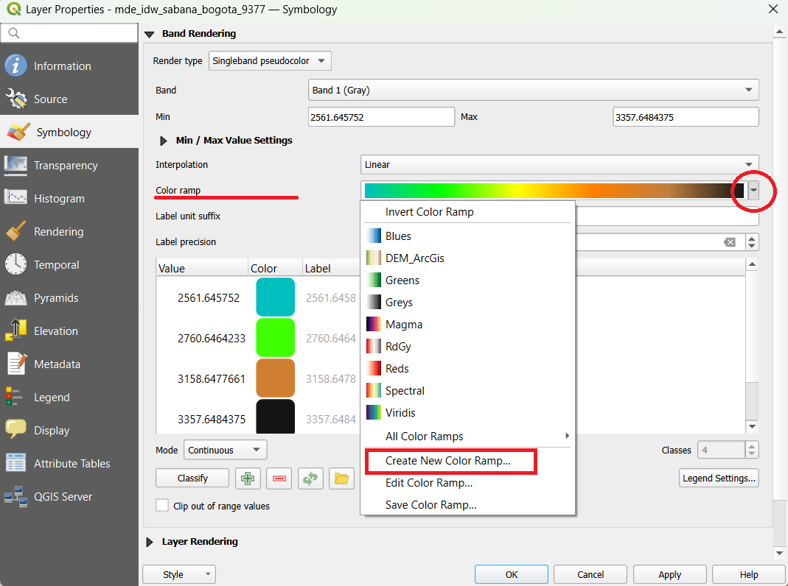{#fig-dem-pseudo-colors fig-align="center" width="80%"}

Se escoge el catálogo *Topography* y se aplica la paleta estándar de elevación (`Elevation`) (escala hipsométrica).

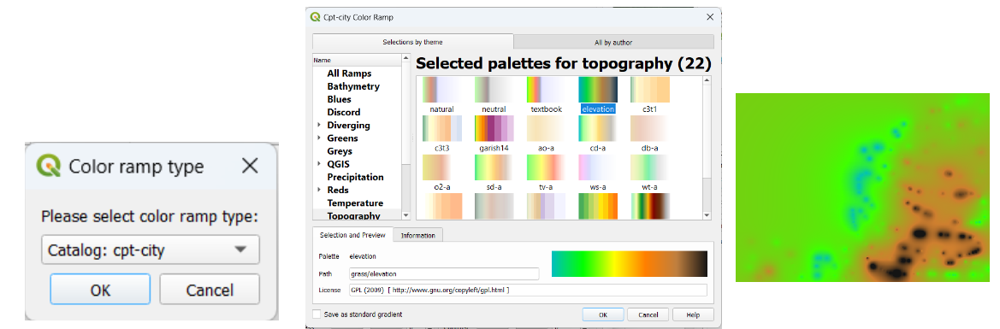{#fig-dem-pseudo-colors-palette fig-align="center" width="100%"}


La **escala hipsométrica** es una técnica de representación cartográfica que asocia secuencias de color a rangos altitudinales específicos. Permite la interpretación visual del relieve mediante la simulación de pisos térmicos, asignando convencionalmente tonos verdes a las zonas de baja elevación (e.g., valles interandinos, llanuras orientales) y transiciones hacia colores marrones, grises o blancos para las altas cumbres y páramos colombianos.


### Elaboración cartográfica

La consolidación formal de la salida gráfica exige la composición de metadatos visuales. Se accede a la herramienta *Nuevo diseño de impresión* desde el menú de proyecto.

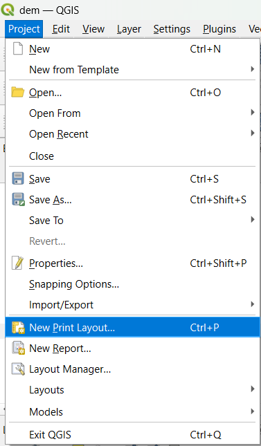{#fig-print-layout fig-align="center" width="40%"}

Se integra el marco de datos espaciales mediante la función *Añadir mapa*, delimitando su extensión en el lienzo.

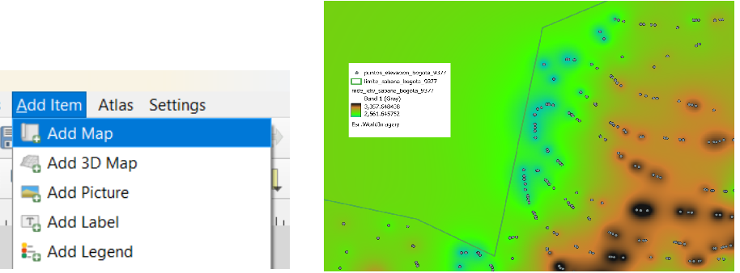{#fig-add-map fig-align="center" width="100%"}

Se incorporan los elementos constitutivos del lenguaje cartográfico: título referenciado a Colombia, grilla de coordenadas MAGNA-SIRGAS, barra de escala métrica, flecha de norte y leyenda hipsométrica.

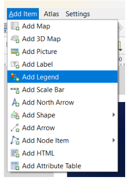{#fig-add-legend fig-align="center" width="40%"}

El layout finalizado se exporta en un formato de imagen de compresión sin pérdida espacial (e.g., PNG, PDF) para su presentación analítica.

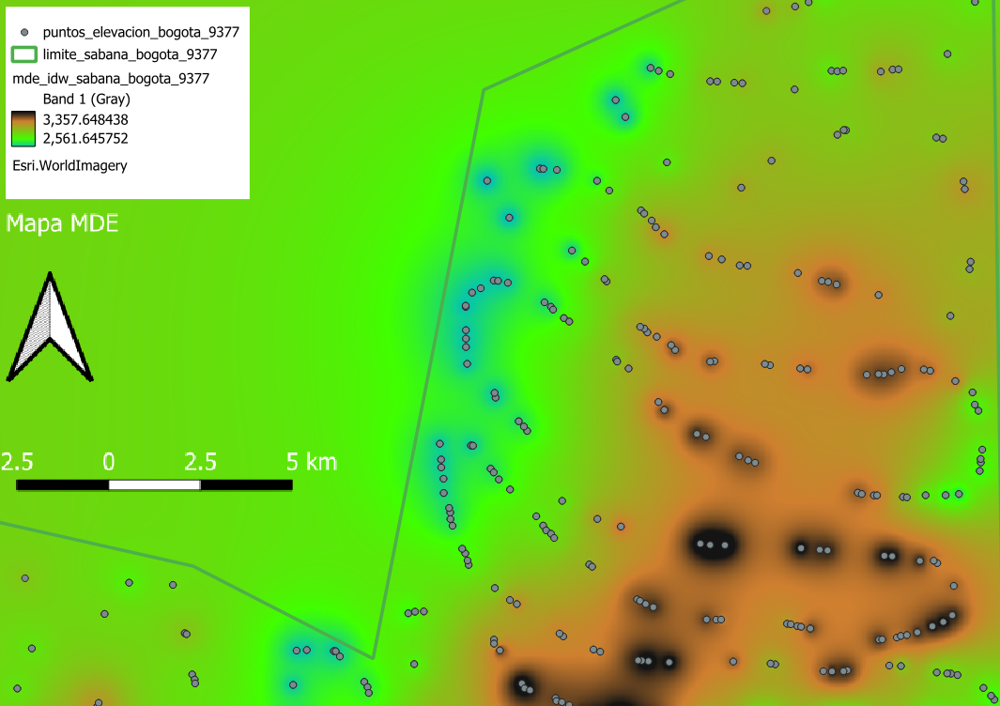{#fig-final-map fig-align="center" width="80%"}

### Modelo de sombras (Hillshade)

Utilizando el MDE `mde_idw_sabana_bogota_9377.tif` generado previamente, calcule un mapa de relieve sombreado (Hillshade) para resaltar las características morfológicas del terreno y ensamble un nuevo layout de impresión superponiendo el MDE semitransparente sobre el modelo de sombras.

*Instrucción:* Emplear el algoritmo *Mapa de sombras* ubicado en la ruta *Ráster -> Análisis -> Mapa de sombras*. Utilice los parámetros Azimuth de la Luz (`Azimuth of the light`) igual a **315** y Altitud de la luz (`Altitude of the light`) **45**.

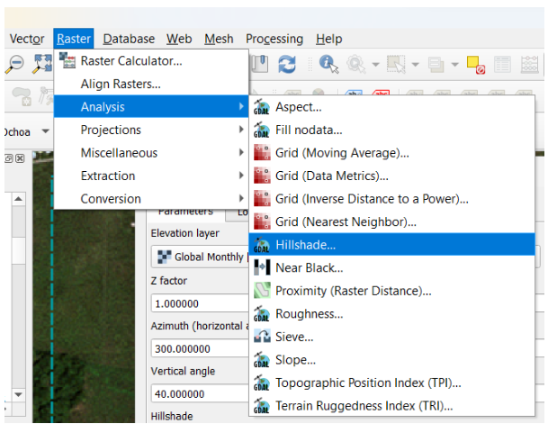{#fig-hillshade fig-align="center" width="80%"}

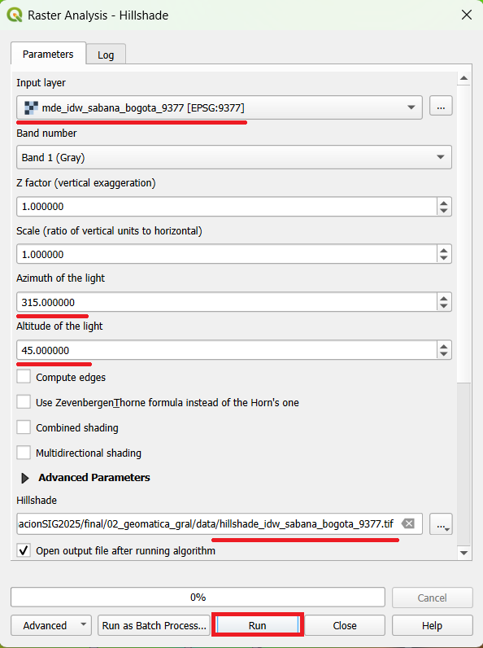{#fig-parametros_hillshade fig-align="center" width="80%"}

### Análisis de artefactos de interpolación

La inspección visual del MDE generado mediante el algoritmo IDW revela inconsistencias topográficas severas, caracterizadas por la formación de patrones circulares concéntricos alrededor de los puntos de muestreo. Este fenómeno, técnicamente denominado "efecto ojo de buey" (bull's-eye effect), invalida el modelo hidrológico y morfológico de la superficie.

Los factores que originan estos artefactos radican en la interacción geométrica entre el diseño muestral y la configuración algorítmica:

* **Muestreo espacial sesgado:** La captura de puntos topográficos se concentró de manera exclusiva en el sector montañoso oriental (Cerros Orientales y macizo de Monserrate), omitiendo por completo la planicie correspondiente a la Sabana de Bogotá. Al no existir puntos de control en la zona occidental y central del polígono, el algoritmo alcanza su límite de búsqueda, resultando en áreas planas (valores constantes) sin gradiente altitudinal representativo.
* **Limitaciones del algoritmo IDW:** Este método es un interpolador local y exacto que asume una disminución drástica de la influencia topográfica en función de la distancia. Con un parámetro de potencia ($p=2$), la ponderación espacial decae rápidamente. Esto impide la generación de una superficie continua entre los transectos capturados, forzando la creación de picos locales artificiales sobre cada coordenada capturada.

Para la construcción de un MDE riguroso, es necesario replantear el diseño muestral en la fase de captura, asegurando la distribución homogénea de puntos tanto en la montaña como en la planicie. No obstante, para efectos de procesamiento continuo con el set de datos actual, se requiere la implementación de un algoritmo con mayor robustez frente a distribuciones irregulares.

### Optimización del MDE mediante herramientas de SAGA

Como alternativa metodológica para la corrección del modelo manteniendo el conjunto de datos original (`puntos_elevacion_bogota_9377.shp` y `limite_sabana_bogota_9377.shp`), se implementa el algoritmo Multilevel B-Splines. Esta técnica spline minimiza la varianza local de la superficie, resultando idónea para interpolar datos altimétricos distribuidos en transectos o perfiles aislados.

Se ejecuta el siguiente procedimiento operativo desde la caja de herramientas de procesamiento (`Processing Toolbox`):

* Cargar a SAGA los archivos vectoriales `puntos_elevacion_bogota_9377.shp` y `limite_sabana_bogota_9377.shp`

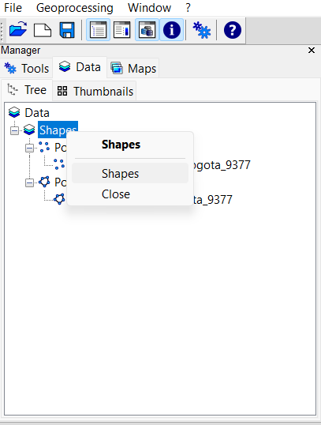{#fig-carga_shapefiles fig-align="center" width="40%"}

* Navegar al directorio de algoritmos: `SAGA` -> `Grid` -> `Spline Interpolation` -> `Multilevel b-spline`.

{#fig-herramienta_bspline fig-align="center" width="40%"}

{#fig-herramienta_bspline fig-align="center" width="40%"}

* En el parámetro `Shapes`, seleccionar la capa vectorial de entrada `puntos_elevacion_bogota_9377`.

* En `Attribute`, definir el campo de elevación `ele`.
* En la sección `Target Grid System`, seleccionar la opción `user defined`.
* Definir el tamaño de celda (`Cellsize`) en **30** metros para igualar la resolución espacial del ejercicio anterior.
* La extesión del raster interpolado se calcula por defecto a partir del dato de entrada, pero puede modificarse con los parámetros:
    * West
    * East
    * South
    * North
* En el parámetro `Fit`, establecer a `nodes`

::: {.callout-note}
## Parámetro *Fit*

El parámetro **Fit** define cómo se ajusta la interpolación a los datos de entrada en la herramienta *Multilevel B-Spline*.

- **nodes**: ajusta la superficie a los nodos de la malla interna del modelo.
- **cells**: ajusta directamente a las celdas del raster de salida.

## Uso de *nodes* para generar DEM

La opción **nodes** es la más recomendada para la generación de Modelos Digitales de Elevación (DEM) porque:

- Produce superficies más **suaves y continuas**.
- Reduce el **ruido y artefactos locales**.
- Representa mejor la **variación natural del terreno**.

En general, se prefiere *nodes* cuando se trabaja con datos topográficos y se busca un resultado más realista.
:::

* Ejecutar el proceso y exportar el producto final como `mde_bspline_sabana_bogota_9377.tif`.

{#fig-exportar_geotif fig-align="center" width="90%"}


El ráster generado mediante B-Splines presentará una transición altitudinal suavizada, eliminando los gradientes artificiales del IDW y extrapolando de manera matemática las tendencias del relieve hacia las áreas con vacíos de información en la Sabana.

### Reto práctico QGIS. Modelo de sombras (Hillshade) con la imagen proveniente de B-Splines

Repita el proceso de generación de modelo de sombras (Hillshade) a partir del MDE `mde_bspline_sabana_bogota_9377.tif`.

*Instrucción:* Emplear el algoritmo *Mapa de sombras* ubicado en la ruta *Ráster -> Análisis -> Mapa de sombras*. Utilice los parámetros Azimuth de la Luz (`Azimuth of the light`) igual a **315** y Altitud de la luz (`Altitude of the light`) **45**.

Genere el archivo de salida `hillshade_bspline_sabana_bogota_9377.tif`.

{#fig-exportar_geotif fig-align="center" width="50%"}

### Use la capa de sombras para mejorar la elaboración cartográfica

Utilice el MDE de SAGA y su correspondiente capa de sombras para mejorar la salida cartográfica en QGIS. Localice la capa del MDE (con 40% de transparencia) encima de la capa del modelo de sombras.

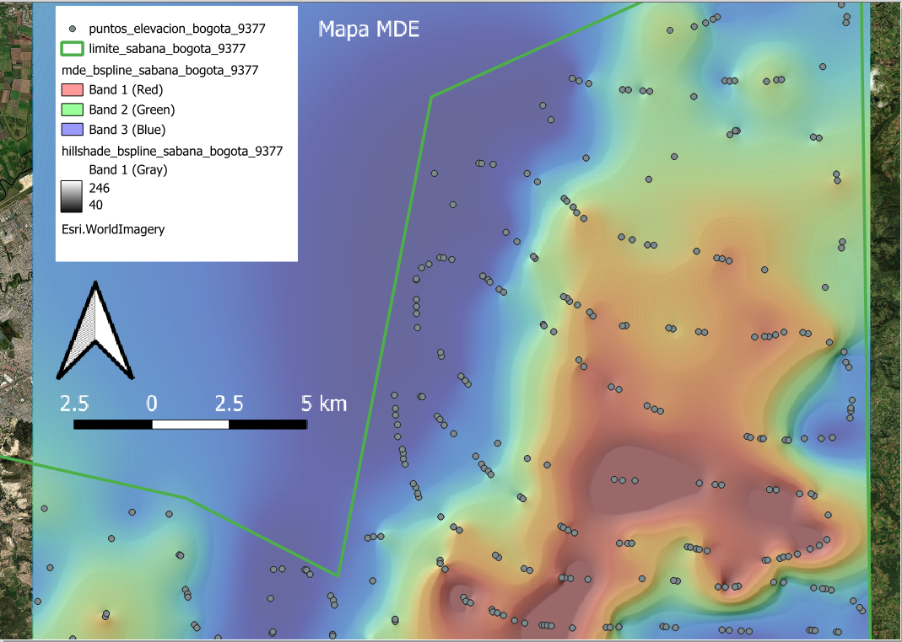{#fig-exportar_geotif fig-align="center" width="70%"}

## Exportación de MDE SRTM desde GEE y generación de capa de sombras, pendiente y aspecto.

```{python}
#| label: python_srtm_nativa_puro
#| eval: false

# -------------------------------
# 1. IMPORTACIÓN DE LIBRERÍAS
# -------------------------------
import ee
import os
import urllib.request  # Librería nativa de Python para descargar URLs
import zipfile         # Librería nativa de Python para descomprimir

# -------------------------------
# 2. CARGA DEL MDE Y ÁREA DE DESCARGA
# -------------------------------
srtm = ee.Image("USGS/SRTMGL1_003")

# Definimos el punto y el área de interés (Bounding Box de ~30x30 km)
unal_punto = ee.Geometry.Point([-74.084, 4.638])
roi_bogota = unal_punto.buffer(15000).bounds()

# -------------------------------
# 3. CONFIGURACIÓN DE RUTAS LOCALES
# -------------------------------
directorio_salida = "data_heavy/raster"
os.makedirs(directorio_salida, exist_ok=True)

# Archivo temporal donde caerá el ZIP que nos envía Google
ruta_zip = os.path.join(directorio_salida, "mde_bogota_temp.zip")

# -------------------------------
# 4. PETICIÓN NATIVA A EARTH ENGINE (SIN DEPENDENCIAS EXTRA)
# -------------------------------
print("Solicitando el enlace de descarga a los servidores de Google...")

# getDownloadURL() es el método nativo de la API de EE.
# Empaqueta nuestro recorte a 30m en un archivo comprimido.
url_descarga = srtm.getDownloadURL({
    'name': 'mde_bogota_srtm', # Nombre interno del archivo .tif
    'scale': 30,               # Resolución espacial original (30m)
    'crs': 'EPSG:4326',        # Coordenadas geográficas WGS84
    'region': roi_bogota       # Filtro espacial obligatorio
})

print(f"Enlace generado. Iniciando descarga...")

# -------------------------------
# 5. DESCARGA Y EXTRACCIÓN AUTOMÁTICA
# -------------------------------
# Descargamos el archivo ZIP desde la URL generada
urllib.request.urlretrieve(url_descarga, ruta_zip)

print("Descarga finalizada. Descomprimiendo el archivo GeoTIFF...")

with zipfile.ZipFile(ruta_zip, 'r') as zip_ref:
    # Obtenemos el nombre del archivo que Google metió en el ZIP
    # Probablemente: "mde_bogota_srtm.elevation.tif"
    nombre_original_ee = zip_ref.namelist()[0]
    
    # Extraemos el contenido
    zip_ref.extractall(directorio_salida)

# Definimos las rutas para el renombrado
ruta_antigua = os.path.join(directorio_salida, nombre_original_ee)
ruta_nueva = os.path.join(directorio_salida, "mde_bogota_srtm_elevation.tif")

# Ejecutamos el cambio de nombre en el sistema de archivos
if os.path.exists(ruta_antigua):
    os.rename(ruta_antigua, ruta_nueva)

# Limpieza del disco: borramos el ZIP porque ya tenemos el .tif
os.remove(ruta_zip)

print(f"\nPROCESO COMPLETADO CON ÉXITO")
print(f"El MDE de Bogotá ha sido renombrado a: {ruta_nueva}")
```

Al utilizar el método `getDownloadURL` de Google Earth Engine, el servidor genera de forma automática un nombre de archivo que concatena el prefijo definido en el parámetro `name` con el nombre técnico de la banda del producto (en el caso del SRTM, la banda única es `elevation`). Este proceso produce un archivo con una nomenclatura de doble punto (ej. `mde_bogota_srtm.elevation.tif`).

Desde una perspectiva de arquitectura de software y gestión de datos, los nombres de archivos con múltiples puntos pueden inducir a errores en la interpretación de extensiones por parte de ciertos sistemas operativos o librerías de lectura ráster que esperan una extensión estándar única. Para garantizar la interoperabilidad del flujo de trabajo y la compatibilidad con herramientas de geoprocesamiento posteriores, se implementa una rutina de renombrado físico inmediatamente después de la descompresión, transformando el nombre a `mde_bogota_srtm_elevation.tif`.

Transformación de coordenadas a 9377 y generación de mapa de pendientes y de sombras.

```{python}
#| label: python_derivados_mde_codigo
# #| eval: false

from osgeo import gdal
import rasterio
from rasterio.plot import show
import matplotlib.pyplot as plt

# -------------------------------------------------------------------------
# 1. CONFIGURACIÓN DE RUTAS Y REPROYECCIÓN (EPSG:9377)
# -------------------------------------------------------------------------
# Definimos los archivos de entrada y salida
ruta_mde_4326 = "data_heavy/raster/mde_bogota_srtm_elevation.tif"
ruta_mde_9377 = "data_heavy/raster/mde_bogota_9377_py.tif"

# gdal.Warp realiza la reproyección al sistema Origen Nacional de Colombia.
# Se captura el objeto 'ds_warp' para asegurar su cierre posterior.
ds_warp = gdal.Warp(ruta_mde_9377, ruta_mde_4326, dstSRS="EPSG:9377")

# CRÍTICO PARA QUARTO/RETICULATE:
# Se iguala a None para cerrar el puntero de C++, forzar la escritura a disco
# y liberar el archivo para que otros procesos (como DEMProcessing) puedan abrirlo.
ds_warp = None

# -------------------------------------------------------------------------
# 2. CÁLCULO DE PRODUCTOS TOPOGRÁFICOS (PENDIENTE, ORIENTACIÓN Y SOMBREADO)
# -------------------------------------------------------------------------
ruta_pendiente = "data_heavy/raster/mde_bogota_slope_py.tif"
ruta_orientacion = "data_heavy/raster/mde_bogota_aspect_py.tif"
ruta_sombreado = "data_heavy/raster/mde_bogota_hillshade_py.tif"

# Pendiente (Slope): Calculada sobre el ráster proyectado en metros.
ds_slope = gdal.DEMProcessing(ruta_pendiente, ruta_mde_9377, "slope")
ds_slope = None # Liberar memoria y cerrar archivo

# Orientación (Aspect): Determina la dirección cardinal de las laderas.
ds_aspect = gdal.DEMProcessing(ruta_orientacion, ruta_mde_9377, "aspect")
ds_aspect = None # Liberar memoria y cerrar archivo

# Sombreado (Hillshade): Modelo de iluminación con Azimut 315° y Altitud 45°.
ds_hill = gdal.DEMProcessing(ruta_sombreado, ruta_mde_9377, "hillshade", azimuth=315, altitude=45)
ds_hill = None # Liberar memoria y cerrar archivo

# -------------------------------------------------------------------------
# 3. RENDERIZADO VISUAL CARTOGRÁFICO
# -------------------------------------------------------------------------
# Al usar el gestor de contexto 'with', aseguramos el cierre automático de los archivos.
with rasterio.open(ruta_mde_9377) as mde_src, rasterio.open(ruta_sombreado) as hill_src:
    fig, ax = plt.subplots(figsize=(10, 10))

    # 1. Capa base: Modelo de sombras en escala de grises.
    show(hill_src, ax=ax, cmap='Greys_r')

    # 2. Capa superior: Elevación (MDE) con paleta 'terrain' y transparencia del 40%.
    # Esto permite visualizar la topografía sobre el relieve sombreado.
    show(mde_src, ax=ax, cmap='terrain', alpha=0.4)

    # Configuración de estética del mapa
    ax.set_title("Relieve sombreado y elevación - Bogotá (Python/GDAL)")
    ax.set_axis_off() 
    plt.show()
```


## Entregables y criterios de evaluación

La evaluación exige la estructuración de componentes teóricos y prácticos documentados bajo el paradigma de reproducibilidad técnica. 

Documentos requeridos:

* **Documento analítico (Quarto):** Redactar el reporte en un archivo de formato Quarto (`.qmd`) y renderizar la salida en formatos HTML y PDF. El documento debe contener el desarrollo secuencial de los ejercicios prácticos y la argumentación técnica de las siguientes premisas:

    * **Análisis de algoritmos de interpolación:** Evaluación del comportamiento del algoritmo IDW respecto a la variabilidad topográfica de la geografía Andina Colombiana.
    * **Algoritmos alternativos para interpolación:** Propuesta y evaluación de otros algoritmos de interpolación aplicables para MDE

* **Repositorio de control de versiones:** Proveer el hipervínculo de acceso directo al repositorio para la revisión de los productos finales.
