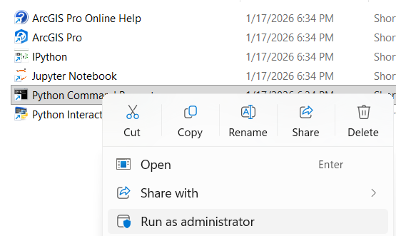

---
format:
  html:
    embed-resources: true
    code-fold: false
    math: true
    minimal: false
execute:
  freeze: auto
---

# Procesamiento hidrológico y morfométrico de modelos digitales de elevación

El Modelo Digital de Elevación (MDE) constituye el insumo primario para la derivación de variables topográficas y la simulación de procesos hidrológicos en cuencas andinas colombianas. La consistencia topológica del modelo condiciona la precisión de los análisis de susceptibilidad, erosión y transporte de flujo superficial. Los siguientes apartados detallan los geoprocesos estandarizados requeridos para el acondicionamiento topográfico y el cálculo de parámetros morfométricos, aplicados sobre un área de estudio en Útica (Cundinamarca, Colombia).

## Corrección de depresiones y sumideros

El acondicionamiento hidrológico representa una fase fundamental en la preparación de modelos digitales de elevación para análisis geomorfológicos y de drenaje. Los datos crudos frecuentemente contienen imperfecciones topográficas que impiden la simulación precisa del flujo superficial. 

Este geoprocesamiento iterativo eleva las celdas anómalas (sumideros) hasta el nivel de altitud de la celda vecina más baja que permite el desagüe (punto de derrame o *pour point*). Este procedimiento genera un modelo libre de depresiones (*depressionless DEM*), el cual es un prerrequisito matemático estricto para la ejecución posterior de algoritmos de dirección de flujo (*Flow Direction*) y acumulación de flujo (*Flow Accumulation*).

::: {.panel-tabset}

### ArcGIS Pro

**Herramienta:** `Spatial Analysis Tools` -> `Hydrology` -> `Fill`

Parámetros principales requeridos por el algoritmo:

* **Input surface raster:** El modelo digital de elevación original.
* **Output surface raster:** La ruta y nombre del modelo acondicionado resultante.
* **Z limit (Opcional):** Diferencia máxima de elevación permitida para rellenar un sumidero. Si se omite, el algoritmo asume que todas las depresiones son artefactos y las rellena independientemente de su profundidad, asegurando la conectividad total de la red.

::: {.content-visible when-format="html"}
::: {.callout-tip collapse="true" icon="false"}
#### ▷ CÓDIGO PURO (Copiar y Pegar)

```{python}
#| label: fill_arcgispro_codigo
#| eval: false

# 1. IMPORTACIÓN DE LIBRERÍAS
import arcpy
from arcpy.sa import Fill

# 2. VERIFICACIÓN DE LICENCIA
# Requisito estricto: activación de la extensión Spatial Analyst
arcpy.CheckOutExtension("Spatial")

# 3. DEFINICIÓN DE RUTAS (Contexto: Útica, Cundinamarca)
mde_entrada = r"...\02_geomatica_gral\data\utica2\mde.tif"
mde_acondicionado = r"...\02_geomatica_gral\data\utica2\mde_fill.tif"

# 4. EJECUCIÓN DEL ALGORITMO
# Rellena todas las depresiones independientemente de su profundidad
salida_fill = Fill(in_surface_raster=mde_entrada)

# 5. ALMACENAMIENTO
salida_fill.save(mde_acondicionado)
print(f"MDE acondicionado exportado a: {mde_acondicionado}")
```
:::
:::

### QGIS (SAGA GIS)

**Herramienta:** `SAGA Next Gen` -> `Terrain Analysis` -> `Fill Sinks (Wang & Liu)`

Comparado con la herramienta `Fill` de ArcGIS Pro, este algoritmo no solo rellena las depresiones locales, sino que garantiza una pendiente mínima a lo largo de las rutas de drenaje forzadas, evitando superficies completamente planas que generan errores en el cálculo posterior de la dirección de flujo.

Parámetros principales requeridos por el algoritmo:

* **DEM:** Seleccionar la capa del modelo digital de elevación (`mde.tif`).
* **Minimum Slope [Degree]:** Mantener el valor por defecto (usualmente 0.01) para asegurar gradiente en las áreas rellenadas.
* **Filled DEM:** Especificar la ruta de salida en disco (`mde_fill.tif`).
* **Flow Directions / Watershed Basins:** Desmarcar la creación de archivos temporales o guardarlos si son requeridos para análisis paralelos.

::: {.content-visible when-format="html"}
::: {.callout-tip collapse="true" icon="false"}
#### ▷ CÓDIGO PURO (Copiar y Pegar)

```{python}
#| label: fill_sinks_qgis_codigo
#| eval: false

# 1. IMPORTACIÓN DE LIBRERÍAS
import processing

# 2. DEFINICIÓN DE RUTAS
mde_entrada = r"...\02_geomatica_gral\data\utica2\mde.tif"
mde_acondicionado = r"...\02_geomatica_gral\data\utica2\mde_fill.tif"

# 3. CONFIGURACIÓN DE PARÁMETROS
# MINSLOPE asegura un gradiente mínimo (0.01) para el enrutamiento hídrico
parametros = {
    'ELEV': mde_entrada,
    'MINSLOPE': 0.01,
    'FDIR': 'TEMPORARY_OUTPUT',
    'WSHED': 'TEMPORARY_OUTPUT',
    'FILLED': mde_acondicionado
}

# 4. EJECUCIÓN DEL GEOPROCESAMIENTO
try:
    processing.run("sagang:fillsinkswangliu", parametros)
    print(f"Archivo de elevación acondicionado exitosamente en: {mde_acondicionado}")
except Exception as e:
    print(f"Error en la ejecución del geoprocesamiento: {e}")
```
:::
:::

### QGIS (GRASS)

**Herramienta:** `GRASS` -> `Raster (r.*)` -> `r.fill.dir`

El módulo `r.fill.dir` perteneciente a la librería de GRASS GIS está diseñado para identificar y eliminar depresiones sistemáticas en superficies ráster. A través de este proceso, el algoritmo eleva las celdas de los sumideros hasta alcanzar el nivel del punto de desagüe más próximo, garantizando una superficie hidrológicamente funcional.

Este procedimiento ofrece las siguientes ventajas técnicas:

* Asegura que cada celda del modelo posea una ruta de drenaje hacia los límites del área de estudio.
* Genera capas de dirección de flujo consistentes con la topografía corregida.
* Minimiza errores en la delimitación automática de cuencas y redes hídricas.

Parámetros principales requeridos por el algoritmo:

* **Elevation:** Seleccionar el archivo ráster de entrada correspondiente al modelo topográfico.
* **Depressionless DEM:** Definir la ruta de almacenamiento en disco para el ráster acondicionado.
* **Flow direction:** Designar una ruta de salida si se requiere preservar este cálculo intermedio.

::: {.content-visible when-format="html"}
::: {.callout-tip collapse="true" icon="false"}
#### ▷ CÓDIGO PURO (Copiar y Pegar)

```{python}
#| label: fill_sinks_grass_codigo
#| eval: false

# 1. IMPORTACIÓN DE LIBRERÍAS
import processing

# 2. DEFINICIÓN DE RUTAS
mde_entrada = r"...\02_geomatica_gral\data\utica2\mde.tif"
mde_corregido = r"...\02_geomatica_gral\data\utica2\mde_grass_fill.tif"
direcciones_flujo = r"...\02_geomatica_gral\data\utica2\mde_flow_dir.tif"

# 3. CONFIGURACIÓN DE PARÁMETROS
# format=0 corresponde al estándar de dirección de flujo AGNPS
parametros = {
    'input': mde_entrada,
    'format': 0,
    'output': mde_corregido,
    'direction': direcciones_flujo,
    'areas': 'TEMPORARY_OUTPUT',
    'GRASS_REGION_PARAMETER': None,
    'GRASS_REGION_CELLSIZE_PARAMETER': 0,
    'GRASS_RASTER_EXPORT_PARAMS': ''
}

# 4. EJECUCIÓN
try:
    processing.run("grass:r.fill.dir", parametros)
    print(f"Procesamiento hidrológico completado. Salida: {mde_corregido}")
except Exception as error:
    print(f"Error en el módulo GRASS: {error}")
```
:::
:::

:::

## Pendiente

Se trata de la pendiente de la ladera en la zona de rotura definida como el ángulo existente entre la superficie del terreno y la horizontal. Su valor se expresa en grados de $0^\circ$ a $90^\circ$. Es una variable cuantitativa continua que deriva estrictamente del MDE acondicionado hidrológicamente.

::: {.panel-tabset}

### ArcGIS Pro

**Herramienta:** `Spatial Analyst Tools` -> `Surface` -> `Slope`

El algoritmo calcula la tasa máxima de cambio en el valor de Z para cada celda respecto a sus vecinas. Para este análisis, es importante asegurar que la unidad de salida esté configurada en grados.

Parámetros principales:

* **Input raster:** Modelo digital de elevación acondicionado (`mde_fill.tif`).
* **Output measurement:** DEGREE.
* **Method:** PLANAR (recomendado para proyecciones cartesianas como MAGNA-SIRGAS Origen Nacional).

::: {.content-visible when-format="html"}
::: {.callout-tip collapse="true" icon="false"}
#### ▷ CÓDIGO PURO (Copiar y Pegar)

```{python}
#| label: slope_arcgispro_codigo
#| eval: false

import arcpy
from arcpy.sa import Slope

arcpy.CheckOutExtension("Spatial")

mde_input = r"...\02_geomatica_gral\data\utica2\mde_fill.tif"
slope_output = r"...\02_geomatica_gral\data\utica2\pendiente_arcgis.tif"

salida_slope = Slope(in_raster=mde_input, output_measurement="DEGREE", method="PLANAR")
salida_slope.save(slope_output)
```
:::
:::

### QGIS (SAGA GIS) {#sec-qgis_saga_sac}

**Herramienta:** `SAGA Next Gen` -> `Terrain Analysis` -> `Slope, Aspect, Curvature`

La caracterización geomorfométrica completa de una superficie requiere el cálculo de derivadas de primer orden (pendiente y orientación) y de segundo orden (curvaturas). La obtención simultánea de estos productos asegura la consistencia matemática del modelo y optimiza la eficiencia computacional al procesar el MDE acondicionado en una única operación de lectura.

Este módulo de SAGA permite extraer de forma integrada los parámetros de inclinación, exposición y la forma de la ladera. Se utiliza el método de Zevenbergen & Thorne para garantizar superficies continuas y suaves.

Parámetros principales:

* **Elevation:** `mde_fill.tif`
* **Method:** [6] Zevenbergen & Thorne
* **Unit:** [1] degrees

::: {.content-visible when-format="html"}
::: {.callout-tip collapse="true" icon="false"}
#### ▷ CÓDIGO PURO (Copiar y Pegar)

```{python}
#| label: morphometry_qgis_saga_codigo
#| eval: false

import processing

mde_input = r"...\02_geomatica_gral\data\utica2\mde_fill.tif"
base_path = r"...\02_geomatica_gral\data\utica2"

# METHOD 6: Zevenbergen & Thorne
parametros = {
    'ELEVATION': mde_input,
    'METHOD': 6,
    'UNIT_SLOPE': 1, 
    'UNIT_ASPECT': 1,
    'SLOPE': f"{base_path}\\pendiente_saga.tif",
    'ASPECT': f"{base_path}\\orientacion_saga.tif",
    'C_PROF': f"{base_path}\\c_perfil_saga.tif",
    'C_PLAN': f"{base_path}\\c_planta_saga.tif",
    'C_GENE': 'TEMPORARY_OUTPUT'
}

try:
    processing.run("sagang:slopeaspectcurvature", parametros)
    print("Cálculo multivariable SAGA completado exitosamente.")
except Exception as e:
    print(f"Fallo en SAGA: {e}")
```
:::
:::

### QGIS (GRASS) {#sec-qgis_grass_sac}

**Herramienta:** `GRASS` -> `Raster (r.*)` -> `r.slope.aspect`

El módulo `r.slope.aspect` es el estándar para el análisis de derivadas parciales en GRASS GIS. La generación conjunta optimiza tiempos y mantiene la alineación estricta de la región computacional definida para el proyecto.

Parámetros principales:

* **Elevation:** `mde_fill.tif`
* **Format for slope:** degrees

::: {.content-visible when-format="html"}
::: {.callout-tip collapse="true" icon="false"}
#### ▷ CÓDIGO PURO (Copiar y Pegar)

```{python}
#| label: morphometry_qgis_grass_codigo
#| eval: false

import processing

mde_input = r"...\02_geomatica_gral\data\utica2\mde_fill.tif"
base_path = r"...\02_geomatica_gral\data\utica2"

parametros = {
    'elevation': mde_input,
    'format': 0, # Grados
    'precision': 0,
    'slope': f"{base_path}\\pendiente_grass.tif",
    'aspect': f"{base_path}\\orientacion_grass.tif",
    'pcurvature': f"{base_path}\\c_perfil_grass.tif",
    'tcurvature': f"{base_path}\\c_tangencial_grass.tif",
    'GRASS_REGION_PARAMETER': None,
    'GRASS_REGION_CELLSIZE_PARAMETER': 0
}

try:
    processing.run("grass:r.slope.aspect", parametros)
    print("Generación morfométrica GRASS finalizada.")
except Exception as error:
    print(f"Error en GRASS: {error}")
```
:::
:::

:::

## Pendiente senoidal

Es la pendiente senoidal de la ladera definida como el seno del producto de la pendiente topográfica por la constante 2. Es una variable cuantitativa y continua derivada del MDE. Matemáticamente, se expresa mediante la siguiente relación:

$$S_{sen} = \sin(\theta \cdot 2)$$

Donde $\theta$ representa la pendiente en radianes. Dado que los algoritmos de cálculo de pendiente suelen entregar resultados en grados decimales, es necesaria la conversión previa a radianes dentro de la función trigonométrica.

::: {.panel-tabset}

### ArcGIS Pro

**Herramienta:** `Spatial Analyst Tools` -> `Map Algebra` -> `Raster Calculator`

Se asume que el insumo es el ráster de pendiente generado previamente en grados.

Parámetros principales:

* **Map Algebra expression:** `Sin( "pendiente" * 3.14159 / 180 * 2)`

::: {.content-visible when-format="html"}
::: {.callout-tip collapse="true" icon="false"}
#### ▷ CÓDIGO PURO (Copiar y Pegar)

```{python}
#| label: sin_slope_arcgispro_codigo
#| eval: false

import arcpy
import math
from arcpy.sa import *

arcpy.CheckOutExtension("Spatial")

slope_input = r"...\02_geomatica_gral\data\utica2\pendiente_arcgis.tif"
output_path = r"...\02_geomatica_gral\data\utica2\pendiente_senoidal_arcgis.tif"

# Conversión implícita de grados a radianes en la ecuación algebraíca
resultado = Sin(Raster(slope_input) * (math.pi / 180.0) * 2)
resultado.save(output_path)
```
:::
:::

### QGIS (SAGA GIS)

**Herramienta:** `SAGA Next Gen` -> `Raster` -> `Raster Calculator`

Permite definir el método de remuestreo (Resampling) y el tipo de dato de salida. En la fórmula, las capas de entrada se referencian mediante la sintaxis `g1`.

Parámetros principales:

* **Grids:** Capa(s) ráster de entrada (`pendiente_saga.tif`).
* **Formula:** `sin(g1 * 3.14159 / 180 * 2)`
* **Resampling:** [3] B-Spline Interpolation.
* **Data Type:** [9] 4 byte floating point number.

::: {.content-visible when-format="html"}
::: {.callout-tip collapse="true" icon="false"}
#### ▷ CÓDIGO PURO (Copiar y Pegar)

```{python}
#| label: sin_slope_saga_codigo
#| eval: false

import processing

slope_input = r"...\02_geomatica_gral\data\utica2\pendiente_saga.tif"
output_path = r"...\02_geomatica_gral\data\utica2\pendiente_senoidal_saga.tif"

parametros = {
    'GRIDS': [slope_input],
    'FORMULA': 'sin(g1 * 3.14159 / 180 * 2)',
    'RESAMPLING': 3,  # [3] B-Spline Interpolation
    'TYPE': 9,        # [9] 4 byte floating point
    'RESULT': output_path
}
processing.run("sagang:rastercalculator", parametros)
```
:::
:::

### QGIS (GRASS)

**Herramienta:** `GRASS` -> `Raster (r.*)` -> `r.mapcalc.simple`

Es estricto el uso de variables en mayúscula (ej. `A`) dentro de la expresión para asegurar que el proveedor de procesos realice la sustitución temporal correctamente.

::: {.content-visible when-format="html"}
::: {.callout-tip collapse="true" icon="false"}
#### ▷ CÓDIGO PURO (Copiar y Pegar)

```{python}
#| label: sin_slope_grass_codigo
#| eval: false

import processing

slope_input = r"...\02_geomatica_gral\data\utica2\pend.tif"
output_path = r"...\02_geomatica_gral\data\utica2\pendiente_senoidal_grass.tif"

parametros = {
    'a': slope_input,
    'expression': 'sin(A * (3.14159 / 180.0) * 2)',
    'output': output_path,
    'GRASS_REGION_PARAMETER': None,
    'GRASS_REGION_CELLSIZE_PARAMETER': 0
}
processing.run("grass:r.mapcalc.simple", parametros)
```
:::
:::

:::

## Orientación

La variable orientación se define como la dirección de exposición de la ladera en un punto específico, representando la dirección azimutal de la máxima pendiente calculada para cada celda ($0^\circ$ a $360^\circ$). Celdas de terreno llano se categorizan matemáticamente con valor -1. 

::: {.panel-tabset}

### ArcGIS Pro

**Herramienta:** `Spatial Analyst Tools` -> `Surface` -> `Aspect`

La herramienta genera un ráster donde los valores representan la dirección acimutal de la pendiente. El sistema asigna el valor 0 al norte exacto y progresa en sentido horario.

::: {.content-visible when-format="html"}
::: {.callout-tip collapse="true" icon="false"}
#### ▷ CÓDIGO PURO (Copiar y Pegar)

```{python}
#| label: aspect_arcgispro_codigo
#| eval: false

import arcpy
from arcpy.sa import Aspect
arcpy.CheckOutExtension("Spatial")

mde_input = r"...\02_geomatica_gral\data\utica2\mde_fill.tif"
aspect_output = r"...\02_geomatica_gral\data\utica2\orientacion_arcgis.tif"

salida_aspect = Aspect(in_raster=mde_input)
salida_aspect.save(aspect_output)
```
:::
:::

### QGIS (SAGA y GRASS)

*Ver las secciones de [SAGA](#sec-qgis_saga_sac) y [GRASS](#sec-qgis_grass_sac) para la ejecución simultánea de derivadas topográficas parciales.*

:::

## Insolación

La variable insolación se define como el coeficiente de iluminación o intensidad reflejada de la superficie terrestre. Se deriva del MDE adoptando un rango de valores comprendido entre 0 y 255, donde el valor 0 representa áreas en sombra total y 255 indica la máxima insolación teórica. Este producto, técnicamente denominado sombreado analítico (*hillshade*), es fundamental para visualizar la morfología del macizo andino y modelar la exposición lumínica.

::: {.panel-tabset}

### ArcGIS Pro

**Herramienta:** `Spatial Analyst Tools` -> `Surface` -> `Hillshade`

El algoritmo calcula la iluminación hipotética considerando el ángulo de iluminación (altitud) y la dirección de la fuente de luz (acimut).

Parámetros principales:

* **Azimuth:** 315 (noroeste).
* **Altitude:** 45.

::: {.content-visible when-format="html"}
::: {.callout-tip collapse="true" icon="false"}
#### ▷ CÓDIGO PURO (Copiar y Pegar)

```{python}
#| label: hillshade_arcgispro_codigo
#| eval: false

import arcpy
from arcpy.sa import Hillshade

arcpy.CheckOutExtension("Spatial")

mde_input = r"...\02_geomatica_gral\data\utica2\mde_fill.tif"
hillshade_output = r"...\02_geomatica_gral\data\utica2\insolacion_arcgis.tif"

# Acimut 315°, Altitud 45°
salida_hillshade = Hillshade(in_raster=mde_input, azimuth=315, altitude=45, model_shadows="NO_SHADOWS")
salida_hillshade.save(hillshade_output)
```
:::
:::

### QGIS (SAGA GIS)

**Herramienta:** `SAGA Next Gen` -> `Terrain Analysis` -> `Analytical Hillshading`

Para obtener un coeficiente de intensidad pura de 0 a 255, se utiliza el método estándar basado en el modelo de reflexión de Lambert.

::: {.content-visible when-format="html"}
::: {.callout-tip collapse="true" icon="false"}
#### ▷ CÓDIGO PURO (Copiar y Pegar)

```{python}
#| label: hillshade_saga_codigo
#| eval: false

import processing

mde_input = r"...\02_geomatica_gral\data\utica2\mde_fill.tif"
output_path = r"...\02_geomatica_gral\data\utica2\insolacion_saga.tif"

parametros = {
    'ELEVATION': mde_input,
    'METHOD': 0, # Modelo estándar de Lambert
    'AZIMUTH': 315,
    'DECLINATION': 45,
    'EXAGGERATION': 1,
    'SHADE': output_path
}
processing.run("sagang:analyticalhillshading", parametros)
```
:::
:::

### QGIS (GRASS)

**Herramienta:** `GRASS` -> `Raster (r.*)` -> `r.relief`

::: {.content-visible when-format="html"}
::: {.callout-tip collapse="true" icon="false"}
#### ▷ CÓDIGO PURO (Copiar y Pegar)

```{python}
#| label: hillshade_grass_codigo
#| eval: false

import processing

mde_input = r"...\02_geomatica_gral\data\utica2\mde_fill.tif"
output_path = r"...\02_geomatica_gral\data\utica2\insolacion_grass.tif"

parametros = {
    'input': mde_input,
    'azimuth': 315,
    'altitude': 45,
    'zscale': 1,
    'units': 0,
    'output': output_path,
    'GRASS_REGION_PARAMETER': None,
    'GRASS_REGION_CELLSIZE_PARAMETER': 0
}
processing.run("grass:r.relief", parametros)
```
:::
:::

:::

## Medida de rugosidad vectorial (VRM)

La rugosidad del terreno mediante la Medida de Rugosidad Vectorial (VRM) se define como la dispersión de los vectores normales a la superficie dentro de una vecindad (por ejemplo, $3 \times 3$ celdas). Se trata de una variable cuantitativa y continua, derivada del MDE.

El VRM se calcula como:

$$VRM = 1 - \left( \frac{|R|}{n} \right)$$

Donde $|R|$ es la magnitud del vector resultante y $n$ es el número de celdas en la vecindad. En esta escala técnica estandarizada, los valores varían entre 0 (superficie lisa o con orientación uniforme) y 1 (máxima rugosidad o extrema accidentabilidad).

::: {.panel-tabset}

### ArcGIS Pro (Arc Hydro)

Para habilitar este módulo, se exige la instalación y activación en el entorno virtual del complemento `Arc Hydro Tools Pro`.

Ejecute los siguientes pasos para instalar **Arc Hydro** en ArcGIS Pro:

1. Asegurarse que el entorno `arcgispro-py3` esté activo en ArcGIS Pro. Ejecutar **ArcGIS Python Command Prompt** como administrador:

    * Ruta: **Start Menu** -> **Programs** -> **ArcGIS** -> **Python Command Prompt** (Clic derecho > Ejecutar como administrador).
    * Ruta: `C:\ProgramData\Microsoft\Windows\Start Menu\Programs\ArcGIS\ArcGIS Pro`

{#fig-python-cmd fig-align="center" out-width="60%"}

2. Correr el comando `proswap arcgispro-py3`
3. Video guía para instalar ArcHydro (https://youtu.be/RkTIr5_Nbkg).
4. Formulario de descarga (https://www.esri.com/en-us/industries/water-resources/arc-hydro/downloads). Obtener el AddIn `3.5.60_SignedAddIn.zip`.
5. Descomprimir e instalar con el archivo `ArcHydroToolsforArcGISPro3.5.msi`.
6. Reiniciar ArcGIS Pro.

**Herramienta:** `Arc Hydro Tools Pro` -> `Terrain Preprocessing` -> `Vector Ruggedness Measure`

::: {.content-visible when-format="html"}
::: {.callout-tip collapse="true" icon="false"}
#### ▷ CÓDIGO PURO (Copiar y Pegar)

```{python}
#| label: ruggedness_arcgis_codigo
#| eval: false

import arcpy

arcpy.ImportToolbox(r"D:\Programs\ArcGIS\Pro\Resources\ArcToolBox\Toolboxes\Arc_Hydro_Tools_Pro.tbx")

mde_input = r"...\02_geomatica_gral\data\utica2\mde_fill.tif"
output_path = r"...\02_geomatica_gral\data\utica2\rugosidad_arcgis.tif"

arcpy.archydro.VectorRuggednessMeasure(mde_input, output_path)
```
:::
:::

### QGIS (SAGA GIS)

**Herramienta:** `SAGA Next Gen` -> `Terrain Analysis` -> `Vector Ruggedness Measure (VRM)`

El algoritmo de SAGA cuantifica la dispersión de los vectores normales. El resultado puede corresponder al VRM estándar o a la magnitud del vector resultante, por lo que se recomienda verificar el rango de salidas.

::: {.content-visible when-format="html"}
::: {.callout-tip collapse="true" icon="false"}
#### ▷ CÓDIGO PURO (Copiar y Pegar)

```{python}
#| label: ruggedness_saga_codigo
#| eval: false

import processing

mde_input = r"...\02_geomatica_gral\data\utica2\mde_fill.tif"
output_path = r"...\02_geomatica_gral\data\utica2\rugosidad_saga.tif"

parametros_vrm = {
    'DEM': mde_input,
    'RADIUS': 1, # Equivalente a matriz 3x3
    'RUGGEDNESS': output_path
}
processing.run("sagang:vectorruggednessmeasurevrm", parametros_vrm)
```
:::
:::

:::

## Índice de rugosidad terrestre (TRI)

El Índice de Rugosidad Terrestre (TRI), propuesto originalmente por Riley et al. (1999), cuantifica la heterogeneidad topográfica mediante la medición del cambio relativo de elevación entre celdas adyacentes. A diferencia del VRM, el TRI se enfoca estrictamente en la variabilidad altimétrica vertical. 

La expresión matemática del TRI es:

$$TRI = \sqrt{\frac{\sum_{i=1}^{8} (z_i - z_0)^2}{8}}$$

Donde $z_0$ es la elevación de la celda central y $z_i$ representa la elevación de cada una de las ocho celdas vecinas. Un valor de 0 representa un terreno completamente nivelado.

::: {.panel-tabset}

### ArcGIS Pro (Arc Hydro)

**Herramienta:** `Arc Hydro Tools Pro` -> `Terrain Preprocessing` -> `Terrain Ruggedness Index`

::: {.content-visible when-format="html"}
::: {.callout-tip collapse="true" icon="false"}
#### ▷ CÓDIGO PURO (Copiar y Pegar)

```{python}
#| label: tri_arcgis_codigo
#| eval: false

import arcpy

arcpy.ImportToolbox(r"D:\Programs\ArcGIS\Pro\Resources\ArcToolBox\Toolboxes\Arc_Hydro_Tools_Pro.tbx")

mde_input = r"...\02_geomatica_gral\data\utica2\mde_fill.tif"
output_path = r"...\02_geomatica_gral\data\utica2\tri_riley_arcgis.tif"

arcpy.archydro.TerrainRuggednessIndex(mde_input, output_path)
```
:::
:::

### QGIS (SAGA GIS)

**Herramienta:** `SAGA Next Gen` -> `Terrain Analysis` -> `Terrain Ruggedness Index (TRI)`

Es una herramienta eficiente para identificar micro-variaciones en la topografía que otros índices de mayor resolución espacial pueden enmascarar o ignorar.

::: {.content-visible when-format="html"}
::: {.callout-tip collapse="true" icon="false"}
#### ▷ CÓDIGO PURO (Copiar y Pegar)

```{python}
#| label: tri_saga_codigo
#| eval: false

import processing

mde_input = r"...\02_geomatica_gral\data\utica2\mde_fill.tif"
output_path = r"...\02_geomatica_gral\data\utica2\tri_riley_saga.tif"

parametros = {
    'DEM': mde_input,
    'RADIUS': 1,
    'TRI': output_path
}
processing.run("sagang:terrainruggednessindextri", parametros)
```
:::
:::

### QGIS (Nativo)

**Herramienta:** `Raster terrain analysis` -> `Ruggedness index`

QGIS cuenta con una herramienta nativa para el cálculo de la rugosidad basada en la librería GDAL.

::: {.content-visible when-format="html"}
::: {.callout-tip collapse="true" icon="false"}
#### ▷ CÓDIGO PURO (Copiar y Pegar)

```{python}
#| label: tri_qgis_codigo
#| eval: false

import processing

mde_input = r"...\02_geomatica_gral\data\utica2\mde_fill.tif"
output_path = r"...\02_geomatica_gral\data\utica2\tri_riley_qgis_native.tif"

parametros = {
    'INPUT': mde_input,
    'Z_FACTOR': 1,
    'OUTPUT': output_path
}
processing.run("qgis:ruggednessindex", parametros)
```
:::
:::

:::

## Curvatura general, longitudinal y transversal

La curvatura general indica el grado de convexidad o concavidad del terreno. Se define como la tasa de cambio de la pendiente y depende de las derivadas de segundo grado de la altitud. 

* **Curvatura longitudinal (de perfil):** Determina el grado de convexidad/concavidad en la dirección de la pendiente. Afecta la aceleración o desaceleración del flujo.
* **Curvatura transversal (en planta):** Representa el grado de convexidad/concavidad perpendicular a la pendiente. Evalúa la convergencia o divergencia del flujo superficial.

> **Nota técnica sobre convención de signos:** Es imperativo considerar que el algoritmo clásico de ArcGIS invierte la regla clásica para la curvatura de perfil (negativo = convexo, positivo = cóncavo). Se requiere la aplicación de un factor multiplicador de -1 mediante álgebra de mapas si se busca homologar los rásteres resultantes con plataformas como SAGA o GRASS.

::: {.panel-tabset}

### ArcGIS Pro

**Herramienta:** `Spatial Analyst Tools` -> `Surface` -> `Curvature`

Para optimizar el procesamiento, se ejecutan simultáneamente la curvatura general, longitudinal y transversal mediante una única llamada a la función.

::: {.content-visible when-format="html"}
::: {.callout-tip collapse="true" icon="false"}
#### ▷ CÓDIGO PURO (Copiar y Pegar)

```{python}
#| label: curvature_arcgis_codigo
#| eval: false

import arcpy
from arcpy.sa import *

arcpy.CheckOutExtension("Spatial")

mde_input = r"...\02_geomatica_gral\data\utica2\mde_fill.tif"
output_general = r"...\02_geomatica_gral\data\utica2\curvatura_arcgis.tif"
output_perfil = r"...\02_geomatica_gral\data\utica2\c_perfil_arcgis.tif"
output_planta = r"...\02_geomatica_gral\data\utica2\c_planta_arcgis.tif"

curv_gen = Curvature(
    in_raster=mde_input, 
    z_factor=1, 
    out_profile_curve=output_perfil,
    out_plan_curve=output_planta
)
curv_gen.save(output_general)
```
:::
:::

### QGIS (SAGA y GRASS)

*Ver las secciones de [SAGA](#sec-qgis_saga_sac) y [GRASS](#sec-qgis_grass_sac) para la ejecución simultánea de derivadas topográficas parciales.*

:::

## Acumulación de flujo

Corresponde a la superficie de la cuenca aguas arriba de la celda. Es la sumatoria de la superficie de las celdas que vierten a una celda determinada. La superficie se expresa en metros cuadrados ($m^2$).

Para su obtención, es imperativo calcular previamente la **Dirección de flujo**, la cual define la ruta de drenaje desde cada celda hacia su vecina de menor elevación siguiendo el modelo estandarizado D8.

::: {.panel-tabset}

### ArcGIS Pro

**Herramientas:** `Spatial Analyst Tools` -> `Hydrology` -> `Flow Direction` / `Flow Accumulation`

El flujo de trabajo requiere generar primero el ráster de dirección. Posteriormente, el resultado de acumulación (conteo de celdas) se multiplica por el área de la unidad de celda para obtener la superficie en metros cuadrados.

::: {.content-visible when-format="html"}
::: {.callout-tip collapse="true" icon="false"}
#### ▷ CÓDIGO PURO (Copiar y Pegar)

```{python}
#| label: accum_arcgis_codigo
#| eval: false

import arcpy
from arcpy.sa import *

arcpy.CheckOutExtension("Spatial")

mde_input = r"...\02_geomatica_gral\data\utica2\mde_fill.tif"
fdir_path = r"...\02_geomatica_gral\data\utica2\fdir_arcgis.tif"
accum_path = r"...\02_geomatica_gral\data\utica2\acumulacion_arcgis.tif"

# 1. Dirección (D8)
fdir = FlowDirection(mde_input, "NORMAL", None, "D8")
fdir.save(fdir_path)

# 2. Acumulación (Conteo)
accum_count = FlowAccumulation(fdir)

# 3. Conversión de área (Ej. celda de 15x15m = 225m2)
area_m2 = accum_count * 225
area_m2.save(accum_path)
```
:::
:::

### QGIS (SAGA GIS)

**Herramienta:** `SAGA Next Gen` -> `Terrain Analysis` -> `Flow Accumulation (Top-Down)`

Este módulo integra internamente el cálculo de la dirección de flujo D8.

::: {.content-visible when-format="html"}
::: {.callout-tip collapse="true" icon="false"}
#### ▷ CÓDIGO PURO (Copiar y Pegar)

```{python}
#| label: accum_saga_codigo
#| eval: false

import processing

mde_input = r"...\02_geomatica_gral\data\utica2\mde_fill.tif"
output_path = r"...\02_geomatica_gral\data\utica2\acumulacion_saga.tif"

parametros = {
    'ELEVATION': mde_input,
    'METHOD': 0, # Algoritmo D8
    'FLOW': output_path
}
processing.run("sagang:flowaccumulationtopdown", parametros)
```
:::
:::

### QGIS (GRASS)

**Herramienta:** `GRASS` -> `Raster (r.*)` -> `r.watershed`

Algoritmo integrado de alto rendimiento topológico. Extrae de forma paralela la red de canales, vertientes y parámetros cinemáticos, garantizando consistencia absoluta.

::: {.content-visible when-format="html"}
::: {.callout-tip collapse="true" icon="false"}
#### ▷ CÓDIGO PURO (Copiar y Pegar)

```{python}
#| label: watershed_grass_codigo
#| eval: false

import processing

base_path = r"...\02_geomatica_gral\data\utica2"
mde_input = f"{base_path}\\mde_fill.tif"

salidas = {
    'accumulation': f"{base_path}\\acumulacion_grass.tif",
    'drainage': f"{base_path}\\fdir_grass.tif",
    'stream': f"{base_path}\\canales_grass.tif",
    'basin': f"{base_path}\\cuencas_grass.tif",
    'half_basin': f"{base_path}\\medias_cuencas_grass.tif",
    'slope_steepness': f"{base_path}\\pendiente_ls_grass.tif",
    'tci': f"{base_path}\\tci_grass.tif"
}

parametros = {
    'elevation': mde_input,
    'threshold': 500, # Umbral mínimo de drenaje
    'accumulation': salidas['accumulation'],
    'drainage': salidas['drainage'],
    'stream': salidas['stream'],
    'basin': salidas['basin'],
    'half_basin': salidas['half_basin'],
    'slope_steepness': salidas['slope_steepness'],
    'tci': salidas['tci'],
    'GRASS_REGION_PARAMETER': None,
    'GRASS_REGION_CELLSIZE_PARAMETER': 0
}
processing.run("grass:r.watershed", parametros)
```
:::
:::

:::

## Longitud de flujo

La variable indica la longitud máxima de la cuenca acumulada aguas arriba de una celda, medida *sobre la superficie del terreno*, y no de su proyección horizontal. Por este motivo, la longitud se pondera con la pendiente.

$$L_s = \frac{L_h}{\cos(\theta)}$$

::: {.panel-tabset}

### ArcGIS Pro

**Herramienta:** `Spatial Analyst Tools` -> `Hydrology` -> `Flow Length`

Para cumplir con el requerimiento de medir la longitud sobre la superficie, se debe generar primero un ráster de peso (*Weight Raster*) que represente el factor de corrección por pendiente.

::: {.content-visible when-format="html"}
::: {.callout-tip collapse="true" icon="false"}
#### ▷ CÓDIGO PURO (Copiar y Pegar)

```{python}
#| label: flowlength_arcgis_codigo
#| eval: false

import arcpy
from arcpy.sa import *
import math

arcpy.CheckOutExtension("Spatial")

slope_input = r"...\02_geomatica_gral\data\utica2\pend.tif"
fdir_input = r"...\02_geomatica_gral\data\utica2\fdir_arcgis.tif"
output_path = r"...\02_geomatica_gral\data\utica2\longitud_flujo_arcgis.tif"

# 1. Creación del ráster de peso (Factor = 1 / cos(pendiente en radianes))
slope_rad = Raster(slope_input) * (math.pi / 180.0)
weight_raster = 1 / Cos(slope_rad)

# 2. Cálculo de longitud superficial
fl_surface = FlowLength(fdir_input, "UPSTREAM", weight_raster)
fl_surface.save(output_path)
```
:::
:::

### QGIS (SAGA GIS)

**Herramienta:** `SAGA Next Gen` -> `Terrain Analysis` -> `Flow Path Length`

::: {.content-visible when-format="html"}
::: {.callout-tip collapse="true" icon="false"}
#### ▷ CÓDIGO PURO (Copiar y Pegar)

```{python}
#| label: flowlength_saga_codigo
#| eval: false

import processing

mde_input = r"...\02_geomatica_gral\data\utica2\mde_fill.tif"
output_path = r"...\02_geomatica_gral\data\utica2\longitud_flujo_saga.tif"

parametros = {
    'ELEVATION': mde_input,
    'SEED': None,
    'METHOD': 0, 
    'LENGTH': output_path
}
processing.run("sagang:flowpathlength", parametros)
```
:::
:::

### QGIS (GRASS)

**Herramienta:** `GRASS` -> `Raster (r.*)` -> `r.flow`

A diferencia de otros algoritmos, `r.flow` incorpora una opción para el cálculo en tres dimensiones (3D), lo que asegura que la longitud integre la pendiente en el resultado final.

::: {.content-visible when-format="html"}
::: {.callout-tip collapse="true" icon="false"}
#### ▷ CÓDIGO PURO (Copiar y Pegar)

```{python}
#| label: flowlength_grass_codigo
#| eval: false

import processing

mde_input = r"...\02_geomatica_gral\data\utica2\mde_fill.tif"
output_path = r"...\02_geomatica_gral\data\utica2\longitud_flujo_grass.tif"

# El flag -3 fuerza la medición volumétrica 3D del flujo
parametros = {
    'elevation': mde_input,
    'skip': 0,
    'bound': 2,
    'length': output_path,
    '-3': True,
    'GRASS_REGION_PARAMETER': None,
    'GRASS_REGION_CELLSIZE_PARAMETER': 0
}
processing.run("grass:r.flow", parametros)
```
:::
:::

:::

## Pendiente media de la cuenca

Media aritmética ponderada de la pendiente calculada sobre la totalidad del área de aporte de la cuenca hidrográfica.

$$\bar{S} = \frac{\sum_{i=1}^{n} S_i}{n}$$

::: {.panel-tabset}

### ArcGIS Pro

**Herramienta:** Álgebra de mapas sobre el operador `Flow Accumulation`

Se emplea un flujo de trabajo basado en la acumulación ponderada utilizando el ráster de pendiente como peso.

::: {.content-visible when-format="html"}
::: {.callout-tip collapse="true" icon="false"}
#### ▷ CÓDIGO PURO (Copiar y Pegar)

```{python}
#| label: mean_slope_arcgis_codigo
#| eval: false

import arcpy
from arcpy.sa import *

arcpy.CheckOutExtension("Spatial")

fdir_input = r"...\02_geomatica_gral\data\utica2\fdir_arcgis.tif"
slope_input = r"...\02_geomatica_gral\data\utica2\pend.tif"
output_path = r"...\02_geomatica_gral\data\utica2\pend_media_arcgis.tif"

# 1. Sumatoria espacial (Acumulación ponderada)
sum_slope = FlowAccumulation(fdir_input, slope_input)

# 2. Conteo base (Acumulación normal)
count_cells = FlowAccumulation(fdir_input)

# 3. Media condicional analítica (Evitando división por cero)
avg_slope = sum_slope / Con(count_cells > 0, count_cells, 1)
avg_slope.save(output_path)
```
:::
:::

### QGIS (SAGA GIS)

**Herramienta:** Algoritmos iterativos sobre `Flow Accumulation (Top-Down)`

::: {.content-visible when-format="html"}
::: {.callout-tip collapse="true" icon="false"}
#### ▷ CÓDIGO PURO (Copiar y Pegar)

```{python}
#| label: mean_slope_saga_codigo
#| eval: false

import processing

mde_input = r"...\02_geomatica_gral\data\utica2\mde_fill.tif"
slope_input = r"...\02_geomatica_gral\data\utica2\pend.tif"
tmp_sum = r"...\02_geomatica_gral\data\utica2\tmp_sum_pend.tif"
tmp_count = r"...\02_geomatica_gral\data\utica2\tmp_count.tif"
output_path = r"...\02_geomatica_gral\data\utica2\pend_media_saga.tif"

processing.run("sagang:flowaccumulationtopdown", {
    'ELEVATION': mde_input, 'METHOD': 0, 'WEIGHTS': slope_input, 'FLOW': tmp_sum
})

processing.run("sagang:flowaccumulationtopdown", {
    'ELEVATION': mde_input, 'METHOD': 0, 'FLOW': tmp_count
})

processing.run("sagang:rastercalculator", {
    'GRIDS': [tmp_sum, tmp_count],
    'FORMULA': 'g1 / g2',
    'RESULT': output_path
})
```
:::
:::

### QGIS (GRASS)

**Herramienta:** `GRASS` -> `Raster (r.*)` -> `r.watershed`

::: {.content-visible when-format="html"}
::: {.callout-tip collapse="true" icon="false"}
#### ▷ CÓDIGO PURO (Copiar y Pegar)

```{python}
#| label: mean_slope_grass_codigo
#| eval: false

import processing

mde_input = r"...\02_geomatica_gral\data\utica2\mde_fill.tif"
output_path = r"...\02_geomatica_gral\data\utica2\pend_media_grass.tif"

parametros = {
    'elevation': mde_input,
    'threshold': 500,
    'slope_steepness': output_path, # Extracción directa
    'GRASS_REGION_PARAMETER': None,
    'GRASS_REGION_CELLSIZE_PARAMETER': 0
}
processing.run("grass:r.watershed", parametros)
```
:::
:::

:::

## Evaluación final y entregables

La evaluación de esta sección requiere la aplicación autónoma de los flujos de trabajo hidrológicos y morfométricos sobre una subcuenca hidrográfica colombiana de libre elección.

### Requerimientos técnicos

1. **Adquisición de datos:** Extraer un Modelo Digital de Elevación global (SRTM 30m) utilizando la API de Google Earth Engine (mediante Python o JavaScript) para el área de estudio seleccionada. El polígono de extracción debe garantizar la cobertura total de la unidad hidrográfica de interés y ser exportado en proyección local (MAGNA-SIRGAS Origen Nacional).
2. **Acondicionamiento hidrológico:** Ejecutar el procedimiento de corrección topográfica y relleno de sumideros (*Fill Sinks*) para garantizar la conectividad de la red de drenaje.
3. **Procesamiento espacial:** Calcular cinco (5) variables derivadas sobre el MDE acondicionado. Queda excluido el uso de pendiente topográfica simple, orientación (*aspect*) y modelo de sombras (*hillshade*) para este entregable.
4. **Análisis comparativo de algoritmos:** Seleccionar dos (2) de las variables listadas en el punto anterior y procesarlas en paralelo utilizando dos motores de geoprocesamiento distintos (ej. SAGA GIS vs. ArcGIS Pro, o GRASS vs. SAGA GIS). Documentar las diferencias algorítmicas, variaciones en los rangos de salida y eficiencia computacional.

### Criterios de entrega

* **Documento analítico (Quarto):** Estructurar el reporte técnico en un archivo `.qmd` y generar los compilados en formato HTML y PDF. El documento debe contener el script de GEE utilizado para la descarga, el flujograma metodológico y la argumentación geomorfométrica de los resultados.
* **Imágenes resultantes:** Integrar en el documento Quarto las salidas gráficas de las variables procesadas en formato PNG. Toda imagen insertada debe cumplir con la sintaxis nativa de Quarto (ej. `{#fig-etiqueta fig-align="center" out-width="80%"}`).
* **Repositorio de control de versiones:** Desplegar el directorio completo del proyecto en un repositorio público de GitHub. Enviar solamente la URL del repositorio para fines de evaluación.