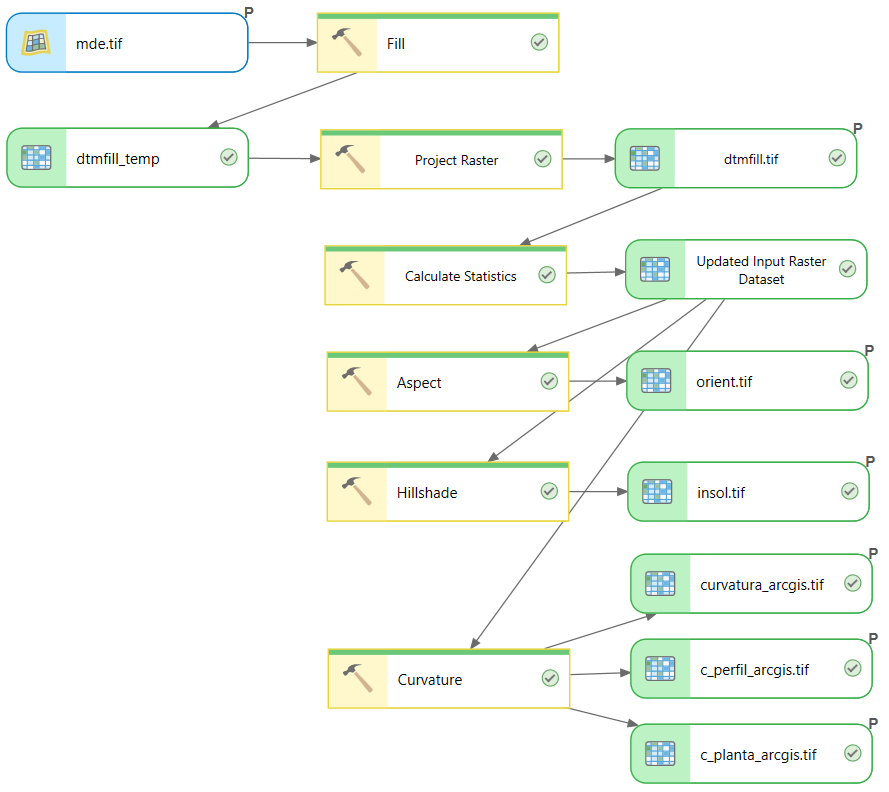
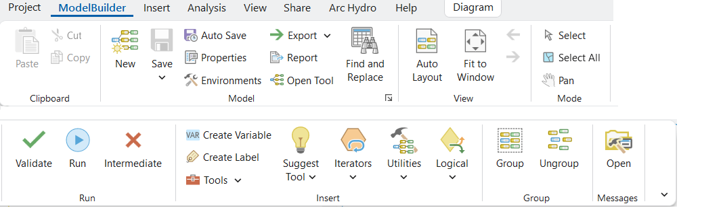
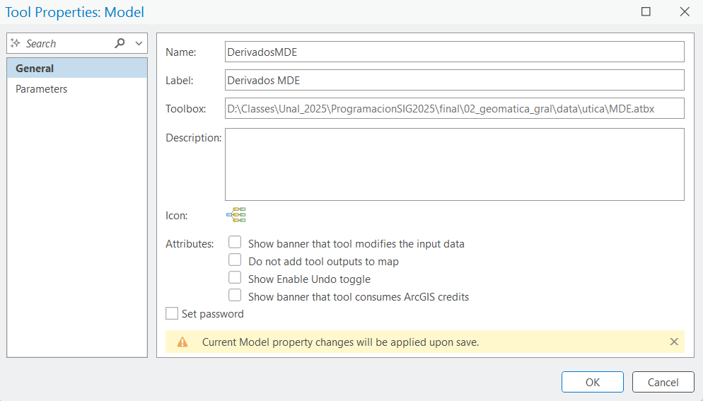
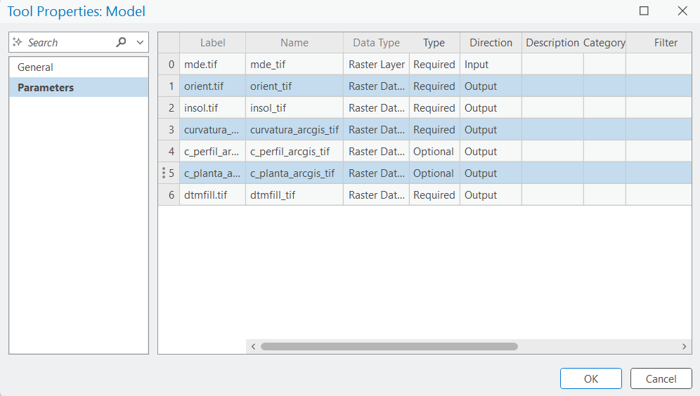
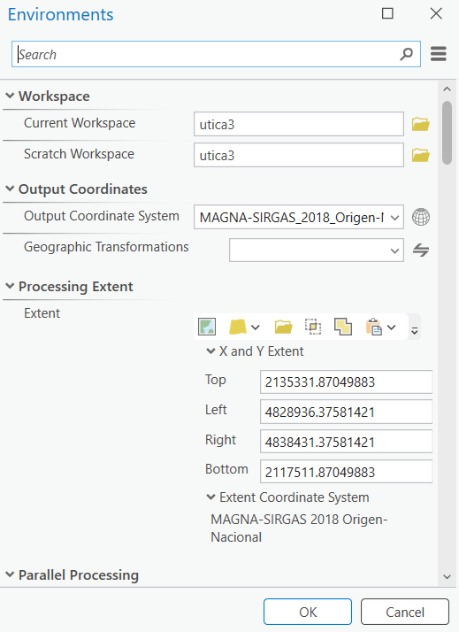
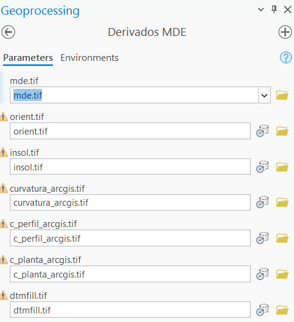

---
format:
  html:
    embed-resources: true
    code-fold: false
    math: false
    minimal: false
execute:
  freeze: auto
---

# Model builder (ArcGIS Pro) y Model Designer (QGIS) de productos del MDE

El diseño de un flujo de trabajo automatizado para la generación de productos derivados de un Modelo Digital de Elevación (MDE) permite asegurar la repetibilidad de los procesos y la integridad topológica de los resultados. A continuación, se detallan los requerimientos técnicos y la lógica de encadenamiento para la construcción del modelo en ArcGIS Pro. Al final se presenta un reto para generar un modelo similar en el Model Designer (QGIS).

## Clasificación de herramientas por caja de procesos

La implementación requiere el uso predominante de la extensión **Spatial Analyst**. Es importante verificar que la licencia se encuentre activa antes de la ejecución del modelo.

### Herramientas de superficie y morfometría

* **Pendiente:** `Spatial Analyst Tools` -> `Surface` -> `Slope`.
* **Orientación:** `Spatial Analyst Tools` -> `Surface` -> `Aspect`.
* **Insolación (Hillshade):** `Spatial Analyst Tools` -> `Surface` -> `Hillshade`.
* **Curvaturas (General, Perfil y Planta):** `Spatial Analyst Tools` -> `Surface` -> `Curvature`.
* **Rugosidad (VRM):** `Arc Hydro Tools Pro` -> `Terrain Preprocessing` -> `Vector Ruggedness Measure`.

### Herramientas hidrológicas

* **Acondicionamiento (Fill):** `Spatial Analyst Tools` -> `Hydrology` -> `Fill`.
* **Dirección de flujo:** `Spatial Analyst Tools` -> `Hydrology` -> `Flow Direction`.
* **Acumulación de flujo:** `Spatial Analyst Tools` -> `Hydrology` -> `Flow Accumulation`.
* **Longitud de flujo:** `Spatial Analyst Tools` -> `Hydrology` -> `Flow Length`.

### Álgebra de mapas

* **Pendiente senoidal:** `Spatial Analyst Tools` -> `Map Algebra` -> `Raster Calculator`.
    * Fórmula: `Sin("Raster_Pendiente" * 3.14159 / 180 * 2)`


## Lógica de construcción del modelo

La estructura del ModelBuilder debe seguir una jerarquía de dependencias para evitar errores de propagación de artefactos topográficos.

* **Procesamiento primario:** El MDE original debe ingresar únicamente a la herramienta `Fill`. El producto resultante (`dtmfill.tif`) servirá como insumo para el resto de los procesos.
* **Ramificación paralela de superficie:** Desde el `dtmfill.tif`, se deben derivar de forma simultánea los procesos de pendiente, orientación, curvaturas e insolación.
* **Encadenamiento hidrológico:** El `dtmfill.tif` se conecta a `Flow Direction`. El ráster de dirección de flujo resultante es el insumo obligatorio para calcular la acumulación y la longitud de flujo.
* **Derivación de segundo orden:** La salida de la herramienta `Slope` debe conectarse al `Raster Calculator` para generar la pendiente senoidal.


## Configuración de parámetros y entornos

Para garantizar la calidad académica y técnica de los productos, se recomiendan los siguientes ajustes en el modelo:

* **Variables de entorno (Environments):** Configurar el *Snap Raster* y el *Cell Size* vinculados al MDE de entrada para mantener la resolución espacial y la alineación de celdas en todos los archivos de salida.
* **Parámetros de modelo:** Definir el ráster de entrada y la carpeta de destino como parámetros (P) para permitir la flexibilidad en el cambio de áreas de estudio.
* **Gestión de datos intermedios:** Marcar los rásteres de dirección de flujo o sumatorias temporales como "Intermediate" para que el sistema los elimine automáticamente tras completar el reporte de resultados finales.
* **Nombres de salida:** Utilizar sustitución de variables en línea (ej. `%Output_Folder%\%Name%_slope.tif`) para organizar sistemáticamente los archivos en el disco duro.


## Resultados

{#fig-model_builder fig-align="center" width="80%"}


{#fig-model_builder?ribbon fig-align="center" width="80%"}

{#fig-model_builder_propiedades fig-align="center" width="80%"}

{#fig-model_builder_parametros fig-align="center" width="80%"}

{#fig-model_builder_environment fig-align="center" width="50%"}

{#fig-model_builder fig-align="center" width="50%"}

### Model Builder exportado a Python

```python
# Archivo: ...\02_geomatica_gral\data\utica\Derivados MDE.py

# -*- coding: utf-8 -*-
"""
Generated by ArcGIS ModelBuilder on : 2026-04-12 20:10:56
"""
import arcpy
from arcpy.sa import *
from arcpy.sa import *
from arcpy.sa import *
from sys import argv

#For inline variable substitution, parameters passed as a String are evaluated using locals(), globals() and isinstance(). To override, substitute values directly.
def DerivadosMDE(mde_tif="mde.tif", orient_tif="...\\orient.tif", insol_tif="...\\insol.tif", curvatura_arcgis_tif="...\\curvatura_arcgis.tif", c_perfil_arcgis_tif="...\\c_perfil_arcgis.tif", c_planta_arcgis_tif="...\\c_planta_arcgis.tif", dtmfill_tif="...\\dtmfill.tif"):  # Derivados MDE

    # To allow overwriting outputs change overwriteOutput option to True.
    arcpy.env.overwriteOutput = False

    # Check out any necessary licenses.
    arcpy.CheckOutExtension("spatial")
    arcpy.CheckOutExtension("3D")

    # Model Environment settings
    with arcpy.EnvManager(cellAlignment="ALIGN_WITH_INPUT", cellSize="15", extent="4828936.37581421 2117511.87049883 4838431.37581421 2135331.87049883 PROJCRS[\"MAGNA-SIRGAS_2018_Origen-Nacional\",BASEGEOGCRS[\"MAGNA-SIRGAS_2018\",DATUM[\"Marco_Geocentrico_Nacional_de_Referencia_2018\",ELLIPSOID[\"GRS_1980\",6378137.0,298.257222101]],PRIMEM[\"Greenwich\",0.0],CS[ellipsoidal,2],AXIS[\"Latitude (lat)\",north,ORDER[1]],AXIS[\"Longitude (lon)\",east,ORDER[2]],ANGLEUNIT[\"Degree\",0.0174532925199433]],CONVERSION[\"Transverse_Mercator\",METHOD[\"Transverse_Mercator\"],PARAMETER[\"False_Easting\",5000000.0],PARAMETER[\"False_Northing\",2000000.0],PARAMETER[\"Central_Meridian\",-73.0],PARAMETER[\"Scale_Factor\",0.9992],PARAMETER[\"Latitude_Of_Origin\",4.0]],CS[Cartesian,2],AXIS[\"Northing (Y)\",north,ORDER[1]],AXIS[\"Easting (X)\",east,ORDER[2]],LENGTHUNIT[\"Meter\",1.0],ID[\"EPSG\",\"9377\"]]", 
                          outputCoordinateSystem="PROJCRS[\"MAGNA-SIRGAS_2018_Origen-Nacional\",BASEGEOGCRS[\"MAGNA-SIRGAS_2018\",DATUM[\"Marco_Geocentrico_Nacional_de_Referencia_2018\",ELLIPSOID[\"GRS_1980\",6378137.0,298.257222101]],PRIMEM[\"Greenwich\",0.0],CS[ellipsoidal,2],AXIS[\"Latitude (lat)\",north,ORDER[1]],AXIS[\"Longitude (lon)\",east,ORDER[2]],ANGLEUNIT[\"Degree\",0.0174532925199433]],CONVERSION[\"Transverse_Mercator\",METHOD[\"Transverse_Mercator\"],PARAMETER[\"False_Easting\",5000000.0],PARAMETER[\"False_Northing\",2000000.0],PARAMETER[\"Central_Meridian\",-73.0],PARAMETER[\"Scale_Factor\",0.9992],PARAMETER[\"Latitude_Of_Origin\",4.0]],CS[Cartesian,2],AXIS[\"Northing (Y)\",north,ORDER[1]],AXIS[\"Easting (X)\",east,ORDER[2]],LENGTHUNIT[\"Meter\",1.0],ID[\"EPSG\",\"9377\"]]", scratchWorkspace="...", workspace="..."):

        # Process: Fill (Fill) (sa)
        dtmfill_temp = "...\\dtmfill_temp"
        Fill = dtmfill_temp
        dtmfill_temp = arcpy.sa.Fill(mde_tif.__str__().format(**locals(),**globals())if isinstance(mde_tif, str) else mde_tif, None)
        dtmfill_temp.save(Fill)


        # Process: Project Raster (ProjectRaster) (management)
        arcpy.management.ProjectRaster(in_raster=dtmfill_temp, out_raster=dtmfill_tif.__str__().format(**locals(),**globals())if isinstance(dtmfill_tif, str) else dtmfill_tif, out_coor_system="PROJCRS[\"MAGNA-SIRGAS_2018_Origen-Nacional\",BASEGEOGCRS[\"MAGNA-SIRGAS_2018\",DATUM[\"Marco_Geocentrico_Nacional_de_Referencia_2018\",ELLIPSOID[\"GRS_1980\",6378137.0,298.257222101]],PRIMEM[\"Greenwich\",0.0],CS[ellipsoidal,2],AXIS[\"Latitude (lat)\",north,ORDER[1]],AXIS[\"Longitude (lon)\",east,ORDER[2]],ANGLEUNIT[\"Degree\",0.0174532925199433]],CONVERSION[\"Transverse_Mercator\",METHOD[\"Transverse_Mercator\"],PARAMETER[\"False_Easting\",5000000.0],PARAMETER[\"False_Northing\",2000000.0],PARAMETER[\"Central_Meridian\",-73.0],PARAMETER[\"Scale_Factor\",0.9992],PARAMETER[\"Latitude_Of_Origin\",4.0]],CS[Cartesian,2],AXIS[\"Northing (Y)\",north,ORDER[1]],AXIS[\"Easting (X)\",east,ORDER[2]],LENGTHUNIT[\"Meter\",1.0],ID[\"EPSG\",\"9377\"]]", cell_size="15 15")
        dtmfill_tif = arcpy.Raster(dtmfill_tif)

        # Process: Calculate Statistics (CalculateStatistics) (management)
        Updated_Input_Raster_Dataset = arcpy.management.CalculateStatistics(in_raster_dataset=dtmfill_tif.__str__().format(**locals(),**globals())if isinstance(dtmfill_tif, str) else dtmfill_tif, area_of_interest="in_memory\\feature_set1")[0]
        Updated_Input_Raster_Dataset = arcpy.Raster(Updated_Input_Raster_Dataset)

        # Process: Aspect (Aspect) (3d)
        arcpy.ddd.Aspect(in_raster=Updated_Input_Raster_Dataset, out_raster=orient_tif.__str__().format(**locals(),**globals())if isinstance(orient_tif, str) else orient_tif)
        orient_tif = arcpy.Raster(orient_tif)

        # Process: Hillshade (HillShade) (sa)
        Hillshade = insol_tif
        insol_tif = arcpy.sa.HillShade(Updated_Input_Raster_Dataset, 315, 45, "NO_SHADOWS", 1)
        insol_tif.save(Hillshade)


        # Process: Curvature (Curvature) (sa)
        Curvature = curvatura_arcgis_tif
        curvatura_arcgis_tif = arcpy.sa.Curvature(Updated_Input_Raster_Dataset, 1, c_perfil_arcgis_tif.__str__().format(**locals(),**globals())if isinstance(c_perfil_arcgis_tif, str) else c_perfil_arcgis_tif, c_planta_arcgis_tif.__str__().format(**locals(),**globals())if isinstance(c_planta_arcgis_tif, str) else c_planta_arcgis_tif)
        curvatura_arcgis_tif.save(Curvature)

        c_perfil_arcgis_tif = arcpy.Raster(c_perfil_arcgis_tif)
        c_planta_arcgis_tif = arcpy.Raster(c_planta_arcgis_tif)

if __name__ == '__main__':
    DerivadosMDE(*argv[1:])

```


## Reto de evaluación: Modelador gráfico de QGIS

El entorno de QGIS provee una interfaz homóloga a ModelBuilder denominada **Modelador gráfico**, la cual permite encadenar geoprocesos nativos y herramientas de proveedores externos integrados (SAGA GIS, GRASS, entre otros).

Para acceder a esta herramienta:
1. Abra QGIS.
2. En la barra de menú superior, navegue a `Procesos` -> `Modelador gráfico` (`Processing` -> `Model Designer`).

**Instrucción del reto:**
Estructure un modelo análogo al diseñado en ArcGIS Pro. Su modelo debe recibir como parámetro de entrada un MDE crudo (Capa Ráster) y ejecutar secuencialmente el acondicionamiento topográfico (*Fill Sinks* de SAGA o GRASS) y la derivación paralela de variables morfométricas (pendiente, orientación, insolación y curvaturas). 

Exporte el modelo final (archivo `.model3`) y adjunte una captura de pantalla clara del lienzo de procesos como evidencia de ejecución en su repositorio de control de versiones.

### Procedimiento general de construcción del modelo

El diseño del flujo de trabajo en QGIS requiere la articulación lógica entre parámetros de entrada, algoritmos de procesamiento y definición de salidas. Siga esta secuencia operativa para estructurar el modelo solicitado:

1. **Definición de parámetros de entrada:**

    * En el panel inferior izquierdo del Modelador Gráfico, acceda a la pestaña **Entradas** (*Inputs*).
    * Arrastre el elemento **Capa Ráster** (*Raster Layer*) hacia el lienzo en blanco.
    * En el cuadro de diálogo emergente, asigne un nombre de parámetro descriptivo (ej. `MDE_Crudo_MAGNA_SIRGAS`) y defina la opción como obligatoria (*Mandatory*).

2. **Acondicionamiento topográfico (Nodo principal):**

    * Cambie a la pestaña **Algoritmos** (*Algorithms*) en el mismo panel lateral.
    * Utilice la barra de búsqueda para localizar la herramienta de corrección hidrológica seleccionada (ej. `Fill Sinks (Wang & Liu)` del proveedor SAGA o `r.fill.dir` de GRASS) y arrástrela al lienzo.
    * En la configuración del algoritmo, ubique el parámetro correspondiente a la capa de elevación. Despliegue el menú adyacente, seleccione la opción **Entrada del modelo** (*Model Input*) y vincúlelo al parámetro `MDE_Crudo_MAGNA_SIRGAS` creado en el paso anterior.
    * Para conservar este ráster intermedio corregido, asigne un nombre en el recuadro de texto de salida al final del cuadro de diálogo (ej. `MDE_Acondicionado`).

3. **Derivación paralela de variables morfométricas:**

    * Busque los algoritmos requeridos para el cálculo de pendiente, orientación, insolación y curvaturas. Puede optar por herramientas individuales (ej. `Hillshade` nativo de QGIS) o módulos de extracción múltiple (ej. `Slope, Aspect, Curvature` de SAGA).
    * Arrastre cada algoritmo de interés hacia el lienzo de diseño.
    * En la configuración de cada una de estas herramientas morfométricas, localice el parámetro de capa de elevación, cambie el tipo de entrada a **Salida del algoritmo** (*Algorithm Output*) y seleccione estrictamente el resultado generado por el nodo de acondicionamiento topográfico (el MDE corregido), garantizando la conectividad secuencial.

4. **Definición de productos finales:**

    * Para que el modelo consolide y retorne las capas generadas a la tabla de contenido del proyecto, es obligatorio escribir un nombre explícito en el campo de salida (*Output*) de cada algoritmo morfométrico configurado (ej. `Mapa_Pendiente`, `Modelo_Sombras`).
    * Al aceptar los cambios, la interfaz gráfica dibujará recuadros de color verde conectados a los algoritmos, indicando formalmente que constituyen productos finales de exportación.

5. **Ejecución y almacenamiento:**

    * Guarde el modelo utilizando el icono de disquete en la barra de herramientas superior. Esto generará el archivo con extensión `.model3` requerido para la entrega.
    * Inicie la validación del flujo de trabajo haciendo clic en el botón de ejecución (triángulo verde). En la ventana de diálogo resultante, seleccione el ráster de elevación de su área de estudio colombiana cargado en QGIS y proceda con el procesamiento automatizado.


### Criterios de entrega

* **Documento analítico (Quarto):** Estructurar el reporte técnico en un archivo `.qmd` y generar los compilados en formato HTML y PDF. El documento debe contener el script de GEE utilizado para la descarga, el flujograma metodológico, la argumentación geomorfométrica de los resultados y la imagen del modelo gráfico diseñado.
* **Imágenes resultantes:** Integrar en el documento Quarto las salidas gráficas de las variables procesadas en formato PNG. Toda imagen insertada debe cumplir con la sintaxis nativa de Quarto (ej. `{#fig-etiqueta fig-align="center" out-width="80%"}`).
* **Modelo automatizado:** Exportar el archivo físico del modelo diseñado en el Modelador Gráfico de QGIS (extensión `.model3`) y generar una captura de pantalla completa del lienzo de procesos en formato PNG.
* **Repositorio de control de versiones:** Desplegar el directorio completo del proyecto en un repositorio público de GitHub. La estructura del repositorio debe incluir estrictamente el código fuente `.qmd`, los documentos compilados, el directorio de imágenes (incluyendo la captura gráfica del modelo) y el archivo ejecutable `.model3`. Enviar solamente la URL del repositorio para fines de evaluación.