# Taller operación en campo usando asistentes de IA en ArcGIS

## Operación en campo usando asistentes de IA en ArcGIS

Este taller está basado en el trabajo presentado por el Instructor **Daniel Castañeda** (ESRI Colombia) en la **Conferencia Esri para Infraestructura 2026** llevada a cabo el día *Abril 9 de 2026*  en *Ágora Bogotá – Calle 24 No. 38-71*.

## Contexto

La gestión de infraestructura en campo requiere procesos ágiles para capturar información, documentar datos, analizar condiciones operativas y facilitar la toma de decisiones. Tradicionalmente, estos flujos de trabajo implican múltiples herramientas, configuraciones técnicas y tiempos prolongados de implementación.

Los asistentes de Inteligencia Artificial integrados en ArcGIS están transformando estos procesos, permitiendo que usuarios técnicos y no técnicos puedan diseñar, documentar, analizar y explorar información geoespacial mediante lenguaje natural y automatización inteligente.

Este taller presenta un flujo de trabajo completo orientado a la gestión de incidentes de infraestructura vial, demostrando cómo distintos asistentes de IA en ArcGIS apoyan cada etapa del proceso operativo en campo:

* Captura inteligente de información desde dispositivos móviles
* Documentación automática de datos geoespaciales
* Análisis y visualización inteligente de incidentes
* Exploración de datos mediante lenguaje natural
* Publicación de aplicaciones para toma de decisiones

A lo largo de los ejercicios, los participantes recorrerán un escenario práctico en el que crearán un formulario inteligente para registrar incidentes de infraestructura, documentarán automáticamente los datos generados, aplicarán análisis y visualizaciones inteligentes y finalmente construirán una aplicación web que permitirá explorar la información mediante consultas conversacionales.

Este enfoque demuestra cómo los asistentes de IA en ArcGIS no solo aceleran la configuración técnica, sino que también optimizan los flujos de trabajo operativos en campo, mejoran la calidad de los datos y facilitan la toma de decisiones basada en información geoespacial actualizada.

Al finalizar el taller, habrá experimentado un flujo completo de trabajo asistido por inteligencia artificial, desde la captura de datos hasta la exploración avanzada de la información.


## Ejercicio 1

### Crear un formulario con el asistente de IA en Survey123

En este ejercicio utilizará el asistente de inteligencia artificial de Survey123 para crear un formulario que permita registrar incidentes de infraestructura vial. Posteriormente, utilizará nuevamente el asistente para modificar el formulario existente e incorporar un campo numérico oculto que permitirá realizar análisis estadísticos, simbología avanzada y consultas con lenguaje natural.

En este ejercicio, realizará las siguientes tareas:

* Crear un formulario usando el Asistente de Survey123
* Revisar la estructura generada automáticamente
* Modificar el formulario usando el Asistente de Survey123
* Publicar el formulario
* Compartir el formulario mediante código QR
* Registrar datos en tiempo real


### Paso 1: iniciar sesión en Survey123

Utilizará el asistente de IA de Survey123 para que le ayude a crear un formulario inteligente desde cero.

a) Abra un navegador web y diríjase a: [https://survey123.arcgis.com/](https://survey123.arcgis.com/)
b) Inicie sesión con su cuenta de ArcGIS Online o ArcGIS Enterprise.


c) En la parte superior izquierda, haga clic en Nueva Encuesta.

### Paso 2: crear una encuesta con el asistente de IA

a) Seleccione en la opción Asistente Survey123 el botón Introducción.

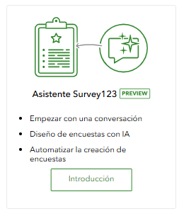


El asistente Survey123 utiliza un gran modelo de lenguaje (LLM) para ayudarle a diseñar encuestas a partir de una conversación. Pídale al asistente el tipo de encuesta que desee crear. Cuando el borrador de la encuesta esté listo, pídale al asistente que lo incorpore al diseñador web de Survey123. Puede modificar la encuesta en el diseñador web antes de publicarla. El asistente se basa en una tecnología en rápida evolución, por lo que esta función se mejora continuamente. Sus comentarios ayudarán a mejorarlo. Utilice las opciones de comentarios para informar a Esri sobre su experiencia. [Más información sobre el Asistente Survey123](https://links.esri.com/survey123/survey123-assistant)

b) Haga clic en Continuar.
c) En el cuadro del asistente, escriba el siguiente prompt:

```text
Crea un formulario para registrar incidentes de infraestructura vial.
Incluye únicamente los siguientes campos:

Ubicación del incidente (obligatoria)

Tipo de infraestructura: (obligatoria)
- Calzada
- Señalización vial
- Drenaje vial
- Estructuras viales

Tipo de activo: (obligatoria)
- Pavimento
- Señal
- Alcantarilla
- Puente/estructura

Nivel de severidad: (obligatoria)
- Alto
- Medio
- Bajo

Estado: (obligatoria)
- Reportado
- En proceso
- Resuelto
```

d) Haga clic en Generar.
e) Espere mientras el asistente crea el formulario dentro de la interfaz de Diseño.


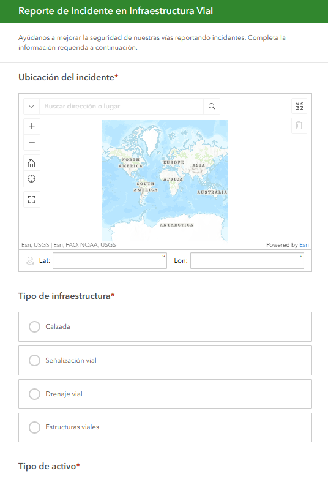


### Paso 3: revisar el formulario generado

a) Verifique que estén incluidos todos los campos especificados en el prompt:

* Ubicación
* Tipo de infraestructura
* Tipo de activo
* Nivel de severidad
* Estado

b) Observe que el asistente ha creado listas y una estructura organizada.
c) En la parte superior izquierda defina el nombre del formulario como: **Incidentes de Infraestructura Vial [iniciales del nombre]**.

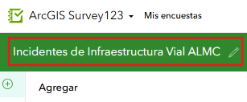

### Paso 4: modificar el asistente usando el asistente

En el proceso se evidenció que hace falta una pregunta para extraer un dato numérico sobre el nivel de impacto de los incidentes reportados. Para ello, volverá a consultar al asistente sobre el mismo chat del prompt inicial para complementar el formulario.


a) En la parte inferior izquierda seleccione el símbolo de 3 destellos del Asistente de Survey123.


b) En el cajón blanco del chat, ingrese el siguiente prompt:

```text
Agrega un campo numérico llamado Nivel de impacto, donde a través de una barra deslizante se asignen los siguientes valores:
* Muy Bajo = 1
* Bajo = 2
* Medio = 3
* Alto = 4
* Muy Alto = 5
```

El asistente vuelve a mostrar el formulario completo como boceto, ahora debe validar que se ha agregado la nueva pregunta.

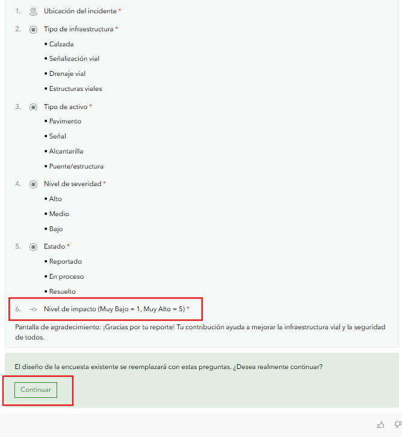

c) Haga clic en Continuar.
d) Espere mientras el asistente modifica el formulario. La forma en la que se muestra la nueva pregunta puede variar en su estilo, esta puede ser una referencia.

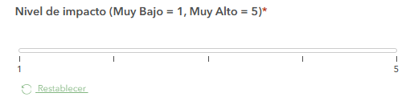

### Paso 5: publicar y compartir el formulario

Puede hacer modificaciones en el tema, diseño, estructura y demás configuraciones en las preguntas antes de hacer la publicación.

a) En la zona derecha del banner superior de color verde, haga clic en Publicar.

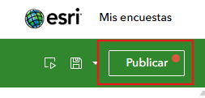

b) Confirme la publicación del formulario, dando clic nuevamente en Publicar.

c) Espere mientras Survey123 publica la encuesta.


d) Una vez publicado, el formulario estará disponible para captura de datos.


e) En banner verde haga clic en la pestaña Colabora.

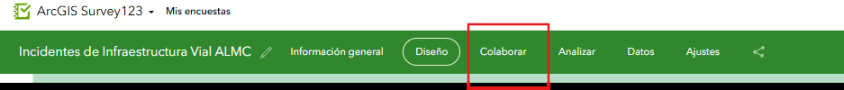

f) En la sección Compartir una encuesta, haga clic en Mostrar el Código QR y en Haga clic para descargar.

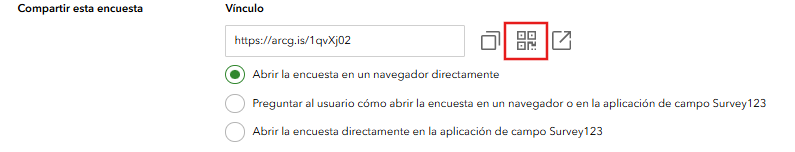

g) En la sección ¿Quién puede enviar datos a esta encuesta?, haga clic en Todos (público).

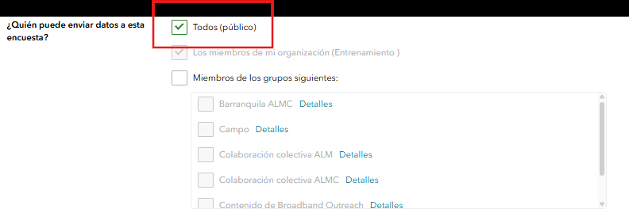

h) Al final de la lista de opciones, haga clic en el botón Guardar para confirmar la configuración del nivel de uso compartido.

Esto permitirá que usuarios sin cuenta de ArcGIS Online, puedan diligenciar el formulario. Ahora, podrá compartir el formulario para que en él se puedan generar registros de la audiencia.

i) Comparta el código QR con los demás participantes y solicite registrar al menos un incidente.
j) Espere a que se registren varios datos. Estos registros serán utilizados en los siguientes ejercicios.

### Resultados del ejercicio

Al finalizar este ejercicio habrá:

* Creado un formulario con el asistente de Survey123
* Modificado el formulario con el Asistente de Survey123
* Publicado la encuesta
* Compartido mediante código QR
* Registrado datos en tiempo real

## Ejercicio 2

### Generar documentación con asistente de IA

En este ejercicio utilizará el asistente de inteligencia artificial sobre Detalles elementos de ArcGIS para generar metadatos automáticamente del Feature Layer creado a partir del formulario de Survey123.

Los metadatos permiten documentar el propósito del dataset, describir los campos y facilitar su uso en análisis posteriores, visualización y consultas con asistentes de IA.

En este ejercicio, realizará las siguientes tareas:

* Revisar los metadatos del elemento
* Generar metadatos con el asistente de IA
* Revisar y ajustar la documentación generada
* Generar metadatos para los campos con el asistente de IA
* Guardar la documentación generada

### Paso 1: acceder al Feature Layer generado por el formulario

a) Abra una nueva pestaña del navegador y diríjase a [https://arcgis.com/](https://arcgis.com/)
b) Inicie sesión con la cuenta de ArcGIS Online o ArcGIS Enterprise.


c) Haga clic en la pestaña Contenido.
d) En la sección de carpetas del costado izquierdo, localice la encuesta creada en el Ejercicio 1 -> **Survey-Incidentes de Infraestructura Vial [iniciales del nombre]**.

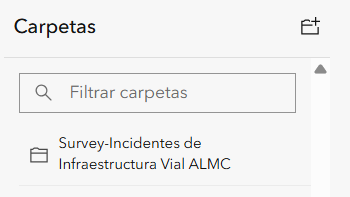

e) Observe que Survey123 ha creado automáticamente diferentes tipos de elementos: 

* Formulario
* Feature Layer (alojado, vista)
* Feature Layer (alojado).

f) Haga clic en el **Feature Layer alojado**, llamado **Incidentes de Infraestructura Vial [iniciales del nombre]**.

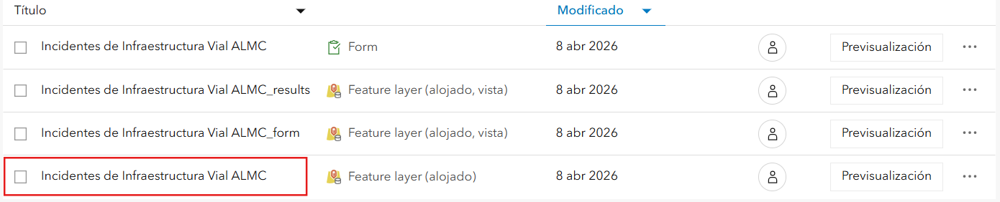

### Paso 2: revisar los metadatos del elemento

Aparece la página de los detalles y configuración de la capa, donde encontrará información contextual sobre los datos que contiene y opciones de acceso a los datos.

a) Si es necesario, en la página del elemento, ubique la pestaña Vista general. Observe que los campos de metadatos del elemento se encuentran incompletos.
b) Campos como Resumen, Descripción y Etiquetas se encuentran vacíos.

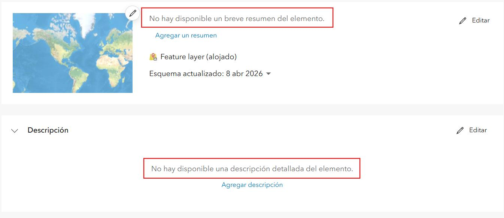

Los metadatos permiten entender rápidamente el propósito del dataset, quién lo creó, para qué se utiliza y cómo puede ser usado por otros usuarios. Además, los asistentes de IA utilizan esta información para generar mejores análisis y sugerencias.

#### Paso 4: generar metadatos del elemento con el asistente

Ahora, utilizará el Asistente de IA para detalles del elemento y podrá generar los metadatos esenciales de la capa alojada.

a) En el panel derecho, haga clic en el botón Sugerir.

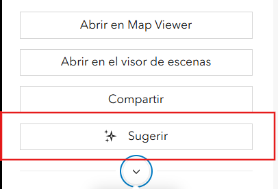

b) Aparecerá una ventana emergente indicando los metadatos esenciales que serán creados.

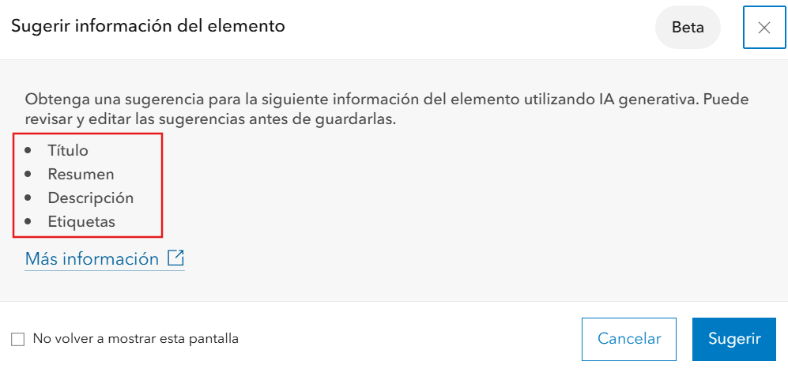

c) Haga clic en Sugerir. Espere unos segundos mientras el asistente genera la información.
d) Revise la información generada y realice ajustes si es necesario. La información que el asistente generó puede ser diferente a la de la imagen de referencia.

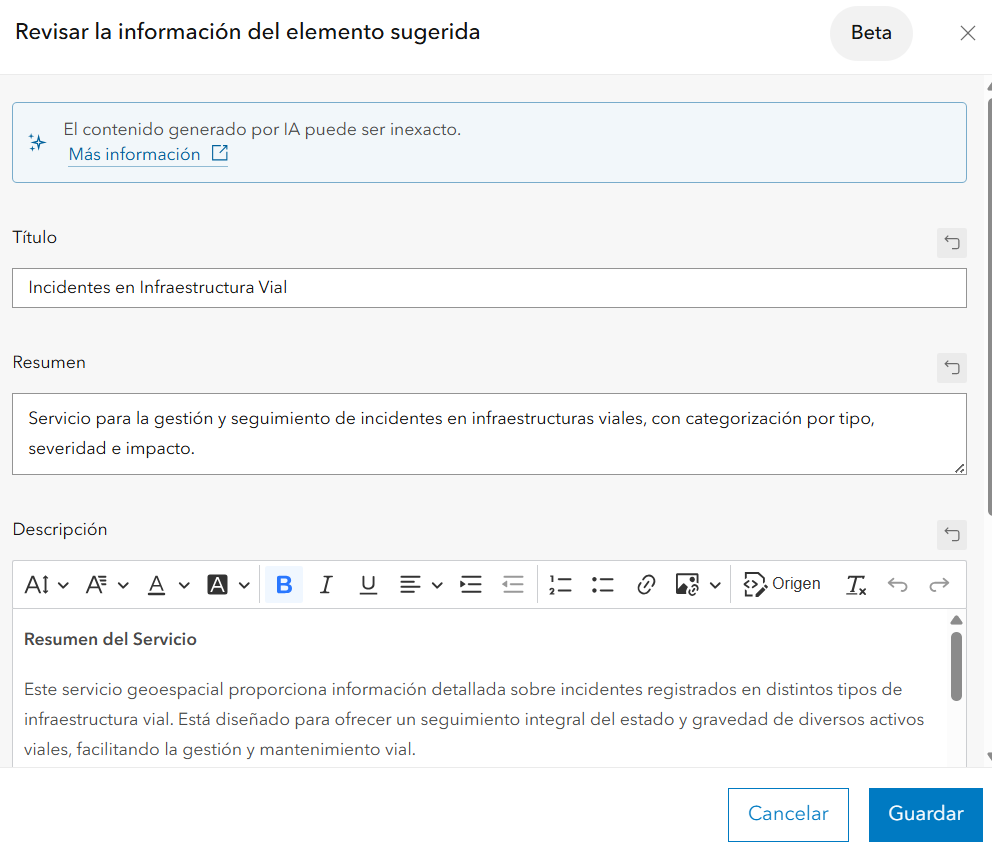

e) Haga clic en Guardar.

Observe que la información del elemento ahora está completa. Título, Resumen, Descripción y Etiquetas. Estos metadatos facilitan la búsqueda del contenido, mejoran la documentación del proyecto y permiten que otros usuarios comprendan rápidamente el propósito del dataset.

#### Paso 3: revisar la estructura de datos

Revisará la información con la que cuenta la capa y notará que los atributos no tienen descripción o datos básicos para comprender su función esencial. Más adelante, el Asistente de IA para detalles del elemento ayudará a generarlos.

a) En la página del elemento, haga clic en la pestaña Datos. 

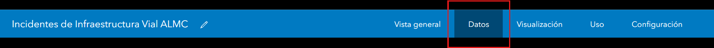

En el panel izquierdo, observe las opciones: **Tabla, Campos, Actualizar datos y Calcular campo**.

b) Seleccione la opción Tabla y observe los registros que han sido capturados mediante el formulario.
c) Seleccione la opción Campos y observe la lista de campos generados por Survey123.
d) Note que la tabla contiene las siguientes columnas: 

* Nombre de visualización
* Nombre de campo
* Tipo
* Tipo de valor
* Dominio

e) Seleccione uno de los campos de la lista de atributos.

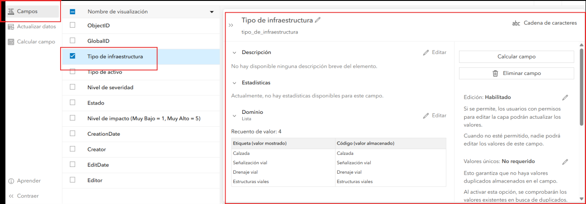

f) Observe que el campo no tiene descripción ni tipo de valor.

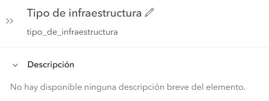

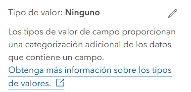

Los metadatos permiten entender rápidamente el propósito del dataset, quién lo creó, para qué se utiliza y cómo puede ser usado por otros usuarios. Además, los asistentes de IA utilizan esta información para generar mejores análisis y sugerencias.


#### Paso 6: generar metadatos de los campos

Es momento de que el asistente de IA ayude a generar los metadatos de los campos, lo hará de forma simultánea para todos los atributos.

a) Seleccione todos los campos dando clic en la casilla junto a Nombre de visualización.

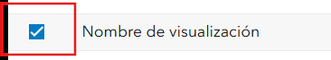

b) Observe que en la parte superior derecha aparece el botón Sugerir.

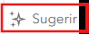

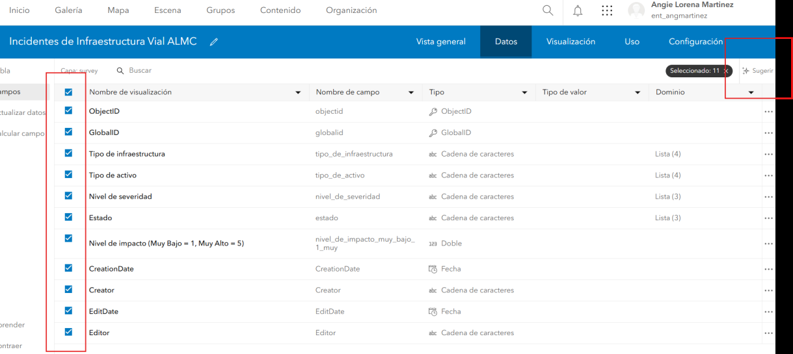


c) Haga clic en Sugerir.
d) Aparecerá una ventana emergente indicando los elementos que serán creados por el Asistente de IA.

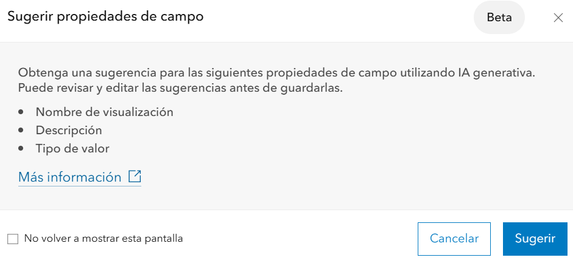

e) Haga clic nuevamente en Sugerir. El proceso tarda algunos segundos mientras el asistente genera la información.
f) Aparecerá una nueva ventana para revisar las propiedades de los campos.
g) Observe que el asistente muestra cambios para: 

* Nombre de campo
* Nombre de visualización
* Descripción
* Tipo de valor

h) Revise la información generada para cada uno de los campos y realice cambios de ser necesario.

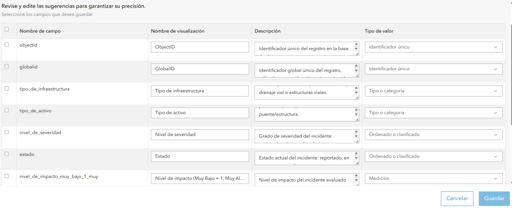


i) De clic en la casilla junto a Nombre de campo y seleccione todos los campos.

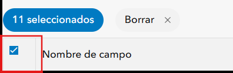

j) Haga clic en Guardar.

Los campos ahora cuentan con metadatos completos y documentados.

### Resultados del ejercicio

Al finalizar este ejercicio habrá:

* Generado metadatos del Feature Layer
* Documentado el propósito del dataset
* Generado metadatos para los campos
* Mejorado la documentación del dataset
* Preparado la capa para análisis con asistentes de IA

## Ejercicio 3

### Crear simbología inteligente y pop-ups con el asistente de Arcade

En este ejercicio utilizará el asistente de Arcade para crear una simbología inteligente basada en múltiples campos y configurar un pop-up dinámico que resuma la información del incidente.

Realizará las siguientes tareas:

* Crear el mapa basado en los reportes
* Simbolizar la capa usando el asistente de Arcade
* Crear descripciones detalladas en la ventana emergente o pop up
* Crear gráficos con ayuda del asistente de IA de Arcade

### Trabajar con mapas web

#### Paso 1: abrir el mapa

a) Si es necesario, abra una nueva pestaña del navegador y vaya a: https://arcgis.com/
b) Inicie sesión con la cuenta de ArcGIS Online o ArcGIS Enterprise.


c) Haga clic en la pestaña Contenido.
d) Localice y de clic en la encuesta creada en el Ejercicio 1 -> **Incidentes de Infraestructura Vial [iniciales del nombre]**.
e) Haga clic en el **Feature Layer alojado**, llamado **Incidentes de Infraestructura Vial**.
f) En el panel derecho, haga clic en el botón **Abrir en Map Viewer**.

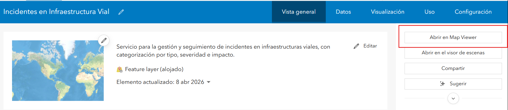


#### Paso 2: aplicar simbología con una expresión Arcade

Es momento de usar el asistente de IA de Arcade para configurar la simbología de la capa de reportes de la Infraestructura Vial.

a) Una vez en el Visor de Mapas, ubique el panel lateral derecho y haga clic en Estilos. Puede expandir el panel con el botón de Expandir o Contraer de la parte inferior.

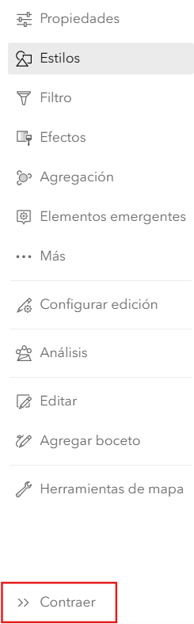

b) En la sección Elegir atributos, haga clic en el botón Expresión. Se abrirá una nueva ventana para escribir código en el lenguaje de expresiones de ArcGIS Arcade.

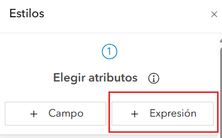

c) En la barra lateral derecha, ubique el botón de destellos del Asistente de Arcade.


d) En la ventana de bienvenida del asistente haga clic en Continuar.

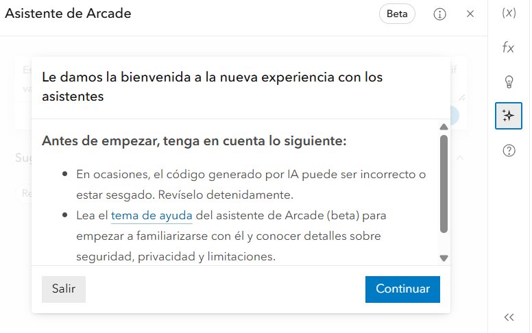

e) Ingrese en siguiente prompt:

```text
Genera una expresión Arcade que clasifique los incidentes según el nivel_de_severidad y nivel_de_impacto.

Reglas:
Si nivel_de_severidad es Alto y nivel_de_impacto es mayor o igual a 4 devolver "Atención inmediata"
Si nivel_de_severidad es Medio y nivel_de_impacto es mayor o igual a 3 devolver "Atención prioritaria"
En los demás casos devolver "Atención programada"
La expresión debe devolver texto.
```

f) Haga clic en Generar.
g) En la parte inferior del asistente, haga clic en Agregar a editor.

Revise el código y si nota alguna inconsistencia con los nombres de los campos puede refinar el código. En caso de que el código no se genere exitosamente, use la opción de Perfeccionar o Volver a empezar del Asistente de IA para Arcade.

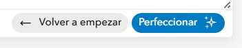


h) Haga clic en Ejecutar para validar abajo en la consola el resultado.
i) Haga clic en Listo.

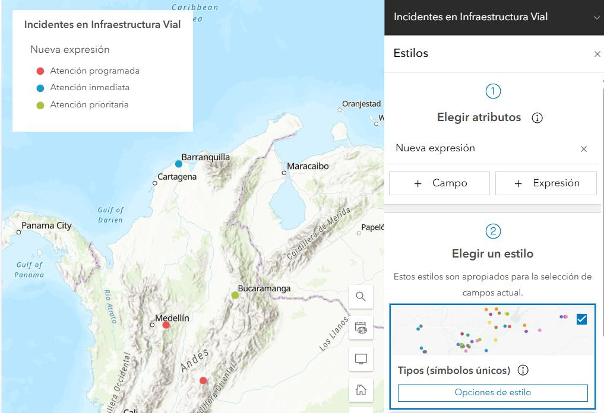

Observe que se aplicó una simbología automáticamente por Tipos (símbolos únicos), con un color diferente para cada una de las tres categorías nuevas (Atención inmediata, Atención prioritaria y Atención Programada), construidas con una expresión de ArcGIS Arcade.

#### Paso 3: crear mensaje descriptivo del pop-up con el asistente de Arcade

Ahora pedirá al asistente de IA de Arcade ayuda para crear un código que mejore la descripción de cada registro en la ventana emergente.

a) En el Visor de Mapas, ubique nuevamente el panel lateral derecho y haga clic en Elementos emergentes.

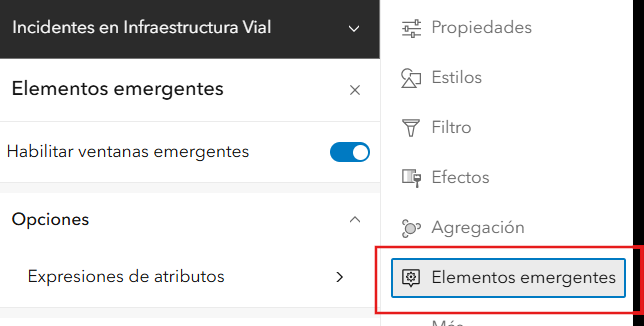

b) En la sección de Opciones, haga clic en Expresiones de atributos.
c) Haga clic en Agregar Expresión. Se abre una ventana nueva similar a la del ejercicio de simbología.
d) En la parte superior izquierda de la ventana, en Nueva Expresión, defina el nuevo nombre Mensaje.
e) En la barra lateral derecha, ubique el botón Asistente de Arcade.


f) En la ventana de bienvenida del asistente haga clic en Continuar.
g) Ingrese en siguiente prompt:

```text
Genera una expresión Arcade que construya un mensaje descriptivo del incidente utilizando:
tipo_de_infraestructura
tipo_de_activo
nivel_de_severidad
estado
nivel_de_impacto
```

h) Haga clic en Generar. El Asistente de Arcade tardará algunos segundos creando el código con la instrucción proporcionada.
i) En la parte inferior del asistente, haga clic en Agregar a editor.

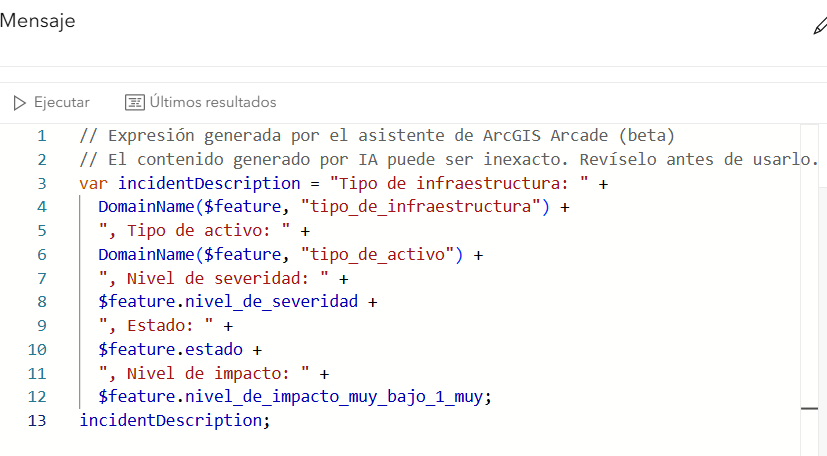

En caso de que el código no se genere exitosamente, puede intentar parafrasear el texto, o ajustar la instrucción nuevamente.

j) Haga clic en Ejecutar.
k) Haga clic en Listo. Como resultado tendrá la expresión nombrada Mensaje.

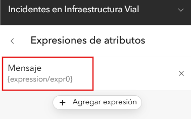

l) Haga clic en el botón Atrás **<**.

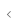

m) En la sección **Cargo** defina el nombre de la ventana emergente **Incidentes en Infraestructura Vial**.

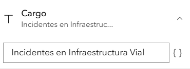

n) En la sección Lista de Campos, haga clic en Opciones **...** y Eliminar.


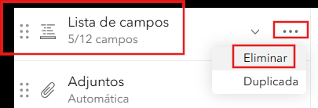


o) Haga clic en Agregar contenido y seleccione Texto.

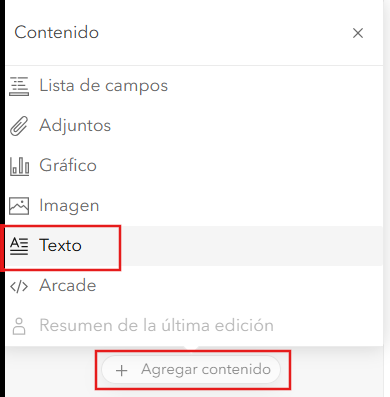


p) En Editar Texto, haga clic en el ícono de las llaves `{}` para acceder a la Lista de campos.

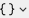

q) Seleccione la expresión que construyó con el asistente de Arcade llamada Mensaje. Observe que se agrega la expresión de la forma `{expression/expr0}`, la cual hará el llamado al mensaje construido por el Asistente de Arcade.

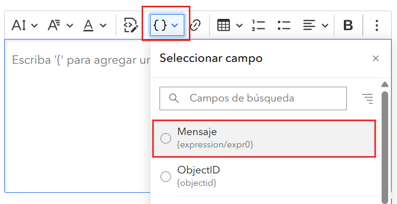

r) Haga clic en Aceptar.
s) Seleccione uno de los puntos en el mapa para desplegar la ventana emergente. Confirme el mensaje mostrado y los atributos del punto seleccionado.

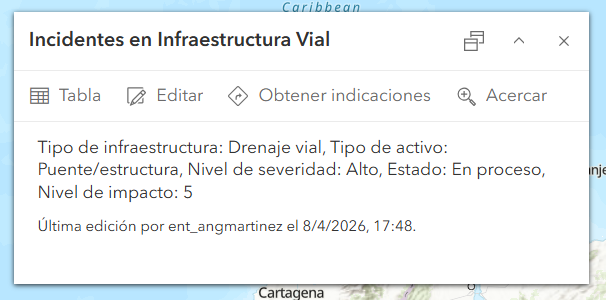

#### Paso 6: crear 3 expresiones con Arcade como insumo de gráfico

Seguirá configurando la ventana emergente para crear tres expresiones de Arcade con ayuda del asistente. Dicho resultado permitirá hacer un gráfico con los datos arrojados.

**1. Expresión para Impacto Bajo**

a) En el Visor de Mapas, ubique el panel lateral derecho y haga clic en Elementos emergentes.
b) Nuevamente haga clic en Expresiones de atributos.
c) Haga clic en Agregar Expresión.

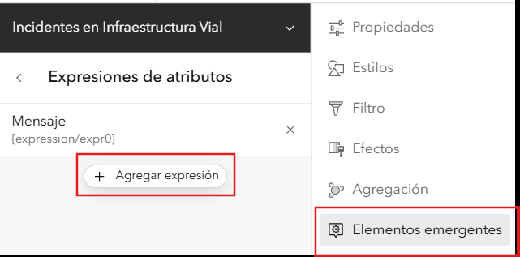

d) En el nombre de la expresión Nueva Expresión, defina el nuevo nombre Impacto Bajo.
e) En la barra lateral derecha, ubique el botón Asistente de Arcade.
f) En la ventana de bienvenida del asistente haga clic en Continuar.
g) Ingrese el siguiente prompt:

```text
Crea una expresión Arcade que cuente la cantidad de incidentes con nivel_de_severidad igual a "Bajo" para el mismo tipo_de_infraestructura del registro seleccionado. El resultado debe ser numérico para usarlo en un gráfico.
```

h) Haga clic en Generar.
i) En la parte inferior del asistente, haga clic en Agregar a editor. La escritura de código puede variar, lo importante es que al obtener el resultado este sea según el requerimiento.

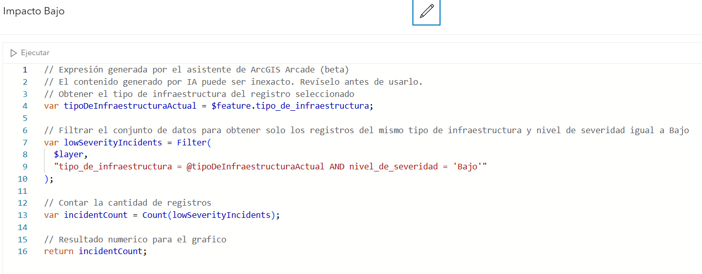


j) Haga clic en Ejecutar.
k) Haga clic en Listo.

**2. Expresión para Impacto Medio**

a) Haga clic nuevamente en **Expresiones de atributos**.
b) Haga clic en Agregar Expresión.
c) En el nombre de la expresión Nueva Expresión, defina el nuevo nombre Impacto Medio.
d) En la barra lateral derecha, ubique el botón Asistente de Arcade.
e) En la ventana de bienvenida del asistente haga clic en Continuar.
f) Ingrese el siguiente prompt:

```text
Crea una expresión Arcade que cuente la cantidad de incidentes con nivel_de_severidad igual a "Medio" para el mismo tipo_de_infraestructura del registro seleccionado. El resultado debe ser numérico para usarlo en un gráfico.
```

g) Haga clic en Generar.
h) En la parte inferior del asistente, haga clic en Agregar a editor.

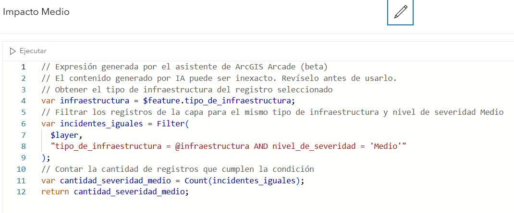


i) Haga clic en Ejecutar.
j) Haga clic en Listo.

**3. Expresión para Impacto Alto**

a) Haga clic nuevamente en Expresiones de atributos.
b) Haga clic en Agregar Expresión.

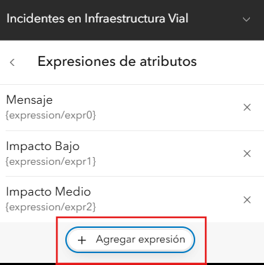

c) En el nombre de la expresión Nueva Expresión, defina el nuevo nombre Impacto Alto.
d) En la barra lateral derecha, ubique el botón Asistente de Arcade.
e) En la ventana de bienvenida del asistente haga clic en Continuar.
f) Ingrese el siguiente prompt:

```text
Crea una expresión Arcade que cuente la cantidad de incidentes con nivel_de_severidad igual a "Alto" para el mismo tipo_de_infraestructura del registro seleccionado. El resultado debe ser numérico para usarlo en un gráfico.
```

g) Haga clic en Generar.
h) En la parte inferior del asistente, haga clic en Agregar a editor.

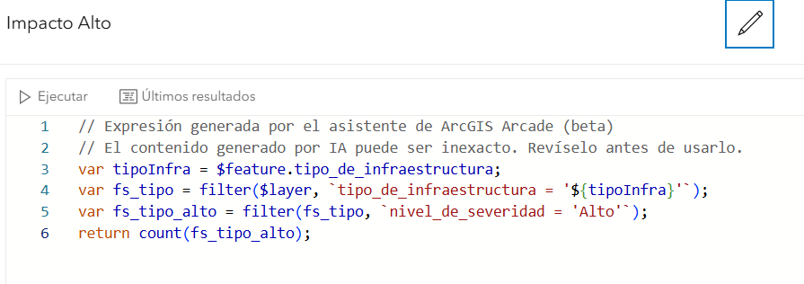

i) Haga clic en Ejecutar.
j) Haga clic en Listo.

#### Paso 9: crear gráfico circular

Se tomarán las expresiones generadas anteriormente como insumo para la creación de un gráfico de torta que muestre la cantidad de incidentes con Nivel de severidad Alto, Medio y Bajo para el mismo Tipo de infraestructura.

a) Haga clic en el botón Atrás.

b) En la configuración de Elementos Emergentes, haga clic en Agregar contenido.
c) Seleccione Gráfico.

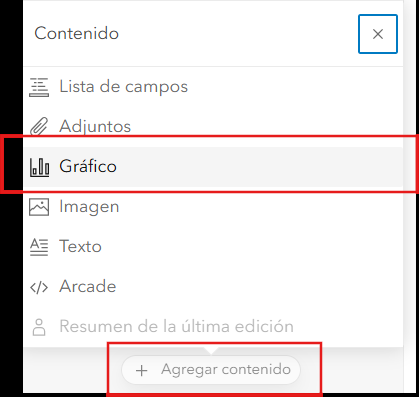

d) Seleccione el tipo de gráfico como Circular.

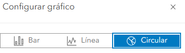

e) Haga clic en Seleccionar campos.
f) Seleccione las tres expresiones creadas:

* Impacto Bajo {expresión/expr1}
* Impacto Medio {expresión/expr2}
* Impacto Alto {expresión/expr3}

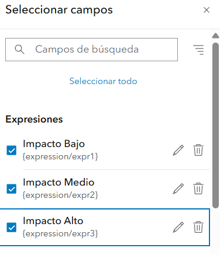

g) Haga clic en Listo.

h) Seleccione uno de los puntos en el mapa para desplegar la ventana emergente. Observe que el gráfico circular se genera automáticamente y cambia en función del tipo de infraestructura seleccionada.

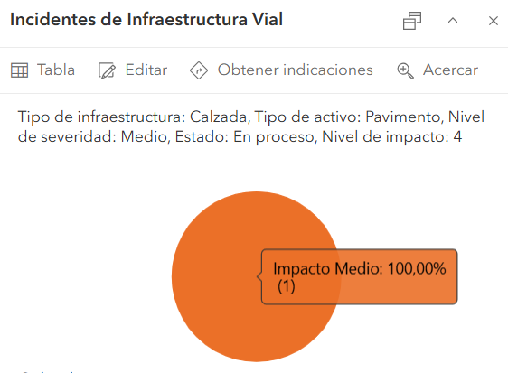

i) En el campo Cargo, haga clic en el botón de llaves `{}`.
j) Seleccione el campo: `tipo_de_infraestructura`. Esto permitirá que el título del gráfico cambie dinámicamente según el incidente seleccionado.
k) En Multimedia (Grafico circular) dé clic y configure el campo Leyenda, escriba:

```text
Impacto Bajo: {expression/expr1}
Impacto Medio: {expression/expr2}
Impacto Alto: {expression/expr3}
```

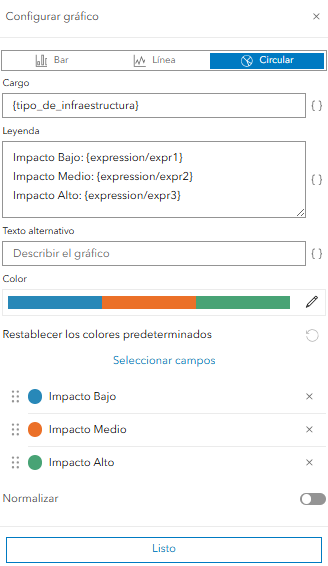

l) Haga clic en Listo.


m) En el campo Cargo, del contenido Multimedia, escriba: Nivel de impacto por Tipo de Infraestructura.

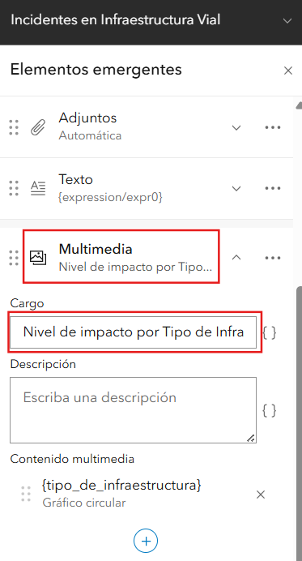

n) La ventana emergente debe quedar similar a la imagen de referencia.

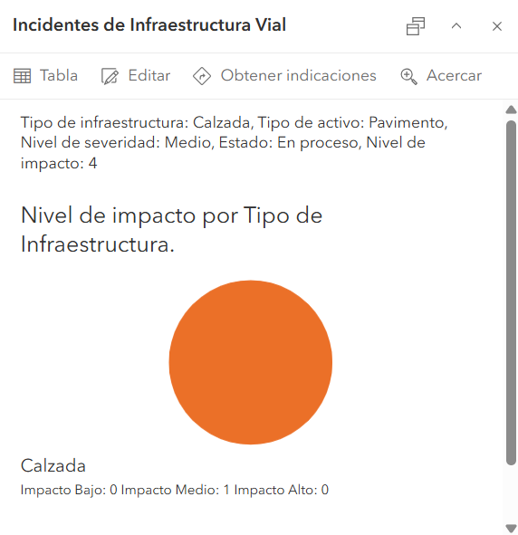

Observe que:

* El gráfico circular cambia dinámicamente
* El título cambia según la infraestructura
* Los valores se actualizan automáticamente

#### Paso 10: guardar configuración del mapa

a) En el Visor de Mapa, ubique la barra lateral izquierda y haga clic en Guardar.

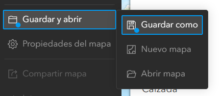

b) Diligencie los campos de Título, Etiquetas y Resumen.
c) En el Título escriba Mapa Incidencias Infraestructura Vial, el resto de los campos déjelos por defecto.

### Resultados del ejercicio

Al finalizar este ejercicio habrá:

* Creado expresiones Arcade con asistentes
* Generado un mensaje dinámico
* Creado un gráfico circular dinámico

## Ejercicio 4

### Exploración de datos mediante lenguaje natural

En este ejercicio utilizará la plantilla Data Explorer de ArcGIS Instant Apps para crear una aplicación web que permita explorar los datos mediante lenguaje natural.

Esta aplicación permitirá realizar preguntas directamente al mapa, generar consultas dinámicas y visualizar resultados sin necesidad de crear filtros manuales.

En este ejercicio, realizará las siguientes tareas:

* Crear una aplicación con Data Explorer
* Configurar el modo análisis
* Generar incorporaciones para las capas
* Configurar preguntas de muestra
* Realizar consultas con lenguaje natural
* Compartir la aplicación

### Paso 1: abrir el mapa

Iniciará eligiendo la plantilla de la aplicación Instant App y creando la opción de Data Explorer (beta).

a) Abra una nueva pestaña del navegador y acceda a la siguiente [URL](https://www.arcgis.com/home/item.html?id=b53dca102b0345a6a012899b1076eff8): `https://www.arcgis.com/home/item.html?id=b53dca102b0345a6a012899b1076eff8`
b) Si es necesario, inicie sesión con la cuenta de ArcGIS Online o ArcGIS Enterprise.
c) En la parte derecha de la página, haga clic en Crear una aplicación web.

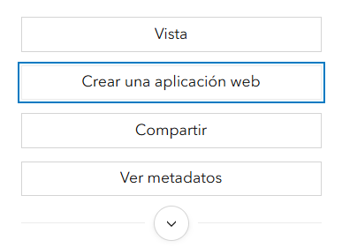

d) En el campo Título, escriba: Incidencias Infraestructura Vial App.
e) Deje el resto de los campos por defecto.
f) Haga clic en Guardar.

#### Paso 2: configurar la aplicación

Seguirá un paso a paso que la aplicación tiene definido por defecto para la creación instantánea de visores web.

a) En el panel izquierdo active el modo Rápido.


b) En Paso 1. Seleccionar un mapa, haga clic en Seleccionar mapa.

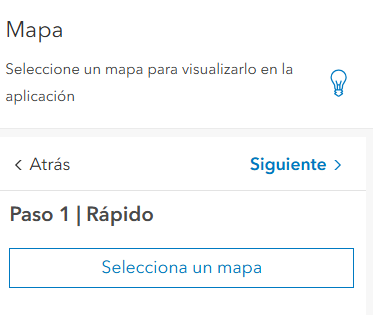


c) Seleccione el mapa: Mapa Incidentes Infraestructura Vial.

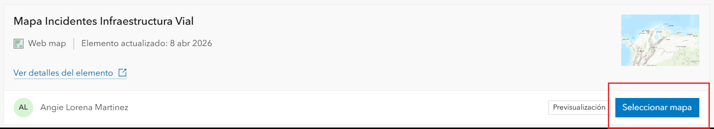

d) Haga clic en Siguiente para dirigirse al siguiente paso.
e) En el Paso 2, deje los valores por defecto.
f) Desmarque la opción Ventana de introducción.
g) Haga clic en Siguiente para dirigirse al siguiente paso.
h) En el Paso 3, habilite la opción Modo análisis. Observe que aparecen las capas disponibles para análisis. Las capas que tienen metadatos completos muestran un indicador verde, indicando que están listas para análisis con lenguaje natural.

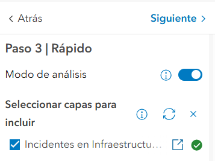

i) Haga clic en Generar incorporaciones. Ahora habilitará una sección de preguntas de muestra para el usuario final.
j) Habilite la opción Preguntas de muestra y luego, haga clic en Agregar pregunta.

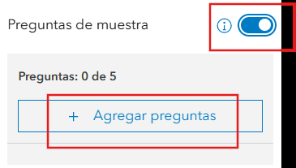

k) Escriba la pregunta: ¿Cuántos incidentes en total se han reportado?
l) Haga clic en Guardar.
m) Agregue una segunda pregunta: ¿Cuántos incidentes son de tipo de infraestructura Calzada?
n) Haga clic en Guardar.

En la vista de la aplicación se deben ver dichas preguntas en el panel de consulta al Asistente de IA.

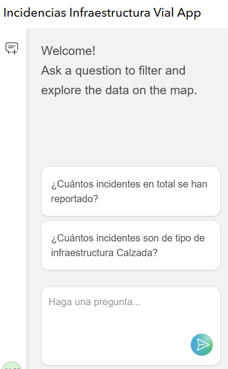


#### Paso 5: explorar datos con lenguaje natural

Es momento de hacer una prueba realizando preguntas al chat del Asistente de IA.

a) Acceda al panel de Chat de la aplicación.
b) Realice las preguntas preconfiguradas, haciendo clic sobre alguna de ellas y enviándola.

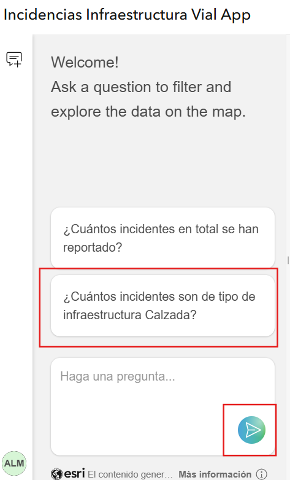

c) Observe los resultados en:

* Panel de chat
* Mapa
* Capa generada
* Tabla de atributos generada

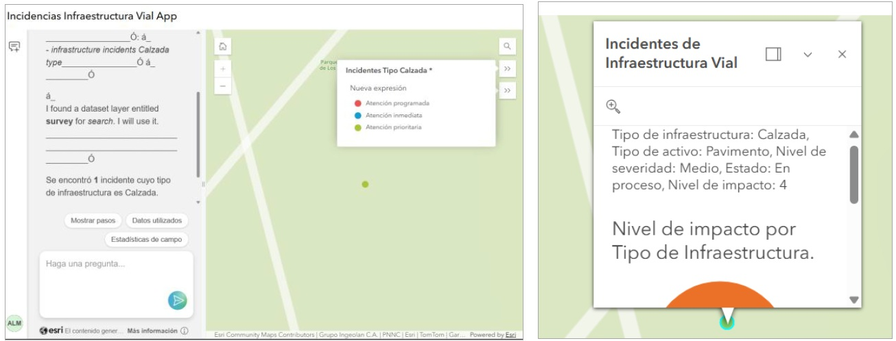

d) Observe las ventanas emergentes configuradas en el ejercicio anterior.
e) Realice otras preguntas relacionadas con los datos, incluso operaciones con los mismos.
f) Observe que los pasos 4 y 5 de la aplicación corresponden a configuraciones adicionales de diseño. Estos pasos permiten:

* Cambiar colores y apariencia
* Cambiar diseño de la aplicación
* Configurar mensajes y ventanas

#### Paso 7: compartir y publicar la aplicación

Puede compartir la aplicación en diferentes niveles de uso. Para este caso, se realizará de forma Privada para la Organización y así, cualquier persona de la entidad pueda acceder a la aplicación sin ninguna restricción y por medio de un enlace.

En dado caso de querer dejarla a nivel Público, debe dirigirse a la Capa alojada y al Mapa y definir el mismo uso compartido como Publico.

a) En el panel lateral izquierdo, haga clic en Compartir.
b) Seleccione Cambiar configuración de uso compartido.

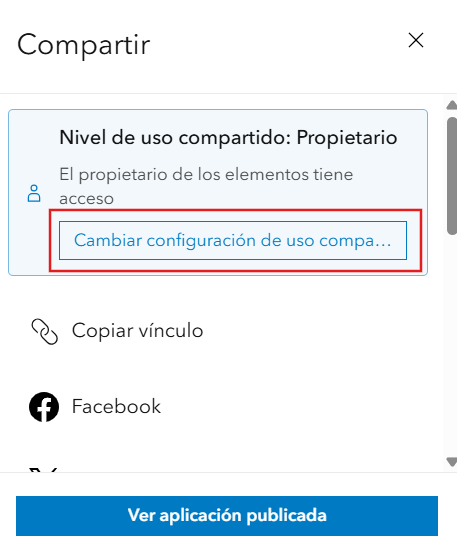

c) Seleccione la opción de Organización y confirme en Guardar.

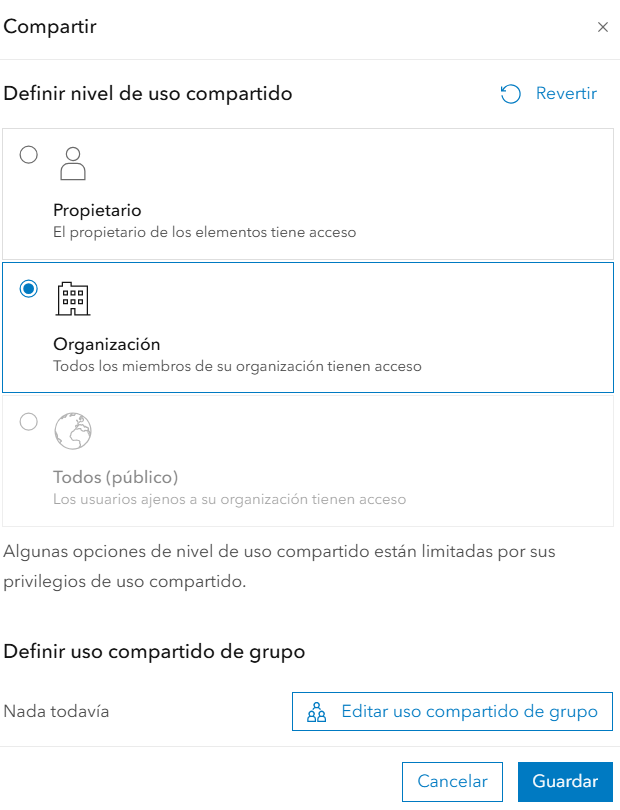


d) Finalice la aplicación dando clic en Publicar y Confirme la publicación.

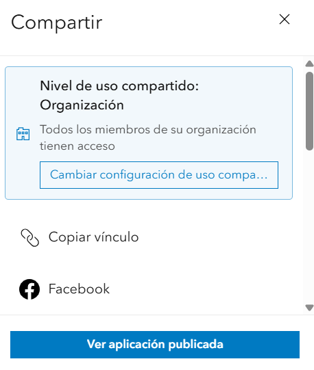


### Resultados del ejercicio

Al finalizar este ejercicio habrá:

* Creado una aplicación Data Explorer
* Configurado modo análisis
* Generado incorporaciones
* Configurado preguntas de muestra
* Exploración con lenguaje natural
* Compartido la aplicación

Si llegó a este punto del taller, ha comprobado cómo los asistentes de IA permiten explorar datos geoespaciales mediante lenguaje natural para optimizar las operaciones en campo.


## Evaluación práctica y trabajo de campo

La presente evaluación tiene como objetivo comprobar la asimilación de los conceptos de captura de información, estructuración de datos espaciales y automatización mediante asistentes de IA. La actividad se desarrollará en grupos de dos personas y la toma de datos se ejecutará estrictamente dentro del campus de la Universidad Nacional de Colombia (Sede Bogotá).

### Requisitos de modificación del formulario

Tomando como base el formulario creado en Survey123 durante el Ejercicio 1, aplique las siguientes modificaciones utilizando el Asistente de IA o la interfaz de diseño:

- Inserte un campo obligatorio del tipo imagen que permita la captura fotográfica del incidente reportado en campo.
- Inserte una pregunta de selección múltiple o texto que sea única y particular para su grupo de trabajo (por ejemplo, afectación a la movilidad peatonal, proximidad a edificios emblemáticos de la UNAL como la Biblioteca Central, etc.).

### Reglas de captura de información en el campus

La recolección de datos se realizará en el área de la Ciudad Universitaria, garantizando que los puntos cuenten con precisión de ubicación y correspondan a infraestructura real del campus.

- **Captura propia**: Registre un mínimo de 5 incidentes utilizando su propio formulario.
- **Captura colaborativa**: Intercambie los códigos QR de acceso con al menos 3 grupos de trabajo diferentes.
- Registre un mínimo de 5 incidentes en cada uno de los formularios de sus compañeros (totalizando 15 registros ajenos).
- Verifique que la capa final alojada en su cuenta de ArcGIS Online contenga la totalidad de los registros esperados.

### Entregables del proyecto

Entregue un único archivo comprimido que contenga el documento Quarto (`.qmd`) y sus respectivas salidas compiladas en formatos HTML y PDF. El documento debe contener:

- Enlaces de acceso público al formulario de Survey123 y a la aplicación web (Data Explorer) finalizada.
- Descripción de la nueva pregunta integrada al modelo de datos y su justificación.
- Resumen estadístico básico de los datos capturados (frecuencia de incidentes por nivel de severidad y tipo de infraestructura).
- Análisis espacial básico: Generación de un análisis de densidad (mapa de calor o clústeres) utilizando los puntos capturados en la Ciudad Universitaria. Este producto debe identificar patrones espaciales de los incidentes (ej. concentración de fallas en la malla vial cerca de las entradas de la Calle 26 o la Carrera 30) y evidenciar la correcta configuración y proyección de los datos en el sistema de referencia oficial MAGNA-SIRGAS (Origen Nacional EPSG:9377).

