# Levantamiento en Campo Usando el Equipo Trimble Catalyst DA2

Nota: Documento creado y mejorado a partir del documento "Guía de Entrenamiento Antena Catalyst.pdf" compartido para la clase por el estudiante *Carlos Esteban Aguilar V*.

## Introducción

El Trimble Catalyst DA2 es un receptor GNSS que provee exactitudes superiores (de métrica a submétrica) y que ha sido diseñado para integrarse con dispositivos móviles Android a través de Bluetooth. La principal característica del equipo es la compatibilidad con la tecnología de corrección **Trimble RTX**, lo que permite alcanzar exactitudes centimétricas en la colecta de datos en campo.

## Tecnología Trimble RTX

La tecnología Trimble RTX (Real-Time eXtended) permite realizar correcciones diferenciales en tiempo real sin necesidad de estaciones base ni infraestructura RTK ([@fig-trimble_rtx]). Esta tecnología funciona en cualquier parte del mundo con una conexión de datos activa.

{#fig-trimble_rtx}

El esquema de funcionamiento del servicio RTX consta de cinco etapas fundamentales que garantizan la entrega del posicionamiento geodésico preciso:

1. **Red global de estaciones de rastreo (Trimble global tracking station network):** Conjunto de estaciones de referencia distribuidas a nivel mundial que monitorean continuamente las señales emitidas por las constelaciones satelitales.
2. **Centro de control (Trimble RTX control center):** La información observada por la red de estaciones es transmitida a servidores centrales. Mediante procesamiento avanzado, se modelan y calculan correcciones para los errores de reloj, las órbitas de los satélites y los retardos atmosféricos.
3. **Distribución de correcciones (Satellite uplink / IP / cellular):** Las correcciones modeladas se difunden hacia el terreno. La transmisión se ejecuta mediante satélites geoestacionarios de comunicaciones en banda L o a través de internet usando conectividad celular convencional.
4. **Receptor GNSS de campo (Customer's GNSS receiver / display):** Dispositivos móviles y antenas captan simultáneamente las señales GNSS directas y el flujo de correcciones RTX. Mediante algoritmos internos, el equipo procesa la información para determinar coordenadas con exactitudes de nivel centimétrico.
5. **Satélites GNSS (GNSS satellites):** Componente espacial conformado por los satélites de navegación (GPS, GLONASS, Galileo, BeiDou) que proveen la señal de radiofrecuencia base empleada tanto por la red de rastreo como por el receptor final.

La exactitud que provee depende del tipo de suscripción que se adquiera ([@fig-tipos_subscripcion]).

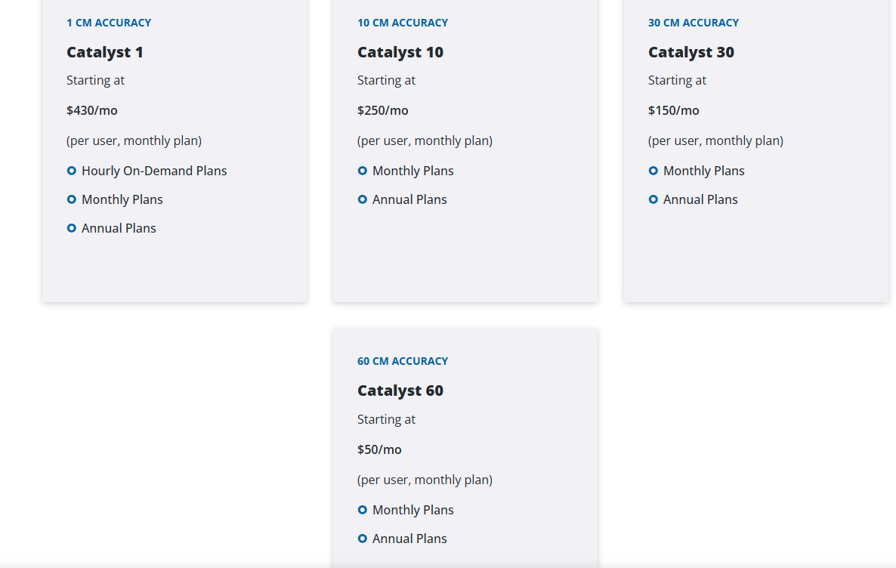{#fig-tipos_subscripcion}

## Preparación del Dispositivo Móvil para Colección de Datos

### Instalación y configuración de aplicaciones

Instalación de la aplicación **Trimble Mobile Manager** en un dispositivo móvil.

{#fig-tmm}

### Android: Activación de ubicación simulada

En caso de colectar los datos desde un dispositivo Android es necesario seguir los siguientes pasos para activar **Trimble Mobile Manager** como **Aplicación de Ubicación Simulada** (*Mock Location App*).

Sin la opción *Mock Location App* habilitada en el dispositivo Android, al abrir la aplicación **Trimble Mobile Manager** mostrará el mensaje desplegado en [@fig-configuracion_android]. Para verificar este mensaje, en TMM se puede acceder a las opciones de menú y seleccionar `Settings`. Ver [@fig-opciones_tmm].

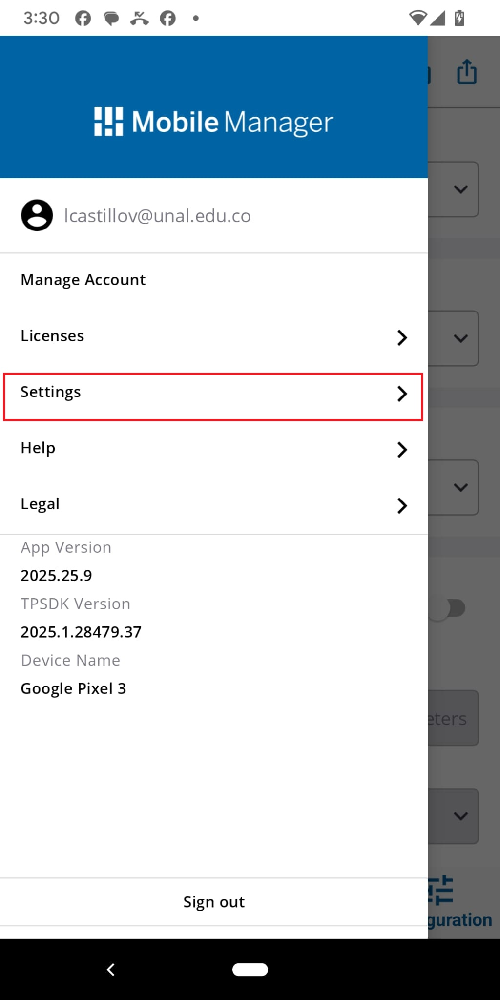{#fig-opciones_tmm width=40%}

Aparecerá la pantalla mostrada en [@fig-configure_location_sharing]. Seleccionar la opción `Configure Location Sharing`.

{#fig-configure_location_sharing width=40%}

El siguiente mensaje indica que es necesario configurar en el equipo Android las **opciones de desarrollador** y seleccionar la **Aplicación de Ubicación Simulada** antes de continuar:

{#fig-configuracion_android width=40%}

Para realizar esas configuraciones en el dispositivo Android, realice los pasos descritos en [@fig-configuracion_android] dependiendo de la versión Android del sistema.

**Procedimiento genérico**

* Activar las opciones de desarrollador en Android (Ir a `Configuración` -> `Sistema y actualizaciones`).
* Ir a `Opciones de Desarrollador` y seleccionar `Seleccionar Aplicación de Ubicación Simulada` (`Select mock location app`) ([@fig-ubicacion_simulada]).

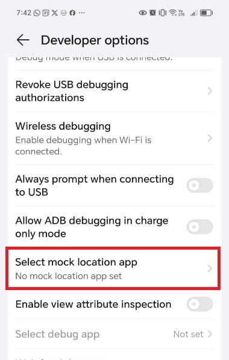{#fig-ubicacion_simulada}

* Seleccionar **Trimble Mobile Manager** como **Aplicación de Ubicación Simulada** ([@fig-tmm_mock_location_app]).

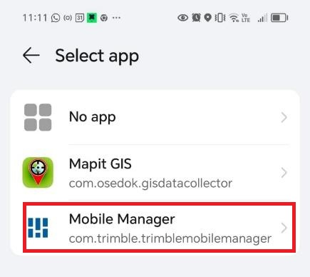{#fig-tmm_mock_location_app}

**Procedimiento en Pixel 3**

Habilite las opciones de desarrollador en el equipo:

* `Settings`

{#fig-pixel_settings width=40%}

* `Settings` -> `About Phone`

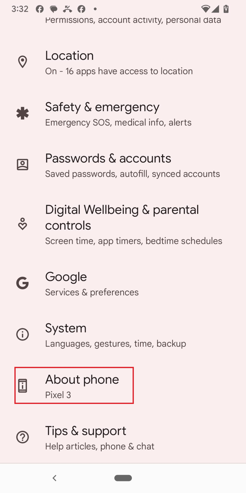{#fig-pixel_settings_2 width=40%}

* Presione rápidamente 7 veces en `Build number`

{#fig-pixel_build_number width=40%}

* Escriba la clave del teléfono
* Aparecerá un mensaje temporal: **You are a developer**

Seleccionar Aplicación de Ubicación Simulada:

* `Settings` -> `System` -> `{} Developer Options` -> `Select mock location app`
* Y seleccione `Mobile Manager`

### iPhone

**Trimble Mobile Manager** funciona con iPhone y iPad. La aplicación está disponible en la App Store y es compatible con iOS 13.0 o posterior.

Aspectos clave de Trimble Mobile Manager en iOS:

* Compatibilidad: Funciona con iPhone y iPad (iOS 13.0+).
* Conexión: Se conecta vía Bluetooth.
* Permite configurar correcciones en tiempo real (NTRIP) y gestionar licencias.
* Es posible usarlo con aplicaciones habilitadas para la ubicación, como Google Maps o Esri ArcGIS, que utilizan la ubicación del sistema operativo.
* Se descarga directamente desde la App Store. 
* Al utilizar el receptor DA2 en iOS, se recomienda no aplicar transformaciones de salida de datos GNSS dentro de Trimble Mobile Manager, ya que estas son ignoradas en la configuración de servicios de ubicación de iOS.

## Funcionamiento del Trimble Catalyst DA2

### Contenido de la caja

{#fig-contenido_caja}

a) Receptor GNSS
b) Power bank
c) Adaptador para bastón de topografía
d) Abrazadera de plástico
e) Correas de caucho para adaptar bastón de topografía
f) Cable de carga de power bank

### Pasos para su uso

* Asegúrese que la batería del Catalyst DA2 tenga suficiente carga.
* Sincronice el dispositivo Android con el Catalyst DA2
    * Encender el Catalyst DA2 
    * Activar el Bluetooth en el dispositivo móvil.
    * Emparejar los dispositivos

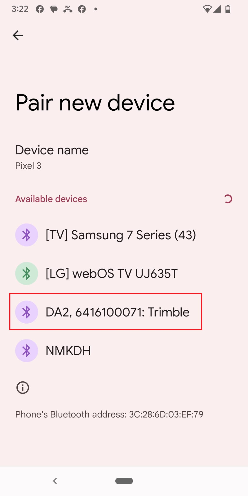{#fig-pair_da2_phone width=40%}

* Abrir la aplicación Trimble Mobile Manager (TMM) y presione el botón `Select` para seleccionar la antena previamente emparejada por Bluetooth.

{#fig-home_window_tmm width=40%}

* El sistema pedirá las credenciales. Se debe iniciar sesión con Trimble ID y verificar la licencia activa.

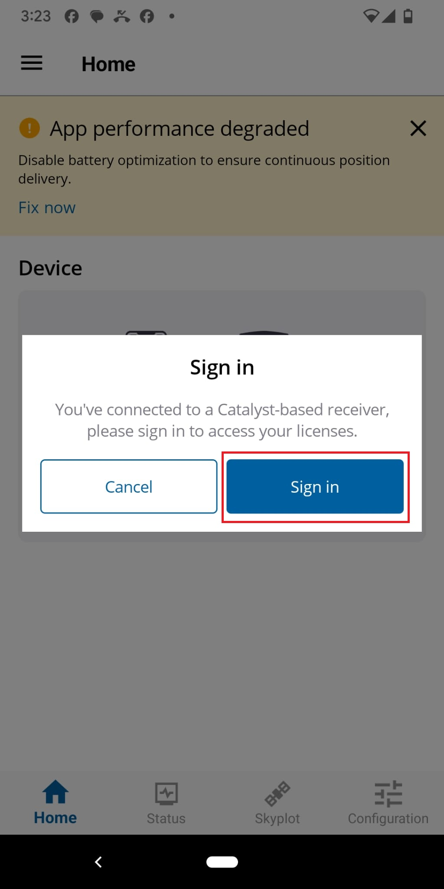{#fig-start_credentials_tmm width=40%}

{#fig-credentials_tmm width=40%}

* Conectar el DA2 en TMM y confirmar la conexión GNSS. Después de un registro exitoso, la pantalla de inicio mostrará la antena Catalyst DA2.

{#fig-da2_connected}

{#fig-home_window_tmm_2 width=40%}

* Esperar la convergencia y validar la exactitud posicional del dispositivo.

{#fig-tmm_skyplot_1}

{#fig-tmm_status_1}

{#fig-tmm_skyplot_2}

{#fig-tmm_status_2}

::: {#fig-tmm-configuracion layout-ncol=2}

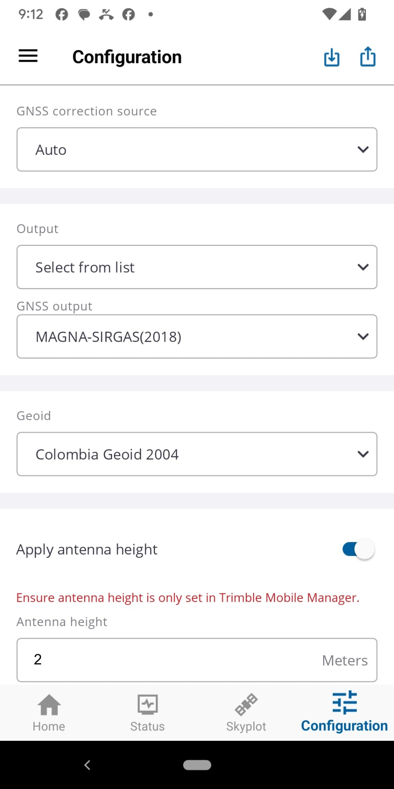{#fig-tmm_1}

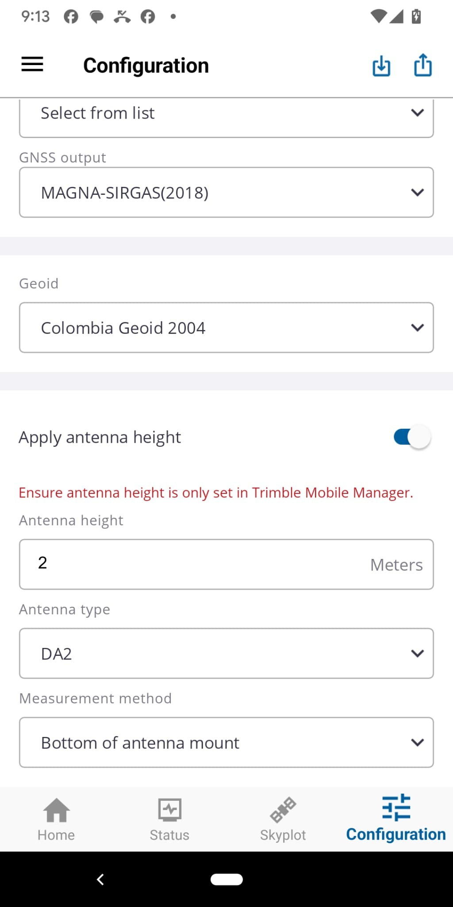{#fig-tmm_2}

Configuración típica de TMM para un levantamiento en Colombia (2026)
:::

### Opciones de configuración antes de la colecta de datos

La correcta parametrización del sistema es fundamental para garantizar la interoperabilidad de los datos con el marco geodésico nacional. Antes de iniciar la captura en campo, se deben verificar los siguientes ajustes en la sección de configuración.

**Selección del marco de referencia (GNSS output)**

La aplicación ofrece dos variantes para el sistema de referencia nacional. La elección debe basarse en la vigencia normativa:

* **MAGNA-SIRGAS:** Esta opción generalmente refiere a la época de referencia original (1995.0). Su uso en proyectos actuales no es recomendado, ya que no contempla los efectos del desplazamiento tectónico acumulado durante las últimas tres décadas.
* **MAGNA-SIRGAS(2018) (EPSG: 4686):** Es la selección obligatoria para cualquier proyecto en territorio colombiano. Corresponde a la actualización definida en la Resolución 715 de 2018 del IGAC, permitiendo que las coordenadas obtenidas sean consistentes con la Red Geodésica Nacional activa.

**Definición del modelo de referencia vertical (Geoid)**

El software permite seleccionar la superficie de referencia para el cálculo de alturas físicas. La precisión vertical dependerá directamente de esta elección:

* **Colombia Geoid 2004:** Se debe seleccionar esta opción específica en el menú desplegable. Este modelo es la implementación digital del **GEOCOL2004**, el modelo geoidal gravimétrico oficial desarrollado para Colombia. Al utilizar datos de gravedad locales, ofrece una precisión significativamente superior en la conversión de alturas elipsoidales a ortométricas dentro del territorio nacional.
* **EGM96 (Global):** No se considera una opción óptima para aplicaciones de ingeniería en Colombia. Al ser un modelo global de baja resolución, omite variaciones locales del campo gravitatorio, especialmente críticas en las zonas cordilleranas, lo que introduce errores métricos en la altura final.
* **GEOID18 Colombia:** (No disponible) En la configuración de Trimble para Colombia, este modelo representa la evolución hacia superficies de referencia de mayor resolución y precisión (modelos híbridos). Si el flujo de trabajo exige los estándares más rigurosos de la geodesia moderna y el software permite su activación, es la opción preferencial sobre modelos anteriores.

#### Determinación del método de medición (Measurement method)

{#fig-tmm_mm width=40%}

El punto de referencia vertical debe coincidir con el accesorio físico utilizado para soportar la antena Trimble Catalyst DA2. La omisión de este ajuste genera un error sistemático en la elevación de todos los puntos capturados.

* **Bottom of antenna mount:** Configuración estándar cuando la antena está instalada sobre un jalón convencional o un trípode. La altura ingresada por el operador debe medirse desde la marca en el terreno hasta la base del tornillo de montaje (parte inferior de la antena).
* **Bottom of Catalyst antenna handle:** Selección exclusiva para el uso del accesorio de mano (handle) de Trimble. El sistema compensa automáticamente el desfase vertical interno del accesorio.
* **Yellow/white split line:** Utilizado para el registro de la altura inclinada (slant height) mediante el uso de la cinta métrica integrada en ciertos soportes, facilitando la medición cuando el acceso vertical directo está obstruido.

**Resumen de configuración recomendada**

Para la ejecución de levantamientos técnicos en Colombia, se debe asegurar la siguiente configuración en el receptor:

| Campo de configuración | Valor seleccionado | Justificación técnica |
| :--- | :--- | :--- |
| GNSS output | MAGNA-SIRGAS(2018) | Cumplimiento Res. 715 de 2018 (IGAC). |
| Geoid | Colombia Geoid 2004 | Implementación local de GEOCOL2004. |
| Measurement method | Bottom of antenna mount | Uso estándar con jalón de 2.00 m. |
| GNSS correction source | Auto / Trimble RTX | Asegura convergencia submétrica/centimétrica. |

## Precisión submétrica en la antena Trimble Catalyst DA2

La arquitectura del sistema Trimble Catalyst DA2 difiere de receptores GNSS convencionales al emplear una plataforma de posicionamiento definido por software. En este esquema, la antena actúa como captador de señales digitales de banda base, mientras que el procesamiento geodésico y la aplicación de correcciones se ejecutan en el procesador del dispositivo móvil mediante el servicio Catalyst.

La obtención de precisión submétrica (o centimétrica, según la suscripción) se logra a través de la integración de dos flujos de corrección principales:

* **Trimble RTX (Real-Time eXtended):** Método por defecto del sistema. Utiliza una red global de estaciones de referencia para modelar errores atmosféricos y de satélite, transmitiendo las correcciones vía satélite (banda L) o internet (IP). Elimina la dependencia de una estación base local o redes terrestres.
* **Protocolo NTRIP (Networked Transport of RTCM via Internet Protocol):** Permite al receptor vincularse a redes de estaciones de referencia de operación continua (CORS), como la red MAGNA-ECO del IGAC en Colombia. Al recibir correcciones diferenciales en formato RTCM 3.x a través de la conexión de datos del dispositivo móvil, el sistema puede alcanzar convergencia de alta precisión en entornos con infraestructura terrestre disponible.

### Identificación del estado de corrección

Para determinar la fuente de corrección activa en la interfaz de Trimble Mobile Manager (TMM), es necesario inspeccionar la sección central de la pantalla denominada **Correction Status**. En la captura de pantalla analizada ([@fig-tmm_submetrica]), se observan los indicadores técnicos que confirman el método de posicionamiento empleado.

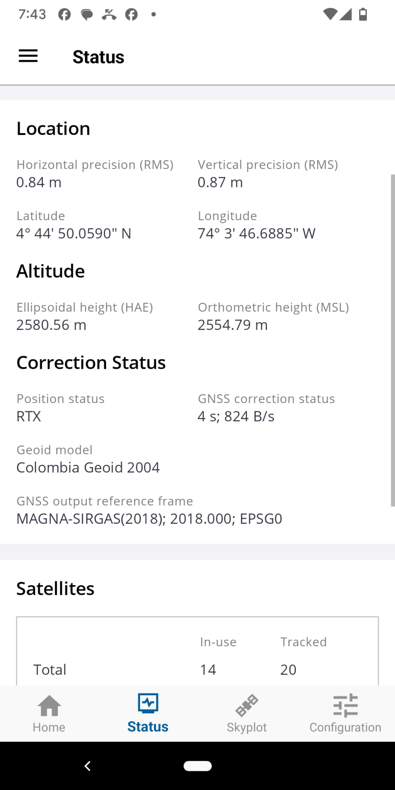{#fig-tmm_submetrica width=40%}

La validación del método se realiza mediante dos campos específicos presentes en la interfaz:

* **Position status:** Este campo indica explícitamente el motor de posicionamiento en uso. En el registro, el valor es **RTX**, lo que confirma que el receptor utiliza la tecnología de corrección satelital global de Trimble en lugar de una base local o red terrestre vía NTRIP.
* **GNSS correction status:** Presenta el estado del flujo de datos de corrección. El valor **4 s; 824 B/s** indica la edad de la corrección (latencia de 4 segundos) y la tasa de transferencia de datos recibida. En flujos RTX vía IP o satélite, estos valores son típicos para mantener la convergencia de la solución.

### Análisis de la precisión obtenida

La precisión submétrica observada en la sección **Location** es el resultado directo del proceso de convergencia de los algoritmos RTX:

* **Precisión horizontal (RMS):** 0.84 m.
* **Precisión vertical (RMS):** 0.87 m.

Estos valores indican que el sistema alcanzó una solución estable dentro del rango submétrico. Si el sistema utilizara NTRIP, el campo *Position status* mostraría etiquetas como **DGPS**, **RTK Float** o **RTK Fixed**, dependiendo de la calidad del enlace y la distancia a la estación base. En este escenario, el receptor DA2 opera de manera autónoma respecto a redes locales, dependiendo de la infraestructura global de Trimble para corregir efemérides y retardos atmosféricos.

La precisión final está vinculada a la suscripción activa en la cuenta de Trimble ID. Aunque el hardware DA2 es capaz de alcanzar exactitudes de 1 cm, el motor de software limita la salida de datos al umbral contratado (ej. Catalyst 30 o Catalyst 60). La convergencia de la señal indica el momento en que los algoritmos resuelven las ambigüedades necesarias para cumplir con el estándar de precisión requerido.

### Validación de la cadena de corrección GNSS

El uso de aplicaciones de terceros exige verificar que las correcciones RTX estén fluyendo correctamente hacia el software de captura.

* Mantener Trimble Mobile Manager en ejecución en segundo plano para asegurar el enlace ininterrumpido y la convergencia de la señal.
* Asegurar que el motor de ubicación interno de QField, SW Maps o KoboCollect esté configurado para leer los "Servicios de ubicación de Android" (Location Services) y no intente establecer una conexión Bluetooth paralela con el DA2, lo cual generaría conflictos de puerto.

## Alternativas de Software para levantamiento en campo

### Opciones de aplicaciones de captura 

A continuación, se presentan herramientas de código abierto y de uso libre ampliamente validadas en operaciones geomáticas.

* **QField:** Operando como el cliente móvil de QGIS, permite una integración directa con entornos de escritorio para proyectos de mayor complejidad.
    * Facilita la configuración de formularios relacionales, dominios de valor y reglas de topología antes de la salida a campo.
    * Opera nativamente con contenedores GeoPackage (GPKG), eliminando la dependencia de múltiples archivos y permitiendo el renderizado de simbología compleja en campo.
    * Consume la ubicación simulada del sistema operativo sin requerir configuración adicional de puertos COM virtuales.
* **SW Maps:** Herramienta enfocada específicamente en topografía y captura de datos con receptores GNSS externos.
    * Permite la importación directa de datos vectoriales (shapefiles, KMZ, GPKG) y la configuración de mapas base mediante conexiones a servicios WMS o almacenamiento en caché local (MBTiles).
    * Almacena automáticamente la metadata del posicionamiento en la tabla de atributos, registrando variables críticas como HRMS, VRMS y el número de satélites en el momento exacto de la captura del vértice.
* **KoboToolbox:** Plataforma basada en el estándar ODK, diseñada fundamentalmente para la recolección exhaustiva de datos mediante formularios complejos.
    * Destaca en la captura estructurada de atributos condicionales, reglas de dependencia (skip logic) y variables cualitativas.
    * Su integración con la ubicación simulada permite capturar coordenadas con exactitud RTX, registrando la ubicación como un atributo más dentro del formulario, aunque su interfaz no está orientada a la visualización cartográfica ni a la interacción topológica.
* **Avenza Maps:** Versiones iniciales de esta herramienta la hicieron muy popular para la captura de coordenadas en campo, sin embargo, la versión actual (2026) limita el uso de esas opciones a la versión con licencia.

### Análisis comparativo de herramientas

| Característica evaluada | QField | SW Maps | KoboToolbox |
| :--- | :--- | :--- | :--- |
| **Enfoque principal** | SIG móvil y topología espacial | Topografía y captura de precisión | Recolección de datos y encuestas |
| **Gestión de geometrías** | Avanzada (edición de nodos, polígonos) | Intermedia (puntos, líneas continuas) | Básica (coordenada como atributo) |
| **Registro de metadata GNSS** | Requiere configuración de variables | Automático (HRMS, VRMS nativo) | Posible mediante código XLSForm |
| **Visualización cartográfica** | Alta (renderizado exacto de escritorio) | Media (servicios WMS, ráster local) | Muy limitada (mapa base referencial) |

### Recomendación para la práctica

Para el objetivo específico de registrar puntos a lo largo del borde de una vía, el requerimiento central es la captura geométrica secuencial y el control topológico, no el diligenciamiento de cuestionarios extensos. Por esta razón, KoboToolbox se descarta para esta operación en particular.

La herramienta recomendada es **SW Maps**. Su principal ventaja para este caso de uso radica en su simplicidad operativa y su capacidad para registrar automáticamente los valores de dilución de precisión (HRMS y VRMS) para cada punto capturado sobre el borde de la vía, garantizando el control de calidad geodésica sin requerir configuraciones complejas previas. Alternativamente, si se requiere visualizar el trazado geométrico en tiempo real interactuando con capas base vectoriales preexistentes, **QField** resulta la opción metodológica más robusta.

## SW Maps

[Video guía](https://youtu.be/syvzv8sMBSI) de uso rápido en español: `https://youtu.be/syvzv8sMBSI`

> Nota: De los tipos de capas usadas en el levantamiento (`GNSS Recorded Feature` y `Drawn Feature`), al parecer la única que se despliega en pantalla durante el levantamiento es `Drawn Feature`.

{#fig-sw_maps_inicio width=40%}

* (1) Menú principal
* (2) Menú secundario (`Projects` y `Take Photo`)
* (3) Lista de capas
* (4) Capturar datos GNSS (`Record Feature` (Punto) y `Record Track` (línea))
* (5) Skyplot GNSS
* (6) Precisión de la captura GNSS
* (7) Opciones adicionales de captura (Capas tipo `Drawn Feature`)

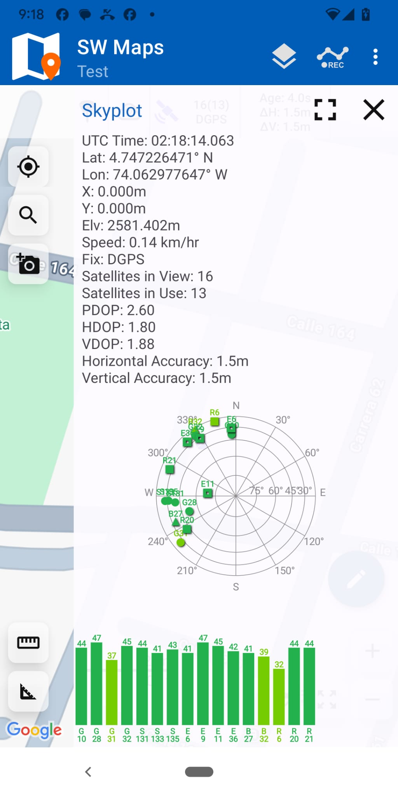{#fig-sw_maps_skyplot width=40%}

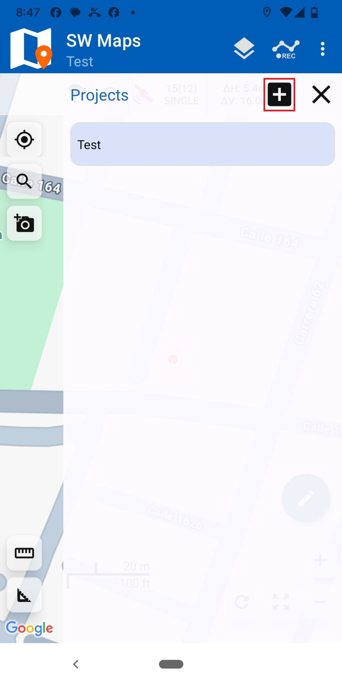{#fig-sw_maps_proyectos width=40%}

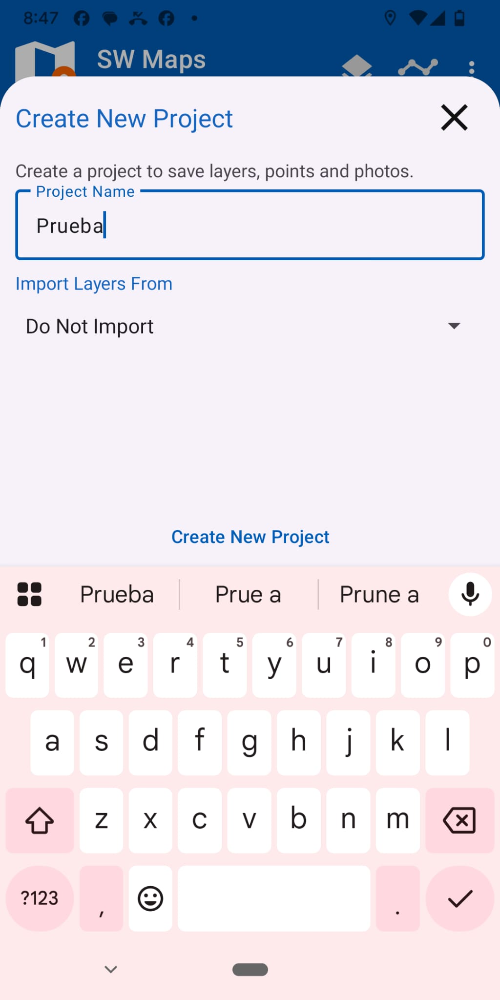{#fig-sw_maps_agregar_proyecto width=40%}

{#fig-sw_maps_agregar_capas width=40%}

{#fig-sw_maps_tipos_capas width=40%}

{#fig-sw_maps_capa_ventana width=40%}

{#fig-sw_maps_edit_capa width=40%}

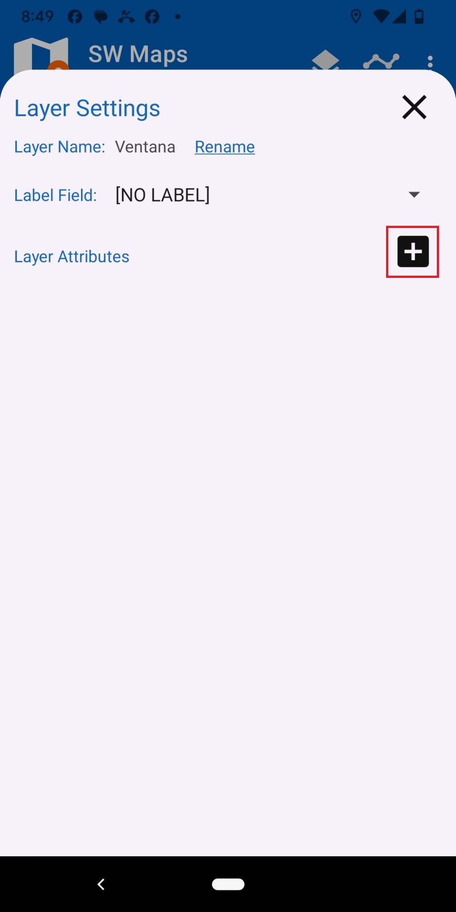{#fig-sw_maps_atributos_capa width=40%}

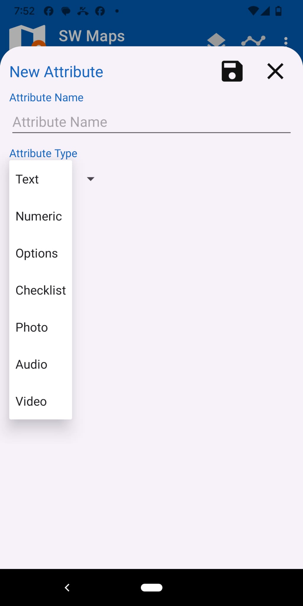{#fig-sw_maps_tipos_atributo width=40%}

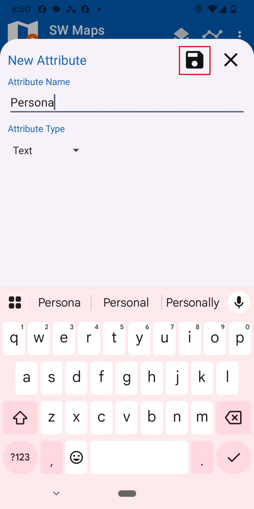{#fig-sw_maps_save_attribute width=40%}

{#fig-sw_maps_attr_options width=40%}

{#fig-sw_maps_attr_photo width=40%}

{#fig-sw_maps_all_attrs width=40%}

{#fig-sw_maps_drawn_feature width=40%}

{#fig-sw_maps_add_trees_layer width=40%}

{#fig-sw_maps_edit_trees_layer width=40%}

{#fig-sw_maps_add_attr_type_trees width=40%}

{#fig-sw_maps_add_attr_diameter width=40%}

{#fig-sw_maps_tree_attibutes width=40%}

{#fig-sw_maps_record_gnss width=40%}

{#fig-sw_maps_save_coord width=40%}

{#fig-sw_maps_confirm_save_coord width=40%}

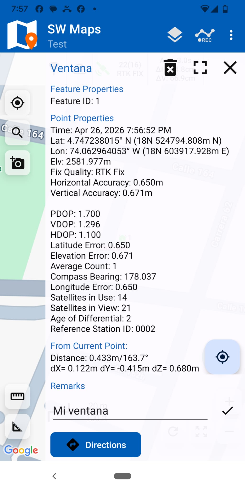{#fig-sw_maps_precision width=40%}

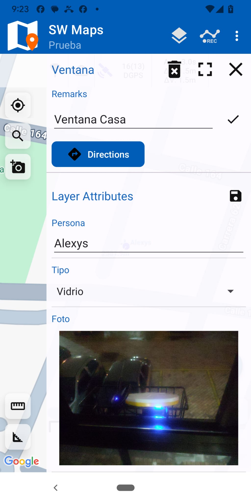{#fig-sw_maps_photo width=40%}

{#fig-sw_maps_view_attributes width=40%}

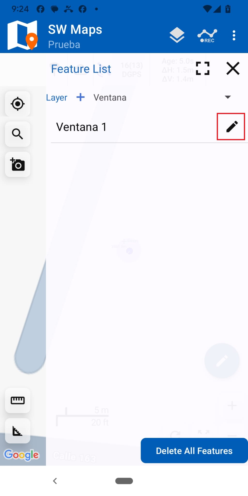{#fig-sw_maps_edit_layer width=40%}

En [@fig-sw_maps_drawn_layers_additional_options] se muestran algunas opciones adicionales de mapeo para layers tipo `Drawn Feature`:

{#fig-sw_maps_drawn_layers_additional_options width=40%}

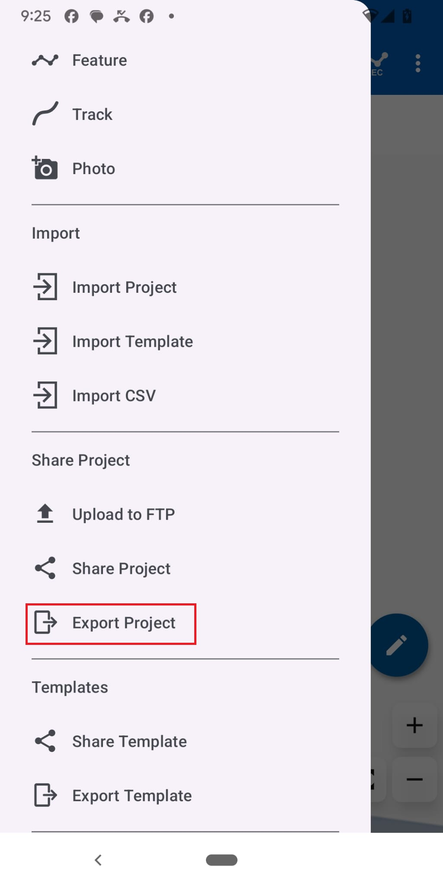{#fig-sw_maps_exportar_proyecto width=40%}

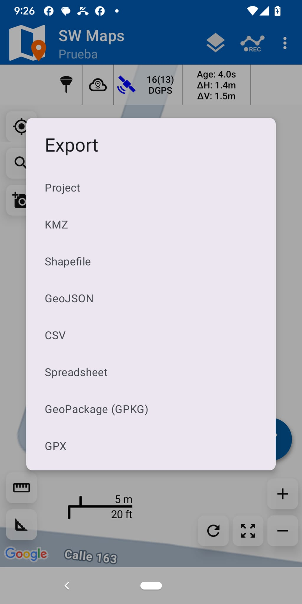{#fig-sw_maps_formatos_exportacion width=40%}

{#fig-sw_maps_exportar_kml width=40%}

Los proyectos exportados se almacenarán en una carpeta similar a la siguiente:

* `Android/media/np.com.softwel.swmaps/SWMaps/Export`

{#fig-sw_maps_exportar_csv width=40%}

> Nota técnica: El proyecto exportado contendrá tanto coordenadas geográficas como planas.
>
> * Las coordenadas geográficas reportadas corresponderán al marco de referencia configurado previamente en Trimble Mobile Manager (TMM). Estas constituyen el dato primario y riguroso a emplear durante el procesamiento del levantamiento.
> * Las coordenadas planas son calculadas de forma dinámica por el motor interno de SW Maps. Dado que esta proyección al vuelo puede presentar discrepancias con los parámetros definidos en TMM, se recomienda descartar dichos valores y ejecutar la proyección cartográfica pertinente utilizando un software SIG en la fase de trabajo de oficina.

En la @fig-sw_maps_coordenadas_1 y la @fig-sw_maps_coordenadas_2 se ilustra la interfaz para la configuración de coordenadas planas en SW Maps. Como se indicó anteriormente, la alteración de estos parámetros carece de relevancia para la integridad técnica del levantamiento, debiendo priorizarse siempre el registro inalterado de la coordenada geográfica. Para acceder a esta configuración, con el proyecto de interés activo, se debe ingresar al `menú principal` ((1) en [@fig-sw_maps_inicio]) y seleccionar la opción `Project Settings` identificada con el icono de engranaje.

{#fig-sw_maps_coordenadas_1 width=40%}

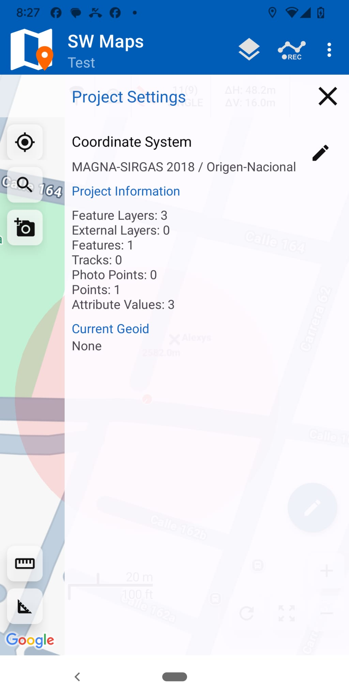{#fig-sw_maps_coordenadas_2 width=40%}

## Equipos adicionales usados en la práctica

* Receptor GNSS incorporado en teléfonos celulares

    * Puede usar la aplicación SW Maps para el mapeo

* Navegador Garmin 64:

    * En este [enlace](https://www.youtube.com/watch?v=EOU08INBgDw) encontrará un video con una primera aproximación al uso del navegador Garmin 64s. 
    * En este segundo [enlace](https://www.youtube.com/watch?v=6UsihIWJ2js) encontrará un video que le guiará sobre cómo medir un track usando un navegador GARMIN . 
    * En este tercer [enlace](https://www.youtube.com/watch?v=1-WRD20kSNo) encontrará las instrucciones para medir un área usando el navegador Garmin 64.

## Archivos Resultantes

* Levantamiento antena Trimble Catalyst DA2: `Unal20.kmz`, `Unal20.zip`
* Red Geodésica Universidad Nacional de Colombia - Sede Bogotá: `red_geodesica_unal.txt`
