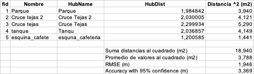

# Evaluación de exactitud posicional de levantamientos GNSS

::: {.callout-note}
## Referencia del material original

El presente documento constituye una adaptación de la guía técnica suministrada por la docente *Liliana Carolina Castillo Villamor, PhD*, titulada "Taller 2: Colección de datos en campo y evaluación de la exactitud posicional". Este material académico corresponde a la asignatura Geomática Básica (2015896), Grupo 3, de la Universidad Nacional de Colombia para el periodo I-2026.
:::

El presente capítulo detalla la metodología analítica para cuantificar el error posicional de diferentes receptores GNSS. El flujo de trabajo se divide en dos fases de control geométrico: una evaluación de exactitud absoluta sobre un vértice geodésico estático y una evaluación de exactitud relativa sobre el trazado cinemático de un corredor vial.

## Definición de los conjuntos de datos y equipos

Para el análisis, se dispone de la información recolectada en terreno mediante cuatro configuraciones instrumentales distintas:

* Receptor geodésico AllyNav R26 (operado inicialmente como base estática y posteriormente como rover cinemático).
* Receptor Trimble Catalyst DA2 acoplado al software SW Maps.
* Navegador de mano Garmin GPSMAP 64s.
* Receptor GNSS integrado de un dispositivo móvil celular operando con la aplicación SW Maps.

## Parámetros geodésicos y configuración de referencia

El vértice geodésico de control estático corresponde al punto "GPS-001 DODF". Las coordenadas geográficas oficiales de referencia están definidas en el sistema MAGNA-SIRGAS (ITRF2014, época 2018.0, elipsoide GRS-80), con valores de latitud 4°38'8.28035" N y longitud 74°5'10.78854" W. Ver datos originales en el siguiente mapa de la [Red Geodésica Universidad Nacional de Colombia - Sede Bogotá](https://elkincanon.com.co/red-magna-eco-pasiva-unal)

Para la captura con el equipo Trimble Catalyst DA2, la aplicación Trimble Mobile Manager (TMM) operó bajo la siguiente configuración rigurosa:

* Fuente de corrección GNSS: Automática (Trimble RTX).
* Salida de coordenadas (GNSS output): MAGNA-SIRGAS(2018).
* Modelo de referencia vertical (Geoid): Colombia Geoid 2004.
* Altura de instrumento: 2.00 metros (medición a la base del soporte de la antena - "Bottom of antenna mount").

Conforme a las directrices de la captura, los datos exportados desde SW Maps contienen tanto atributos geográficos como métricos. Para garantizar el rigor topológico, es importante trabajar exclusivamente con las coordenadas geográficas nativas generadas por la antena, ignorando las coordenadas planas calculadas al vuelo por la aplicación móvil. La transformación a coordenadas planas se debe ejecutar posteriormente en el software de escritorio.

## Evaluación de exactitud absoluta (punto de control estático)

El objetivo de esta fase es determinar la desviación métrica de las coordenadas capturadas en modo estático por los cuatro dispositivos frente al valor real o verdad terreno (*ground truth*). 

### Procedimiento analítico

1. Importar el archivo de texto con las coordenadas oficiales y las capas vectoriales de los puntos estáticos capturados por cada equipo.
2. Proyectar todos los conjuntos de datos hacia el sistema métrico Origen Nacional CTM-12 (EPSG: 9377). Se debe realizar la reproyección en el software SIG a partir de las coordenadas geográficas originales de los levantamientos.
3. Utilizar herramientas de geoprocesamiento de proximidad para calcular el vector de desplazamiento lineal entre la coordenada observada por cada equipo y la coordenada oficial del vértice GPS-001 DODF.
4. Exportar la tabla de atributos resultante a una hoja de cálculo para el análisis estadístico.

## Evaluación de exactitud relativa (levantamiento cinemático de vía)

En la captura de trayectorias en movimiento, la superposición exacta de vértices entre diferentes equipos es improbable. Para solucionar esta divergencia espacial sin recurrir a la homologación manual de puntos, se debe estructurar una geometría de control continua.

Dado el rigor topológico del receptor Trimble Catalyst DA2, la nube de puntos registrada por este equipo se establecerá como la geometría de referencia (línea base) para evaluar los demás dispositivos.

### Procedimiento de control geométrico

1. Importar los archivos correspondientes a los levantamientos cinemáticos del borde de la vía.
2. Ejecutar la herramienta de conversión topológica de puntos a líneas utilizando exclusivamente los vértices capturados con el equipo Trimble Catalyst DA2. Es necesario que los puntos posean un campo de ordenamiento secuencial temporal para garantizar la continuidad topológica de la polilínea.
3. Emplear algoritmos de análisis espacial (ej. Distancia al eje más próximo) para calcular la distancia perpendicular más corta desde cada vértice capturado por los equipos en evaluación (AllyNav rover, Garmin, celular) hacia la polilínea de referencia (Trimble).
4. Exportar las tablas de distancias generadas a una hoja de cálculo.

# Cálculo de error y reporte estadístico (estándar NSSDA)

Esta sección se basa en los lineamientos establecidos en el estándar [NSSDA](https://drive.google.com/file/d/10UfuplM7oR2_8qesRfPFWx-XrpwMhWWh/view?usp=drive_link), archivo `National_Standard_for_Spatial_Data_Accuracy.pdf`. Se recomienda revisar dicho documento y seguir las instrucciones allí indicadas para ejecutar el cálculo de la exactitud posicional.

El estándar requiere consolidar los desplazamientos calculados previamente ($d_i$) para derivar el Error Cuadrático Medio (RMSE) mediante la siguiente expresión matemática:

$$RMSE = \sqrt{\frac{\sum_{i=1}^{n} d_i^2}{n}}$$

Donde $d_i$ representa la distancia métrica entre la posición observada y la de referencia (ya sea el desplazamiento radial hacia el punto estático o la proyección ortogonal a la polilínea de la vía), y $n$ corresponde al tamaño de la muestra de puntos evaluados.

### Estimación de la exactitud horizontal

A partir del valor RMSE, se debe estimar la exactitud horizontal al nivel de confianza del 95% ($Accuracy_r$). El estándar NSSDA define la siguiente relación matemática, asumiendo estadísticamente que los errores en los componentes espaciales se distribuyen de manera normal y son independientes ($RMSE_x = RMSE_y$):

$$Accuracy_r = 1.7308 \times RMSE$$

En la @fig-ejemplo_excel se presenta un modelo tabular para estructurar el cálculo del estadístico RMSE y la exactitud horizontal en una hoja de cálculo, tomando como insumo los desplazamientos lineales derivados del análisis espacial.

{#fig-ejemplo_excel width=80%}

El reporte final (qmd, html, pdf en GitHub) debe estructurarse mediante tablas comparativas que consoliden los valores de exactitud absoluta y relativa para cada equipo evaluado. El análisis debe sustentar técnicamente la degradación geométrica generada al transitar desde equipos de topografía geodésica hacia receptores de navegación e instrumentos de consumo masivo.