# Flujos de trabajo desde ArcGIS Pro hacia ArcGIS Online

## Introducción

### Alcance del taller

El presente taller establece las competencias técnicas para la migración de flujos de trabajo cartográficos desde entornos de escritorio hacia plataformas en la nube. Se abordará la estructuración de bases de datos espaciales, la optimización de simbología dependiente de la escala y la publicación diferenciada de servicios de entidades (*Web feature layers*) y servicios de teselas vectoriales (*Vector tile layers*). El ejercicio concluye con la integración de estos componentes en un mapa web operativo dentro de ArcGIS Online.

### Resumen de flujos de trabajo y tipologías de servicios

La correcta ejecución del taller requiere comprender la equivalencia entre los conjuntos de datos locales, las opciones de empaquetado en ArcGIS Pro y los servicios web resultantes en la infraestructura de la nube. La selección del tipo de capa determina las capacidades operativas del servicio, la estrategia de almacenamiento y la demanda de procesamiento en el servidor.

La siguiente tabla compendia la totalidad de los tipos de capas web soportados por la plataforma, estructurada a partir de la documentación oficial de [ArcGIS Pro: Introduction to sharing web layers](https://pro.arcgis.com/en/pro-app/3.6/help/sharing/overview/introduction-to-sharing-web-layers.htm), precisando cuáles componentes serán implementados en el desarrollo de este taller.

| Tipo de capa web | Operación en ArcGIS Pro | Endpoint / Servicio en ArcGIS Online | Función y arquitectura del servicio | ¿Implementado en este taller? |
|---|---|---|---|---|
| **Feature layer** | *Share As Web Layer* > *Feature* | Hosted Feature Layer (Feature Service) | Soporta consulta de entidades, visualización dinámica y edición de geometrías/atributos. Idónea para capas operativas vectoriales. | **Sí**, para la capa operativa de poblaciones colombianas (`colombia_poblaciones`). |
| **Tile layer** | *Share As Web Layer* > *Tile* | Hosted Cached Map Service | Visualización rápida mediante teselas ráster prediseñadas y almacenadas en el servidor. Recomendada para imágenes estáticas pesadas o mapas base ráster. | No, se prioriza el formato vectorial por eficiencia en la transferencia de datos. |
| **Vector tile layer** | *Share As Web Layer* > *Vector Tile* | Hosted Vector Tile Layer (Vector Tile Service) | Visualización de alta velocidad basada en teselas vectoriales. Adaptable a la resolución del dispositivo cliente y personalizable mediante estilos sin alterar los datos fuente. | **Sí**, para la estructuración de la cartografía base nacional (`mapa_base_colombia`). |
| **Map image layer** | *Share As Web Layer* > *Map Image* | Dynamic / Cached Map Service | Soporta visualización y consulta de entidades. Dibujado dinámicamente por el servidor o desde caché. Exclusivo de despliegues en ArcGIS Enterprise con datos registrados. | No, requiere arquitectura de servidor federado en ArcGIS Enterprise. |
| **3D tiles layer** | *Share As Web Layer* o caché local | 3D Tiles Service | Diseñada para la visualización optimizada de mallas integradas u objetos 3D complejos en escenas web. | No, el alcance del taller se restringe a representaciones bidimensionales (2D). |
| **Scene layer** | *Share As Web Scene* / *Share As Web Layer* | Cached Scene Service | Optimizado para la consulta y visualización de datos 3D (nubes de puntos, edificios, objetos 3D, datos vóxel e información de mallas). | No, el alcance del taller se restringe a representaciones bidimensionales (2D). |
| **Gaussian splat layer** | Importación de splats 3D | Gaussian Splatting Service | Visualización de alta fidelidad y fotorrealismo para datos geoespaciales 3D basados en geometrías complejas de radiancia. | No, requiere flujos de trabajo específicos de captura de realidad y renderizado 3D avanzado. |
| **Imagery layer** | *Share As Web Layer* > *Imagery* | Dynamic / Cached Image Service | Provee capacidades de visualización, gestión de metadatos, mensuración y procesamiento analítico de imágenes de satélite o sensores remotos. | No, el taller se enfoca exclusivamente en variables vectoriales. |
| **Elevation layer** | *Share As Web Layer* > *Elevation* | Cached Image Service (LERC compression) | Soporta el procesamiento y visualización de fuentes de datos de elevación (DEM/DSM) para definir la superficie del terreno en escenas 3D. | No, no se contemplan análisis de superficies topográficas en esta práctica. |
| **Video layer** | *Share As Web Layer* > *Video* | Video Service | Permite la transmisión y visualización de contenido de video indexado espacialmente. Exclusivo para ArcGIS Video Server. | No, la organización no requiere procesamiento de flujos de video para este ejercicio. |
| **Table** | *Share As Web Layer* > *Table* | Hosted Table (Feature Service) | Almacena y expone datos alfanuméricos no espaciales, permitiendo visualización, filtrado y edición de atributos. | No, las tablas utilizadas se encuentran vinculadas directamente a las geometrías de las capas vectoriales. |


### Estructura de directorios del proyecto

El árbol de directorios del proyecto local debe mantener la siguiente estructura para garantizar la correcta vinculación de recursos:

```text
taller_cartografia_web/
├── datos/
│   ├── colombia_formatos.gdb
│   └── [capas vectoriales: departamentos, poblaciones, drenajes, drenajes_doble]
├── imagenes/
│   ├── 01_configuracion_crs.png
│   ├── 02_simbologia_mapa_base.png
│   ├── 03_publicacion_feature_layer.png
│   ├── 04_publicacion_vector_tiles.png
│   └── 05_mapa_web_final.png
├── taller_cartografia_web.aprx
└── index.qmd

```

### Requisitos previos y materiales

Para el desarrollo de las actividades programadas es indispensable contar con:

* **Software:**
  * ArcGIS Pro (versión 3.0 o superior) con licencia activa (Advanced o Standard).
  * Quarto CLI instalado.
  * Git y cliente GitHub Desktop o línea de comandos.

* **Cuentas y acceso:**
  * Cuenta de organización en ArcGIS Online con privilegios Publisher o Administrator. Nuestra `organización` en ArcGIS Online es `unalmed`
  * Cuenta activa en GitHub.

* **Datos geográficos:**
  * File Geodatabase (`.gdb`) con capas vectoriales de Colombia:
    * Polígonos de departamentos (límites político-administrativos).
    * Polígonos de municipios (límites político-administrativos).
    * Puntos de centros urbanos/cabeceras municipales.
    * Líneas de red hídrica (drenajes principales y secundarios).
      * Líneas (drenajes)
      * Polígonos (drenajes_doble)

## Procedimiento metodológico

### Parte 1: inicialización del proyecto y entorno local

1. **Crear la estructura de directorios**

```bash
mkdir taller_cartografia_web
cd taller_cartografia_web
mkdir datos imagenes

```

2. **Iniciar ArcGIS Pro y crear nuevo proyecto**

* Abrir ArcGIS Pro.
* Seleccionar `File` → `New` → `Project` (plantilla "Map").
* Nombre: `taller_cartografia_web`.
* Ubicación: la carpeta creada anteriormente.
* Seleccionar `Create`.

3. **Vincular la base de datos geográfica**

* En el panel `Catalog`, hacer clic derecho en *Databases*.
* Seleccionar `Add Database`.
* Navegar y seleccionar el archivo `colombia_formatos.gdb`.
* Verificar la conexión en el árbol de `Catalog`.

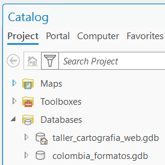{fig-align="center" width="30%"}

4. **Crear dos mapas independientes**

* En el panel `Catalog`, en la sección `Maps`, hacer clic derecho → `New Map`.
* Renombrar como `Mapa_Base` (destino de publicación Vector Tiles).
* Repetir para crear un segundo mapa: `Mapa_Operativo` (destino de publicación Feature Layer).

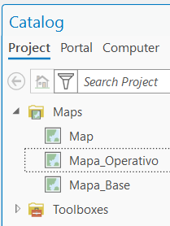{fig-align="center" width="25%"}

5. **Loguearse con ArcGIS Pro**

En el menú `Project` → `Portals`, presionar el botón `Add Portal`

* Escribir la siguiente URL `https://unalmed.maps.arcgis.com/` y presionar `OK`
* En la nueva conexión que aparece al final de la lista como `https://unalmed.maps.arcgis.com/`, dar clic en los tres puntos `...` y presionar `Sign in`.
* Digite su usuario y su clave y presione `Sign in`
* En la nueva conexión `https://unalmed.maps.arcgis.com/`, dar clic nuevamente en `...` y seleccionar `Set as Active Portal`.

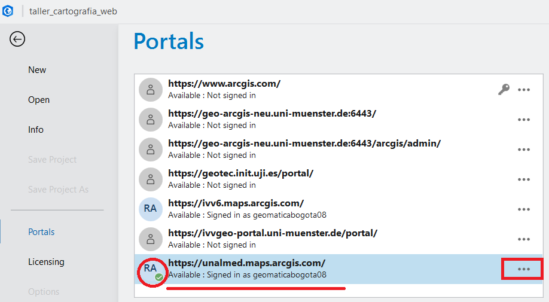{fig-align="center" width="90%"}

::: {.callout-note}
También es posible loguearse a partir del siguiente procedimiento, sin embargo, para poder publicar capas y mapas es necesario registrar el portal y seleccionarlo como activo (procedimiento anterior).
:::

En la parte superior izquierda de ArcGIS Pro realice el proceso de logueo, tal y como se muestra en la siguiente imagen:

* Nombre de la organización: `unalmed`
* Digite su usuario y su clave
* El sistema le solicitará loguearse nuevamente vía explorador Web, y le enviará un mensaje para continuar con ArcGIS Pro.

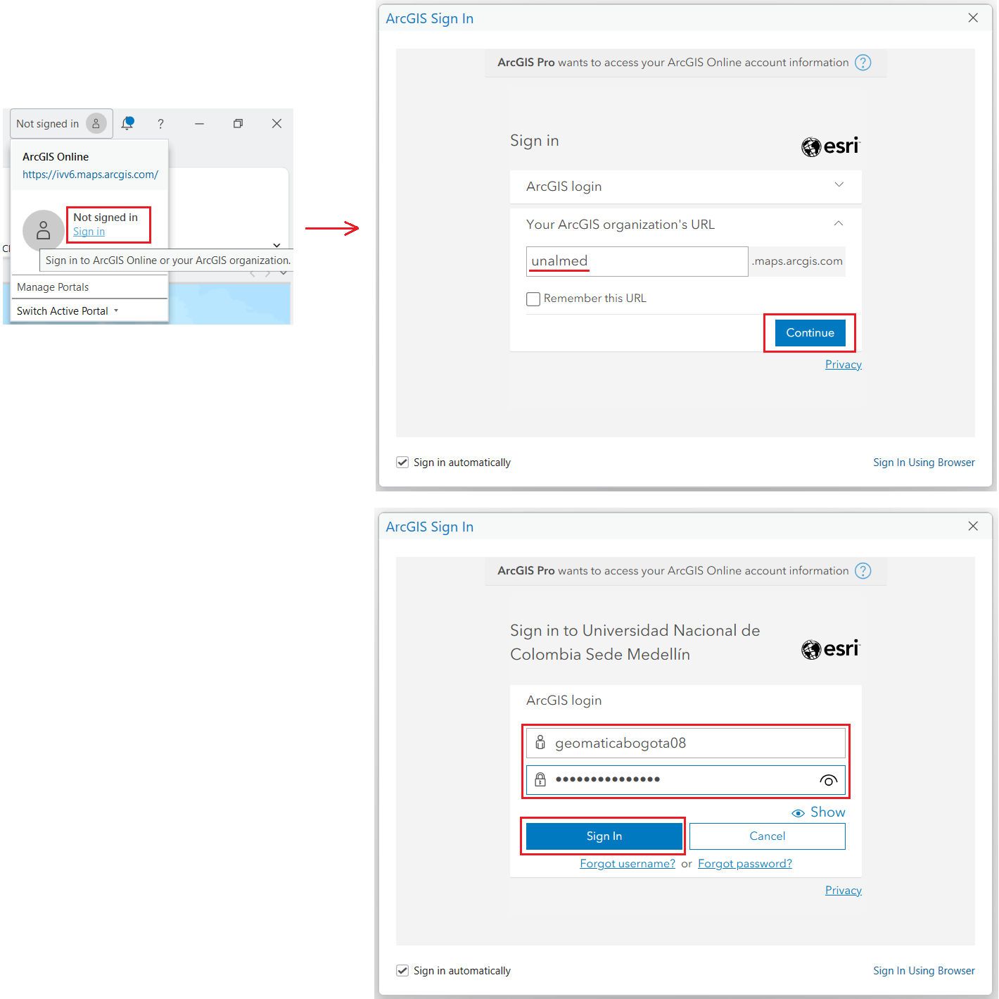{fig-align="center" width="100%"}

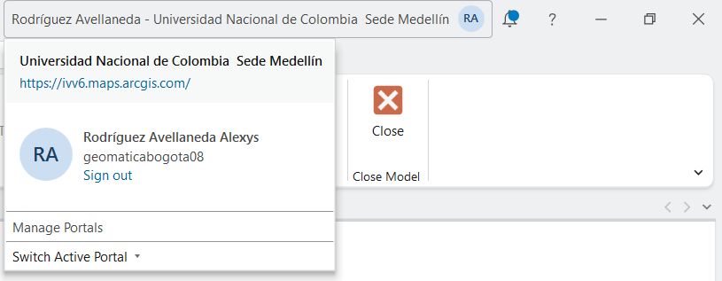{fig-align="center" width="60%"}


### Parte 2: configuración cartográfica y sistema de referencia

1. **Definir el CRS de Mapa_Base**

* Hacer clic derecho en `Mapa_Base` → `Properties`.
* Ir a la pestaña `Coordinate Systems`.
* Seleccionar: MAGNA-SIRGAS / Origen Nacional (EPSG:9377).
* Hacer clic en `Apply` y `OK`.
* **Nota técnica:** Este CRS es fundamental para mantener la precisión geodésica en las coordenadas almacenadas.

2. **Agregar capas base**

* En `Catalog`, expandir `datos` → `colombia_formatos.gdb`.
* Arrastrar a `Mapa_Base`:
  * `departamentos` (polígonos de límites departamentales).
  * `drenajes` (red hídrica).

3. **Configurar rangos de escala (Scale range)**

* **Para `drenajes`:**
  * Hacer clic derecho → `Properties`.
  * Ir a `General`, en la sección `Show the layers between these scales only` en `Minimum Scale (zoomed out)`
  * Seleccionar de la lista desplegable la opción `Customize...`.
  * Agregar la escala `250000`. Presionar `Add` y luego `Ok`.
  * Seleccionar de la lista la escala `1:250,000`.
  * **Justificación:** A escalas pequeñas (nacionales), la densidad de drenajes causa saturación gráfica.

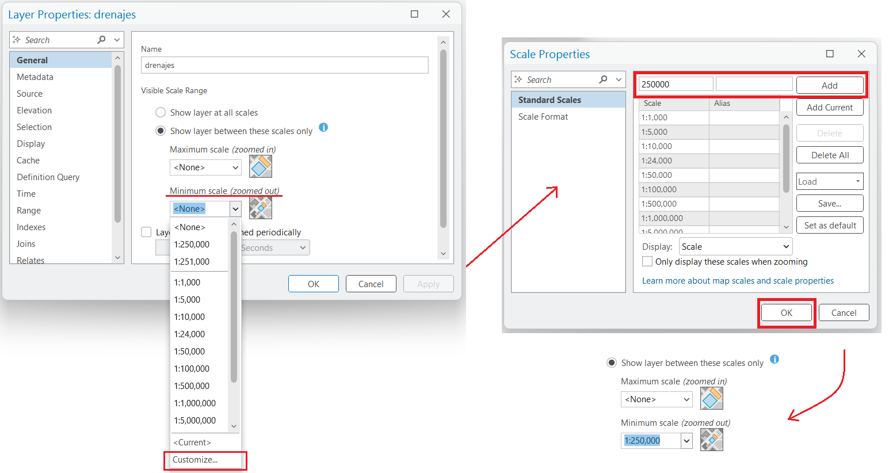{fig-align="center" width="100%"}

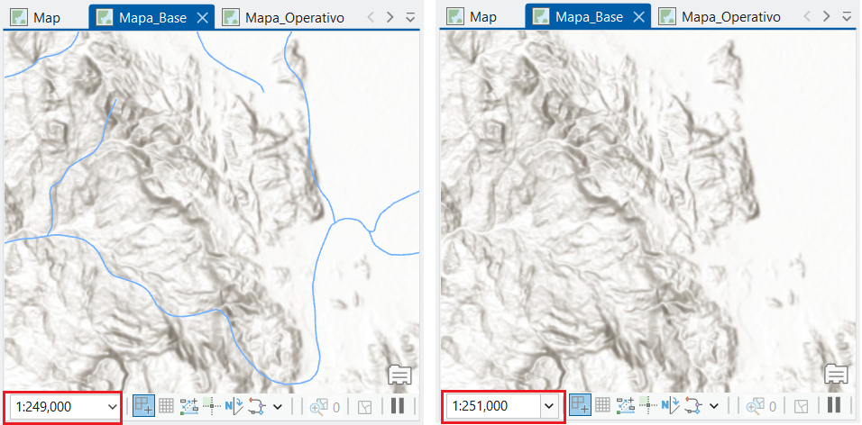{fig-align="center" width="80%"}


* **Para `departamentos`:**
  * Dejar sin restricción (visible en todos los niveles de zoom).

4. **Diseñar simbología del Mapa_Base**

* **Departamentos:**
  * Hacer clic derecho → `Symbology`.
  * Elegir color neutro (gris claro #E0E0E0) con borde gris oscuro (#404040).
  * Transparencia: 10% para permitir visualización de bases cartográficas inferiores.

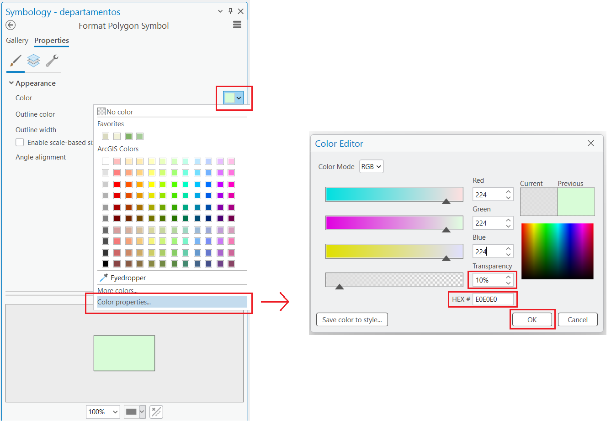{fig-align="center" width="70%"}


* **Drenajes:**
  * Color: azul claro (#4A90E2).
  * Grosor de línea: 1-2 puntos.
  * Aplicar transparencia: 50%.

5. **Configurar etiquetado con Maplex**

* Seleccionar `departamentos`.
* Ir a la banda `Labeling`
* En la margen derecha asegurarse que la etiquetas de la capa `departamentos` esté activada (`Enable Labeling`)
* En la clase `Class 1` (por defecto) marcar `Label Features In This Class`
* **Campo:** `ADEP_NOMBR`.
* **Fuente:** Arial 10pt, color gris oscuro, bold.
* **Posición:** Centro de polígono.
* **Escala de visualización:** Solo visible a zoom 1:1,000,000 y superior (aplicar restricción en `Minimum Scale`). Por ejemplo a escala 1:900,000, la etiqueta debe ser visible.
* **Nota técnica:** Los estándares de fuente (Arial/Helvetica) garantizan un renderizado consistente en la web.

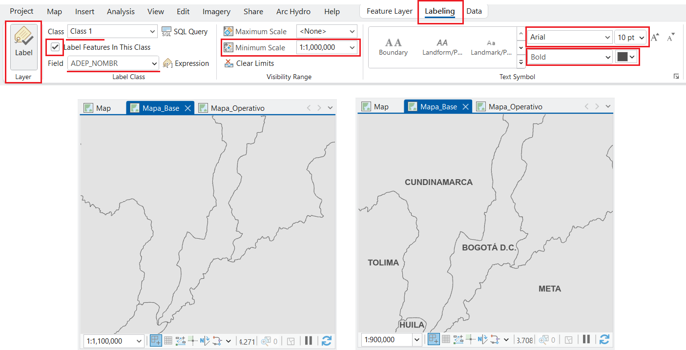{fig-align="center" width="100%"}


### Parte 3: publicación de capas web operativas (Feature layer)

1. **Preparar el Mapa_Operativo**

* Cambiar a vista del `Mapa_Operativo`.
* Desde `Catalog`, arrastrar `poblaciones` al mapa.
* Configurar simbología:
  * Símbolo: círculo rojo (#E74C3C).
  * Tamaño: 8 puntos.
  * Transparencia: 100% (opaco).

2. **Publicar como Feature Layer**

::: {.callout-note}
La publicación en ArcGIS Online desde ArcGIS Pro requiere un portal registrado, activo y con sesión iniciada.
:::

* Seleccione la capa `poblaciones`. Active la Cinta/Pestaña `Share` → `Web Layer` → `Publish Web Layer`.

{fig-align="center" width="100%"}

Alternativamente:

* Clic derecho sobre capa `poblaciones` → `Sharing` → `Share As Web Layer`.

La siguiente imagen muestra la configuración de la ventana `Share As Web Layer`. Proceda a llenar los campos correspondientes.

{fig-align="center" width="60%"}

**Configuración de parámetros generales (Pestaña General)**

La pestaña `General` define los metadatos básicos, el tipo de capa web, la ruta de almacenamiento y los permisos de acceso dentro de la plataforma.

**Item Details (Detalles del elemento)**

* **Name**: Nombre único de la capa en el portal. Para este ejercicio, defina el formato como `colombia_poblaciones_[nombre_apellido]`.
* **Summary**: Breve descripción del propósito de la capa (Ej: `Capa de poblaciones colombianas principales`).
* **Tags**: Palabras clave separadas por comas para facilitar las búsquedas organizacionales, por ejemplo `poblaciones`, `unal`, `geomatica`.
* **Categories**: Clasificación temática opcional dentro de la organización.

**Layer Type (Tipo de capa)**

Determina el formato de entrega de los datos geográficos en la web. Para este procedimiento se debe seleccionar la opción `Feature`:

* **Feature**: Capas vectoriales web que soportan consultas de atributos, visualización dinámica y edición de geometrías. Son ideales para superponer datos operativos sobre mapas base.
* **Tile**: Capas de imágenes prediseñadas (teselas) optimizadas para una visualización rápida de mapas masivos. Proveen contexto geográfico estático.
* **Vector Tile**: Colecciones de teselas vectoriales y recursos de estilo que se adaptan a cualquier resolución de pantalla y permiten personalización de simbología sin volver a generar los datos subyacentes.

**Location and Sharing Level (Ubicación y niveles de compartición)**

* **Folder**: Carpeta de destino seleccionada dentro del contenido del usuario en ArcGIS Online (`taller_cartografia_web`).
* **Sharing Level - Owner**: Acceso restringido únicamente al creador del ítem.
* **Sharing Level - Organization**: Visible para todos los miembros registrados dentro de la organización del portal.
* **Sharing Level - Everyone (public)**: Acceso público general, permitiendo que usuarios externos a la organización consuman la capa de datos. Seleccione esta opción para el ejercicio.

**Configurar operaciones permitidas y propiedades avanzadas**

Antes de proceder con la validación, es necesario estructurar las capacidades de la capa y los identificadores numéricos en las pestañas adicionales:

* En la pestaña `Content`, de clic en el mensaje `Allow Assignment Of Unique Numeric IDs`, y en la ventana que aparece (Propiedades del Mapa `Mapa_Operativo`), marque la casilla de texto para activar esa opción.

{fig-align="center" width="70%"}

* En la pestaña `Configuration`, ubíquese sobre la sección `Layer` → `Feature` y haga clic en el ícono del lápiz (`Configure Web Layer Properties`) para establecer las siguientes propiedades operacionales:
  * Habilitar: `Approve for Public Data Collection`
  * Habilitar: `Enable Sync`
  * Habilitar: `Enable Append`
  * Habilitar: `Export Data`

::: {.callout-warning}
### Nota técnica
La correcta configuración de estas restricciones y permisos operacionales protege la integridad de los datos alojados en la nube y define las capacidades de edición remota.
:::

* En la misma pestaña `Configuration`, diríjase a la sección `Additional Layers` y marque la casilla correspondiente a `WFS` para habilitar el servicio web estándar del Open Geospatial Consortium.

**Validar y publicar**

* Clic en `Analyze`: El sistema ejecutará una inspección de consistencia. En caso de presentarse advertencias de metadatos faltantes, asegúrese de completar los campos de `Summary` y `Tags`. No deben reportarse errores críticos para proceder.
* Clic en `Publish`: Inicie el proceso de carga y espere el mensaje de confirmación de finalización exitosa en el portal.

### Parte 4: publicación de teselas vectoriales (Vector tile layer)

1. **Activar vista del `Mapa_Base`**

* Cambiar a la pestaña `Mapa_Base`, ver siguiente imagen.

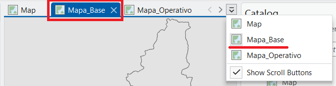{fig-align="center" width="70%"}


2. **Publicar como Vector Tile Layer**

* Pestaña `Share` → `Web Layer` → `Publish Web Layer`.

3. **Parámetros de publicación del mapa base**

* En el panel *Share As Web Layer*, configurar los siguientes parámetros en la pestaña `General`:
  * **Name:** `mapa_base_colombia_[apellido_estudiante]`.
  * **Summary:** `Mapa base usando capa de departamentos y drenajes`.
  * **Tags:** `colombia`, `basemap`, `unal`.
  * **Layer Type:** Seleccionar `Vector Tile` y asegurar que la casilla `Feature` esté activada de forma complementaria.
  * **Location:** Seleccionar la carpeta `taller_cartografia_web`.
  * **Sharing Level:** Seleccionar `Everyone (public)`.

{fig-align="center" width="55%"}


4. **Optimizar niveles de zoom (Tiling scheme)**

* Pestaña `Configuration`.
* En `Tiling Scheme`:
  * **Minimum Level:** 5 (escala global).
  * **Maximum Level:** 17 (nivel de calle).

* **Nota técnica:** Las teselas vectoriales se cachean automáticamente, mejorando la velocidad de transferencia en navegadores y dispositivos móviles bajo el esquema Web Mercator (EPSG:3857).

5. **Resolver invonvenientes detectados por el analizador**

* Hacer clic en `Analyze`.
* Simplificar configuraciones gráficas no soportadas si el analizador lo requiere.
* Habilitar `Allow Assignment Of Unique Numeric IDs` en el mapa `Mapa_Base`.
* Eliminar capas tipo `BaseMaps` (ej: `World Topographic Map`, `World Hillshade`) en el mapa `Mapa_Base`.
* Hacer nuevamente clic en `Analyze` hasta que se hayan resuelto los errores y advertencias
* Hacer clic en `Publish`.


### Parte 5: integración en ArcGIS Online y creación del mapa web final

1. **Acceder a ArcGIS Online**

* Iniciar sesión en el portal institucional (`https://unalmed.maps.arcgis.com/`).

2. **Verificar capas publicadas**

* Ir a la sección `Content` (Contenido) y verificar la existencia de la `Feature Layer` y la `Vector Tile Layer` publicadas.

{fig-align="center" width="100%"}

3. **Crear nuevo mapa web**

* Seleccionar `Mapa` (Map) para abrir `Map Viewer`.
* En el panel izquierdo, hacer clic en `Layers` → `Add`.

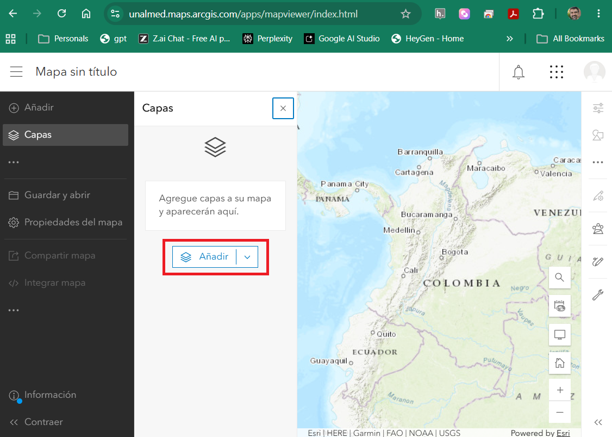{fig-align="center" width="100%"}


{fig-align="center" width="70%"}


4. **Configurar el mapa base personalizado**


* Buscar el `Tile layer (alojado)` llamado `mapa_base_colombia_[apellido_nombre]`, clic en `Añadir` y luego 
en el símbolo `<` al lado de la etiqueta `Agregar Capa`.

{fig-align="center" width="45%"}

* Abrir el menú de opciones (tres puntos horizontales) de la capa cargada y seleccionar `Mover al mapa base` (Move to Basemap).

{fig-align="center" width="50%"}

* En la pestaña `Mapa base` verificar que el mapa base actual sea el `mapa_base_colombia_[apellido_nombre]`.

5. **Agregar capa operativa y configurar ventanas emergentes (Pop-ups) y alias de campos**

* Hacer clic en `Add` nuevamente para incluir `colombia_poblaciones_[apellido_nombre]`.
* En el panel derecho de la capa, seleccionar `Elementos Emergentes` (Pop-ups).
* Ocultar campos técnicos del sistema (`OBJECTID`, `Shape_Length`, `Shape_Area`).
* En el panel derecho de la capa, seleccionar `Campos` (Fields).
* Seleccione cada campo y cambie los `Nombres de visualización`. Por ejemplo, para el campo `CPOP_CODIGO` cambiar por "Código", `CPOB_NOMBRE` cambiar por `Municipio`.

6. **Cambie el nombre de la capa**

* Seleccione los tres puntos (`...`) al lado derecho del nombre de la capa `colombia_poblaciones_[apellido_nombre]`, y de clic en `Cambiar nombre`. Escriba `Poblaciones` y presione `Aceptar`.


7. **Finalizar y guardar el mapa web**

* En el panel izquierdo, clic en `Guardar y abrir` → `Guardar como`
* Asignar título `Mapa_Web_Integrado_[Apellido_Nombre]`, agregar etiquetas y una descripción técnica.
* Seleccionar `Guardar` (Save).

8. **Configurar acceso**


* Desde el `Map Viewer`, hacer clic en el ícono de menú (tres líneas horizontales en la esquina superior izquierda) y seleccionar `Contenido`.
* En la lista de elementos, seleccionar el mapa `Mapa_Web_Integrado_[Apellido_Nombre]` para abrir la interfaz de `Vista general`.

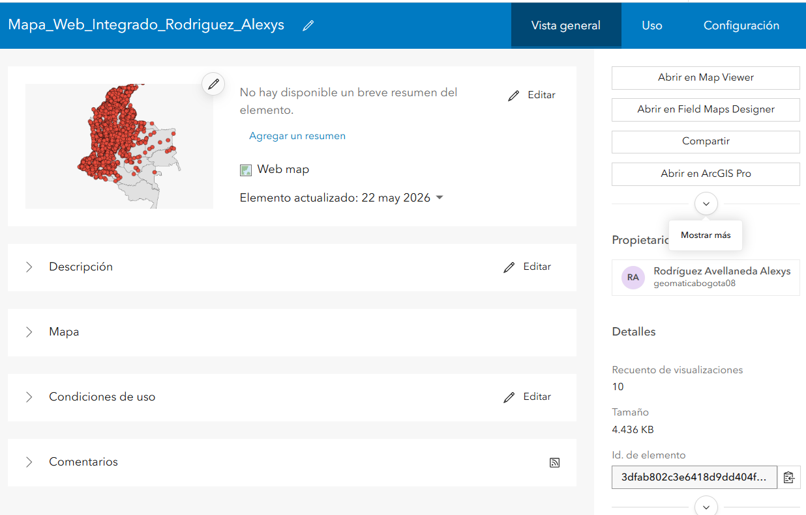{fig-align="center" width="100%"}

Asegúrese de completar y verificar los siguientes parámetros en el panel lateral de la vista general del mapa, tomando como referencia la configuración técnica establecida en la siguiente imagen:

* **Opciones de apertura y compatibilidad:** Verificar la disponibilidad de los accesos directos para la visualización y edición del elemento mediante los botones `Abrir en Map Viewer`, `Abrir en Field Maps Designer` y `Abrir en ArcGIS Pro`.
* **Nivel de acceso:** Hacer clic en `Compartir` dentro de la sección `Uso compartido` y establecer el nivel de acceso en `Todos (público)` para garantizar la visibilidad externa del recurso.
* **Metadatos e información del elemento:** Completar la barra de calidad de la información mediante la inclusión de un resumen ejecutivo, una descripción detallada y la definición de los términos de uso del mapa.
* **Etiquetas de indexación:** Validar que el elemento cuente con las etiquetas técnicas requeridas (`colombia`, `geomatica`, `poblaciones`, `unal`, `basemap`) para optimizar su catalogación en la plataforma.
* **Organización del directorio:** Confirmar que el mapa se encuentre alojado de forma correcta dentro de la carpeta correspondiente al proyecto, denominada `taller_cartografia_web`.
* **Identificador único:** Localizar el campo `Id. de elemento` para extraer el código alfa-numérico único del mapa web, el cual es necesario para la estructuración de la URL final en el reporte.

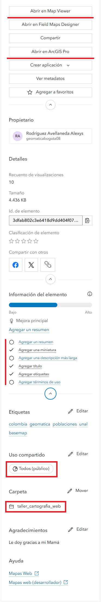{fig-align="center" width="50%"}

## Ejercicios adicionales (opcional)

### Revise los metadatos del mapa final

Verifique los metadados del mapa final y revise las URL para `Item Detail` y `Resource URL`. Describa la utilidad de esta opción de metadatos.

### Verifique las pestañas Uso y Configuración

Analice la utilidad de las pestañas `Uso` y `Configuración` en la Vista General del Mapa Web.

### Crear una aplicación a partir de su mapa

Revise las opciones disponibles en la Vista General del Mapa Web para publicar en las siguientes aplicaciones disponibles y comparta el resultado en el informe final:

* Instant Apps
* Experience Builder
* ArcGIS Story Maps
* Dashboards

### Verifique la pestaña `Portal` en el `Catálogo` de ArcGIS Pro

* Cargue sus capas y las de sus compañeros en la opción `Portal` en el `Catálogo` de ArcGIS Pro

### Verifique los servicios OGC publicados

Dentro de ArcGIS Pro:

* Cargue las capas publicadas como servicios `WMS`
* Cague las capas publicadas como servicios `WFS`

Usando QGIS:

* Cargue las capas publicadas como servicios `WMS`
* Cague las capas publicadas como servicios `WFS`
 
## Cuestionario de evaluación y análisis

El documento final (formato Quarto) debe dar respuesta analítica a los siguientes interrogantes técnicos:

**Pregunta 1:** ¿Qué ventajas mecánicas y de rendimiento ofrece el formato de teselas vectoriales (*Vector Tiles*) en comparación con servicios tradicionales de teselas ráster (WMS) al desplegar cartografía base en dispositivos móviles y navegadores web? Considere: tamaño de paquetes de datos, consumo de ancho de banda, escalabilidad de estilos y compatibilidad con resoluciones de pantalla variables.

**Pregunta 2:** Explique la transformación que sufren los datos geoespaciales locales (shapefile/geodatabase) al ser publicados como una *Hosted Feature Layer* en la infraestructura cloud de ArcGIS Online. ¿Qué cambios ocurren en el almacenamiento de geometrías, proyecciones y tablas de atributos?

**Pregunta 3:** Justifique técnicamente la selección del rango de escalas implementado en la Parte 2 (configuración de Scale Range para drenajes). ¿Cómo afecta la densidad de vértices y el solapamiento de etiquetas a la velocidad de transferencia de paquetes de datos en conexiones móviles de baja velocidad?

**Pregunta 4:** En el contexto de la interoperabilidad, explique cómo el uso de sistemas de referencia estándar (MAGNA-SIRGAS para almacenamiento local frente a Web Mercator en servicios web) facilita la integración con terceras plataformas.

## Requerimientos de entrega y reproducibilidad (opcional - el trabajo fue en clase 05/25/2026)

La evaluación del taller se fundamenta en la reproducibilidad del flujo de trabajo y la correcta publicación de recursos espaciales. No se aceptarán archivos binarios `.aprx` por correo electrónico.

### 1. Estructura del documento Quarto (.qmd)

Cada estudiante debe redactar un archivo fuente en Quarto (`index.qmd`) y compilarlo en HTML y PDF. El documento debe contener las siguientes capturas de pantalla y deben almacenarse en la ruta `imagenes/`:

1. Panel de propiedades de CRS en ArcGIS Pro (mostrando EPSG:9377).
2. Simbología del Mapa_Base con rangos de escala configurados.
3. Panel de configuración de publicación (*Share As Web Layer*) antes de hacer clic en *Publish*.
4. Verificación de capas en ArcGIS Online (sección *Content*).
5. Mapa web final en *Map Viewer* con pop-up abierto demostrando los atributos configurados.

### 2. Publicación en GitHub y entrega final

* **Crear repositorio público:** `taller-cartografia-web-[apellido_nombre]`

* **Estructura del repositorio:**

```text
taller-cartografia-web-[apellido_estudiante]/
├── index.qmd
├── index.html
├── index.pdf
├── imagenes/
│   ├── 01_crs_configuration.png
│   ├── 02_mapa_base_simbologia.png
│   ├── 03_share_as_web_layer.png
│   ├── 04_arcgis_online_content.png
│   └── 05_mapa_web_final_popup.png
├── .gitignore
└── README.md

```

* **Compilar el documento localmente:**

```bash
cd taller-cartografia-web-[apellido_estudiante]
quarto render index.qmd --to html
quarto render index.qmd --to pdf

```

* **Hacer commit y push:**

```bash
git add .
git commit -m "Taller 1: Flujos de trabajo ArcGIS Pro -> ArcGIS Online"
git push origin main

```

* **Activar GitHub Pages:**
  * Ir a Settings del repositorio.
  * Sección "Pages".
  * Source: Deploy from a branch.
  * Branch: `main` / folder: `/ (root)`.
  * Hacer clic en Save y esperar la compilación de la acción.

* **Mecanismo de entrega:**
  * Enviar por los canales de la asignatura:
    * URL del repositorio GitHub.
    * URL del sitio GitHub Pages.
    * URL del mapa web en ArcGIS Online.

### 3. Criterios de evaluación

| Criterio | Ponderación | Descripción |
| --- | --- | --- |
| **Reproducibilidad** | 25% | Estructura de directorios, versionamiento Git, documento Quarto compilable. |
| **Completitud técnica** | 30% | Publicación correcta de Feature Layer y Vector Tile Layer, CRS validado. |
| **Calidad analítica** | 25% | Respuestas fundamentadas a preguntas del cuestionario con rigor técnico. |
| **Documentación y capturas** | 15% | Evidencia visual de cada paso, metadatos completos, pop-ups configurados. |
| **Presentación** | 5% | Formato Quarto válido, referencias correctas, escritura técnica clara. |

## Recursos adicionales

* [ArcGIS Pro - Share Web Layer Documentation](https://pro.arcgis.com/en/pro-app/latest/help/sharing/overview/publish-web-layers.htm)
* [Vector Tiles in ArcGIS Online](https://doc.arcgis.com/en/arcgis-online/create-maps/vector-tile-layers.htm)
* [MAGNA-SIRGAS Coordinate System](https://www.igac.gov.co/en/services/magna-sirgas)
* [Quarto Documentation](https://quarto.org/docs/guide/)

## Anexo: Troubleshooting común

### Error: "Invalid CRS during publish"

Asegurar que ambos mapas en el proyecto posean el mismo CRS antes de intentar el empaquetado. Ejecutar siempre la herramienta `Analyze` y resolver todas las advertencias.

### Vector tiles publicados pero no visibles en Map Viewer

Validar que la capa haya sido configurada explícitamente como base de referencia espacial. En Map Viewer, desplegar el menú de opciones de la capa y seleccionar `Move to Basemap`.

### Pop-up no muestra atributos esperados

En Map Viewer, seleccionar `Configure Pop-ups` sobre la capa de entidades y verificar la lista de campos habilitados para visualización.

### Repositorio GitHub Pages no actualiza

Limpiar la caché del navegador, verificar el estado de despliegue en la pestaña *Actions* de GitHub y asegurar que los cambios locales hayan sido efectivamente empujados al repositorio remoto.
