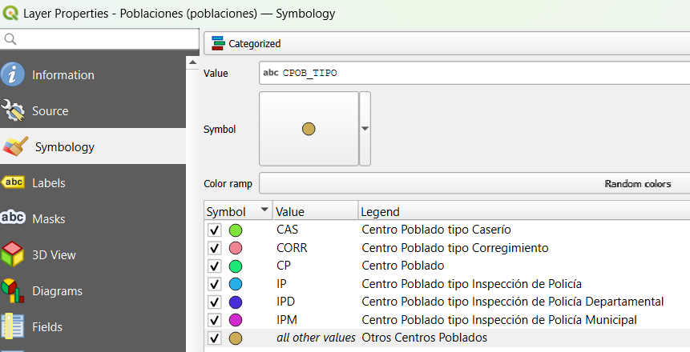
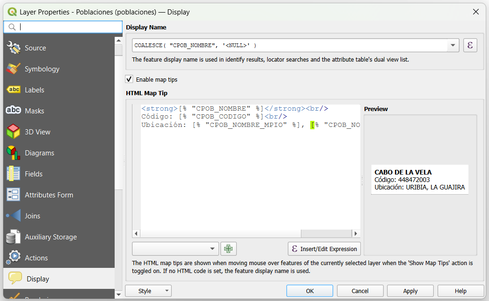
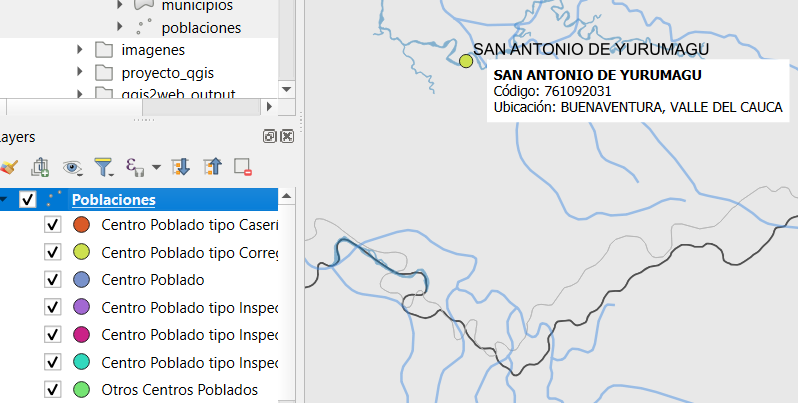
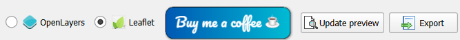
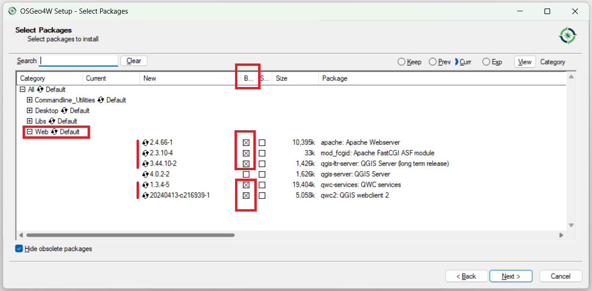
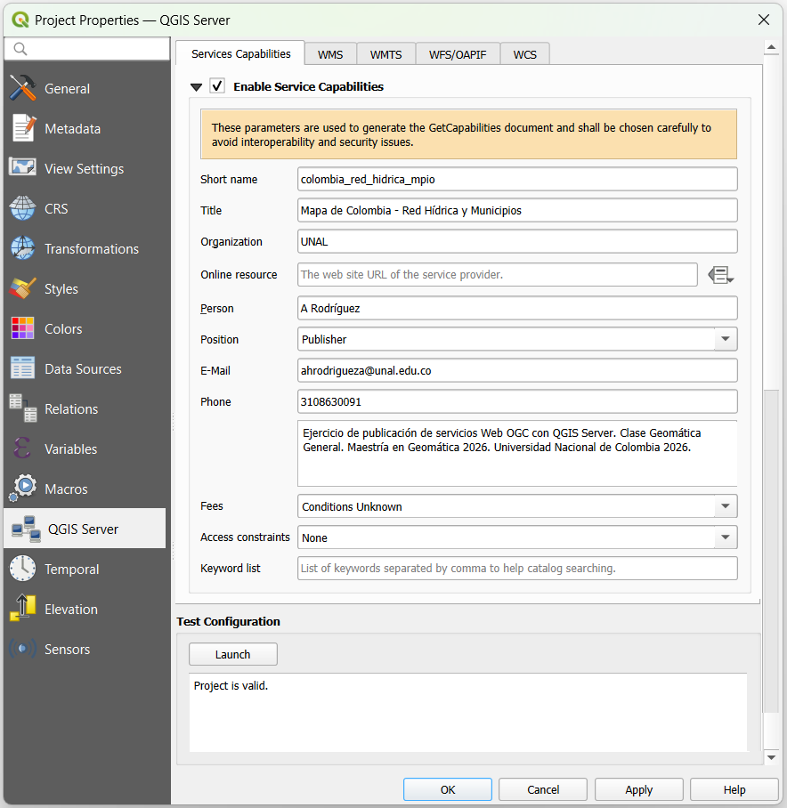
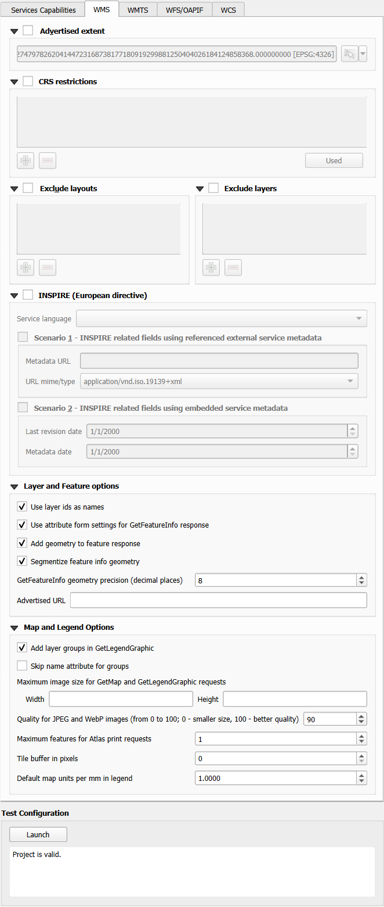
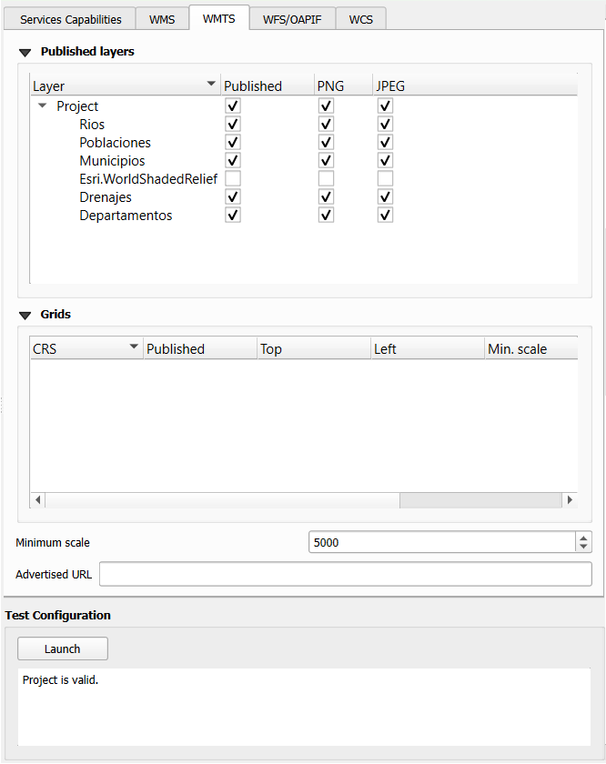
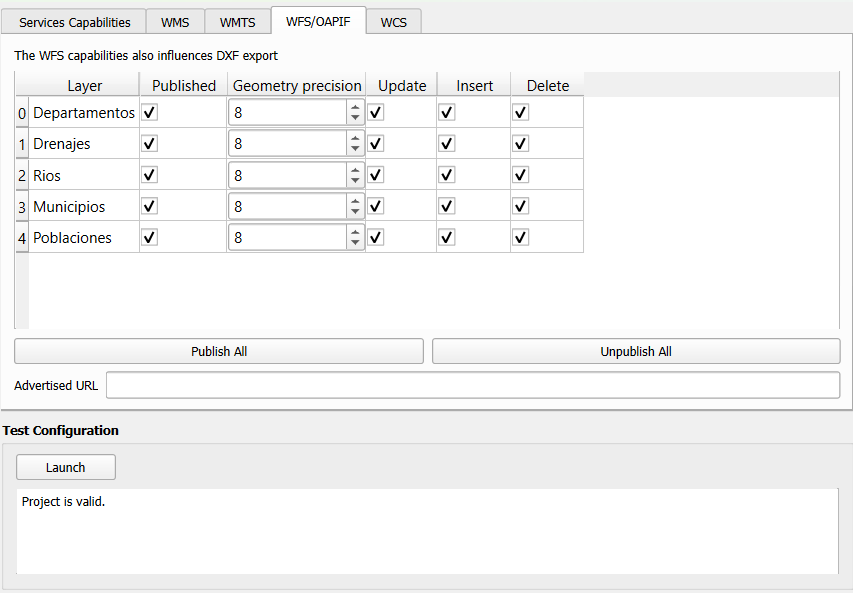
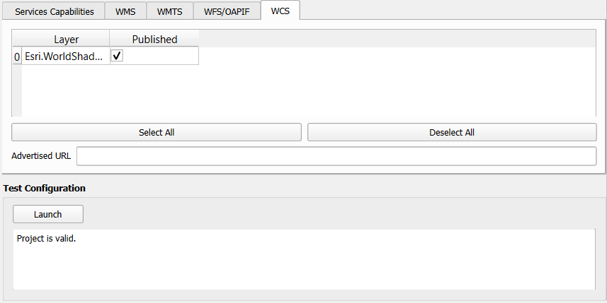

# Flujos de trabajo desde QGIS hacia QGIS Server y aplicaciones web

## Introducción

### Alcance del taller

El presente taller aborda dos estrategias complementarias para la publicación de cartografía web utilizando QGIS y software libre. En la primera parte, se utilizará el plugin qgis2web para generar aplicaciones web interactivas basadas en Leaflet, permitiendo una rápida prototipación con interactividad completa sin requerir servicios de infraestructura de servidor. En la segunda parte, se desplegará QGIS Server como una alternativa empresarial a SIG propietarios, publicando servicios web estándar OGC (WMS, WFS, WMTS) que garantizan interoperabilidad con cualquier cliente SIG compatible. El ejercicio concluye con la integración de ambos flujos en una documentación reproducible mediante Quarto y GitHub, demostrando la versatilidad del ecosistema QGIS.

### Estándares de la OGC para servicios web geográficos

El Open Geospatial Consortium (OGC) define protocolos estandarizados para la interoperabilidad de datos espaciales a través de la red. La implementación de estos estándares permite el consumo de información geográfica desde servidores remotos sin necesidad de descargar los archivos fuente.


#### Clasificación y descripción de estándares

La siguiente tabla resume las características técnico-operativas de los principales servicios web geográficos:

| Estándar OGC | Tipo de datos | Operación principal | Caso de uso típico |
| --- | --- | --- | --- |
| **WMS** *(Web Map Service)* | Imagen (Ráster pre-renderizado) | Devuelve una imagen estática (PNG/JPEG) generada por el servidor a partir de datos vectoriales o ráster. | Mapas base de referencia visual donde no se requiere analizar la geometría ni los atributos numéricos originales. |
| **WMTS** *(Web Map Tile Service)* | Imagen (Teselas pre-renderizadas) | Entrega mapas mediante una estructura piramidal de imágenes pre-calculadas (teselas) organizadas por niveles de zoom. | Capas de cobertura global o regional de alta velocidad de carga, optimizadas para el rendimiento del lienzo de dibujo. |
| **WFS** *(Web Feature Service)* | Vectorial (Entidades geográficas) | Transmite geometrías vectoriales y tablas de atributos (usualmente en formato GML o GeoJSON) que el cliente local renderiza. | Edición cartográfica, consultas de atributos, análisis espacial vectorial y operaciones de persistencia de datos (**WFS-T**). |
| **WCS** *(Web Coverage Service)* | Ráster (Valores de celda puros) | Proporciona acceso a coberturas ráster multiparamétricas con sus datos numéricos intactos (GeoTIFF, NetCDF). | Modelos Digitales de Elevación (DEM), álgebra de mapas, clasificaciones de imágenes satelitales y análisis analítico continuo. |


#### Criterios de selección en flujos de trabajo SIG

Para optimizar el rendimiento del cliente y asegurar la integridad del análisis, se deben seguir las siguientes directrices de arquitectura:

* **Consumo de recursos:** Utilice **WMTS** en lugar de WMS para mapas de fondo o capas de referencia que no cambian frecuentemente. Esto reduce las peticiones de procesamiento en el servidor Apache remoto al reutilizar la caché de teselas.
* **Integridad analítica:** Evite el uso de WMS o WMTS si el objetivo es realizar operaciones de geoprocesamiento ráster (como el cálculo de pendientes). En tales escenarios, el estándar requerido es **WCS**, ya que preserva la matriz numérica original.
* **Modificación de datos:** El estándar **WFS** descarga los elementos geométricos directamente en la memoria del cliente, lo que habilita la selección y filtrado topológico estructurado directamente en la estación de trabajo local.

### Resumen de flujos de trabajo y comandos

La estrategia de publicación web con QGIS ofrece dos enfoques complementarios con diferentes características de despliegue e interactividad.

| Componente técnico | Operación en QGIS | Tecnología resultante | Función en el cliente web |
|---|---|---|---|
| **Mapa web interactivo** | qgis2web plugin → Leaflet/OpenLayers | HTML5 + JavaScript + GeoJSON | Interactividad cliente, sin requerimiento de servidor backend |
| **Servicio cartográfico** | QGIS Server (WMS/WFS/WMTS/WCS) | OGC Web Services | Interoperabilidad con múltiples clientes, renderizado servidor |


### Estructura de directorios del proyecto

El árbol de directorios del proyecto local debe mantener la siguiente estructura para garantizar la correcta vinculación de recursos:

```text
taller_cartografia_qgis/
├── datos/
│   └── colombia_formatos.gpkg
├── proyecto_qgis/
│   └── taller_cartografia_qgis.qgz
├── qgis2web_output/
│   ├── qgis2web_2026_05_24-11_50_01/
│   │   ├── index.html
│   │   ├── js/
│   │   ├── css/
│   │   └── data/
│   └── qgis2web_2026_05_24-11_52_30/
│       ├── index.html
│       └── ...
├── imagenes/
│   ├── 01_crs_configuration.png
│   ├── 02_simbologia_qgis.png
│   ├── 03_qgis2web_export.png
│   ├── 04_qgis_server_wms.png
│   └── 05_mapa_interactivo_final.png
└── index.qmd

```

### Requisitos previos y materiales

Para el desarrollo de las actividades programadas es indispensable contar con:

* **Software:**
  * QGIS Desktop (versión 3.20 o superior) descargado de `qgis.org`.
  * Plugin qgis2web (se instala desde el Gestor de Plugins en QGIS).
  * QGIS Server (versión compatible) para la segunda parte.
  * Git y cliente GitHub Desktop o línea de comandos.
  * Quarto CLI instalado.

* **Cuentas y acceso:**
  * Cuenta activa en GitHub.com.
  * Acceso a máquina con capacidad de ejecutar servidor web (local o remoto).

* **Datos geográficos:**
  * GeoPackage (`.gpkg`) con capas vectoriales de Colombia:
    * Polígonos de municipios con información demográfica.
    * Líneas de red hídrica (ríos principales y secundarios).
    * Puntos de ciudades y centros urbanos.


## Procedimiento metodológico

### Parte 1: Inicialización del proyecto QGIS y entorno local

1. **Crear la estructura de directorios**

```bash
mkdir taller_cartografia_qgis
cd taller_cartografia_qgis
mkdir datos proyecto_qgis qgis_server qgis2web_output imagenes

```

2. **Iniciar QGIS y crear nuevo proyecto**

* Abrir QGIS Desktop.
* Seleccionar `File` → `New Project`.
* Ir a `Project` → `Properties`.
* En la pestaña `General`, asignar el nombre: `taller_cartografia_qgis`.
* Guardar como: `taller_cartografia_qgis.qgz` en la carpeta `proyecto_qgis/`.

3. **Configurar el sistema de referencia de coordenadas (CRS)**

* En `Project` → `Properties` → `CRS`.
* Seleccionar: MAGNA-SIRGAS / Origen Nacional (EPSG:9377).


4. **Vincular los datos geográficos**

* `Layer` → `Add Layer` → `Add Vector Layer`.
* Seleccionar el archivo `colombia_formatos.gpkg`.
* Seleccionar las capas: departamentos, drenajes, drenajes_doble, municipios, poblaciones, etc).
* Hacer clic en `Add`.

### Parte 2: Configuración cartográfica y simbología

1. **Organizar capas en el panel Layers**

* En el panel izquierdo (Layers), considerar el orden de visualización de las capas:
  * Mapa base: `Esri.WorldShadedRelief` (primera capa de abajo hacia arriba)
  * Base (polígonos): departamentos, municipios, drenajes_doble.
  * Media (líneas): drenajes.
  * Superior (puntos): poblaciones. (primera capa de arriba hacia abajo)

2. **Agregar mapa base**

* **Mapa base**
  * Agregue el mapa base `Esri.WorldShadedRelief` al mapa
    * En el Panel `Browser` → `XYZ Tiles`
    * Clic derecho en `Esri.WorldShadedRelief` → `Add Layer to Project`

3. **Aplicar simbología a cada capa y mejorar nombres**

* **Capa de departamentos:**
  * Hacer clic derecho → `Properties`.
  * Ir a pestaña `Symbology`.
  * Elegir `Single Symbol`.
  * Color de relleno: gris claro (#E8E8E8).
  * Contorno: gris oscuro (#505050), grosor: 1pt.
  * Transparencia: 60%.
    * Seleccionar la capa y hacer clic derecho → `Properties` → `Symbology` → `Layer Rendering`
    * En `Opacity`, aplicar 40%.
    * Seleccionar `Apply`
    * Seleccionar `OK`.
  * Hacer clic en `Apply`.
  * Renombrar la capa a `Departamentos`.

* **Capa de municipios:**
  * Hacer clic derecho → `Properties`.
  * Ir a pestaña `Symbology`.
  * Elegir `Single Symbol`.
  * Color de relleno: Transparent Fill.
  * Contorno: gris claro (#b5b5b5), grosor: 0.5pt.
  * Hacer clic en `Apply`.
  * Renombrar la capa a `Municipios`.

* **Capa de drenajes_doble:**
  * Color de relleno: azul (#1f78b4).
  * Contorno: azul (#1f78b4), grosor: 0.5pt.
  * Grosor: 1.5 puntos.
  * Transparencia: 50%.
    * Seleccionar la capa y hacer clic derecho → `Properties` → `Symbology` → `Layer Rendering`
    * En `Opacity`, aplicar 50%.
    * Seleccionar `Apply`
    * Seleccionar `OK`.
  * Aplicar `Scale Dependent Visibility`: visible solo a zoom 1:500,000 y superior.
    * Seleccionar la capa y hacer clic derecho → `Properties` → `Rendering`
    * Seleccionar `Scale Dependent Visibility`
    * En `Minimum (exclusive)` 🔍⁻ escribir: 1:500001
    * Seleccionar `Apply`
    * Seleccionar `OK`.
  * Renombrar la capa a `Drenajes (áreas)`


* **Capa de drenajes:**
  * Color: azul (#4A90E2).
  * Grosor: 1.5 puntos.
  * Transparencia: 50%.
    * Seleccionar la capa y hacer clic derecho → `Properties` → `Symbology` → `Layer Rendering`
    * En `Opacity`, aplicar 50%.
    * Seleccionar `Apply`
    * Seleccionar `OK`.
  * Aplicar `Scale dependent visibility`: visible solo a zoom 1:500,000 y superior.
    * Seleccionar la capa y hacer clic derecho → `Properties` → `Rendering`
    * Seleccionar `Scale Dependent Visibility`
    * En `Minimum (exclusive)` 🔍⁻ escribir: 1:500001
    * Seleccionar `Apply`
    * Seleccionar `OK`.
  * Renombrar la capa a `Drenajes`

* **Capa de poblaciones:**
  * Aplicar simbología `Categorized` por el campo `CPOB_TIPO`
    * Seleccionar la capa y hacer clic derecho → `Properties` → `Symbology`
    * De la lista desplegable seleccionar `Categorized`
    * En `Value` seleccionar `CPOB_TIPO`
    * En `Symbol` seleccionar un circulo rojo (#E74C3C) de tamaño 4 puntos
    * Rampa de colores: `Random colors`
    * Presionar el botón `Classify`
    * Cambiar las leyendas de acuerdo con la siguiente [@tbl-mgn-dane]
    * Seleccionar `Apply`
    * Seleccionar `OK`.
  * Aplicar etiquetado: campo `CPOB_NOMBRE` con fuente Arial 8pt.
    * Seleccionar la capa y hacer clic derecho → `Properties` → `Labels`
    * De la lista desplegable seleccionar `Single Labels`
    * En `Value` seleccionar `CPOB_NOMBRE`
    * En `Font` seleccionar `Arial`
    * En `Size` escribir `8`
    * Seleccionar `Apply`
    * Seleccionar `OK`.
  * Renombrar la capa a `Poblaciones`

| Value | Legend |
|:-|:----|
| CAS | Centro Poblado tipo Caserío |
| CORR | Centro Poblado tipo Corregimiento |
| CP | Centro Poblado |
| IP | Centro Poblado tipo Inspección de Policía |
| IPD | Centro Poblado tipo Inspección de Policía Departamental |
| IPM | Centro Poblado tipo Inspección de Policía Municipal |
| all other values | Otros Centros Poblados |

: Clasificación de centros poblados según el Marco Geoestadístico Nacional (DANE) {#tbl-mgn-dane}

{fig-align="center" width="80%"}

4. **Configurar información de atributos (Popup)**

* Para cada capa, hacer clic derecho → `Properties` → `Display` → `HTML Map Tip`.
* Crear plantilla HTML personalizada:

```html
<strong>[% "CPOB_NOMBRE" %]</strong><br/>
Código: [% "CPOB_CODIGO" %]<br/>
Ubicación: [% "CPOB_NOMBRE_MPIO" %], [% "CPOB_NOMBRE_DPTO" %]
```

{fig-align="center" width="90%"}


{fig-align="center" width="70%"}

### Parte 3: Publicación con qgis2web (Aplicación web interactiva)

1. **Instalar el plugin qgis2web**

* `Plugins` → `Manage and Install Plugins`.
* Buscar "qgis2web".
* Hacer clic en `Install Plugin`.
* Cerrar el diálogo.

2. **Configurar parámetros de exportación**

* `Web` → `qgis2web` → `Create web map`.
* En el panel `Layers and Groups`:
  * Seleccionar todas las capas (incluir todas las capas en el Mapa Web).
  * Marcar las capas que serán visibles por defecto (todas).
  * Configurar pop-ups informativos
    * Para cada capa, marcar: "Popups".
    * Configurar qué campos se mostrarán en los pop-ups.

{fig-align="center" width="70%"}

{fig-align="center" width="70%"}

> Nota: NO es necesario presionar el botón:
> `Install new browser` (NO INSTALAR)


* En el panel `Appearance`:
  * Definir una a una las opciones de su Mapa Web
    * Ver siguiente imagen
    * **Measure tool:** habilitar (marcar checkbox).
    * **Search:** habilitar (para búsqueda de ubicaciones).
    * ...
    * **Scale:** Rango de zoom: 4-15.


{fig-align="center" width="50%"}

* En el panel `Export`:
  * Definir la salida a la carpeta `../data_heavy/taller_cartografia_qgis/qgis2web_output/`

{fig-align="center" width="70%"}


* En el panel `Settings`:
  * Ver siguiente gráfica

{fig-align="center" width="70%"}

* En el panel `WIKI`:
  * Existe la guía para usar y configurar `qgis2web`

{fig-align="center" width="70%"}

* Otras opciones:
  
  * **Framework:** seleccionar `Leaflet` (más ligero y rápido).

{fig-align="center" width="70%"}


3. **Exportar la aplicación web**

* Hacer clic en `Export`.
* Seleccionar carpeta de destino: `qgis2web_output/`.
* Esperar a que finalice la exportación (2-3 minutos).
* Se generará una carpeta con archivos: `index.html`, `js/`, `css/`, `data/`.

4. **Verificar la aplicación web localmente**

* Abrir `qgis2web_output/index.html` en navegador web.
* Probar:
  * Navegación (zoom, pan).
  * Clic en features para ver pop-ups.
  * Herramienta de medición.
  * Búsqueda de ubicaciones.

5. **Si la visualización falla**

La cantidad de elementos vectoriales a visualizar puede estar excediendo la capacidad del servidor Apache. Realizar las siguientes acciones:

* Seleccionar la opción `Cluster` para capa `Poblaciones` (esto mostrará grupos de puntos cercanos con un solo símbolo e indicando el número de puntos).
* Seleccionar la opción `Basemap` para capa `Esri.WorldShadedRelief`
* No incluir las capas `Drenajes (áreas)` y/o `Drenajes`
* Presione el botón `Export` nuevamente.

### Parte 4: Publicación con QGIS Server (Servicios OGC)

1. **Configurar QGIS Server (instalación)**

* **En Windows:**

En [@sec-osgeo4w] se definió el procedimeinto de instalación de QGIS con OSGeo4W. Complemente su instalación de QGIS Desktop agregando los siguientes paquetes de la sección Web:

* apache: Apache webserver
* mod_fcgid: Apache FastCGI ASF module
* qgis-ltr-server: QGIS Server (long term release)
* qwc-services: QWC Services
* qwc2: QGIS webclient 2
* Dependencias adicionales requeridas al seleccionar los paquetes anteriores. Se seleccionan al seleccionar la opción `Install these packages to meet dependencies (RECOMMENDED)`

{fig-align="center" width="100%"}

* **En Linux (Ubuntu/Debian):**

```bash
sudo apt-get install qgis-server
```
La gúia oficial de instalación de QGIS Server para Windows y otros sistemas operativos se puede encontrar [acá](https://docs.qgis.org/3.44/en/docs/server_manual/getting_started.html#installation-on-windows)


2. **Configurar proyecto QGIS para QGIS Server**

El motor de renderizado de QGIS Server requiere la activación y parametrización explícita de las capacidades del servicio web dentro del archivo de configuración del mapa base. Este procedimiento define las restricciones de proyección, los metadatos institucionales y los privilegios de descarga transaccional que heredarán los protocolos WMS, WMTS, WFS y WCS.

* En QGIS Desktop, verificar que el proyecto `taller_cartografia_qgis.qgz` se encuentre guardado en el almacenamiento local.
* Acceder a la ruta de menú: `Project` → `Properties` y seleccionar la pestaña **QGIS Server** en la barra lateral izquierda.
* Diligenciar detalladamente las siguientes subsecciones de configuración según las directivas técnicas de la interfaz:

*Service capabilities (Metadatos globales del servicio):*

Esta sección define el encabezado del documento XML de capacidades generales que leerán los clientes SIG remotos.

* Activar la casilla de verificación **Service capabilities**.
* **Service title:** "Mapa de Colombia - Red Hídrica y Municipios".
* **Service abstract:** Introducir un resumen descriptivo e institucional que precise el alcance de la información espacial (ej. "Servicio geográfico web que integra la delimitación político-administrativa municipal y la red de drenajes de la República de Colombia, optimizado para la gestión territorial y análisis ambiental").
* **Keyword list:** Agregar términos clave separados por comas para indexación: `Colombia`, `Red Hídrica`, `Municipios`, `OGC`.
* **Contact information:** Diligenciar los campos de organización, correo electrónico y responsable técnico para asegurar la trazabilidad del servicio.

::: {#fig-capabilities}
{fig-align="center" width="100%"}

Configuración de capacidades generales y metadatos del servicio.
:::

*WMS capabilities (Servicio de mapas web):*

Esta sección determina las restricciones espaciales y formatos gráficos disponibles para la visualización de teselas e imágenes ráster.

* Activar la casilla de verificación **WMS capabilities**.
* **Advertised extent:** Definir el rectángulo envolvente geográfico de la publicación presionando el botón `Use Current Canvas Extent` o calculándolo a partir de la capa de municipios de Colombia.
* **CRS restrictions:** Agregar de forma obligatoria los sistemas de referencia de coordenadas compatibles mediante el selector de EPSG:
  * `EPSG:9377` (Magnas-Sirgas / Origen Nacional - Sistema oficial para Colombia).
  * `EPSG:3857` (WGS 84 / Pseudo-Mercator - Requerido para visores web como OpenLayers, Leaflet o Mapbox).
  * `EPSG:4326` (WGS 84 / Coordenadas Geográficas).

::: {#fig-wms}
{fig-align="center" width="80%"}

Restricciones de sistemas de referencia espaciales y extensiones para el protocolo WMS.
:::

*WMTS capabilities (Servicio de teselas de mapas web):*

Esta sección pre-calcula los esquemas de cuadrículas para acelerar el despliegue visual mediante caché de imágenes.

* Activar la casilla de verificación **WMTS capabilities**.
* **Project layers:** Habilitar de forma explícita las capas vectoriales individuales (drenajes, municipios y mapa base) que formarán parte del esquema de teselas sincronizadas.
* **Formatos soportados:** Asegurar la disponibilidad de formatos comprimidos con canal alfa activo (`image/png`) para preservar la transparencia entre capas superpuestas.

::: {#fig-wmts}
{fig-align="center" width="80%"}

Definición de capas y formatos de salida para la generación del esquema de teselas web WMTS.
:::

*WFS / OAPIF capabilities (Servicio de entidades web):*

Esta sección habilita el acceso directo al formato vectorial y controla los privilegios transaccionales de edición en red.

* Activar la casilla de verificación **WFS capabilities**.
* **Published:** Seleccionar y activar las casillas para las capas vectoriales que se expondrán como objetos interactivos (drenajes y municipios).
* **Update / Insert / Delete (WFS-T):** Para activar las capacidades transaccionales (WFS-T) que permitan modificar los vértices de los ríos o polígonos desde clientes externos, active de forma explícita las casillas bajo las columnas `Update`, `Insert` y `Delete` según las restricciones de seguridad deseadas.

::: {#fig-wfs}
{fig-align="center" width="80%"}

Habilitación de capas vectoriales WFS y asignación de permisos transaccionales para edición.
:::

*WCS capabilities (Servicio de coberturas web):*

Esta sección faculta la descarga y transmisión de la matriz de datos numéricos puros de los píxeles para coberturas continuas o ráster.

* Activar la casilla de verificación **WCS capabilities**.
* **Published:** Seleccionar las capas de relieve sombreado o modelos digitales de elevación que deban ser expuestos para análisis espacial.
* Verificar que las extensiones geográficas de las coberturas correspondan exactamente a los límites del área de estudio.

::: {#fig-wcs}
{fig-align="center" width="80%"}

Activación de coberturas y asignación del protocolo WCS para análisis espacial de celdas ráster.
:::

* Guardar las modificaciones del proyecto haciendo clic en el icono del disquete o mediante el atajo de teclado `CTRL + S` antes de proceder al despliegue en el directorio web del servidor Apache.


### Parte 5: Configuración y despliegue local de QGIS Server con Apache en OSGeo4W

Para documentar el proceso de despliegue local de QGIS Server utilizando la distribución nativa de Apache en entornos Windows modernos (OSGeo4W), se debe seguir el protocolo técnico estructurado a continuación.


1. **Preparación de la estructura de datos cartográficos**


::: {.callout-important}

#### Actualización de la ruta de instalación de OSGeo4W

La configuración de la guía hace referencia a la ruta `D:\Programs\OSGeo4W\`, como la ruta de instalación de `OSGeo4W`.

Es necesario sustituir este directorio por la ubicación exacta donde se ejecutó la instalación de OSGeo4W en el equipo local (por ejemplo, `C:\OSGeo4W\` o la ruta personalizada asignada en el sistema operativo).
:::

Para asegurar la correcta lectura del proyecto por parte del servidor web, las fuentes de datos vectoriales y el archivo de mapas comprimido deben organizarse dentro del directorio raíz de documentos de Apache (`htdocs`).

* Crear el directorio del proyecto dentro de la ruta web de Apache:
```text
D:\Programs\OSGeo4W\apps\apache\htdocs\proyectos_sig\proyecto_qgis\

```

* Almacenar el archivo de proyecto cartográfico comprimido (`.qgz`) junto con su geodatabase o subcarpetas de datos en las rutas correspondientes:
* **Ruta del proyecto:** `.../proyectos_sig/proyecto_qgis/taller_cartografia_qgis.qgz`
* **Ruta de datos vectoriales:** `.../proyectos_sig/datos/`


2. **Parametrización del puerto en el servidor web (httpd.conf):**

Debido a que el puerto estándar `80` suele estar reservado por servicios del sistema operativo o instancias previas de otros servidores web, se debe redefinir el puerto de escucha hacia un canal exclusivo.

* Abrir el archivo de configuración principal de Apache:
```text
D:\Programs\OSGeo4W\apps\apache\conf\httpd.conf

```


* Modificar las directivas de inicialización de variables en las líneas superiores del documento para establecer el puerto `8082`:

```text
...
Define SRVPORT 8082
...
```

3. **Configuración del alias modular para la versión de largo soporte (qgis-ltr):**

Para permitir que Apache redirija las peticiones geográficas hacia el motor de renderizado de QGIS-LTR, es necesario habilitar y corregir el archivo de configuración modular, asegurando el mapeo del binario `qgis_mapserv.fcgi.exe` y la eliminación de restricciones globales de ejecución.

* Localizar el archivo de configuración web de QGIS en la ruta de inicialización de Apache:
```text
D:\Programs\OSGeo4W\httpd.d\httpd_qgis-ltr.conf

```

* *Nota:* Si el archivo posee una extensión larga debido a configuraciones de clientes previos (ej. `.conf.off-qwc-services`), se debe crear una copia y renombrarla estrictamente como `httpd_qgis-ltr.conf`.
* Reemplazar la sección final del archivo correspondiente al `Alias` y al bloque `<Directory>` empleando la sintaxis de barras inclinadas (`/`) requerida por Apache:

```text
Alias /qgis-ltr/ "D:/Programs/OSGeo4W/apps/qgis-ltr/bin/"

<Directory "D:/Programs/OSGeo4W/apps/qgis-ltr/bin/">
    Options +ExecCGI
    AddHandler fcgid-script .exe
    Require all granted
</Directory>

```

4. **Variables de entorno para la localización de proyectos QGIS en el servidor Web Apache:**

Esta metodología permite definir un directorio base global para los proyectos SIG dentro del archivo de configuración modular de Apache, simplificando la URL al requerir únicamente el nombre del archivo `.qgz` (variable QGIS_PROJECT_DIR) o inclusive sin requerir el nombre del archivo (variable QGIS_PROJECT_FILE).

* Abrir el archivo de configuración modular: `D:\Programs\OSGeo4W\httpd.d\httpd_qgis-ltr.conf`.
* Agregar las siguiente directiva al final del bloque de variables `DefaultInitEnv`:

```text
DefaultInitEnv QGIS_PROJECT_DIR "D:/Programs/OSGeo4W/apps/apache/htdocs/proyectos_sig/proyecto_qgis/"
DefaultInitEnv QGIS_PROJECT_FILE "D:/Programs/OSGeo4W/apps/apache/htdocs/proyectos_sig/proyecto_qgis/taller_cartografia_qgis.qgz"

```


5. **Inicialización del entorno geoespacial:**

QGIS Server requiere la configuración de variables de entorno específicas para la correcta carga de dependencias críticas, incluyendo bibliotecas de Qt5, bindings de Python y componentes de GRASS o SAGA. Por este motivo, el servidor web Apache no debe ejecutarse de forma aislada, sino que debe inicializarse a través del entorno de OSGeo4W para heredar la configuración del sistema.


* Localizar el acceso directo **OSGeo4W Shell** en el menú de inicio y ejecutarlo con privilegios de administrador.

* Alternativamente, abrir una ventana de la consola de comandos de Windows (CMD) como Administrador y ejecutar el archivo por lotes de inicialización desde el directorio correspondiente de la instalación local.

```text
D:\Programs\OSGeo4W\OSGeo4W.bat

```

6. **Ejecución del servidor:**

A continuación se presentan las dos opciones técnicas más eficientes para automatizar o simplificar este proceso:

**Opción 1: Invocación directa con carga automática de entorno (Recomendado):**


* En la terminal CMD desplagada anteriormente como Administrador, invocar directamente el ejecutable de Apache para iniciar el servidor en primer plano:

```cmd
"D:\Programs\OSGeo4W\apps\apache\bin\httpd.exe"

```
* *Nota de operación:* La consola se mantendrá abierta y en estado de escucha activa. Mientras esta ventana permanezca en ejecución, el servicio web estará operativo.


**Alternativa a la Opción 1**:

En lugar de abrir el archivo `OSGeo4W.bat` para interactuar con la terminal, se puede utilizar el mismo script en modo "no interactivo" para que cargue el entorno geoespacial y ejecute Apache en una sola línea de comando.

Abra una consola de comandos estándar de Windows (`cmd.exe`) como Administrador y ejecute:

```cmd
D:\Programs\OSGeo4W\OSGeo4W.bat "D:\Programs\OSGeo4W\apps\apache\bin\httpd.exe"

```

> **Explicación técnica:** El script `OSGeo4W.bat` está programado para recibir parámetros. Al pasarle la ruta de Apache entre comillas, el script inicializa todas las variables de entorno (`PATH`, librerías Qt, Python) y lanza inmediatamente el servidor web en segundo plano dentro de esa misma consola, ahorrando la ejecución manual de comandos internos.


**Opción 2: Uso del comando nativo de control de servicios de Windows (SCM):** (NO USAR: no está funcionando!)

Si el servicio quedó registrado correctamente en el sistema tras las depuraciones previas del puerto `8082` y la limpieza de sintaxis en el archivo `httpd_qgis-ltr.conf`, no se requiere invocar ningún archivo ejecutable de forma directa. Se puede controlar el demonio HTTP a través del Service Control Manager de Windows.

Abra la consola de comandos (`cmd.exe`) como Administrador y ejecute el comando nativo de red:


* Abrir la consola de comandos estándar de Windows (`cmd.exe`) como **Administrador**.
* Si el servicio no está registrado, desplazarse a `D:\Programs\OSGeo4W\bin`, ejecutar `call o4w_env.bat` y luego `apache-install.bat`.
* Una vez registrado, el servidor web puede controlarse desde cualquier directorio del sistema mediante los comandos de red nativos:

```cmd
:: 1. Desplazarse al directorio de binarios de OSGeo4W
d:
cd D:\Programs\OSGeo4W\bin

:: 2. Cargar el entorno de variables de forma temporal para la instalación
call o4w_env.bat

:: 3. Eliminar el registro antiguo y defectuoso del SCM
apache-uninstall.bat

:: 4. Registrar el servicio en el SCM de Windows con la configuración actual
apache-install.bat

:: 5. Iniciar el servicio en segundo plano
net start "Apache OSGeo4W Web Server"

:: 6. Detener el servicio
net stop "Apache OSGeo4W Web Server"
```


*Nota: Esta opción es la ideal para producción o entornos automatizados, ya que no deja una ventana de consola parpadeando en primer plano y permite que el servidor web corra como un proceso nativo del sistema operativo.*


7. **Verificar servicios OGC publicados**

* **WMS GetCapabilities con ruta completa:**

Para comprobar la correcta vinculación entre el servidor web Apache, el módulo FastCGI y el motor cartográfico de QGIS, se debe realizar una petición estándar de capacidades (`GetCapabilities`) desde cualquier navegador web.

La URL estructurada para el consumo del servicio se compone de la siguiente manera:

```text
http://localhost:8082/qgis-ltr/qgis_mapserv.fcgi.exe?MAP=D:\Programs\OSGeo4W\apps\apache\htdocs\proyectos_sig\proyecto_qgis\taller_cartografia_qgis.qgz&SERVICE=WMS&REQUEST=GetCapabilities

```

Si el canal de comunicación está configurado de forma adecuada, el navegador web compilará y desplegará un documento XML estructurado conteniendo los metadatos de las capas vectoriales, los sistemas de referencia de coordenadas (CRS) soportados y los estilos cartográficos disponibles para su posterior integración en visores web o aplicaciones SIG de escritorio.


* **WMS GetCapabilities con ruta relativa:**

La ruta relativa debe darse con respecto a la ubicación de `qgis_mapserv.fcgi.exe`, es decir `D:\Programs\OSGeo4W\apps\qgis-ltr\bin\`. Por lo tanto subo dos carpetas `../../` hasta llegar a la carpeta `D:\Programs\OSGeo4W\apps\`.

```text
http://localhost:8082/qgis-ltr/qgis_mapserv.fcgi.exe?MAP=../../apache/htdocs/proyectos_sig/proyecto_qgis/taller_cartografia_qgis.qgz&SERVICE=WMS&REQUEST=GetCapabilities
```

* **WMS GetCapabilities usando la variable QGIS_PROJECT_DIR definida en Apache:**

Una vez inicializado el entorno, realizar la petición de validación en el navegador web mediante la URL simplificada:

```text
http://localhost:8082/qgis-ltr/qgis_mapserv.fcgi.exe?MAP=taller_cartografia_qgis.qgz&SERVICE=WMS&REQUEST=GetCapabilities
```

* **WMS GetCapabilities usando la variable QGIS_PROJECT_FILE definida en Apache:**

Una vez inicializado el entorno, realizar la petición de validación en el navegador web mediante la URL simplificada:

```text
http://localhost:8082/qgis-ltr/qgis_mapserv.fcgi.exe?SERVICE=WMS&REQUEST=GetCapabilities
```

> **Verificación de éxito:** Si los servicios responden con XML, el despliegue fue exitoso.

8. **Consumir servicios en cliente QGIS**

* En QGIS Desktop, abrir nuevo proyecto.
* `Layer` → `Add Layer` → `Add WMS/WMTS Layer`.
* URL: `http://localhost:8082/qgis-ltr/qgis_mapserv.fcgi.exe?SERVICE=WMS&REQUEST=GetCapabilities`
* Hacer clic en `Connect` y seleccionar las capas deseadas.
* Hacer clic en `Add`.

9. **Consumir servicios OGC en clientes SIG de escritorio**

El motor de QGIS Server procesa e interpreta de forma simultánea diferentes especificaciones del *Open Geospatial Consortium* (OGC) según los requerimientos del flujo de trabajo (visualización, descarga vectorial o análisis de coberturas). Para consumir estos servicios web desde QGIS Desktop, abra un proyecto nuevo y siga las instrucciones correspondientes a cada protocolo:

**Servicio de mapas web (WMS):**

Indicado para la visualización eficiente de capas cartográficas pre-renderizadas en formato de imagen ráster (PNG/JPEG).

* Acceder a la ruta de menú: `Layer` → `Add Layer` → `Add WMS/WMTS Layer...`
* Hacer clic en el botón `New` para configurar una nueva conexión y asignar un nombre descriptivo.
* Introducir la URL base parametrizada especificando el protocolo WMS:

```text
http://localhost:8082/qgis-ltr/qgis_mapserv.fcgi.exe?SERVICE=WMS&REQUEST=GetCapabilities

```

* Presionar el botón `Connect`, seleccionar el árbol de capas disponibles y hacer clic en `Add`.

**Servicio de entidades web (WFS):**

Indicado para acceder directamente a las geometrías vectoriales y a sus tablas de atributos asociadas, permitiendo realizar consultas espaciales, edición de datos y vectorización en el cliente local.

* Acceder a la ruta de menú: `Layer` → `Add Layer` → `Add WFS / OGC API Features Layer...`
* Hacer clic en el botón `New` para registrar la conexión.
* Introducir la URL modificando el parámetro de servicio hacia la especificación vector-CGI:

```text
http://localhost:8082/qgis-ltr/qgis_mapserv.fcgi.exe?SERVICE=WFS&REQUEST=GetCapabilities

```

* Presionar el botón `Connect`. El sistema listará las capas en formato de tabla vectorial. Seleccione las entidades requeridas y haga clic en `Add`.


*Capacidades transaccionales (WFS-T):*

Si el documento de capacidades (`GetCapabilities`) expone la operación `<ows:Operation name="Transaction">`, el servicio se clasifica como WFS-T. Esto faculta al cliente SIG de escritorio para conmutar el modo de edición (icono del lápiz amarillo) y emplear herramientas geométricas (como la **Herramienta de vértices**) para modificar nodos, crear elementos o borrar entidades. Al guardar la edición, QGIS envía una petición transaccional `POST` que modifica directamente los archivos físicos o bases de datos espaciales del servidor.

::: {.callout-warning}

#### Alternativa de contingencia para servicios sin soporte WFS-T

Si el servicio es estrictamente de lectura y la consola reporta un fallo de persistencia de datos por parte del proveedor, las ediciones geométricas realizadas se perderán al cerrar la sesión. Para salvar las modificaciones del trazado vectorial de forma local, ejecute el siguiente procedimiento:

1. Hacer clic derecho sobre la capa WFS modificada en el *Panel de capas*.
2. Seleccionar la ruta: `Export` → `Save Features As...`
3. Definir el formato de salida como GeoPackage (`GPKG`) o Shapefile de ESRI.
4. Establecer una ruta física local en el disco (ej. `.../proyectos_sig/datos/drenajes_corregidos.gpkg`) y asignar el sistema de referencia correspondiente (ej. `EPSG:9377`).
5. Asegurar la activación de la casilla `Add saved file to map` y presionar el botón `OK`.
:::


**Servicio de coberturas web (WCS):**

Indicado para la transferencia y análisis de datos geoespaciales ráster (modelos digitales de elevación - DEM, imágenes de satélite o cuadrículas multiespectrales), permitiendo acceder al valor real de los píxeles y no a una simple representación gráfica.

* Acceder a la ruta de menú: `Layer` → `Add Layer` → `Add WCS Layer...`
* Hacer clic en el botón `New` para configurar los parámetros de enlace.
* Introducir la URL base estructurada para la evaluación de celdas ráster:

```text
http://localhost:8082/qgis-ltr/qgis_mapserv.fcgi.exe?SERVICE=WCS&REQUEST=GetCapabilities

```

* Presionar el botón `Connect`, elegir la cobertura de matriz de datos deseada y hacer clic en `Add`.


::: {.callout-note}

#### Restricciones de renderizado y consistencia de datos en servicios WCS

Al consumir capas pre-renderizadas o mapas base (ej. sombreados de relieve o coberturas institucionales) mediante el protocolo WCS, es frecuente que el lienzo despliegue un color plano persistente e inalterable. Esto ocurre porque el servicio WCS transmite matrices de datos puros; si el servidor codifica la capa con valores numéricos constantes por canal (ej. bandas RGB con valores mínimos y máximos idénticos), no existirá variación espectral en el cliente local, invalidando los intentos de estiramiento por histograma o transparencia.

Para gestionar este comportamiento en el flujo de trabajo, aplique los siguientes criterios de selección técnica:

1. **Propósito analítico (Uso de WCS):** Restrinja el uso de la conexión WCS exclusivamente para capas de información geográfica primaria que requieran operaciones matemáticas o de superposición en el cliente local, tales como Modelos Digitales de Elevación (DEM) con rangos dinámicos reales, mapas de precipitación o matrices de reflectancia satelital.
2. **Propósito de visualización (Migración a WMS/WMTS):** Si la capa requiere ser explotada únicamente como fondo cartográfico, mapa base o elemento de referencia visual, descarte la conexión WCS. En su lugar, consuma el servicio a través del protocolo **WMS** (`SERVICE=WMS`), el cual solicita al servidor Apache el envío de imágenes geo-referenciadas pre-renderizadas (PNG/JPEG), asegurando la conservación inmediata de la simbología, estilos y rampas de color originales sin saturar la memoria del cliente.
:::


> **Nota de control de capacidades:** Para que los servicios WFS y WCS expongan las capas de forma correcta en el cliente, verifique previamente en las propiedades del proyecto (`Project Properties` → `QGIS Server` → `WFS` / `WCS`) que las casillas de verificación `Published` se encuentren activas para cada una de las coberturas vectoriales o ráster del mapa base.

### Parte 5: Integración y generación del documento Quarto

1. **Documentar el flujo de trabajo**

Crear un archivo QMD para compilarlo en HTML/PDF.

2. **Incluir capturas de pantalla**

* Almacenar en `imagenes/`:
  * Configuración de CRS en QGIS.
  * Simbología aplicada a las capas.
  * Diálogo de exportación qgis2web.
  * GetCapabilities de WMS en navegador.
  * Aplicación web final con pop-up abierto.

3. **Compilar documento**

```bash
quarto render index.qmd --to html
quarto render index.qmd --to pdf

```

## Cuestionario de evaluación y análisis

El documento final debe dar respuesta analítica a los siguientes interrogantes técnicos:

**Pregunta 1:** Explique las diferencias arquitectónicas entre qgis2web (renderizado cliente) y QGIS Server (renderizado servidor). ¿En qué casos es preferible cada enfoque en términos de rendimiento, mantenibilidad e interactividad?

**Pregunta 2:** ¿Qué ventajas ofrece la publicación de servicios OGC estándar (WMS, WFS) frente a aplicaciones web propietarias? Considere interoperabilidad, escalabilidad y portabilidad de datos.

**Pregunta 3:** En el contexto de los datos geoespaciales con MAGNA-SIRGAS (EPSG:9377), explique los desafíos de transformación de proyecciones cuando los servicios web requieren Web Mercator (EPSG:3857). ¿Cómo QGIS maneja estas conversiones automáticamente?

**Pregunta 4:** Describa el flujo completo de datos desde un GeoPackage local hasta su consumo en una aplicación web. ¿En qué puntos del flujo se puede perder información o precisión?

## Requerimientos de entrega y reproducibilidad (opcional - el trabajo será en clase 06/01/2026)

La evaluación del taller se fundamenta en la reproducibilidad del flujo de trabajo y la funcionalidad de ambos enfoques de publicación web.


### 1. Estructura del documento Quarto (.qmd)

Estructure el informe técnico de manera que incorpore los imágenes requeridas y responda a los interrogantes planteados en las secciones previas. Adicionalmente, registre las direcciones web correspondientes, según aplique al alcance del despliegue:

* URL del sitio web publicado a través de GitHub Pages.
* URL pública de la aplicación interactiva generada mediante el complemento qgis2web, en caso de emplear un servicio de hospedaje externo.
* URL del punto de enlace (endpoint) del servicio WMS, si la instancia de QGIS Server cuenta con acceso público a través de la red.


### 2. Entrega de archivos y publicación en GitHub

* **Crear repositorio público:** Denominado `taller-qgis-cartografia-[apellido_estudiante]`.

* **Estructura del repositorio:**

```text
taller-qgis-cartografia-[apellido_estudiante]/
├── index.qmd
├── index.html
├── index.pdf
├── imagenes/
│   ├── 01_crs_qgis.png
│   ├── 02_simbologia_capas.png
│   ├── 03_qgis2web_export.png
│   ├── 04_wms_getcapabilities.png
│   └── 05_mapa_interactivo_popup.png
├── proyecto_qgis/
│   └── taller_cartografia_qgis.qgs
├── qgis2web_output/
│   ├── index.html
│   ├── data/
│   ├── js/
│   └── css/
├── .gitignore
└── README.md

```

* **Compilar documento:**

```bash
quarto render index.qmd --to html
quarto render index.qmd --to pdf

```

* **Versionamiento y carga:**

```bash
git add .
git commit -m "Flujos QGIS hacia QGIS Server y aplicaciones web interactivas"
git push origin main

```

* **Activar GitHub Pages:**
  * Acceder a Settings del repositorio.
  * Seleccionar la sección Pages.
  * Configurar Source como Deploy from a branch, seleccionando `main` y `/ (root)`.
  * La URL pública será: `https://[usuario].github.io/taller-qgis-cartografia-[apellido_estudiante]/`.

* **Mecanismo de entrega:**
  * URL del repositorio GitHub.


## Recursos adicionales

* [QGIS Official Documentation](https://docs.qgis.org/)
* [qgis2web Plugin GitHub](https://github.com/tomchadwin/qgis2web)
* [QGIS Server Documentation](https://docs.qgis.org/3.28/en/docs/user_manual/working_with_ogc/server/getting_started.html)
* [QGIS Server Guide/Manual](https://docs.qgis.org/3.44/en/docs/server_manual/index.html)
* [OGC Web Services Standards](https://www.ogc.org/standards/)
* [MAGNA-SIRGAS Information](https://www.igac.gov.co/en/services/magna-sirgas)
* [GeoPackage Specification](https://www.ogc.org/standards/geopackage)

## Anexo: Troubleshooting común

### qgis2web no aparece en menú Web

Asegurar que el plugin esté instalado: `Plugins` → `Manage and Install Plugins` → buscar "qgis2web" → `Install` (si no está).

### Aplicación web qgis2web no carga datos

Verificar que el GeoPackage esté en la ruta correcta y que las capas sean válidas en QGIS. Revisar la consola del navegador (F12) para mensajes de error.

### QGIS Server no responde a GetCapabilities

Verificar que el proyecto `.qgs` esté guardado y que la ruta sea correcta. Revisar logs de servidor en `/var/log/qgis-server/` (Linux) o Event Viewer (Windows).

### CRS incompatibles en servicios OGC

Asegurar que en `Project` → `Properties` → `OWS Server` → `CRS restrictions` se incluyan los CRS requeridos (EPSG:9377, EPSG:3857, EPSG:4326).

### Transformación de proyecciones causa desplazamiento de datos

QGIS maneja transformaciones automáticas, pero verificar que los datos origen tengan el CRS correcto asignado. Si hay discrepancias, usar `Vector` → `Data Management Tools` → `Reproject Layer`.
