# Módulo 1: ¿Por qué Observaciones de la Tierra?

¿Cuál es el rol de la percepción remota en la flota espacial de la NASA? Este módulo establece cómo las observaciones de la Tierra y la teledetección son críticas para el cumplimiento de los objetivos misionales de la agencia.

**Objetivo**

- Explorar las metodologías mediante las cuales las observaciones satelitales de percepción remota permiten el estudio de los sistemas terrestres.

::: {style="font-size: 0.5em; color: gray;"}
**Fuente**: NASA.
:::

---

## ¿Por qué estudiar la Tierra desde el espacio? (ARSET)

- **Visión Global**: Información de lugares inaccesibles (océanos, selvas, glaciares).
- **Confiabilidad**: Datos precisos y validados científicamente por expertos.
- **Registros Históricos**: Décadas de mediciones para rastrear cambios en el tiempo.
- **Acceso Universal**: Útil para cualquier profesión y para la toma de decisiones.
- **Cooperación**: Colaboración internacional para el beneficio global.

## Sistema terrestre: sistemas interconectados

::: {.column-screen}

:::
Fuente: NASA Scientific Visualization Studio.

- Interdependencia funcional
- Cascada de efectos
- **Objetivo:** Comprender causalidad/interacciones para mejorar la capacidad predictiva del estado del planeta

# Módulo 2: ¿Qué es la Percepción Remota?

Este módulo explora los fundamentos científicos y físicos que viabilizan la percepción remota para la observación de la Tierra.

::: {style="font-size: 0.5em; color: gray;"}
**Fuente**: NASA.
:::

---

## Objetivos de la Lección

- **Definir** la percepción remota y su terminología técnica básica.
- **Analizar** el espectro electromagnético y sus regiones de interés.
- **Identificar** el comportamiento de la radiación relevante para los sensores.
- **Diferenciar** coberturas (agua, suelo, vegetación) mediante **firmas espectrales**.
- **Comprender** el efecto de la interferencia atmosférica en la captura de datos.

## ¿Qué es la Percepción Remota?

Es el proceso de recolectar información sobre objetos **a distancia**, sin tener contacto físico con ellos.

* Sensores Naturales vs. Artificiales
  - **Nuestros ojos**: Son el mejor ejemplo. Detectan luz roja, verde y azul (RGB), y el cerebro interpreta esa información.
  - **Sensores artificiales**: Cámaras y satélites funcionan de forma similar, pero están diseñados para detectar fuentes de energía específicas.

* Conceptos Clave
  - **Parámetros Geofísicos**: Propiedades medibles de la Tierra (como temperatura o humedad) que los científicos analizan.
  - **Radiación Electromagnética**: Es el principal tipo de energía que los sensores (como los de la NASA) capturan para estudiar la superficie y la atmósfera.

## Radiación Electromagnética (REM)

La radiación electromagnética es energía que se propaga como ondas. En percepción remota, nos referimos a ella indistintamente como luz o energía electromagnética.

## Características de la onda

::: {.columns}

::: {.column width="50%"}

- **Amplitud**: Desplazamiento máximo desde el reposo. La intensidad es proporcional al cuadrado de la amplitud.
- **Longitud de onda ($\lambda$)**: Distancia entre crestas consecutivas (inversamente proporcional a la frecuencia).
- **Frecuencia**: Número de ciclos por segundo.
- **Energía**: Directamente proporcional a la frecuencia (ondas cortas poseen mayor energía).
:::

::: {.column width="50%"}
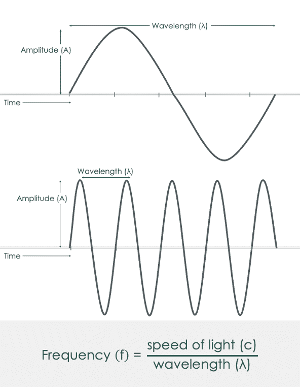
:::

:::

## Comportamiento de las ondas (interacción): reflexión

::: {.columns}
::: {.column width="50%"}
La **reflexión** ocurre cuando la radiación incidente es desviada por una superficie con un ángulo igual y opuesto al de incidencia.

Este fenómeno es la base de la mayoría de los sistemas de sensores remotos ópticos, donde se mide la energía reflejada por los objetos terrestres.
:::

::: {.column width="50%"}
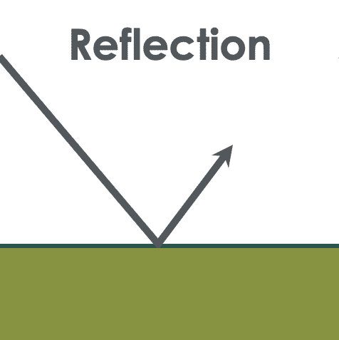{fig-align="center" width="50%"}
:::
:::

---

## Comportamiento de las ondas (interacción): absorción

::: {.columns}
::: {.column width="50%"}
La **absorción** es el proceso mediante el cual el material de la superficie retiene longitudes de onda específicas, transformando la energía electromagnética en otras formas (como calor).

En vegetación, la clorofila absorbe fuertemente en las bandas del azul y el rojo para la fotosíntesis.
:::

::: {.column width="50%"}
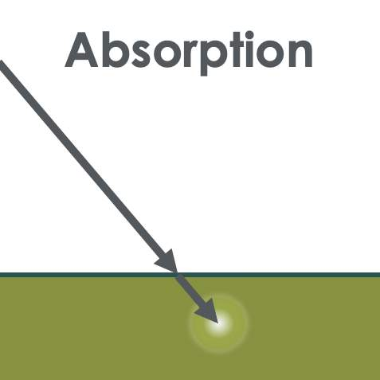{fig-align="center" width="50%"}
:::
:::

---

## Comportamiento de las ondas (interacción): dispersión

::: {.columns}
::: {.column width="50%"}
La **dispersión** o *scatter* sucede cuando la energía rebota en múltiples direcciones al interactuar con partículas o superficies rugosas.

- **Retrodispersión**: Es la fracción de energía que regresa directamente hacia la fuente (crucial en sistemas de Radar).
:::

::: {.column width="50%"}
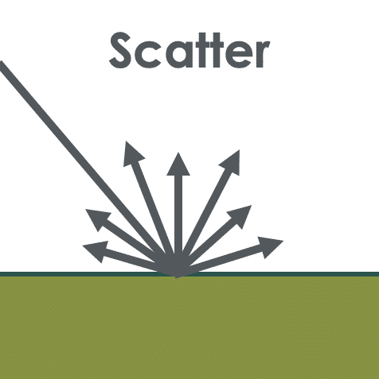{fig-align="center" width="50%"}
:::
:::

---

## Comportamiento de las ondas (interacción): transmisión

::: {.columns}
::: {.column width="50%"}
La **transmisión** ocurre cuando la radiación atraviesa un cuerpo sin ser absorbida ni reflejada.

Este comportamiento es característico de materiales translúcidos o transparentes, como el agua clara o ciertas capas delgadas de vegetación.
:::

::: {.column width="50%"}
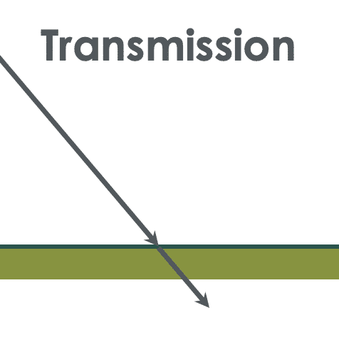{fig-align="center" width="50%"}
:::
:::

---

## Comportamiento de las ondas (interacción): emisión

::: {.columns}
::: {.column width="50%"}
La **emisión** es el proceso por el cual un objeto libera energía propia o re-emite la energía previamente absorbida.

Generalmente se manifiesta en longitudes de onda más largas (infrarrojo térmico) y permite medir la temperatura radiométrica de la superficie terrestre.
:::

::: {.column width="50%"}
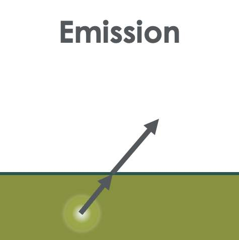{fig-align="center" width="50%"}
:::
:::

---

## Polarización

Es la medida de la **alineación del campo electromagnético**. 

- Se refiere al plano y dirección en la que vibran las ondas.
- Las ondas pueden **polarizarse** o **despolarizarse** al interactuar con superficies de texturas específicas.
- Es una propiedad fundamental para sensores de Radar (SAR).

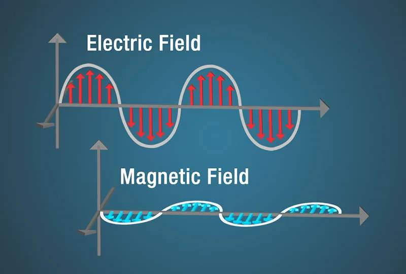

##

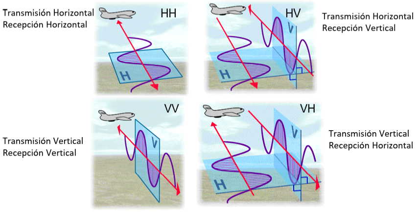{.nostretch fig-align="center" width="75%"}

---

## El Espectro Electromagnético (EEM)

El EEM es el rango que abarca todos los tipos de radiación electromagnética. La **radiación** es energía que viaja y se propaga; desde la luz de una lámpara hasta las ondas de una estación de radio.

- **Visión Humana**: Solo percibimos una franja minúscula (el espectro visible).
- **Percepción Remota**: Los sensores actúan como "ojos artificiales" en regiones invisibles (Infrarrojo, Microondas, etc.).

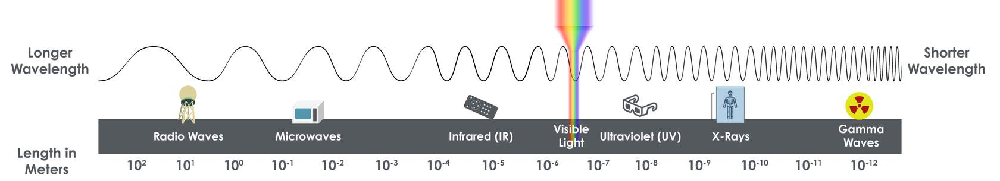

---

##

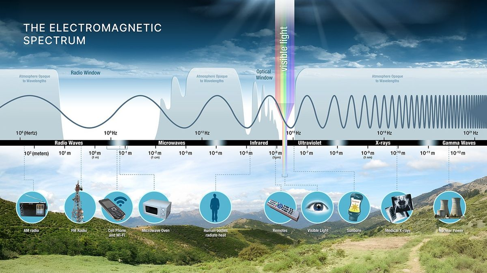{.nostretch fig-align="center" width="100%"}

## Ondas de radio - $\lambda$: $10^0$ m a $10^5$ m (1 m - 100 Km)

::: {.columns}
::: {.column width="50%"}
Menor frecuencia y la mayor longitud de onda. Es fundamental para el **monitoreo meteorológico** y el estudio de la **dinámica atmosférica global**.

### Aplicaciones técnicas

- **Humedad**: Obtención de perfiles de vapor de agua mediante radiometría.
- **Hidrometeoros**: Clasificación y distribución espacial de nubes.
- **Viento**: Medición de velocidad y dirección (dispersometría).
- **Precipitación**: Cuantificación de tasas de lluvia y nieve.
:::

::: {.column width="50%"}
{.nostretch fig-align="center" width="100%"}
:::

:::

## Microondas - $\lambda$: $10^{-3}$ m a $10^{-1}$ m (1 mm - 10 cm)

::: {.columns}
::: {.column width="50%"}
Capacidad de penetración atmosférica. Monitoreo de **patrones climáticos globales** y **variables biofísicas** de la superficie.

### Aplicaciones técnicas

- **Climatología global**: Seguimiento de patrones mediante la altura del nivel del mar y precipitación.
- **Temperatura superficial**: Medición de la temperatura radiométrica de la superficie terrestre.
- **Humedad del suelo**: Estimación del contenido de agua en el perfil superior del terreno.
:::

::: {.column width="50%"}
{.nostretch fig-align="center" width="100%"}
:::
:::

## Infrarrojo - $\lambda$: $.75$ a $100$ $\mu m$ ($7.5\times10^{-7}$ a $1.4\times10^{-4}$ m)

::: {.columns}
::: {.column width="50%"}
Análisis biofísico. Caracterizar el **estado fitosanitario de la vegetación** y la **composición del suelo**.

### Sub-regiones clave

- **Infrarrojo cercano (NIR)**: $0.75$ a $1.4$ $\mu m$ ($7.5 \times 10^{-7}$ a $1.4 \times 10^{-6}$ m). Biomasa y vigor foliar.
- **Infrarrojo de onda corta (SWIR)**: $1.4$ a $4$ $\mu m$ ($1.4 \times 10^{-6}$ a $3 \times 10^{-6}$ m). Humedad y tipos minerales.
- **Infrarrojo térmico (LWIR/TIR)**: $8$ a $15$ $\mu m$ ($8 \times 10^{-6}$ a $1.5 \times 10^{-5}$ m). Temperatura radiométrica.

:::

::: {.column width="50%"}
{.nostretch fig-align="center" width="75%"}
:::
:::

## Visible - $\lambda$: $400$ a $750$ nm ($4 \times 10^{-7}$ a $7.5 \times 10^{-7}$ m)

::: {.columns}
::: {.column width="50%"}
Ojo humano. **Cuerpos de agua** y **composición atmosférica**.

### Componentes cromáticos (RGB)

- **Rojo**: $\sim 690$ nm
- **Verde**: $\sim 530$ nm
- **Azul**: $\sim 420$ nm

### Aplicaciones técnicas

- **Cuerpos de agua**: Fitoplancton y características hídricas.
- **Suelos**: Composición de la capa superficial.
- **Atmósfera**: Gases traza, aerosoles y material particulado.

:::

::: {.column width="50%"}
{.nostretch fig-align="center" width="85%"}
:::
:::

## Ultravioleta - $\lambda$: $1$ a $100$ nm ($10^{-9}$ a $10^{-7}$ m)

::: {.columns}
::: {.column width="50%"}
Región del espectro situada entre los rayos X y el espectro visible. Su interacción con la atmósfera es crítica para la protección de la vida en la Tierra.

### Aplicaciones técnicas

- **Capa de ozono**: Medición de la concentración y distribución del ozono estratosférico.
- **Calidad del aire**: Monitoreo de contaminantes y partículas en la atmósfera superior e inferior.

**Nota técnica**: 1 nm (nanómetro) $= 10^{-9}$ m.
:::

::: {.column width="50%"}
{.nostretch fig-align="center" width="85%"}
:::
:::

## Rayos gamma - $\lambda$: $1$ a $100$ fm ($10^{-15}$ a $10^{-13}$ m)

Región de máxima energía y mínima longitud de onda del espectro. Debido a la interacción con las capas altas de la atmósfera, su uso en geomática es limitado.

### Restricciones en percepción remota

- **Absorción atmosférica**: La radiación es bloqueada completamente por la atmósfera superior.
- **Observación terrestre**: No se emplea para el monitoreo de la superficie desde sensores satelitales.
- **Fenomenología**: Asociada a transiciones nucleares y eventos cósmicos de alta energía.

**Nota técnica**: 1 fm (femtómetro) $= 10^{-15}$ m.

## Radiación solar

::: {.columns}
::: {.column width="50%"}
Principal fuente de energía electromagnética captada por los sistemas de percepción remota pasivos.

### Dinámica técnica

- **Fuente primaria**: Radiación emitida por el Sol.

- **Interacción**: Fenómenos de reflexión y absorción en la atmósfera y superficie terrestre.

- **Detección**: Sensores satelitales cuantifican la magnitud de la energía reflejada o emitida.

Fuente: NASA ARSET.
:::

::: {.column width="50%"}
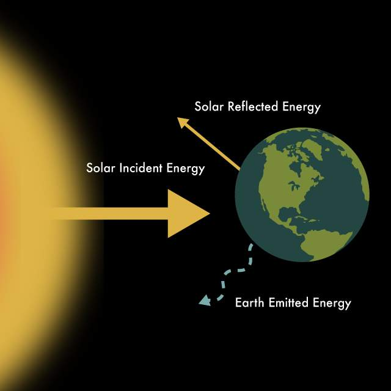{.nostretch fig-align="center" width="100%"}
:::
:::

## Espectro de emisión solar y rangos de observación

El Sol emite la mayor parte de su energía en longitudes de onda ópticas (onda corta). Sin embargo, la percepción remota satelital extiende su interés hacia regiones de mayor longitud de onda para capturar diversos fenómenos geofísicos.

- **Emisión solar**: Principalmente entre $0.1$ $\mu m$ y $4$ $\mu m$ (UV, visible e infrarrojo).
- **Rango de interés satelital**: Abarca desde el ultravioleta ($0.1$ $\mu m$) hasta las microondas ($100,000$ $\mu m$).

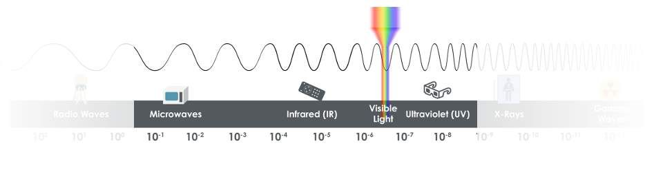

## Firmas espectrales

Las distintas longitudes de onda del espectro electromagnético interactúan de manera diferenciada con las propiedades físicas de los materiales en la atmósfera y la superficie terrestre.

- **Respuesta espectral**: El comportamiento específico de un material (cómo refleja, absorbe o emite radiación) ante la energía incidente.
- **Firma espectral**: Patrón característico de respuesta a través de múltiples longitudes de onda. Funciona como la "huella digital" única de cada objeto.

---

## Conceptos radiométricos

Para analizar las firmas espectrales, es indispensable estandarizar las mediciones de energía:

- **Radiancia**: Medida de la potencia de la radiación electromagnética emitida por un objeto por unidad de área. Es directamente proporcional a la amplitud de la onda.
- **Albedo superficial (porcentaje de reflectancia)**: Fracción de la radiación incidente que es reflejada por la superficie terrestre. Sus valores oscilan entre $0$ (absorción total) y $1$ (reflexión total).

---

## Detección y discriminación de coberturas

Los sensores remotos se diseñan calibrando sus detectores en regiones específicas del espectro electromagnético (bandas). 

El objetivo es capturar la respuesta espectral diferencial para identificar y separar materiales (agua, suelo, vegetación) basándose en su "huella digital" electromagnética.

---

## Dinámica de interacción en la superficie

Visión general de la interacción de la radiación incidente con los componentes del paisaje terrestre.

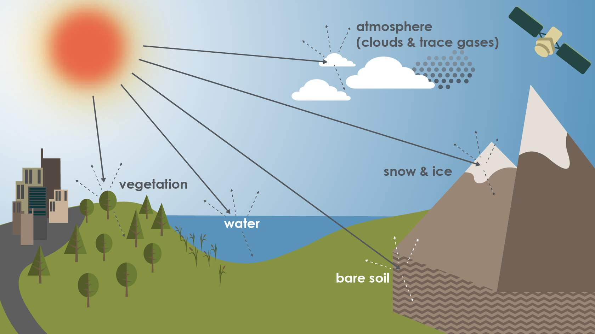{.nostretch fig-align="center" width="80%"}

---

## Firma espectral de la vegetación (interacción)

La firma espectral permite distinguir la cobertura vegetal de otros materiales en imágenes satelitales ópticas y del infrarrojo cercano. 

- **Absorción fotosintética**: La clorofila absorbe fuertemente la energía en las regiones del azul y el rojo.
- **Reflectancia visible**: Presenta un pico característico de reflectancia en la región del espectro verde.
- **Infrarrojo cercano (NIR)**: La reflectancia es drásticamente superior a la del espectro visible, conformando el rasgo principal para su identificación.

::: {.columns style="display: flex; align-items: center;"}

::: {.column width="80%"}
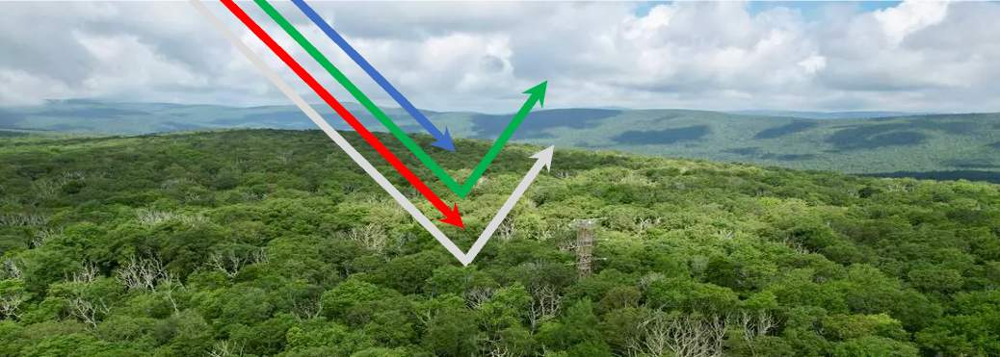{.nostretch fig-align="center" width="60%"}
:::

::: {.column width="20%"}
::: {style="font-size: 0.45em; color: gray; text-align: left;"}
**Fuente**: NASA ARSET.
:::
:::

:::

---

## Firma espectral de la vegetación (curva de reflectancia)

El análisis detallado de la curva de reflectancia facilita la discriminación entre tipologías vegetales (especies de hoja ancha, coníferas, pastizales) mediante la comparación con firmas espectrales de referencia.

- **Índices de vegetación**: El uso de reflectancias en longitudes de onda específicas permite formular métricas estandarizadas.
- **Aplicación analítica**: Estos índices describen el verdor, la densidad relativa y el estado fitosanitario para cada píxel de la imagen.

::: {.columns}
::: {.column width="80%"}
.jpg){.nostretch fig-align="center" width="80%"}
:::

::: {.column width="20%"}

     

::: {style="font-size: 0.5em; color: gray;"}
**Fuente**: NASA ARSET.
:::

:::

:::

## Firma espectral del agua (interacción)

La percepción remota acuática depende de las propiedades ópticas inherentes del agua y sus procesos físicos, químicos y biológicos.

- **Agua clara**: Presenta mayor reflectancia en longitudes de onda cortas (espectro visible) y fuerte absorción en longitudes mayores.
- **Agua turbia**: La presencia de sedimentos en suspensión incrementa significativamente la reflectancia en longitudes de onda más largas.
- **Factores de reflectancia**: La señal captada es modulada por la retrodispersión y absorción del fitoplancton, sedimentos y materia orgánica disuelta coloreada (CDOM).

::: {.columns style="display: flex; align-items: center;"}

::: {.column width="80%"}
{.nostretch fig-align="center" width="60%"}
:::

::: {.column width="20%"}
::: {style="font-size: 0.45em; color: gray; text-align: left;"}
**Fuente**: NASA ARSET.
:::
:::

:::

---

## Firma espectral del agua (curva de reflectancia)

El análisis de la curva de reflectancia es fundamental para monitorear ecosistemas acuáticos, evaluando variables como temperatura superficial, nivel del agua y proliferación de algas.

- **Comportamiento general**: Se observa máxima reflectancia en el espectro visible y una absorción casi total en la región del infrarrojo, lo que facilita la delineación de cuerpos hídricos.
- **Impacto de la clorofila**: Cuerpos de agua con altas concentraciones fitoplanctónicas exhiben un aumento de reflectancia en la región verde y una disminución en la azul.

::: {.columns}
::: {.column width="80%"}
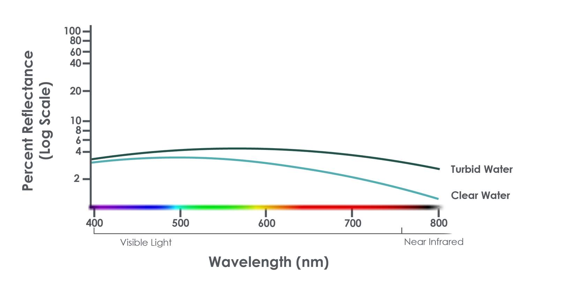{.nostretch fig-align="center" width="80%"}
:::

::: {.column width="20%"}

     

::: {style="font-size: 0.5em; color: gray;"}
**Fuente**: NASA ARSET.
:::

:::

:::

## Firma espectral del suelo (interacción)

La radiación electromagnética reflejada o retrodispersada provee información crítica sobre las propiedades edáficas, permitiendo optimizar prácticas agrícolas y evaluar la degradación del terreno.

- **Composición mineral y orgánica**: La reflectancia en los rangos visible e infrarrojo de onda corta (SWIR) permite estimar el carbono orgánico y discriminar minerales como los óxidos de hierro.
- **Humedad superficial**: La presencia de agua intersticial atenúa significativamente la reflectancia en el infrarrojo cercano (NIR).
- **Penetración de microondas**: En longitudes de onda mayores (microondas), la radiación penetra la capa superficial, posibilitando la cuantificación de la humedad volumétrica.

::: {.columns style="display: flex; align-items: center;"}

::: {.column width="80%"}
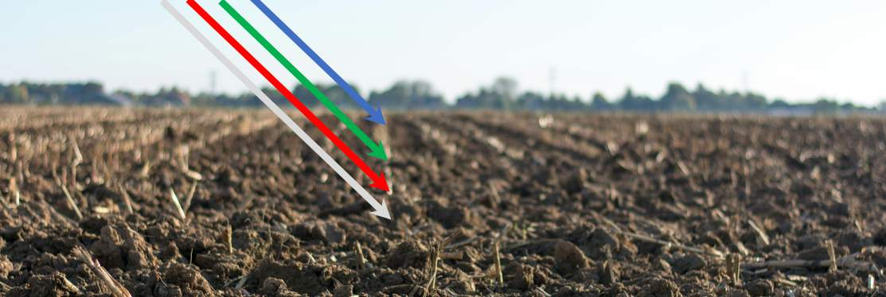{.nostretch fig-align="center" width="60%"}
:::

::: {.column width="20%"}
::: {style="font-size: 0.45em; color: gray; text-align: left;"}
**Fuente**: NASA ARSET.
:::
:::

:::

---

## Firma espectral del suelo (curva de reflectancia)

La curva de reflectancia del suelo exhibe un incremento gradual desde el espectro visible hacia el infrarrojo, modulado por su textura y composición.

- **Monitoreo edáfico**: Evaluación de fertilidad, materia orgánica y procesos erosivos.
- **Dinámica hídrica**: Estimación de humedad superficial para balances hidrológicos.
- **Análisis de fondo**: Caracterización base necesaria para aislar y analizar la señal de la vegetación superpuesta.

::: {.columns}
::: {.column width="80%"}
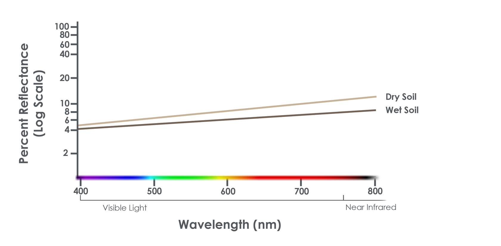{.nostretch fig-align="center" width="80%"}
:::

::: {.column width="20%"}

     

::: {style="font-size: 0.5em; color: gray;"}
**Fuente**: NASA ARSET.
:::

:::

:::

## Firma espectral de la nieve y el hielo (interacción)

La reflectancia de la nieve es máxima en el espectro visible e infrarrojo cercano (NIR), presentando una caída drástica en el infrarrojo de onda corta (SWIR).

- **Discriminación atmosférica**: Este comportamiento espectral contrastante permite separar algorítmicamente la cobertura nival de la nubosidad (altamente reflectiva en SWIR).
- **Altímetria láser**: Sensores activos complementan la firma óptica midiendo cambios volumétricos en glaciares y hielo marino, aportando datos críticos sobre el nivel del mar.

::: {.columns style="display: flex; align-items: center;"}

::: {.column width="80%"}
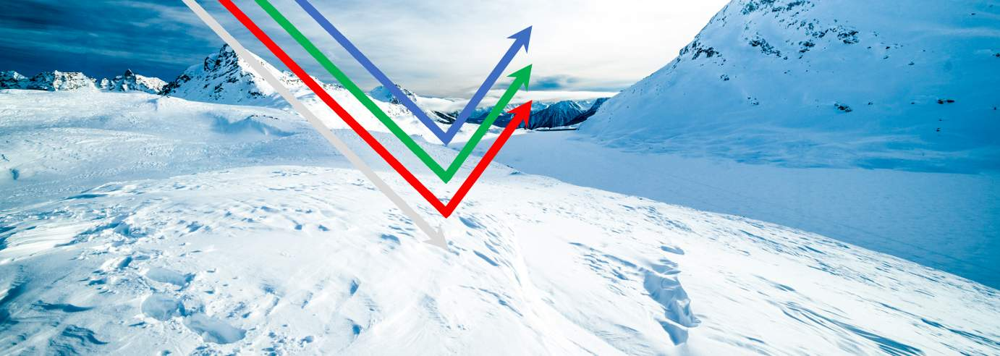{.nostretch fig-align="center" width="60%"}
:::

::: {.column width="20%"}
::: {style="font-size: 0.45em; color: gray; text-align: left;"}
**Fuente**: NASA ARSET.
:::
:::

:::

---

## Firma espectral de la nieve y el hielo (curva de reflectancia)

La curva de reflectancia evidencia la absorción casi total en la región SWIR, característica aprovechada para el monitoreo automatizado de la criósfera.

- **Índices normalizados**: El contraste de reflectancia entre bandas (VIS vs. SWIR) permite formular índices para mapear la presencia y extensión de nieve a nivel de píxel.
- **Hielo marino**: Se emplean algoritmos análogos para derivar la extensión espacial del hielo oceánico y analizar sus dinámicas estacionales.

::: {.columns}
::: {.column width="80%"}
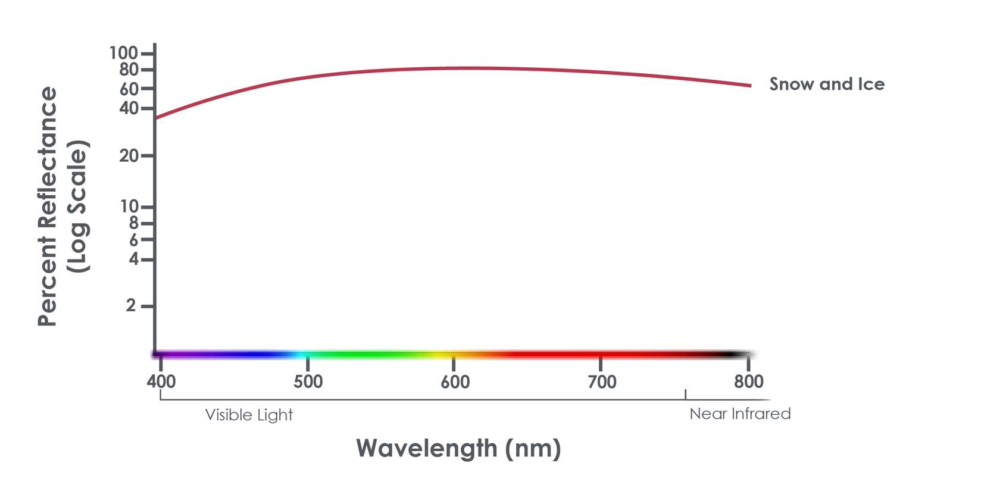{.nostretch fig-align="center" width="80%"}
:::

::: {.column width="20%"}

     

::: {style="font-size: 0.5em; color: gray;"}
**Fuente**: NASA ARSET.
:::

:::

:::

## Firma espectral de las nubes (interacción)

La radiación electromagnética interactúa con las gotas de agua y cristales de hielo en suspensión, tanto en su trayectoria incidente hacia la superficie como en la reflejada hacia el sensor.

- **Espectro visible**: Alta reflectancia, bloqueando la observación óptica de la superficie terrestre.
- **Infrarrojo (NIR y SWIR)**: Fuerte absorción de energía por parte de los componentes acuosos.
- **Transmisividad**: Las longitudes de onda de radio y microondas atraviesan la cobertura nubosa sin atenuación significativa.

::: {.columns style="display: flex; align-items: center;"}

::: {.column width="80%"}
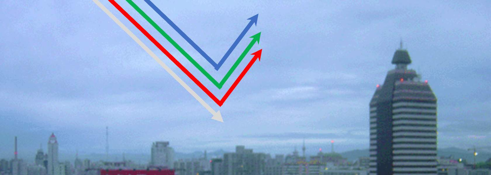{.nostretch fig-align="center" width="60%"}
:::

::: {.column width="20%"}
::: {style="font-size: 0.45em; color: gray; text-align: left;"}
**Fuente**: NASA ARSET.
:::
:::

:::

---

## Firma espectral de las nubes (curva de reflectancia)

La curva de reflectancia evidencia el alto contraste entre la región visible (altamente reflectiva) y el infrarrojo de onda corta (fuertemente absorbente).

- **Modulación energética**: Actúan como el principal modulador del albedo planetario.
- **Discriminación espectral**: La caída drástica de reflectancia en el SWIR es el mecanismo principal para separar ópticamente las nubes de superficies reflectivas similares en el visible, como la nieve o el hielo.

::: {.columns}
::: {.column width="80%"}
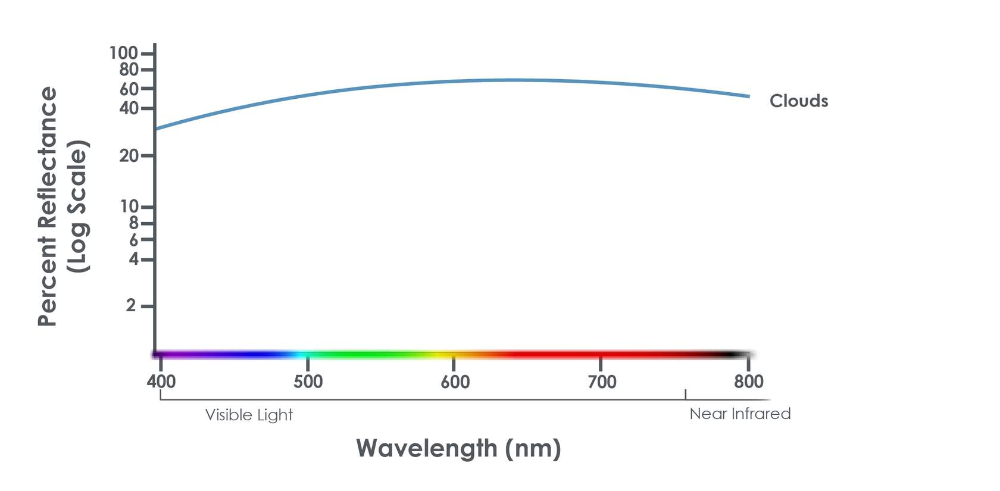{.nostretch fig-align="center" width="80%"}
:::

::: {.column width="20%"}

     

::: {style="font-size: 0.5em; color: gray;"}
**Fuente**: NASA ARSET.
:::

:::

:::

---

## Interacción atmosférica (gases traza y aerosoles)

Las partículas en suspensión (polvo, humo, emisiones industriales) y los gases interactúan con la radiación mediante procesos de dispersión y absorción diferencial, atenuando la señal captada por el sensor.

- **Aerosoles**: Reflejan o absorben cantidades variables de radiación dependiendo de su composición físico-química y tamaño de partícula.
- **Gases traza**: Cada gas presenta firmas de absorción únicas en el espectro.
- **Monitoreo ambiental**: Sensores especializados cuantifican gases de efecto invernadero ($CO_2$, $CH_4$) y contaminantes ($O_3$) críticos para el balance radiativo.

::: {.columns style="display: flex; align-items: center;"}

::: {.column width="80%"}
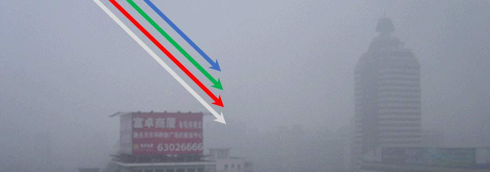{.nostretch fig-align="center" width="60%"}
:::

::: {.column width="20%"}
::: {style="font-size: 0.45em; color: gray; text-align: left;"}
**Fuente**: NASA ARSET.
:::
:::

:::

## Interferencia atmosférica

::: {.columns style="display: flex; align-items: center;"}

::: {.column width="45%"}
La radiación electromagnética interactúa bidireccionalmente con la atmósfera, alterando la energía que alcanza la superficie y la señal que retorna al sensor.

- **Trayectoria incidente**: Absorción y reflexión de la radiación solar por nubes y gases.
- **Trayectoria ascendente**: Atenuación (dispersión y absorción) de la energía que viaja desde la superficie hacia el satélite.
- **Corrección radiométrica**: Proceso necesario para modelar y compensar estos efectos, aislando la firma espectral real.
:::

::: {.column width="55%"}
{.nostretch fig-align="center" width="100%"}

::: {style="font-size: 0.45em; color: gray; text-align: center;"}
**Fuente**: NASA ARSET.
:::
:::

:::

## Comparación de firmas espectrales

::: {.columns style="display: flex; align-items: center;"}

::: {.column width="45%"}
Fundamento analítico para la clasificación automatizada de coberturas terrestres.

- **Discriminación espectral**: Separación de macro-categorías (vegetación, suelo) e identificación intra-clase (tipos de bosque).
- **Dinámica edáfica**: Alteración de la amplitud de reflectancia en función del nivel de humedad.
- **Monitoreo hídrico**: Contraste óptico entre agua clara, sedimentos en suspensión y concentración de clorofila.
:::

::: {.column width="55%"}
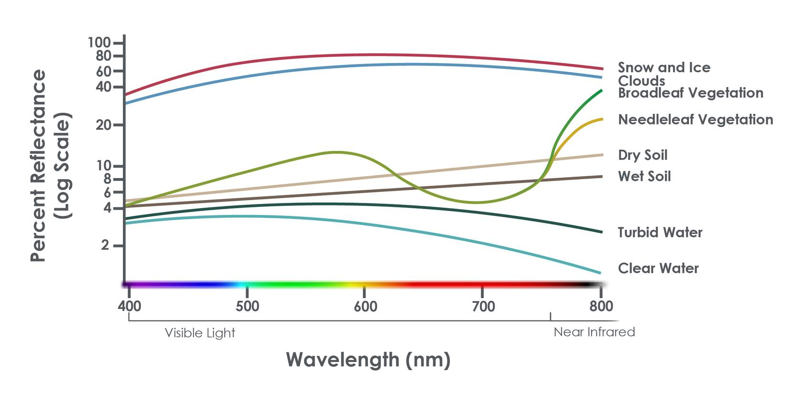{.nostretch fig-align="center" width="100%"}

::: {style="font-size: 0.45em; color: gray; text-align: center;"}
**Fuente**: NASA ARSET. Porcentaje de reflectancia respecto a la longitud de onda.
:::
:::

:::

## Ejercicio de control: asociación de firmas espectrales

Asocie el material de la columna derecha con la respuesta física correspondiente ante la radiación solar incidente.

::: {.columns}

::: {.column width="55%"}

::: {style="border: 1px solid #d3d3d3; border-left: 4px solid #7f8c8d; border-radius: 4px; padding: 10px 15px; margin-bottom: 12px; font-size: 0.8em; box-shadow: 1px 1px 4px rgba(0,0,0,0.05);"}
**1.** Refleja toda la luz visible y el infrarrojo.
:::

::: {style="border: 1px solid #d3d3d3; border-left: 4px solid #7f8c8d; border-radius: 4px; padding: 10px 15px; margin-bottom: 12px; font-size: 0.8em; box-shadow: 1px 1px 4px rgba(0,0,0,0.05);"}
**2.** Refleja luz visible de onda corta (azul) y absorbe rojo, verde e infrarrojo.
:::

::: {style="border: 1px solid #d3d3d3; border-left: 4px solid #7f8c8d; border-radius: 4px; padding: 10px 15px; margin-bottom: 12px; font-size: 0.8em; box-shadow: 1px 1px 4px rgba(0,0,0,0.05);"}
**3.** La reflectancia aumenta gradualmente con la longitud de onda, sin picos pronunciados.
:::

::: {style="border: 1px solid #d3d3d3; border-left: 4px solid #7f8c8d; border-radius: 4px; padding: 10px 15px; margin-bottom: 12px; font-size: 0.8em; box-shadow: 1px 1px 4px rgba(0,0,0,0.05);"}
**4.** Refleja toda la luz visible y absorbe fuertemente el infrarrojo.
:::

::: {style="border: 1px solid #d3d3d3; border-left: 4px solid #7f8c8d; border-radius: 4px; padding: 10px 15px; margin-bottom: 12px; font-size: 0.8em; box-shadow: 1px 1px 4px rgba(0,0,0,0.05);"}
**5.** Refleja verde e infrarrojo cercano, absorbe azul y rojo.
:::

:::

::: {.column width="5%"}
:::

::: {.column width="40%"}

::: {style="border: 1px solid #d3d3d3; border-left: 4px solid #27ae60; border-radius: 4px; padding: 10px 15px; margin-bottom: 12px; font-size: 0.8em; box-shadow: 1px 1px 4px rgba(0,0,0,0.05);"}
**A.** Agua oceánica
:::

::: {style="border: 1px solid #d3d3d3; border-left: 4px solid #27ae60; border-radius: 4px; padding: 10px 15px; margin-bottom: 12px; font-size: 0.8em; box-shadow: 1px 1px 4px rgba(0,0,0,0.05);"}
**B.** Nubes
:::

::: {style="border: 1px solid #d3d3d3; border-left: 4px solid #27ae60; border-radius: 4px; padding: 10px 15px; margin-bottom: 12px; font-size: 0.8em; box-shadow: 1px 1px 4px rgba(0,0,0,0.05);"}
**C.** Suelo seco
:::

::: {style="border: 1px solid #d3d3d3; border-left: 4px solid #27ae60; border-radius: 4px; padding: 10px 15px; margin-bottom: 12px; font-size: 0.8em; box-shadow: 1px 1px 4px rgba(0,0,0,0.05);"}
**D.** Capa de hielo
:::

::: {style="border: 1px solid #d3d3d3; border-left: 4px solid #27ae60; border-radius: 4px; padding: 10px 15px; margin-bottom: 12px; font-size: 0.8em; box-shadow: 1px 1px 4px rgba(0,0,0,0.05);"}
**E.** Hojas de árboles
:::

:::

:::

## Soluciones: asociación de firmas espectrales

::: {style="border: 1px solid #d3d3d3; border-left: 5px solid #2c3e50; border-radius: 4px; padding: 12px 15px; margin-bottom: 12px; font-size: 0.85em; box-shadow: 1px 1px 4px rgba(0,0,0,0.05);"}
**1 → D (Capa de hielo)**: Presenta alta reflectancia en todo el espectro visible y refleja adicionalmente las longitudes de onda del infrarrojo cercano, lo que permite diferenciarla de la cobertura nubosa.
:::

::: {style="border: 1px solid #d3d3d3; border-left: 5px solid #2c3e50; border-radius: 4px; padding: 12px 15px; margin-bottom: 12px; font-size: 0.85em; box-shadow: 1px 1px 4px rgba(0,0,0,0.05);"}
**2 → A (Agua oceánica)**: Su respuesta espectral obedece al incremento en la dispersión y reflexión de longitudes de onda cortas (visible azul), mientras que las longitudes más largas y el infrarrojo son absorbidas.
:::

::: {style="border: 1px solid #d3d3d3; border-left: 5px solid #2c3e50; border-radius: 4px; padding: 12px 15px; margin-bottom: 12px; font-size: 0.85em; box-shadow: 1px 1px 4px rgba(0,0,0,0.05);"}
**3 → C (Suelo seco)**: La reflectancia aumenta de forma gradual a medida que se incrementa la longitud de onda, sin exhibir niveles de alta reflectividad en ningún rango específico del espectro.
:::

::: {style="border: 1px solid #d3d3d3; border-left: 5px solid #2c3e50; border-radius: 4px; padding: 12px 15px; margin-bottom: 12px; font-size: 0.85em; box-shadow: 1px 1px 4px rgba(0,0,0,0.05);"}
**4 → B (Nubes)**: Similar al hielo, exhibe alta reflectancia en el visible; sin embargo, absorbe las longitudes de onda infrarrojas y las remite en función de sus propiedades físicas estructurales.
:::

::: {style="border: 1px solid #d3d3d3; border-left: 5px solid #2c3e50; border-radius: 4px; padding: 12px 15px; margin-bottom: 12px; font-size: 0.85em; box-shadow: 1px 1px 4px rgba(0,0,0,0.05);"}
**5 → E (Hojas de árboles)**: Refleja las longitudes de onda verdes y del infrarrojo cercano, mientras absorbe otras partes del espectro visible (azul y rojo) para facilitar los procesos fotosintéticos.
:::

## Resumen del módulo: fundamentos físicos

Síntesis de los principios científicos que viabilizan la observación de la Tierra mediante sensores remotos.

::: {.columns style="display: flex; align-items: center;"}

::: {.column width="65%"}
1. **Fundamentos**: Definición conceptual de percepción remota y radiación solar.
2. **Espectro electromagnético**: Clasificación de regiones según su longitud de onda.
3. **Dinámica de ondas**: Relación inversa entre longitud de onda y frecuencia.
4. **Firmas espectrales**: Discriminación de coberturas terrestres mediante respuestas diferenciales.
5. **Interferencia atmosférica**: Efectos de atenuación y necesidad estricta de corrección radiométrica.
:::

::: {.column width="35%"}
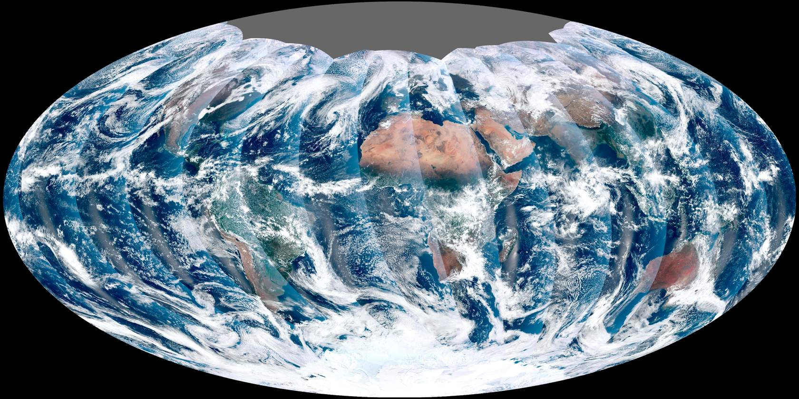{.nostretch fig-align="center" width="100%"}

::: {style="font-size: 0.45em; color: gray; text-align: center;"}
**Fuente**: Suomi-NPP VIIRS, primera imagen, 2011.
:::
:::

:::

## Recursos de Exploración

Para profundizar en las características de cada región del espectro, puedes consultar los siguientes recursos oficiales:

- **Herramientas de la NASA:** [Guía del Espectro Electromagnético](https://imagine.gsfc.nasa.gov/science/toolbox/emspectrum1.html)

- **Animación 4K:** [Visualización del Espectro Lumínico (NASA SVS)](https://svs.gsfc.nasa.gov/vis/a020000/a020200/a020241/WFirst_LightSpectrum_Final_H264_HD_1080p.webm)

# Módulo 3: ¿Cómo Funciona la Percepción Remota?

Este módulo examina las características de los satélites de observación de la Tierra y los instrumentos que hacen posible la captura de datos.

::: {style="font-size: 0.5em; color: gray;"}
**Fuente**: NASA.
:::

---

## Introducción y objetivos

Análisis de la medición de radiación electromagnética mediante sensores satelitales para la derivación de parámetros geofísicos del sistema Tierra-atmósfera.

::: {.columns style="display: flex; align-items: center;"}

::: {.column width="60%"}
- **Plataformas e instrumentos**: Diferenciación conceptual y operativa entre el satélite y el sensor.
- **Características críticas**: Evaluación de parámetros fundamentales para el cumplimiento misional, incluyendo órbitas, fuentes de energía y resoluciones (espectral, espacial, temporal y radiométrica).
- **Concesiones de diseño**: Análisis de los compromisos técnicos (*trade-offs*) inherentes a la configuración de las misiones satelitales.
- **Casos de estudio**: Exploración de misiones aplicadas de ciencias de la Tierra de la NASA.
:::

::: {.column width="40%"}
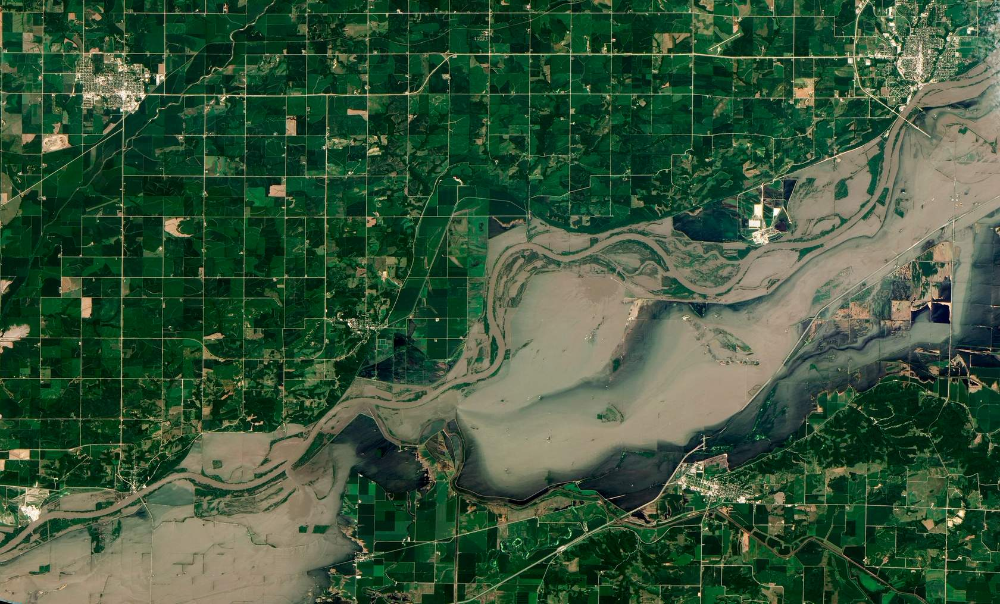{.nostretch fig-align="center" width="100%"}

::: {style="font-size: 0.45em; color: gray; text-align: center;"}
**Fuente**: NASA Earth Observatory. Inundaciones en Hamburg, Iowa, EE. UU. (2011).
:::
:::

:::

## Plataformas y sensores remotos

Diferenciación estricta entre el vehículo portador y el instrumento de medición.

::: {.columns style="display: flex; align-items: center;"}

::: {.column width="40%"}
- **Plataforma**: Vehículo espacial en órbita (ej. satélite).
- **Sensor**: Instrumento que capta la radiación. Una plataforma puede alojar múltiples sensores.
- **Jerarquía**: Sistemas terrestres, aéreos y espaciales seleccionados según el objetivo científico.
:::

::: {.column width="60%"}
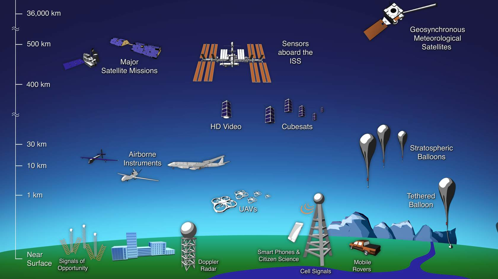{.nostretch fig-align="center" width="100%"}

::: {style="font-size: 0.45em; color: gray; text-align: center;"}
**Fuente**: Tipos de plataformas de teledetección. NASA ARSET.
:::
:::

:::

---

## Sensores Remotos desde la Tierra, la Atmósfera y el Espacio 

::: {.column-screen}

:::

Fuente: NASA Scientific Visualization Studio.

## Flota Científica Operativa y Futura - NASA

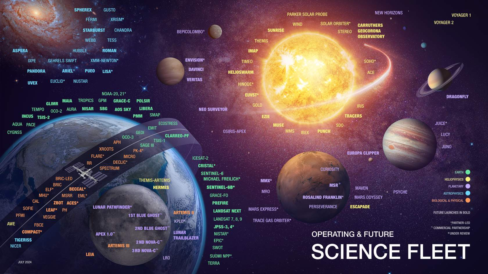

## Constelación de observación de la Tierra

Visualización interactiva del estado actual y la trayectoria orbital de los satélites que conforman la flota de observación de la Tierra de la NASA. 

La capacidad operativa de esta constelación permite cuantificar variables desde el tope de la atmósfera hasta dinámicas subsuperficiales de manera continua.

  <a href="https://svs.gsfc.nasa.gov/5067/#media_group_377867" target="_blank" style="display: inline-block; padding: 15px 30px; background-color: #2c3e50; color: white; text-decoration: none; border-radius: 8px; font-weight: bold; font-size: 1.2em; box-shadow: 2px 2px 5px rgba(0,0,0,0.2);">
    ▶ Explorar monitor interactivo orbital (NASA SVS)
  </a>

## [Misión científica satelital terrestre (Landsat 9)](https://landsat.gsfc.nasa.gov/satellites/landsat-9/)

::: {.columns style="display: flex; align-items: center;"}

::: {.column width="55%"}
- **Registro histórico**: Asegura la continuidad espacial (NASA/USGS) para el monitoreo de la dinámica de cobertura terrestre desde 1972.
- **Lanzamiento**: Septiembre de 2021.
- **Resolución espacial**: Hasta 15 m.
- **Instrumentación**: Radiómetros formadores de imágenes.
  - **OLI-2**: Captura en bandas reflectivas (espectro visible e infrarrojo).
  - **TIRS-2**: Cuantificación en bandas del infrarrojo térmico.
:::

::: {.column width="45%"}
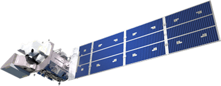{.nostretch fig-align="center" width="100%"}

::: {style="font-size: 0.45em; color: gray; text-align: center;"}
**Fuente**: NASA/USGS.
:::
:::

:::

---

## [Misión del radiómetro de imágenes visible infrarrojo (VIIRS)](https://www.earthdata.nasa.gov/data/instruments/viirs)

::: {.columns style="display: flex; align-items: center;"}

::: {.column width="55%"}
- **Continuidad climática**: Hereda y expande los registros de sensores legados (MODIS, AVHRR).
- **Lanzamiento**: Octubre de 2011.
- **Resolución espacial**: Nominal a 750 m; bandas de alta resolución a 375 m.
- **Capacidad espectral (21 bandas)**: 9 en visible/NIR, 8 en infrarrojo medio y 4 en infrarrojo térmico (LWIR).
- **Cobertura temporal**: Su extenso campo de visión (FOV) permite una revisita global diaria.
- **Aplicaciones**: Cuantificación de albedo, aerosoles, temperatura superficial y dinámica de la criósfera.
:::

::: {.column width="45%"}
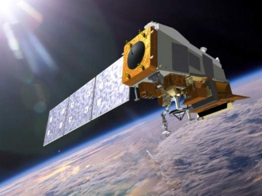{.nostretch fig-align="center" width="100%"}

::: {style="font-size: 0.45em; color: gray; text-align: center;"}
**Fuente**: NASA.
:::
:::

:::

## [Misión de monitoreo de emisiones troposféricas (TEMPO)](https://science.nasa.gov/mission/tempo/)

::: {.columns style="display: flex; align-items: center;"}

::: {.column width="55%"}
- **Lanzamiento**: Abril de 2023.
- **Órbita**: Primer instrumento geoestacionario sobre Norteamérica dedicado al monitoreo de la calidad del aire.
- **Resolución temporal**: Captura diurna con frecuencia horaria.
- **Instrumentación**: Espectrómetro operando en los rangos ultravioleta (UV) y visible.
- **Capacidad espectral**: Cuantificación de intensidad en cientos de longitudes de onda individuales.
- **Aplicaciones**: Derivación de concentraciones troposféricas de gases traza y aerosoles para evaluar impactos en la salud pública y el clima.
:::

::: {.column width="45%"}
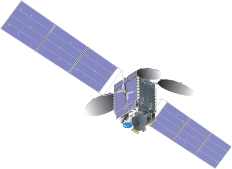{.nostretch fig-align="center" width="100%"}

 

::: {style="font-size: 0.45em; color: gray; text-align: center;"}
**Fuente**: NASA.
:::
:::

:::

## [Misión de radar de apertura sintética NASA-ISRO (NISAR)](https://nisar.jpl.nasa.gov/)

::: {.columns style="display: flex; align-items: center;"}

::: {.column width="80%"}
- **Misión conjunta (2025)**: Cooperación tecnológica NASA-ISRO.
- **Sensor activo**: Radares polarimétricos operando simultáneamente en bandas L y S.
- **Señal de microondas**: Penetración efectiva de nubes y del dosel vegetal superficial.
- **Apertura sintética**: Integración algorítmica de trayectorias orbitales para maximizar la resolución espacial.
- **Precisión geométrica**: Sensibilidad centimétrica para deformaciones.
- **Aplicaciones**: Dinámicas terrestres, riesgo geológico (deslizamientos, sismos) y glaciología.
:::

::: {.column width="20%"}
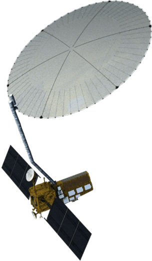{.nostretch fig-align="center" width="100%"}

 

::: {style="font-size: 0.45em; color: gray; text-align: center;"}
**Fuente**: NASA/ISRO.
:::
:::

:::

## [Misión de medición de precipitación global (GPM)](https://gpm.nasa.gov/)

::: {.columns style="display: flex; align-items: center;"}

::: {.column width="75%"}

- **Lanzamiento**: Febrero de 2014.
- **Objetivo misional**: Establecer un estándar de referencia para intercalibrar constelaciones internacionales y unificar estimaciones de precipitación.
- **Instrumentación combinada**:
  - **GMI** (Radiómetro de microondas): Sensor pasivo multibanda para cuantificar contenido de agua y hielo en perfiles nubosos.
  - **DPR** (Radar de precipitación de doble frecuencia): Sensor activo (13.6 y 35.5 GHz). Penetra la atmósfera para derivar tasas de precipitación y dimensiones de partículas (lluvia y nieve).
- **Calibración cruzada**: La sinergia GMI-DPR valida mediciones de misiones equipadas con un único sensor de microondas.
:::

::: {.column width="25%"}
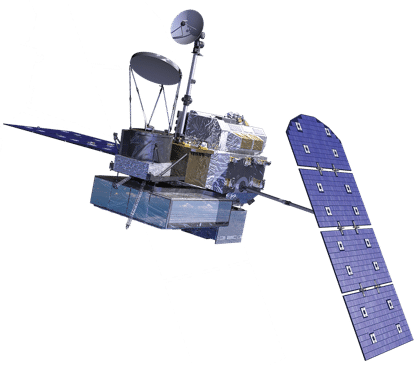{.nostretch fig-align="center" width="100%"}

 

::: {style="font-size: 0.45em; color: gray; text-align: center;"}
**Fuente**: NASA.
:::
:::

:::

## [Instrumentos de observación de la Tierra (NASA Earthdata)](https://www.earthdata.nasa.gov/data/instruments)

Recurso técnico centralizado para la consulta de especificaciones detalladas de la flota de sensores de la NASA.

 

- **Catálogo integral**: Acceso a la documentación técnica de todos los instrumentos de misiones de ciencias de la Tierra.
- **Clasificación funcional**: Facilita la identificación de sensores según el tipo de medición (pasiva o activa) y la región del espectro electromagnético.
- **Vinculación de datos**: Conexión directa entre el instrumento y los repositorios de productos geofísicos distribuidos por los DAACs.
- **Referencia para investigación**: Herramienta esencial para la selección de sensores en el diseño de misiones y proyectos de teledetección aplicada.

 

::: {style="text-align: center; font-style: italic; color: #7f8c8d;"}
Explore el catálogo completo de sensores en el enlace del título superior.
:::

## Características técnicas: visión general

Los objetivos científicos determinan las especificaciones funcionales de plataformas y sensores.

::: {.columns}

::: {.column width="40%"}
**Atributos de evaluación**

- Órbita: geometría espacial
- Fuente de energía: tipo de detección
- Resolución espectral
- Rango espectral
- Resolución espacial y cobertura
- Resolución temporal
- Resolución radiométrica
:::

::: {.column width="60%"}
**Matriz de misiones y sensores**

::: {style="font-size: 0.75em;"}
| Misión | Satélite | Sensor |
|:---|:---|:---|
| [Landsat 9](https://landsat.gsfc.nasa.gov/) | Landsat 9 | OLI-2: Operational Land Imager 2 |
| [VIIRS](https://www.earthdata.nasa.gov/data/instruments/viirs) | Suomi NPP | VIIRS: Visible Infrared Imaging Radiometer Suite |
| [TEMPO](https://tempo.si.edu/) | Intelsat 40e | TEMPO: Tropospheric Emissions: Monitoring of Pollution |
| [NISAR](https://nisar.jpl.nasa.gov/) | NISAR | SAR: Synthetic Aperture Radar |
| [GPM](https://gpm.nasa.gov/) | GPM | GMI: GPM Microwave Imager |
:::
:::

:::

## Órbitas: geostacionaria (GEO)

Las trayectorias orbitales determinan la escala espacial y la frecuencia de muestreo de los sensores. En percepción remota, predominan la órbita geoestacionaria (GEO) y la órbita terrestre baja (LEO).

::: {.columns style="display: flex; align-items: center;"}

::: {.column width="70%"}
**Fundamentos de la órbita GEO**

- **Estabilidad**: Mantiene una posición fija sobre el ecuador terrestre al rotar con la misma velocidad angular que el planeta.
- **Altitud**: Se sitúa a una distancia aproximada de 36,000 km de la superficie.
- **Perspectiva**: Permite la observación constante de un hemisferio completo ("disco completo" o *full disk view*).
- **Alcance**: Algunos sensores pueden focalizarse en regiones específicas dentro del campo de interés (*field of regard*).
:::

::: {.column width="30%"}

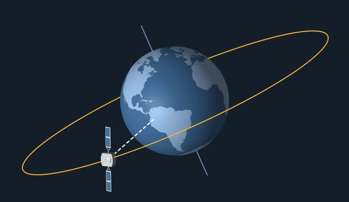{.nostretch fig-align="center" width="80%"}

  
Visualización técnica: GOES-East y GOES-West

  
  <a href="https://svs.gsfc.nasa.gov/4618/#media_group_327863" target="_blank" style="display: inline-block; padding: 12px 20px; background-color: #2c3e50; color: white; text-decoration: none; border-radius: 6px; font-weight: bold; font-size: 0.9em; box-shadow: 2px 2px 5px rgba(0,0,0,0.1);">
    ▶ Abrir animación en NASA SVS
  </a>

  

    **Descripción**: Representación de las áreas de cobertura terrestre de los satélites GOES-East y GOES-West desde su posición orbital a 22,236 millas (aprox. 35,786 km) sobre el ecuador. Fuente: NASA Scientific Visualization Studio.
  

:::

:::

## Órbita terrestre baja (LEO) y heliosincronismo

- **Altitud**: Entre 200 y 1,000 km (significativamente menor a GEO).
- **Órbita polar**: Trayectoria polo a polo que cubre toda la superficie mediante la rotación terrestre.
- **Heliosincronismo**: El satélite cruza latitudes específicas a la misma hora solar local.
- **Iluminación**: Garantiza condiciones de luz consistentes para análisis multitemporal.

---

## Sistema JPSS: monitoreo global continuo

::: {.columns style="display: flex; align-items: center;"}

::: {.column width="60%"}
- **Frecuencia**: 14 revoluciones diarias con cobertura global total cada 12 horas.
- **Instrumentación**: Sensor VIIRS (datos en franjas o *swaths*) y monitoreo de ozono/temperatura.
- **Impacto**: Base del sistema de observación meteorológica y climática global.
- **Predicción**: Mejora la precisión de alertas severas con 3 a 7 días de antelación.
:::

::: {.column width="40%"}

  
Órbita y datos de JPSS-2

  
  <a href="https://svs.gsfc.nasa.gov/5045/" target="_blank" style="display: inline-block; padding: 12px 20px; background-color: #2c3e50; color: white; text-decoration: none; border-radius: 6px; font-weight: bold; font-size: 0.9em; box-shadow: 2px 2px 5px rgba(0,0,0,0.1);">
    ▶ Ver animación en NASA SVS
  </a>

:::

:::

---

## Dinámica de paso: ejemplo Landsat 9

::: {.columns style="display: flex; align-items: center;"}

::: {.column width="50%"}
- **Pasada ascendente**: Trayectoria sur-norte; ocurre típicamente de noche (ej. 03:45 UTC).
- **Pasada descendente**: Trayectoria norte-sur; representa la captura diurna (ej. 15:50 UTC).
- **Limitación de FOV**: Sensores de alta resolución tienen campos de visión estrechos.
- **Nota**: Un punto geográfico puede no ser observado dos veces al día a pesar del heliosincronismo.
:::

::: {.column width="50%"}
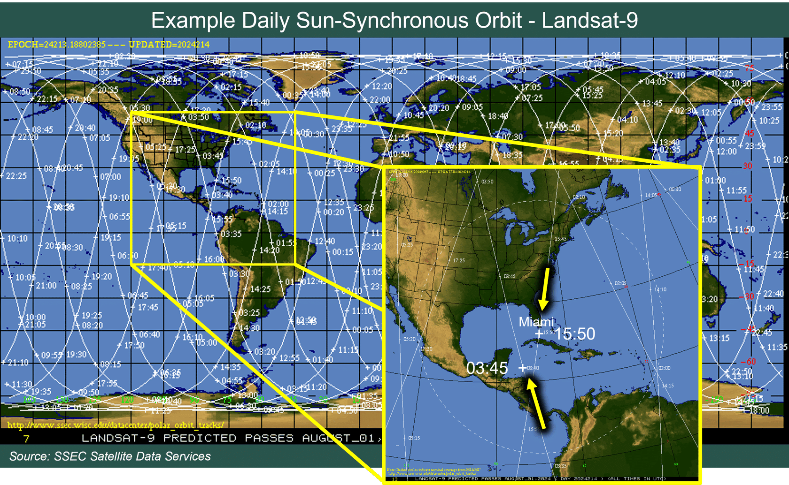{.nostretch fig-align="center" width="100%"}

::: {style="font-size: 0.45em; color: gray; text-align: center;"}
**Trayectoria orbital**: Pasadas diurnas (descendentes) y nocturnas (ascendentes).
:::
:::

:::

## Órbitas LEO: variaciones no heliosincrónicas

Existen configuraciones orbitales que no mantienen una relación constante con la posición del Sol, seleccionadas para objetivos científicos específicos que requieren muestreos en diferentes horarios locales.

- **Órbita polar no heliosincrónica**: A diferencia de las misiones estándar, no mantiene una hora solar local consistente sobre el rastro terrestre.
- **Órbita inclinada (no polar)**: Trayectoria que no cruza los polos, resultando en tiempos de paso irregulares.
- **Ventaja operativa**: Permite múltiples pasadas diarias sobre regiones de latitudes bajas y medias.
- **Limitación de cobertura**: Estas misiones no proporcionan cobertura global, ya que excluyen las regiones polares por diseño.

---

## Caso de estudio: constelación GPM e IMERG

La misión Global Precipitation Measurement (GPM) utiliza una órbita inclinada para capturar la variabilidad de la precipitación en diferentes momentos del ciclo diurno.

::: {.columns style="display: flex; align-items: center;"}

::: {.column width="60%"}
- **Muestreo dinámico**: La órbita no polar permite observar tormentas en horarios variables, crucial para fenómenos meteorológicos de rápida evolución.
- **Intercalibración**: Al cruzar las trayectorias de satélites polares, GPM actúa como referencia para estandarizar mediciones de toda la constelación.
- **IMERG**: Algoritmo que integra datos de múltiples satélites para generar mapas de precipitación global cada 30 minutos.
:::

::: {.column width="40%"}

  
Constelación GPM y datos IMERG

  
  <a href="https://svs.gsfc.nasa.gov/4369/" target="_blank" style="display: inline-block; padding: 12px 20px; background-color: #2c3e50; color: white; text-decoration: none; border-radius: 6px; font-weight: bold; font-size: 0.7em; box-shadow: 2px 2px 5px rgba(0,0,0,0.1);">
    ▶ Ver visualización en NASA SVS
  </a>

  

    **Descripción**: Animación de la órbita no polar de GPM y la recuperación de precipitación global multisatélite. Animación que representa la acumulación de datos de precipitación en un mapa 2D a partir de la constelación de satélites Global Precipitation Measurement (GPM), derivando en el conjunto de datos de precipitación global IMERG. Fuente: NASA Scientific Visualization Studio.
  

:::

:::

## Satélites Geoestacionarios (GEO)

Orbitan a la misma velocidad que la rotación terrestre, manteniéndose sobre un punto fijo.

::: columns
::: {.column width="60%"}
### Fortalezas
- **Alta frecuencia temporal**: Observaciones cada pocos minutos.
- Ideal para capturar eventos rápidos (tormentas eléctricas).
- Vital para operaciones constantes de clima y comunicaciones.

### Limitaciones
- **Vista parcial**: Solo observa una porción fija de la Tierra.
- **Baja calidad en los polos**: Debido al ángulo de visión.
:::

::: {.column width="40%"}

:::
:::

---

## Satélites de Órbita Baja (LEO)

Los satélites LEO (como el sensor VIIRS) orbitan a altitudes menores y se desplazan rápidamente sobre la superficie.

::: columns
::: {.column width="40%"}
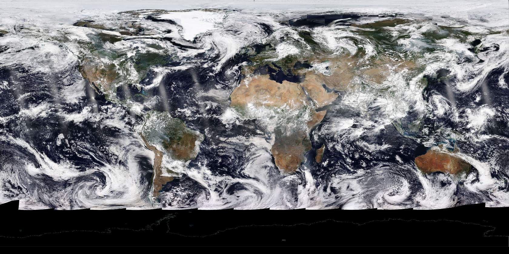
:::

::: {.column width="60%"}
### Fortalezas
- **Cobertura Global**: Escanean todo el planeta.
- **Hora Local Constante**: Observaciones bajo las mismas condiciones lumínicas.
- **Alta calidad en los polos**: Cruce directo sobre regiones polares.

### Limitaciones
- **Baja frecuencia temporal**: Pasan sobre un lugar solo 1 o 2 veces al día.
- Limitado para monitoreo de eventos en tiempo real.
:::
:::

## Pregunta de Repaso: ¿Qué órbita es?

Si un satélite rodea la Tierra a la misma velocidad que la Tierra gira sobre su propio eje, ¿qué tipo de órbita es esta?

::: columns
::: {.column width="45%"}
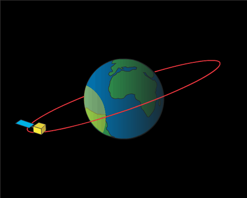
:::

::: {.column width="55%"}
- a) Órbita Terrestre Baja Sincrónica al Sol (SS-LEO)
- b) Órbita Terrestre Baja No Polar
- c) Órbita Terrestre Geoestacionaria (GEO)
- d) Órbita Terrestre Geoestacionaria Sincrónica al Sol

::: {.fragment}
::: {.callout-tip}
## Respuesta Correcta: C
La órbita **Geoestacionaria (GEO)** permite que el satélite se desplace a la misma velocidad angular que la rotación de la Tierra sobre su eje, manteniéndose siempre sobre el mismo punto.
:::
:::
:::
:::

## Pregunta de Repaso: Órbitas LEO

Si un satélite rodea la Tierra pasando sobre cada polo, ¿cuáles son los posibles tipos de órbita que podrían estar ocurriendo? (Selecciona todas las que apliquen).

::: columns
::: {.column width="45%"}
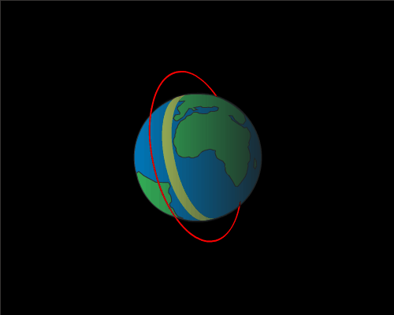
:::

::: {.column width="55%"}
- a) Órbita Terrestre Baja Sincrónica al Sol (SS-LEO)
- b) Órbita Terrestre Baja No Polar (LEO No Polar)
- c) Órbita Terrestre Geoestacionaria (GEO)
- d) Órbita Terrestre Baja Polar (LEO Polar)

::: {.fragment}
::: {.callout-tip}
## Respuestas Correctas: A y D
Tanto la **Órbita Polar** como la **Sincrónica al Sol** son tipos de órbitas de baja altitud (LEO) que pasan sobre o cerca de los polos para lograr una cobertura global.
:::
:::
:::
:::

---

## 

---

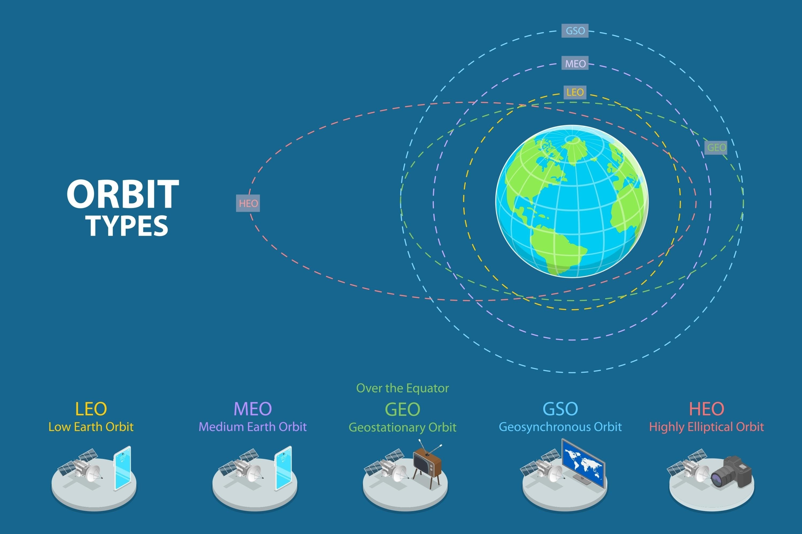{fig-align="center" width="100%"}

::: {.footer}
Fuente: Shutterstock / Ilustración conceptual de órbitas.
:::

## Ejemplos de Misiones y Órbitas

Es interesante notar que los satélites en órbita baja (**LEO**) polares y sincrónicos al Sol son mucho más comunes para la observación científica que los geoestacionarios (**GEO**).

| Misión | Satélite | Sensor de Ejemplo | Tipo de Órbita |
| :--- | :--- | :--- | :--- |
| [**Landsat 9**](https://landsat.gsfc.nasa.gov/) | Landsat 9 | OLI-2: Operational Land Imager 2 | LEO Sincrónico al Sol |
| [**VIIRS Land & Atm.**](https://www.earthdata.nasa.gov/data/instruments/viirs) | Suomi NPP | VIIRS: Visible Infrared Imaging Radiometer Suite | LEO Sincrónico al Sol |
| [**TEMPO**](https://tempo.si.edu/) | Intelsat 40e | TEMPO: Tropospheric Emissions (Monitoreo de contaminación) | **GEO** |
| [**NISAR**](https://nisar.jpl.nasa.gov/) | NISAR | SAR: Synthetic Aperture Radar | LEO Sincrónico al Sol |
| [**GPM**](https://gpm.nasa.gov/) | GPM | GMI: GPM Microwave Imager | LEO No Polar |

::: {.footer}
Fuente: NASA-ARSET.
:::

## Fuente de Energía: Pasiva vs. Activa

Los sensores remotos se categorizan según la procedencia de la radiación que detectan para identificar las características físicas de un objeto.

- **Sensores Pasivos**: Dependen de fuentes externas. Durante el día reciben radiación solar reflejada y emitida; de noche, suelen detectar solo la radiación emitida (térmica).
- **Sensores Activos**: Tienen su propia fuente de energía. El satélite emite radiación hacia la Tierra y mide cuánto de esa energía regresa. Funcionan igual de día o de noche.

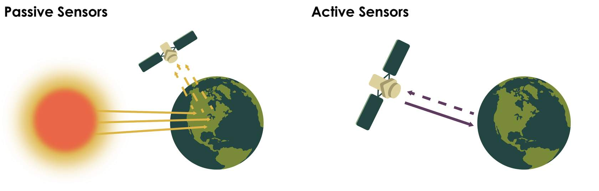

---

## Comparación de Mecanismos de Captura

La interacción con la atmósfera y la superficie varía según el tipo de sensor empleado:

::: columns
::: {.column width="50%"}
**Sensor Pasivo (Izquierda)**
Las emisiones de la Tierra viajan a través de la atmósfera hacia el espacio, donde el sensor las observa de forma pasiva dentro de su campo de visión.
:::

::: {.column width="50%"}
**Sensor Activo (Derecha)**
El satélite emite activamente pulsos de energía hacia la superficie y mide el retorno de esa misma energía (eco).
:::
:::

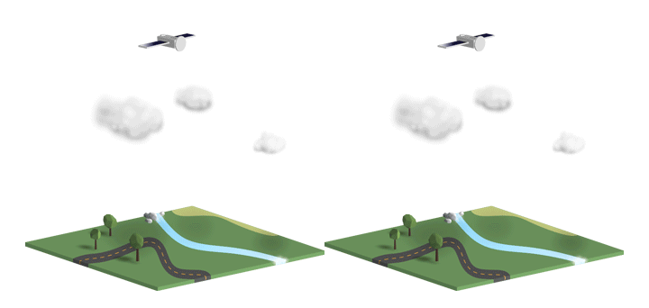

## Consideraciones de los Sensores Pasivos

Los sensores pasivos (radiómetros, espectrómetros) miden atributos físicos como la temperatura superficial, la salud de la vegetación y los componentes de las nubes.

### El desafío de la nubosidad
* **UV, Visible e Infrarrojo (IR)**: Necesitan cielos despejados. Las nubes absorben o reflejan estas longitudes de onda, bloqueando la superficie.
* **Microondas**: Tienen la capacidad de **"ver a través de las nubes"**. Sus longitudes de onda más largas atraviesan las partículas pequeñas de agua en la atmósfera.

---

## Comparativa: Huracán Francine (2024)

Sensores pasivos observando diferentes capas del mismo fenómeno.

::: {layout-ncol=2}
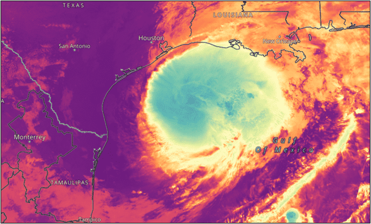

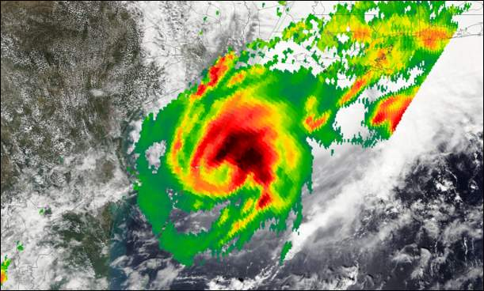
:::

### Puntos Clave
- **Izquierda (VIIRS)**: Detecta el **tope de nubes**. Tonos claros/azules = tormenta intensa.
- **Derecha (GMI)**: Penetra la nubosidad para medir la **precipitación interna**.

::: {.footer}
Fuente: NASA WorldView / ARSET.
:::

## Consideraciones de los Sensores Activos

A diferencia de los pasivos, los sensores activos no solo ofrecen una vista espacial (horizontal), sino que permiten obtener la **distribución vertical** de los parámetros geofísicos.

### Radar de Precipitación (GPM-DPR)
La misión GPM utiliza el Radar de Precipitación de Doble Frecuencia (DPR) para obtener un "escaneo" interno de las tormentas:

- **Perspectiva Vertical**: Permite ver la estructura de la precipitación dentro del huracán Francine.
- **Detección de Hielo**: Las áreas sombreadas en azul muestran precipitación congelada en altura.
- **Torres Convectivas**: El radar identificó torres de nubes que superan los **10 km de altura** en la pared del ojo del huracán.

[📺 Ver Video: Estructura Vertical del Huracán Francine (NASA SVS)](https://svs.gsfc.nasa.gov/5380/)

---

## LiDAR: Detección y Rango de Luz

El **LiDAR** es un método fundamental de percepción remota activa que utiliza pulsos de láser para medir distancias desde el satélite hasta la Tierra.

### Aplicaciones de la Distribución Vertical
Esta tecnología es esencial para medir la estructura de elementos que tienen altura:

- **Estructura del dosel forestal**: Altura y densidad de los bosques.
- **Contaminantes atmosféricos**: Distribución de partículas en diferentes capas del aire.
- **Topografía**: Altura de la superficie marina y de las capas de hielo.
- **Modelos Digitales**: Base para la creación de MDE de alta precisión (Semana 12 y 13).

::: {.footer}
Fuente: NASA-ARSET / NASA Science Visualization Studio.
:::

## Ejemplos de Características de Misiones {.smaller}

A continuación, se resumen las características de las misiones analizadas, integrando el tipo de órbita y la fuente de energía utilizada.

::: {.callout-note}
La gran mayoría de las misiones actuales de observación terrestre utilizan **sensores pasivos**.
:::

| Misión | Satélite | Sensor de Ejemplo | Órbita | Energía |
|:---|:---|:---|:---|:---:|
| [**Landsat 9**](https://landsat.gsfc.nasa.gov/) | Landsat 9 | OLI-2: Operational Land Imager 2 | LEO Sincrónico al Sol | Pasiva |
| [**VIIRS Land & Atm.**](https://www.earthdata.nasa.gov/data/instruments/viirs) | Suomi NPP | VIIRS: Visible Infrared Imaging Radiometer Suite | LEO Sincrónico al Sol | Pasiva |
| [**TEMPO**](https://tempo.si.edu/) | Intelsat 40e | TEMPO: Tropospheric Emissions | GEO | Pasiva |
| [**NISAR**](https://nisar.jpl.nasa.gov/) | NISAR | SAR: Synthetic Aperture Radar | LEO Sincrónico al Sol | **Activa** |
| [**GPM**](https://gpm.nasa.gov/) | GPM | GMI: GPM Microwave Imager | LEO No Polar | Pasiva |

::: {.footer}
Fuente: NASA-ARSET.
:::

## Rango y Resolución Espectral

Estos dos conceptos determinan qué porciones del espectro "ve" el sensor y con qué nivel de detalle lo hace.

- **Rango Espectral**: Es la amplitud o extensión de las regiones del espectro electromagnético (UV, Visible, IR, Microondas) que el sensor puede cubrir.
- **Bandas o Canales**: Son intervalos discretos dentro de ese rango. Un sensor se diseña con bandas específicas para capturar fenómenos científicos concretos.

> **Nota:** El rango no siempre es continuo. Un sensor puede tener un "rango bajo" si solo ve microondas, aunque sea muy preciso en esa área.

---

## Consideraciones de Diseño del Sensor

Para decidir qué bandas incluir en un satélite, los ingenieros y científicos consideran tres factores clave:

1. **Firma Espectral del Objetivo**: Se seleccionan las longitudes de onda donde el objeto de interés (p. ej., vegetación) tiene su respuesta más clara.
2. **Firmas de Objetos Secundarios**: Se analizan otros objetos que podrían tener firmas similares y causar interferencia o confusión en la detección.
3. **Firmas de Diferenciación**: Si el objetivo tiene una firma muy amplia, se usan bandas más estrechas para identificar y separar al objetivo de otros elementos del entorno.

::: {.footer}
Fuente: NASA-ARSET.
:::

## Entendiendo el Gráfico de Bandas {.smaller}

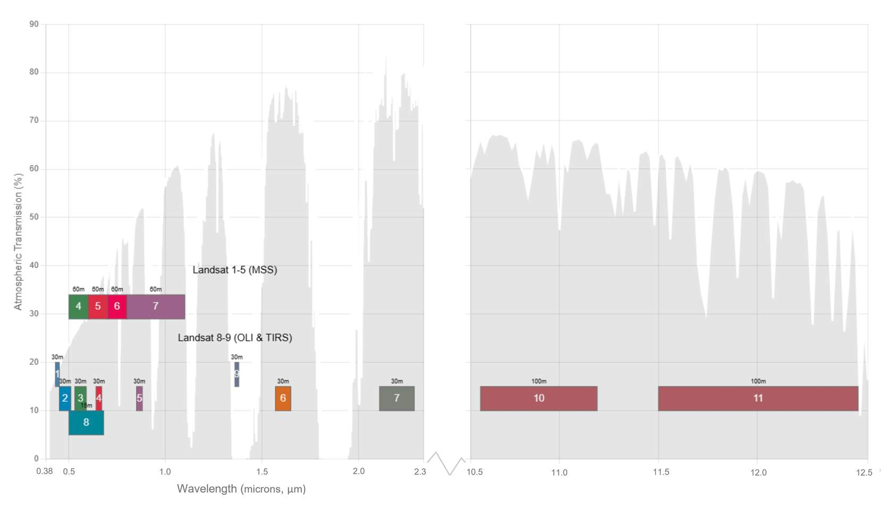{fig-align="center" width="80%"}

::: {style="margin-top: -30px;"}
::: columns
::: {.column width="50%"}
- **Ejes**: El eje **X** muestra la longitud de onda (UV hasta IR Térmico); el eje **Y** indica el % de **transmisión atmosférica**.
:::

::: {.column width="50%"}
- **Ventanas**: Las zonas grises son regiones donde la atmósfera permite el paso de energía.
:::
:::
:::

::: {.footer}
Fuente: NASA Landsat Science / ARSET.
:::

## Evolución de Landsat: Mayor Rango Espectral

Las misiones más recientes han expandido significativamente lo que podemos observar desde el espacio.

### De Landsat 1-5 a Landsat 8-9
- **Landsat 1-5 (MSS)**: Se centraba principalmente en los rangos ultravioleta (UV) y visible.
- **Landsat 8 y 9 (OLI/TIRS)**:
    - **Infrarrojo de Onda Corta (SWIR)**: Inclusión de las bandas 6, 7 y 9, permitiendo un análisis más profundo de la humedad y geología.
    - **Infrarrojo Térmico (TIRS)**: Dos bandas adicionales (10.8 y 12.0 micrones) para medir la temperatura de la superficie terrestre.
- **Resultado**: Mayor precisión para diferenciar objetivos con firmas espectrales similares.

::: {.footer}
Fuente: NASA Landsat Science: Spectral Band Comparison Tool / ARSET.
:::

## Resolución Espectral

La resolución espectral describe la capacidad de un sensor para detectar intervalos de longitud de onda muy finos. **A menor ancho de banda (más estrecha la banda), mayor es la resolución.**

* **Sensores Multiespectrales**: Observan en 3 o más bandas (ej. Landsat, Sentinel).
* **Sensores Hiperespectrales**: Detectan cientos o miles de bandas extremadamente estrechas para identificar materiales específicos (como gases o minerales).

> **Precisión Técnica**: Un sensor puede tener **alta resolución** (bandas muy finas) incluso si opera en un **rango estrecho** (como solo una parte de las microondas).

## Comparativa: Landsat 7 vs. Landsat 8-9 {.smaller}

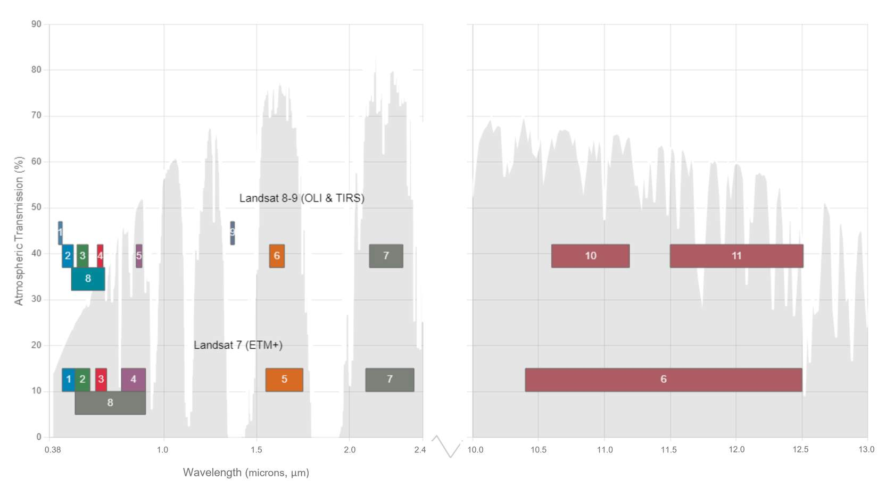{fig-align="center" width="75%"}

::: {style="margin-top: -20px;"}
::: columns
::: {.column width="50%"}
* **Bandas Visibles**: Las bandas 1 a 4 y 8 de L8-9 son más estrechas que las de L7, aumentando la resolución.
* **Infrarrojo Térmico**: L8-9 tiene dos bandas (10 y 11) en lugar de una, permitiendo un mejor cálculo de temperatura.
:::

::: {.column width="50%"}
* **Banda SWIR (1.6 $\mu m$)**: La banda 6 de L8-9 es más precisa y sufre menos interferencia de longitudes de onda vecinas que la banda 5 de L7.
:::
:::
:::

::: {.footer}
Fuente: NASA Landsat Science: Spectral Band Comparison Tool.
:::

## Ejemplos de Características de Misiones {.smaller}

Se han integrado el **Rango** y la **Resolución Espectral**. Nota que los sensores de microondas no incluyen las longitudes de onda cortas (UV, Vis, SWIR).

| Misión | Satélite | Órbita | Energía | Rango Espectral | Res. Espectral |
|:---|:---|:---:|:---:|:---|:---:|
| [**Landsat 9**](https://landsat.gsfc.nasa.gov/) | Landsat 9 | LEO SS | Pasiva | Vis, NIR, SWIR, Pancro | 9 Bandas |
| [**VIIRS**](https://www.earthdata.nasa.gov/data/instruments/viirs) | Suomi NPP | LEO SS | Pasiva | Vis, NIR, SWIR, LWIR | 22 Bandas |
| [**TEMPO**](https://tempo.si.edu/) | Intelsat 40e | **GEO** | Pasiva | UV, Vis, SWIR | **700 Bandas** |
| [**NISAR**](https://nisar.jpl.nasa.gov/) | NISAR | LEO SS | **Activa** | Microondas (~24 cm) | 1 Banda |
| [**GPM**](https://gpm.nasa.gov/) | GPM | LEO NP | Pasiva | Microondas (0.16-3 cm) | 13 Bandas |

::: {.callout-tip}
### Observación Clave
La resolución espectral (número de canales) varía drásticamente según el propósito: **TEMPO** es hiperespectral para detectar gases específicos, mientras que **NISAR** usa una sola banda de radar para penetrar superficies.
:::

::: {.footer}
Fuente: NASA-ARSET. LEO SS: Sincrónico al Sol / LEO NP: No Polar.
:::

## Pregunta de Repaso: Rango vs. Resolución

Completa la frase con la conclusión más apropiada:

**"Si un sensor solo detecta la porción de microondas del espectro electromagnético, este tiene..."**

::: {.incremental}
- ... baja resolución espectral.
- ... bajo rango espectral.
- ... tanto baja resolución espectral como bajo rango espectral.
:::

::: {.fragment}
::: {.callout-note}
## Explicación Técnica
Un sensor que solo detecta microondas tiene un **bajo rango espectral** porque su sensibilidad no llega a las regiones del infrarrojo, visible o ultravioleta. 

Sin embargo, podría tener una **alta resolución espectral** si la banda de microondas que detecta es muy estrecha, permitiendo una captura muy precisa dentro de ese rango limitado.
:::
:::

## Resolución Espacial y Cobertura

La resolución espacial representa el área de la superficie terrestre contenida dentro de un solo píxel de la imagen.

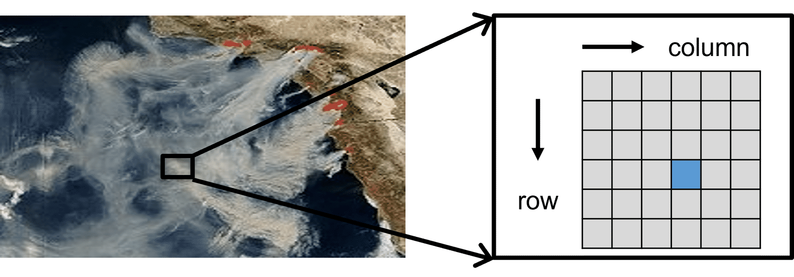{width="85%"}

* **Matriz 2D**: Una imagen es un arreglo de medidas organizadas en filas y columnas.
* **Información del Píxel**: Cada píxel tiene **Intensidad** (promedio de reflectancia/emisión del área) y **Ubicación**.
* **Variabilidad**: Aunque suele ser fija, algunos sensores varían su resolución según la banda espectral.

---

## Resolución: ¿Fija o Variable? {.smaller}

Aunque se da un valor nominal (ej. 30m), el tamaño real del píxel varía según el **ángulo de visión** del sensor.

::: columns
::: {.column width="60%"}
### El Punto Nadir
La resolución más fina ocurre en el **Nadir** (directamente debajo del sensor). 

### El Efecto "Linterna"
Al igual que una linterna inclinada ilumina un área más grande y difusa, un sensor apuntando en ángulo cubre más terreno por píxel, resultando en una resolución más **gruesa** (coarser).

> **Conclusión**: Los píxeles más alejados del nadir tienen menor detalle que los centrales.
:::

::: {.column width="40%"}
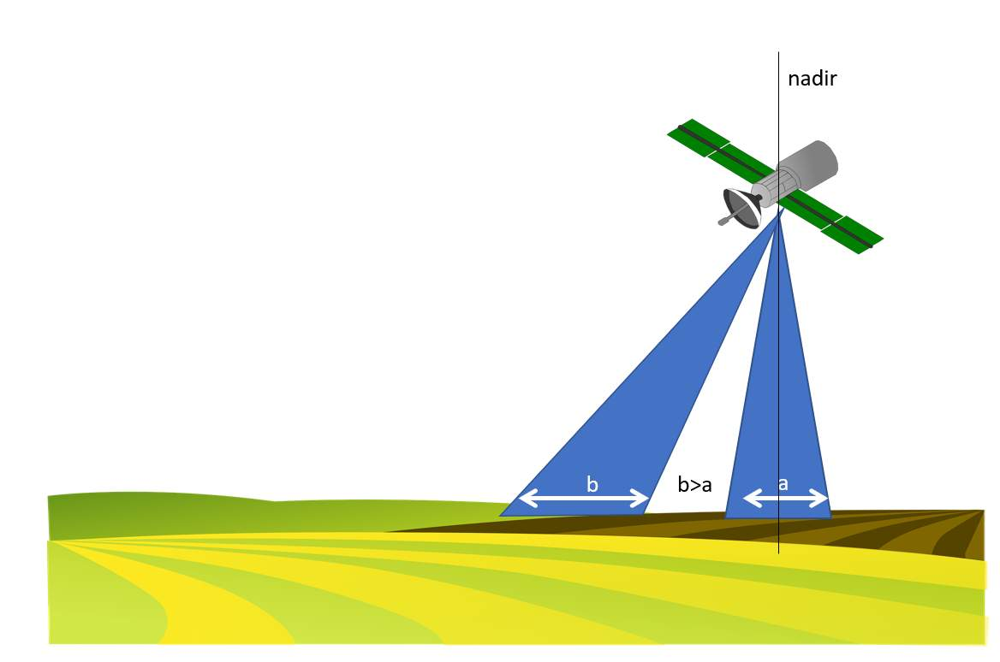{fig-align="center"}
:::
:::

## ¿Por qué es importante la Resolución Espacial?

Para identificar un objeto de interés, se requieren múltiples píxeles dentro de la imagen. A medida que la resolución disminuye, perdemos la capacidad de distinguir detalles.

::: {layout-ncol=1}
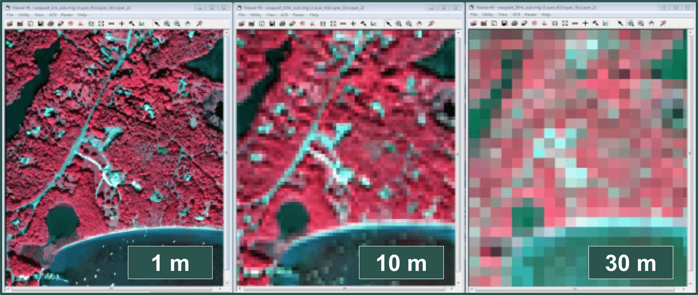{fig-align="center" width="50%"}
:::

::: {.callout-note}
## Cobertura Espacial vs. Resolución
Además del tamaño del píxel, otra diferencia clave entre sensores es la **cobertura espacial** (*spatial coverage*): la extensión horizontal total que el sensor escanea mientras orbita la Tierra (el ancho de la "franja" o *swath*).
:::

::: {.footer}
Fuente: csc.NOAA.gov / NASA-ARSET.
:::

## Cobertura Espacial: Sensores GEO {.smaller}

En los sensores geoestacionarios, la cobertura suele ser el **"disco completo"** (*Full Disk*), aunque algunos limitan su vista a una región específica.

::: {layout-ncol=2}
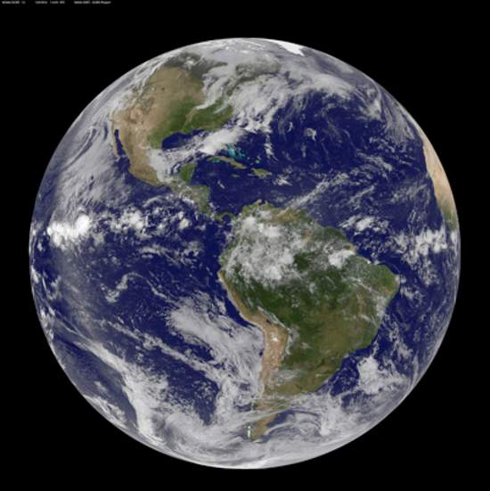{width="70%"}

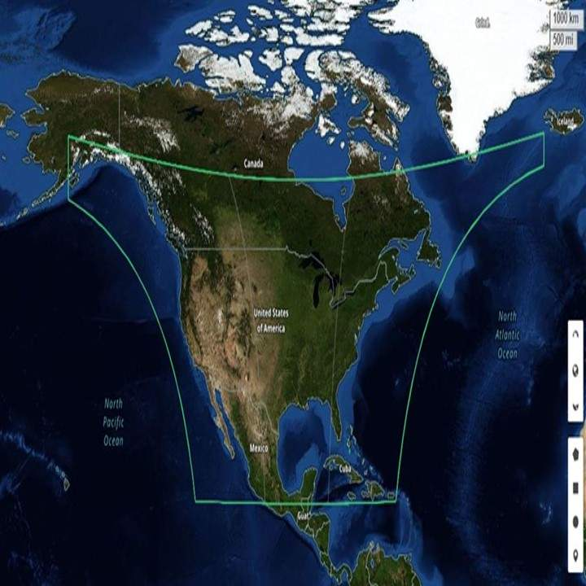{width="70%"}
:::

::: {style="margin-top: -40px;"}
* **Field of Regard**: Estrategia de escaneo que limita la visión del instrumento a solo una porción del disco completo para aumentar la frecuencia de observación.
:::

::: {.footer}
Fuente: NOAA / NASA ARSET.
:::

## GEO: El Efecto del Borde del Disco {.smaller}

Debido a la curvatura de la Tierra y al ángulo de visión lejos del punto nadir, la resolución espacial no es uniforme en toda la imagen.

::: columns
::: {.column width="60%"}
- **Ángulos pronunciados**: Cerca del borde del disco, el sensor ve la Tierra en un ángulo muy inclinado.
- **Degradación**: Esto causa que las observaciones en los bordes tengan una **resolución espacial más gruesa** (coarser) que en el centro.
- **Limitación Polar**: Incluso con múltiples satélites GEO estratégicos, la visión hacia las regiones polares siempre será en un ángulo muy empinado.
:::

::: {.column width="40%"}
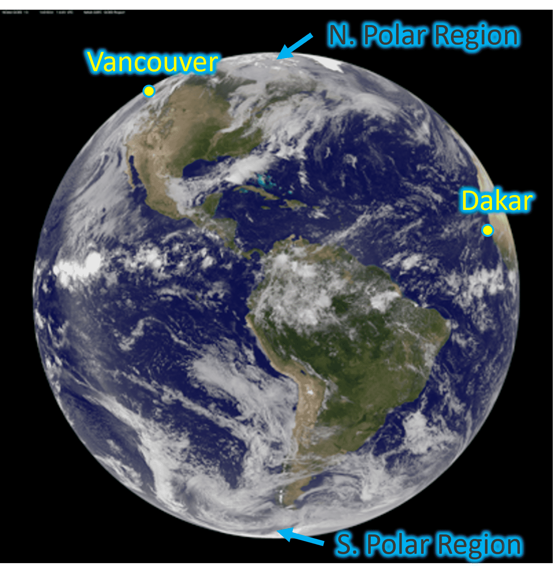
:::
:::

::: {.footer}
Fuente: NOAA / NASA ARSET.
:::

## Cobertura Espacial: Swath Width {.smaller}

El **swath width** (ancho de franja) es la distancia total a través de la trayectoria del sensor en la superficie terrestre.

::: columns
::: {.column width="45%"}
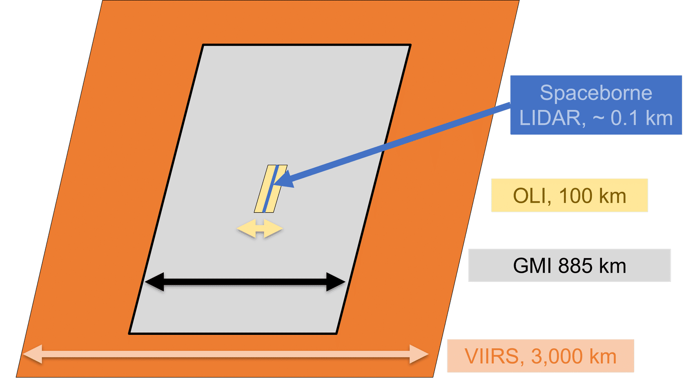{width="100%"}
:::

::: {.column width="55%"}
- **VIIRS**: 2,000 – 3,000 km (Gran cobertura).
- **GMI**: 885 km.
- **Landsat 9 (OLI-2)**: 185 km.
- **LiDAR**: < 100 m (Enfoque en medidas verticales, no cobertura horizontal).

::: {.callout-important}
### Sensores Activos vs. Pasivos
Los sensores activos suelen tener franjas más estrechas porque deben proveer su propia fuente de radiación (iluminación limitada comparada con el Sol).
:::
:::
:::

---

## Conclusiones: Resolución vs. Cobertura {.smaller}

::: {style="margin-top: 20px;"}
1.  **Relación Inversa**: Generalmente, a mayor ancho de franja (swath), más **gruesa** es la resolución espacial, y viceversa.
2.  **Efecto de Ángulo**: Los píxeles en los bordes (tanto en LEO como en el disco GEO) tienen menor resolución que en el **nadir** debido a los ángulos de visión.
3.  **Curvatura Terrestre**: El impacto de la curvatura es mucho mayor en los bordes de los sensores **GEO** que en los LEO.
4.  **Cobertura Global**: La órbita **LEO Polar** es indispensable para capturar todo el globo, incluyendo los polos.
:::

::: {.footer}
Fuente: NASA-ARSET.
:::

## Resumen de Características de Misiones {.smaller}

Existe una relación inversa fundamental: generalmente, cuanto más estrecha es la franja (*swath*), mejor es la resolución espacial (píxeles más pequeños).

| Misión | Satélite | Órbita | Energía | Res. Espectral | Cobertura (Swath) | Res. Espacial |
|:---|:---|:---:|:---:|:---:|:---|:---:|
| [**Landsat 9**](https://landsat.gsfc.nasa.gov/) | Landsat 9 | LEO SS | Pasiva | 9 Bandas | 185 km | **15 - 30 m** |
| [**VIIRS**](https://www.earthdata.nasa.gov/data/instruments/viirs) | Suomi NPP | LEO SS | Pasiva | 22 Bandas | 3000 km | 375 - 750 m |
| [**TEMPO**](https://tempo.si.edu/) | Intelsat 40e | **GEO** | Pasiva | 700 Bandas | N. América | 2 x 4.5 km |
| [**NISAR**](https://nisar.jpl.nasa.gov/) | NISAR | LEO SS | **Activa** | 1 Banda | 240 km | **3 - 10 m** |
| [**GPM**](https://gpm.nasa.gov/) | GPM | LEO NP | Pasiva | 13 Bandas | 885 km | 6 - 25 km |

::: {.callout-important}
### El Gran "Trade-off"
Observa cómo **NISAR** y **Landsat** tienen las mejores resoluciones espaciales pero coberturas pequeñas, mientras que **VIIRS** sacrifica detalle (píxeles de casi 1 km) para poder mapear el planeta entero rápidamente.
:::

::: {.footer}
Fuente: NASA-ARSET. LEO SS: Sincrónico al Sol / LEO NP: No Polar / GEO: Geoestacionario.
:::

## Resolución Temporal: Órbita LEO Polar {.smaller}

La resolución temporal indica qué tan seguido un sensor observa el **mismo punto** en la Tierra. En órbitas polares, esto depende del **ancho de franja (swath)**.

::: {layout-ncol=2}
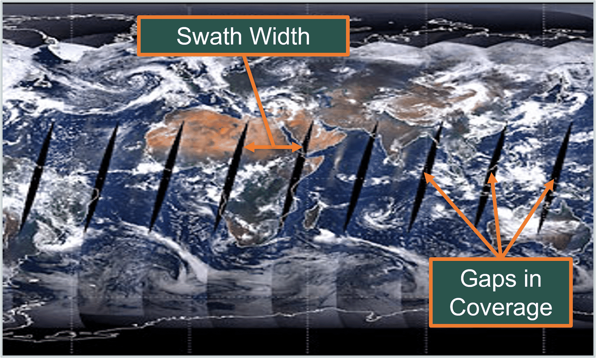

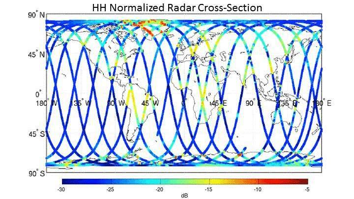
:::

::: {.callout-note}
### Traslape Polar
Todos los instrumentos en órbita polar tienen más traslape de franjas cerca de los polos. Por lo tanto, la resolución temporal es mayor en altas latitudes que en el ecuador.
:::

---

## Resolución Temporal: Órbita No Polar {.smaller}

Las órbitas no polares (inclinadas) se diseñan para maximizar la observación en los trópicos y latitudes medias, sacrificando la visión de los polos.

::: columns
::: {.column width="50%"}
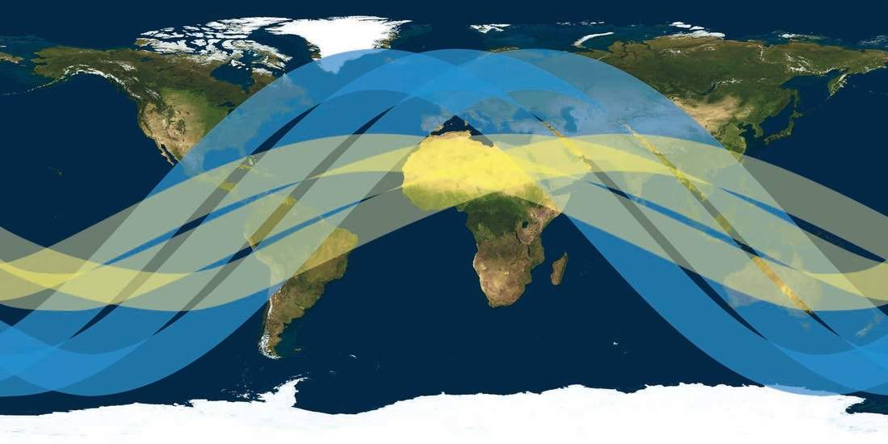{width="100%"}
:::

::: {.column width="50%"}
* **Limitación de Latitud**: Las ubicaciones de alta latitud nunca son observadas.
* **Constelaciones de Satélites**: Para mejorar la frecuencia, se lanzan series de satélites idénticos (como la misión TROPICS).
* **Resolución Efectiva**: Mientras un solo satélite puede tardar 1-2 días en volver, una "suite" o constelación reduce ese tiempo a solo unas horas.
:::
:::

::: {.footer}
Fuente: NASA WorldView / SMAP / GPM / ARSET.
:::

## Resolución Temporal: Sensores GEO {.smaller}

Los instrumentos GEO ofrecen una frecuencia de observación mucho mayor que los LEO. Además, permiten realizar múltiples **sub-escaneos** de áreas de interés dentro de un mismo ciclo.

::: columns
::: {.column width="50%"}
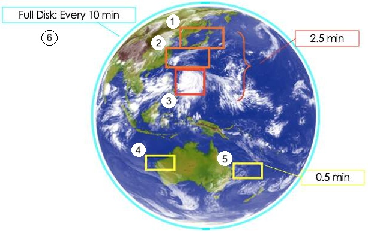{width="80%"}
:::

::: {.column width="50%"}
### Tipos de Escaneo (AHI)
* **Disco Completo (Punto 6)**: Cada **10 minutos**.
* **Escaneos Regionales (Puntos 1-3)**: Cada **2.5 min** (ej. Japón o tormentas tropicales).
* **Escaneos de Mesoescala (Puntos 4-5)**: Cada **0.5 min**. Áreas móviles para eventos críticos.

> **Dato Clave**: Mientras el disco completo se procesa, el sensor "salta" a las zonas de interés para capturar datos con mayor detalle temporal.
:::
:::

::: {.callout-note}
### El Compromiso (Trade-off): TEMPO vs. AHI
Aunque TEMPO es un sensor GEO, su resolución temporal es de **1 hora**. Esto se debe a que es un sensor **hiperespectral** (cientos de bandas), lo que requiere más tiempo de procesamiento por escaneo comparado con el sensor **multibanda** AHI (3-30 bandas).
:::

::: {.footer}
*Fuente: Japan Meteorological Agency (JMA) / NASA ARSET.
:::

## Comparativa Técnica Integral de Misiones {.smaller}

Existe un equilibrio (*trade-off*) constante: sensores con franjas estrechas y alta resolución espacial suelen tener ciclos de repetición más largos (menor resolución temporal).

 

::: {style="font-size: 0.85em;"}
| Misión | Satélite | Sensor | Órbita | Energía | Rango Espectral | Res. Espectral | Cobertura | Res. Espacial | Res. Temporal |
|:---|:---|:---|:---|:---:|:---|:---:|:---:|:---:|:---:|
| [**Landsat 9**](https://landsat.gsfc.nasa.gov/) | Landsat 9 | OLI-2 | LEO SS | Pasiva | Vis, NIR, SWIR, Pancro | 9 Bandas | 185 km | 15 - 30 m | 16 Días |
| [**VIIRS**](https://www.earthdata.nasa.gov/data/instruments/viirs) | Suomi NPP | VIIRS | LEO SS | Pasiva | Vis, NIR, SWIR, LWIR | 22 Bandas | 3000 km | 375 - 750 m | 0.5 - 1 Día |
| [**TEMPO**](https://tempo.si.edu/) | Intelsat 40e | TEMPO | GEO | Pasiva | UV, Vis, SWIR | 700 Bandas | N. América | 2 x 4.5 km | Horaria |
| [**NISAR**](https://nisar.jpl.nasa.gov/) | NISAR | SAR | LEO SS | Activa | Microondas (~24 cm) | 1 Banda | 240 km | 3 - 10 m | 6 Días |
| [**GPM**](https://gpm.nasa.gov/) | GPM | GMI | LEO NP | Pasiva | Micro. (0.16 - 3 cm) | 13 Bandas | 885 km | 6 - 25 km | 0.4 - 1.6 d* |
:::

 

::: {.callout-tip}
### Monitoreo de Eventos Rápidos
Los sensores **GEO** (como TEMPO) superan a los LEO en resolución temporal, permitiendo observar cambios que ocurren minuto a minuto o cada hora, algo vital para incendios o calidad del aire.
:::

::: {.footer}
*Dependiente de la latitud. LEO SS: Sincrónico al Sol / LEO NP: No Polar. Fuente: NASA-ARSET.
:::

## Pregunta de Repaso: Órbita LEO

¿Cuál es la ventaja de que un sensor LEO observe una ubicación en la Tierra aproximadamente a la misma hora cada día?

1. Los peligros para la ubicación pueden evaluarse a la misma hora todos los días.
2. Los cambios en esa ubicación pueden ser monitoreados y estudiados durante largos períodos de tiempo (ej. décadas).
3. Los sensores LEO siempre tienen más canales que los sensores GEO para analizar mejor la superficie terrestre.

::: {.fragment}
::: {.callout-note}
## Explicación Técnica
**Respuesta: (2)**. Los sensores LEO sincrónicos al sol observan la Tierra a la misma hora cada día, por lo que el **ángulo solar** (iluminación y sombras) y/o el periodo nocturno serán siempre los mismos. Esto permite realizar comparaciones diarias que revelan **cambios reales** en la superficie..
:::
:::

## Resolución Radiométrica

Es la capacidad del sensor para discriminar pequeñas diferencias en la magnitud de la radiación para una banda determinada en cada píxel.

* **¿Por qué es importante?** Permite una diferenciación detallada entre materiales y condiciones de la superficie (vegetación, tipos de suelo, cambios ambientales).
* **Precisión vs. Exactitud**: Una mayor resolución radiométrica aumenta la **precisión** de los datos, lo que impacta directamente en la calidad del análisis.

> **Impacto**: Determina qué tan "fino" es el sensor para captar cambios sutiles que otros sensores ignorarían.

---

## Analogía de la Sensibilidad {.smaller}

Para entender la precisión radiométrica, imagina dos termómetros midiendo la misma temperatura:

::: columns
::: {.column width="50%"}
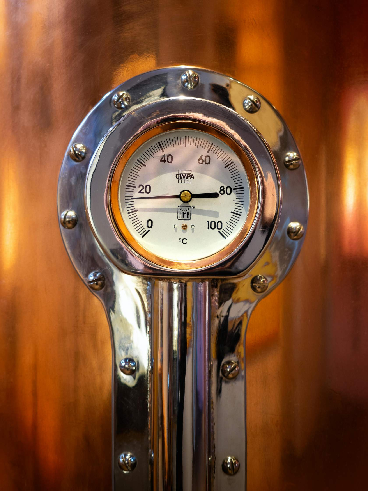{width="45%"}
:::

::: {.column width="50%"}
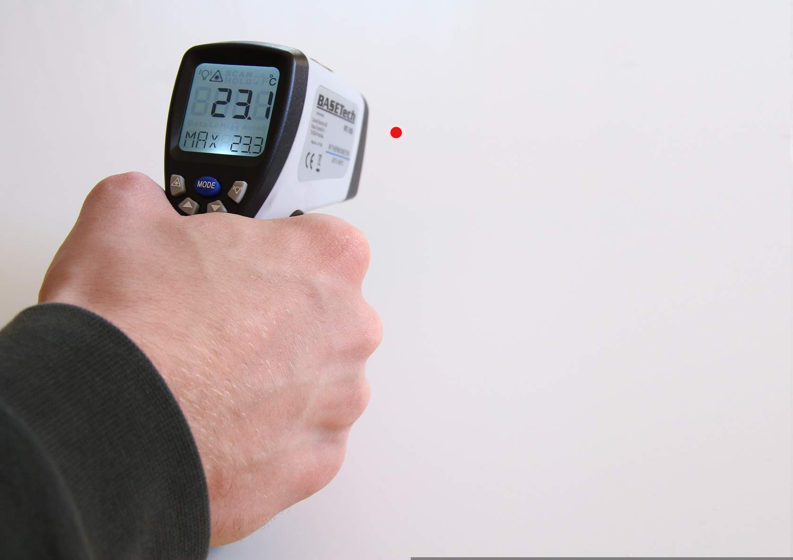{width="80%"}
:::
:::

::: {.callout-note}
### Conclusión
El segundo termómetro tiene mayor **precisión** porque puede diferenciar 1000 niveles de magnitud frente a los 100 del primero. En los satélites, esta "sensibilidad" se mide en **bits**.
:::

## Almacenamiento de Datos en Bits {.smaller}

::: columns
::: {.column width="35%"}
Las imágenes se almacenan en archivos clasificados por su capacidad de memoria en bits. El número de bits determina la cantidad de combinaciones de magnitud (niveles de gris) disponibles.

::: {.callout-note}
Una resolución radiométrica más alta requiere más bits para almacenar los datos, pero produce detalles mucho más nítidos en la imagen.
:::
:::

::: {.column width="65%"}
::: {.panel-tabset}

### 2 bits ($2^2 = 4$)
Un archivo de 2 bits solo tiene **4 combinaciones** posibles.

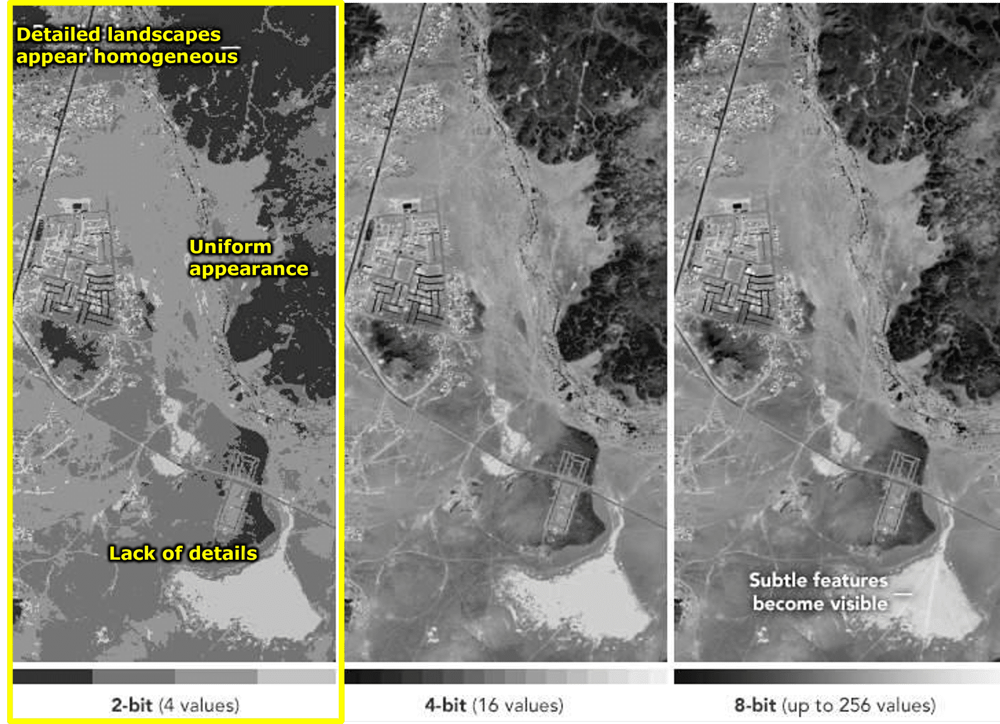{width="80%"}

### 4 bits ($2^4 = 16$)
Una imagen de 4 bits tiene **16 combinaciones** posibles.

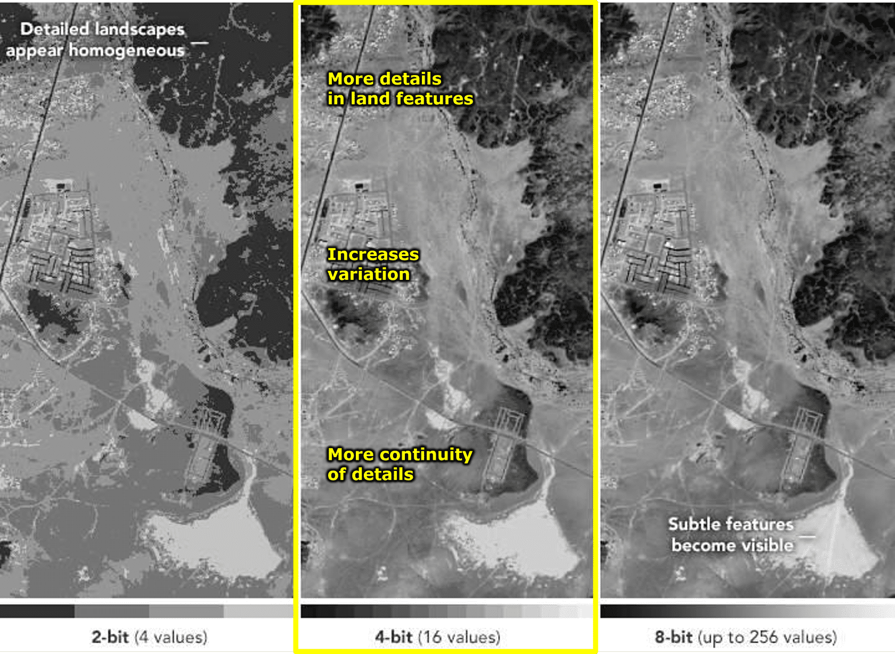{width="80%"}

### 8 bits ($2^8 = 256$)
Una imagen de 8 bits puede contener **256 combinaciones** por píxel.

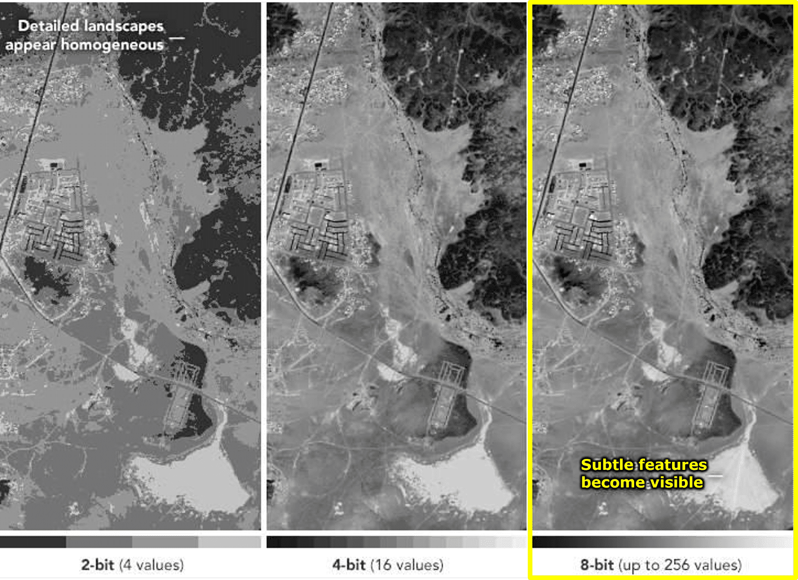{width="80%"}

:::
:::
:::

## Pregunta de Repaso: Resolución Radiométrica

¿Qué gran beneficio proporciona un sensor con una alta resolución radiométrica?

1. Una huella (píxel) más pequeña sobre la Tierra.
2. La capacidad de discriminar pequeñas diferencias en la magnitud de la radiación.
3. Mayor exactitud en las mediciones del sensor.

::: {.fragment}
::: {.callout-note}
## Explicación Técnica
**Respuesta: (2)**. El principal beneficio es la capacidad de discriminar pequeñas diferencias en la magnitud de la radiación. Cambios muy pequeños en la señal recibida se preservan, por lo que los detalles son más evidentes en la imagen. La resolución espacial (huella del píxel) es una característica separada. Además, la *exactitud* del sensor se relaciona con su calibración, mientras que la resolución radiométrica es más análoga a su *precisión*.
:::
:::

## La Ciencia Guía las Decisiones {.smaller}

Siempre hay compromisos (*trade-offs*) al diseñar satélites para satisfacer las necesidades científicas. Idealmente, asumiríamos que cada sensor tiene la máxima funcionalidad:

::: columns
::: {.column width="50%"}
* **Amplio Rango Espectral**: Cubre lo máximo posible del espectro EM.
* **Alta Res. Espectral**: Cada banda abarca un conjunto muy estrecho de longitudes de onda.
* **Amplia Extensión Espacial**: Gran área observada en cada escaneo (*swath*).
:::
::: {.column width="50%"}
* **Alta Res. Espacial**: Cada píxel ve detalles a pequeña escala.
* **Alta Res. Temporal**: Proporciona rápidamente nuevos escaneos del área.
* **Alta Res. Radiométrica**: Retiene pequeñas diferencias de energía en los datos.
:::
:::

::: {.callout-important}
### Los Compromisos son Necesarios
A medida que la tecnología avanza, el rendimiento mejora. Sin embargo, las limitaciones técnicas y físicas exigen intercambios. Al diseñar un instrumento, estos *trade-offs* estarán guiados por la tecnología disponible, el costo y las prioridades de la misión.
:::

---

## Compromisos: Elementos de Cambio Rápido {.smaller}

::: columns
::: {.column width="50%"}
Proporcionar alertas tempranas de desastres naturales (huracanes, incendios, humo, tormentas de polvo) puede ser una prioridad. 

* **Se prioriza:** Una **alta resolución temporal** (quizás usando un satélite GEO o múltiples LEO) y la capacidad de transmitir datos rápidamente.
* **El Compromiso:** Esto podría requerir resoluciones espectrales y radiométricas **más bajas**, de modo que haya menos datos para transmitir en cada escaneo.
:::

::: {.column width="50%"}
{width="100%"}
:::
:::

---

## Compromisos: Detalles a Pequeña Escala {.smaller}

::: columns
::: {.column width="50%"}
Para otra misión, distinguir materiales muy similares a escalas pequeñas podría ser importante. 

* **La Prioridad:** Alta **resolución espacial y espectral** (como la imagen a color de la derecha).
* **El Compromiso:** Usar un ancho de franja (*swath*) más pequeño, teniendo un **tiempo de revisita más largo**.

::: {.callout-note appearance="simple" icon="false"}
**Ejemplo de otro Trade-off:**
La **imagen pancromática** prioriza captar detalles diminutos. Para lograr esa mayor resolución espacial, sacrifica el detalle espectral usando una sola banda ancha (incorporando una amplia gama de longitudes de onda en una sola imagen sin color).
:::
:::

::: {.column width="50%"}
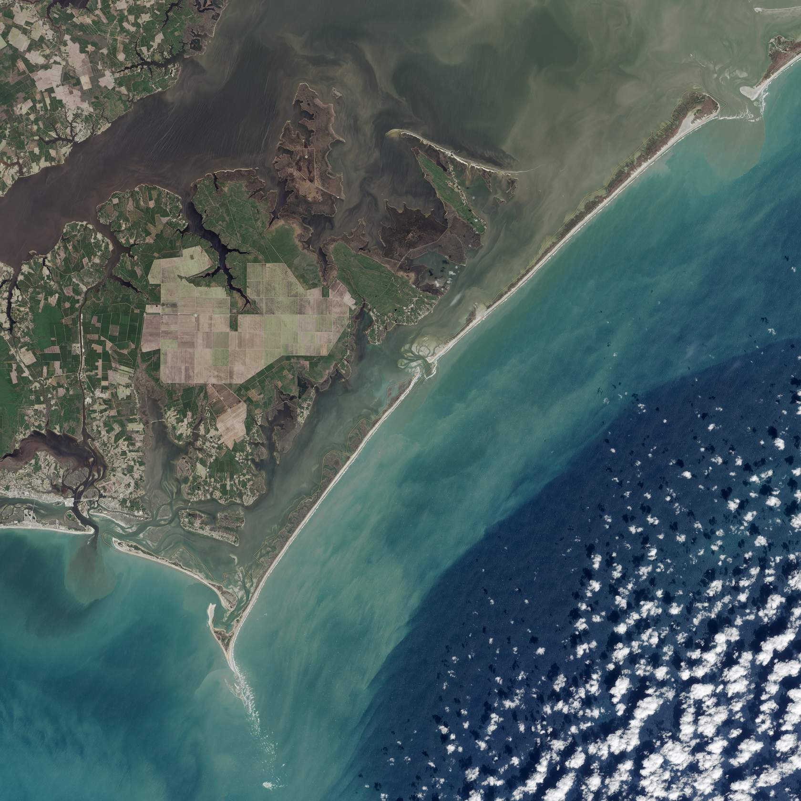{width="100%"}
:::
:::

## Repaso: Características de la Misión PACE {.smaller}

Pon a prueba tu comprensión examinando la tabla a continuación, donde se ha añadido la misión **PACE** (*Plankton, Aerosol, Cloud, ocean Ecosystem*). Compara PACE con los otros ejemplos y responde la pregunta.

 

::: {style="font-size: 0.75em;"}
| Misión | Satélite | Sensor | Órbita | Energía | Rango Espectral | Res. Espectral | Cobertura | Res. Espacial | Res. Temporal |
|:---|:---|:---|:---|:---:|:---|:---:|:---:|:---:|:---:|
| **VIIRS** | Suomi NPP | VIIRS | LEO SS | Pasiva | Vis, NIR, SWIR, LWIR | 22 Bandas | 3000 km | 375 - 750 m | 1 Día |
| **Landsat 9** | Landsat 9 | OLI-2 | LEO SS | Pasiva | Vis, NIR, SWIR, Pancro | 9 Bandas | 185 km | 15 - 30 m | 16 Días |
| **PACE** | PACE | OCI | LEO SS | Pasiva | UV, Vis, SWIR | 289 Bandas (Hiper.) | 2700 km | 1.2 km | 2 Días |
| **TEMPO** | Intelsat 40e | TEMPO | GEO | Pasiva | UV, Vis, SWIR | 700 Bandas (Hiper.) | N. América | 2 x 4.5 km | Horaria |
| **NISAR** | NISAR | SAR | LEO SS | Activa | Microondas (~24 cm) | 1 Banda | 240 km | 3 - 10 m | 6 Días |
| **GPM** | GPM | GMI | LEO NP | Pasiva | Micro. (0.16 - 3 cm) | 13 Bandas | 885 km | 6 - 25 km | 0.4 - 1.6 d* |
:::

 

**Pregunta 1:** ¿Verdadero (1) o Falso (2)? PACE podría usarse para monitorear cambios diarios en los polos de la Tierra.

::: {.fragment}
::: {.callout-note}
## Explicación Técnica
**Respuesta: (1) Verdadero**. PACE tiene una órbita polar LEO SS (a diferencia de los GEO que no ven los polos). Aunque su resolución temporal oficial es de 2 días (por brechas en el ecuador), su amplia franja (*swath*) permite observar las regiones polares a diario, o incluso múltiples veces al día.
:::
:::

::: {.footer}
*Dependiente de la latitud. LEO SS: Sincrónico al Sol / LEO NP: No Polar. Fuente: NASA-ARSET.
:::

## Repaso: Características de la Misión PACE {.smaller}

::: {style="font-size: 0.75em;"}
| Misión | Satélite | Sensor | Órbita | Energía | Rango Espectral | Res. Espectral | Cobertura | Res. Espacial | Res. Temporal |
|:---|:---|:---|:---|:---:|:---|:---:|:---:|:---:|:---:|
| **VIIRS** | Suomi NPP | VIIRS | LEO SS | Pasiva | Vis, NIR, SWIR, LWIR | 22 Bandas | 3000 km | 375 - 750 m | 1 Día |
| **Landsat 9** | Landsat 9 | OLI-2 | LEO SS | Pasiva | Vis, NIR, SWIR, Pancro | 9 Bandas | 185 km | 15 - 30 m | 16 Días |
| **PACE** | PACE | OCI | LEO SS | Pasiva | UV, Vis, SWIR | 289 Bandas (Hiper.) | 2700 km | 1.2 km | 2 Días |
| **TEMPO** | Intelsat 40e | TEMPO | GEO | Pasiva | UV, Vis, SWIR | 700 Bandas (Hiper.) | N. América | 2 x 4.5 km | Horaria |
| **NISAR** | NISAR | SAR | LEO SS | Activa | Microondas (~24 cm) | 1 Banda | 240 km | 3 - 10 m | 6 Días |
| **GPM** | GPM | GMI | LEO NP | Pasiva | Micro. (0.16 - 3 cm) | 13 Bandas | 885 km | 6 - 25 km | 0.4 - 1.6 d* |
:::

 

**Pregunta 2:** ¿Verdadero (1) o Falso (2)? PACE es un sensor "Pasivo" al igual que el sensor GPM/GMI. Por lo tanto, ambos sensores pueden usarse para la teledetección de los mismos eventos de la Tierra/Atmósfera.

::: {.fragment}
::: {.callout-note style="font-size: 1.2em;"}
## Explicación Técnica
**Respuesta: (2) Falso**. 

Aunque ambos son sensores pasivos, operan en **diferentes partes del espectro electromagnético** (UV/Vis/SWIR para PACE vs. Microondas para GMI). Además, la **resolución espacial** de PACE (1.2 km) es mucho mejor que la de GMI (6 - 25 km), permitiendo a PACE observar eventos a escala de un kilómetro que GMI no podría detectar. Por último, PACE tiene órbita polar (LEO SS) mientras que GMI es no polar (LEO NP); por lo tanto, GMI no puede observar los polos, pero PACE sí.
:::
:::

::: {.footer}
*Dependiente de la latitud. LEO SS: Sincrónico al Sol / LEO NP: No Polar. Fuente: NASA-ARSET.
:::

## Repaso: Características de la Misión PACE {.smaller}

::: {style="font-size: 0.75em;"}
| Misión | Satélite | Sensor | Órbita | Energía | Rango Espectral | Res. Espectral | Cobertura | Res. Espacial | Res. Temporal |
|:---|:---|:---|:---|:---:|:---|:---:|:---:|:---:|:---:|
| **PACE** | PACE | OCI | LEO SS | Pasiva | UV, Vis, SWIR | 289 Bandas (Hiper.) | 2700 km | 1.2 km | 2 Días |
:::

 

**Pregunta 3:** Dadas sus características espaciales y temporales, ¿cuáles de las siguientes opciones serían un buen uso para la misión PACE? *(Selecciona las correctas)*

1. Monitoreo de cambios por hora en el desarrollo/decadencia de tormentas eléctricas.
2. Detección y alcance de fenómenos como niebla, tormentas de polvo y cenizas volcánicas en la atmósfera.
3. Cambios estacionales en el uso del suelo dentro del campo de un agricultor (100 metros de ancho).
4. Monitoreo semanal de la salud de la vegetación en toda la India.

::: {.fragment}
::: {.callout-note style="font-size: 1em;"}
## Explicación Técnica
**Respuesta: (2) y (4)**. 

PACE proporciona cobertura global cada 1-2 días y tiene bandas visibles/infrarrojas, por lo que **sí** puede detectar niebla, polvo, cenizas y monitorear vegetación semanalmente a gran escala. 

Por otro lado, **no** sirve para las opciones 1 y 3 porque: 

* Las tormentas evolucionan en cuestión de horas, y la resolución temporal de PACE (1-2 días) no es suficiente.
* Los cambios en la parcela de un agricultor (100 m) requieren alta resolución espacial (como los 15-30 m de Landsat 9), mientras que PACE tiene píxeles de 1.2 km.
:::
:::

::: {.footer}
*Dependiente de la latitud. LEO SS: Sincrónico al Sol / LEO NP: No Polar. Fuente: NASA-ARSET.
:::

## Resumen de la Lección {.smaller}

::: columns
::: {.column width="35%"}
En esta lección, exploramos cómo se utilizan los sensores satelitales para la teledetección. Examinamos las características que hacen únicos tanto a los satélites como a los sensores, y cómo las características geofísicas que se desean observar impactan las decisiones de diseño de cada misión.

{width="100%"}
:::

::: {.column width="65%"}
**Específicamente, en esta sección logramos:**

1. Distinguir las **órbitas comunes**: GEO, LEO, LEO polar/no polar, y LEO sincrónica al sol.
2. Diferenciar las fuentes de energía en sensores **activos** (producen su propia radiación) y **pasivos** (usan radiación solar).
3. Definir el **rango y la resolución espectral**, y sus efectos en la capacidad de detección.
4. Definir la **resolución espacial y temporal**, y sus efectos en la detección.
5. Definir la **cobertura espacial** (*swath*) para una órbita y sensor dados, y su impacto en la resolución espacial.
6. Definir la **resolución radiométrica** (bits) del sensor y su impacto en la precisión de los datos.
7. Discutir los **compromisos (*trade-offs*)** necesarios entre las resoluciones y la cobertura al diseñar misiones.
:::
:::

# Módulo 4: ¿Cómo Puedo Usar los Datos de Teledetección?

En este módulo, explorarás los diferentes tipos de datos de teledetección disponibles y analizarás casos de estudio que demuestran sus usos típicos. Cuando combinamos estos datos con nuestro conocimiento de las firmas espectrales, podemos descubrir parámetros geofísicos clave del sistema terrestre.

::: {style="font-size: 0.5em; color: gray;"}
**Fuente**: NASA.
:::

---   

## Objetivos de la Lección {.smaller}

::: columns
::: {.column width="45%"}
Al finalizar este módulo, serás capaz de:

- **Identificar** la gama de niveles de productos de datos de teledetección disponibles, ilustrados mediante diversos casos de estudio.
- **Identificar** métodos básicos para trabajar con diferentes niveles de datos.
- **Reconocer** las fortalezas y debilidades comunes del uso de la teledetección para las observaciones de la Tierra.
:::

::: {.column width="55%"}
{width="100%"}
:::
:::

## Creación de Imágenes Satelitales

Los datos recopilados por los sensores satelitales son inherentemente **cuantitativos**. Sin embargo, para facilitar el análisis visual cualitativo, estos datos se mapean a una gama de colores, creando lo que conocemos como imágenes satelitales. Estas pueden representar un solo canal o la combinación de varios.

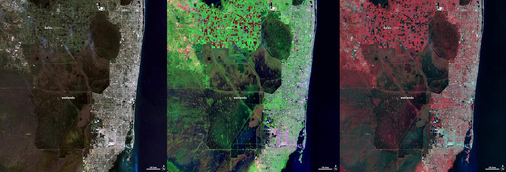{width="100%"}
---

## Imágenes de un Solo Canal: Térmica {.smaller}

Para una banda individual, los sensores miden directamente la **radiancia** (intensidad de la radiación), a menudo cuantificada usando una escala de Temperatura de Brillo (°C). 

Aquí se muestra el canal "Clean Infrared" (Banda 13) del GOES ABI. Se aplica una barra de color para resaltar las cimas de las nubes con las temperaturas más bajas (rojo a magenta indica nubes frías y convección fuerte).

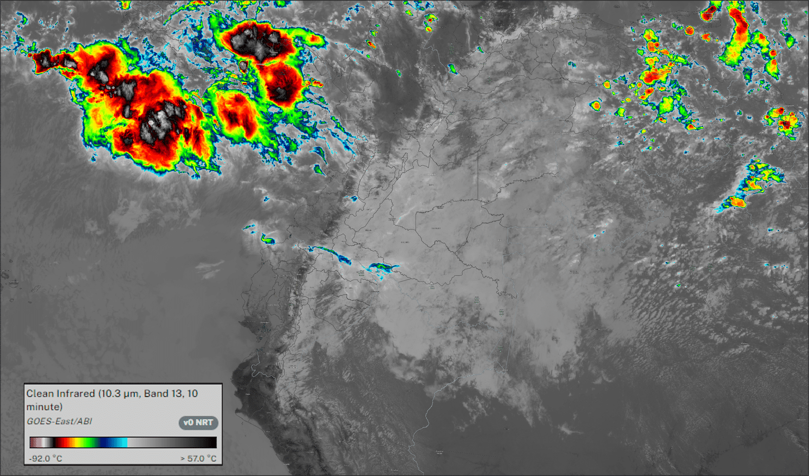{width="85%"}

---

## Imágenes de un Solo Canal: Reflectancia {.smaller}

A partir de la radiancia, se puede calcular la **reflectancia** (la proporción entre la radiación que incide sobre una superficie y la que se refleja).

Esta es la misma escena con la Banda 2 "Red Visible". La reflectancia se muestra en una escala de grises, donde el blanco representa los valores más altos (nubes). Aunque las nubes muy frías son menos obvias que en la imagen térmica, *todas* las nubes son más fáciles de analizar, especialmente sobre el océano.

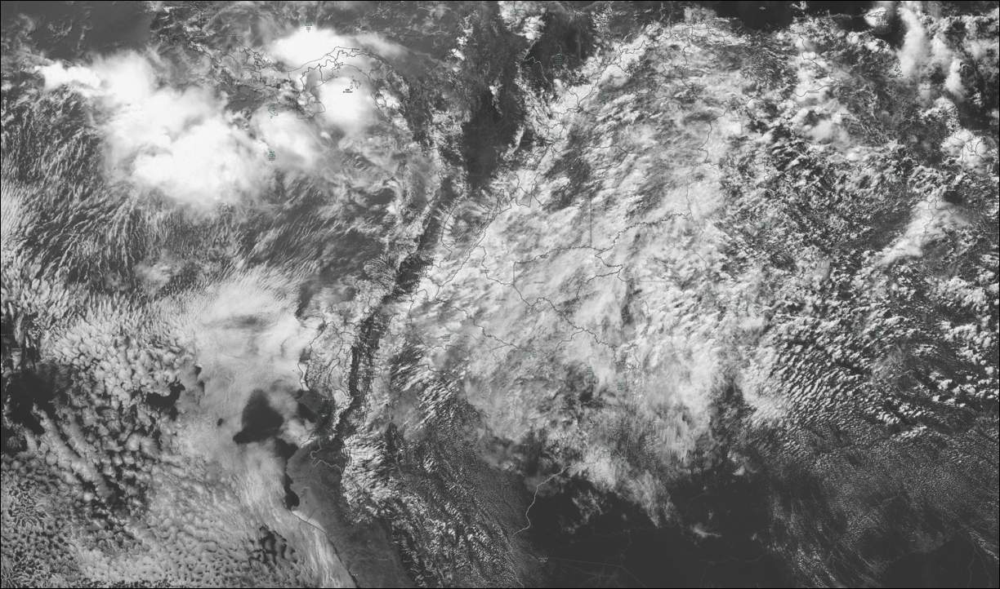{width="85%"}

---

## Imágenes en Color Verdadero (True Color) {.smaller}

::: columns
::: {.column width="50%"}
El *True Color* está diseñado para mostrar la Tierra **como la veríamos con nuestros propios ojos**. Se crea combinando canales sensibles a la luz visible roja, verde y azul (RGB).

**Diferencias por canal:**

* **Banda Azul:** Es más clara porque las longitudes de onda cortas se dispersan más en la atmósfera.
* **Banda Roja/Verde:** El agua las absorbe más, por lo que se ve más oscura en estos canales.
* **Nubes:** Similares en las tres bandas (su reflectancia no depende mucho de la longitud de onda).

Al combinarlas (producto RGB), el agua se ve azul, las nubes blancas y se distingue el suelo marrón.
:::

::: {.column width="50%"}
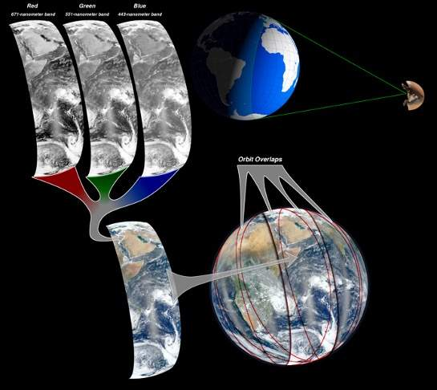{width="100%"}
:::
:::

---

## Imágenes en Falso Color (False Color) {.smaller}

::: columns
::: {.column width="50%"}
Mientras el color verdadero usa longitudes de onda visibles, las imágenes en **falso color** asignan longitudes de onda *no visibles* (como infrarrojo o ultravioleta) a los colores RGB para revelar características ocultas como gases o calor.

**Ejemplo: Incendio Forestal (Biscuit Fire)**

* **Izquierda (Color Verdadero):** El humo oscurece severamente el área quemada.
* **Derecha (Falso Color):** Usando canales Infrarrojo Cercano (NIR) y de Onda Corta (SWIR), podemos "ver a través" del humo. El área de tierra quemada resalta claramente en color púrpura.
:::

::: {.column width="50%"}
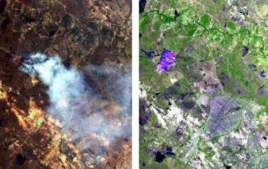{width="100%"}
:::
:::

## Visualización: Barra de Color vs. RGB {.smaller}

Hay una diferencia notable entre aplicar una **barra de color** a los datos satelitales para acentuar características específicas y usar un producto de imagen **RGB** (Rojo-Verde-Azul) para colorear una escena completa.

::: {.panel-tabset}

### 1. Barra de Color

::: columns
::: {.column width="40%"}
Una barra de color define un color de píxel específico para cada valor de los datos. 

Por ejemplo, una diferencia de temperatura de brillo de +5 K se define con un píxel amarillo, mientras que -5 K se define con un píxel azul.

 
*Fuente: Himawari-8 AHI*
:::
::: {.column width="60%"}
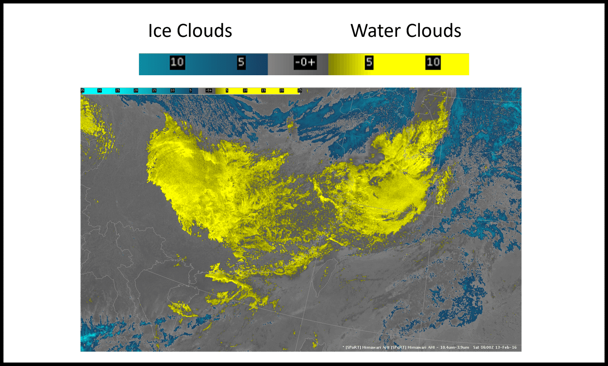{width="100%"}
:::
:::

### 2. Componentes RGB

::: columns
::: {.column width="40%"}
Alternativamente, en un producto RGB, cada píxel contiene un componente rojo, verde y azul. 

Se usa una banda (o diferencia de bandas) dentro de cada componente de color para identificar múltiples parámetros geofísicos en una sola imagen (ej., grosor, fase y altura de las nubes al mismo tiempo).

 
*Fuente: Himawari-8 AHI*
:::
::: {.column width="60%"}
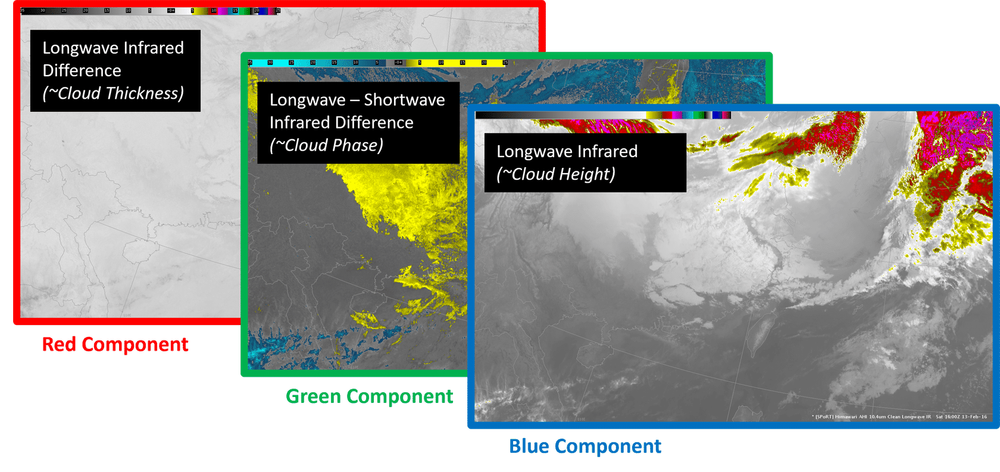{width="100%"}
:::
:::

### 3. Escala de Datos

::: columns
::: {.column width="40%"}
Luego, el rango del parámetro geofísico se escala (estira) entre el **negro** (es decir, sin color) y la **intensidad máxima** de color para su componente RGB correspondiente (es decir, rojo puro, verde puro o azul puro).

 
*Fuente: Himawari-8 AHI*
:::
::: {.column width="60%"}
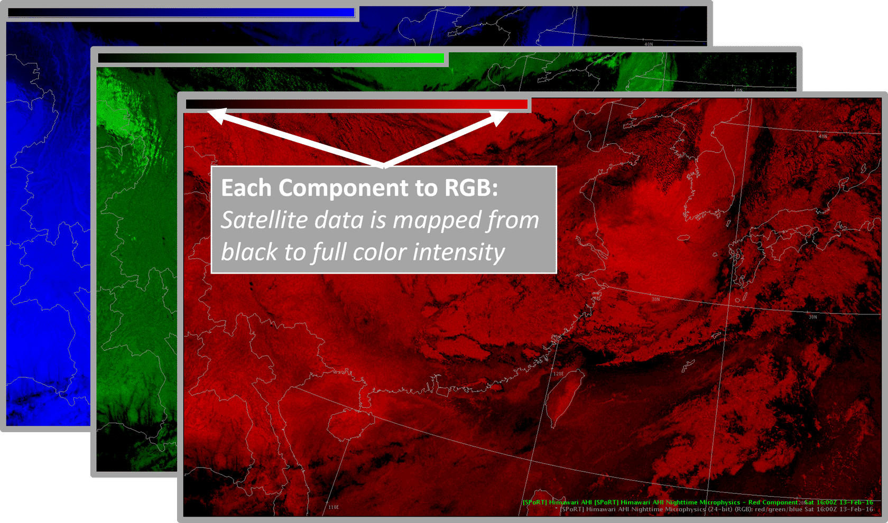{width="100%"}
:::
:::

### Resumen Final

::: columns
::: {.column width="40%"}
La combinación de las intensidades de los componentes de color en cada píxel determina el color final del píxel resultante y, por ende, el producto de imagen RGB definitivo.

 
*Fuente: Himawari-8 AHI*
:::
::: {.column width="60%"}
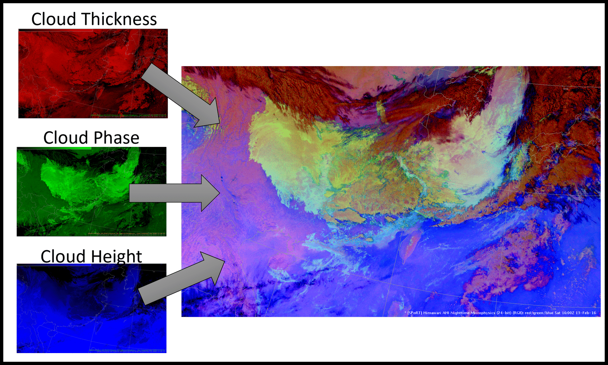{width="100%"}
:::
:::

:::

## Repaso: Productos de Imagen RGB {.smaller}

**Pregunta:** ¿Verdadero (1) o Falso (2)? Un producto de imagen RGB en **Falso Color** consiste en usar múltiples bandas satelitales en el proceso de construcción de la imagen, donde bandas particulares se asignan a las entradas de color rojo, verde o azul para obtener el producto final.

1. Verdadero
2. Falso

::: {.fragment}
::: {.callout-note style="font-size: 1.1em;"}
## Explicación Técnica
**Respuesta: (1) Verdadero**. 

A excepción del Color Verdadero (que imita lo que verían tus ojos desde el espacio), todos los demás productos RGB son Falso Color; es decir, los colores en la imagen no son los que tus ojos verían en la realidad. Además, crear una imagen RGB no es aplicar una barra de color, sino asignar bandas específicas a los canales rojo, verde y azul para componer la imagen.
:::
:::

 

::: {.fragment}
::: {.callout-tip icon="false"}
### Hacia el siguiente nivel...
Cuando vemos imágenes satelitales, podríamos asumir que provienen directamente del sensor, como una cámara fotográfica. Sin embargo, el procesamiento de datos de teledetección suele ser mucho más complejo. En la siguiente sección, exploraremos los **niveles progresivos de procesamiento de datos** y cómo se utilizan generalmente.
:::
:::

## Niveles de Datos Satelitales {.smaller}

Desde las detecciones sin procesar del sensor hasta los productos geofísicos listos para usar, existen varios pasos. La NASA describe estos pasos utilizando **Niveles de Procesamiento de Datos**. 

::: columns
::: {.column width="60%"}
Los usuarios eligen datos de estos niveles según su experiencia y aplicación. A medida que aumenta el nivel de procesamiento, se realiza más análisis:

* **Ventaja:** Los datos son más fáciles de entender y utilizar.
* **Desventaja:** Se pueden perder ciertos matices o detalles originales de los datos.

### El Inicio: Datos de Nivel-0
Comenzamos en el Nivel-0, con la **radiancia bruta** medida directamente por el sensor. Estos datos **no están procesados** y mantienen la resolución completa del satélite. Aunque los usuarios ocasionales rara vez interactúan con ellos, es el punto de partida para que los equipos científicos creen todos los demás productos.
:::

::: {.column width="40%"}
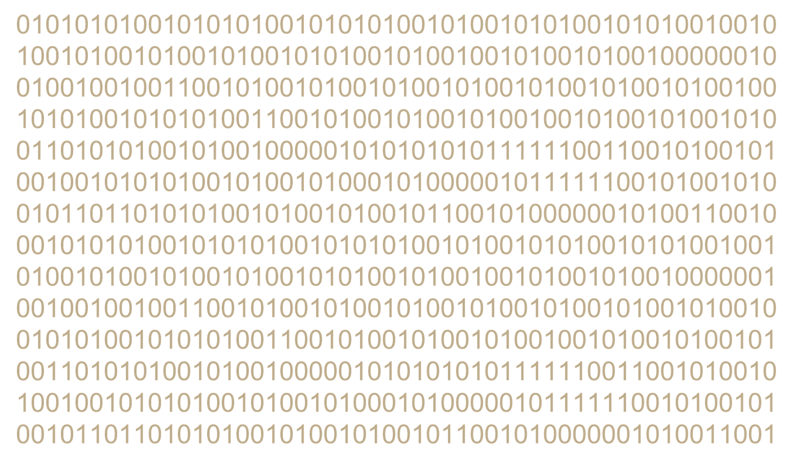{width="100%"}
:::
:::

---

## Progresión: Niveles 1 al 4 {.smaller}

::: {.panel-tabset}

### Nivel 1

::: columns
::: {.column width="45%"}
**Mapeo de los Datos sobre la Tierra**
En el Nivel-1, se usa información sobre la posición del satélite para referenciar los datos brutos del Nivel-0 a sus ubicaciones correspondientes en la Tierra (datos **georreferenciados**). 

Esta imagen muestra temperaturas de brillo de un solo canal del sensor VIIRS, geolocalizadas. Los tonos más oscuros son nubes o superficies más frías.
:::
::: {.column width="55%"}
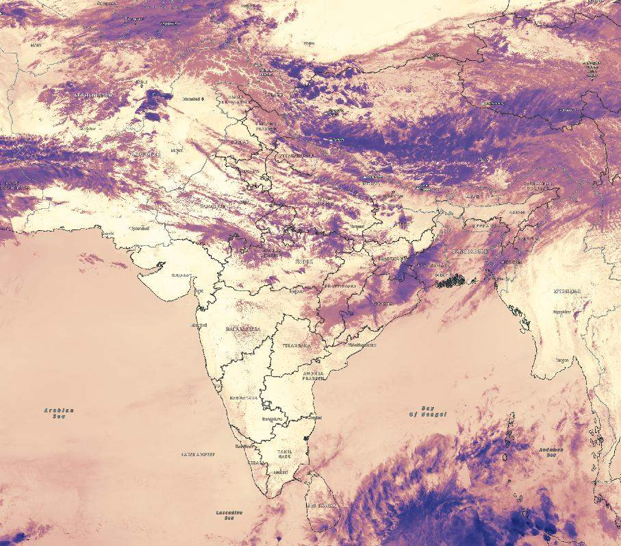{width="90%"}
:::
:::

### Nivel 2

::: columns
::: {.column width="45%"}
**Recuperación de Cantidades Geofísicas**
Aquí los datos se vuelven más útiles. Aplicamos algoritmos al Nivel-1 para derivar **cantidades geofísicas** (ej. temperatura, aerosoles). 

* **Características:** Los datos siguen en la resolución de píxel original del satélite (la más alta posible).
* **Limitaciones:** Habrá "huecos" blancos (datos faltantes) donde el algoritmo falló por nubes o superficies muy reflectantes. El tamaño del píxel puede variar según el ángulo del sensor.
:::
::: {.column width="55%"}
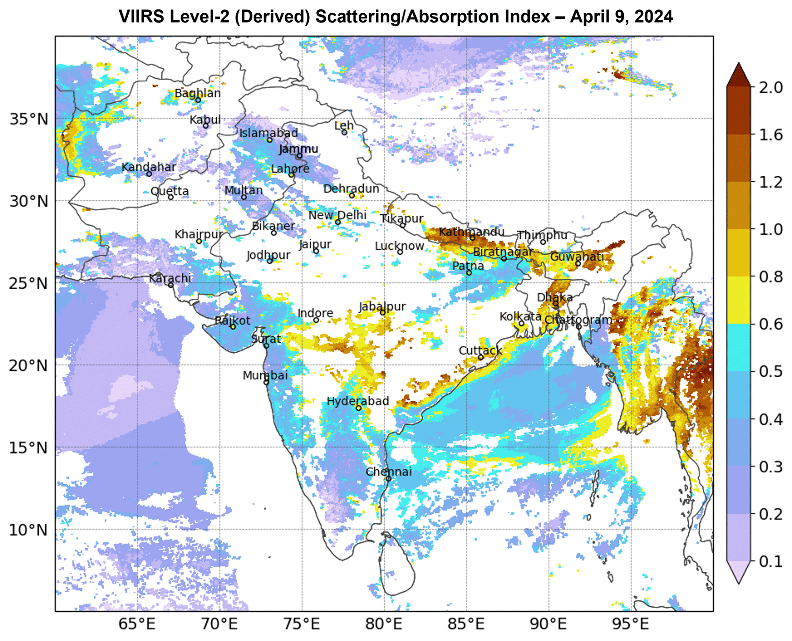{width="100%"}
:::
:::

### Nivel 3

::: columns
::: {.column width="45%"}
**Cuadrícula y Control de Calidad**
Para facilitar su uso, traducimos los datos del Nivel-2 a una **cuadrícula uniforme** en el espacio y el tiempo (ej. promediando todos los datos de un día en un mapa lat/lon).

También se aplica control de calidad (eliminando píxeles malos).

* ***Trade-off*:** Al promediar píxeles, la resolución espacial se vuelve más gruesa (*coarser*), pero el producto resultante es más preciso y continuo.
:::
::: {.column width="55%"}
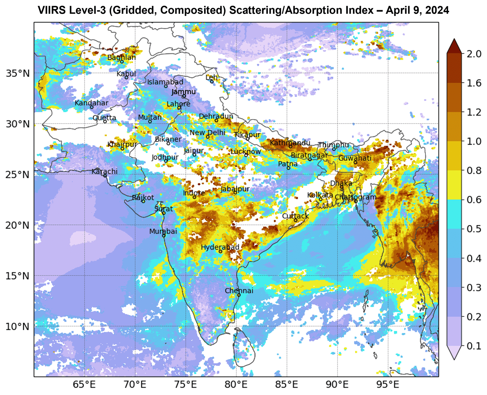{width="100%"}
:::
:::

### Nivel 4

::: columns
::: {.column width="45%"}
**Combinación con Información Externa**

Los productos de Nivel-4 combinan datos satelitales con otras fuentes, **especialmente modelos matemáticos**. 

Esto permite llenar los vacíos de datos (huecos) o inferir variables que el satélite no puede medir directamente. Aunque puede tener mayor incertidumbre por depender de modelos, es vital cuando se necesita una cobertura espacial y temporal completa.
:::
::: {.column width="55%"}
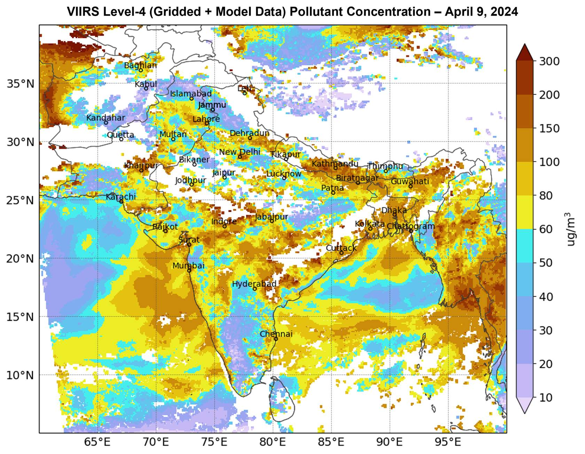{width="100%"}
:::
:::

:::

---

## Comparando los Niveles de Datos {.smaller}

 

::: columns
::: {.column width="30%" style="text-align: center; margin-top: 20px;"}
**Más difíciles de usar**

  

**Más fáciles de usar**
:::

::: {.column width="70%" style="margin-top: 15px;"}
* **L0: Radiancia Bruta** – Detecciones sin filtrar por el sensor.
  
* **L1: Geolocalizados y Calibrados** – Datos de brillo por canal.
  
* **L2: Campos Derivados por Algoritmos (desde L1)** – Parámetros geofísicos (ej., precipitación).
  
* **L3: En Cuadrícula (*Gridded*)** – Promediados espacial y/o temporalmente y mapeados en una cuadrícula uniforme.
  
* **L4: Satélite Combinado con Otras Fuentes** – A menudo se integran salidas de modelos.
:::
:::

---

## Recomendaciones y Acceso a Datos {.smaller}

::: columns
::: {.column width="50%"}
### Empezando con Datos Nivel-3
Típicamente los nuevos usuarios **comienzan con datos de Nivel-3**, ya que son más fáciles de usar al estar en una cuadrícula uniforme. 

* **El inconveniente:** La interpolación reduce la resolución espacial. Para aplicaciones que necesitan resolución muy alta (a nivel de calle o parcela), es necesario volver a los datos de **Nivel-2**.
:::

::: {.column width="50%"}
### Acceso a los Datos y Productos
Todos los datos de la NASA están disponibles para el público **sin costo** a través del portal web [NASA Earthdata](https://earthdata.nasa.gov/).

La NASA utiliza Centros de Archivo Activo Distribuido (DAACs) en EE. UU. para procesar, archivar, distribuir observaciones de la Tierra y apoyar a los usuarios con herramientas de análisis y asistencia técnica.
:::
:::

::: {.callout-note icon="false" style="margin-top: 20px; font-size: 0.9em;"}
Existe una amplia gama de tipos de datos disponibles. En la siguiente sección, consideraremos las **ventajas y desventajas** de usar la teledetección al estudiar los sistemas terrestres.
:::

## Forma de la Tierra y Datums (Opcional) {.smaller}

*Nota: Esta sección es opcional para los fundamentos, pero muy informativa al explorar conjuntos de datos de Nivel-3 y -4.*

::: {.panel-tabset}

### 1. El Geoide

::: columns
::: {.column width="45%"}
Aunque comúnmente se piensa que es una esfera, la Tierra no es perfectamente esférica. Su forma real es un **"geoide"**.

Un geoide es una forma modelada del campo de gravedad de la Tierra que representa el nivel medio del mar (si no existieran mareas, vientos y otros factores) y su extensión imaginaria bajo (o sobre) las áreas terrestres.
:::
::: {.column width="55%"}
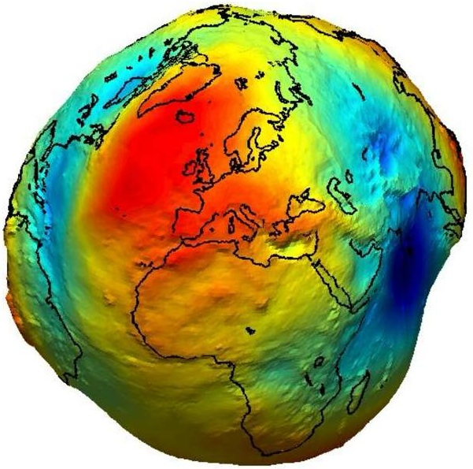{width="60%"}
:::
:::

### 2. El Esferoide

::: columns
::: {.column width="45%"}
Para que los datos espaciales se muestren de forma consistente, usamos un **esferoide elíptico** para aproximar la superficie de la Tierra.

Ningún esferoide encaja perfectamente, por lo que se usan varias aproximaciones. Cada una se ajustará mejor a una parte de la superficie que a otras. Estas se calculan usando un "datum" específico como referencia.
:::
::: {.column width="55%"}
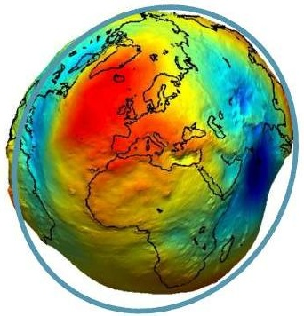{width="60%"}
:::
:::

### 3. Datums

::: columns
::: {.column width="45%"}
Un **datum** es un punto conocido en la superficie de la Tierra (o dentro de su geometría) que usamos como punto de referencia para todas las demás ubicaciones.

Debido a la forma irregular del planeta, el uso de datums es necesario para representar los datos espaciales con la mayor precisión posible.
:::
::: {.column width="55%"}
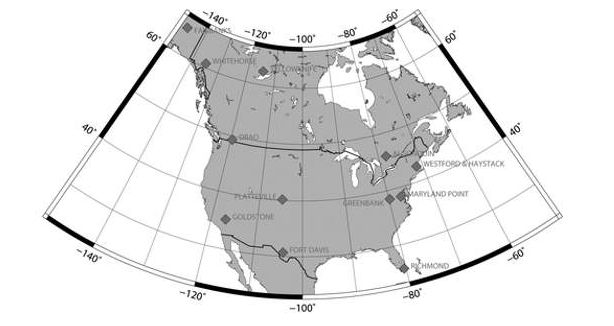{width="100%"}
:::
:::

:::

---

## Ventajas y Desventajas de la Teledetección {.smaller}

::: columns
::: {.column width="50%"}
### Ventajas
* **Cobertura amplia:** Datos disponibles y comparables sobre áreas geográficas grandes, remotas y a nivel global.
* **Consistencia:** Revisita de lugares con una frecuencia conocida y fiable (a menudo superior al monitoreo terrestre).
* **Análisis histórico:** Décadas de datos archivados permiten analizar cambios a largo plazo.
* **Variedad de detección:** Múltiples resoluciones (espectral, espacial, temporal y radiométrica).
* **Rapidez:** Mejor entrega y procesamiento para observaciones *casi en tiempo real*.
* **Accesibilidad:** Tendencia hacia el procesamiento automatizado y productos "listos para el análisis".
* **Bajo costo:** Imágenes, conjuntos de datos y herramientas de análisis accesibles sin costo.
:::

::: {.column width="50%"}
### Desventajas
* **Compromisos (*Trade-offs*):** Costos y limitaciones de diseño entre los 4 tipos de resoluciones.
* **Validación necesaria:** Se recomienda evaluación regional/local adicional para asegurar que los datos apliquen a condiciones específicas.
* **Cobertura limitada:** Algunas herramientas y datos no están disponibles para todas las regiones geográficas.
* **Interferencia atmosférica:** Nubes o partículas en el aire pueden reducir la precisión o bloquear la vista.
* **Curva de aprendizaje:** Aplicar los datos requiere procesamiento adicional y herramientas de visualización.
* **Volumen de información:** Grandes cantidades de datos en formatos complejos pueden requerir mucho tiempo de procesamiento.
* **Barrera técnica:** Algunos productos derivados son difíciles de usar para especialistas no técnicos.
:::
:::

---

## Repaso: Niveles y Usuarios {.smaller}

**Pregunta:** ¿Verdadero (1) o Falso (2)? Los diferentes niveles de datos de teledetección permiten que una amplia variedad de científicos, estudiantes y profesionales utilicen las observaciones de la Tierra para fundamentar decisiones en muchos campos de estudio y trabajo.

1. Verdadero
2. Falso

 

::: {.fragment}
::: {.callout-note style="font-size: 1.2em;"}
## Explicación
**Respuesta: (1) Verdadero.** Desde la interpretación de datos crudos de Nivel 0 y 1, hasta los sofisticados conjuntos de datos de Nivel 4 combinados con información no satelital (como modelos matemáticos), los diferentes niveles de datos satelitales están diseñados para satisfacer las necesidades de usuarios con **todos los niveles de experiencia y conocimiento** en teledetección.
:::
:::

## De Observaciones a Aplicaciones {.smaller}

A continuación, exploramos algunos ejemplos reales de cómo los datos satelitales procesados se transforman en aplicaciones que resuelven problemas del mundo real.

::: {.panel-tabset}

### 1. Precipitación Global

::: columns
::: {.column width="50%"}
**Monitoreo de Precipitación (GPM)**

* **Sensores:** 10 satélites LEO forman la Constelación GPM. Usan firmas espectrales en el rango de microondas.
* **Procesamiento:** * Inicia con recuperaciones de **Nivel-2** (tasas de precipitación).
  * Estas observaciones irregulares LEO se combinan con datos infrarrojos GEO.
  * Se interpolan en una cuadrícula consistente para crear IMERG, un producto de **Nivel-3**.
* **Resultado:** Un mapa global de precipitación actualizado cada 30 minutos.
:::
::: {.column width="50%"}

  <a href="https://svs.gsfc.nasa.gov/4283/" target="_blank">
    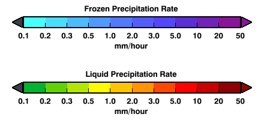
     <b>▶ Ver Animación en NASA SVS (4283)</b>
  </a>

:::
:::

### 2. Mapeo de Vegetación

::: columns
::: {.column width="50%"}
**Salud de los Cultivos (Landsat / Sentinel)**

* **Sensores:** Instrumentos con alta resolución espacial y espectral en el Visible e Infrarrojo Cercano (NIR).
* **El Producto:** El Índice de Vegetación de Diferencia Normalizada (**NDVI**). 
  * Valores cercanos a 0 (naranja/rojo) = inactiva/estresada.
  * Valores cercanos a 1 (verde) = sana/densa.
* **Estrategia:** Para mitigar la baja resolución temporal y la cobertura de nubes (píxeles grises), se combinan datos de 4 instrumentos diferentes, creando un producto compuesto sólido a lo largo del año.
:::
::: {.column width="50%"}

  <a href="https://svs.gsfc.nasa.gov/31267/" target="_blank">
     <b>▶ Ver Animación en NASA SVS (31267)</b>
  </a>

:::
:::

### 3. Calidad del Aire

::: columns
::: {.column width="50%"}
**Tendencias de NO₂ (2005-2022)**

* **Sensores:** LEO Sincrónicos al sol con resolución hiperespectral en Visible y UV (ej. OMI en el satélite Aura).
* **Procesamiento:** * El NO₂ es un contaminante derivado de la combustión. Su detección es un parámetro geofísico de **Nivel-2**.
  * Se promedian diariamente en productos de **Nivel-3** (mensuales/anuales). Si se combinan con modelos para estimar valores en superficie, son **Nivel-4**.
* **Resultado:** Muestra una disminución del 40-60% del NO₂ desde 2005 gracias a regulaciones ambientales, pese al aumento de población.
:::
::: {.column width="50%"}

  <a href="https://svs.gsfc.nasa.gov/5070/" target="_blank">
    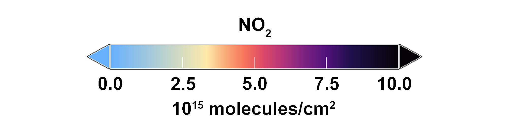
     <b>▶ Ver Animación en NASA SVS (5070)</b>
  </a>

:::
:::

### 4. Detección de Incendios

::: columns
::: {.column width="50%"}
**Fuego Activo (VIIRS)**

* **Sensores:** Las bandas NIR y SWIR detectan la radiación anormalmente intensa de los incendios.
* **Procesamiento:** Juntas, estas bandas derivan la intensidad del fuego, conocida como *Fire Radiative Power* (FRP), un producto de **Nivel-2**.
* **Ventaja:** Los datos provienen del sensor VIIRS (satélites Suomi NPP y NOAA-20). Su alta **resolución espacial de 375 m** capta detalles de intensidad y ubicación mucho mejor que sensores más antiguos como MODIS (1 km).
:::
::: {.column width="50%"}

  <a href="https://svs.gsfc.nasa.gov/5113/" target="_blank">
     <b>▶ Ver Animación en NASA SVS (5113)</b>
  </a>

:::
:::

:::

## Resumen del Módulo 4 {.smaller}

::: columns
::: {.column width="40%"}
En esta lección, examinamos la gama de niveles de productos de datos disponibles y exploramos casos de estudio reales que ilustran las increíbles aplicaciones de los datos satelitales.

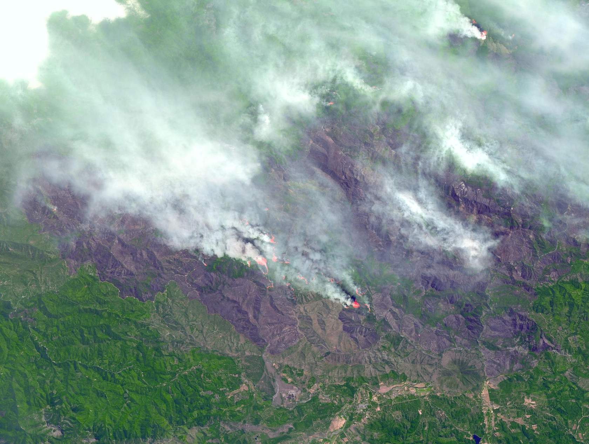{width="100%"}
:::

::: {.column width="60%"}
**Específicamente, en esta sección logramos:**

1. Revisar las formas comunes en que se muestran los datos, incluyendo imágenes en **color verdadero** y **falso color**.
2. Identificar los **5 niveles de procesamiento de datos** (cada nivel deriva del inferior):
   * **Nivel-0:** Datos crudos del instrumento.
   * **Nivel-1:** Datos georreferenciados y calibrados.
   * **Nivel-2:** Parámetro geofísico derivado de un algoritmo.
   * **Nivel-3:** Datos mapeados en una cuadrícula uniforme y con control de calidad.
   * **Nivel-4:** Datos combinados con información de modelos u otros sensores.
3. Reconocer que los datos de **Nivel-3 y 4 suelen ser más fáciles de usar** (por su cuadrícula), pero pueden carecer de la alta resolución del Nivel-2.
4. Considerar las **ventajas y desventajas** de la teledetección satelital.
5. Explorar **aplicaciones del mundo real** en precipitación, vegetación, calidad del aire e incendios forestales.
:::
:::

# Sistemas de Referencia de Coordenadas (CRS)

## Sistemas de Referencia de Coordenadas (CRS) {.smaller}

Todos los datos espaciales deben estar indexados (georreferenciados) a un punto fijo. Emparejar un píxel con una ubicación requiere un **CRS**.

::: {.panel-tabset}

## Concepto CRS

::: columns
::: {.column width="40%"}
Existen dos tipos de sistemas de coordenadas comúnmente utilizados en la teledetección:

1. **Geográficos**
2. **Proyectados**
:::
::: {.column width="60%"}
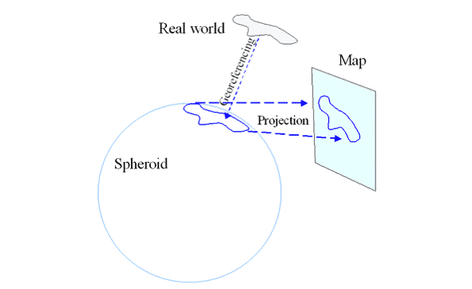{width="100%"}
:::
:::

## CRS Geográficos

::: columns
::: {.column width="40%"}
**Ventajas:**

* Mejores para representar toda la Tierra.
* Buenos para datos con gran extensión espacial.

**Desventajas:**

* Menos precisos para regiones específicas.
* Malos para datos de pequeña extensión espacial.
:::
::: {.column width="60%"}
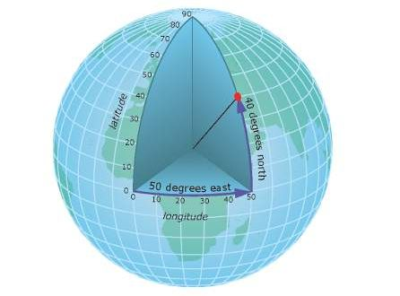{width="80%"}
:::
:::

## CRS Proyectados

::: columns
::: {.column width="40%"}
**Ventajas:**

* Mejores para ubicaciones específicas.
* Buenos para datos con pequeña extensión espacial.

**Desventajas:**

* La precisión se sesga hacia una ubicación específica.
* No son útiles para datos de gran extensión espacial.
:::
::: {.column width="60%"}
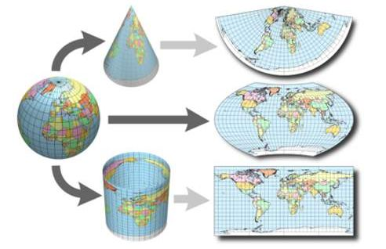{width="100%"}
:::
:::

:::

---

## Tipos de Sistemas de Coordenadas Proyectados {.smaller}

Existen diferentes formas de proyectar la esfera terrestre sobre un plano 2D, cada una con sus propios usos ideales:

::: columns
::: {.column width="50%"}
* **Cilíndricas** (Ejemplo: UTM)
  * Ideales para uso en Regiones Ecuatoriales.
  * La distorsión ocurre cerca de los polos.
  * Excelentes para extensiones espaciales medias.

* **Cónicas** (Ejemplo: Albers Equal Area Conic)
  * Ideales para uso en Regiones Polares.
  * La distorsión aumenta al alejarse del polo.

* **Planas / Azimutales** (Ejemplo: State Plane)
  * Proyectan datos sobre un plano plano.
  * Excelentes para pequeñas extensiones espaciales.
:::

::: {.column width="50%"}
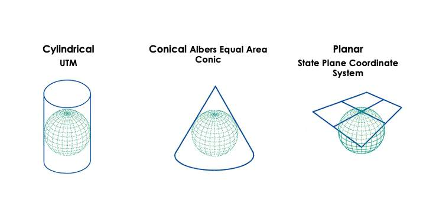{width="100%"}
:::
:::

# Referencias

## Referencias {.smaller}

Además de las capacitaciones previas de ARSET, consultamos los siguientes recursos al desarrollar este curso.

::: {.panel-tabset}

### General y M1

**Todos los Módulos**

* NASA. (s.f.) *Remote Sensing*. nasa.gov. [Enlace](https://www.nasa.gov/directorates/somd/space-communications-navigation-program/remote-sensing/)
* NASA. (1999, 17 de sept.) *Remote Sensing*. earthobservatory.nasa.gov. [Enlace](https://earthobservatory.nasa.gov/features/RemoteSensing/remote_08.php)
* NASA. (s.f.) *Scientific Visualization Studio Earth Science Galleries*. svs.gsfc.nasa.gov. [Enlace](https://svs.gsfc.nasa.gov/gallery/the-galleries/)
* NASA ARSET. (2017) *Fundamentals of Remote Sensing*. [Enlace](https://appliedsciences.nasa.gov/get-involved/training/english/arset-fundamentals-remote-sensing)

**Módulo 1: ¿Por qué Observaciones de la Tierra?**

* NASA Goddard Space Flight Center Conceptual Image Lab. (2016, 8 de feb.) *Earth: A System of Systems*. [Enlace](https://svs.gsfc.nasa.gov/30701/)

### Módulo 2

* NASA. (2016) *Tour of the Electromagnetic Spectrum*. [Enlace](https://smd-cms.nasa.gov/wp-content/uploads/2023/08/tour-of-the-ems-tagged-v7-0.pdf)
* NASA. (s.f.) *Remote Sensing*. earthdata.nasa.gov. [Enlace](https://www.earthdata.nasa.gov/learn/earth-observation-data-basics/remote-sensing)
* NASA. (s.f.) *The Electromagnetic Spectrum*. science.nasa.gov. [Enlace](https://science.nasa.gov/ems/)
* NASA. (s.f.) *Basics of Spaceflight Chapter 6: Electromagnetics*. [Enlace](https://science.nasa.gov/learn/basics-of-space-flight/chapter6-3/)
* USGS. (s.f.) *What is remote sensing and what is it used for?* [Enlace](https://www.usgs.gov/faqs/what-remote-sensing-and-what-it-used#:~:text=Remote%20sensing%20is%20the%20process,sense%22%20things%20about%20the%20Earth)
* GIS Geography. (s.f.) *Spectral Signature Cheatsheet in Remote Sensing*. [Enlace](https://gisgeography.com/spectral-signature/)
* ESA. (s.f.) *Spectral Signatures*. esa.int. [Enlace](https://www.esa.int/SPECIALS/Eduspace_EN/SEMPNQ3Z2OF_0.html)
* ESA. (s.f.) *Atmospheric Interference*. esa.int. [Enlace](https://www.esa.int/SPECIALS/Eduspace_EN/SEMUYP3Z2OF_0.html)
* NASA Goddard Space Flight Center Conceptual Image Lab. (2016, 20 de sept.) *The Electromagnetic Spectrum*. [Enlace](https://svs.gsfc.nasa.gov/20241/)

### Módulo 3

* NASA. (s.f.) *Remote Sensing*. Earthdata.nasa.gov. [Enlace](https://www.earthdata.nasa.gov/learn/earth-observation-data-basics/remote-sensing)
* NASA. (s.f.) *Instruments*. Earthdata.nasa.gov. [Enlace](https://www.earthdata.nasa.gov/data/instruments)
* NASA. (s.f.) *Remote Sensing*. nasa.gov. [Enlace](https://www.nasa.gov/directorates/somd/space-communications-navigation-program/remote-sensing/)
* NASA. (s.f.) *Landsat Science – Spectral Band Comparison Tool*. [Enlace](https://landsat.gsfc.nasa.gov/spectral-band-comparison-tool/)
* NASA. (s.f.) *LANDSAT 8*. landsat.gsfc.nasa.gov. [Enlace](https://landsat.gsfc.nasa.gov/satellites/landsat-8/#:~:text=Landsat%208%20launched%20on%20February,and%20Science%20(EROS)%20center)
* Petty, G.W. (2006). *A First Course in Atmospheric Radiation (2nd Ed.)*. Sundog Publishing.
* EOS Data Analytics (s.f.) *Spatial Resolution In Remote Sensing: Which Is Enough?* [Enlace](https://eos.com/blog/spatial-resolution/)
* NASA GSFC SVS. (2023, 12 de ene.) *Earth Observing Fleet (January 2023)*. [Enlace](https://svs.gsfc.nasa.gov/5061/)
* NASA SVS. (2018, 31 de ene.) *Geostationary Operational Environmental Satellite (GOES) East and West*. [Enlace](https://svs.gsfc.nasa.gov/4618/)
* NASA SVS. (2022, 28 de oct.) *JPSS-2 Planned Orbit and Swaths*. [Enlace](https://svs.gsfc.nasa.gov/5045/)
* NASA SVS. (2015, 1 de oct.) *Painting the World with Water (New Colorbar)*. [Enlace](https://svs.gsfc.nasa.gov/4369/)
* NASA SVS. (2024, 12 de sept.) *Hurricane Francine Hits Gulf Coast States and More*. [Enlace](https://svs.gsfc.nasa.gov/5380/)

### Módulo 4 y 5

**Módulo 4: ¿Cómo Puedo Usar los Datos?**

* NASA. (s.f.) *Data Processing Levels*. Earthdata.nasa.gov. [Enlace](https://www.earthdata.nasa.gov/learn/earth-observation-data-basics/data-processing-levels)
* NASA. (2014, 4 de mar.) *Why is that Forest Red and that Cloud Blue? How to Interpret a False-Color Satellite Image*. [Enlace](https://earthobservatory.nasa.gov/features/FalseColor)
* NASA (s.f.) *Global Precipitation Measurement*. gpm.nasa.gov. [Enlace](https://gpm.nasa.gov/)
* NASA (s.f.) *Landsat Science*. landsat.gsfc.nasa.gov. [Enlace](https://landsat.gsfc.nasa.gov/)
* NASA (s.f.) *Aura*. science.nasa.gov. [Enlace](https://science.nasa.gov/mission/aura/)
* NASA SVS. (2015, 31 de mar.) *Painting the World with Water*. [Enlace](https://svs.gsfc.nasa.gov/4283/)
* NASA SVS. (2023, 28 de nov.) *Landsat and Sentinel NDVI, 2022*. [Enlace](https://svs.gsfc.nasa.gov/31267/)
* NASA SVS. (2023, 6 de feb.) *Nitrogen Dioxide Over the United States, 2005-2022*. [Enlace](https://svs.gsfc.nasa.gov/5070/)
* NASA SVS. (2024, 1 de mar.) *Active Fires As Observed by VIIRS, 2023-Present*. [Enlace](https://svs.gsfc.nasa.gov/5113/)

**Módulo 5: Práctica con Worldview**

* NASA. (s.f.) *NASA Worldview*. worldview.earthdata.nasa.gov. [Enlace](https://worldview.earthdata.nasa.gov/?lg=false&t=2025-01-16-T15%3A23%3A41Z)

:::

##