Nota: Documento creado y mejorado a partir del documento "Guía de Entrenamiento Antena Catalyst.pdf" compartido para la clase por el estudiante *Carlos Esteban Aguilar V*.

# Introducción

El Trimble Catalyst DA2 es un receptor GNSS que provee exactitudes superiores (de métrica a submétrica) y que ha sido diseñado para integrarse con dispositivos móviles Android a través de Bluetooth. La principal característica del equipo es la compatibilidad con la tecnología de corrección **Trimble RTX**, lo que permite alcanzar exactitudes centimétricas en la colecta de datos en campo.

## Tecnología Trimble RTX

La tecnología Trimble RTX (Real-Time eXtended) permite realizar correcciones diferenciales en tiempo real sin necesidad de estaciones base ni infraestructura RTK (Figura 1). Esta tecnología funciona en cualquier parte del mundo con una conexión de datos activa.

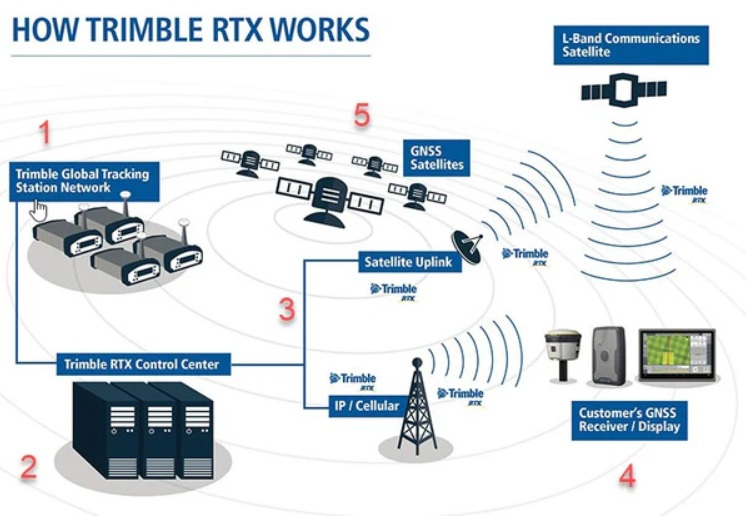

El esquema de funcionamiento del servicio RTX consta de cinco etapas fundamentales que garantizan la entrega del posicionamiento geodésico preciso:

1. **Red global de estaciones de rastreo (Trimble global tracking station network):** Conjunto de estaciones de referencia distribuidas a nivel mundial que monitorean continuamente las señales emitidas por las constelaciones satelitales.
2. **Centro de control (Trimble RTX control center):** La información observada por la red de estaciones es transmitida a servidores centrales. Mediante procesamiento avanzado, se modelan y calculan correcciones para los errores de reloj, las órbitas de los satélites y los retardos atmosféricos.
3. **Distribución de correcciones (Satellite uplink / IP / cellular):** Las correcciones modeladas se difunden hacia el terreno. La transmisión se ejecuta mediante satélites geoestacionarios de comunicaciones en banda L o a través de internet usando conectividad celular convencional.
4. **Receptor GNSS de campo (Customer's GNSS receiver / display):** Dispositivos móviles y antenas captan simultáneamente las señales GNSS directas y el flujo de correcciones RTX. Mediante algoritmos internos, el equipo procesa la información para determinar coordenadas con exactitudes de nivel centimétrico.
5. **Satélites GNSS (GNSS satellites):** Componente espacial conformado por los satélites de navegación (GPS, GLONASS, Galileo, BeiDou) que proveen la señal de radiofrecuencia base empleada tanto por la red de rastreo como por el receptor final.

La exactitud que provee depende del tipo de suscripción que se adquiera (Figura 2).

# Preparación del dispositivo móvil para colección de datos

## Instalación y configuración de aplicaciones

Instalación de la aplicación **Trimble Mobile Manager** así como la aplicación **Avenza Maps** en un dispositivo móvil.

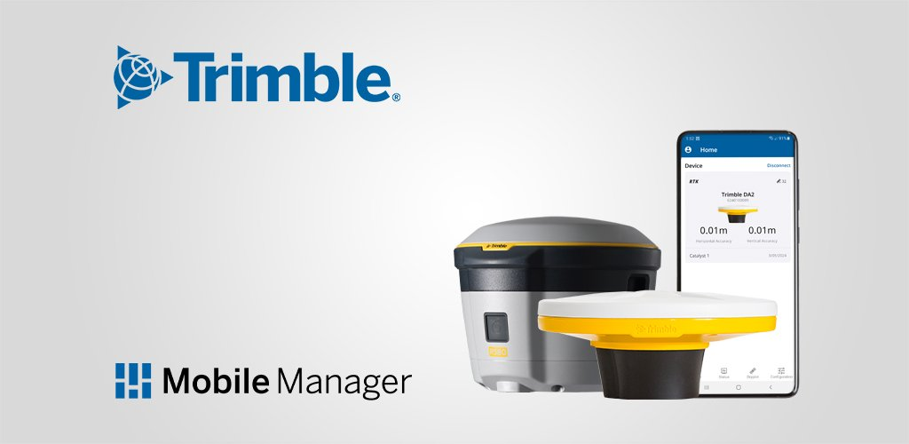

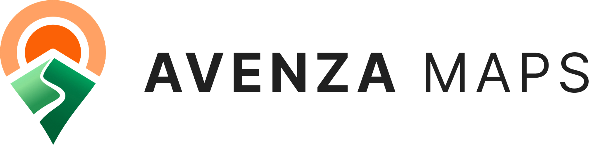{width=50%}

## Activación de ubicación simulada

En caso de colectar los datos desde un dispositivo Android es necesario seguir los siguientes pasos para activar **Trimble Mobile Manager** como **Aplicación de Ubicación Simulada** (*Mock Location App*).

Sin la opción *Mock Location App* habilitada en su Android, al abrir la aplicación **Trimble Mobile Manager** mostrará el mensaje desplegado en la Figura 7. Para verificar este mensaje, en TMM Se puede acceder a las opciones de Menú y seleccionar `Settings`. Ver Figura 5.

{width=40%}

Aparecerá la pantalla mostrada en la Figura 6. Seleccionar la opción `Configure Location Sharing`.

{width=40%}

El siguiente mensaje indica que es necesario configurar en su equipo Android las **opciones de desarrollador** y seleccionar la **Aplicación de Ubicación Simulada** antes de continuar:

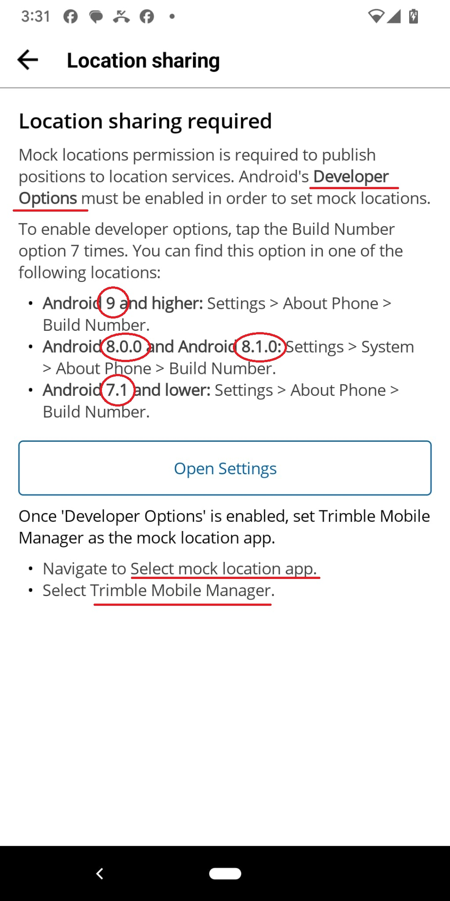{width=40%}

Para realizar esas configuraciones en su dispositivo Android, realice los pasos descritos en la Figura 7 dependiendo de la versión Android del sistema.

**Procedimiento genérico**

* Activar las opciones de desarrollador en Android (Ir a `Configuración` -> `Sistema y actualizaciones`).
* Ir a `Opciones de Desarrollador` y seleccionar `Seleccionar Aplicación de Ubicación Simulada` (`Select mock location app`) (Figura 8).

* Seleccionar **Trimble Mobile Manager** como **Aplicación de Ubicación Simulada** (Figura 9).

**Procedimiento en Pixel 3**

Habilite las opciones de desarrollador en su equipo:

* `Settings`

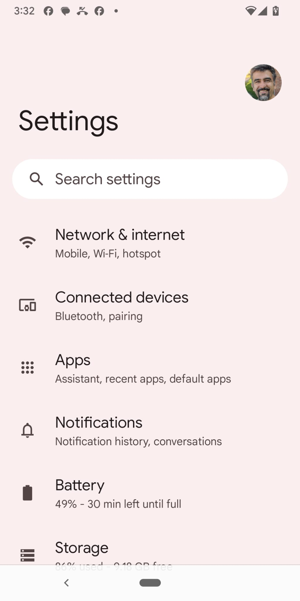{width=40%}

* `Settings` -> `About Phone`

{width=40%}

* Presione rápidamente 7 veces en `Build number`

{width=40%}

* Escriba la clave de su teléfono

* Aparecerá un mensaje temporal: **You are a developer**

Seleccionar Aplicación de Ubicación Simulada:

* `Settings` -> `System` -> `{} Developer Options` -> `Select mock location app`
* y seleccione `Mobile Manager`

# Funcionamiento del Trimble Catalyst DA2

## Contenido de la caja

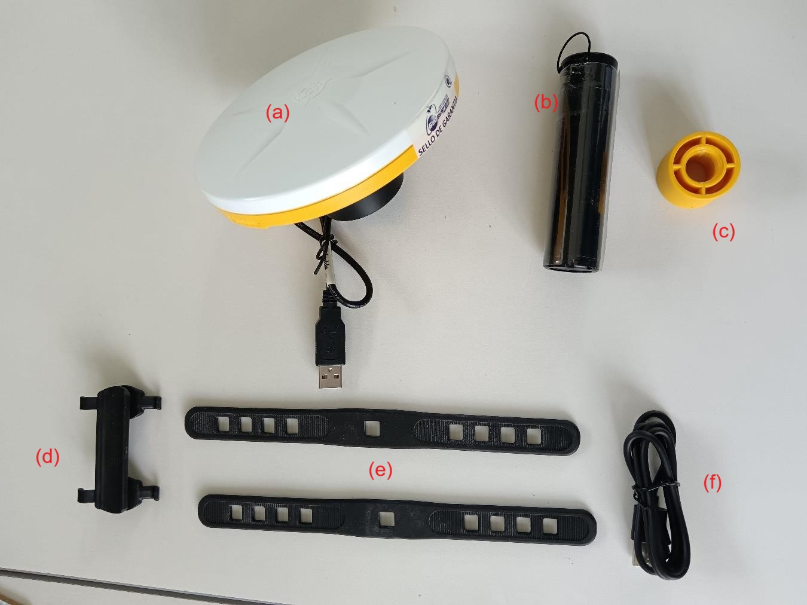

a) Receptor GNSS
b) Power bank
c) Adaptador para bastón de topografía
d) Abrazadera de plástico
e) Correas de caucho para adaptar bastón de topografía
f) Cable de carga de power bank

## Pasos para su uso

* Asegúrese que la batería de su Catalyst DA2 tenga suficiente carga.
* Sincronice su dispositivo android con el Catalyst DA2
    * Encender el Catalyst DA2 
    * Activar el Bluetooth en el dispositivo móvil.
    * Emparejar los dispositivos

{width=40%}

* Abrir la aplicación Trimble Mobile Manager (TMM) y presione el botón `Select` para seleccionar la antena previamente emparejada por Bluetooth.

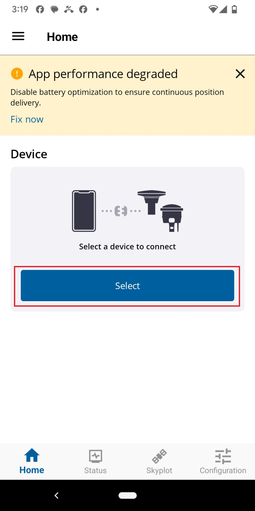{width=40%}

* El sistema pedirá las credenciales. Se debe iniciar sesión con Trimble ID y verificar la licencia activa.

{width=40%}

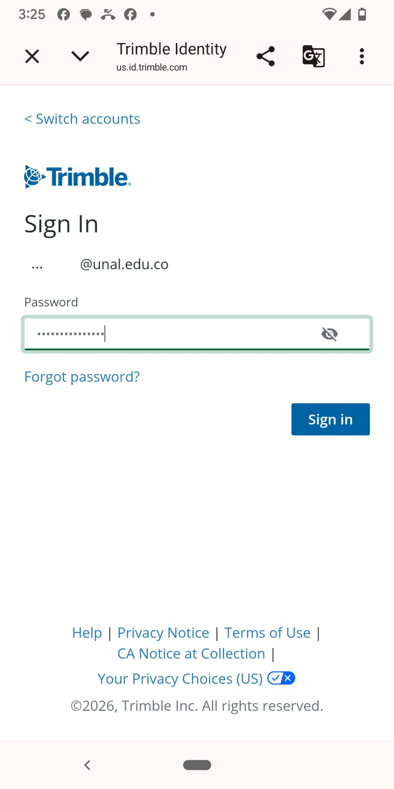{width=40%}

* Conectar el DA2 en TMM y confirmar la conexión GNSS. Después de un registro exitoso, la pantalla de inicio mostrará ahora la antena Catalyst DA2

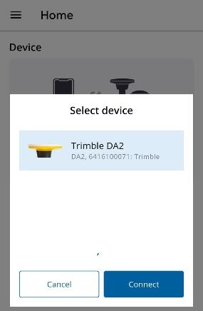

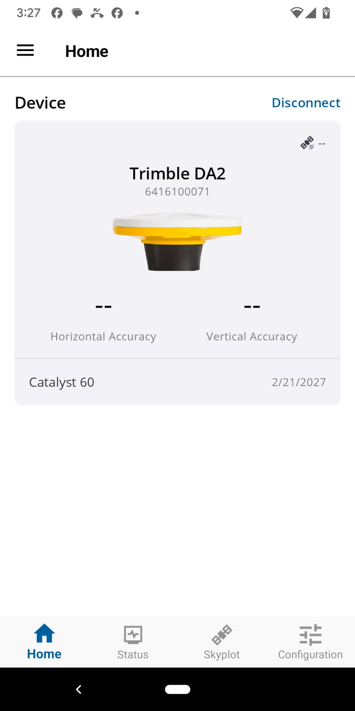{width=40%}

* Esperar la convergencia y validar la exactitud posicional del dispositivo.

## Opciones de configuración antes de la colecta de datos

La correcta parametrización del sistema es fundamental para garantizar la interoperabilidad de los datos con el marco geodésico nacional. Antes de iniciar la captura en campo, se deben verificar los siguientes ajustes en la sección de configuración.

**Selección del marco de referencia (GNSS output)**

La aplicación ofrece dos variantes para el sistema de referencia nacional. La elección debe basarse en la vigencia normativa:

* **MAGNA-SIRGAS:** Esta opción generalmente refiere a la época de referencia original (1995.0). Su uso en proyectos actuales no es recomendado, ya que no contempla los efectos del desplazamiento tectónico acumulado durante las últimas tres décadas.
* **MAGNA-SIRGAS(2018) (EPSG: 4686):** Es la selección obligatoria para cualquier proyecto en territorio colombiano. Corresponde a la actualización definida en la Resolución 715 de 2018 del IGAC, permitiendo que las coordenadas obtenidas sean consistentes con la Red Geodésica Nacional activa.

**Definición del modelo de referencia vertical (Geoid)**

El software permite seleccionar la superficie de referencia para el cálculo de alturas físicas. La precisión vertical dependerá directamente de esta elección:

* **Colombia Geoid 2004:** Se debe seleccionar esta opción específica en el menú desplegable. Este modelo es la implementación digital del **GEOCOL2004**, el modelo geoidal gravimétrico oficial desarrollado para Colombia. Al utilizar datos de gravedad locales, ofrece una precisión significativamente superior en la conversión de alturas elipsoidales a ortométricas dentro del territorio nacional.
* **EGM96 (Global):** No se considera una opción óptima para aplicaciones de ingeniería en Colombia. Al ser un modelo global de baja resolución, omite variaciones locales del campo gravitatorio, especialmente críticas en las zonas cordilleranas, lo que introduce errores métricos en la altura final.
* **GEOID18 Colombia:** (No disponible) En la configuración de Trimble para Colombia, este modelo representa la evolución hacia superficies de referencia de mayor resolución y precisión (modelos híbridos). Si el flujo de trabajo exige los estándares más rigurosos de la geodesia moderna y el software **permite su activación**, es la opción preferencial sobre modelos anteriores.

### Determinación del método de medición (Measurement method)

El punto de referencia vertical debe coincidir con el accesorio físico utilizado para soportar la antena Trimble Catalyst DA2. La omisión de este ajuste genera un error sistemático en la elevación de todos los puntos capturados.

* **Bottom of antenna mount:** Configuración estándar cuando la antena está instalada sobre un jalón convencional o un trípode. La altura ingresada por el operador debe medirse desde la marca en el terreno hasta la base del tornillo de montaje (parte inferior de la antena).
* **Bottom of Catalyst antenna handle:** Selección exclusiva para el uso del accesorio de mano (handle) de Trimble. El sistema compensa automáticamente el desfase vertical interno del accesorio.
* **Yellow/white split line:** Utilizado para el registro de la altura inclinada (slant height) mediante el uso de la cinta métrica integrada en ciertos soportes, facilitando la medición cuando el acceso vertical directo está obstruido.

**Resumen de configuración recomendada**

Para la ejecución de levantamientos técnicos en Colombia, se debe asegurar la siguiente configuración en el receptor:

| Campo de configuración | Valor seleccionado | Justificación técnica |
| :--- | :--- | :--- |
| GNSS output | MAGNA-SIRGAS(2018) | Cumplimiento Res. 715 de 2018 (IGAC). |
| Geoid | Colombia Geoid 2004 | Implementación local de GEOCOL2004. |
| Measurement method | Bottom of antenna mount | Uso estándar con jalón de 2.00 m. |
| GNSS correction source | Auto / Trimble RTX | Asegura convergencia submétrica/centimétrica. |

# Alternativas de software para levantamiento en campo

La restricción de Avenza Maps para cargar cartografía personalizada sin suscripción representa un cuello de botella logístico. Es más eficiente migrar hacia plataformas que gestionen datos vectoriales estructurados en lugar de depender de formatos estáticos de visualización.

## Opciones de aplicaciones de captura 

A continuación, se presentan herramientas de código abierto y de uso libre ampliamente validadas en operaciones geomáticas.

* **QField:** Operando como el cliente móvil de QGIS, permite una integración directa con entornos de escritorio para proyectos de mayor complejidad.
    * Facilita la configuración de formularios relacionales, dominios de valor y reglas de topología antes de la salida a campo.
    * Opera nativamente con contenedores GeoPackage (GPKG), eliminando la dependencia de múltiples archivos y permitiendo el renderizado de simbología compleja en campo.
    * Consume la ubicación simulada del sistema operativo sin requerir configuración adicional de puertos COM virtuales.

* **SW Maps:** Herramienta enfocada específicamente en topografía y captura de datos con receptores GNSS externos.
    * Permite la importación directa de datos vectoriales (shapefiles, KMZ, GPKG) y la configuración de mapas base mediante conexiones a servicios WMS o almacenamiento en caché local (MBTiles).
    * Almacena automáticamente la metadata del posicionamiento en la tabla de atributos, registrando variables críticas como HRMS, VRMS y el número de satélites en el momento exacto de la captura del vértice.

* **KoboToolbox:** Plataforma basada en el estándar ODK, diseñada fundamentalmente para la recolección exhaustiva de datos mediante formularios complejos.
    * Destaca en la captura estructurada de atributos condicionales, reglas de dependencia (skip logic) y variables cualitativas.
    * Su integración con la ubicación simulada permite capturar coordenadas con exactitud RTX, registrando la ubicación como un atributo más dentro del formulario, aunque su interfaz no está orientada a la visualización cartográfica ni a la interacción topológica.

## Análisis comparativo de herramientas

| Característica evaluada | QField | SW Maps | KoboToolbox |
| :--- | :--- | :--- | :--- |
| **Enfoque principal** | SIG móvil y topología espacial | Topografía y captura de precisión | Recolección de datos y encuestas |
| **Gestión de geometrías** | Avanzada (edición de nodos, polígonos) | Intermedia (puntos, líneas continuas) | Básica (coordenada como atributo) |
| **Registro de metadata GNSS** | Requiere configuración de variables | Automático (HRMS, VRMS nativo) | Posible mediante código XLSForm |
| **Visualización cartográfica** | Alta (renderizado exacto de escritorio) | Media (servicios WMS, ráster local) | Muy limitada (mapa base referencial) |

## Validación de la cadena de corrección GNSS

El uso de aplicaciones de terceros exige verificar que las correcciones RTX estén fluyendo correctamente hacia el software de captura.

* Mantener Trimble Mobile Manager en ejecución en segundo plano para asegurar el enlace ininterrumpido y la convergencia de la señal.
* Asegurar que el motor de ubicación interno de QField, SW Maps o KoboCollect esté configurado para leer los "Servicios de ubicación de Android" (Location Services) y no intente establecer una conexión Bluetooth paralela con el DA2, lo cual generaría conflictos de puerto.

## Recomendación para el levantamiento en vía

Para el objetivo específico de registrar puntos a lo largo del borde de una vía, el requerimiento central es la captura geométrica secuencial y el control topológico, no el diligenciamiento de cuestionarios extensos. Por esta razón, KoboToolbox se descarta para esta operación en particular.

La herramienta recomendada es **SW Maps**. Su principal ventaja para este caso de uso radica en su simplicidad operativa y su capacidad para registrar automáticamente los valores de dilución de precisión (HRMS y VRMS) para cada punto capturado sobre el borde de la vía, garantizando el control de calidad geodésica sin requerir configuraciones complejas previas. Alternativamente, si se requiere visualizar el trazado geométrico en tiempo real interactuando con capas base vectoriales preexistentes, **QField** resulta la opción metodológica más robusta.

# SW Maps

[Video guía](https://youtu.be/syvzv8sMBSI) de uso rápido en español:  `https://youtu.be/syvzv8sMBSI`

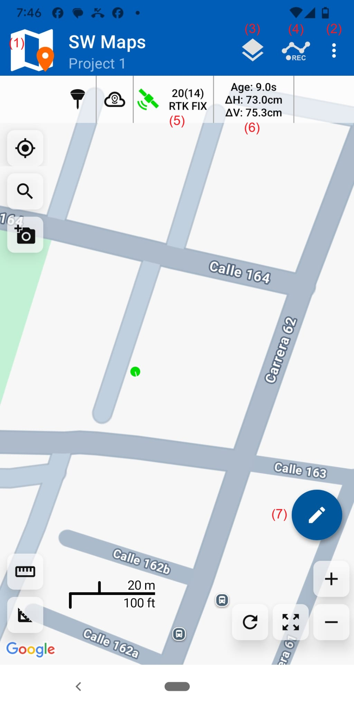{width=40%}

* (1) Menú Principal
* (2) Menú de Secundario (`Projects` y `Take Photo`)
* (3) Lista de Capas
* (4) Capturar datos GNSS (`Record Feature` (Punto) y `Record Track` (línea))
* (5) Skyplot GNSS
* (6) Precisión de la captura GNSS
* (7) Opciones adicionales de captura (GNSS y Dibujo)

{width=40%}

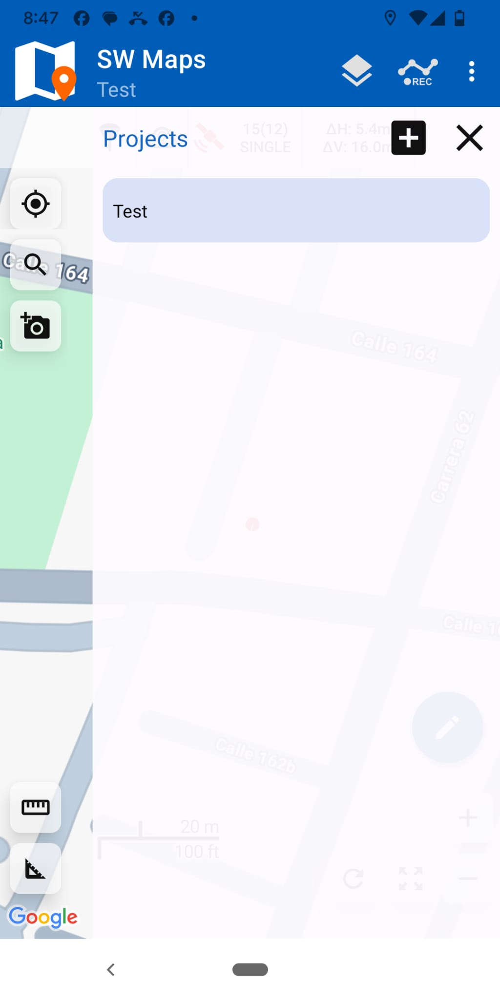{width=40%}

{width=40%}

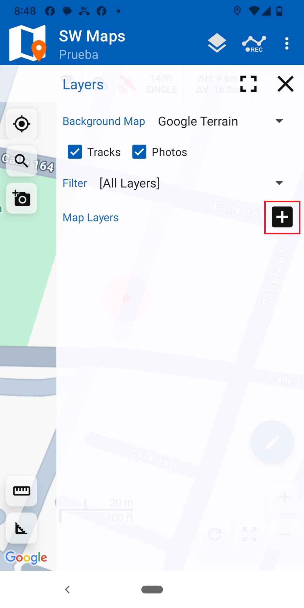{width=40%}

{width=40%}

{width=40%}

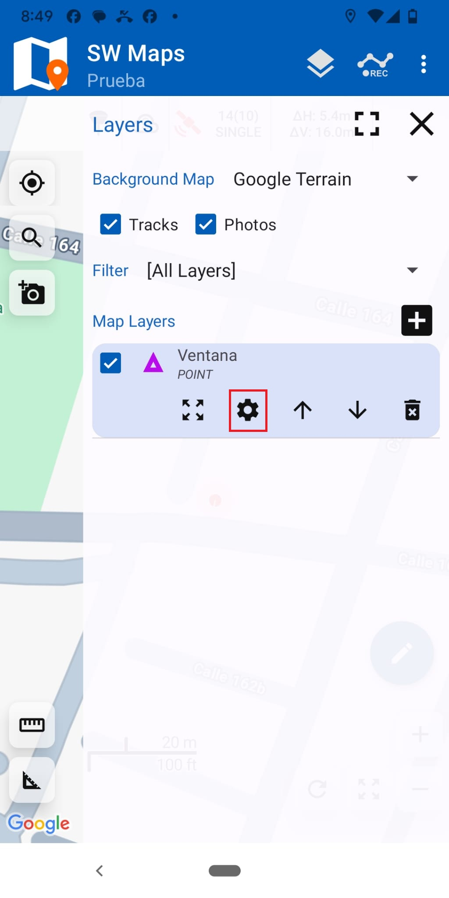{width=40%}

{width=40%}

{width=40%}

{width=40%}

{width=40%}

{width=40%}

{width=40%}

{width=40%}

{width=40%}

{width=40%}

{width=40%}

{width=40%}

{width=40%}

{width=40%}

{width=40%}

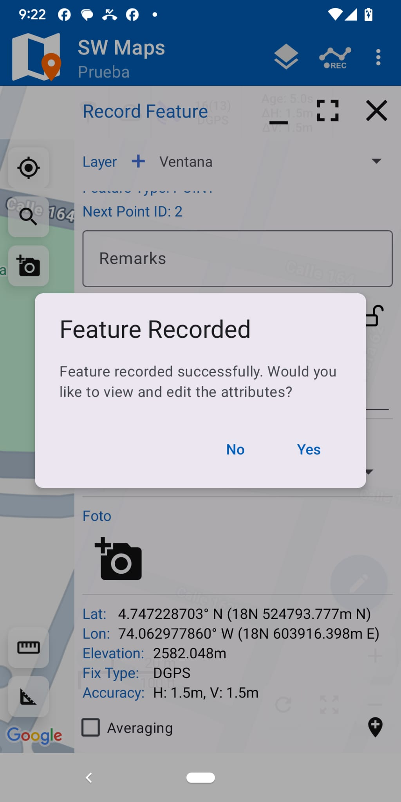{width=40%}

{width=40%}

{width=40%}

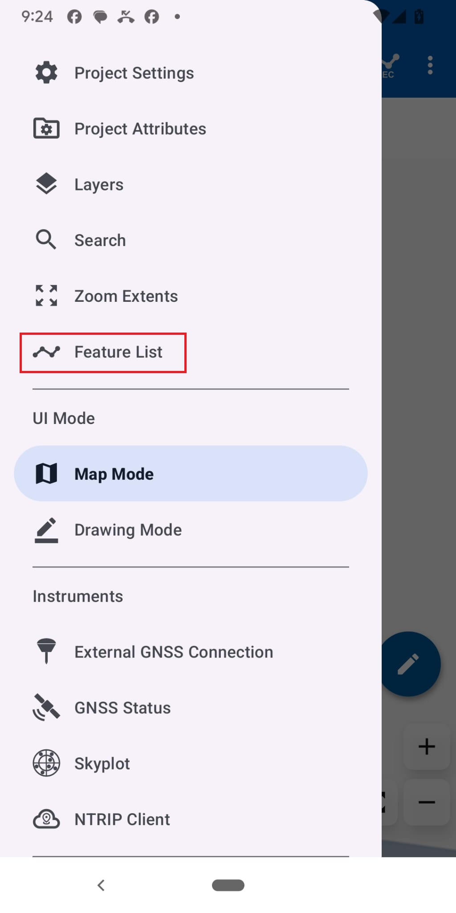{width=40%}

{width=40%}

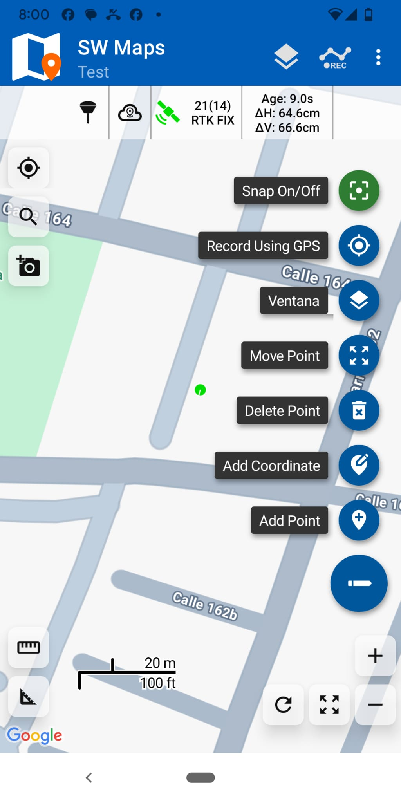{width=40%}

{width=40%}

{width=40%}

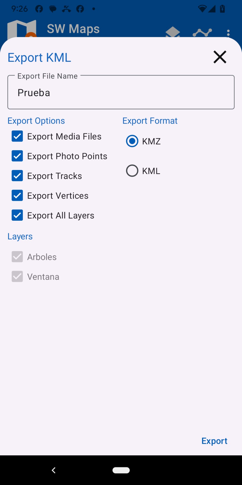{width=40%}

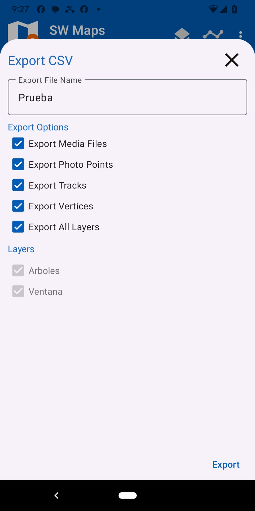{width=40%}

{width=40%}

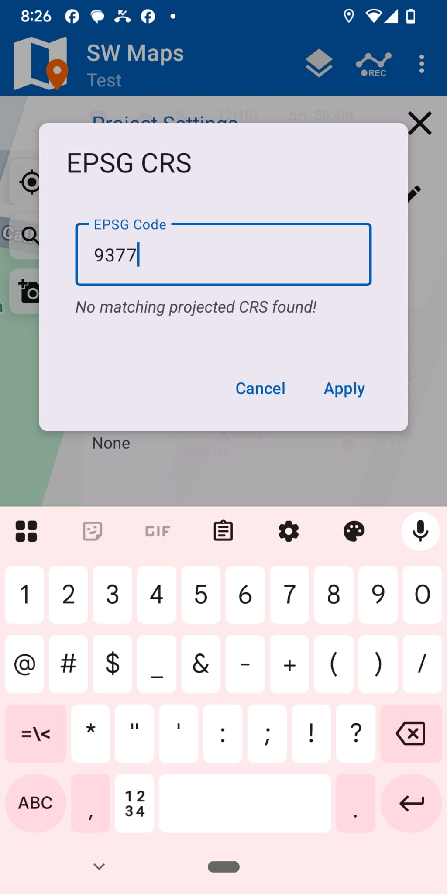{width=40%}
